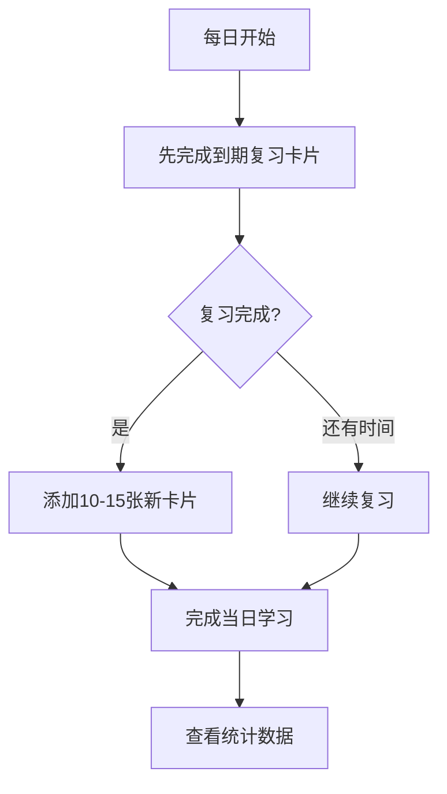
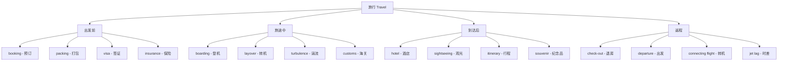

## 九、词汇记忆方法详解

掌握了词汇学习的认知原理之后，接下来需要的是**可落地的记忆方法**。本章详细介绍九种经过科学验证或实践检验的词汇记忆方法，每种方法都包含原理说明、操作步骤、适用场景、工具推荐和常见误区。你不需要全部使用——根据自身学习风格和目标语言的特点，选择2-3种方法组合使用效果最佳。

### 9.1 间隔重复法

#### 9.1.1 原理回顾

间隔重复（Spaced Repetition）基于艾宾浩斯遗忘曲线的发现：记忆衰减的速度先快后慢。在即将遗忘的节点进行复习，能够以最小的时间成本获得最大的记忆保持效果。认知心理学中将这种效应称为"间隔效应"（Spacing Effect），由 Ebbinghaus（1885）首次通过实验量化证实。

其核心机制涉及两个关键认知过程：

- **提取练习效应（Retrieval Practice Effect）**：每次主动回忆都是一次"记忆提取"，提取过程本身会强化记忆痕迹。Roediger & Karpicke（2006）的研究表明，测试（提取）比重复阅读的记忆效果高出40-50%。
- **合意困难（Desirable Difficulty）**：Bjork（1994）提出，在记忆略有衰退时进行回忆，虽然更费力，但正是这种"费力"让记忆变得更牢固。间隔重复恰恰利用了这一原理——不在刚学完时复习，而是在记忆开始模糊时复习。

#### 9.1.2 操作步骤

**第一步：选择工具**

| 工具 | 类型 | 核心特点 | 适合人群 |
|------|------|---------|---------|
| Anki | 开源软件 | 高度自定义、插件丰富、跨平台 | 愿意投入时间配置的深度用户 |
| SuperMemo | 商业软件 | 最早的SRS算法、算法精确度最高 | 追求极致效率的用户 |
| Quizlet | 在线平台 | 界面美观、共享卡组丰富 | 偏好简单易用的初学者 |
| 墨墨背单词 | 移动端APP | 中文优化好、内置词库 | 中国英语学习者 |
| Mnemosyne | 开源软件 | 轻量简洁、统计功能好 | 喜欢极简风格的用户 |
| RemNote | 笔记工具 | 笔记+闪卡一体化 | 需要将学习笔记转化为记忆卡的用户 |

**第二步：设计卡片**

卡片设计是间隔重复效果的最大变量。好的卡片遵循以下原则：

┌─────────────────────────────────────────────────────┐
│                    卡片设计原则                        │
├─────────────────────────────────────────────────────┤
│ 1. 最小信息原则：一张卡片只测一个知识点               │
│ 2. 完整语境：包含例句，而非孤立单词                   │
│ 3. 主动回忆：问题引导思考，而非直接给出答案           │
│ 4. 多角度制卡：同一单词制作多张卡片                   │
│ 5. 个人化：加入自己的例句和记忆提示                   │
└─────────────────────────────────────────────────────┘

**一张好卡片 vs 一张坏卡片的对比：**

坏卡片（正面: abandon，背面: 放弃、抛弃）——只有中英对照，缺乏语境，属于浅层加工。

好卡片的设计是**一词多卡**：

| 卡片编号 | 正面（问题） | 背面（答案） |
|---------|-------------|-------------|
| 卡1 | "The sailors had to _____ the sinking ship." 填入正确的词 | abandon（抛弃、放弃）——水手们不得不弃船 |
| 卡2 | abandon 的三个常见含义是什么？ | ① 抛弃（abandon a plan）② 放弃（abandon hope）③ 放纵（abandon oneself to pleasure） |
| 卡3 | "放弃希望"用英语怎么说？ | abandon hope / give up hope |
| 卡4 | 请听音频后拼写出这个单词：🔊 [abandon发音] | abandon |

**第三步：制定每日学习流程**

具体时间分配建议：

- **复习旧卡片**：占总学习时间的70-80%。Anki会自动安排到期卡片，每天打开先做复习。
- **学习新卡片**：占总学习时间的20-30%。初学者每天10-15个新词，中级学习者15-20个，高级学习者20-30个。
- **每日总时长**：15-30分钟为宜。超过45分钟的SRS学习容易产生疲劳和厌倦。

**第四步：评估与调整**

Anki的评估按钮有四个选项：

| 按钮 | 含义 | 何时使用 | 对间隔的影响 |
|------|------|---------|-------------|
| Again（重来） | 完全不记得或回忆错误 | 想不起来，或答案错误 | 间隔重置为最短 |
| Hard（困难） | 勉强回忆起来，非常费力 | 想了很久才想起来 | 间隔略有增长 |
| Good（良好） | 经过短暂思考后正确回忆 | 1-3秒内想起来 | 间隔正常增长 |
| Easy（简单） | 立即、轻松回忆 | 看到问题马上就知道答案 | 间隔大幅增长 |

**关键原则**：诚实评估。不要因为"好像记住了"就点Good——如果回忆过程很费力，应该点Hard。合意困难正是在"有点费力"的回忆中产生的。

#### 9.1.3 常见误区

**误区一：每天添加太多新卡片。** 一开始充满热情，每天加50个新词，结果两周后每天需要复习300+张卡片，不堪重负而放弃。正确做法是保持稳定的新增量（10-15个/天），让复习量在可控范围内。

**误区二：卡片设计过于简单。** 正面英文、背面中文的卡片形式虽然制作快速，但属于最低效的记忆方式。这种卡片只训练了"再认"（recognition），而非"回忆"（recall）。应该设计需要主动思考才能回答的卡片。

**误区三：中断后放弃。** 间隔中断（出差、生病、假期）后回来面对堆积的复习量，很多人选择放弃或重新开始。正确做法是设置每日复习上限（如每天最多200张），分几天消化积压。

**误区四：忽视音频。** 只看不听的卡片会导致"认得出、听不懂"的问题。每张卡片至少应该包含音频，训练听力识别与拼写的关联。

#### 9.1.4 进阶技巧

**Image Occlusion（图片遮挡）**：Anki插件，适合记忆地图、图表、语法结构等视觉化信息。例如将一张语法表格的某些格子遮住，让你回忆被遮住的内容。

**Cloze Deletion（完形填空）**：在句子中挖空，训练语境中的词汇回忆。

{{c1::Abraham Lincoln}} delivered the {{c2::Gettysburg Address}} in {{c3::1863}}.

**Frequency-Based Deck（词频优先）**：按词频排序制作卡片，优先学习高频词。英语学习推荐使用COCA（Corpus of Contemporary American English）词频表，前3000词覆盖约90%的日常文本。

---

### 9.2 语境记忆法

#### 9.2.1 原理

语境记忆法基于认知心理学中的**编码特异性原理（Encoding Specificity Principle）**——Tulving & Thomson（1973）发现，信息的记忆效果与编码时的上下文密切相关。在语境中学到的单词，回忆时也会更容易被语境线索激活。

语言学层面，Nation（2001）的研究表明，在语境中习得的词汇比孤立背诵的词汇在**搭配准确性**和**语用适当性**上高出60%以上。原因在于语境同时编码了词汇的形式、意义和用法三个维度，实现了"一次学习，三重收获"。

#### 9.2.2 阅读中的语境记忆

**窄读法（Narrow Reading）**：集中阅读同一作者或同一主题的多篇文章。优势在于：

- 同一领域的核心词汇会反复出现，自然实现间隔重复
- 语境一致性帮助理解词汇的精确含义和搭配
- 降低了每次阅读的认知负荷，可以把注意力集中在新词上

**具体操作流程：**

1. 选择材料：难度略高于当前水平（生词率5-10%）
2. 第一遍通读：不查词典，标记生词，尝试通过上下文推测含义
3. 第二遍精读：查阅生词，验证推测是否正确
4. 记录生词：在笔记本或Anki中记录"词+原句+自己的理解"
5. 24小时后重读：只看标记的句子，回忆词义

**阅读材料难度选择参考：**

| 生词率 | 体验描述 | 适合场景 |
|--------|---------|---------|
| < 2% | 轻松愉快，几乎无生词 | 泛读、休闲阅读 |
| 2-5% | 有少量生词，不影响理解 | 日常精读 |
| 5-10% | 有挑战感，需要猜词 | 学习性精读（最佳区间） |
| 10-20% | 比较吃力，频繁中断 | 挑战性阅读（短时间） |
| > 20% | 极其困难，难以维持 | 材料太难，降低难度 |

#### 9.2.3 听力中的语境记忆

听力语境记忆的核心是**可理解输入（Comprehensible Input）**——Krashen（1982）的输入假说指出，语言习得发生在理解略高于当前水平的输入时。

**操作方法：**

1. **精听+跟读法**：选择1-2分钟的音频片段，逐句听写→对照原文→标注生词→模仿跟读→不看原文再听。每个步骤都在不同感官通道中强化了词汇记忆。
2. **影子跟读法（Shadowing）**：紧跟着音频同步朗读，训练词汇的听觉识别和口语产出的自动化连接。
3. **播客学习法**：选择有转录文本（transcript）的播客，先听一遍标记不确定的词，对照文本确认，再听第二遍验证。

#### 9.2.4 输出中的语境记忆

输出（写作和口语）是语境记忆的**最高级形式**，因为它要求你**主动调用**词汇，而非被动识别。

**造句练习**：学了一个新词后，用它造3个句子——一个描述过去经历，一个描述当前状态，一个描述未来计划。这种"时间维度"的造句将词汇与个人生活关联，产生深层编码。

**主题写作**：每周围绕一个主题写200-300字的短文，刻意使用本周学到的新词。写完后用Grammarly或ChatGPT检查用词是否准确自然。

**语境记忆的核心公式：**

语境记忆效果 = 输入频率 × 语境丰富度 × 输出参与度

其中：
- 输入频率：同一单词在不同语境中出现的次数
- 语境丰富度：语境的多样性和与个人的关联程度
- 输出参与度：是否主动使用该词进行产出（0=只看，0.5=听写，1=主动写作/口语）

---

### 9.3 词根词缀法

#### 9.3.1 原理

词根词缀法利用语言的**形态学结构**来理解和记忆词汇。英语中约60%的词汇源自拉丁语和希腊语，这些词汇共享有限数量的词根和词缀。掌握一个词根，可以关联理解数十个甚至上百个衍生词。

认知语言学的角度看，词根词缀法的核心优势是**组块化（Chunking）**——将无意义的字母序列转化为有意义的语义单元。例如，不认识"spect"（看）的人看到 inspect、respect、spectator、prospect、suspect 会觉得是五个完全不同的词；而认识"spect"的人会发现它们共享"看"的核心含义，只需要理解前缀的变化即可。

#### 9.3.2 高频词根速查

以下是最常见的50个英语词根，掌握它们可以解锁数千个单词：

| 词根 | 含义 | 来源 | 示例词汇 |
|------|------|------|---------|
| spect | 看 | 拉丁语 | inspect, respect, spectator, prospect, suspect |
| duct/duc | 引导 | 拉丁语 | conduct, produce, reduce, educate, deduce |
| port | 携带 | 拉丁语 | transport, export, import, portable, report |
| scribe/script | 写 | 拉丁语 | describe, prescribe, manuscript, subscribe |
| vert/vers | 转 | 拉丁语 | convert, reverse, diverse, divert, controversy |
| ject | 投掷 | 拉丁语 | reject, inject, project, subject, object |
| dict | 说 | 拉丁语 | predict, dictionary, contradict, indicate |
| cred | 相信 | 拉丁语 | credit, incredible, credential, creed |
| log/logy | 学科/话语 | 希腊语 | biology, psychology, dialogue, logic |
| graph/gram | 写/画 | 希腊语 | paragraph, telegram, biography, grammar |
| phon | 声音 | 希腊语 | telephone, symphony, phonetic, microphone |
| bio | 生命 | 希腊语 | biology, biography, antibiotic, biodiversity |
| morph | 形状 | 希腊语 | morphology, metamorphosis, amorphous |
| gen | 产生 | 希腊语 | generate, genetic, genesis, hydrogen |
| path | 感受/疾病 | 希腊语 | sympathy, empathy, pathology, apathy |
| mit/miss | 送/发 | 拉丁语 | submit, mission, permit, transmit, dismiss |
| ced/cess | 走/让步 | 拉丁语 | proceed, access, exceed, succeed, recess |
| tract | 拉 | 拉丁语 | attract, extract, contract, subtract, distract |
| struct | 建造 | 拉丁语 | construct, structure, instruct, destroy |
| pos/pon | 放置 | 拉丁语 | position, compose, oppose, postpone, deposit |

#### 9.3.3 常见前缀分类

| 前缀 | 含义 | 示例 |
|------|------|------|
| un-/in-/im-/ir-/il- | 否定 | unhappy, invisible, impossible, irregular, illegal |
| re- | 再次/回 | return, review, rebuild, reconsider |
| pre- | 前/预先 | predict, preview, prepare, precaution |
| post- | 后 | postpone, postgraduate, postwar |
| inter- | 之间 | international, internet, interact, interpret |
| trans- | 跨/转 | transport, transfer, transform, translate |
| sub- | 下/次 | submarine, subway, subtitle, subordinate |
| super- | 上/超 | supervisor, supernatural, superficial |
| mis- | 错误 | mistake, misunderstand, mislead |
| dis- | 分离/否定 | disagree, disappear, discover, disconnect |
| over- | 过度 | overestimate, overwork, overcome |
| under- | 不足 | underestimate, underline, underlying |
| co-/com-/con- | 共同 | cooperate, communicate, connect |
| de- | 向下/去除 | decrease, depart, decompose |
| ex- | 向外/前 | export, exclude, expresident |

#### 9.3.4 常见后缀分类

| 后缀 | 词性 | 含义 | 示例 |
|------|------|------|------|
| -tion/-sion | 名词 | 行为/状态 | education, decision, conclusion |
| -ment | 名词 | 行为/结果 | development, achievement, movement |
| -ness | 名词 | 性质/状态 | happiness, darkness, kindness |
| -ity | 名词 | 性质 | diversity, reality, productivity |
| -er/-or | 名词 | 人/工具 | teacher, visitor, computer |
| -ist | 名词 | 从事者 | scientist, tourist, specialist |
| -ive | 形容词 | 有…倾向的 | creative, active, attractive |
| -able/-ible | 形容词 | 能…的 | readable, flexible, accessible |
| -ful | 形容词 | 充满…的 | beautiful, powerful, meaningful |
| -less | 形容词 | 无…的 | careless, homeless, useless |
| -ous | 形容词 | 有…性质的 | dangerous, famous, various |
| -al | 形容词 | …的 | natural, cultural, professional |
| -ly | 副词 | 以…方式 | quickly, carefully, fortunately |
| -ize | 动词 | 使…化 | organize, realize, modernize |
| -ify | 动词 | 使成为 | simplify, clarify, classify |

#### 9.3.5 拆词实战

以单词 **"unprecedented"** 为例：

un-（否定前缀）+ pre-（前缀：在…之前）+ ced（词根：走）+ -ent（形容词后缀）+ -ed（形容词后缀）

拆解逻辑：
1. ced = 走（同源词：proceed, exceed, access）
2. precedent = 先例（"走在前面的"→先例）
3. unprecedented = 没有先例的→空前的

再以 **"electroencephalograph"** 为例：

electro-（电）+ encephalo-（脑）+ -graph（记录仪器）

拆解逻辑：
1. electro = 电（electricity的词根形式）
2. encephalo = 脑（希腊语 enkephalos）
3. graph = 写/记录（telegram, photograph, autograph）
4. 整体：脑电图仪——记录脑部电信号的仪器

#### 9.3.6 适用范围与局限

词根词缀法**最适合**英语、法语、西班牙语、意大利语等印欧语系语言，因为这些语言共享大量拉丁语和希腊语词根。对于日语（汉字词根可类比）、德语（复合词可拆分）也有一定适用性。

**局限性：**

- 高频口语词（go, get, make, take）多为日耳曼语源，词根规律不明显
- 过度依赖词根猜测可能产生望文生义的错误（如 "inflammable" 实际意思是"易燃的"，而非"不易燃的"）
- 初学者掌握词根词缀本身就需要额外学习成本

**建议**：将词根词缀法作为**辅助工具**而非主要方法，与间隔重复法和语境记忆法配合使用。

---

### 9.4 联想记忆法

#### 9.4.1 原理

联想记忆法利用大脑对**图像、故事和情感**的天然偏好来增强记忆。Paivio（1986）的双重编码理论（Dual Coding Theory）指出，信息同时以语言和视觉两种形式编码时，记忆效果显著优于单一编码。关键词法、故事法和宫殿记忆法都属于联想记忆的不同变体。

#### 9.4.2 关键词法（Keyword Method）

**步骤：**

1. **找关键词**：在母语中找一个与外语单词发音相似的词
2. **创建意象**：将关键词与单词含义通过生动的图像联系起来
3. **强化意象**：让图像尽可能荒谬、夸张、多感官

**实战示例：**

| 目标词 | 发音 | 关键词 | 联想画面 |
|--------|------|--------|---------|
| ambulance（救护车） | ˈæmbjələns | "俺不能死" | 一个人躺在救护车上大喊"俺不能死" |
| pest（害虫） | pest | "拍死它" | 看到害虫大喊"拍死它"并用手拍 |
| balcony（阳台） | ˈbælkəni | "抱棵泥" | 站在阳台上抱着一棵沾满泥的树 |
| timber（木材） | ˈtɪmbər | "Tim伯" | 一个叫Tim的老伯在劈木材 |
| morbid（病态的） | ˈmɔːrbɪd | "毛病的" | 一个浑身毛病的人，病态的样子 |

**科学证据**：Atkinson & Raugh（1975）的实验表明，使用关键词法的受试者在西班牙语词汇测试中的正确率比对照组高出72%（短期）和43%（延迟测试）。

**注意事项：**

- 关键词法最适合初学者和中级学习者，帮助快速建立词汇量
- 不要过度依赖——关键词法建立的是"声音→图像→含义"的链条，而非直接的"声音→含义"连接
- 部分关键词可能影响发音准确性（如"俺不能死"与ambulance的发音实际上差异较大），需要后期纠正
- 最适合记忆具体名词和动词，对抽象词汇效果较差

#### 9.4.3 词源故事法

利用词源（Etymology）讲述单词背后的历史故事，将"死记硬背"转化为"听故事记单词"。

**示例：**

- **Sycophant（谄媚者）**：来自希腊语 sykophantēs，字面意思是"展示无花果的人"。古希腊雅典禁止出口无花果，有人举报偷运无花果的人被称为sycophant。后来词义演变为"告密者"，再演变为"用卑鄙手段讨好别人的人"——谄媚者。
- **Salary（薪水）**：来自拉丁语 salarium，与salt（盐）同源。古罗马士兵的部分薪酬以盐的形式发放，因为盐在当时是珍贵的调味品和防腐剂。"worth one's salt"（称职的）这个短语也来源于此。
- **Quarantine（隔离）**：来自意大利语 quarantina，意思是"四十天"。中世纪威尼斯规定，从瘟疫地区来的船只必须在港口外停泊40天（quaranta giorni）才能靠岸。

词源故事法的优势在于：一个故事可以同时记住词义、拼写和文化背景，属于深度加工。推荐使用 Etymonline（etymonline.com）查询词源。

#### 9.4.4 故事串联法

将同一主题的一组单词编成一个荒诞的故事，利用叙事的连贯性帮助记忆。

**示例**：记忆以下10个与"厨房"相关的英语单词——whisk, ladle, colander, spatula, grater, tongs, rolling pin, sieve, cleaver, casserole。

> 一个巫师（whisk = 搅拌器/巫师的扫帚）骑着扫帚飞进厨房，用大勺子（ladle）舀起一锅魔法汤。汤里有个漏勺（colander）像帽子一样扣在巫师头上。他拿起锅铲（spatula）想把帽子撬下来，结果刮到了旁边的磨碎器（grater），磨碎器尖叫着跳起来。巫师用夹子（tongs）抓住磨碎器，把它按在擀面杖（rolling pin）上压扁。磨碎器变成了一个筛子（sieve），筛子里漏出了无数把切肉刀（cleaver），叮叮当当掉进砂锅（casserole）里……

荒诞的画面+连贯的情节=强记忆编码。

#### 9.4.5 谐音联想法（中文学习者专用）

对于中文母语者学习外语，谐音联想是最容易上手的方法：

| 日语单词 | 发音 | 谐音 | 含义 | 联想 |
|---------|------|------|------|------|
| つまらない | tsumaranai | "死马拿奶" | 无聊的 | 无聊到拿奶去喂死马 |
| すごい | sugoi | "是个一" | 厉害的 | 真是个一流高手 |
| おもしろい | omoshiroi | "哦摸湿老一" | 有趣的 | 有趣到忍不住去摸湿了的老照片 |

| 法语单词 | 发音 | 谐音 | 含义 | 联想 |
|---------|------|------|------|------|
| merci | mɛʁsi | "没戏" | 谢谢 | 帮了忙后说"没事儿"→没戏→谢谢 |
| bonjour | bɔ̃ʒuʁ | "蹦猪" | 你好 | 一只猪在蹦跳着跟你说你好 |

---

### 9.5 多感官记忆法

#### 9.5.1 原理

多感官记忆法基于**多模态学习理论**——同时调动视觉、听觉、触觉和动觉多个感官通道进行编码，形成多条记忆提取路径。当某一条路径受阻时（如忘记拼写），其他路径（如发音记忆或手写肌肉记忆）可以作为提示线索。

神经科学的证据显示，多感官刺激能够激活大脑的多个区域（视觉皮层、听觉皮层、运动皮层、体感皮层），形成更广泛、更稳定的神经网络连接。

#### 9.5.2 具体操作

**听觉通道——沉浸式听力**

- 每个新单词至少听3-5遍标准发音
- 使用Forvo（forvo.com）听母语者的真人发音，而非TTS合成音
- 听单词时闭眼，减少视觉干扰，集中注意力在声音上
- 对比相似音对（minimal pairs）：ship/sheep, bit/beat, bed/bad

**视觉通道——图像化处理**

- 将单词与具体图像关联（实物照片优于抽象符号）
- 使用颜色编码：名词蓝色、动词红色、形容词绿色
- 创建词汇思维导图，将相关词汇通过视觉布局组织在一起
- 使用不同颜色的笔在纸上书写单词

**动觉通道——手写与身体动作**

- 手写单词3-5遍（不是机械抄写，而是边写边读、边想含义）
- 使用"空中书写"：用手指在空中写出单词，配合大声朗读
- 将单词与身体动作关联（如学习jump时真的跳一下，学习nod时真的点头）
- 在白板上书写比在纸上书写更有利于记忆（更大的书写动作=更强的动觉编码）

**口语通道——大声输出**

- 每个新单词大声朗读5遍（注意重音和语调）
- 用新单词造句并大声说出来
- 录音后回放，对比母语发音，自我纠正
- 和学习伙伴互相听写

#### 9.5.3 多感官学习日程模板

学习新单词 "photosynthesis"（光合作用）的多感官流程：

第1分钟（听觉）：听标准发音3遍，注意重音在第4音节
第2分钟（视觉）：看单词拼写，拆分 photo（光）+ synthesis（合成）
第3分钟（动觉）：手写3遍，每遍边写边读
第4分钟（口语）：大声朗读5遍，同时用手比划"光"和"合成"的动作
第5分钟（整合）：造一个句子大声说出来，同时想象画面
    "Plants use photosynthesis to convert sunlight into energy."
    （想象植物在阳光下"吃"光的画面）

#### 9.5.4 数字化多感官工具

| 工具 | 功能 | 感官通道 |
|------|------|---------|
| Anki + AwesomeTTS | 闪卡+自动音频 | 视觉+听觉 |
| Pleco（中文学习） | 手写识别+笔顺动画 | 视觉+动觉 |
| Elsa Speak | AI发音评估 | 听觉+口语 |
| Quizlet Learn | 闪卡+拼写+听力测试 | 视觉+听觉+动觉 |
| Readlang | 阅读中标记+闪卡 | 视觉+语境 |

---

### 9.6 主题记忆法

#### 9.6.1 原理

主题记忆法将词汇按照**语义场（Semantic Field）**组织学习。语义场理论（Trier, 1931）认为，词汇不是孤立存在的，而是在语义网络中与其他词汇相互关联。同一主题的词汇在记忆中形成"语义簇"，一个词的激活可以带动整个簇的激活，产生**扩散激活效应（Spreading Activation）**。

#### 9.6.2 主题分类体系

**生活场景类：**

| 主题 | 核心词汇（英语示例） | 词汇数量 |
|------|---------------------|---------|
| 餐厅点餐 | menu, order, appetizer, main course, dessert, bill, tip, waiter, reservation, tip | 20-30 |
| 酒店入住 | check-in, check-out, luggage, reservation, concierge, room service, amenities | 20-30 |
| 机场出行 | boarding pass, departure, arrival, customs, immigration, luggage carousel, gate | 25-35 |
| 医院就诊 | appointment, symptom, diagnosis, prescription, pharmacy, check-up, surgery | 30-40 |
| 银行办理 | account, deposit, withdrawal, transfer, interest rate, mortgage, credit score | 20-30 |
| 购物消费 | bargain, receipt, refund, exchange, fitting room, cashier, discount, sale | 20-30 |

**学科领域类：**

| 主题 | 核心词汇示例 | 适用人群 |
|------|-------------|---------|
| 商务英语 | negotiation, contract, deadline, quarterly, revenue, stakeholder | 职场人士 |
| 科技英语 | algorithm, database, interface, bandwidth, encryption, API | IT从业者 |
| 医学英语 | diagnosis, symptom, chronic, acute, benign, malignant | 医学专业 |
| 法律英语 | jurisdiction, plaintiff, defendant, verdict, testimony, appeal | 法律专业 |
| 学术英语 | hypothesis, methodology, findings, implications, peer review | 学术研究者 |

#### 9.6.3 主题词汇网络图

以"旅行"主题为例，构建词汇网络：

#### 9.6.4 主题记忆的操作流程

第1步：选定主题（如"求职面试"）
第2步：头脑风暴已有词汇（不查资料，先写自己知道的）
第3步：查阅资料，补充缺失的核心词汇（目标：30-50个）
第4步：按子主题分类（如：简历相关、面试流程、薪资谈判、职场文化）
第5步：为每个子主题创建语境（写一段该场景的对话或短文）
第6步：在语境中反复使用这些词汇
第7步：一周后回顾，检验哪些记住了、哪些需要强化

---

### 9.7 语义场扩展法

#### 9.7.1 原理

语义场扩展法与主题记忆法相关但不同：主题记忆法是按场景**横向**组织词汇，语义场扩展法是围绕一个核心词**纵向**展开其语义关系网络。

Aitchison（2003）在《Words in the Mind》中指出，母语者的心理词库并非按字母顺序排列，而是以**语义网络**的形式组织——每个词都是网络中的一个节点，通过同义、反义、上下义、搭配等关系与其他词相连。学习者要建立"词汇网"而非"词汇表"。

#### 9.7.2 语义关系类型

| 关系类型 | 定义 | 以 "happy" 为例 |
|---------|------|----------------|
| 同义关系 | 意义相近 | joyful, cheerful, delighted, content, pleased |
| 反义关系 | 意义相反 | sad, unhappy, miserable, gloomy, depressed |
| 上下义关系 | 属种关系 | emotion（上义）→ happy（下义） |
| 并列关系 | 同级同类 | happy, sad, angry, scared, surprised（都是emotions） |
| 搭配关系 | 高频共现 | happy birthday, happy ending, happy hour, make happy |
| 因果关系 | 逻辑因果 | happiness（果）, success → happy（因→果） |
| 派生关系 | 词形变化 | happy, happiness, happily, unhappy, unhappiness |

#### 9.7.3 操作方法：词汇星图

以一个核心词为中心，向外辐射所有相关词汇：

                        joyful
                     cheerful
                   delighted
                      ↑
    sad ←—— unhappy ←—— HAPPY ——→ happiness
                      ↓
                   happily
                   contentment
                     pleased

搭配扩展：
- happy + about: happy about the result
- happy + with: happy with my job
- happy + to: happy to help
- happy + that: happy that you came

建议每学一个新词，花5分钟画出它的语义星图。这个过程本身就是深度加工，远比反复抄写有效。

---

### 9.8 沉浸式自然习得法

#### 9.8.1 原理

沉浸式自然习得法（Immersion-Based Acquisition）模拟母语习得的环境，通过大量接触真实语言材料，在无意识或半意识状态下习得词汇。Krashen（1982）的"输入假说"认为，语言习得的核心驱动力是大量可理解输入（comprehensible input），而非有意识的规则学习。

VanPatten（2004）的"输入加工理论"进一步指出，学习者在处理输入时，注意力资源是有限的——初学者会优先处理语义信息（关键词汇的意思），而逐渐将注意力分配到形式信息（语法结构、词汇搭配）。这意味着**大量输入是词汇自然习得的必要条件**。

#### 9.8.2 沉浸环境的构建

在没有外语环境的情况下，可以"人为构建"沉浸环境：

**数字环境改造：**

| 改造项 | 具体操作 | 效果 |
|--------|---------|------|
| 手机系统语言 | 切换为目标语言 | 每天接触数十个界面词汇 |
| 社交媒体关注 | 关注目标语言的账号 | 信息流自然变为学习材料 |
| 浏览器默认搜索引擎 | 切换为目标语言版本 | 搜索结果自然导向目标语言 |
| 娱乐内容 | 电影、电视剧、游戏、小说 | 在享受中习得词汇 |
| 播客/音乐 | 目标语言的播客和歌曲 | 通勤时间变成学习时间 |
| 电子书 | 用Kindle阅读目标语言原著 | 内置词典+生词本无缝衔接 |

**社交环境构建：**

- 语言交换伙伴（Tandem、HelloTalk等APP）
- 目标语言的线下/线上社群（Meetup、Discord、Reddit）
- 目标语言的课程或工作坊
- 与目标语言使用者建立日常交流习惯

#### 9.8.3 "窄播"策略

沉浸不是"什么都听"。推荐**窄播（Narrow Listening）**策略：

1. 选择一个你感兴趣的主题领域
2. 找到该主题的2-3个内容创作者（YouTuber、播客主播）
3. 集中看/听他们的内容（至少20-30期）

为什么有效：同一创作者的用词习惯、语速、口音保持一致，同一主题的核心词汇会反复出现。你不需要刻意记忆，反复暴露本身就是最自然的间隔重复。

#### 9.8.4 沉浸效果最大化的技巧

**主动沉浸 vs 被动沉浸：**

| 类型 | 行为 | 效果 |
|------|------|------|
| 被动沉浸 | 把外语播客当背景音 | 有限——注意力不在语言上 |
| 半主动沉浸 | 看外语电影（带目标语言字幕） | 中等——视觉+听觉双通道 |
| 主动沉浸 | 看外语电影并暂停记笔记 | 高——全注意力投入 |
| 互动沉浸 | 用外语讨论刚看的电影 | 最高——输入+输出闭环 |

**推荐的沉浸时长**：每天至少30分钟的主动沉浸（带注意力的听/读），配合被动沉浸（背景播放）。长期坚持比短期突击重要得多。

---

### 9.9 输出驱动法

#### 9.9.1 原理

输出驱动法基于Swain（1985）的"输出假说"——她发现，加拿大的法语沉浸式教学项目中，学生虽然接受了大量输入，但语法和词汇的准确性仍然不足。原因是缺乏输出练习。输出迫使学习者：

1. **注意到差距（Noticing the Gap）**：在试图表达时发现自己"不知道怎么说"，这种认知冲突驱动学习
2. **检验假设（Hypothesis Testing）**：用已知词汇尝试表达，通过反馈验证用法是否正确
3. **自动化加工（Automatization）**：反复使用使词汇从"认识"变为"能用"

#### 9.9.2 从接受性词汇到产出性词汇的转化流程

阶段1：识别（Recognition）
    → 在阅读/听力中看到/听到该词能理解
    → 评估标准：看到词能说出含义

阶段2：辅助回忆（Cued Recall）
    → 给出提示（如首字母、语境、图片）能回忆起该词
    → 评估标准：填空题能正确作答

阶段3：自由回忆（Free Recall）
    → 在需要表达某个意思时能主动想起该词
    → 评估标准：写作/口语时能自主使用

阶段4：自动化使用（Automatized Use）
    → 不经思考就能自然使用，如同母语词汇
    → 评估标准：流利口语中不假思索地使用

大多数学习者的词汇停留在阶段1-2。要推进到阶段3-4，需要**刻意输出练习**。

#### 9.9.3 输出练习方法

**造句循环法：**

1. 选取5个本周学的生词
2. 为每个词造2个句子（一个简单句、一个复杂句）
3. 将句子大声朗读3遍
4. 尝试不看原句复述
5. 第二天重复——看能否自主造出新句子

**日记写作法：**

每天用目标语言写100-200字日记，刻意使用新学的词汇。关键是**不查词典写**——先用自己的方式表达，写完后再查词典纠正。这个"先写后查"的过程正是Noticing the Gap的实践。

**口语复述法：**

听完一段音频或读完一篇文章后，用目标语言复述大意，尽量使用原文中的关键词汇。复述不是背诵——用自己的话重新组织，但保留关键术语。

**语料库验证法：**

当你不确定一个词的用法时，不要只查词典——去语料库（如COCA, BNC, Sketch Engine）搜索该词的真实使用实例。看5-10个真实例句比看词典定义更有助于理解词汇的搭配和语境。

---

### 9.10 方法选择与组合策略

#### 9.10.1 根据学习风格选择

| 学习风格 | 特征 | 推荐方法 | 不推荐 |
|---------|------|---------|--------|
| 视觉型 | 喜欢看图表、颜色 | 主题记忆法、词汇星图、图像化联想 | 纯听觉输入 |
| 听觉型 | 喜欢听和说 | 沉浸式听力、跟读模仿、口语输出 | 纯文字背诵 |
| 动觉型 | 喜欢动手操作 | 手写记忆、身体动作关联、输出驱动 | 被动阅读 |
| 分析型 | 喜欢逻辑推理 | 词根词缀法、语义场扩展、语料库验证 | 纯联想记忆 |
| 社交型 | 喜欢互动交流 | 语言交换、口语输出、角色扮演 | 独自刷闪卡 |

#### 9.10.2 根据目标语言选择

| 语言 | 推荐优先方法 | 原因 |
|------|-------------|------|
| 英语 | 词根词缀 + 间隔重复 + 语境阅读 | 大量拉丁/希腊词根，语料资源丰富 |
| 日语 | 汉字联想 + 主题记忆 + 沉浸 | 汉字有表意功能，JLPT按主题分类 |
| 法语/西班牙语 | 词根词缀 + 听觉记忆 + 输出驱动 | 与英语共享大量词根，发音规则性强 |
| 韩语 | 间隔重复 + 主题记忆 + 沉浸 | 外来词多，语法结构独特需大量输入 |
| 德语 | 复合词拆分 + 间隔重复 + 语法关联 | 复合词可拆分理解，语法复杂需反复记忆 |

#### 9.10.3 根据水平阶段选择

**初学者阶段（0-2000词）**：间隔重复法 + 关键词法。这个阶段的目标是快速建立基础词汇量，间隔重复保证效率，关键词法降低记忆难度。每天15分钟SRS + 5分钟关键词联想。

**中级阶段（2000-6000词）**：语境阅读法 + 词根词缀法。基础词汇量够用后，转向语境中的自然习得，同时学习词根词缀提高学习效率。每天30分钟阅读 + 10分钟SRS复习。

**高级阶段（6000+词）**：沉浸式习得法 + 输出驱动法。词汇量足够支撑沉浸式学习后，通过大量输入自然扩展词汇，同时通过输出将接受性词汇转化为产出性词汇。每天30-60分钟沉浸 + 定期写作/口语练习。

#### 9.10.4 常见的"方法陷阱"

**陷阱一：方法收集症。** 花大量时间研究各种记忆方法、对比工具、优化流程，却很少真正坐下来背单词。方法是工具，不是目的。选定1-2种方法后，最重要的是**执行**。

**陷阱二：完美主义陷阱。** 追求每个词都达到"母语者水平"的深度掌握，导致进度极其缓慢。实际上，大多数词汇只需要达到"识别"水平即可，只有高频核心词才需要深度掌握。

**陷阱三：忽略遗忘管理。** 只管学新词，不管理旧词的遗忘。间隔重复之所以有效，恰恰在于它的"管理"功能——自动安排复习时间。如果不用SRS工具，至少要有定期回顾的习惯。

**陷阱四：单一方法依赖。** 只用一种方法，导致记忆编码单一、提取路径少。最有效的策略是**2-3种方法组合**：间隔重复管理复习节奏 + 语境记忆提供真实使用场景 + 一种联想或分析方法加深印象。

---

### 9.11 词汇记忆的效率优化

#### 9.11.1 词频优先原则

语言学家Nation的研究表明，英语中最常见的2000个词族覆盖了约80%的日常文本，3000个词族覆盖约85%，5000个覆盖约90%。这意味着**按词频顺序学习**能够最大化每单位学习时间的文本覆盖率。

**推荐词频资源：**

| 语言 | 词频列表 | 获取方式 |
|------|---------|---------|
| 英语 | COCA 25000词频表 | 词条下载或Anki共享牌组 |
| 日语 | JLPT官方词汇表 | N5→N1分级，约10000词 |
| 韩语 | TOPIK词汇表 | 初级→高级分级 |
| 法语 | Français Fondamental | 法国教育部发布的基础词汇 |

#### 9.11.2 记忆黄金时间

认知心理学研究表明，一天中有两个记忆效率最高的时段：

- **晨起后1-2小时**：经过睡眠的记忆巩固，大脑处于"清零"状态，干扰少，适合学习新词
- **睡前30-60分钟**：睡眠期间大脑会对白天学习的内容进行记忆巩固（记忆再巩固），睡前学习的内容受益于这一过程

此外，饭后30分钟内（消化期间血液集中在消化系统）和剧烈运动后立即（认知资源被消耗）是记忆效率较低的时段，不建议安排高强度词汇学习。

#### 9.11.3 测试效应的利用

Roediger & Karpicke（2006）的经典研究发现，测试（主动回忆）的记忆保持效果比重复阅读高出50%以上。将这一原理应用到词汇学习中：

- **自测优先**：学完新词后先尝试回忆，而不是反复阅读词表
- **主动回忆练习**：遮住中文释义尝试回忆，比反复看"英文-中文"对照有效得多
- **听力自测**：听发音后尝试拼写和回忆含义，三通道同时激活

---

### 9.12 本节小结

词汇记忆不是一项单一技能，而是多种方法的有机组合。核心要点：

1. **间隔重复是基础**——不管使用其他什么方法，间隔重复都应该是你的"默认复习引擎"。它保证了已学词汇不会被遗忘。

2. **语境是灵魂**——任何脱离语境的词汇学习都是低效的。每个单词都应该在句子、段落、真实场景中学习和巩固。

3. **深度加工是关键**——联想、词根分析、故事编造、个人关联……所有这些"费力"的操作都是深度加工，正是它们决定了记忆的持久程度。

4. **输出是检验标准**——认识一个词不代表能用它。只有在写作和口语中成功使用了，才算真正掌握了这个词。

5. **方法因人而异**——没有放之四海而皆准的最佳方法。根据自己的学习风格、目标语言和学习阶段，选择2-3种方法组合使用，然后坚持执行。

最后，记住一个核心原则：**最好的记忆方法是你能坚持使用的方法**。再科学的方法，如果三天打鱼两天晒网，效果也不如一个简单但持之以恒的习惯。
