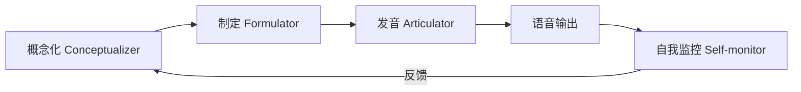
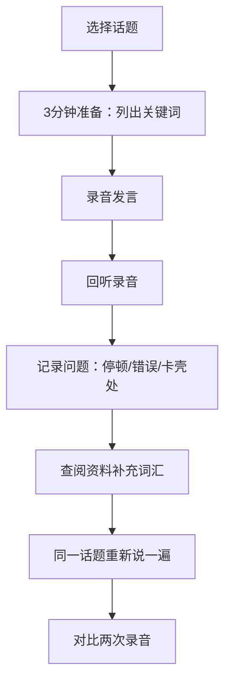
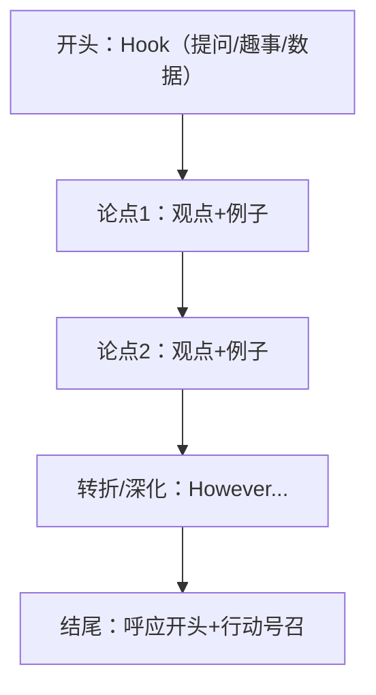

## 十、口语提升方法详解

口语是外语学习中最具挑战性也最有成就感的技能。与阅读和听力不同，口语要求大脑在毫秒级时间内完成"理解→组织→生成→发音"的完整链路，任何一个环节卡顿都会导致表达失败。本章从发音、流利度、表达深度三个维度，系统拆解口语提升的完整方法体系。

### 10.1 口语能力的认知模型

在讨论具体方法之前，先理解口语产出的心理语言学机制。Levelt（1989）的言语产出模型将口语分为五个阶段：

- **概念化**：确定要表达的意思和意图
- **词汇提取**：从心理词库中选取合适的词
- **语法编码**：将词组织成符合语法的句子
- **发音执行**：将语言计划转化为肌肉运动
- **自我监控**：监听自己的输出，发现并修正错误

口语不流利的根本原因，是某个阶段处理速度跟不上实时对话的节奏。不同阶段的瓶颈对应不同的训练方法，这是本章的组织逻辑。

### 10.2 发音改善方法

发音是口语的地基。发音不准不仅影响理解，还会导致听力辨别困难——因为你大脑中存储的语音表征本身就是偏的，听到正确发音时反而识别不了。

#### 10.2.1 音素系统重建

每种语言的音素系统不同。中文母语者学英语时，最容易出错的音素对包括：

| 英语音素 | 中文近似 | 差异说明 | 典型错误词 |
|----------|---------|---------|-----------|
| /θ/ vs /s/ | 思 vs 丝 | 舌尖位置不同 | think → sink |
| /ð/ vs /z/ | 咬舌 vs 不咬舌 | 是否舌尖触齿 | this → zis |
| /v/ vs /w/ | 上齿咬下唇 vs 双唇圆拢 | 发音部位完全不同 | very → wery |
| /l/ vs /r/ | 舌尖抵上齿龈 vs 舌尖卷起 | 舌位和气流路径不同 | light → right |
| /æ/ vs /e/ | 开口大小不同 | 下颌开合度 | bad → bed |
| /ɪ/ vs /iː/ | 短促 vs 持续 | 时长和舌位高低 | sit → seat |

**训练步骤：**

1. **感知阶段**（1-2周）：用最小对立体（minimal pairs）训练听辨能力。先听后判断，不急于模仿。推荐使用网站 [Minimal Pairs](https://www.minimalpairs.net/) 或 Anki 最小对立体卡片组。

2. **模仿阶段**（2-4周）：选定一个目标口音（美音/英音），使用"慢速→正常速→快速"三阶模仿法。工具推荐 Forvo（真人发音库）和 YouGlish（YouTube 真实语境发音搜索）。

3. **固化阶段**（持续）：将新音素融入日常朗读，每天15分钟专门练习之前发不准的音素组合。

#### 10.2.2 语调与重音模式

发音准确只是基础，语调模式才是决定"听起来是否自然"的关键因素。

**英语语调核心规则：**

- **降调**用于陈述句、特殊疑问句（What, Where, When）、命令句
- **升调**用于一般疑问句（Yes/No questions）、表示不确定或礼貌
- **降升调**用于暗示"but..."、表示保留意见（I'd love to go... ↗↘ 暗示"但是我不能"）

**重音模式训练法：**

英语是"重音计时语言"（stress-timed），重读音节之间的间隔大致相等，非重读音节会被压缩。中文是"音节计时语言"（syllable-timed），每个音节时长大致相同。这是中式英语听起来"平"的根本原因。

练习方法：打拍子朗读。重读音节落在拍子上，非重读音节快速带过。

da DA da da DA da da DA
I WANT to GO to the STORE to DAY

用这种方式朗读，节奏感会逐渐内化。

#### 10.2.3 影子跟读（Shadowing）深度训练

影子跟读是公认的发音+流利度综合训练方法，但大多数人用错了。

**正确做法分三个阶段：**

1. **同步跟读**（第1周）：音频播放的同时几乎同步朗读，不看文本。目标是捕捉节奏和语调，不追求每个词都对。

2. **延迟跟读**（第2-3周）：音频播放后延迟0.5-1秒跟读。开始关注具体发音细节。

3. **脱稿复述**（第4周起）：听完一个意群（3-5秒的音频片段），暂停，用自己的话复述。这一步从纯模仿过渡到自主产出。

**材料选择原则：**
- 语速适中（初学者用 VOA Special English，中级用 TED Talks，高级用播客访谈）
- 有完整文本对照
- 话题你感兴趣（坚持不下去的材料再好也没用）
- 单次练习时长控制在10-15分钟，质量比数量重要

**每天推荐流程（20分钟）：**

5分钟  发音热嘴（绕口令/最小对立体）
10分钟 影子跟读（选定材料）
5分钟  录音回听对比

### 10.3 流利度提升方法

流利度不等于"说得快"，而是在不中断表达的前提下，以自然节奏传递完整信息的能力。

#### 10.3.1 语言组块化（Chunking）

流利口语的本质不是逐词造句，而是调用预制的语块（chunks）。母语者说话时，70%以上的表达都是现成语块的组合，而非现场造句。

**需要积累的语块类型：**

| 类型 | 示例 | 使用场景 |
|------|------|---------|
| 搭配 | make a decision, heavy rain | 固定搭配不可替换 |
| 句式框架 | The thing is that... / What I mean is... | 引出观点 |
| 话语标记 | That said... / On the other hand... | 转折过渡 |
| 功能短语 | Could you repeat that? / Let me think... | 交际功能 |
| 习语/俚语 | hit the nail on the head, a piece of cake | 增加地道感 |

**积累方法：**

每遇到一个自然的表达组合，不要单独记单词，而是把整个语块记下来。用 Anki 建立"语块卡片"而非"单词卡片"。每张卡片正面是语境句（挖空语块），背面是完整的语块。

例如：
- 正面："I totally ___ ___ ___ that idea."（赞同某观点）
- 背面："agree with"

#### 10.3.2 计时独白训练

计时独白（Timed Monologue）是训练流利度最直接的方法。

**操作步骤：**

1. 准备一个话题卡片列表（见10.4节话题库）
2. 随机抽取一个话题
3. 设定计时器，初级目标2分钟，中级5分钟，高级10分钟
4. 开始说话，**不允许长时间停顿**（超过3秒算失败）
5. 录音回听，记录停顿次数、自我纠正次数、填充词使用情况

**进阶变体：**

- **即兴演讲**：给30秒准备时间，然后开始说
- **限制词汇**：只用最近一周学的新词/语块来表达
- **反向论证**：先表达一个观点，然后立刻反驳自己
- **故事接续**：从一个随机句子开始，即兴编一个完整故事

#### 10.3.3 填充词的正确使用

很多学习者认为填充词（fillers）是"坏习惯"，但实际上，适度使用填充词是母语者保持话语连贯的正常策略。关键在于用对种类和频率。

**高级填充词（推荐使用）：**

英语：
- "Well..." （争取思考时间）
- "You know what..." （引入新观点）
- "Let me see..." （组织语言）
- "The thing is..." （引出核心论点）
- "I'd say..." （缓和语气）

日语：
- "えーと..."（eto，嗯...）
- "あの..."（ano，那个...）
- "ちょっと..."（chotto，有点...）

法语：
- "Eh bien..."（嗯...）
- "Comment dire..."（怎么说呢...）
- "Voyons voir..."（让我想想...）

**低级填充词（应减少使用）：**

英语：um, uh, like (过多使用), so (句首过多)
中文翻译思维：嗯...那个...就是...

**训练方法：** 录音回听自己的一段自由发言，统计每分钟填充词出现次数。母语者的自然频率约为每分钟2-4次，超过6次需要有意识地替换为高级填充词或练习"有意义的停顿"。

#### 10.3.4 思维语言切换

"先用母语想，再翻译成外语"是口语流利度的最大障碍。翻译过程会引入额外的处理时间，而且母语和外语的表达逻辑往往不同，直译出来的句子经常不地道。

**训练方法：**

1. **自言自语法**：每天用目标语言描述你正在做的事情（内心独白）。做饭时说"I'm cutting the vegetables, now I'm adding some salt..."，不用管语法完美，重点是建立"直接用外语想"的神经通路。

2. **图片描述法**：看到一张图片，限时10秒内用目标语言描述出来。不要在脑中先组织中文再翻译，而是直接从视觉信息映射到外语词汇。

3. **外语日记**：每天用目标语言写或说3-5句话总结当天发生的事。初级阶段允许查词典，但不允许用中文思考后再翻译。

4. **外语环境沉浸**：将手机、电脑系统语言改为目标语言，订阅目标语言的 YouTube 频道/播客。环境输入越多，大脑越容易建立直接的外语思维回路。

### 10.4 口语话题库与练习框架

空有方法没有素材，练习就会变得随意低效。以下话题库按难度和场景分类，每个话题附带练习框架。

#### 10.4.1 基础话题（适合 A1-A2 水平）

| 话题 | 练习框架 | 时长建议 |
|------|---------|---------|
| 自我介绍 | 姓名→职业→爱好→近期计划 | 1-2分钟 |
| 家庭成员 | 介绍3-5个家庭成员的特征和关系 | 2分钟 |
| 日常作息 | 从起床到睡觉，按时间线描述 | 2分钟 |
| 居住环境 | 描述你的家/房间，用方位词 | 2分钟 |
| 饮食偏好 | 喜欢/不喜欢的食物+原因 | 2分钟 |

#### 10.4.2 中级话题（适合 B1-B2 水平）

| 话题 | 练习框架 | 时长建议 |
|------|---------|---------|
| 旅行经历 | 起因→准备→经历→感受→建议 | 3-5分钟 |
| 工作/学习 | 描述日常职责+一个具体挑战 | 3-5分钟 |
| 健康生活方式 | 现状→问题→改变→效果 | 3-5分钟 |
| 科技影响 | 观点→正面例子→反面例子→结论 | 5分钟 |
| 文化差异 | 场景→差异描述→个人感受→学到什么 | 5分钟 |

#### 10.4.3 高级话题（适合 C1-C2 水平）

| 话题 | 练习框架 | 时长建议 |
|------|---------|---------|
| 教育体制利弊 | 立场→论据1-3→反驳→总结 | 5-8分钟 |
| 人工智能伦理 | 背景→多方观点→个人立场→预测 | 5-8分钟 |
| 梦想与现实 | 定义→追求过程→挫折→反思 | 5-8分钟 |
| 社会公平 | 概念→现状→案例→解决方案 | 5-8分钟 |
| 即兴辩论 | 正方立论→反方反驳→回应→总结 | 8-10分钟 |

#### 10.4.4 话题练习的完整流程

一个完整的口语话题练习应包含以下步骤：

关键原则：**同一个话题至少说两遍**。第一遍是暴露问题，第二遍才是真正的学习。

### 10.5 真实对话场景训练

独白训练解决流利度，但口语的终极目标是与人真实对话。以下是获取真实对话练习的几种途径，按效果排序：

#### 10.5.1 语言交换伙伴（Tandem）

**平台推荐**：Tandem、HelloTalk、italki Community

**高效语言交换的规则：**

1. 前半段用你的目标语言，后半段用对方的目标语言，严格计时
2. 每次交换后互相反馈3个错误和3个好的表达
3. 提前准备话题，避免尬聊
4. 固定频率（每周2-3次，每次30-45分钟）比偶尔长时间聊更有效
5. 选择水平略高于你的伙伴——太低学不到东西，太高对方不愿意配合

#### 10.5.2 AI 对话练习

AI 对话工具可以作为真人对话的补充（不能替代），优势是24小时可用、不社恐、可反复练习同一场景。

**推荐工具和用法：**

- **ChatGPT/Claude 语音模式**：设定角色（"你是我的英语老师，每次我说错就纠正我，用简单英语解释为什么错"）
- **Speak App**：专注口语的 AI 对话应用，有系统课程
- **ELSA Speak**：AI 发音纠正，精确到单个音素

**与 AI 对话的局限**：AI 不会像真人那样有情绪反应、文化背景差异、口音多样性。建议将 AI 练习作为"热身"，真人对话作为"正式比赛"。

#### 10.5.3 自言自语与角色扮演

没有对话伙伴时的替代方案：

**自言自语场景设计：**

- **模拟面试**：准备常见面试问题，对着镜子回答
- **模拟点餐/购物**：设定场景，一人分饰两角
- **模拟演讲**：准备一个3分钟的演讲，对着手机摄像头讲
- **复述故事**：看完一段视频/文章后，用自己的话复述核心内容

**为什么自言自语有效：** 神经科学研究表明，即使是想象中的对话也会激活大脑中与真实对话相同的语言区域（左侧额下回和颞上回）。关键是要"出声说"而不是"在心里默念"。

### 10.6 进阶口语技巧

当发音和流利度基本过关后，需要关注的是表达的深度和灵活性。

#### 10.6.1 同义替换能力

高级口语者不会反复使用同一个词。训练方法：

**"禁词游戏"**：设定一个常用词（如 good），然后用5种不同方式表达同一个意思：excellent, outstanding, remarkable, fantastic, superb。进阶时，不仅要换词，还要根据语境选择最精确的替换——"食物好"用 delicious，"表现好"用 impressive，"天气好"用 lovely。

**语域切换训练**：同一个意思用正式/非正式/学术三种方式表达：

正式：I would like to express my dissatisfaction with the service.
非正式：The service was pretty bad, honestly.
学术：The service quality fell significantly below acceptable standards.

#### 10.6.2 逻辑连接与话语结构

高级口语不是想到什么说什么，而是有清晰的逻辑结构。

**万能话语结构模板：**

观点表达：
  "I'd argue that... / From my perspective... / The way I see it..."

举例论证：
  "For instance... / A good example of this is... / Take... for example..."

对比转折：
  "Having said that... / On the flip side... / That said, we shouldn't ignore..."

让步承认：
  "I see your point, but... / While that's true to some extent... / Granted,..."

总结收尾：
  "So all in all... / To sum up... / The bottom line is..."

#### 10.6.3 即兴演讲的"钻石结构"

面对任何即兴话题，都可以用这个框架快速组织语言：

练习时随机抽取话题，给自己30秒想出这5个节点的关键词，然后开始说。反复练习后，这个结构会变成自动化的思维模式。

### 10.7 常见误区与纠正

#### 误区一：只练不听

**症状**：每天花大量时间说话，但发音和表达没有进步。

**原因**：没有足够的正确输入作为参照。大脑无法产生它从未接收过的输出。

**纠正**：口语练习时间中，听和说的比例应保持在 6:4 甚至 7:3。大量听正确发音后，你的口腔肌肉会自然趋向正确的发音方式。

#### 误区二：追求完美再开口

**症状**：总觉得"准备好了再说"，结果永远不开口。

**原因**：对犯错的恐惧。这在成年学习者中极为普遍。

**纠正**：接受"流利度优先于准确度"的策略。先能做到流畅表达（即使有语法错误），再逐步修正错误。研究表明，过度关注语法正确性会严重降低口语流利度（Skehan, 1998）。

#### 误区三：只背单词不背语块

**症状**：词汇量测试分数很高，但说话时一个词一个词往外蹦。

**原因**：孤立记忆的单词在实时口语中提取速度太慢。

**纠正**：从今天开始，所有新学的表达都以语块为单位记忆。遇到 "decision"，不要只记 "决定"，要记 "make a difficult decision"、"come to a decision"、"decision-making process"。

#### 误区四：长期只用一种练习方式

**症状**：每天做同样的练习（比如只做影子跟读），初期进步明显但很快遇到瓶颈。

**原因**：单一训练只能强化特定的口语子技能，无法覆盖口语能力的全貌。

**纠正**：每周练习计划应包含多种训练类型：

周一：发音专项（最小对立体+语调练习）
周二：影子跟读（模仿流利度）
周三：计时独白（自主产出）
周四：语块积累+朗读
周五：真人/AI 对话练习
周末：看外语视频+复述练习

#### 误区五：忽视非语言因素

**症状**：语言能力不错，但跟母语者交流时总感觉"差点意思"。

**原因**：口语交流中，非语言因素（肢体语言、眼神接触、说话音量、停顿的运用）占信息传递的 55% 以上（Mehrabian, 1971）。

**纠正**：练习时对着镜子或摄像头，注意自己的表情和手势。学会用停顿来强调重点，而不是用停顿来"想词"。

### 10.8 口语进步评估与里程碑

没有衡量标准的练习容易陷入"感觉在进步但不确定"的模糊状态。

#### 自评量表（每月评估一次）

| 维度 | 初级（1-2分） | 中级（3-4分） | 高级（5分） |
|------|-------------|-------------|-----------|
| 发音 | 经常被要求重复 | 偶尔有口音但不影响理解 | 发音接近母语者 |
| 流利度 | 频繁停顿，每句话都要想 | 话题熟悉时流畅，陌生话题卡顿 | 任何话题都能自然表达 |
| 词汇 | 只能用基本词汇 | 能用同义词替换，偶尔卡壳 | 用词精准，语域切换自如 |
| 语法 | 频繁语法错误 | 复杂句偶尔出错 | 语法准确，错误自我纠正 |
| 互动 | 只能回答问题 | 能主动发起话题和追问 | 能引导对话方向 |

**每项1-5分，总分25分。** 每月评估一次，记录分数变化趋势。分数稳定不动时，说明需要调整训练方法。

#### 进度追踪建议

用一个简单的电子表格记录：

日期 | 话题 | 时长 | 停顿次数 | 主要问题 | 改进点

三个月后回看，你会清晰地看到自己的进步轨迹和仍需改进的领域。

### 10.9 本章小结

口语提升是一场持久战，没有捷径，但有科学的方法。核心要点回顾：

1. **发音是地基**：音素系统→语调模式→节奏感，三者缺一不可
2. **流利度靠语块**：不要逐词造句，积累预制语块实现"搭积木"式表达
3. **思维要切换**：从"母语思考→翻译"过渡到"直接用外语思考"
4. **练习要多元**：独白、跟读、对话、复述，多种方式交替进行
5. **反馈要持续**：录音回听是最廉价也最有效的自我反馈工具
6. **评估要量化**：建立可追踪的进步指标，用数据驱动学习调整

记住，**口语能力的增长曲线不是线性的**。初期进步明显（新手红利期），中期会遇到明显的平台期（可能持续数月），突破平台期后会进入一个新的快速进步阶段。在平台期坚持练习，是大多数人放弃和少数人突破的分水岭。
