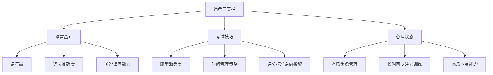

## 十一、考试备考策略

语言考试是检验学习成果、获得权威认证的重要手段。无论是出国留学、职业晋升、移民申请还是个人能力证明，一场高含金量的语言考试成绩都能为你的履历增添有力的一笔。然而，"会一门语言"和"能考好一门语言考试"是两回事——考试有其独特的规则、题型和评分标准，备考需要针对性的策略，而非单纯的"多学多练"。

本节将系统覆盖主流语言考试的备考方法论，从考试本质分析、备考周期规划、各科核心策略、资源推荐到常见陷阱，帮助你在有限时间内拿到理想分数。

### 11.1 备考的底层逻辑：考试不是语言能力，而是任务执行

很多考生的误区在于：把备考等同于"继续学语言"。事实上，语言考试本质上是一场**标准化任务执行**——你需要在规定时间内，按照特定规则，完成特定类型的任务。这意味着：

- **熟悉任务格式**比提升语言水平更"划算"。一个雅思阅读7分水平的考生，如果不熟悉题型，可能只拿到6分；而一个6.5分水平但题型极其熟练的考生，可能拿到7分。
- **时间管理**是独立于语言能力的技能。很多人写不完作文、做不完阅读，不是因为不会，而是因为没有练习过在时间压力下做决策。
- **评分标准是可以"逆向工程"的**。每种考试都有公开的评分细则（rubric），仔细研读并按照评分标准来准备，比盲目练习效率高得多。

### 11.2 雅思（IELTS）备考

#### 11.2.1 考试概述与选择

雅思考试分为**学术类（Academic）**和**培训类（General Training）**两种，听力和口语部分完全相同，阅读和写作的Task 1不同。留学申请通常需要学术类，移民申请通常需要培训类。

考试结构：

| 部分 | 时长 | 题目数量 | 满分 | 备注 |
|------|------|----------|------|------|
| 听力 | 30分钟+10分钟誊写 | 40题 | 9分 | 四段录音，难度递增 |
| 阅读 | 60分钟 | 40题 | 9分 | 三篇文章，1500-2500词/篇 |
| 写作 | 60分钟 | 2篇 | 9分 | Task 1 (150词+) + Task 2 (250词+) |
| 口语 | 11-14分钟 | 3个部分 | 9分 | 面对面考试，分三部分 |

总分 = 四科平均分（四舍五入到最近的0.5分）。例如：听力7.5 + 阅读7.0 + 写作6.5 + 口语6.5 = 平均6.875 → 总分7.0。

**纸笔 vs 机考选择**：机考出分更快（3-5天 vs 13天），听力无法预览题目时间更短，打字快的人写作更有优势。建议在考前至少用机考模拟一次，确认自己适应屏幕阅读和打字速度。

#### 11.2.2 备考时间规划

| 阶段 | 时间 | 核心任务 | 每日学习时长 |
|------|------|----------|-------------|
| 诊断期 | 第1周 | 做一套完整真题，确定各科基准分和薄弱点 | 3-4小时 |
| 基础期 | 第1-6周 | 词汇积累（学术词汇表AWL）、语法查漏补缺、听力精听训练 | 2-3小时 |
| 强化期 | 第7-14周 | 四科专项突破、真题精练、错题分析 | 3-4小时 |
| 冲刺期 | 第15-18周 | 全真模考、薄弱环节集中突破、口语话题卡准备 | 4-5小时 |
| 考前1周 | 最后7天 | 每天一套模考、回顾错题本、调整作息 | 2-3小时（减量保质） |

**关键原则**：不要一上来就刷题。先做一套剑桥真题（Cambridge IELTS 15-18任意一本），确定基准分。如果差距在0.5-1分，2-3个月够了；如果差距在1.5-2分，至少需要4-6个月。

#### 11.2.3 听力备考策略

**核心方法：精听 + 场景词汇**

雅思听力的难点不在于"听不懂"，而在于"听到了但抓不住答案"。这是因为答案往往藏在同义替换、否定转折和干扰信息中。

**精听训练四步法**：

1. **裸听**：不看原文，完整听一遍，做题
2. **对照**：对答案，标记错题位置
3. **回听**：重听错题段落，尝试自己听出来
4. **精析**：看原文，分析为什么没听到——是词汇不认识？语速太快？连读吞音？还是被干扰信息误导？

**各Section重点**：

- **Section 1**（日常对话）：确保满分。核心是数字、日期、地名的拼写，以及电话号码、邮编等信息的捕捉。准备常见场景词汇（租房、银行、旅游预订、课程注册）。
- **Section 2**（日常独白）：地图题和配对题是难点。地图题需要提前熟悉方位词汇（intersection, T-junction, roundabout, bend），配对题需要注意同义替换。
- **Section 3**（学术讨论）：多选题和配对题为主。注意说话人态度的变化（"I initially thought... but actually..."）。
- **Section 4**（学术讲座）：填空题为主，语速最快，信息密度最高。需要边听边记笔记的能力。

**高频场景词汇表**（必须掌握）：

| 场景 | 核心词汇示例 |
|------|-------------|
| 租房 | deposit, landlord, tenant, furnished, utilities included, en-suite, studio flat |
| 银行 | current account, savings account, overdraft, direct debit, standing order, interest rate |
| 旅游 | itinerary, accommodation, excursion, peak season, cancellation policy, transfer |
| 学术 | tutorial, seminar, lecture, assignment, deadline, plagiarism, bibliography |

#### 11.2.4 阅读备考策略

**核心方法：定位 + 同义替换识别**

雅思阅读的本质是"在大量文本中快速找到特定信息"，而不是"理解全文"。很多考生犯的错误是试图读完每个词——这在60分钟内完成40题是不可能的。

**时间分配建议**：
- Passage 1（最简单）：15分钟
- Passage 2（中等）：20分钟
- Passage 3（最难）：25分钟

**各题型破解策略**：

**判断题（True/False/Not Given）**：
- True = 原文明确说了，且意思一致
- False = 原文明确说了，但意思相反（注意否定词、反义词）
- Not Given = 原文没有提及这个信息，或者无法从原文推断
- 最大陷阱：用自己的常识判断。Not Given不代表"不存在"，只是"原文没说"

**匹配题**：
- 段落信息匹配（Which paragraph contains the following information）：最后做，因为需要对全文有理解
- 人物观点匹配：先划出所有人名，然后逐段扫描

**填空题**：
- 注意字数限制（NO MORE THAN TWO WORDS AND/OR A NUMBER）
- 答案通常是原文原词，不需要改写
- 注意语法一致性（单复数、时态）

**Heading匹配题**：
- 先读所有heading，划出关键词
- 读每段首句和末句（主题句通常在这里）
- 排除法：做完确定的后，剩下的用排除法

#### 11.2.5 写作备考策略

**核心方法：评分标准逆向拆解**

雅思写作的评分标准（四项各占25%）：

| 维度 | 7分标准 | 6分标准 |
|------|---------|---------|
| Task Achievement | 充分回应所有要点，立场清晰，主要观点有拓展 | 回应了所有要点，但某些部分比其他部分更充分 |
| Coherence & Cohesion | 信息组织有逻辑，衔接手段使用灵活 | 信息组织总体有逻辑，衔接手段使用有效但机械 |
| Lexical Resource | 使用足够的词汇，有灵活性，拼写基本无误 | 使用了足够的词汇，尝试使用不常见词汇但有错误 |
| Grammatical Range & Accuracy | 使用多种复杂结构，多数句子无错误 | 使用了简单和复杂结构，复杂结构中有错误 |

**Task 1 图表作文模板框架**（150词+）：

第一段（改写题目）：The [图表类型] illustrates/shows/compares [主题] in [地点] over [时间段].

第二段（概述Overall）：Overall, it can be seen that [最显著的趋势/特征1], while [最显著的特征2].

第三段（详细描述1）：In terms of / Looking at [类别A], [具体数据+趋势描述].

第四段（详细描述2）：In contrast / Similarly, [类别B] [具体数据+趋势描述].

**Task 2 议论文模板框架**（250词+）：

第一段（开头+立场）：The question of whether [话题改写] has generated considerable debate. While some argue that [反方观点], I believe that [我的立场].

第二段（理由1+展开）：The primary reason for this is that [理由]. For example, [具体例子/数据]. This demonstrates that [回扣论点].

第三段（理由2+展开）：Furthermore, [理由2]. In particular, [详细说明]. As a result, [结论].

第四段（让步+反驳）：Admittedly, [承认反方有一定道理]. However, [反驳], because [原因].

第五段（总结）：In conclusion, [重申立场+总结主要理由].

**高分写作的关键习惯**：
- 不要背模板句子，而是背"表达框架"——可以填充不同内容的句型结构
- 每次练习后对照评分标准自评，找出最弱的一项重点提升
- 积累"话题词汇"而不是"万能词汇"：教育类、环境类、科技类各准备一套

#### 11.2.6 口语备考策略

**核心方法：话题卡准备 + 流利度训练**

口语考试的三个部分：

| 部分 | 时长 | 内容 | 策略 |
|------|------|------|------|
| Part 1 | 4-5分钟 | 日常问答（家乡、学习、爱好等） | 简洁但有拓展，每个回答2-3句 |
| Part 2 | 3-4分钟 | 话题卡独白（1分钟准备+2分钟讲） | 准备万能故事框架，灵活套用 |
| Part 3 | 4-5分钟 | 深入讨论（与Part 2话题相关） | 展示观点深度，使用连接词和举例 |

**Part 2 万能故事法**：

准备5-6个核心故事，每个故事可以覆盖10-15个不同的话题卡。例如：

故事："一次独自旅行去云南" → 可以套用的话题卡：
- Describe a place you visited（地点）
- Describe a time you were alone（独处经历）
- Describe something you did that was new（新体验）
- Describe a challenge you faced（挑战）
- Describe a trip you enjoyed（旅行）
- Describe a time you learned something about yourself（自我认知）

**口语评分的关键维度**：
- **流利度**（最重要）：不要频繁停顿、自我纠正。说错了继续说，不要回头改
- **词汇多样性**：同一个意思用不同的词表达。"important" → "crucial / vital / significant / paramount"
- **语法准确性**：注意时态一致性，主谓一致，第三人称单数
- **发音**：不需要"native accent"，但需要清晰、有重音和语调变化

### 11.3 托福（TOEFL iBT）备考

#### 11.3.1 考试概述与特点

托福是美国教育考试服务中心（ETS）开发的学术英语能力测试，满分120分，是北美留学的首选语言考试。

| 部分 | 时长 | 题目 | 满分 | 特点 |
|------|------|------|------|------|
| 阅读 | 35分钟 | 2篇文章，每篇10题 | 30分 | 学术文章，涉及多学科 |
| 听力 | 36分钟 | 3个讲座+2个对话 | 30分 | 听完才能看题，笔记能力关键 |
| 口语 | 16分钟 | 4道题 | 30分 | 对着电脑说，有综合任务 |
| 写作 | 29分钟 | 1道综合+1道学术讨论 | 30分 | 综合写作需要整合听力和阅读 |

**托福 vs 雅思选择指南**：

| 维度 | 雅思更适合 | 托福更适合 |
|------|-----------|-----------|
| 考试形式 | 喜欢面对面口语 | 喜欢对电脑说话 |
| 听力能力 | 听力一般 | 听力较强 |
| 目标地区 | 英联邦国家（英澳加新） | 北美（美加） |
| 阅读偏好 | 喜欢多样题型 | 喜欢标准化选择题 |
| 写作速度 | 打字慢，手写快 | 打字快 |

#### 11.3.2 听力备考：托福的"半壁江山"

托福听力是最关键的部分——不仅听力部分本身考听力，口语的Task 3-4和综合写作也都需要听材料。听力能力直接决定总分上限。

**笔记系统**：托福听力听完才出题，所以笔记是唯一的信息留存手段。

推荐笔记格式：

主题: [讲座主题]
│
├── 要点1: [关键词]
│   ├── 例子: ...
│   └── 细节: ...
│
├── 要点2: [关键词]
│   ├── 原因: ...
│   └── 结果: ...
│
└── 要点3: [关键词]
    └── 对比: ...

**信号词识别**（听到这些词就要记笔记）：

| 信号词 | 含义 | 重要性 |
|--------|------|--------|
| "The main point is..." | 主题句 | ★★★ |
| "There are three reasons..." | 分论点预告 | ★★★ |
| "For example / For instance" | 举例（常考） | ★★★ |
| "However / But / On the other hand" | 转折（常考） | ★★★ |
| "The key term here is..." | 定义（常考） | ★★★ |
| "What's interesting is..." | 教授个人观点 | ★★ |
| "Let me repeat that" | 重复=强调 | ★★ |

#### 11.3.3 口语备考：模板+内容的平衡

托福口语4道题的结构：

| 题目 | 类型 | 准备时间 | 回答时间 | 核心能力 |
|------|------|----------|----------|----------|
| Task 1 | 独立口语（个人偏好/观点） | 15秒 | 45秒 | 快速组织观点+举例 |
| Task 2 | 综合（阅读+听力→说） | 30秒 | 60秒 | 信息整合+转述 |
| Task 3 | 综合（阅读+听力→说） | 30秒 | 60秒 | 学术概念+例子 |
| Task 4 | 综合（听力→说） | 20秒 | 60秒 | 听力笔记+结构化输出 |

**Task 1 万能模板**：

I [prefer/believe/agree] that [观点]. There are two reasons for this.

First, [理由1]. For example, [具体例子，越具体越好].

Second, [理由2]. For instance, [具体例子].

That's why I [重申观点].

**关键技巧**：
- 独立口语不要追求"深刻"，追求"具体"。一个真实的细节胜过三个空泛的理由
- 综合口语不要加入自己的观点，只转述材料中的信息
- 练习时录音回听，检查是否有"um"、"uh"等填充词过多的问题

#### 11.3.4 阅读备考

托福阅读是纯选择题，但文章学术性强、词汇难度高。

**时间分配**：每篇文章约17分钟（35分钟2篇），最后一题（小结题）留3分钟。

**词汇题专项**：托福阅读中的词汇题占比高，且直接考词汇量。建议：
- 背诵托福核心词汇表（约3000-4000词）
- 注意一词多义（address = 地址/处理/演讲，issue = 问题/发行/期刊）
- 利用上下文推断词义，排除明显不合语境的选项

**小结题策略**（6选3，每题2分）：
- 先排除"太细节"的选项（只在一段中提到的小事）
- 再排除"与原文矛盾"的选项
- 剩下的3个通常是全文的主要论点

#### 11.3.5 写作备考

**综合写作**（Integrated Writing）：

这是托福特有的题型——先读一篇学术文章（3分钟），再听一段反驳该文章的讲座，然后写一篇总结两者关系的文章（150-225词，建议200-250词）。

模板框架：
The reading passage argues that [阅读观点]. However, the professor challenges this claim with several points.

First, the reading states that [阅读要点1]. The professor counters this by explaining that [听力反驳1]. [听力细节].

Second, according to the reading, [阅读要点2]. The professor disputes this, pointing out that [听力反驳2]. [听力细节].

Third, the reading claims that [阅读要点3]. However, the professor argues that [听力反驳3]. [听力细节].

**关键**：不需要自己的观点，只需要准确转述。听力内容比阅读内容更重要（因为听力是反驳方）。

**学术讨论写作**（Academic Discussion）：

2023年新题型。教授提出一个话题，两位同学发表观点，你需要参与讨论并表达自己的看法（100词+，建议120-150词）。

I agree with [同学名] that [观点], but I'd like to add that [补充]. Additionally, [自己的观点]. For example, [具体例子]. This is because [原因]. In contrast to what [另一位同学] suggested, [反驳+理由].

### 11.4 大学英语四六级（CET-4/CET-6）备考

#### 11.4.1 考试概述

四六级是中国教育部主办的全国性英语能力测试，每年6月和12月各考一次。四级425分及格（相当于"通过"），六级同样425分及格。

| 项目 | 四级（CET-4） | 六级（CET-6） |
|------|-------------|-------------|
| 词汇量要求 | 约4500词 | 约6000词 |
| 考试时长 | 125分钟 | 130分钟 |
| 总分 | 710分 | 710分 |
| 及格线 | 425分 | 425分 |
| 听力占比 | 35% | 35% |
| 阅读占比 | 35% | 35% |
| 写作占比 | 15% | 15% |
| 翻译占比 | 15% | 15% |

#### 11.4.2 各题型备考策略

**听力（35%，248.5分）**：

四六级听力是很多考生的痛点。改革后的听力取消了短对话和听写，增加了新闻听力和讲座听力。

| 题型 | 四级 | 六级 | 策略 |
|------|------|------|------|
| 新闻听力 | 3篇7题 | - | 关注5W1H（谁、何事、何时、何地、为何、如何） |
| 长对话 | 2篇8题 | 2篇8题 | 关注转折和建议 |
| 听力篇章 | 3篇10题 | 3篇10题 | 关注首尾句和重复出现的词汇 |
| 讲座/讲话 | - | 3篇10题 | 类似托福听力，需要记笔记 |

**备考方法**：
- 每天精听15-20分钟真题音频，先裸听做题，再对照原文精听
- 积累新闻高频词汇：economy, policy, environment, technology, healthcare
- 听力预读：利用每段录音开始前的间隙，快速浏览选项，预测内容

**阅读（35%，248.5分）**：

| 题型 | 题数 | 分值 | 策略 |
|------|------|------|------|
| 选词填空 | 10题 | 每题3.55分 | 分值最低，最后做；先判断词性，再根据上下文选择 |
| 长篇阅读（信息匹配） | 10题 | 每题7.1分 | 先读题目划关键词，再扫读文章定位 |
| 仔细阅读 | 10题 | 每题14.2分 | 分值最高，优先做；先读题干，带着问题读文章 |

**关键**：仔细阅读的分值是选词填空的4倍！时间紧张时，宁可放弃选词填空，也要把仔细阅读做好。

**写作（15%，106.5分）**：

四六级写作30分钟，要求120-180词（四级）/150-200词（六级）。

**高分模板**（适用于议论文/现象解释型）：

第一段（引入+观点）：Nowadays, [话题] has become a hot topic. Some people believe that [观点A], while others argue that [观点B]. From my perspective, [我的立场].

第二段（理由1）：To begin with, [理由]. For instance, [例子]. Therefore, [小结].

第三段（理由2）：Moreover, [理由]. A recent survey shows that [数据/事实]. This indicates that [小结].

第四段（总结）：In conclusion, [重申观点]. Only by [建议/展望] can we [美好结果].

**翻译（15%，106.5分）**：

四六级翻译是中译英，通常涉及中国文化、经济、社会话题。

备考策略：
- 积累中国文化专有词汇：春节（Spring Festival）、中秋节（Mid-Autumn Festival）、高铁（high-speed railway）、移动支付（mobile payment）
- 注意主被动语态的转换：中文多用主动，英文有时需要被动
- 不确定的复杂句就拆成简单句，准确比华丽更重要

### 11.5 日语能力考试（JLPT）备考

#### 11.5.1 考试概述

JLPT（Japanese-Language Proficiency Test）是全球认可度最高的日语能力测试，每年7月和12月各举行一次。

| 级别 | 词汇量 | 汉字量 | 学习时长参考 | 对应能力 |
|------|--------|--------|-------------|---------|
| N5 | 约800 | 约100 | 3-6个月 | 能理解基础日语（自我介绍、简单对话） |
| N4 | 约1500 | 约300 | 6-12个月 | 能理解基础日语（日常场景对话） |
| N3 | 约3750 | 约650 | 12-18个月 | 能理解日常场景的日语 |
| N2 | 约6000 | 约1000 | 18-24个月 | 能理解日常及一定范围的学术日语 |
| N1 | 约10000 | 约2000 | 24-36个月 | 能理解广泛场景的日语 |

**考试结构**：

| 级别 | 科目 | 时间 | 及格线 |
|------|------|------|--------|
| N5 | 言语知识（文字·词汇·文法）+ 读解 + 听解 | 105分钟 | 80/180 |
| N4 | 言语知识（文字·词汇·文法）+ 读解 + 听解 | 125分钟 | 90/180 |
| N3 | 言语知识（文字·词汇）+ 文法·读解 + 听解 | 140分钟 | 95/180 |
| N2 | 言语知识（文字·词汇·文法）·读解 + 听解 | 155分钟 | 90/180 |
| N1 | 言语知识（文法）·读解 + 听解 | 110分钟 | 195/180 |

注意：JLPT采用"基准得分"制度（尺度得点），各科目满分60分，总分180分。每科都必须达到该科目的及格线，且总分达到总及格线才算通过。这意味着你不能靠一个科目拉高总分来弥补另一个科目的不及格。

#### 11.5.2 N3-N1 备考策略

**文字·词汇**：

- N3：重点是动词的变形（て形、ない形、た形、可能形、被动形、使役形）和常见复合词
- N2：需要掌握惯用表达和近义词辨析。例如：「見る/見える/観る」三个词都与“看”有关，但用法完全不同

**文字·词汇专项**：

| 级别 | 记忆方法 | 每日目标 |
|------|----------|----------|
| N3 | 按场景分类记忆（旅行、工作、学校等），配合例句 | 15-20个新词 |
| N2 | 按词根词缀归类，注意近义词辨析（如：込む/入る/嵌る） | 20-25个新词 |
| N1 | 通过阅读新闻和小说自然积累，重点记惯用句和四字成语 | 10-15个新词+大量阅读 |

推荐教材：《新完全マスター》系列（词汇分册）、《日本語総まとめ》系列

**文法**：

日语语法的难点在于敬语体系和相似语法辨析。

N2-N1高频考点：
- 表示"虽然…但是…"的多种表达：「のに」「にもかかわらず」「くせに」「ものの」的区别
- 表示"只有/只要"的表达：「だけ」「ばかり」「しか～ない」「さえ」「こそ」的区别
- 书面语语法：「～にほかならない」「～をもって」「～に即して」
- 敬语的正确使用：尊敬语、谦让语、丁宁语的区分

**读解**：

N2阅读文章约1500-2000字，N1约2000-2500字，时间非常紧张。

时间分配建议（N2：105分钟阅读部分）：
- 短文理解（4-5篇）：每篇5分钟，共20-25分钟
- 中文理解（3-4篇）：每篇8分钟，共24-32分钟
- 长文理解（1篇）：15分钟
- 信息检索（1篇）：10分钟
- 检查时间：5-10分钟

**听解**：

JLPT听力语速较快，且没有文字选项（只有图片或纯听），难度较高。

- 課題理解：听完一段对话后选择下一步行动。关键是听清"问题是什么"
- 要点理解：听一段较长对话后选择要点。注意转折词「でも」「だけど」「ところが」
- 概要理解：听一段独白后选择说话人的主张。重点听最后的总结
- 即時応答：听一句话后选择合适的回应。考的是日常会话反应速度
- 発話（N1特有）：听一段对话后选择接下来会说什么

### 11.6 其他主流语言考试备考

#### 11.6.1 法语：DELF/DALF

DELF（Diplôme d'Études en Langue Française）和 DALF（Diplôme Approfondi de Langue Française）是法国教育部颁发的法语水平证书，对应欧标A1-C2。

| 考试 | 对应欧标 | 适合人群 | 考试费用（中国） |
|------|---------|---------|----------------|
| DELF A1 | A1 | 零基础入门者 | 约1000元 |
| DELF A2 | A2 | 初级学习者 | 约1100元 |
| DELF B1 | B1 | 中级学习者 | 约1500元 |
| DELF B2 | B2 | 中高级（法国大学入学门槛） | 约1700元 |
| DALF C1 | C1 | 高级学习者 | 约2000元 |
| DALF C2 | C2 | 近母语水平 | 约2200元 |

**B2备考重点**（最常见的考试级别）：
- 听力：听2遍较长的音频材料（新闻、访谈、讲座），需要做笔记并回答问题
- 阅读：理解一篇800-1000词的文章（新闻报道、评论文章），回答开放性问题
- 写作：写一篇250词左右的议论文（lettre formelle或essai argumentatif）
- 口语：抽到一个话题，准备30分钟，然后进行10-15分钟的陈述和讨论

**核心备考资源**：《Alter Ego》系列教材、France 24新闻、RFI Journal en français facile

#### 11.6.2 德语：歌德学院考试（Goethe-Zertifikat）

歌德学院考试是全球认可度最高的德语考试，对应欧标A1-C2。

| 考试 | 对应欧标 | 适合人群 |
|------|---------|---------|
| Start Deutsch 1 | A1 | 零基础入门 |
| Start Deutsch 2 | A2 | 初级水平 |
| Goethe-Zertifikat B1 | B1 | 中级水平（德国入籍要求） |
| Goethe-Zertifikat B2 | B2 | 中高级（德国大学入学门槛之一） |
| Goethe-Zertifikat C1 | C1 | 高级水平 |
| Goethe-Zertifikat C2 | C2 | 近母语水平 |

**B2备考重点**：
- Lesen（阅读）：65分钟，5个部分。重点是理解长文主旨和细节，注意德语的框形结构（Satzklammer）
- Hören（听力）：约40分钟，4个部分。德语听力难点在于长复合词和快速口语中的省略
- Schreiben（写作）：75分钟，2个任务。一篇formeller Brief（正式书信）+一篇Erörterung（议论文）
- Sprechen（口语）：15分钟，3个部分。主题陈述、与搭档讨论、给出建议

**德语语法难点提醒**：
- 名词词性（der/die/das）没有规律，必须和名词一起记
- 动词变位（特别是不规则动词：gehen-ging-gegangen）
- 虚拟式（Konjunktiv II）的用法：表示假设和礼貌请求
- 从句中的动词后置：weil ich gestern ins Kino gegangen bin

#### 11.6.3 韩语：TOPIK

TOPIK（Test of Proficiency in Korean）是韩国教育部主办的韩语能力测试。

| 级别 | 对应能力 | 词汇量 | 考试时长 |
|------|---------|--------|---------|
| TOPIK I（1-2级） | 初级 | 1500-2000 | 100分钟 |
| TOPIK II（3-6级） | 中高级 | 5000-6000+ | 180分钟 |

| 等级 | 分数范围 | 能力描述 |
|------|---------|---------|
| 1级 | 80-139分（TOPIK I） | 能进行基础日常对话 |
| 2级 | 140分+（TOPIK I） | 能进行简单社会交际 |
| 3级 | 120-149分（TOPIK II） | 能进行一般社会活动 |
| 4级 | 150-189分（TOPIK II） | 能进行专业领域的活动 |
| 5级 | 190-229分（TOPIK II） | 能进行较高层次的专业活动 |
| 6级 | 230分+（TOPIK II） | 能流利地进行社会及专业活动 |

**TOPIK II 备考重点**：
- **듣기（听力）**：50题，60分钟。从初级到高级难度递增。建议每天听韩剧/韩综片段练耳感
- **읽기（阅读）**：50题，70分钟。最后几题是长文阅读，时间紧张
- **쓰기（写作）**：4题，50分钟。2道填空+1道小作文（200-300字）+1道大作文（600-700字）

**TOPIK写作高分策略**：
- 小作文（图表描述）：使用"-는 것으로 나타났다"、"-에 비해"等固定表达
- 大作文（议论文）：结构为"서론（引论）→ 본론（本论，2-3个论点）→ 결론（结论）"
- 避免使用口语体，统一使用书面语（합니다体或한다体）

#### 11.6.4 西班牙语：DELE

DELE（Diploma de Español como Lengua Extranjera）是西班牙塞万提斯学院颁发的西班牙语水平证书。

| 考试 | 对应欧标 | 适合人群 |
|------|---------|---------|
| DELE A1 | A1 | 零基础入门 |
| DELE A2 | A2 | 初级 |
| DELE B1 | B1 | 中级（西班牙入籍要求） |
| DELE B2 | B2 | 中高级（西班牙大学入学） |
| DELE C1 | C1 | 高级 |
| DELE C2 | C2 | 近母语 |

**B2备考重点**：
- 阅读：70分钟，4个任务。难点在于文学性文本和报刊评论的理解
- 写作：80分钟，2个任务。一篇正式信件 + 一篇议论文
- 听力：40分钟，5个任务。注意拉丁美洲口音和西班牙口音的差异
- 口语：20分钟，3个任务。主题陈述、情景对话、图片描述

**西语语法关键点**：
- 虚拟式（subjuntivo）的使用：表达愿望、怀疑、情感时必须用虚拟式
- 过去时态区分：pretérito indefinido（已完成）vs pretérito imperfecto（习惯性/背景描述）
- 介词搭配：与英语不同，需要专门记忆（depender de, soñar con, pensar en）

#### 11.6.5 汉语水平考试（HSK）

HSK是中国官方的汉语能力测试，面向非母语者。

2022年改革后的新HSK体系：

| 级别 | 词汇量 | 对应欧标 | 对应ACTFL |
|------|--------|---------|----------|
| HSK 1 | 500 | A1 | Novice |
| HSK 2 | 1250 | A2 | Intermediate |
| HSK 3 | 2250 | B1 | Advanced Low |
| HSK 4 | 3750 | B2 | Advanced Mid |
| HSK 5 | 5250 | C1 | Advanced High |
| HSK 6 | 7250+ | C2 | Distinguished |

**HSK 4-6 备考重点**：
- 听力：注意区分近音词（zh/ch/sh, z/c/s, n/l, an/ang）
- 阅读：成语和惯用语是难点，需要专门积累
- 写作：HSK 5-6有作文部分，注意"了"、"过"、"着"的正确使用

### 11.7 通用备考方法论

#### 11.7.1 制定备考计划的五步法

**第一步：确定目标分数和当前水平**

做一套完整的官方真题（不是模拟题），计算出各科的基准分数。差距 = 目标分 - 基准分。

| 差距 | 建议备考时长 | 每日学习时间 |
|------|------------|-------------|
| 0.5-1分 | 1-2个月 | 1.5-2小时 |
| 1-1.5分 | 2-3个月 | 2-3小时 |
| 1.5-2分 | 3-5个月 | 3-4小时 |
| 2分以上 | 5-8个月 | 4-5小时 |

**第二步：分析薄弱科目**

不要平均分配时间。把80%的时间花在薄弱科目上，20%的时间维护优势科目。

**第三步：制定周计划**

| 星期 | 重点 | 内容 |
|------|------|------|
| 周一 | 弱项科目1 | 专项训练+错题分析 |
| 周二 | 弱项科目2 | 专项训练+错题分析 |
| 周三 | 词汇+语法 | 集中记忆+练习 |
| 周四 | 弱项科目1 | 真题练习+技巧总结 |
| 周五 | 弱项科目2 | 真题练习+技巧总结 |
| 周六 | 全真模考 | 完整模拟考试环境 |
| 周日 | 复盘+休息 | 回顾一周错题，调整下周计划 |

**第四步：执行+记录**

每天记录：
- 学习了什么
- 正确率/得分
- 错误原因分析
- 明天要改进什么

**第五步：动态调整**

每两周做一次模考，对比基准分，如果某科进步明显就把时间转移到更弱的科目。

#### 11.7.2 错题管理系统

备考中最高效的提分方法不是"多做题"，而是"把做错的题搞懂"。

**错题记录模板**：

日期：YYYY-MM-DD
考试/科目：雅思听力 Section 3
题目来源：剑桥雅思18 Test 1

错题：第23题（多选题）
我的答案：B, D
正确答案：B, E

错误原因分析：
- D选项：我听到了"research"这个词就选了，但原文说的是"previous research"，与题干要求的"current study"不符。被同义词误导。
- E选项：没有听到，因为说话人用了"what we found was that..."来引出答案，我没有识别出这个信号。

教训/行动：
- 注意题干中的时间限定词（current vs previous）
- 记录"引出发现/结论"的口语表达

**错题分类**：
- **知识性错误**：词汇不认识、语法不懂 → 补知识
- **技巧性错误**：时间不够、审题不清 → 练技巧
- **粗心性错误**：看错选项、拼写错误 → 建检查习惯
- **心理性错误**：紧张导致判断失误 → 做模考练习

#### 11.7.3 考前一周冲刺

考前一周不建议再学新内容，重点是：

| 天数 | 任务 | 注意事项 |
|------|------|----------|
| 考前7天 | 一套完整模考 | 严格计时，模拟考场环境 |
| 考前6天 | 分析模考错题 | 不要只看对错，分析为什么错 |
| 考前5天 | 回顾所有错题本 | 重点关注反复出错的题型 |
| 考前4天 | 弱项集中突破 | 只练最弱的1-2个题型 |
| 考前3天 | 一套完整模考 | 保持考试状态，不要在意分数 |
| 考前2天 | 轻松复习 | 看笔记、背单词、听听力保持语感 |
| 考前1天 | 完全休息 | 准备证件、文具，早睡 |

### 11.8 常见备考陷阱与纠正

#### 陷阱一：疯狂刷题但不分析

**症状**：做了10套真题，但分数没有明显提升。

**原因**：只关注"做了多少"，不关注"从错题中学到了什么"。

**纠正**：做一套题 + 详细分析错题 = 1天。宁可3天做1套并彻底消化，也不要3天做3套却只是对答案。

#### 陷阱二：背单词但不会用

**症状**：词汇量测试有6000，但写作和口语中用的都是最基础的词。

**原因**：只记了"认"（receptive vocabulary），没记"用"（productive vocabulary）。

**纠正**：每个新词不仅要记住意思，还要记住：
- 常见搭配（collocation）：make a decision（不是 do a decision）
- 例句中的用法
- 近义词和反义词

#### 陷阱三：口语只在脑子里练

**症状**：觉得"我在脑子里想过了"就是练过了。

**原因**：口语是一种产出性技能，必须开口说。脑子里的流畅≠嘴巴上的流畅。

**纠正**：
- 每天至少大声说15分钟
- 用手机录音，回听自己的问题
- 找语伴或使用口语练习APP

#### 陷阱四：忽视考试技巧

**症状**：语言水平不低，但考试分数不理想。

**原因**：不熟悉考试格式、时间分配不当、不了解评分标准。

**纠正**：
- 至少做3套完整真题，熟悉所有题型
- 学习时间管理策略（见各科备考部分）
- 研读官方评分标准

#### 陷阱五：考前临时抱佛脚

**症状**：考前1-2周才开始认真准备。

**原因**：语言能力的提升需要时间，不存在"速成"。

**纠正**：
- 至少提前3-6个月开始备考
- 制定周计划并坚持执行
- 每周做一次小模考，监控进步

### 11.9 考试资源汇总

| 资源类型 | 推荐 |
|---------|------|
| 雅思真题 | 剑桥雅思15-19（官方出版） |
| 雅思听力练习 | BBC Learning English, TED Talks |
| 托福真题 | ETS官方TPO（TOEFL Practice Online）1-70+ |
| 四六级真题 | 星火英语真题集、华研外语真题 |
| JLPT真题 | 日本語能力試験公式問題集、《新完全マスター》系列 |
| 法语DELF | DELF DALF tout public系列、TV5Monde网站 |
| 德语歌德 | Fit fürs Goethe-Zertifikat系列、Deutsche Welle学习频道 |
| 韩语TOPIK | TOPIK官方真题、《TOPIK必备词汇》系列 |
| 西语DELE | Preparación al DELE系列、Instituto Cervantes在线练习 |
| 通用词汇 | Anki记忆卡片（免费，支持间隔重复） |
| 模考平台 | IELTS Online Tests, TOEFL Practice, Migaku |

***

