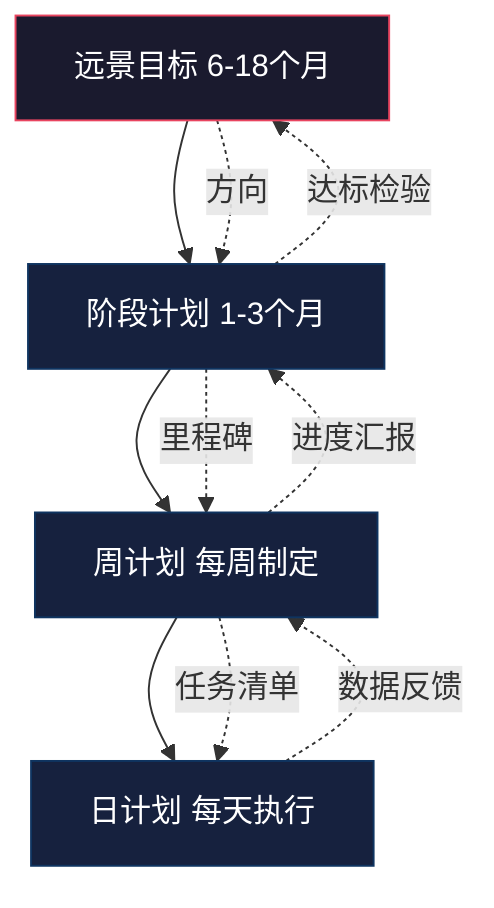

## 十二、制定个性化学习计划

前面十一节分别从理论、方法、工具和考试策略等维度拆解了外语学习的各个面向。但碎片化的方法如果不经过系统整合，就会变成"什么都懂一点，但不知道该怎么组合"的困境。本节的任务就是把这些方法、工具和资源组装成一个完整的、属于你自己的学习操作系统。

制定个性化学习计划不是"列一个时间表"那么简单。一个真正有效的计划，需要精确回答五个问题：我在哪里（评估现状）、我要去哪里（设定目标）、我该怎么走（选择路径）、每天做什么（任务分解）、怎么知道走对了（反馈调整）。以下内容将按这五个环节逐层展开。

### 12.1 评估当前水平：找到你的起点

#### 12.1.1 为什么评估是第一步

很多人跳过评估直接开始学习，结果要么选了过难的材料导致挫败感，要么选了过简的材料浪费时间。认知科学的研究表明，学习效果最优的材料难度处于"可理解性输入"区间——即你理解70%-85%的内容，剩下15%-30%恰好是需要努力的新知识。不评估就选材料，等于闭着眼睛调音量。

评估的目的不是"给自己打分"，而是获得三个关键信息：

1. **你目前能做什么**：能听懂慢速新闻但听不懂常速？能读懂分级读物但读不懂原版小说？
2. **你的薄弱环节在哪里**：听力强但口语弱？词汇量够但语法混乱？
3. **你的学习风格偏好**：视觉型（偏好阅读）、听觉型（偏好听力）、还是动觉型（偏好互动实践）？

#### 12.1.2 四种评估方法及操作流程

**方法一：标准化在线测试（15-30分钟）**

最快速、最客观的评估方式。推荐以下测试，按权威性排序：

| 测试名称 | 语言 | 时长 | 等级体系 | 特点 |
|----------|------|------|----------|------|
| EF SET（efset.org） | 英语 | 15-50分钟 | CEFR A1-C2 | 免费，最权威的在线英语测试之一，结果可直接对应CEFR |
| Cambridge English Test | 英语 | 约30分钟 | CEFR A2-C2 | 剑桥官方出品，分级精确 |
| Dialang（dialangweb.lancaster.ac.uk） | 多语种 | 约30分钟 | CEFR A1-C2 | 免费，支持14种语言，包含自评模块 |
| Duolingo水平测试 | 多语种 | 约5分钟 | 自有体系 | 最快，适合粗略定位 |

**操作建议**：选一个安静的时间段，不查字典、不看手机，真实作答。测试结果偏低没关系——说明你还有巨大的进步空间，这比虚高的分数有用得多。

**方法二：考试成绩对标（即时）**

如果你参加过以下任何考试，可以直接对标CEFR等级：

| 考试成绩 | CEFR等效 | 考试成绩 | CEFR等效 |
|----------|----------|----------|----------|
| CET-4 425-500分 | B1 | 雅思 5.0-5.5 | B1+ |
| CET-4 500+分 | B1+ | 雅思 6.0-6.5 | B2 |
| CET-6 425-500分 | B2 | 雅思 7.0-7.5 | C1 |
| CET-6 500+分 | B2+ | 雅思 8.0+ | C1-C2 |
| 托福 60-78分 | B1+ | JLPT N3 | B1（日语） |
| 托福 79-95分 | B2 | JLPT N2 | B2（日语） |
| 托福 96-110分 | C1 | JLPT N1 | C1（日语） |

**方法三：技能分项自评（10分钟）**

标准化测试给你一个综合分数，但计划制定需要更细粒度的诊断。以下自评清单帮你定位各项技能的具体水平：

**听力自评：**
- [ ] 能听懂 VOA Special English（慢速新闻）→ A2
- [ ] 能听懂 BBC Learning English 的6分钟英语 → B1
- [ ] 能听懂 TED 演讲的大意（不看字幕）→ B1+
- [ ] 能听懂英文播客（如 BBC Global News Podcast）→ B2
- [ ] 能听懂英文脱口秀和快速对话 → B2+
- [ ] 能听懂带口音的英语（印度英语、澳洲英语等）→ C1

**口语自评：**
- [ ] 能用英语做自我介绍 → A2
- [ ] 能就熟悉话题说1-2分钟 → B1
- [ ] 能就抽象话题发表观点并举例 → B2
- [ ] 能进行自然的即兴对话，几乎没有停顿 → B2+
- [ ] 能在专业场合做报告和辩论 → C1

**阅读自评：**
- [ ] 能读懂分级读物（Oxford Bookworms Level 1-2）→ A2
- [ ] 能读懂简化版英文小说 → B1
- [ ] 能读懂英文新闻（BBC、CNN）→ B1+
- [ ] 能读懂原版小说和长篇报道 → B2
- [ ] 能读懂学术论文和专业文献 → C1

**写作自评：**
- [ ] 能写简单的句子和便条 → A2
- [ ] 能写100词左右的段落 → B1
- [ ] 能写300词以上的结构化文章 → B2
- [ ] 能写论证严密的议论文或专业邮件 → C1

**方法四：实战场景测试（最真实）**

理论测试终究是模拟，实战才是最真实的检验。选一个你日常会遇到的真实场景，实际执行一次：

- **职场场景**：用英语写一封工作邮件给同事（不查字典，计时）
- **学术场景**：读一篇英文维基百科文章的前3段，用自己的话总结
- **社交场景**：找一个语言交换伙伴或AI对话工具，就"你的工作"这个话题聊5分钟
- **听力场景**：在YouTube上找一个3分钟的英文视频，不看字幕听一遍，写下你理解的内容

记录下你在每个场景中的困难点，这些就是你学习计划需要重点攻克的方向。

#### 12.1.3 评估结果的整合与记录

完成上述评估后，用以下模板记录你的"语言能力画像"：

┌─────────────────────────────────────────────┐
│          我的语言能力画像（YYYY-MM-DD）         │
├─────────────────────────────────────────────┤
│ 目标语言：______                              │
│ 综合水平：CEFR ____                           │
│                                               │
│ 各项技能：                                     │
│   听力：____  强项/弱项：______               │
│   口语：____  强项/弱项：______               │
│   阅读：____  强项/弱项：______               │
│   写作：____  强项/弱项：______               │
│   词汇：约____词                              │
│                                               │
│ 核心困难点：                                   │
│   1. ________                                 │
│   2. ________                                 │
│   3. ________                                 │
│                                               │
│ 学习风格偏好：视觉 / 听觉 / 动觉 / 混合       │
│ 每日可用时间：____分钟                         │
│ 主要学习目的：______                           │
└─────────────────────────────────────────────┘

这张"画像"就是你制定计划的基石。后面所有的计划安排，都要围绕这张图来设计。

### 12.2 设定学习目标：从模糊愿望到精确坐标

#### 12.2.1 目标设定的SMART原则

"我想学好英语"不是目标，是愿望。愿望不会驱动行动，只有精确的目标才会。语言学习领域的目标设定遵循SMART原则——每一个字母代表一个必要条件，缺少任何一个，目标就会失去执行力。

| SMART维度 | 含义 | 错误示例 | 正确示例 |
|-----------|------|----------|----------|
| S - Specific（具体的） | 明确要提升什么能力 | "提高英语" | "提高英语听力理解能力" |
| M - Measurable（可衡量的） | 有量化指标 | "听懂更多" | "能听懂80%的BBC常速新闻" |
| A - Achievable（可实现的） | 现实可达 | "3个月达到母语水平" | "3个月从B1提升到B1+" |
| R - Relevant（相关的） | 与实际需求挂钩 | "学语法因为别人说重要" | "学商务英语因为下季度要对接海外客户" |
| T - Time-bound（有时限的） | 有明确截止日期 | "以后能流利对话" | "6个月内能用英语进行15分钟工作汇报" |

**实操示例**：将一个模糊愿望转化为SMART目标

模糊愿望："我想把英语学好"
         ↓
第一步（S）：我需要提升英语口语能力
         ↓
第二步（M）：能在3分钟内就一个话题进行流利独白，语速不低于120词/分钟
         ↓
第三步（A）：目前能说1分钟，语速约80词/分钟。3个月提升到目标是合理的
         ↓
第四步（R）：下季度公司有国际项目，需要用英语开周会
         ↓
第五步（T）：2026年9月30日前达成
         ↓
最终目标："2026年9月30日前，能就工作相关话题进行3分钟流利英语独白，
          语速不低于120词/分钟，为国际项目周会做准备"

#### 12.2.2 三层目标体系：远景、阶段、日常

一个有效的学习计划需要三层目标嵌套运作，每一层为下一层提供方向：

**远景目标（6-18个月）**——灯塔

这是你学习旅程的终极坐标。它回答"我为什么要学这门语言"的问题。远景目标不需要特别精确，但必须有足够强的驱动力。

| 学习者类型 | 远景目标示例 |
|-----------|-------------|
| 职场人士 | 2027年底前能独立用英语主持国际会议、阅读英文行业报告 |
| 留学备考 | 2027年6月雅思总分7.0（小分不低于6.5），拿到目标院校offer |
| 兴趣驱动 | 一年内能不看字幕享受英文电影，能用英语写博客记录旅行 |
| 重学者 | 六个月内重建英语基础，能自信地与外国同事交流 |

**阶段目标（1-3个月）**——路标

将远景目标分解为可管理的阶段性里程碑。每个阶段目标应该是一个"小胜利"——完成后能让你明显感受到进步，维持学习动力。

以"雅思7.0"这个远景目标为例，阶段分解如下：

第1个月：完成水平诊断，建立每日学习习惯
         词汇量从4000提升到5000
         能听懂BBC 6 Minute English的80%内容

第2个月：听力精听训练覆盖所有题型
         阅读速度从80词/分钟提升到120词/分钟
         完成20篇写作Task 2练习

第3个月：口语Part 2话题覆盖率达60%
         第一次全真模考，总分达到6.0

第4个月：听力正确率稳定在70%以上
         写作Task 2稳定在6.0水平
         第二次全真模考，总分达到6.5

第5个月：弱项突破（根据模考分析确定）
         第三次全真模考，总分接近7.0

第6个月：考前冲刺，查漏补缺
         稳定模考7.0+，参加正式考试

**日常任务（每天）**——脚步

日常任务是计划的最小执行单元。好的日常任务满足三个条件：具体（做什么）、可计量（做多少）、有时间框（花多久）。

反面示例："今天学英语" → 太模糊，不知道做什么
正面示例："精听BBC 6分钟英语第142期，听写→对答案→跟读，共30分钟"

#### 12.2.3 目标之间的优先级排列

大多数人同时有多个学习需求：既要提升口语应付工作，又要备考雅思，还想看懂英文小说。如果同时推进所有目标，精力分散，每个目标都进展缓慢。

**优先级排序原则**：

1. **有deadline的目标优先**：考试日期 > 项目启动日 > 个人愿望
2. **基础技能优先**：如果听力严重拖后腿，先集中攻克听力，因为它是其他技能的基础
3. **投入产出比最高的优先**：评估哪些技能的提升对你的实际生活改善最大
4. **一次最多聚焦2-3个目标**：超过3个，注意力就会被严重分散

### 12.3 构建学习计划：从目标到行动的完整架构

#### 12.3.1 计划的四层结构

一个完整的个性化学习计划包含四层，从宏观到微观依次是：

**远景目标层**：前面已经设定，它为整个计划提供方向。

**阶段计划层**：每个阶段（1-3个月）确定一个主攻方向和1-2个辅助方向。主攻方向投入60-70%的时间，辅助方向投入30-40%。

**周计划层**：每周日晚上花15分钟制定下周计划。将阶段目标分解为具体的学习任务，分配到每一天。周计划需要考虑这周的特殊情况（出差、加班、聚会等），灵活调整时间分配。

**日计划层**：每天的学习内容。日计划不需要每天重新制定——建立一套固定的"学习模板"后，每天只需要微调即可。

#### 12.3.2 时间预算规划：按可用时间定制方案

不同人的可用时间差异巨大，计划必须匹配你的真实时间预算。以下是六种典型时间预算的方案设计：

**方案A：极简版（15-20分钟/天）——通勤族/极度忙碌者**

适合场景：每天只有碎片时间可用，没有大块学习时间。

| 时间段 | 活动 | 时长 | 工具 |
|--------|------|------|------|
| 早起/洗漱时 | 听英文播客（被动输入） | 10分钟 | 喜马拉雅/Apple Podcasts |
| 午休前 | Anki复习词汇 | 5分钟 | Anki/墨墨背单词 |
| 睡前 | 读一小段英文（新闻/分级读物） | 5分钟 | 手机浏览器/Kindle |

预期效果：维持语言状态不退化，每月新增200-300词汇。适合"低速前进"阶段，不适合冲刺备考。

**方案B：标准版（30-45分钟/天）——上班族/大学生**

适合场景：工作日有一定碎片时间，周末有1-2小时整块时间。

| 时间段 | 活动 | 时长 | 目的 |
|--------|------|------|------|
| 晨间通勤 | 精听/泛听训练 | 15分钟 | 听力输入 |
| 午休 | 阅读（新闻/分级读物/原版书） | 10分钟 | 阅读输入 |
| 晚间固定时段 | 口语/写作练习（二选一） | 15分钟 | 输出训练 |
| 睡前 | Anki词汇复习 | 5分钟 | 词汇巩固 |
| **周末** | 精听精读深度训练/模考/语言交换 | 1-2小时 | 综合提升 |

预期效果：3-6个月可提升一个CEFR小级（如B1→B1+）。

**方案C：进阶版（60-90分钟/天）——有明确目标的学习者**

适合场景：有考试目标、留学计划或职业提升需求。

| 时间段 | 活动 | 时长 | 说明 |
|--------|------|------|------|
| 早间 | 精听训练（听写+跟读） | 20分钟 | 针对薄弱的听力部分 |
| 上午/下午 | 阅读训练（精读+泛读） | 20分钟 | 交替使用不同难度材料 |
| 晚间第一段 | 口语练习（AI对话/语伴） | 20分钟 | 输出训练核心时段 |
| 晚间第二段 | 写作/语法专项 | 15分钟 | 书面输出+知识补强 |
| 睡前 | 词汇复习+当日回顾 | 15分钟 | 间隔重复+反思 |

预期效果：1-3个月可提升一个CEFR小级。

**方案D：冲刺版（2-3小时/天）——备考/短期突破**

适合场景：3个月内有考试、面试等硬性deadline。

此方案将2-3小时拆分为上午、下午、晚上三个时段，每个时段45-60分钟，之间保持充分休息。核心原则是"高强度、短时段、多次数"——认知科学的研究表明，单次学习超过50分钟后效率会显著下降，分成多个短时段效果更好。

| 时段 | 内容 | 时长 |
|------|------|------|
| 上午 | 听力+阅读（输入型训练） | 45-60分钟 |
| 下午 | 写作/语法专项（知识型训练） | 45-60分钟 |
| 晚上 | 口语练习+词汇+复盘（输出型+巩固） | 45-60分钟 |

**方案E：沉浸版（4小时+/天）——全职备考/脱产学习**

适合场景：辞职备考、间隔年、寒暑假等有大块时间的情况。

| 时间段 | 内容 | 时长 |
|--------|------|------|
| 09:00-10:30 | 听力专项（精听+泛听+影子跟读） | 90分钟 |
| 10:45-12:00 | 阅读专项（精读+泛读+词汇记录） | 75分钟 |
| 14:00-15:00 | 写作练习（限时写作+范文分析） | 60分钟 |
| 15:15-16:15 | 口语练习（话题准备+模拟对话+录音回听） | 60分钟 |
| 20:00-20:30 | 词汇复习+当日总结 | 30分钟 |

注意：沉浸式学习需要特别注意疲劳管理。每90分钟休息15-20分钟，下午安排轻量任务。长时间高强度学习容易导致"学习倦怠"，需要每周至少留出半天完全不接触目标语言。

**方案F：周末集中版（工作日几乎无时间）**

适合场景：工作日完全无法学习，只能利用周末的极端情况。

| 时间 | 周六 | 周日 |
|------|------|------|
| 上午 | 听力专项（90分钟） | 阅读专项（90分钟） |
| 下午 | 口语练习+语法学习（90分钟） | 写作练习+词汇整理（90分钟） |
| 晚间 | 电影/剧集（被动输入） | 下周计划制定+Anki导入 |

工作日维持最低限度：每天仅5分钟Anki复习。

#### 12.3.3 技能配比设计：根据短板调整权重

通用的时间分配方案只是起点。真正个性化的计划，需要根据你在12.1节评估中发现的短板来调整权重。

**权重调整原则**：短板投入更多时间，但不能完全忽略长板。语言能力的四项技能是相互支撑的——听力差可能拖累口语，阅读差可能拖累写作。推荐的调整幅度是±15%——即从默认配比中，将短板的占比提升15%，从长板中等量减少。

以下是一个根据短板自动调整的权重参考表：

| 你的主要短板 | 听力占比 | 口语占比 | 阅读占比 | 写作占比 | 词汇/语法占比 |
|-------------|---------|---------|---------|---------|-------------|
| 均衡型（无明显短板） | 25% | 20% | 25% | 15% | 15% |
| 听力弱 | 40% | 15% | 20% | 10% | 15% |
| 口语弱 | 20% | 35% | 15% | 15% | 15% |
| 阅读弱 | 15% | 15% | 40% | 15% | 15% |
| 写作弱 | 15% | 15% | 20% | 35% | 15% |
| 词汇量不足 | 15% | 15% | 20% | 15% | 35% |
| 听力+口语双弱 | 30% | 30% | 15% | 10% | 15% |

#### 12.3.4 材料选择矩阵

计划确定了"练什么"和"练多久"之后，还需要决定"用什么练"。材料选择遵循三个原则：

**原则一：难度匹配**。材料难度应处于你的"i+1区间"——即70-85%可理解。以下是各水平推荐材料的快速索引：

| 水平 | 听力材料 | 阅读材料 | 口语素材 | 写作练习 |
|------|----------|----------|----------|----------|
| A1-A2 | VOA Special English, ESL Pod | Oxford Bookworms Starter-L1, 分级读物 | 跟读简单对话, 自我介绍 | 写简单句和段落 |
| B1 | BBC 6 Minute English, TED-Ed | 简化小说, 英文新闻头条 | 描述图片, 讨论日常话题 | 日记, 简单邮件 |
| B2 | BBC Global News, TED Talks | 原版小说, 长篇报道 | 辩论, 主题演讲 | 议论文, 评论文章 |
| C1-C2 | 电影原声, 脱口秀, 带口音播客 | 学术论文, 文学作品 | 即兴演讲, 专业讨论 | 学术写作, 专业报告 |

**原则二：兴趣优先**。同一难度级别的材料有很多种，选你最感兴趣的。喜欢科技就听Lex Fridman Podcast，喜欢犯罪故事就听Crime Junkie，喜欢烹饪就看Binging with Babish。兴趣驱动的学习效率比"应该学"的材料高2-3倍。

**原则三：可获取性**。选你能方便获取的材料。如果你用手机学习的时间多，就选有APP的平台；如果用电脑时间多，就选网页端体验好的。

### 12.4 计划执行的支撑系统

#### 12.4.1 习惯锚定：让学习变成自动驾驶

计划制定得再好，执行不了就是废纸。行为科学的研究提供了几个经过验证的策略来确保计划落地：

**习惯堆叠（Habit Stacking）**：把新习惯绑定到已有的稳定习惯上。已有习惯是"锚"，新习惯是"挂件"。

已有习惯（锚）          新学习习惯（挂件）
─────────────────────────────────────────
早上刷牙        →      刷牙时听英文播客10分钟
通勤坐地铁      →      地铁上用Anki复习词汇
午饭后休息      →      休息时读一篇英文新闻
晚上躺到床上    →      睡前读10分钟英文书

**环境设计**：让学习行为变得"阻力最小"，让不学习变得"需要额外努力"。

- 手机首屏放学习APP（Anki、词典、播客），把社交媒体APP移到第二屏
- 床头放一本英文书，睡前自然会拿起
- 耳机放在包里固定位置，通勤时自然会戴上听播客
- 浏览器书签栏放英文学习网站，每天打开浏览器就能看到

**"两分钟规则"**：不想学习的时候，承诺只学2分钟。打开Anki复习5个单词，或读一段英文新闻。大多数时候，开始之后你就会继续学下去。这利用了心理学中的"蔡格尼克效应"——开始了的任务比未开始的任务有更强的驱动力让你去完成。

#### 12.4.2 进度追踪系统

没有数据的计划是盲目的。你需要一套简洁的追踪系统来记录和分析学习数据。

**每日记录（1分钟完成）**：

在笔记本、电子表格或学习APP中记录：

日期：____
学习时长：____分钟
学习内容：
  □ 听力 ___分钟  □ 口语 ___分钟
  □ 阅读 ___分钟  □ 写作 ___分钟
  □ 词汇 ___分钟  □ 语法 ___分钟
今日收获：____________________
今日困难：____________________

**每周复盘（15分钟完成）**：

每周日晚上花15分钟回顾本周数据，回答以下问题：

1. 本周学习总时长是否达到目标？（是/否，差多少？）
2. 各技能的时间分配是否符合计划？（是否偏科？）
3. 本周最大的进步是什么？（具体举例）
4. 本周最大的困难是什么？（需要怎么调整？）
5. 下周需要做出什么调整？

**月度评估（30分钟完成）**：

每月进行一次水平重新评估，与上月的"语言能力画像"对比。可以使用以下方法：

- 重做一次EF SET或其他在线测试，对比分数变化
- 录一段口语录音，与一个月前的录音对比
- 读一篇比上月难度高一级的文章，看理解率
- 写一篇限时作文，请AI或老师批改

#### 12.4.3 反馈与纠错机制

学习中的反馈越及时、越具体，进步越快。你需要建立至少两种反馈渠道：

**自动化反馈**：
- Anki自动追踪记忆效果，调整复习间隔
- 听力APP的听写模式自动标出错误
- 写作批改工具（如Grammarly、AI写作助手）自动标注语法错误
- 口语练习APP的发音评分功能

**人工反馈**：
- 语言交换伙伴指出你的表达错误
- 付费老师提供针对性的改进建议
- AI对话工具（如ChatGPT）纠正你的语法和用词
- 英文写作社区（如Lang-8）的母语者修改

**建立"错误银行"**：每次收到反馈后，把错误记录在一个专门的文档中，按类型分类（语法错误、词汇误用、发音问题、表达不地道等）。每周回顾一次"错误银行"，针对性地练习最常犯的错误。

错误银行模板：
┌──────────────────────────────────────────────────┐
│ 错误银行                                         │
├──────┬───────────┬──────────┬─────────┬──────────┤
│ 日期  │ 我的表达    │ 正确表达   │ 错误类型  │ 复习次数  │
├──────┼───────────┼──────────┼─────────┼──────────┤
│ 6/24 │ I very like │ I really  │ 词汇搭配  │ ✓✓       │
│      │ this book  │ like this │         │          │
│      │           │ book      │         │          │
├──────┼───────────┼──────────┼─────────┼──────────┤
│ 6/25 │ He suggest │ He        │ 主谓一致  │ ✓        │
│      │ me to go   │ suggested │         │          │
│      │           │ that I go │         │          │
└──────┴───────────┴──────────┴─────────┴──────────┘

### 12.5 完整计划案例：五类典型学习者的个性化方案

以下提供五个完整的计划案例，覆盖最常见的学习者画像。每个案例都包含评估结果、目标设定、每周安排和追踪方法。

#### 案例一：职场人士——英语工作汇报突破计划

**背景**：张先生，28岁，互联网公司产品经理，CET-6已过但口语薄弱，下季度需要每周用英语做15分钟产品汇报。每日可用时间：工作日40分钟，周末2小时。

**评估结果**：
- 听力：B1+（能听懂大部分日常对话，快速讨论跟不上）
- 口语：A2+（能说简单句子，但连贯表达困难）
- 阅读：B2（能读英文产品文档和行业报告）
- 写作：B1+（能写工作邮件，但不够地道）

**目标**：3个月内能用英语进行15分钟的产品工作汇报，发音清晰、逻辑连贯、表达专业。

**每周安排**：

| 时间 | 周一 | 周二 | 周三 | 周四 | 周五 | 周六 | 周日 |
|------|------|------|------|------|------|------|------|
| 晨间(15min) | 播客泛听 | Anki复习 | 播客泛听 | Anki复习 | 播客泛听 | — | — |
| 午休(10min) | 读英文产品文档 | — | 读英文行业报道 | — | 读英文产品文档 | — | — |
| 晚间(15min) | AI口语练习 | 影子跟读 | AI口语练习 | 影子跟读 | 录音回听+复盘 | — | — |
| 周末(60min) | — | — | — | — | — | 模拟产品汇报(全程英文) | 下周计划+错误银行回顾 |

**关键策略**：
- 口语练习围绕"产品汇报"场景展开：练习描述数据趋势、解释功能逻辑、回答技术问题
- 每周六进行一次完整的产品汇报模拟，录制视频，回看分析
- 建立产品英语专用词汇表（feature, roadmap, stakeholder, KPI, sprint等）

#### 案例二：留学备考——雅思6.5分冲刺计划

**背景**：李同学，22岁，大三学生，计划毕业后去英国读研，需要雅思总分6.5（小分不低于6.0）。目前水平约B1+，距离目标还差约0.5-1分。每日可用时间：2小时。

**评估结果**：
- 听力：5.5分（选择题正确率低，跟不上Section 3-4的语速）
- 阅读：6.0分（时间不够用，Heading题失分多）
- 写作：5.5分（Task 2逻辑不够严密，词汇多样性不足）
- 口语：5.5分（Part 2经常说不满时间，Part 3回答太短）

**目标**：6个月内雅思总分6.5+，各科不低于6.0。

**每周安排**：

| 日 | 内容 | 时长 |
|----|------|------|
| 周一 | 听力精听（Section 3真题）+ 口语Part 2话题练习 | 120分钟 |
| 周二 | 阅读真题（限时练习）+ 写作Task 2练习 | 120分钟 |
| 周三 | 听力精听（Section 4）+ 词汇学习（AWL学术词汇表） | 120分钟 |
| 周四 | 阅读专项（Heading题型突破）+ 写作Task 1练习 | 120分钟 |
| 周五 | 听力泛听（BBC/播客）+ 口语Part 3深度回答练习 | 120分钟 |
| 周六 | 全真模考（听力+阅读限时）+ 模考复盘分析 | 180分钟 |
| 周日 | 写作范文精读 + 口语话题素材整理 + 下周计划 | 90分钟 |

**阶段里程碑**：
- 第2个月末：第一次全真模考，总分6.0
- 第4个月末：全真模考稳定在6.5，写作和口语达到6.0
- 第6个月：正式考试，目标6.5+

#### 案例三：兴趣驱动——自由阅读型学习计划

**背景**：王女士，35岁，全职妈妈，学英语纯粹为了能读英文小说和看美剧。目前水平约A2-B1，每天可用时间：孩子午睡时30分钟 + 晚间30分钟。

**评估结果**：
- 听力：A2（能听懂慢速，常速跟不上）
- 口语：A2（基础对话可以，深入聊不了）
- 阅读：B1（能读分级读物，原版小说还很吃力）
- 写作：A2（几乎不写英文）

**目标**：一年内能读Oxford Bookworms Level 4-5的简化版小说，能看Friends不看字幕理解70%。

**每周安排**：

| 时间 | 周一-周五 | 周六 | 周日 |
|------|----------|------|------|
| 午睡时(30min) | 读Oxford Bookworms当前级别 | 看一集Friends（英文字幕） | 休息 |
| 晚间(30min) | 听有声书（配合阅读的同一本书） | 看一集Friends（无字幕尝试） | 下周阅读计划 |

**关键策略**：
- 阅读选书遵循"5页测试法"：读5页，如果生词超过15%就太难了，换低一级的书
- 看Friends的三遍法：第一遍英文字幕理解剧情→第二遍无字幕尝试听→第三遍挑出没听懂的部分查字典
- 不追求系统学语法，通过大量阅读自然积累语感
- 每月记录读完的书和能听懂的Friends百分比，见证进步

#### 案例四：重学者——信心重建计划

**背景**：赵先生，40岁，大学过了CET-6但毕业后十几年没用过英语，现在工作中突然需要用英语（公司被收购，需要对接海外团队）。感觉"什么都忘了"，对重新学英语感到焦虑。

**评估结果**：
- 听力：A2（太久没听，反应很慢）
- 口语：A2（能说单词，句子组装不起来）
- 阅读：B1（靠猜能读懂大部分，但不确定）
- 写作：A2+（能写简单邮件，复杂表达不行）

**目标**：6个月内能用英语进行基本工作沟通（邮件+30分钟会议）。

**每日安排（45分钟）**：

| 时间段 | 活动 | 说明 |
|--------|------|------|
| 通勤(15min) | 听ESL Pod或BBC Learning English | 重新建立英语听觉记忆 |
| 午休(10min) | Anki复习（从CET-4核心词汇开始） | 唤醒沉睡的词汇记忆 |
| 晚间(20min) | 周一三五：跟读+AI口语练习；周二四：读英文邮件范文+仿写 | 输出训练 |

**关键策略**：
- 心态管理最重要：不要和十几年前的自己比，接受"从A2开始也完全OK"
- 利用"残留记忆"：大学学过的英语没有消失，只是被"压缩"了。用Anki复习旧词汇，会比学新词汇快很多（"re-learning效应"）
- 工作场景优先：先学工作邮件模板、会议常用表达、行业术语，其他慢慢来
- 每两周录一段1分钟的英语自我介绍，对比进步

#### 案例五：多语言学习者——日英并行计划

**背景**：孙同学，25岁，英语B2水平（能流利工作沟通），想学日语（看动漫、未来考虑去日本工作）。每天可用时间：90分钟。

**目标**：12个月内日语达到N3水平（日常会话流利），同时维持英语不退化。

**每日安排（90分钟）**：

| 时间段 | 活动 | 时长 |
|--------|------|------|
| 晨间 | 日语：Anki假名+汉字+词汇 | 15分钟 |
| 通勤 | 日语：播客/动漫听力（被动输入） | 20分钟 |
| 午休 | 英语：Anki复习+英文阅读 | 15分钟 |
| 晚间第一段 | 日语：教材学习（《大家的日语》或《Genki》） | 25分钟 |
| 晚间第二段 | 日语：口语练习（跟读/italki/HelloTalk） | 15分钟 |

**关键策略**：
- 英语只做"维持型"学习——每天15分钟Anki+阅读，保持不退化即可
- 日语作为主攻方向，投入75%的时间
- 利用英语学日语：用英文的日语学习资源（如Tae Kim's Guide to Learning Japanese），同时锻炼两门语言
- 每月英语口语场景：用英语和语伴聊天1小时，确保英语不生疏

### 12.6 计划的动态调整：应对变化的策略

#### 12.6.1 月度复盘的结构化流程

学习计划不是刻在石头上的。每个月的最后一个周日，花30分钟进行一次结构化复盘：

**第一步：数据回顾（5分钟）**
- 本月学习总时长：____小时（目标：____小时，完成率：____%）
- 各技能时间分配：听力____% / 口语____% / 阅读____% / 写作____% / 词汇____%
- Anki复习完成率：____%

**第二步：水平评估（10分钟）**
- 重做一次简易水平测试，对比上月分数
- 回听上月的口语录音，感受差异
- 回顾"错误银行"，统计本月新增错误类型和数量

**第三步：策略反思（10分钟）**
- 本月最有效的学习活动是什么？（继续保持）
- 本月最无效的学习活动是什么？（考虑替换或删除）
- 本月遇到了什么瓶颈？（需要什么额外支持？）
- 下月的重点应该是什么？

**第四步：调整计划（5分钟）**
- 根据以上反思，微调下月的时间分配
- 如果某项技能提前达标，将时间重新分配给短板
- 如果某个方法连续两周无效，果断换方法

#### 12.6.2 常见调整场景及应对方案

**场景一：时间突然减少（加班、出差、生活变动）**

应对方案：切换到"极简版"方案，但不要完全停止。每天15分钟的最低承诺（Anki复习5分钟+听力5分钟+阅读5分钟），保持学习惯性。等时间恢复后，从上一次的进度继续，不要试图"补课"——认知科学表明，试图补回错过的学习时间往往导致倦怠。

**场景二：进步停滞（平台期）**

应对方案：平台期是语言学习中的正常现象，通常出现在B1-B2阶段（"中级瓶颈"）。突破平台期的方法：
1. **改变输入来源**：如果一直在听播客，换成看美剧或听有声书
2. **提升输出比重**：从60%输入/40%输出调整为40%输入/60%输出
3. **增加难度**：尝试比当前水平高一级的材料
4. **改变学习方式**：如果一直在做精听，换成影子跟读法或听力复述

**场景三：动力下降（不想学了）**

应对方案：动力下降是每个人都会遇到的，不是意志力的问题，而是系统设计的问题。
1. **降低标准而非放弃**：状态不好时完成最低15分钟承诺即可
2. **切换到轻松内容**：不想做精听就看一集喜欢的美剧
3. **回顾进步**：看自己一个月前的口语录音和今天的对比
4. **社交化学习**：找语伴一起学，或加入学习社群
5. **给自己放假**：连续学了6周以上，允许自己休息3-5天，回来后状态会更好

**场景四：目标变化（工作调整、考试日期变更等）**

应对方案：目标变了，计划就跟着变。重新走一遍12.2的目标设定流程，更新远景目标和阶段目标，然后重新制定周计划。不要因为"之前的努力白费了"而沮丧——语言能力是积累的，之前的每一分钟学习都不会浪费。

### 12.7 计划制定中的常见陷阱

#### 陷阱一：计划过于理想化

**表现**：把每天的时间排得满满当当，没有缓冲余地。一旦某天没完成，就产生挫败感，连锁反应导致整个计划崩溃。

**纠正**：计划只排到实际可用时间的70-80%，留出20-30%的缓冲。比如你每天有60分钟可用，就只安排40-50分钟的学习任务。"超额完成"比"未完成"的心理效果好得多。

#### 陷阱二：只输入不输出

**表现**：每天花大量时间听播客、读文章、背单词，但从不开口说、不动笔写。感觉"一直在学"，但实际能力提升缓慢。

**纠正**：根据当前阶段调整输入输出比例（参见12.3.3节）。至少每天安排10-15分钟的输出练习——哪怕只是用英语自言自语、写3句话的日记。

#### 陷阱三：频繁更换方法和材料

**表现**：这个APP用了两天觉得不好，换另一个；这本教材学了三章觉得太慢，换一本。结果每样都只学了皮毛。

**纠正**：给自己设一个"最少坚持期"——任何方法至少坚持2周再评估效果。2周内不换方法，只做微调。两周后如果确实无效，再换不迟。

#### 陷阱四：忽视反馈和调整

**表现**：制定完计划后就不管了，每天机械执行，不知道自己在进步还是原地踏步。

**纠正**：严格执行12.4.2的追踪系统——每日1分钟记录、每周15分钟复盘、每月30分钟评估。没有数据的计划就是蒙眼走路。

#### 陷阱五：追求"完美的开始时间"

**表现**："下周一再开始""下个月一号正式开始""等我买好新设备再开始"。

**纠正**：现在就开始。不需要完美的计划、完美的工具、完美的时机。你今天花5分钟下载一个Anki、导入一组核心词汇，就已经比"等下周一"的人领先了。

### 12.8 AI辅助计划制定与执行

#### 12.8.1 用AI优化计划

AI工具可以在多个环节辅助你制定和执行学习计划：

**水平诊断**：向AI描述你的英语使用场景和困难点，让它帮你分析各技能水平和短板。例如："我能读懂BBC新闻的大部分内容，但开会时听不懂同事的快速讨论，口语也跟不上。帮我分析我的水平和需要重点提升的方向。"

**目标分解**：把你的远景目标告诉AI，让它帮你分解为SMART阶段目标。例如："我的目标是一年内雅思7.0，目前自测约5.5。帮我制定分阶段的备考计划。"

**材料推荐**：告诉AI你的水平和兴趣，让它推荐适合的学习材料。例如："我是B1水平，对科技感兴趣，推荐适合我水平的英文播客和读物。"

#### 12.8.2 用AI作为学习伙伴

**口语练习**：AI对话工具（如ChatGPT语音模式）是目前最便捷的口语练习伙伴——24小时可用、零社交压力、不会嘲笑你的错误、可以随时暂停和重复。每天用AI练15-20分钟口语，比一周只和语伴练一次效果更好。

**写作批改**：写完英文日记或文章后，请AI帮你批改，重点指出语法错误、用词不当和表达不地道的地方。要求AI不仅改正，还要解释为什么原来的写法不对。

**学习反馈**：每周把学习数据发给AI，让它帮你分析进步趋势和需要调整的方向。例如："本周我听力练习3小时、口语1.5小时、阅读2小时、写作1小时。我的主要目标是提升口语，但我发现口语时间最少。怎么调整？"

#### 12.8.3 AI不能替代的部分

尽管AI是强大的学习加速器，但以下环节仍需要真人参与：

- **真实社交场景练习**：AI可以模拟对话，但无法替代与真人交流时的社交压力管理、文化差异理解、非语言信号（表情、肢体语言）的解读
- **情感支持和社群归属**：学习社群中的互相鼓励、经验分享、共同坚持，是AI无法提供的
- **专业考试指导**：雅思托福等考试的写作和口语评分标准复杂，AI的评分可能与真人考官有差异，正式备考仍建议参考专业教师的意见

### 12.9 从计划到习惯：学习计划的终极形态

#### 12.9.1 当计划变成习惯

学习计划的最终目标是让自己不再需要计划——当外语学习变成像刷牙一样的日常习惯时，你就成功了。这个转变通常需要60-90天的持续执行。

**习惯养成的三个阶段**：

| 阶段 | 时间 | 特征 | 策略 |
|------|------|------|------|
| 启动期 | 第1-2周 | 需要刻意提醒和意志力 | 设置闹钟、绑定已有习惯、降低启动阻力 |
| 适应期 | 第3-8周 | 逐渐变得自然，偶尔需要提醒 | 开始享受学习过程、记录进步数据 |
| 自动化期 | 第9周+ | 不学反而不舒服 | 学习已成为生活的一部分 |

#### 12.9.2 计划的进化

一个好的学习者不是"永远按同一个计划学习"，而是让计划随自己的成长而进化。

**初级阶段的计划**是"规定性的"——告诉你每天该做什么、做多久、用什么材料。因为初学者缺乏判断力，需要外部结构来指导。

**中级阶段的计划**是"指导性的"——给你一个框架和方向，但具体执行可以根据当天情况灵活调整。你开始知道什么方法对自己有效。

**高级阶段的计划**是"自适应的"——你已经完全了解自己的学习风格、偏好和节奏，计划内化为直觉。你不再需要写下来，因为学习已经融入了你的生活方式。

这就是制定个性化学习计划的最终目的——不是让你永远依赖一个计划，而是通过计划帮你建立一套自运转的学习系统。当这个系统完全运转起来，你就拥有了学习任何新语言的能力——因为方法论是可迁移的，习惯是可复用的。

***

