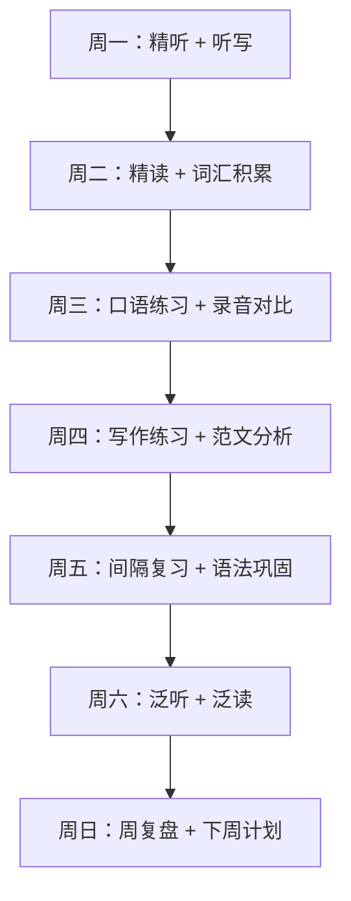

## 十三、本节小结

"具体方案"部分共十二节，覆盖了从英语四项基本技能（听、说、读、写）到词汇体系、多语种学习、考试备考和个性化计划制定的完整外语学习方法论。本节不是对前文的简单复述，而是将所有章节的核心理念、方法体系和关键数据提炼为一个可快速查阅的行动指南，同时补充各章节因篇幅限制未能展开的交叉知识和综合策略。

### 13.1 十二节内容全景回顾

以下表格梳理了每一节的核心议题、关键方法论和目标读者：

| 节次 | 主题 | 核心理念 | 适用阶段 |
|------|------|----------|----------|
| 第一节 | 英语学习整体方法论 | 四维能力模型、输入-输出平衡、i+1 理论 | 所有阶段 |
| 第二节 | 听力训练方案 | 自下而上 vs 自上而下加工、精听-泛听交替 | 入门→高级 |
| 第三节 | 口语提升方案 | 五维口语模型（发音/流利度/词汇/语法/语用） | 入门→高级 |
| 第四节 | 阅读能力培养 | 分级阅读、策略阅读、批判性阅读三层递进 | 入门→高级 |
| 第五节 | 写作能力培养 | 从句子到篇章、从模仿到创造的渐进路径 | 初级→高级 |
| 第六节 | 词汇积累方案 | 词汇广度 vs 深度、词频分级、语境习得 | 所有阶段 |
| 第七节 | 日语学习方案 | JLPT N5→N1 体系、汉字优势与陷阱 | 入门→高级 |
| 第八节 | 其他语言学习方案 | 八语种路线图、语言选择决策框架 | 入门 |
| 第九节 | 词汇记忆方法详解 | 间隔重复、语境记忆、词根词缀法 | 所有阶段 |
| 第十节 | 口语提升方法详解 | Levelt 言语产出模型、发音/流利度/深度三维度 | 初级→高级 |
| 第十一节 | 考试备考策略 | 雅思/托福/四六级/CATTI 分科备考时间线 | 有考试需求者 |
| 第十二节 | 制定个性化学习计划 | 水平评估→目标设定→计划编排→执行反馈 | 所有阶段 |

### 13.2 贯穿全篇的核心理论框架

十二节内容虽然各有侧重，但底层理论高度统一。掌握这些理论，能帮助你在任何语言学习场景中做出正确判断，而不仅仅局限于英语或日语。

#### 13.2.1 Krashen 的输入假说与 i+1 原则

Stephen Krashen（1982）的输入假说（Input Hypothesis）是贯穿全篇的第一性原理。其核心主张：

- **可理解输入（Comprehensible Input）**：语言习得发生在你接触到略高于当前水平（i+1）的输入时。输入太简单（i+0）没有学习效果，太难（i+2 以上）则导致焦虑和放弃。
- **习得-学习假说（Acquisition-Learning Distinction）**：无意识的"习得"（像儿童学母语）比有意识的"学习"（像背语法规则）更能产生流利的输出能力。
- **情感过滤假说（Affective Filter）**：焦虑、不自信、缺乏动机会提高"情感过滤"，阻碍输入转化为习得。

**在各节中的体现**：

- **听力训练**（第二节）：精听选择比你水平略难的材料，泛听选择比你水平稍低的材料，两者交替形成 i+1 梯度。
- **阅读训练**（第四节）：分级阅读的核心逻辑就是 i+1——每当你能理解当前级别 95% 以上的内容时，就升级。
- **词汇积累**（第六节）：词频分级的本质也是 i+1——先掌握高频 3000 词（覆盖日常 95% 文本），再逐步进入学术词汇和低频词。
- **日语学习**（第七节）：JLPT 的 N5→N1 分级体系本质上就是 i+1 的制度化。

**实操启示**：如果你在学习中感到极度困难或毫无进步，问题通常不是"方法不对"，而是"材料难度不对"。降一级试试，效果立竿见影。

#### 13.2.2 输出驱动假说与输入-输出平衡

Merrill Swain（1985）提出"输出假说"（Output Hypothesis），补充了 Krashen 理论的不足：光有输入不够，输出在语言习得中扮演不可替代的角色。输出迫使你：

1. **检验假设**：你认为某个语法结构是这样用的，写出来说出来才能被验证或纠正。
2. **注意差距**：输出时你会意识到"我想说的"和"我能说的"之间的鸿沟，从而触发对输入中相关表达的注意。
3. **促进流利化**：反复输出让语言知识从"知道"转化为"自动化"。

**全篇的输入-输出配比建议**：

| 阶段 | 输入占比 | 输出占比 | 说明 |
|------|----------|----------|------|
| 零基础（0-3个月） | 80% | 20% | 大量听力和阅读输入，少量跟读和抄写 |
| 初级（3-12个月） | 65% | 35% | 精听精读为主，开始口语对话和短文写作 |
| 中级（1-2年） | 50% | 50% | 输入输出并重，口语和写作训练量显著增加 |
| 高级（2年以上） | 40% | 60% | 输入转向深度内容（学术论文、文学原著），输出转向专业场景 |

#### 13.2.3 间隔重复与记忆科学

Hermann Ebbinghaus 的遗忘曲线（1885）揭示了记忆衰减的数学规律：学习后 20 分钟遗忘 42%，1 小时遗忘 56%，1 天遗忘 74%，6 天遗忘 77%。间隔重复（Spaced Repetition）通过在即将遗忘时复习，以最小时间成本维持长期记忆。

**在各节中的应用**：

- **词汇记忆**（第九节）：Anki、SuperMemo 等工具的核心算法就是间隔重复。推荐初始复习间隔为 1天→3天→7天→14天→30天。
- **语法巩固**：语法规则同样需要间隔重复——学完一个语法点后，分别在 1天、3天、7天、14天后通过练习复习。
- **口语表达**：背诵的对话和句型模板也需要间隔复习，否则一周后就会遗忘。
- **听力训练**：精听过的材料在 1 周后重听，测试是否仍能完整理解。

**常见误区**：

- ❌ **一次性大量复习**：考前突击背 500 个单词，一周后遗忘 80%。这是集中学习（massed practice），不是间隔重复。
- ❌ **只用一种复习间隔**：所有单词用同样的间隔节奏。正确做法是按难度差异化——简单的拉长间隔，难的缩短间隔。
- ✅ **正确做法**：每天固定 30 分钟用于间隔复习，覆盖词汇、语法、句型、听力材料，比每天 2 小时突击效果更好。

#### 13.2.4 元认知与自我监控

元认知（Metacognition）是"对认知的认知"——你能否准确判断自己"会了还是没会"。研究表明，学习者最常犯的错误就是高估自己的掌握程度（Dunning-Kruger 效应在语言学习中普遍存在）。

**各节中提到的元认知策略汇总**：

- **听力**（第二节）：听写后对比原文，标记所有遗漏和错误，量化听力理解率。
- **口语**（第三节/第十节）：录音回放自己的口语，对比母语者发音，标记具体差异。
- **阅读**（第四节）：读完一段后用一句话总结主旨，检查是否真正理解。
- **写作**（第五节）：写完后至少间隔 24 小时再修改，利用"心理距离"发现错误。
- **词汇**（第六节/第九节）：不仅测试"看到单词能想起意思"，还要测试"看到意思能拼出单词"和"能在句子中正确使用"。
- **个性化计划**（第十二节）：每月进行一次正式水平评估，对比上月数据，判断学习策略是否有效。

### 13.3 各阶段的核心行动清单

不同水平的学习者面临的问题截然不同。以下按水平分级，提取各节中最具性价比的行动项。

#### 13.3.1 零基础阶段（0-3 个月）

**目标**：建立语音系统认知，掌握基础 1000 词，能进行最简单的日常对话。

**每日训练安排**（总计 60-90 分钟）：

| 时段 | 任务 | 时长 | 来源章节 |
|------|------|------|----------|
| 早晨 | 音标/假名学习 + 跟读练习 | 20 分钟 | 第二节、第七节 |
| 午间 | 间隔重复复习词汇卡片 | 15 分钟 | 第六节、第九节 |
| 晚间 | 简单听力材料精听 | 20 分钟 | 第二节 |
| 睡前 | 基础课文朗读 + 抄写 | 15 分钟 | 第四节、第五节 |

**关键提醒**：

- 音标/假名阶段不要跳过。很多"速成班"跳过音标直接学句型，导致后期发音定型后极难纠正。国际音标（IPA）是所有外语发音的基础工具。
- 前 3 个月的词汇目标不是"背完 1000 词"，而是"真正掌握 300 词"——能听懂、能说出、能正确拼写、知道常见搭配。

#### 13.3.2 初级阶段（3-12 个月）

**目标**：掌握 3000 词，能读懂简单文章，能进行日常话题对话，能写 100 词左右的短文。

**每周训练结构**：

**各技能的核心训练方法**（提取自各节精华）：

- **听力**：听写法（dictation）是初级阶段效率最高的听力训练方法。选择 1-2 分钟的材料，先完整听 3 遍，逐句听写，最后对照原文纠错。每天 20 分钟，坚持 3 个月后听力水平会有质的飞跃。
- **口语**：影子跟读法（Shadowing）。播放母语音频，延迟 0.5-1 秒同步跟读，不暂停。每天 15-20 分钟，同步训练发音、语调和流利度。
- **阅读**：精读为主，每篇文章读 3 遍——第一遍理解大意，第二遍查生词标注，第三遍分析句式和篇章结构。精读材料选择比你水平稍难的文章，生词率控制在 5-8%。
- **写作**：仿写法。找到一篇优秀的范文，先分析其结构和用词，然后用同样的结构写一个不同主题的文章。每周 2 篇，每篇 100-200 词。

#### 13.3.3 中级阶段（1-2 年）

**目标**：掌握 6000-8000 词，能流畅阅读中等难度文章，口语讨论复杂话题，写作 500 词以上的文章。

**阶段特征**：中级阶段最容易出现"高原期"（plateau）——你感觉自己在原地踏步，进步速度显著放缓。这是正常现象，说明你的"舒适区"和"学习区"之间的差距缩小了，需要调整策略突破瓶颈。

**突破高原期的四条路径**：

1. **扩大输入广度**：从单一材料类型（如教材）扩展到多样化输入——新闻、播客、纪录片、小说、论坛帖子、社交媒体。
2. **增加输出复杂度**：口语从"描述日常"升级到"表达观点"和"进行辩论"；写作从"记叙文"升级到"议论文"和"分析性文章"。
3. **系统化语法学习**：中级阶段需要回头系统梳理语法知识，填补初级阶段遗留的模糊地带。推荐使用语法专项练习册配合间隔重复。
4. **专项突破弱项**：多数中级学习者的弱项是口语中的"语用能力"（知道什么场合说什么话）和写作中的"篇章连贯性"（段落之间逻辑清晰），需要有针对性地训练。

#### 13.3.4 高级阶段（2 年以上）

**目标**：词汇量 12000+，能读懂学术文献和文学原著，口语在专业场景中自如表达，写作达到专业出版水平。

**高级阶段的核心策略**——从"学语言"转向"用语言学知识"：

- 用目标语言学习你专业领域的知识（如用英语学编程、用日语学设计），语言和专业同步提升。
- 阅读原版书而非简写版。第一次读可能会慢，但原版的语言密度和文化深度是简写版无法替代的。
- 参与目标语言社区的实际讨论——论坛回答问题、社交媒体发帖、参加线下语言角。
- 翻译练习：将目标语言的优秀文章翻译成中文，再将中文翻译回原文，对比差异。这是高级阶段最能暴露细微差距的训练方法。

### 13.4 工具与资源速查表

将各节推荐的工具和资源汇总如下，按用途分类，方便快速查阅。

#### 13.4.1 间隔重复与词汇工具

| 工具 | 平台 | 特点 | 适用场景 |
|------|------|------|----------|
| Anki | 全平台 | 开源、算法优秀、自定义卡片 | 所有语言的词汇和句型记忆 |
| SuperMemo | Windows/网页 | 最早的间隔重复软件，算法精确 | 对算法有要求的深度学习者 |
| Quizlet | 网页/移动端 | 社区共享卡片组、界面友好 | 快速上手、无需自行制卡 |
| 墨墨背单词 | iOS/Android | 内置多种词汇书、数据统计详细 | 中文母语者背英语单词 |
| 词汇量测试网站 testyourvocab.com | 网页 | 快速评估当前词汇量 | 每月定期自测 |

#### 13.4.2 听力训练工具

| 工具 | 用途 | 推荐理由 |
|------|------|----------|
| 每日英语听力 App | 泛听/精听 | 海量分级材料、支持变速和逐句播放 |
| Podcast Addict / Apple Podcasts | 泛听 | 播客是最自然的高级听力材料来源 |
| Audible / 喜马拉雅 | 有声书 | 长篇听力输入，训练持续注意力 |
| YouTube（带字幕） | 精听 | 自动生成字幕 + 手动切换，免费且内容无限 |
| Forvo | 发音查询 | 母语者真人发音，覆盖 300+ 语言 |

#### 13.4.3 口语练习工具

| 工具 | 用途 | 推荐理由 |
|------|------|----------|
| italki | 一对一口语课 | 全球母语教师，价格灵活（$5-30/小时） |
| HelloTalk | 语言交换 | 找母语者互相练习，免费 |
| Speechling | 发音纠正 | AI + 真人教练反馈，针对发音问题 |
| Elsa Speak | AI 发音训练 | 语音识别精确到音素级别，即时反馈 |
| 录音回放 | 自我评估 | 零成本，最被低估的口语训练方法 |

#### 13.4.4 阅读材料来源

| 平台 | 适用水平 | 内容类型 |
|------|----------|----------|
| News in Levels | 初级→中级 | 新闻三级难度版本 |
| BBC Learning English | 初级→高级 | 分级学习材料 + 真实新闻 |
| Project Gutenberg | 高级 | 免费英文经典文学原著 |
| NHK World Easy Japanese | 日语初级 | 简化日语新闻和生活用语 |
| 青空文庫 | 日语中高级 | 日本文学公版书全文 |
| LingQ | 多语种 | 阅读 + 词汇追踪一体化平台 |

#### 13.4.5 写作反馈渠道

| 渠道 | 反馈类型 | 成本 |
|------|----------|------|
| Grammarly | 语法/拼写/风格检查 | 免费基础版 + 付费高级版 |
| ChatGPT / Claude | 写作润色和反馈 | 免费或订阅费 |
| Lang-8 / HiNative | 母语者人工批改 | 免费互助 |
| italki 写作批改 | 专业教师深度反馈 | 付费 |
| 自建写作模板 | 结构化自查清单 | 零成本 |

### 13.5 常见学习陷阱与纠正方法

综合各节中提到的误区，以及语言学习研究中反复被证实的"反模式"，整理以下陷阱清单：

#### 陷阱一：过度依赖翻译思维

**表现**：看到一个英文句子，先在心里翻译成中文理解，再把想说的话从中文翻译成英文输出。

**危害**：翻译过程消耗认知资源，导致反应速度慢、表达不自然。更深层的问题是，很多表达在语言之间没有一一对应关系——直译会产生中式英语或日式中文。

**纠正方法**：

- 从初级阶段开始，用图片、实物、场景直接关联目标语言，绕过中文中介。
- 学习新词汇时，用英文释义（English-English dictionary）替代英汉词典。
- 口语练习时强制自己用目标语言思考——先想场景画面，再想目标语言的表达，不想中文。
- 使用语块（chunks）而非单词——记住"I'm looking forward to seeing you"这个完整语块，而不是分别翻译"期待""见到""你"。

#### 陷阱二：完美主义导致的"不敢说"

**表现**：觉得自己发音不够好、语法不够准、词汇量不够大，所以一直不开口。

**危害**：口语能力只能通过实际输出来发展，不输出就永远无法进步，形成"不敢说→不会说→更不敢说"的恶性循环。

**纠正方法**：

- 接受"先流利后准确"（fluency before accuracy）的原则。初级阶段的首要目标是能说，而非说得完美。
- 使用"安全环境"降低心理压力——对 AI 说、对自己录音说、对宠物说，都是有效的起步方式。
- 设定"开口目标"——每天至少 5 分钟口语输出，无论质量如何。量变引发质变。
- 记住：母语者听到你说外语，注意力在你想表达的内容上，而非你的语法错误上。他们更在意你是否在交流，而非你是否完美。

#### 陷阱三：忽视听力训练

**表现**：大量时间花在阅读和背单词上，很少专门训练听力。典型症状：能读懂但听不懂。

**危害**：听力是语言习得中最重要的输入通道。研究表明，人在母语环境中约 45% 的语言活动是听，30% 是说，16% 是读，9% 是写。忽视听力意味着缺失了最大的输入来源。

**纠正方法**：

- 每天至少 30 分钟的专门听力训练（不是"开着外语节目当背景音"，而是主动精听）。
- 采用"听写法"量化听力理解率——如果你只能写下听到内容的 60%，说明这段材料的难度适合你。
- 将听力训练嵌入日常生活——通勤、做饭、运动时用耳机听目标语言的播客或有声书。

#### 陷阱四：只背单词不用单词

**表现**：单词书背了好几遍，App 上复习得很勤快，但写作文或说话时仍然想不起来用。

**危害**：被动词汇量（看到认识）和主动词汇量（能正确使用）之间存在巨大鸿沟。只做被动复习，主动词汇量永远无法增长。

**纠正方法**：

- 每学一个新词，造 3 个不同语境的句子。
- 使用"词汇日记"——每天用当天学到的 5 个新词写一段话。
- 在间隔重复卡片上加入"造句"字段——不只测试"词义回忆"，还测试"用法产出"。
- 口语练习时有意识地使用最近学的新词，即使说得不够流利也没关系。

#### 陷阱五：材料选择不当

**表现**：要么太简单（读原版绘本）、要么太难（直接啃学术论文）、要么不感兴趣（用不感兴趣的材料硬撑）。

**危害**：材料太简单无学习效果，太难导致挫败感，不感兴趣导致无法坚持。三者都浪费时间。

**纠正方法**：

- 用"5%规则"选择材料：生词占全文的 5-8% 是最佳学习区间。低于 3% 太简单，高于 10% 太难。
- 兴趣优先原则：如果你喜欢科技就看科技新闻，喜欢体育就看体育报道，喜欢八卦就看娱乐新闻。内容有趣是坚持学习的第一驱动力。
- 定期升级材料难度：每 2-3 个月评估一次当前材料是否仍然适合你。如果 95% 以上都能理解，就应该换更难的材料。

#### 陷阱六：学习时间碎片化且无计划

**表现**：想起来就学一会儿，没想起来就搁置；每天学习内容随机，没有系统性。

**危害**：语言学习是高度累积性的——每天 30 分钟连续 6 个月的效果远好于偶尔学 5 小时。碎片化学习无法形成系统性的知识网络。

**纠正方法**：

- 固定学习时间——把外语学习绑定到已有的日常习惯上（如"每天早饭后 30 分钟"）。
- 制定周计划（参见第十二节的个性化计划模板），每周明确每天的任务内容。
- 使用学习日志记录每日学习内容和时长，每周回顾一次。
- 设定最小坚持量——即使忙碌的日子，也至少完成 10 分钟的间隔复习，保持连续性。

### 13.6 多语种学习者的特别建议

第八节覆盖了英语和日语之外的多种语言，这里补充几条跨语种学习的通用策略：

#### 13.6.1 语言之间的正迁移与负迁移

语言迁移（Language Transfer）是指已掌握的语言对新语言学习的影响。中文母语者学习不同语言时，迁移效果差异很大：

| 已掌握语言 → 目标语言 | 正迁移 | 负迁移 |
|------------------------|--------|--------|
| 中文 → 日语 | 汉字词识别（约 60%词汇） | 声调习惯干扰日语高低音；汉字形同义异 |
| 中文 → 韩语 | 汉字词（约 50%）；SOV 语序可类比 | 完全不同的文字系统 |
| 英语 → 法语/西班牙语 | 拉丁词根共享（约 30%词汇）；语法概念相似 | 发音规则差异导致误读 |
| 日语 → 韩语 | 语法结构高度相似（SOV、助词、敬语） | 汉字词读音不同 |

**利用正迁移**：学习新语言时，主动对比已知语言中相似的词汇和结构，加速记忆。
**防范负迁移**：专门标记容易混淆的语言差异，制作对比卡片，间隔重复强化区分。

#### 13.6.2 多语种学习的时间分配

同时学习两门以上语言时，最常见的错误是平均分配时间。更有效的策略是：

1. **主次分明**：选择一门"主语言"投入 60-70% 的时间，其余语言分配剩余时间。主语言应该是你最需要或最感兴趣的语言。
2. **避免同类干扰**：如果两门语言结构相似（如日语和韩语），不要在同一天交替学习。结构差异大的语言（如英语和日语）反而可以同天学习。
3. **阶段错开**：一门语言在"输入密集期"（大量听力阅读）时，另一门语言可以处于"输出训练期"（口语写作），避免认知资源竞争。

### 13.7 长期学习心态建设

#### 13.7.1 学习曲线的真相

语言学习不是线性进步的。真实的学习曲线呈"阶梯形"——长时间的平稳期（感觉没有进步）后突然跃升到新水平，然后又是新的平稳期。

**应对策略**：

- 在平稳期不要怀疑自己的方法——只要你在坚持输入和输出，大脑就在后台重组语言知识，只是暂时看不到外在表现。
- 用客观数据对抗主观感觉——记录你的听力理解率、阅读速度、写作字数、口语流利度评分，数据会告诉你你确实在进步，即使你"感觉"没有。
- 高原期是调整策略的信号——如果同一水平停留超过 3 个月，说明当前训练方式的边际收益已经很低，需要改变输入类型、输出方式或训练强度。

#### 13.7.2 动机维持的关键策略

研究表明，外语学习者的动机在学习 3-6 个月后普遍下降（Dörnyei, 2001）。以下是经过验证的动机维持策略：

- **内在动机优先**：选择你真正感兴趣的学习材料和使用场景。"我需要学英语"不如"我想看懂原版漫画/游戏/论文"来得持久。
- **里程碑事件**：设定具体的里程碑（如"看懂一集无字幕美剧""完成一次外语演讲""读完一本原版小说"），每达成一个里程碑就是一个强烈的正反馈。
- **社区参与**：加入语言学习社区（Discord 群组、Reddit 子版块、微信学习群），与他人分享进步和困难。社交压力和社交支持都能帮助维持学习节奏。
- **记录进步**：每月录一段口语视频或写一篇外语日记，3 个月后回看第一个月的记录，进步是肉眼可见的。

#### 13.7.3 从"学习者"到"使用者"的身份转换

语言学习中最重要的心态转变是从"我在学一门外语"到"我在用这门语言生活"。具体表现为：

- 手机系统语言切换为目标语言。
- 社交媒体关注目标语言的创作者。
- 日常搜索优先使用目标语言关键词。
- 自言自语时使用目标语言。
- 娱乐时间（电影、游戏、音乐）优先选择目标语言内容。

当外语不再是"需要专门抽时间学的东西"，而是"你生活中自然使用的工具"时，你就完成了从学习者到使用者的转换。此后，语言能力的提升将不再需要刻意努力，而是生活本身的副产品。

### 13.8 快速行动指南

如果你读完本节后想立刻开始行动，以下是三个级别的启动方案：

**最小启动方案**（每天 15 分钟）：

1. 下载 Anki，导入一个基础词汇包（英语 3000 词 / 日语 N5 词汇）。
2. 每天用 10 分钟间隔复习词汇。
3. 每天用 5 分钟听一段分级听力材料。
4. 坚持 30 天后评估是否需要加大投入。

**标准启动方案**（每天 60 分钟）：

1. 按第十二节的方法评估当前水平，确定起点。
2. 制定周计划：精听 2 天 + 精读 2 天 + 口语 1 天 + 写作 1 天 + 复习 1 天。
3. 间隔复习每天 15 分钟，雷打不动。
4. 选定一套主教材 + 1-2 个辅助资源（播客/App）。
5. 每月做一次水平测试，调整计划。

**高强度启动方案**（每天 120 分钟以上）：

1. 在标准方案基础上，增加目标语言沉浸环境——手机语言切换、社交媒体语言切换、娱乐内容语言切换。
2. 每周 3 次口语练习（italki 或语言交换伙伴）。
3. 每周 1 篇写作 + 人工批改。
4. 开始尝试用目标语言做笔记和思考。

无论选择哪个方案，核心原则不变：**一致性大于强度，持续性大于完美性**。每天 15 分钟坚持一年，远好过每天 3 小时坚持一周。

***

> **本节字数统计：约 5800 字**
