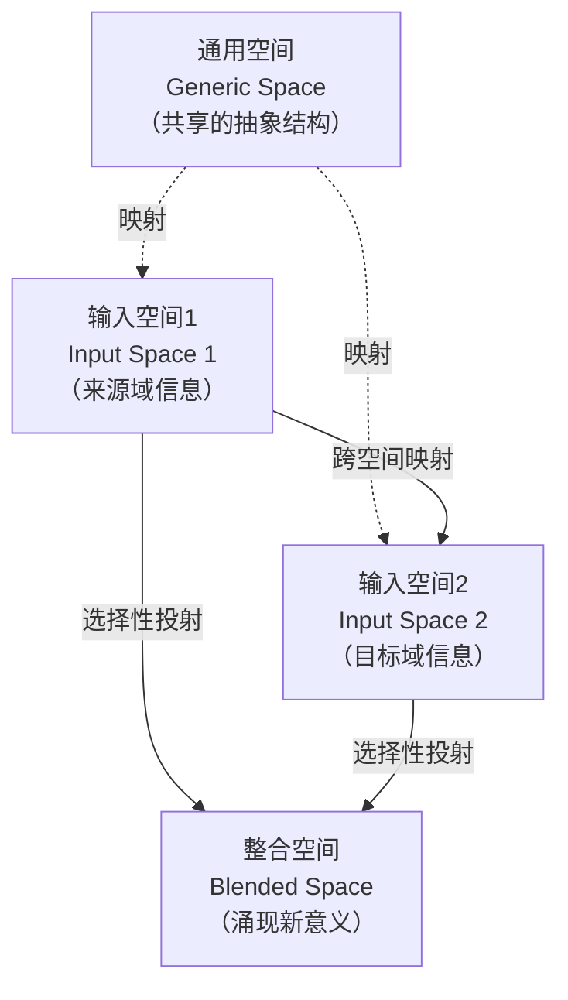
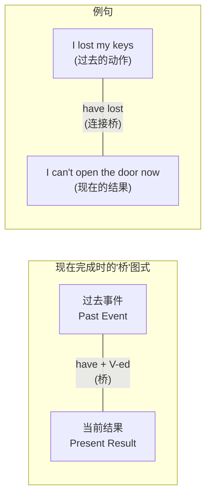

## 二、认知语言学与语言学习

### 2.1 认知语言学的基本观点

认知语言学（Cognitive Linguistics）是20世纪70年代兴起、80-90年代蓬勃发展的语言学流派，以乔治·莱考夫（George Lakoff）、罗纳德·兰盖克（Ronald Langacker）、查尔斯·菲尔莫尔（Charles Fillmore）等学者为代表。这一学派的核心主张是：**语言不是独立于人类其他认知能力的自主系统，而是整体认知能力的一部分**。语言的结构、意义和使用方式，从根本上反映了人类的感知、记忆、分类、推理等一般认知机制。

这一立场与乔姆斯基（Chomsky）的生成语法形成鲜明对比。生成语法认为语言能力是一个独立的、先天的模块（"普遍语法"），具有自主的运算规则；认知语言学则认为语言能力与其他认知能力共享基础机制，语言结构可以从认知原则上得到解释。

#### 2.1.1 认知语言学的三大核心承诺

认知语言学建立在三个核心承诺之上，每个承诺都对语言学习有直接的启示意义：

**承诺一：语言不是自主的认知能力**

传统观点将语言能力视为大脑中一个独立运作的模块。认知语言学反对这一看法，认为语言与其他认知能力——感知、注意力、记忆、分类、推理——密切交织。例如，我们理解"The cat is on the mat"这个句子时，调用的是空间关系认知能力；我们理解"She saw red"这个隐喻时，调用的是情绪与色彩之间的身体经验映射。

对语言学习的启示：语言能力的提升不仅仅依赖于语言训练本身。提高空间认知能力有助于理解介词用法，提升注意力有助于捕捉语言输入中的关键信息，增强记忆能力有助于词汇保持。语言学习应该是对整体认知能力的训练，而不是孤立的技能操练。

**承诺二：语法即意义**

传统语法将形式（词汇、句法结构）与意义视为分离的两个层面。认知语言学认为，语法结构本身就是有意义的——语法规则不是任意的形式操作，而是反映了人类对事件、关系和情景的概念化方式。例如，英语中的进行体（be + V-ing）和简单体（V-s/V-ed）不仅仅是时态标记，它们代表了对同一事件的不同"观察视角"——进行体是从内部观察事件的过程，简单体是从外部观察事件的整体。

对语言学习的启示：不要将语法视为需要死记硬背的抽象规则，而要理解每种语法结构背后的认知逻辑。当你理解了进行体的"内部视角"含义，就能自然地判断"I was reading when she called"中为什么用进行体——因为说话者把自己"放进了"阅读的场景之中。

**承诺三：语义即概念化**

传统语义学认为词语的意义是客观的、可以通过真值条件来定义的。认知语言学认为，意义是概念化（conceptualization）的结果——词语的意义是说话者/听话者在头脑中构建的心理场景。同一个客观现实，不同的语言可能用完全不同的方式来概念化。

例如，英语用"uncle"一个词覆盖父系和母系的所有叔叔/舅舅，中文则用"叔叔/伯伯"（父系兄弟）和"舅舅"（母系兄弟）加以区分。这不是简单的词汇差异，而是反映了两种语言对亲属关系的不同概念化方式——中文的社会文化认知更强调父系/母系的区分。

对语言学习的启示：学一门外语，本质上是学习一套新的概念化系统。你需要学会用目标语言的方式来观察和组织世界，而不是简单地将母语的词汇"翻译"成外语的对应词。

#### 2.1.2 认知语言学与其他语言学派的对比

| 维度 | 生成语法（乔姆斯基） | 结构主义（索绪尔） | 认知语言学 |
|------|---------------------|-------------------|-----------|
| 语言本质 | 独立的认知模块 | 自足的符号系统 | 整体认知能力的一部分 |
| 语法规则 | 先天的、自主的 | 语言系统内部的关系 | 来自于认知和使用经验 |
| 意义观 | 真值条件语义 | 符号间的差异关系 | 概念化/心理构建 |
| 学习观 | 参数设定（触发） | 习惯形成 | 基于使用的归纳学习 |
| 对语言教学的启示 | 重视规则讲解 | 重视句型操练 | 重视有意义的输入和体验 |
| 代表学者 | Chomsky, Pinker | Saussure, Bloomfield | Lakoff, Langacker, Goldberg |

### 2.2 构式语法与语言学习

构式语法（Construction Grammar）是认知语言学中对语言教学影响最大的分支理论，主要代表人物包括阿黛勒·戈德堡（Adele Goldberg）和查尔斯·菲尔莫尔。构式语法对语言学习提出了一个根本性的转变：**语言的基本单位不是单词和语法规则，而是构式（construction）**。

#### 2.2.1 什么是构式

构式是形式与意义（或功能）的配对，也叫"形义配对"（form-meaning pair）。一个构式可以小到一个词素（如英语中的复数标记-s），大到一个完整的句子框架（如"the X-er, the Y-er"表示"越X越Y"）。

构式的关键特征是：**其整体意义无法完全从组成部分的意义推导出来**。例如：

- "by and large"（大体上）——这个短语的意义不能从"by"和"large"的各自意义推导
- "What's X doing Y?"（X怎么在做Y？）——这个句式含有"不以为然"的语用含义，不是简单的疑问
- "The more you practice, the better you get."——"the X-er, the Y-er"构式本身承载"条件-结果"关系

构式在心理词库中以整体方式存储和提取，就像一个"认知模板"。当我们听到或读到符合某个构式的句子时，大脑不是从单词开始逐个解析再组装，而是直接激活对应的构式模板。

#### 2.2.2 构式语法的核心原则

**原则一：构式是语言知识的基本单位**

语言知识不是由"词库+语法规则"两部分组成，而是由一个统一的、包含各种层级构式的"构式库"组成。这个构式库中既有具体词汇（如"dog"），也有部分填充的模板（如"V + one's way + PP"，如"fight one's way through"、"make one's way home"），还有完全抽象的句法模式（如被动句"NP be V-ed by NP"）。

**原则二：构式之间存在继承关系**

构式不是孤立存在的，它们之间形成一个有组织的层级网络。子构式通过"继承"关系与母构式相连。例如，双宾语构式（"She gave him a book"）继承了更抽象的"及物构式"的特征，同时又与其特定的语义角色（施事-受事-接受者）相联系。

**原则三：频率和可预测性决定构式的存储方式**

高频、不可预测的组合以整体形式存储为构式（如习语"kick the bucket"）；低频、可预测的组合则由更基础的构式在使用时在线组装。这解释了为什么我们把"kick the bucket"当作一个整体来学，而"kick the ball"则不需要。

#### 2.2.3 构式语法对语言学习的具体指导

**（一）以构式为单位学习，而非以单词为单位**

传统的词汇学习方式是"一个单词 + 一个中文意思"。构式语法告诉我们，孤立记忆单词的对应翻译是低效的，因为单词的意义在很大程度上取决于它所在的构式。

例如，动词"make"在不同构式中的意义完全不同：

| 构式 | 示例 | 构式意义 |
|------|------|---------|
| make + NP | make a cake | 制造、制作 |
| make + NP + Adj | make him happy | 使役（致使某人/物进入某种状态） |
| make + NP + V | make him laugh | 使役（致使某人做某事） |
| make + NP + NP | make her a star | 使役（致使某人成为某种身份） |
| make + one's way | make my way home | 经由某路径移动 |

学习"make"，不是背"做、制造"这样一个中文意思就够了，而是要掌握它在各种构式中的用法模式。这就是为什么传统背单词方法效率低下——它只给了你砖头，没有给你建筑蓝图。

**（二）重视"词块"和固定搭配的学习**

构式语法强调，语言知识中存在大量的半固定或完全固定的词块（chunks/formulaic sequences）。这些词块在心理词库中以整体存储，使用时直接提取，无需在线组装。

研究表明，母语者日常话语中有很大比例（估计25%-50%）由预制词块构成。掌握这些词块能够显著提高语言输出的流利度和地道程度。

需要重点学习的词块类型：

- **固定搭配（collocations）**：make a decision（而非do a decision）、heavy rain（而非strong rain）、commit a crime（而非do a crime）
- **习语（idioms）**：break the ice、hit the nail on the head、under the weather
- **句式框架（sentence frames）**：It is worth V-ing...; Would you mind V-ing...?; The thing is (that)...; It turns out (that)...
- **语篇标记词块（discourse markers）**：On the other hand...; As a matter of fact...; To be honest with you...
- **语用公式（pragmatic routines）**：How do you do?; Nice to meet you.; If you don't mind me asking...

**（三）通过大量语料输入来内化构式**

构式语法的"基于使用"（usage-based）立场认为，语言知识是从语言使用经验中逐步归纳出来的。学习者通过大量接触语言实例，逐渐识别出反复出现的构式模式，并将其抽象化存储。

这意味着：语法规则不是先学后用，而是在使用中自然归纳出来的。大量阅读和听力输入是构式习得的根本途径。但关键在于，输入必须是"可注意到构式"的——你需要有意识地关注语言中反复出现的模式，而不是只关注内容大意。

**实操方法：构式标注阅读法**

选择一篇适合你水平的文章（i+1水平），进行以下操作：

1. 第一遍：正常阅读，理解大意
2. 第二遍：标记出你注意到的反复出现的词组搭配，用下划线标出
3. 第三遍：将这些搭配分类记录——哪些是固定搭配、哪些是句式框架、哪些是习惯表达
4. 在每个搭配旁写下它的构式意义（不是逐词翻译，而是整体功能）
5. 用这些搭配各造一个与自己生活相关的句子

```text
构式笔记模板：

构式: V + one's way + PP
整体含义: 经由某种方式/路径移动
示例:
  - He fought his way through the crowd.（他在人群中挤出一条路）
  - She made her way to the exit.（她朝出口走去）
  - They worked their way up from nothing.（他们从零开始一路向上）
我的造句: I need to find my way around this new city.
```

### 2.3 隐喻理论与词汇学习

#### 2.3.1 概念隐喻：不仅仅是修辞

莱考夫和约翰逊在1980年的经典著作《我们赖以生存的隐喻》（*Metaphors We Live By*）中提出了一个革命性的观点：**隐喻不仅仅是一种修辞手法，更是人类思维的基本方式**。我们通过已知的、具体的、身体经验的领域来理解未知的、抽象的、难以把握的领域。这种跨域映射就是"概念隐喻"（conceptual metaphor）。

概念隐喻的基本结构是：**源域（source domain）→ 目标域（target domain）**。源域是我们熟悉的、具体的经验领域；目标域是我们需要理解的、抽象的概念领域。隐喻就是将源域的结构系统地映射到目标域上。

以下是一些贯穿日常语言的概念隐喻：

| 概念隐喻 | 源域 | 目标域 | 日常表达示例 |
|---------|------|--------|------------|
| 时间是金钱 | 金钱 | 时间 | save time, waste time, spend time, invest time |
| 争论是战争 | 战争 | 争论 | attack an argument, defend a position, win a debate |
| 人生是旅程 | 旅程 | 人生 | at a crossroads, a long way to go, reach a milestone |
| 理解是看见 | 视觉 | 理解 | I see what you mean, a clear explanation, shed light on |
| 情感是容器中的液体 | 容器/液体 | 情感 | filled with anger, overflowing with joy, bottle up feelings |
| 理解是抓住 | 抓握 | 理解 | grasp the concept, get a grip on, catch the meaning |
| 社会地位是上下 | 垂直空间 | 地位 | rise to power, upper class, look up to, look down on |

这些隐喻不是个人的创造性表达，而是整个语言社群共享的、系统性的概念组织方式。它们深深嵌入在日常语言中，以至于我们通常意识不到它们是隐喻。

#### 2.3.2 隐喻理论对词汇学习的四大启示

**启示一：通过隐喻线索理解多义词**

英语中大多数常用词都是多义词。传统做法是将多个义项罗列出来逐个记忆，效率极低。隐喻理论告诉我们，很多看似不相关的义项实际上是通过隐喻联系在一起的。

以"run"为例，多个义项通过"运动/前进"这一核心隐喻线索串联起来：

- run（跑步）→ 原始义
- run a business（经营企业）→ "经营是持续的推进运动"
- run out of（用完）→ "资源像在一条路上运动，到终点就没了"
- a run of bad luck（一连串坏运气）→ "事件像排队跑过"
- in the long run（从长远来看）→ "时间是一条跑道"
- run a risk（承担风险）→ "承担是在危险的路上前进"
- the river runs（河流流淌）→ "水流是运动"

当你掌握了"run"的核心隐喻图式"持续向前运动"，就能通过这个图式自然地理解其各种引申义，而不需要逐个死记。

**实操方法：多义词隐喻图式法**

学习任何高频多义词时，执行以下步骤：

1. 找出该词的核心义（最原始、最具体的含义）
2. 画出核心义的"意象图式"（在脑中想象一个简单的场景）
3. 用隐喻思维将这个图式映射到其他语义领域
4. 对每个引申义验证：它是否与核心图式一致？

```text
多义词分析示例：break

核心义：物体从完整变为不完整（物理断裂）
意象图式：一个连续的边界/表面被力量作用后出现裂缝/分离

隐喻映射：
  物理断裂 → break a cup（打碎杯子）
  规则被违反 → break the law（违反法律）——规则是"社会结构"，违反即"使之断裂"
  承诺被违背 → break a promise（违背承诺）——承诺是"连接关系"，违背即"使之断裂"
  记录被超越 → break a record（打破记录）——记录是"一道壁垒"，超越即"使之断裂"
  休息/暂停 → take a break（休息一下）——活动是"连续体"，暂停即"造成断裂"
  新闻 → breaking news（突发新闻）——新闻是"沉默状态"，发布即"打破沉默"
```

**启示二：理解跨语言隐喻差异**

不同语言对同一抽象概念可能使用不同的隐喻映射。理解这些差异，能够帮助你"用英语思考"，而不是将中文思维翻译成英语。

| 概念 | 中文隐喻 | 英文隐喻 | 影响 |
|------|---------|---------|------|
| 时间流向 | 时间在前方（前途、前天、以前） | 英文同样（future ahead） | 基本一致 |
| 情绪的身体位置 | 愤怒在肝（大动肝火）、快乐在心 | anger in the head（blow one's top） | 中文说"气得头疼"但不说"blow top" |
| 困难的隐喻 | 困难如石头/山（困难重重、翻山越岭） | difficulty如障碍/barrier（face barriers, overcome obstacles） | 比较接近 |
| 同意/不同意 | 同意如点头（点头称是） | agree如同方向（see eye to eye） | 比较接近 |
| 理解 | 理解如透彻/贯穿（看透、想通） | understanding如光/看见（I see, shed light on） | 中文强调"穿透"，英文强调"光照" |

**启示三：利用意象图式理解介词**

英语介词是学习者的普遍难点。传统的"介词表"列出了几十种用法，难以记忆。认知语言学的意象图式理论（Image Schema Theory）提供了一种更高效的方案：**大多数介词的多种用法可以通过一个核心空间图式来统一理解**。

以"in"为例，其核心图式是"容器"（CONTAINER）——某物在某个有界的三维空间内部：

- in the box（在盒子里）→ 物理容器
- in the water（在水中）→ 水是包围的介质
- in an hour（一小时后）→ 时间段是一个容器，你"在"这个时间段里面
- in love（恋爱中）→ 爱情是一种状态容器，你"在"这种状态里
- in trouble（遇到麻烦）→ 麻烦是一种抽象容器
- in English（用英语）→ 语言是一个表达的容器
- dressed in black（穿着黑色）→ 衣服"包裹"着你，形成一个容器

当学习者掌握了"IN = 容器"这一核心图式后，面对介词的各种用法，不再需要死记硬背，而是可以基于核心图式进行推理和理解。

常用介词的核心意象图式：

| 介词 | 核心图式 | 图示说明 | 典型引申 |
|------|---------|---------|---------|
| in | 容器（CONTAINER） | 物体在有界空间内 | 状态（in love）、时间（in a minute）、方式（in English） |
| on | 接触+支撑（CONTACT） | 物体在表面上，有接触面 | 时间（on Monday——日期是"平面"）、主题（on the topic of——话题是"平台"）、状态（on fire——火附着于物体） |
| at | 精准点（POINT） | 位置、时间上的精确点 | 速度（at 100km/h）、状态（at work） |
| over | 弧形跨越（ARC） | 物体沿弧形轨迹越过 | 时间（over the years——时间"弧过"）、控制（have control over——覆盖式控制） |
| through | 穿越（PATH） | 物体从一端进去、另一端出来 | 完成（get through the work——穿过工作）、方式（through effort——经由努力） |

**启示四：利用隐喻创建记忆锚点**

隐喻可以成为强大的记忆工具。当你为一个抽象的语法规则或词汇用法找到一个生动的隐喻图像时，记忆效果远优于机械重复。

例如：
- 英语的"现在完成时"（have + done）——隐喻：它像一个"桥"，连接了过去的行为和现在的影响。"I have lost my keys"= 过去丢的动作造成现在没钥匙的结果。
- 日语的助词"は"和"が"——隐喻："は"像舞台聚光灯（标记话题/已知信息），"が"像新演员上场（标记新信息/焦点）。

### 2.4 原型理论与范畴学习

#### 2.4.1 从经典范畴理论到原型理论

经典范畴理论（亚里士多德传统）认为，一个范畴由一组充分必要条件来定义：一个事物要么属于该范畴，要么不属于，没有中间地带。例如，"鸟"的定义是"有羽毛、有翅膀、会飞、会下蛋的动物"。

但认知心理学家埃莉诺·罗施（Eleanor Rosch）在20世纪70年代的实验推翻了这一观点。她发现，人类对范畴的组织方式是以"原型"（prototype）为中心的梯度结构——范畴中有些成员是"更好的例子"（更接近原型），有些则是边缘成员。

在"鸟"这个范畴中：
- 高原型成员：麻雀、知更鸟、鸽子（体型小、会飞、会叫、在树上筑巢）
- 中原型成员：鹦鹉、猫头鹰、老鹰（具有鸟的核心特征，但某些方面不典型）
- 低原型成员：企鹅、鸵鸟、鸡（不会飞或不像"典型鸟"）
- 边缘/争议成员：蝙蝠（有翅膀但不是鸟）、恐龙（曾有羽毛但已灭绝）

#### 2.4.2 原型理论的四个核心发现

**发现一：范畴成员不是平等的**

当要求人们判断"X是不是Y？"时，对高原型成员的判断更快、更确定。"麻雀是鸟吗？"的回答速度明显快于"企鹅是鸟吗？"。

**发现二：范畴的边界是模糊的**

很多范畴没有清晰的边界。"杯子"和"碗"之间的界限在哪里？当一个杯子变大到什么程度就变成了碗？这种边界模糊性表明，范畴的组织不是非此即彼的，而是渐变的。

**发现三：原型可能因文化和经验而异**

热带居民的"鸟"原型可能是鹦鹉或金刚鹦鹉，温带居民的原型可能是麻雀或知更鸟。中国人的"水果"原型可能包括西瓜，而北欧人的"水果"原型可能更偏向苹果和浆果。

**发现四：人们通过与原型的相似度来判断范畴成员**

当我们遇到一个新事物时，会将其与心理原型进行比较，根据相似度来判断它是否属于某个范畴。这个过程是自动的、无意识的。

#### 2.4.3 原型理论对语言学习的三个应用

**应用一：以原型义为核心向外扩展**

学习多义词时，先掌握其最原型的含义（最具体、最常见的意思），然后通过认知扩展（隐喻、转喻、具体化/抽象化）逐步学习其他义项。

```text
学习路径示例：英语 "head"

原型义：人的头部（最具体、最核心）
    ↓ 通过"部分代整体"转喻
引申1：领导/负责人（the head of the department）——头是身体的"领导"
    ↓ 通过"具体→抽象"隐喻
引申2：头脑/智力（use your head）——头是思维器官
    ↓ 通过空间隐喻
引申3：顶端/前端（the head of the table）——头在身体的最前端
    ↓ 通过功能隐喻
引申4：标题/头条（headline）——标题在文章的"头部"
    ↓ 量化用法
引申5：头数（200 head of cattle）——用头来计数牲畜

学习策略：先彻底掌握原型义的视觉形象，再逐一扩展。
```

**应用二：理解范畴化词汇的梯度性**

英语中有大量的"上义词-下义词"层级关系。原型理论告诉我们，不是所有下义词都同等重要——有些是原型成员（高频、典型），应该优先学习。

以"家具"范畴为例：

| 层级 | 原型成员（优先学习） | 非原型成员（后续学习） |
|------|-------------------|---------------------|
| 坐具 | chair, sofa | stool, bench, ottoman |
| 桌类 | table, desk | counter, bureau, console |
| 储物 | bookshelf, closet | cabinet, dresser, sideboard |
| 卧具 | bed, mattress | futon, cot, hammock |

学习策略：先掌握每个范畴的原型成员（这些是你最常用、最容易遇到的），再逐步扩展到非典型成员。

**应用三：用原型理论优化语法教学**

语法范畴也有原型。例如，英语中的"被动语态"的原型是"NP + be + V-ed + by + NP"（如"The book was read by John"），但存在很多非原型形式：

- 高原型被动：The cake was eaten by the children.（be + 过去分词 + by施事）
- 中原型被动：The window was broken.（省略施事）
- 低原型被动：The house is building.（古英语遗留形式）
- 隐喻性被动：This book sells well.（主动形式表被动含义）
- 争议性被动：He was alleged to have stolen the money.

学习策略：先完全掌握原型形式，再逐步接触和理解非原型变体。不要试图一开始就记住所有变体。

### 2.5 认知语法与语言理解

认知语法（Cognitive Grammar）是兰盖克（Ronald Langacker）创立的认知语言学分支，与构式语法并列为认知语言学的两大核心理论框架。认知语法的核心主张是：**语法不是自主的形式系统，而是语义内容的符号化编码**。每个语法结构都有其独特的语义价值，语法教学应该关注形式背后的认知意义。

#### 2.5.1 认知语法的核心概念

**识解（Construal）**

识解是指说话者对同一客观情景可以采取不同的认知视角和观察方式。这是认知语法最核心的概念。同一个事件，用不同的语法结构来表达，就是在用不同的方式"识解"这个事件。

例如，同一个物理情景"一辆车撞了一棵树"，可以有多种识解方式：

- The car hit the tree.（主动句——以"车"为出发点，聚焦于动作本身）
- The tree was hit by the car.（被动句——以"树"为出发点，聚焦于受影响的实体）
- There was a collision between a car and a tree.（存在句——以"事件"为出发点，不偏向任何参与者）
- The car crashed into the tree.（动词选择不同——"crash"暗示高速、猛烈、意外，比"hit"更具情感色彩）

对语言学习的启示：真正的语言能力不仅仅是"能表达意思"，还包括能够选择最合适的识解方式来表达。高级学习者和初级学习者的差异往往在于：初级学习者只能说清楚意思，高级学习者能选择最佳的表达视角。

**射体-界标（Trajector-Landmark）**

在任何关系表达中，认知语法区分了两个参与者角色：射体（trajector, tr）是被突显的、首要关注的参与者；界标（landmark, lm）是次要的、作为参照的参与者。

例如：
- "The cat is under the table."——射体是cat（我们关注猫在哪里），界标是table（桌子作为参照物）
- "The table is over the cat."——射体变成了table（我们关注桌子在哪里），界标是cat

虽然客观物理关系相同（猫在桌子下方），但两句话的"突显"方向不同。这种差异对语言学习的意义在于：你选择什么作主语（射体），反映了你对信息焦点的判断。

**背景与窗口化（Profiling and Windowing）**

一个完整的事件包含多个阶段，但语言表达通常只"打开窗口"呈现其中一部分。例如：

- "He jumped off the cliff."——窗口化了起跳和离开阶段，但没有窗口化降落阶段
- "He landed on the beach."——窗口化了降落阶段
- "He jumped off the cliff and landed on the beach."——全窗口化

对语言学习的启示：英语动词本身就编码了"窗口化"信息。例如：
- "enter"包含了"到达并进入"的完整窗口
- "arrive"只窗口化了"到达"阶段
- "leave"只窗口化了"离开"阶段

这解释了为什么"He entered into the room"是冗余的——"enter"已经包含了"into"的语义。类似的冗余错误还有"return back"（return已经包含"back"）、"repeat again"（repeat已经包含"again"），这些是学习者常见的语义重复错误。

#### 2.5.2 认知语法对英语时态学习的重新理解

传统语法将时态视为"时间标记"——现在时表示现在，过去时表示过去。认知语法提供了更深层的理解：**时态是"心理距离"的标记**。

| 时态形式 | 心理距离含义 | 示例 |
|---------|------------|------|
| 一般现在时 | 心理零距离——当前、直接、真实 | "I think you're right."（直接判断） |
| 一般过去时 | 心理远距离——不一定指过去 | "I thought you were right."（现在不这么想了）|
| | | "Could you help me?"（比"Can you"更礼貌——心理距离=礼貌） |
| | | "If I were you..."（虚拟——与现实拉开距离） |
| 现在完成时 | 连接过去与现在的"桥" | "I have finished."（过去完成，现在有效果） |

"过去时=心理距离"这一洞见解释了大量"非过去"的过去时用法：

- 虚拟语气用过去时："If I **had** money, I would..."——假设是"远离现实的"
- 礼貌请求用过去时："**Could** you...?"、"I **wanted** to ask..."——礼貌是通过"心理距离"来实现的
- wish后的过去时："I wish I **were** taller."——愿望是"远离现实的"

对语言学习的启示：学习英语时态不要只记"时间对应规则"，要理解每种时态形式背后的认知视角。当你真正理解了"过去时=心理距离"，就能自然地判断何时用"Could you..."而非"Can you..."，何时用"I was wondering..."而非"I wonder..."。

### 2.6 框架语义学与词汇理解

#### 2.6.1 什么是语义框架

框架语义学（Frame Semantics）由菲尔莫尔提出，核心观点是：**一个词的意义只有在激活其所属的"语义框架"（semantic frame）时才能被完整理解**。语义框架是描述特定场景或事件类型的结构化知识。

例如，"买"（buy）这个词激活了"商业交易"框架，该框架包含以下参与者和要素：

- 买方（Buyer）：支付金钱的人
- 卖方（Seller）：提供商品的人
- 商品（Goods）：被交易的物品
- 金钱（Money）：交换的媒介
- 价格（Price）：商品的价值量

不同的词汇从不同角度"切入"同一个框架：

| 词汇 | 框架切入角度 | 示例 |
|------|------------|------|
| buy | 聚焦买方 | She bought a car. |
| sell | 聚焦卖方 | He sold her a car. |
| pay | 聚焦金钱流动 | She paid $20,000 for the car. |
| cost | 聚焦商品价格 | The car cost $20,000. |
| spend | 聚焦买方的金钱支出 | She spent $20,000 on the car. |
| charge | 聚焦卖方的索价 | He charged her $20,000. |
| purchase | 正式版buy | She purchased a car. |

#### 2.6.2 框架语义学对词汇学习的启示

**启示一：以框架为单位学习词汇群**

不要一个词一个词地学，而要以语义框架为单位，一次性学习一个框架下的所有相关词汇。例如：

```text
学习"旅行"框架，一次性掌握：

核心动词: travel, journey, visit, tour, explore
出发: depart, set off, leave (for)
途中: pass through, stop over, transfer (to)
到达: arrive (at/in), reach, get to
住宿: check in (to), stay (at), lodge
游览: sightsee, look around, wander
返程: return, head back, fly home

框架参与者: traveler/tourist/visitor, guide, host, local
框架物品: luggage/baggage, ticket, passport, reservation, itinerary
框架地点: destination, stopover, landmark, attraction, accommodation
```

这样学习的好处是：你在大脑中构建了一个完整的"旅行"心理场景，每个词汇都在这个场景中有明确的位置和角色。回忆时，整个框架被激活，其中的每个词汇都更容易被提取。

**启示二：通过框架理解词汇的语法行为**

在同一框架中的词汇，往往共享特定的语法模式。例如，在"因果"框架中：

- cause: A causes B (to do sth)
- make: A makes B (do sth)
- lead to: A leads to B
- result in: A results in B
- trigger: A triggers B
- bring about: A brings about B

所有这些词都遵循"A → B"的因果方向性。但如果你说"The heavy rain resulted from the flood"（大雨由洪水导致），方向就错了——应该是洪水由大雨导致。

**启示三：跨语言框架差异**

不同语言可能用不同的框架来概念化同一领域。例如，在"情感"框架中：

- 中文：心是情感的容器（心里高兴、心碎、心花怒放）
- 英文：情感是施力者（I was **struck** by grief、it **hit** me、she was **overwhelmed**）
- 日文：腹部（腹/はら）是情感的位置（腹が立つ=生气，literal: 腹部立起来）

理解这些框架差异，能帮助你避免将母语的框架套用到目标语言上。例如，中国人不应该说"My heart is broken by happiness"（心花怒放的直译），而应该使用英语的情感框架。

### 2.7 概念整合与创造性语言使用

#### 2.7.1 概念整合理论

概念整合理论（Conceptual Blending Theory），由吉尔斯·福科尼耶（Gilles Fauconnier）和马克·特纳（Mark Turner）在20世纪90年代提出，是认知语言学中最具解释力的理论之一。该理论认为，人类思维的基本操作是将多个心理空间（mental spaces）的信息进行"整合"（blend），产生新的意义。

概念整合的基本架构包含四个心理空间：



一个经典例子："这个外科医生是个屠夫。"

- 输入空间1：外科手术场景（外科医生、手术、病人、手术室）
- 输入空间2：屠宰场景（屠夫、屠宰、动物、屠宰场）
- 通用空间：一个人用利器切割某个对象
- 整合空间：一个笨拙/粗暴的外科医生——从"屠夫"的粗暴和不精确被投射到外科手术场景

整合结果产生了输入空间中不存在的新意义：这个外科医生技术粗糙、不负责任——这不是字面意思（他不是真的在做屠宰），而是整合空间中涌现出的含义。

#### 2.7.2 概念整合对语言学习的启示

**启示一：理解创造性语言表达**

日常语言中充满了概念整合的产物：

- "灌水"（网络用语）= 灌溉场景 + 论坛发帖场景 → 整合出"大量发布无实质内容的帖子"
- "surfing the internet"（网上冲浪）= 冲浪场景 + 互联网浏览场景 → 整合出"随意浏览、自由探索式的网络使用"
- "deadline"（截止日期）= 死亡线 + 时间限制 → 整合出"超过就'死亡'（失效）的时间界限"

当你遇到新的词汇搭配或习语时，尝试用概念整合的框架来拆解：它是从哪两个（或多个）概念域整合出来的？

**启示二：理解复合词和新词的产生机制**

很多英语复合词是概念整合的产物：

- "butterfly"（蝴蝶）= butter（黄油）+ fly（飞）→ 整合出"像黄油一样颜色的飞虫"
- "honeymoon"（蜜月）= honey（蜂蜜）+ moon（月）→ 整合出"甜蜜的初期阶段"
- "brainstorming"（头脑风暴）= brain（大脑）+ storm（暴风雨）→ 整合出"思维激烈碰撞产生创意"

理解这些复合词的整合机制，比死记硬背要高效得多——你不仅记住了词，还理解了词背后的认知逻辑。

### 2.8 体验认知与身体经验

#### 2.8.1 体验认知的核心主张

体验认知（Embodied Cognition）是认知语言学的重要理论基础。其核心主张是：**人类的概念系统根植于身体经验**。我们对世界的理解不是纯粹抽象的，而是建立在身体的感知、运动和与环境的互动之上。

莱考夫和约翰逊提出了三种基本的身体经验图式：

**容器图式（CONTAINER schema）**：我们的身体就是一个容器（食物进去、废物出来），由此发展出大量的容器隐喻：in danger（在危险中）、out of trouble（脱离麻烦）、filled with hope（充满希望）。

**力量图式（FORCE schema）**：我们的身体体验各种力（重力、推力、阻力），由此发展出力量隐喻：push an agenda（推进议程）、meet resistance（遇到阻力）、driven by ambition（被野心驱动）。

**路径图式（PATH schema）**：我们的身体在空间中从A移动到B，由此发展出路径隐喻：go through a difficult time（经历困难时期）、reach a conclusion（得出结论）、come to an understanding（达成理解）。

#### 2.8.2 体验认知对语言学习的实际应用

**应用一：身体化学习法**

利用身体动作来学习语言，而不仅仅是用眼睛看、用耳朵听。

具体方法：

- **学习介词时做动作**：学习"in"时，把手放在盒子里感受容器；学习"on"时，把书放在桌子上感受接触面；学习"through"时，走过一扇门感受穿越。
- **学习动词时做动作**：学习"grasp"时真的做一个抓握的动作；学习"stretch"时真的伸展身体；学习"collapse"时做一个倒塌的身体动作。
- **学习情绪词汇时体验**：学习"overwhelmed"时想象被大水淹没的压迫感；学习"thrilled"时想象触电般的激动感。

研究表明，将身体动作与语言学习相结合的方式能够显著提高词汇记忆的持久性和提取速度（这种效应叫做"具身效应"或"enactment effect"）。

**应用二：情境化学习**

体验认知强调，概念是情境化的——它们不是孤立地存在于头脑中，而是与特定的感知场景和身体状态相关联。因此，在真实或仿真的情境中学习语言，效果远优于去语境化的学习。

具体方法：
- 学习"厨房"词汇时，真正在厨房里边做菜边学
- 学习"购物"用语时，在线上英文购物网站进行真实浏览
- 学习"问路"表达时，在实际地图上进行导航练习
- 学习"看医生"对话时，模拟真实的就诊场景

### 2.9 认知语言学与第二语言习得的研究证据

#### 2.9.1 构式习得的实证研究

多项实证研究支持构式语法对语言习得的解释力：

**研究一：Goldberg (2006) 的动词-构式整合实验**

Goldberg发现，学习者在接触新的构式（如"X causes Y to receive Z"的双宾语构式）后，能够将其泛化到以前未见过的动词上。这表明构式是独立于具体动词的抽象知识，支持了构式作为语言习得单位的观点。

**研究二：Tyler & Evans (2003) 的介词图式教学实验**

Tyler和Evans基于意象图式理论设计了介词教学方案，结果表明，接受意象图式教学的学生在介词使用的准确性和泛化能力上显著优于接受传统"词汇表对照"教学的学生。

**研究三：Boers (2000) 的隐喻意识与词汇记忆实验**

Boers发现，当学习者被教导识别英语习语中的概念隐喻后（如理解"under the weather"与"情感是天气"隐喻的联系），他们对这些习语的记忆显著优于没有接受隐喻意识训练的对照组。

#### 2.9.2 认知语言学教学法的系统研究

| 研究者 | 研究内容 | 核心发现 |
|--------|---------|---------|
| Holme (2012) | 认知语言学教学法综述 | 认知语言学方法在词汇、语法、语篇教学中均优于传统方法 |
| Littlemore & Low (2006) | 隐喻能力与语言水平 | 隐喻理解能力是高水平语言能力的核心组成部分 |
| Boers & Lindstromberg (2008) | 认知语言学启发的词汇教学 | 意象图式法和词源分析法显著提高词汇保持率 |
| Achard & Niemeier (2004) | 认知语言学与外语教学 | 认知语法对时态/体、介词、冠词等语法教学有独特贡献 |
| Roehr-Brackin (2014) | 构式习得与显性知识 | 显性的构式知识可以促进隐性的语言习得 |

### 2.10 认知语言学的实践应用方法论

#### 2.10.1 认知词汇学习法（五步法）

将认知语言学理论整合为一套可操作的词汇学习方法：

**第一步：激活原型图像**

学习任何新词时，先不看中文翻译，而是找到一幅能代表该词核心意义的图片或视频，在脑中建立一个生动的视觉原型。

**第二步：构建意象图式**

将具体的视觉原型抽象为一个简化的空间图式（线条、圆圈、箭头构成的简单图示）。

**第三步：映射扩展**

基于隐喻和转喻机制，将核心图式映射到其他语义领域，推导出该词的引申义。

**第四步：框架定位**

将该词放入其所属的语义框架中，学习与它同框架的其他词汇（同义词、反义词、关联词）。

**第五步：构式嵌入**

将该词放入常见的构式/搭配中学习，掌握其语法行为和词块模式。

```text
认知词汇学习法实操示例：run

Step 1 - 原型图像: 想象一个人在跑道上跑步的动态画面
Step 2 - 意象图式: →→→→→ （向前持续运动的箭头）
Step 3 - 映射扩展:
  - 物体运动: The river runs through the city.（河流→持续流动）
  - 管理: run a business（经营→让事情持续"运转"）
  - 耗尽: run out of（资源→运动到尽头）
  - 趋势: Things are running smoothly.（事物→顺利行进）
Step 4 - 框架定位（运动框架）:
  - 跑: jog, sprint, dash, race, sprint
  - 走: walk, stroll, march, pace
  - 飞: fly, soar, glide, hover
Step 5 - 构式嵌入:
  - run + N: run a marathon, run errands, run a bath
  - run + Adv: run fast, run away, run off
  - run out of + N: run out of time/money/patience
  - in the long run: 从长远来看
  - on the run: 在逃亡中
```

#### 2.10.2 认知语法学习法

对于语法学习，认知语言学提倡以下方法：

**（一）从功能到形式（Function-to-Form Approach）**

传统语法教学是"先教形式，再讲用法"：先教"现在完成时=have/has+过去分词"的形式，再讲"表示过去发生的动作对现在有影响"的用法。

认知语法提倡反过来：先呈现一个需要表达的真实意图（如"我想表达过去发生的事，但重点是现在的结果"），然后引导学习者发现和掌握能够实现这一意图的语法形式。

**（二）对比识解训练（Construal Training）**

给学习者提供同一情景的多种表达方式，训练他们选择最合适的识解方式。例如：

```text
情景：你的朋友不小心打碎了花瓶。

对比表达：
A. "You broke the vase."（直接主动识解——直接归责，可能引起防御）
B. "The vase was broken."（被动识解——回避归责，但可能显得不真诚）
C. "The vase broke."（中性识解——将事件呈现为自然发生，最温和）
D. "There's been an accident with the vase."（事件识解——将事故而非人作为主语）

讨论：在不同语境下，哪种识解最合适？为什么？
```

**（三）意象图式可视化**

将抽象的语法概念用意象图式来可视化。例如：



### 2.11 常见误区与纠正

#### 误区一：认知语言学只是理论，对实际学习没有用

**纠正**：认知语言学的多项研究已经证实了其在语言教学中的实际效果。意象图式法提高介词学习效果、隐喻意识训练提高词汇保持率、构式教学法提高语法运用能力——这些都是有实验数据支持的。关键在于如何将理论转化为具体的学习方法，本节提供了系统的方法论。

#### 误区二：学习隐喻就是学习修辞手法

**纠正**：概念隐喻（conceptual metaphor）与修辞隐喻（rhetorical metaphor）是两回事。修辞隐喻是文学性的创造性表达（如"生活是一条河"）；概念隐喻是日常语言中无处不在的、不被察觉的认知模式（如"waste time"中的"时间是金钱"隐喻）。语言学习中的隐喻训练主要是培养对概念隐喻的意识，而不是写作文时用漂亮的隐喻。

#### 误区三：原型理论意味着边缘用法不重要

**纠正**：原型理论告诉我们应该先学原型再学边缘，但不是说边缘用法不重要。恰恰相反，高水平学习者的标志之一就是能够灵活使用非原型用法。建议是：先把原型用法内化到自动化，再逐步扩展到边缘用法，而不是一开始就试图记住所有用法。

#### 误区四：构式学习意味着不需要学单词

**纠正**：构式语法不是说单词不重要，而是说单词不能脱离其所在的构式来学习。单词仍然是语言知识的基本元素之一，但孤立地记忆"word = 中文翻译"是低效的。正确的方法是：在构式/搭配/句子的语境中学习单词，既知道单词的意义，也知道它在哪些构式中出现。

#### 误区五：体验认知意味着必须亲身到国外才能学好外语

**纠正**：体验认知强调身体经验对概念形成的重要性，但这不等于必须亲身经历。想象、视频、虚拟现实、角色扮演等都是有效的"替代体验"。研究表明，仅仅在学习时想象与词汇相关的身体动作（如学习"grasp"时想象抓握），就能产生具身学习效应。

### 2.12 本节小结

认知语言学为语言学习提供了一个深刻而实用的理论框架。其核心启示可以归纳为以下几点：

| 认知语言学概念 | 对语言学习的核心启示 |
|--------------|-------------------|
| 语言不是自主系统 | 语言能力与一般认知能力交织，全面提升认知有助于语言学习 |
| 构式语法 | 以"构式"（形义配对）为单位学习语言，而非以孤立单词和语法规则为单位 |
| 概念隐喻 | 利用隐喻线索理解多义词、记忆词汇、跨越跨语言差异 |
| 原型理论 | 先学原型义再学引申义，先学高频词再学低频词 |
| 认知语法 | 语法结构本身有意义，理解"识解"选择使表达更精确 |
| 框架语义学 | 以语义框架为单位学习词汇群，理解词汇间的系统关系 |
| 概念整合 | 理解创造性表达和新词的产生机制 |
| 体验认知 | 将身体动作和真实情境融入语言学习 |

认知语言学不是要取代传统的语言学习方法（如听力训练、口语练习、语法规则学习），而是为这些方法提供更深层的认知基础，帮助学习者理解"为什么要这样学"，从而做出更明智的学习选择。

在接下来的章节中，我们将看到这些认知语言学原理如何具体应用于词汇记忆、语法学习、阅读理解、写作表达等各个技能领域。

***
