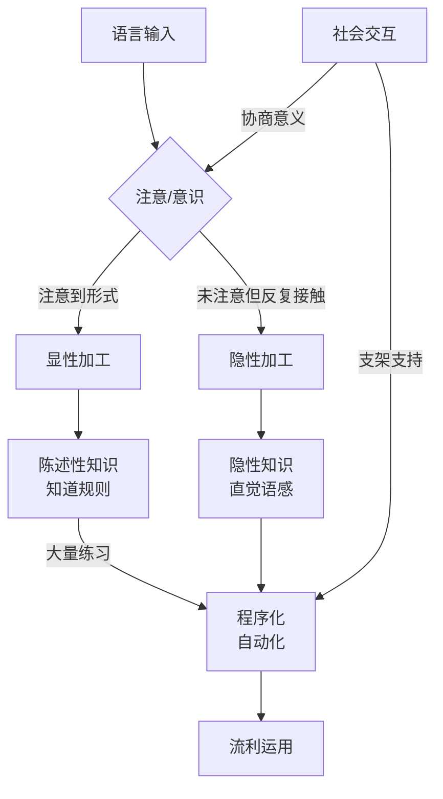
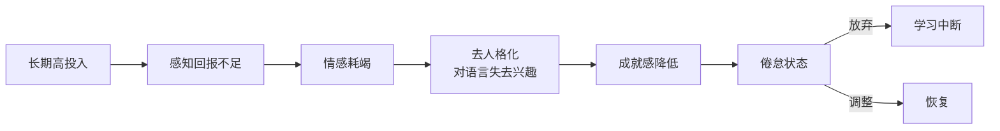
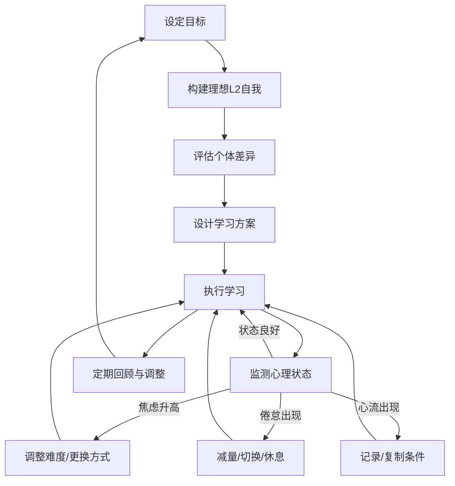

## 三、二语习得心理学

二语习得（Second Language Acquisition, SLA）心理学研究人类如何在母语之外习得一门新语言的心理机制。这门学科横跨语言学、认知心理学、教育心理学和社会心理学，是外语学习方法论的理论基石。理解二语习得心理学，不是为了做学术研究，而是为了知道：**为什么某些方法有效、某些方法无效，以及如何根据自己的心理特征设计最优学习路径。**

### 3.1 二语习得的核心理论框架

在讨论个体差异和心理因素之前，需要先了解二语习得领域最具影响力的几大理论。这些理论不是互相排斥的，而是从不同角度解释同一现象——人类如何学会一门新语言。

#### 3.1.1 Krashen 的监控模型

Stephen Krashen 在20世纪70-80年代提出的监控模型（Monitor Model）是二语习得领域最具影响力的理论框架，由五个假说构成：

**输入假说（Input Hypothesis）**：语言习得发生在学习者接触到"可理解输入"（comprehensible input）时。Krashen 用 i+1 公式表示——输入应略高于学习者当前水平（i），包含新的语言结构（+1）。这意味着：如果材料太简单（i+0），没有学习发生；如果太难（i+2、i+3），学习者无法理解，同样无效。

**习得-学习假说（Acquisition-Learning Distinction）**：习得（acquisition）是无意识的过程，类似儿童获得母语的方式；学习（learning）是有意识地学习语法规则。Krashen 认为只有习得才能产生流利的语言运用，有意识学到的知识只能作为"监控器"——在输出时检查和修正错误。

**监控假说（Monitor Hypothesis）**：有意识学习到的语法规则充当"编辑器"角色，在说话或写作时修正输出。但监控器的使用需要满足三个条件：有足够时间、注意力集中在形式、知道正确规则。

**自然顺序假说（Natural Order Hypothesis）**：语法结构的习得遵循可预测的顺序，无论学习者的母语背景如何。例如，英语进行时 -ing 和复数 -s 通常较早习得，而第三人称单数 -s 和所有格 's 则较晚。

**情感过滤假说（Affective Filter Hypothesis）**：焦虑、动机低落、自信不足等情感因素会形成一道"过滤器"，阻止可理解输入到达语言习得装置（Language Acquisition Device）。即使输入量足够，高情感过滤也会阻碍习得。

Krashen 理论的实践启示是明确的：大量接触略高于自己水平的可理解输入（听和读），减少焦虑和压力，让习得自然发生。这直接支撑了"大量输入"学习法的理论基础。

#### 3.1.2 Long 的交互假说

Michael Long 的交互假说（Interaction Hypothesis）认为，语言习得不仅需要输入，更需要在交互中发生的"协商意义"（negotiation of meaning）。当交际出现障碍时，对话双方会通过确认、澄清、重述等方式调整输入，这个过程使语言输入变得更可理解，同时迫使学习者注意到自己的语言缺口。

交互假说的核心机制：

| 交互行为 | 功能 | 例子 |
|---------|------|------|
| 确认检查（confirmation check） | 确认理解是否正确 | "You mean...?" |
| 澄清请求（clarification request） | 要求对方重新表达 | "What do you mean?" |
| 理解检查（comprehension check） | 检查对方是否理解 | "Do you understand?" |
| 重述（recognition） | 用正确形式重述学习者的错误表达 | 学习者说"I go yesterday"，对方回应"You went yesterday?" |

实践启示：找到语伴或使用AI对话工具进行真实交互，比独自学习更能促进习得。

#### 3.1.3 Schmidt 的注意假说

Richard Schmidt 的注意假说（Noticing Hypothesis）提出：习得的必要条件是学习者有意识地"注意到"（notice）输入中的语言特征。仅仅是接触输入不够，学习者必须在某种程度上意识到目标形式。

Schmidt 区分了几个层次：

- **感知（perception）**：感官接收到语言输入
- **注意（attention）**：对输入中的特定特征产生意识
- **理解（understanding）**：将注意到的形式与意义联系起来
- **整合（integration）**：将新形式纳入中介语系统

注意假说解释了为什么"沉浸式"环境不一定导致习得——很多人在国外生活多年，英语水平却停滞不前，因为他们没有"注意到"关键的语言差异。这也解释了为什么显性教学和语法意识提升活动有其价值：它们帮助学习者注意到可能被忽略的语言特征。

实践启示：单纯的"磨耳朵"效果有限。学习时要有意识地关注语言形式——新词汇、语法结构、搭配用法——而不仅仅是"听懂大意"。

#### 3.1.4 Vygotsky 的社会文化理论

Vygotsky 的社会文化理论（Sociocultural Theory）将语言习得视为社会互动的产物，而非纯粹的个体认知过程。其核心概念包括：

**最近发展区（Zone of Proximal Development, ZPD）**：学习者独立无法完成、但在有能力的他人的帮助下可以完成的任务范围。在语言学习中，这意味着最佳学习发生在略超出现有能力的区域——与 i+1 的理念不谋而合，但更强调社会互动的作用。

**支架（Scaffolding）**：更有能力的他者（教师、语伴、母语者）提供的临时支持，帮助学习者完成超出其独立能力的任务。随着学习者能力提升，支架逐渐撤除。

**私语/内语（Private Speech / Inner Speech）**：学习者在解决问题时的自言自语，在二语习得中体现为用目标语进行自我指导和思维练习。这不是"坏习惯"，而是认知加工的自然表现。

实践启示：找一个水平略高于你的语伴或老师，他/她能在你卡壳时提供恰到好处的帮助（支架），这比独自学习或与水平差距过大的人交流更有效。

#### 3.1.5 认知取向的习得理论

除了上述理论，认知科学视角也提供了重要解释：

**技能习得理论（Skill Acquisition Theory, DeKeyser）**：语言学习遵循从"陈述性知识"（知道规则）到"程序性知识"（自动化运用）的过程。初期需要有意识地运用规则，通过大量练习逐渐自动化，类似学开车从"想每一步"到"自然而然"。这意味着刻意练习和重复对语言流利度至关重要。

**使用基础理论（Usage-Based Theory, Tomasello）**：语言知识不是独立的语法规则系统，而是从大量语言使用经验中"涌现"的。学习者通过模式识别和类比，从具体的语言实例中抽象出规律。高频输入和多样化接触是关键。

**连接主义（Connectionism）**：大脑中的语言知识以神经网络中节点间的连接权重形式存在。学习就是调整这些连接权重的过程——正确反应的连接被强化，错误反应的连接被弱化。这解释了为什么频率和重复如此重要。

### 3.2 语言学习中的个体差异

二语习得研究表明，使用相同方法、接触相同材料的学习者，最终的语言水平可能天差地别。这种差异来自多个维度的个体因素。

#### 3.2.1 年龄因素与关键期假说

关键期假说（Critical Period Hypothesis, CPH）认为，语言习得存在一个生物性的时间窗口，过了这个窗口就无法达到母语般的水平。Lenneberg（1967）提出这个假说时，关键期大约在2岁到青春期之间。

关于关键期的证据和争议：

| 支持证据 | 反对证据 |
|---------|---------|
| 6岁前移民的学习者最终水平接近母语者 | 成人在语法规则学习初期进步更快 |
| 12岁后移民者几乎不可能达到母语发音 | 少数成人学习者可以达到接近母语水平 |
| 野孩子案例中，超过关键期的语言习得严重受损 | 关键期可能只适用于语音，不适用于语法 |

对成人学习者的实际意义：虽然成人可能无法达到"完全母语般"的发音，但完全可以达到高效沟通的水平。成人拥有儿童不具备的优势——元认知能力、分析能力、学习策略、丰富的世界知识。**追求"母语水平"是不切实际的执念，追求"高效沟通"才是合理目标。**

#### 3.2.2 语言学能（Language Aptitude）

语言学能是 Carroll 和 Sapon（1959）在现代语言学能测试（MLAT）中概念化的，指学习语言的相对稳定的天赋能力。它包括四个子成分：

**语音编码能力（Phonemic Coding Ability）**：辨别、记忆和再现不熟悉语音的能力。这决定了你能否准确听辨和模仿目标语的发音。测试方法：听到一个无意义的外语词，能否在几秒后准确复述。

**语法敏感性（Grammatical Sensitivity）**：识别句子中词语语法功能的能力，不依赖于语法术语。例如，看到"The soldier was hit by the sailor"后，能在"The fish was caught by the man"中识别出类似的被动结构。

**归纳学习能力（Inductive Learning Ability）**：从语言样本中归纳出规则和模式的能力。这与"发现学习"和模式识别密切相关。

**联想记忆能力（Associative Memory）**：将新词与意义建立联系并保持记忆的能力。这不是一般记忆力，而是特定于语言形式-意义配对的记忆。

语言学能虽然相对稳定，但并非完全不可改变。语音训练可以提高语音编码能力，记忆策略可以增强词汇记忆效率。了解自己的学能优势和劣势，可以设计针对性的学习方案——语音敏感的人可以多用听觉输入，语法敏感的人可以多做结构分析。

#### 3.2.3 学习风格

学习风格（Learning Style）指学习者在信息加工和学习活动中的稳定偏好。虽然"学习风格理论"在教育心理学中存在争议（研究显示匹配学习风格并不显著提高成绩），但了解自己的偏好有助于选择更舒适的学习方式。

主要的学习风格维度：

| 维度 | 类型 | 特征 | 适配活动 |
|------|------|------|---------|
| 感知通道 | 视觉型 | 偏好图像、文字 | 阅读、思维导图、视频字幕 |
| 感知通道 | 听觉型 | 偏好声音 | 听播客、音频课程、朗读 |
| 感知通道 | 动觉型 | 偏好身体动作 | 角色扮演、实地体验、手势记忆 |
| 信息加工 | 整体型 | 先理解整体再关注细节 | 先看完整对话再分析语法 |
| 信息加工 | 分析型 | 先关注细节再理解整体 | 先分析语法再看整体含义 |
| 认知风格 | 场独立型 | 善于从背景中分离细节 | 语法分析、词汇辨析 |
| 认知风格 | 场依存型 | 善于整体感知情境 | 沉浸式学习、情景对话 |

**重要提醒**：不要被"学习风格"限制自己。研究表明，多感官通道结合（看+听+说+写）比单一通道更有效。了解自己的偏好是为了在舒适区起步，但最终要扩展到所有通道。

#### 3.2.4 人格特质与外语学习

人格特质对外语学习的影响主要体现在社交互动意愿和情感调节能力上：

**外向型 vs 内向型**：外向型学习者更愿意主动发起对话、参与社交活动，因此获得更多口语练习机会。但内向型学习者在深度阅读、写作和听力理解方面可能更有优势，因为他们倾向于更仔细地处理输入。

**开放性（Openness to Experience）**：这一特质与语言学习的相关性最强。对新事物持开放态度的学习者更容易接受目标语文化、尝试新的表达方式、容忍歧义和不确定性。

**情绪稳定性（Neuroticism，低分方向）**：情绪稳定的学习者在高压环境（如口语考试、真实对话）中表现更好，焦虑水平更低。

**宜人性（Agreeableness）**：高宜人性的学习者更容易建立良好的学习伙伴关系，在合作学习中获益更多。

**尽责性（Conscientiousness）**：高尽责性的学习者更能坚持学习计划、完成作业、进行系统性复习。这是预测长期学习成果最稳定的人格因素之一。

### 3.3 学习动机：从Gardner到Dörnyei

动机是二语习得心理学中研究最深入的领域之一。从Gardner的社会心理学模型到Dörnyei的动态系统理论，研究者对语言学习动机的理解不断深化。

#### 3.3.1 Gardner 的社会教育模型

Robert Gardner 和 Wallace Lambert（1972）提出了二语习得动机研究的经典框架：

**融合型动机（Integrative Motivation）**：对目标语文化有真实兴趣，希望融入目标语社群，与目标语使用者建立联系。例如，因为热爱日本动漫和文化而学习日语。

**工具型动机（Instrumental Motivation）**：将语言视为实现实际目标的工具——求职、升职、考试、移民。例如，为了通过雅思考试而学习英语。

早期研究认为融合型动机优于工具型动机，但后续研究发现情况更复杂：

- 在ESL（英语作为第二语言）环境中（如在英语国家生活），融合型动机确实更强
- 在EFL（英语作为外语）环境中（如在中国学英语），工具型动机同样有效
- 两种动机可以并存，且并存时效果最佳
- 文化距离较远的语言（如中国人学阿拉伯语），融合型动机的形成更困难

#### 3.3.2 Dörnyei 的L2动机自我系统

Dörnyei（2005/2009）在自我决定理论和可能自我理论的基础上，提出了L2动机自我系统（L2 Motivational Self System），这是目前最具解释力的动机理论之一：

**理想L2自我（Ideal L2 Self）**：你希望成为的那个能流利使用目标语的自己。如果你能生动地想象自己用目标语自信交流、工作、社交的样子，这种想象本身就是强大的动力来源。

**应该L2自我（Ought-to L2 Self）**：你觉得"应该"具备的语言能力——来自外部期望（父母、老师、社会）。这种动机也能推动学习，但容易产生焦虑和倦怠。

**L2学习体验（L2 Learning Experience）**：学习过程本身带来的体验——课堂环境、学习材料、教师风格、同伴互动。积极的学习体验可以独立于自我认同产生动机。

这一理论的实践意义极为明确：

1. **构建生动的理想L2自我形象**——具体地想象自己用目标语工作的场景、社交的画面、旅行的情景。越具体、越生动、越情感化，动力越强。
2. **减少"应该自我"的压力**——不要把语言学习变成对他人期望的回应，否则容易倦怠。
3. **优化学习体验**——选择让你享受的学习材料和方式。如果背单词让你痛苦，试试通过阅读或看剧来学习。

#### 3.3.3 自我决定理论与内在/外在动机

Deci 和 Ryan 的自我决定理论（Self-Determination Theory, SDT）将动机分为一个连续体：

从左到右，自主性（autonomy）逐渐增强，学习效果和持久性也随之提高。研究表明，内在动机高的学习者在长期坚持、学习深度和最终水平方面都显著优于纯粹外在驱动的学习者。

培养内在动机的路径：

- **关联性（Relatedness）**：将语言学习与人际关系连接——交外国朋友、加入语言社区、用语言建立真实的社会联系
- **胜任感（Competence）**：选择难度适中的材料（i+1区间），确保"跳一跳够得着"，体验能力增长的成就感
- **自主性（Autonomy）**：对学习内容、方式、进度有一定的自主选择权，而不是完全被动地跟随课程

#### 3.3.4 动机的动态性与维持

动机不是静态的——它在学习过程中不断波动。Dörnyei 和 Otto 的"动机过程模型"将动机分为三个阶段：

**行动前阶段（Preactional Phase）**：选择目标、形成意图、启动行动。这个阶段的关键是理想L2自我的构建和目标设定。

**行动中阶段（Actional Phase）**：维持学习行为、应对分心和干扰。这个阶段的关键是学习体验的质量和即时反馈。

**行动后阶段（Postactional Phase）**：反思学习成果、归因分析、调整计划。这个阶段决定了下一轮学习的动机水平。

维持长期动机的策略：

1. **设置里程碑和庆祝机制**——将大目标分解为可衡量的小里程碑，每达到一个就庆祝
2. **定期回顾进步**——录制自己说外语的视频，每隔3个月对比一次，用证据证明进步
3. **建立学习习惯回路**——将外语学习嵌入日常习惯中（如每天通勤时听播客），减少对意志力的依赖
4. **社群支持**——加入学习社群或找到学习伙伴，社交承诺比个人承诺更难违背
5. **允许"减量期"**——在倦怠期降低学习量但不停止，保持最低限度的接触（如每天15分钟），比完全中断后重启容易得多

### 3.4 认知加工与工作记忆

#### 3.4.1 工作记忆与语言学习

工作记忆（Working Memory）是Baddeley提出的认知模型中负责暂时存储和加工信息的系统，包括语音回路（phonological loop）、视空间画板（visuospatial sketchpad）、中央执行系统（central executive）和情景缓冲器（episodic buffer）。

工作记忆在语言学习中的作用：

- **听力理解**：需要在工作记忆中保持语音信息的同时进行意义加工。工作记忆容量大的学习者在听力理解中优势明显。
- **口语流利度**：流利的口语需要在工作记忆中同时处理内容规划、词汇提取、语法组装和发音执行。工作记忆负担过重时，口语会出现停顿、错误和简化。
- **语法学习**：在工作记忆中保持语法规则并同时产出语言，是一种高认知负荷的任务。
- **词汇学习**：将新词从工作记忆转移到长期记忆需要深度加工和间隔重复。

**实践启示**：认知负荷理论（Cognitive Load Theory）告诉我们，学习材料的难度不应超过工作记忆的处理能力。这就是为什么i+1原则有效——它保持在工作记忆可处理的范围内。同时，自动化（如高频词汇的自动识别）可以释放工作记忆资源，用于处理更复杂的语言任务。

#### 3.4.2 注意资源的分配

VanPatten 的输入加工理论（Input Processing Theory）指出，学习者在处理语言输入时面临注意资源的竞争：

**意义优先原则**：学习者天然会优先处理语言的意义内容，而非形式特征。这就是为什么很多人能"听懂大意"但记不住其中的词汇和语法结构——他们的注意资源全部分配给了意义加工。

**一次性原则**：学习者在同一时刻只能处理有限的信息，如果一个词既承载语法功能又需要理解意义，学习者几乎总是选择意义而忽略语法。

**实践策略**——打破意义优先的注意模式：

1. **窄听/窄读（Narrow Listening / Narrow Reading）**：围绕同一话题或同一文本类型反复接触，因为意义已基本理解，可以将注意资源转向语言形式
2. **精听/精读**：选择一段材料反复分析，第一次关注大意，第二次关注词汇，第三次关注语法结构
3. **文本增强**：在阅读材料中对目标语法形式进行加粗、下划线或高亮，引导注意力
4. **输出推动**：被迫产出语言时（口语或写作），会注意到自己"知道但说不出"的部分，从而在后续输入中更有针对性地注意

#### 3.4.3 遗忘曲线与间隔重复

Ebbinghaus 的遗忘曲线在语言学习中表现得尤为突出——语言知识（尤其是词汇）如果不及时复习，衰减速度极快。

遗忘曲线的规律：
- 学习后20分钟：保留约58%
- 学习后1小时：保留约44%
- 学习后1天：保留约34%
- 学习后1周：保留约25%
- 学习后1个月：保留约21%

间隔重复系统（Spaced Repetition System, SRS）通过在遗忘临界点安排复习，以最小的时间成本维持最高的记忆保持率。最佳间隔遵循递增规律：

| 复习次数 | 间隔时间 | 累计保持率目标 |
|---------|---------|-------------|
| 第1次 | 学习后1天 | >90% |
| 第2次 | 3天后 | >90% |
| 第3次 | 7天后 | >90% |
| 第4次 | 14天后 | >90% |
| 第5次 | 30天后 | >90% |
| 第6次 | 60天后 | >95% |
| 第7次 | 120天后 | >95% |

常用工具：Anki、SuperMemo、Quizlet。其中Anki是最成熟的开源间隔重复工具，支持自定义卡片、音频、图片，且有庞大的共享牌组资源。

### 3.5 语言学习焦虑

语言学习焦虑（Language Learning Anxiety）是Horwitz、Horwitz和Cope（1986）系统定义的概念，指与第二语言学习相关的紧张和恐惧感。它是影响语言学习效果最显著的情感因素之一。

#### 3.5.1 焦虑的类型与表现

**交际焦虑（Communication Apprehension）**：害怕与人用外语交流。具体表现包括：在外国人面前说话时大脑空白、能听懂但不敢开口、回避使用目标语的社交场合、打电话时极度紧张。

**考试焦虑（Test Anxiety）**：对语言考试过度紧张，影响正常发挥。表现为：考试前失眠、考场上看到题目就慌、明明会做的题因为紧张而出错、口语考试中大脑一片空白。

**负面评价恐惧（Fear of Negative Evaluation）**：害怕被他人评价自己的语言能力。表现为：在他人面前说外语时害怕犯错被笑、不愿意在课堂上发言、偏好匿名的练习方式（如用App而不是与真人对话）。

**特异性焦虑（Specific Situational Anxiety）**：对特定情境的焦虑，如只在口语表达时焦虑但阅读时不焦虑，或只在权威人物面前焦虑。

焦虑与学习效果的关系呈倒U型曲线：适度的焦虑可以提高注意力和学习动力（促进性焦虑），但过度焦虑会严重损害学习效果（抑制性焦虑）。大多数语言学习者的问题是焦虑过度而非不足。

#### 3.5.2 降低焦虑的具体策略

**认知层面——改变思维模式：**

- 将犯错重新定义为学习信号而非失败证明。每个错误都在告诉你一个需要学习的知识点。
- 接受"不完美"是沟通的常态。即使是母语者也会犯语法错误、用词不当、表达不清。
- 用"成长型思维"（Dweck）替代"固定型思维"——语言能力不是天赋决定的，而是可以通过努力发展的。
- 降低对即时表现的期望——关注长期进步曲线而非当下的某次对话。

**行为层面——渐进暴露训练：**

1. **第1步**：独自练习（自言自语、录音、跟读），零社交压力
2. **第2步**：AI对话工具（如ChatGPT语音、角色扮演App），半社交压力
3. **第3步**：与固定语伴一对一练习，中等社交压力
4. **第4步**：参加小组语言交换活动，较高社交压力
5. **第5步**：在真实社交场合使用外语（点餐、问路、闲聊），真实社交压力
6. **第6步**：公开发言（工作汇报、课堂展示、视频博客），高社交压力

每一步都要在前一步感到基本舒适后再推进，不要跳跃。

**生理层面——调节身体状态：**

- 深呼吸技术：4-7-8呼吸法（吸气4秒、屏气7秒、呼气8秒），在紧张时快速降低心率
- 渐进式肌肉放松：从脚到头依次紧张-放松各肌肉群
- 正念冥想：每天5-10分钟的正念练习，降低基础焦虑水平
- 运动：有氧运动可以显著降低焦虑水平，运动后的学习效率通常更高

**环境层面——营造安全感：**

- 选择友善、不评判的语言交换伙伴
- 与同样在学习的人组成互助小组，互相包容错误
- 选择低压力的起始练习场景（文字聊天比语音通话压力小）
- 提前准备话题和常用表达，减少临场应变的压力

### 3.6 自我效能感与自我概念

#### 3.6.1 自我效能感（Self-Efficacy）

班杜拉（Bandura, 1977）提出的自我效能感指个体对自己能否成功完成特定任务的信念。它与自信心不同——自信心是泛化的"我感觉不错"，自我效能感是具体的"我相信自己能用英语完成这次面试"。

自我效能感的四个来源，按影响力排序：

1. **亲身成功经验（Mastery Experience）**——最强有力的来源。每一次实际使用外语成功沟通的经历都会显著增强自我效能感。这就是为什么"输出"（说和写）比单纯的"输入"（听和读）更能建立自信。
2. **替代经验（Vicarious Experience）**——看到与自己相似的人成功。如果你看到和你同样起点、同样背景的人能流利说外语，你会觉得"我也可以"。
3. **言语劝说（Verbal Persuasion）**——来自他人的鼓励和积极反馈。但这个来源最弱，因为如果没有实际经验支撑，劝说容易变成空洞的安慰。
4. **生理和情绪状态（Physiological and Emotional States）**——焦虑、疲惫等负面状态会降低自我效能感，而积极的情绪状态会提升它。

**提升语言学习自我效能感的行动清单：**

- 从最简单的输出开始（哪怕只是用目标语写日记、自言自语）
- 记录每一次成功的语言使用经历（建一个"成功日志"）
- 找到和你水平相近的学习者社群，互相见证进步
- 定期录制自己的口语，对比几个月前的录音
- 将大目标分解为小目标，频繁体验"完成"的感觉

#### 3.6.2 语言自我概念（Language Self-Concept）

语言自我概念是学习者对自己语言能力的整体认知和评价。它与自我效能感的区别在于：自我效能感是关于特定任务的信念，自我概念是关于自我整体的信念。

语言自我概念的形成受以下因素影响：

- **过去的学习经历**：如果过去在语言课上有过负面经历（如被老师当众纠正发音），可能形成"我没有语言天赋"的自我概念
- **社会比较**：与同龄人比较时的位置感。如果周围的人都比你说得好，自我概念会降低
- **重要他人的评价**：父母、老师、朋友对你语言能力的评价
- **刻板印象威胁**：如果所属群体被贴上"不擅长学语言"的标签，自我概念会受影响

改变负面的自我概念需要时间和持续的正面经验。关键是打破"我不行→不尝试→没进步→果然不行"的恶性循环，通过微小的成功体验启动"我试试→做到了→我其实可以→更愿意尝试"的良性循环。

### 3.7 学习倦怠与坚持

#### 3.7.1 倦怠的心理机制

语言学习倦怠（Learning Burnout）不是简单的"不想学了"，而是一个有清晰心理机制的过程：

倦怠的预警信号：

- 学习前产生强烈的拖延和抗拒感
- 学习时注意力难以集中，效率明显下降
- 对之前喜欢的学习材料失去兴趣
- 开始怀疑"我为什么要学这个"
- 睡眠质量下降或出现焦虑症状
- 将学习视为义务而非选择

#### 3.7.2 预防和应对倦怠的系统策略

**预防策略（在倦怠发生之前）：**

1. **设置合理的里程碑**——将"流利"这种模糊目标分解为具体可衡量的子目标（如"能听懂BBC新闻的60%""能进行5分钟日常对话""能读完一本简单小说"）
2. **多样化输入和活动**——不要只做一种学习活动。交替进行听、说、读、写、看视频、玩游戏、和真人聊天
3. **建立学习节奏而非冲刺**——每天30分钟持续一年，远好过每天5小时冲刺两个月然后放弃
4. **定期"学习假期"**——每6-8周安排一个"减量周"，学习量减半，做轻松愉快的活动（看电影、听音乐、读漫画）

**应对策略（倦怠已经发生时）：**

1. **允许暂停但不断联**——如果实在不想学，降低到最低限度：每天只听一首歌、读一个段落、或打开App看5分钟。保持习惯回路不断裂。
2. **切换学习通道**——如果阅读让你倦怠，试试看视频或听播客；如果学习App让你倦怠，试试读原版小说。
3. **回到"为什么"**——重新连接你的初始动机。翻看当初设定的目标、理想自我描述、学习初衷。
4. **寻求社交支持**——和其他学习者分享你的感受，你会发现倦怠是普遍现象，不是你的"问题"。
5. **接受波动是正常的**——没有人的学习曲线是直线上升的。低谷是正常的，重要的是不彻底放弃。

### 3.8 心流体验与最优学习状态

#### 3.8.1 心流理论在语言学习中的应用

契克森米哈赖（Csikszentmihalyi, 1990）提出的心流（Flow）理论描述了一种完全沉浸在活动中的最佳体验状态——时间感消失、自我意识减弱、活动本身成为奖励。

在语言学习中产生心流的条件：

| 条件 | 在语言学习中的体现 | 如何创造 |
|------|----------------|---------|
| 挑战与技能的平衡 | 材料难度略高于当前水平 | 选择i+1水平的材料，太难则降低，太简单则提高 |
| 清晰的目标 | 每次学习有明确的子目标 | "听懂这段对话""学会这10个词""写完这段话" |
| 即时反馈 | 立刻知道自己表现如何 | 与真人/AI对话、使用有反馈的App、录音后回听 |
| 高度专注 | 不被打断的专注时间 | 关闭通知、设置专注时间段、使用番茄钟 |
| 行动与意识的统一 | 在使用语言时不需要翻译 | 通过大量输入建立直觉反应，减少翻译过程 |
| 失去自我意识 | 不在意自己的"形象" | 选择安全的练习环境，接受"说得很烂也没关系" |

#### 3.8.2 如何创造更多的心流学习体验

1. **游戏化学习**——使用Duolingo、Babbel等游戏化App，或通过目标语玩电子游戏。游戏天然提供挑战-技能平衡、即时反馈和清晰目标。
2. **沉浸式内容消费**——选择你真正感兴趣的目标语内容（你喜欢的电影、小说、YouTube频道、播客），当内容本身吸引你时，语言学习变成副产品。
3. **角色扮演和情境模拟**——与语伴进行有情景的对话（餐厅点餐、机场值机、面试模拟），情境越真实越容易产生沉浸感。
4. **创作性输出**——用目标语写故事、录视频、做博客。创作活动本身就能产生心流，语言能力在其中自然发展。
5. **运动式学习**——边运动边听外语材料（散步时听播客、跑步时听音乐），运动产生的多巴胺有助于进入心流状态。

### 3.9 语言学习中的常见心理误区

| 误区 | 真实情况 | 纠正方法 |
|------|---------|---------|
| "我没有语言天赋" | 语言学能的个体差异远小于努力和方法的差异 | 关注方法是否正确、投入是否足够，而非天赋 |
| "成年人学不了语言" | 成人在很多方面（分析、策略、世界知识）优于儿童 | 利用成人优势，不模仿儿童学习方式 |
| "必须到国外才能学好" | 国外很多人英语多年不进步，国内也有很多人学得很好 | 关键是可理解输入的质量和密度，而非地理位置 |
| "犯错说明学得差" | 犯错是习得过程的必经之路，不犯错说明没有尝试新结构 | 将错误视为学习数据，建立"错误日志" |
| "语法必须先系统学完" | 语法是渐进习得的，不可能一次性"学完" | 在实际使用中逐步掌握语法，辅以针对性学习 |
| "背单词=学语言" | 词汇是必要条件但远非充分条件 | 词汇学习要结合语境，配合同等量的听力和阅读 |
| "翻译是不好的学习方式" | 翻译在初学阶段是有用的脚手架，但不能是唯一策略 | 初期可以借助翻译，逐步过渡到目标语直接思维 |
| "学习时间越长越好" | 超出注意力持续时间的学习效率急剧下降 | 短时高频（每天30-60分钟×多次）优于长时间集中 |
| "发音不重要，能沟通就行" | 发音影响听力、自信、他人对你的态度，以及整体语言水平 | 早期投入发音训练，后期纠正成本远高于初期学习成本 |
| "看带字幕的视频=有效学习" | 中文字幕导致注意力集中在中文而非目标语 | 无字幕→目标语字幕→中文字幕（仅用于验证理解） |

### 3.10 不同母语背景的学习者心理特征

#### 3.10.1 中文母语者学习英语的心理挑战

中文母语者学习英语面临一些独特的心理和认知挑战：

**语音系统差异**：中文是声调语言，英语是重音-节奏语言。中文母语者在英语的连读、弱读、重音模式方面需要额外的认知加工。语音感知的差异会导致听力理解困难，进而影响自信和口语表达意愿。

**语法思维差异**：中文没有动词时态变化、名词单复数、冠词等语法范畴。这些在英语中必须体现的语法特征对中文母语者来说需要额外的"监控"——在说话时分出注意力关注这些方面，增加了认知负荷。

**文字系统差异**：中文是表意文字，英文是拼音文字。阅读策略有根本差异——中文阅读依赖字形识别，英文阅读依赖语音解码。这意味着中文母语者的英语阅读路径需要重新建立。

**文化心理差异**：中国文化中的"面子"观念和"怕丢脸"心理可能导致更高的语言学习焦虑，特别是在公开场合说外语时。教育体制中对"标准答案"的强调可能导致对歧义和不确定性的低容忍度。

#### 3.10.2 针对中文母语者的心理策略

1. **早期大量语音训练**——在学习初期投入大量时间进行英语语音训练（听辨、模仿、对比），建立正确的英语语音知觉系统
2. **接受"不完美语法"**——英语母语者在日常交流中也经常省略语法标记，沟通效果主要靠词汇和语境。不要让语法焦虑阻碍开口。
3. **利用中文优势**——中文母语者在词汇记忆方面有独特优势——大量英语词汇可以通过词根词缀类比中文的偏旁部首来记忆
4. **从文字聊天开始**——如果口语焦虑严重，可以先从目标语的文字聊天（社交媒体、论坛、文字交友App）开始，文字交流的压力远低于语音
5. **找到"学习自由"**——在学习环境中营造"不需要完美"的文化，明确告诉语伴"请忽略我的错误，关注我要表达的意思"

### 3.11 从理论到实践：基于心理学的学习框架

将上述理论整合为一个可执行的学习框架：

**具体执行清单：**

1. **每天**：30-60分钟可理解输入（听或读），15分钟输出练习（说或写），10分钟词汇复习（Anki/SRS）
2. **每周**：1-2次与真人/AI的交互对话，1次"心流活动"（看目标语电影/读小说/玩游戏）
3. **每月**：录制一段口语音频留作进步对比，回顾和调整学习计划，评估焦虑和动力水平
4. **每季度**：进行一次系统性的水平测试，重新评估目标和方法，与学习社群分享心得

这个框架的核心原则是：**以心理学证据为基础，以个体差异为调节变量，以可持续性和内在动机为核心目标。** 最好的学习方法不是最"高效"的方法，而是你能持续执行的方法。
