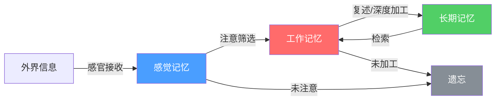
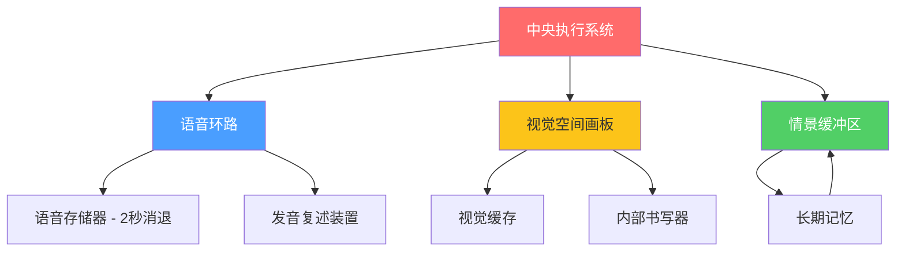
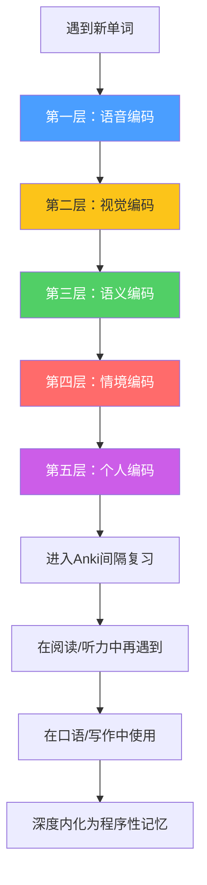
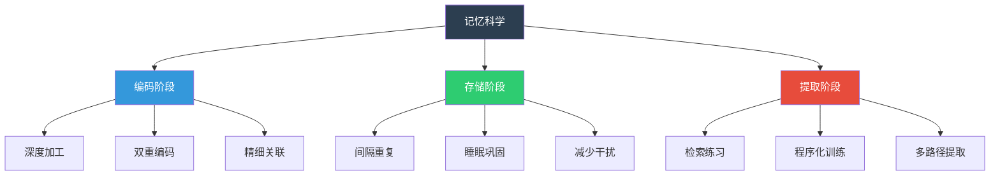

## 四、记忆科学与语言学习

语言学习本质上是一个记忆工程——你需要将成千上万的词汇、数百条语法规则、无数的表达模式全部刻入大脑，并且能在毫秒级别内检索调用。理解记忆的运作机制不是学术游戏，而是设计高效学习策略的底层基础。一个不懂记忆科学的学习者，就像一个不懂力学原理的建筑师——也许能盖出房子，但效率低下，而且随时可能倒塌。

### 4.1 记忆的多阶段模型

#### 4.1.1 从感觉到永久：信息的三级加工

记忆不是一个单一的存储仓库，而是一个多阶段的信息加工系统。认知心理学将记忆分为三个核心阶段：

**感觉记忆（Sensory Memory）**：外界信息通过感官进入大脑的第一个缓冲区。视觉感觉记忆（图像记忆，iconic memory）持续约0.25-0.5秒，听觉感觉记忆（回声记忆，echoic memory）持续约3-4秒。感觉记忆的容量很大，几乎能完整记录感官接收到的所有信息，但如果不加以注意，信息会在瞬间消失。

对语言学习的启示：**注意力是记忆的守门人**。在嘈杂环境中听英语播客、边刷手机边背单词——这些做法之所以无效，是因为大量语言输入在感觉记忆阶段就被丢弃了，根本没有进入后续加工。

**工作记忆（Working Memory）**：受到注意的信息进入工作记忆。工作记忆是意识工作的"桌面"，所有有意识的思维活动——理解句子、构造表达、推理判断——都在这里进行。

乔治·米勒（George Miller, 1956）的经典论文《神奇的数字7±2》指出，工作记忆的容量约为7±2个信息组块（chunk）。但后续研究（Cowan, 2001）将这个数字修正为4±1个独立组块——米勒实验中的被试实际上是通过组块化策略将多个项目打包为一个组块来提高效率的。

工作记忆有两个关键限制：
- **容量限制**：同时只能处理4±1个组块
- **时间限制**：信息在工作记忆中只能保持15-30秒，除非通过复述或深度加工

这意味着：当你试图理解一个包含多个从句的长句时，如果每个词都是独立的组块，工作记忆会在句末就已经忘记了句首。但如果你能将"主语+谓语+宾语"识别为一个组块，将"定语从句"识别为另一个组块，你就能在有限的工作记忆中处理更复杂的句子。

**长期记忆（Long-term Memory）**：经过充分加工的信息被转入长期记忆。长期记忆的容量几乎无限（Estimates suggest the human brain can store approximately 2.5 petabytes of information），存储时间可以是终生。语言学习的终极目标，就是将语言知识和技能存入长期记忆，并建立高效的检索路径。

#### 4.1.2 巴德利的工作记忆模型

艾伦·巴德利（Alan Baddeley, 1974, 2000）提出的多组件工作记忆模型，比简单的"容量有限"描述更加精细，对语言学习有直接的指导意义：

**语音环路（Phonological Loop）**：专门处理听觉和语音信息。它包含两个子组件：
- **语音存储器**：保存听觉信息，约2秒就会消退
- **发音复述装置**：通过默读或出声复述来刷新语音存储器中的信息

语音环路是语言学习的核心组件。它解释了为什么：
- 你能记住一个7位的电话号码（在语音环路的2秒容量内刚好可以复述一遍）
- 跟读（shadowing）和朗读对语言学习特别有效——它们直接训练语音环路
- 母语者的口语速度过快时你听不懂——信息到达速度超过语音环路的刷新速度
- 学习发音相似的外语单词容易混淆——它们在语音环路中竞争同一个存储槽位

**视觉空间画板（Visuospatial Sketchpad）**：处理视觉和空间信息。在语言学习中，它负责将文字转化为心理意象，也参与阅读时的视觉词汇识别。

**情景缓冲区（Episodic Buffer）**：2000年新增的组件，负责将来自不同来源的信息（语音、视觉、语义）整合为连贯的情景表征。它是深度加工发生的关键场所——当你将一个新单词的发音、拼写、含义、用法和个人经历整合在一起时，就是情景缓冲区在工作。

**中央执行系统（Central Executive）**：工作记忆的"指挥官"，负责注意力控制、任务切换和协调各子系统。它决定哪些信息值得深入加工，哪些应该丢弃。

工作记忆模型的实操启示：

| 工作记忆组件 | 语言学习中的功能 | 训练方法 |
|:---|:---|:---|
| 语音环路 | 听力理解、口语流利度、词汇发音记忆 | 跟读训练、听写、朗读、语音模仿 |
| 视觉空间画板 | 阅读理解、词汇拼写、语境画面构建 | 画思维导图、视觉联想、看图说话 |
| 情景缓冲区 | 多模态信息整合、深度学习 | 多感官学习、情境化记忆、故事串联 |
| 中央执行系统 | 注意力分配、任务切换、元认知监控 | 冥想训练、有意识的注意力管理 |

### 4.2 遗忘的科学规律

#### 4.2.1 艾宾浩斯遗忘曲线

德国心理学家赫尔曼·艾宾浩斯（Hermann Ebbinghaus, 1885）通过自我实验，用无意义音节作为材料，绘制出了人类历史上第一条遗忘曲线。他的发现揭示了一个残酷的事实：**遗忘在学习之后立即开始，而且速度惊人**。

艾宾浩斯实验数据的精确时间线：

| 学习后时间 | 记忆保持率 | 遗忘率 |
|:---|:---|:---|
| 20分钟 | 58% | 42% |
| 1小时 | 44% | 56% |
| 8小时 | 36% | 64% |
| 1天 | 34% | 66% |
| 2天 | 28% | 72% |
| 6天 | 25% | 75% |
| 31天 | 21% | 79% |

这条曲线告诉我们两个关键信息：
1. **前24小时是黄金抢救期**——学习后1天内不复习，你就会遗忘近三分之二的内容
2. **遗忘速度逐渐放缓**——每次成功复习都能延长记忆的寿命

需要指出的是，艾宾浩斯使用的是无意义音节（如"DAX"、"BUP"），实际学习有意义的语言材料时，遗忘速度会更慢，因为有意义的内容可以与已有知识建立联系。但总体趋势是一致的。

#### 4.2.2 遗忘的原因

遗忘不是单一机制导致的，而是多种因素的共同作用：

**衰退理论（Decay Theory）**：记忆痕迹随时间自然衰减，就像沙滩上的脚印被潮水逐渐冲刷。这主要影响感觉记忆和工作记忆中的信息。

**干扰理论（Interference Theory）**：新旧信息之间的相互干扰是长期记忆遗忘的主要原因。干扰分为两种：
- **前摄干扰（Proactive Interference）**：旧知识干扰新知识的记忆。例如，你学了法语后开始学西班牙语，法语单词会"抢占"西班牙语单词的记忆空间。
- **倒摄干扰（Retroactive Interference）**：新知识干扰旧知识的回忆。例如，学了西班牙语的发音规则后，可能会干扰你回忆法语的发音规则。

干扰理论对语言学习的重要启示：**相似语言同时学习会产生严重干扰**。如果同时学习西班牙语和意大利语（两种高度相似的罗曼语），词汇和语法的干扰会让你两边都记不牢。最佳策略是先将一种学到中高级水平，再开始学习另一种。

**提取失败（Retrieval Failure）**：信息实际上还在长期记忆中，但无法找到正确的提取路径。"话到嘴边说不出来"（tip-of-the-tongue phenomenon）就是典型的提取失败。这说明**建立丰富的提取路径比单纯存储信息更重要**。

### 4.3 间隔重复：对抗遗忘的最强武器

#### 4.3.1 间隔效应的科学基础

间隔效应（Spacing Effect）是认知心理学中复制最充分、效应量最大的发现之一（Cepeda et al., 2006）。其核心发现是：**将学习分散在多个时间段进行，比集中在一个时间段（突击学习）效果更好，即使总学习时间相同**。

为什么间隔重复如此有效？主流解释有三个：

1. **提取努力假说（Retrieval Effort Hypothesis）**：间隔一段时间后，记忆已经开始衰退，此时需要更大的努力来提取——而这种努力的提取本身就是最强的记忆巩固方式。这与"测试效应"紧密相连。

2. **编码变异性假说（Encoding Variability Hypothesis）**：每次在不同时间复习时，你的心境、环境、注意力状态都不同，这些差异导致信息从多个角度被编码，形成了更丰富的记忆表征。

3. **巩固间隔假说（Consolidation Spacing Hypothesis）**：两次复习之间的间隔给了大脑时间进行记忆巩固（将信息从海马体转移到新皮层），间隔太短则巩固过程尚未完成。

#### 4.3.2 最优间隔的数学模型

间隔重复并非简单地"每隔几天复习一次"。最优间隔取决于多个因素：

**基本间隔公式**：第N次复习的理想间隔 ≈ 初始间隔 × 难度系数^(N-1)

实际操作中的通用时间表：

| 复习次数 | 与上次间隔 | 累计天数 | 记忆预期保持率 |
|:---|:---|:---|:---|
| 首次学习 | 当天 | 0 | 100% |
| 第1次复习 | 1天后 | 1 | 90%以上 |
| 第2次复习 | 3天后 | 4 | 85%以上 |
| 第3次复习 | 7天后 | 11 | 80%以上 |
| 第4次复习 | 14天后 | 25 | 80%以上 |
| 第5次复习 | 30天后 | 55 | 80%以上 |
| 第6次复习 | 60天后 | 115 | 80%以上 |
| 第7次复习 | 120天后 | 235 | 80%以上 |
| 第8次复习 | 240天后 | 475 | 80%以上 |

注意间隔大致呈倍增趋势——这不是巧合，而是大脑记忆巩固规律的体现。

**难度调整**：上面的时间表假设难度适中的项目。实际操作中需要根据个人情况调整：
- 简单的项目（如已有大量关联的常见词）：间隔可以翻倍
- 困难的项目（如抽象概念、不规则变化）：间隔缩短为一半
- 极难的项目（完全陌生的领域）：回到初始间隔重新开始

#### 4.3.3 Anki 实战配置指南

Anki 是最流行的间隔重复软件，基于 SM-2 算法（SuperMemo 2）改进而来。以下是经过大量实践验证的优化配置：

**基础设置（在"牌组选项"中调整）**：

新卡片/天: 20-30（初学者）/ 50-100（高强度学习）
最大复习/天: 9999（不要限制复习数量，否则会累积欠债）
学习步骤（分钟）: 1 10（两次短间隔确保当天记住）
新卡片间隔（天）: 1（学习后第二天首次复习）
简单间隔: 4
毕业间隔: 7

**卡片设计的黄金法则**：

1. **一条信息一张卡**：不要在一张卡片上塞多个知识点。"苹果=apple"和"橙子=orange"应该各做一张卡。

2. **填空优于完整回忆**：
   - 差的正面："abandon 的意思是什么？"
   - 好的正面："The sailors had to _____ the sinking ship." → abandon

3. **提供足够上下文**：
   - 差的卡片："keen" → "敏锐的"
   - 好的卡片："She has a keen eye for detail. keen = ___" → "敏锐的"

4. **音频卡片**：外语学习中，至少一半的卡片应该包含音频。听力词汇和阅读词汇是两套不同的记忆，需要分别训练。

5. **图片辅助**：对于具体名词和动作动词，使用图片代替中文翻译，减少母语中介，直接建立外语→意象的连接。

**常见Anki使用误区**：

| 误区 | 问题 | 正确做法 |
|:---|:---|:---|
| 每天只学新卡，不复习旧卡 | 遗忘雪崩，后期复习量爆炸 | 新卡和复习的时间比例不超过 1:3 |
| 卡片太复杂，一张卡包含整段语法 | 失败率高，挫败感强 | 每张卡片只测试一个知识点 |
| 看到卡片就按"知道" | 自我欺骗，实际没有真正回忆 | 严格标准：必须完整回忆出答案才算"知道" |
| 积累了上万张卡片不做清理 | 低质量卡片浪费时间 | 定期清理过时、低效的卡片 |
| 用Anki学语法概念 | 语法需要理解而非死记 | Anki用于词汇和例句，语法通过造句练习 |

#### 4.3.4 超越Anki：间隔重复的系统化实施

间隔重复不应该只局限于Anki中的卡片复习。将间隔重复原则应用到整个学习流程中：

**阅读间隔**：同一篇文章在不同时间多次阅读。第一次关注整体理解，第二次关注词汇，第三次关注句式结构，第四次尝试复述。

**听力间隔**：同一段音频在不同时间多次听。第一次听大意，第二次做听写，第三次跟读，第四次脱离文本裸听。

**口语间隔**：同一个话题在不同时间多次练习。第一次是准备后的表达，第二次是半准备表达，第三次是即兴表达。

### 4.4 深度加工与编码策略

#### 4.4.1 加工水平理论

克雷克和洛克哈特（Craik & Lockhart, 1972）提出的加工水平理论（Levels of Processing Theory）是理解"为什么有些东西一看就记住了，有些背十遍也记不住"的关键。

该理论的核心观点：**记忆的持久性不取决于复述次数，而取决于加工深度**。

加工深度的三个层次：

1. **结构加工（浅层）**：关注信息的物理特征。例如，注意一个单词是大写还是小写、有几个字母。这种加工几乎不产生长期记忆。

2. **语音加工（中层）**：关注信息的声音特征。例如，注意一个单词的发音、押韵。这能产生短期记忆。

3. **语义加工（深层）**：关注信息的含义和关联。例如，理解一个单词的意思、将其与已知知识联系、思考其在不同语境中的用法。这能产生持久的长期记忆。

**一个简单的自测**：回忆你小时候学过的单词——"apple"。你大概不需要任何努力就能回忆出它的拼写、发音和含义。这不是因为你重复了无数次，而是因为"苹果"这个概念在你的认知网络中有着极其丰富的连接（颜色、味道、形状、吃苹果的记忆、苹果手机等），是一个被深度编码的概念。

现在想一个你总是记不住的外语单词。大概率，它在你的记忆中只有一层浅浅的连接——"这个单词的意思是xxx"。没有上下文，没有个人关联，没有多感官体验，只有一条脆弱的记忆痕迹。

#### 4.4.2 精细加工策略

精细加工（Elaboration）是将新信息与已有知识网络建立丰富连接的过程。具体方法包括：

**自我参照效应（Self-Reference Effect）**：将学习内容与自身经验联系起来，记忆效果最好（Rogers et al., 1977）。

例如，学习"nostalgia"（怀旧）这个词：
- 浅层加工："nostalgia = 怀旧" → 背十遍可能还是记不住
- 深层加工："nostalgia = 怀旧。我每次听到小时候的动画片主题曲就会nostalgic，想起放学后在电视机前吃零食的时光。" → 可能一次就记住了

**生成效应（Generation Effect）**：自己生成的信息比被动接收的信息记忆更深（Slamecka & Graf, 1978）。这就是为什么造句比背例句更有效，做填空题比看答案更有效。

**精细询问（Elaborative Interrogation）**：对每个新知识追问"为什么"。例如，为什么英语中"sheep"的复数不加-s？因为它属于古英语中元音变化的不规则复数形式（类似goose→geese）。这种"为什么"的追问将孤立的事实编织进了更大的知识网络。

#### 4.4.3 双重编码理论

佩维奥（Paivio, 1986）的双重编码理论（Dual Coding Theory）认为，人类有两套独立但相互关联的信息编码系统：

- **言语系统**：处理语言信息（文字、语音）
- **非言语系统**：处理视觉、听觉、触觉等非语言信息（意象、画面、感觉）

当一个信息同时被两套系统编码时，就有两条独立的提取路径——即使一条路径受损，另一条仍然可以工作。这就像一座城市有两条高速公路通往同一个目的地，即使一条堵车，你仍然可以到达。

**在语言学习中的应用**：

1. **词汇学习**：不要只记"word = 中文意思"（只有言语编码）。同时构建心理意象——学习"elated"（欣喜若狂的）时，想象一个人跳起来欢呼的画面（言语+非言语双编码）。

2. **语法学习**：不要只背语法规则条文。用图表、时间线、颜色标记来可视化语法规则。例如，用不同颜色标注英语时态的时间轴——过去用蓝色，现在用绿色，将来用橙色。

3. **听力训练**：听的时候同时想象画面，将声音转化为场景。这不仅增强记忆，还提高理解速度。

4. **阅读理解**：遇到抽象概念时，尝试将其转化为具体的图表或示意图。人的意象系统比言语系统记忆容量更大，且处理速度更快。

### 4.5 记忆术在语言学习中的应用

#### 4.5.1 关键词记忆法

关键词记忆法（Keyword Method）由阿特金森和劳夫（Atkinson & Raugh, 1975）提出，是外语词汇学习中研究最充分的记忆术。

**操作步骤**：
1. 选择一个与外语单词发音相似的母语词（关键词）
2. 构建一个包含关键词和单词含义的生动心理意象

**实例演示**：

| 目标词 | 发音 | 关键词 | 联想意象 |
|:---|:---|:---|:---|
| abandon（放弃） | /əˈbændən/ | "a笨蛋" | 一个笨蛋被人遗弃在荒岛上 |
| ambulance（救护车） | /ˈæmbjuləns/ | "俺不能死" | 躺在救护车上大喊"俺不能死" |
| pest（害虫） | /pest/ | "拍死它" | 看到害虫立刻"拍死它" |
| balcony（阳台） | /ˈbælkəni/ | "抱客来你" | 在阳台上"抱"着客人"来""你"家 |

**关键词法的科学评估**：

优势：
- 短期记忆效果极佳，多项研究显示可提高30%-50%的即时回忆率
- 特别适合初学者快速建立基础词汇量
- 对具体名词和动词效果最好

局限：
- 可能影响发音准确性（因为联想基于近似发音而非精确发音）
- 需要额外的认知负荷来创建联想
- 对抽象词汇效果较差
- 长期效果不如深度加工和自然语境学习

**最佳实践**：将关键词法作为词汇学习的辅助启动器，而非主要策略。先用关键词法快速记住一个新单词，然后通过语境阅读和使用来建立更深层的记忆连接。

#### 4.5.2 记忆宫殿法

记忆宫殿法（Method of Loci）起源于古希腊，是已知最古老的记忆术之一。其核心原理是将需要记忆的信息与熟悉的空间位置绑定，利用人类强大的空间记忆能力来辅助记忆。

**操作步骤**：
1. 选择一个你极其熟悉的空间（你的家、学校、上班路线）
2. 在空间中选择一系列固定的位置点（门口→玄关→客厅沙发→茶几→电视...）
3. 将需要记忆的信息以夸张、荒诞的意象放置在各个位置点上
4. 回忆时在脑海中"走"过这个空间，依次"看到"每个位置的信息

**语言学习中的应用——主题词汇宫殿**：

以"厨房"为记忆宫殿，学习食物类词汇为例：

| 位置点 | 词汇 | 意象 |
|:---|:---|:---|
| 冰箱门 | refrigerator | 冰箱门上贴满冰块 |
| 灶台上 | stove | 灶台上火焰喷出三米高 |
| 水槽里 | sink | 水槽里有一艘正在沉没（sink）的小船 |
| 碗柜中 | cupboard | 碗柜打开全是奖杯（cup） |
| 微波炉 | microwave | 微波炉里在发射微波，波浪翻涌 |

记忆宫殿法特别适合以下场景：
- 记忆有序列表（如动词不规则变化表）
- 按主题分类记忆词汇
- 记忆语法规则的例外情况
- 准备口语考试的话题要点

#### 4.5.3 词源分析法

词源分析法通过理解单词的历史演变来加深记忆，特别适合英语等有丰富词源信息的语言。

**希腊语和拉丁语词根**是英语词汇的核心构建模块。掌握50个最常见的词根，就能理解和记忆数千个英语单词。

| 词根 | 含义 | 来源 | 派生词举例 |
|:---|:---|:---|:---|
| dict | 说 | 拉丁语 dicere | predict（预言）、dictate（口授）、contradict（矛盾） |
| scrib/script | 写 | 拉丁语 scribere | describe（描述）、prescribe（开处方）、manuscript（手稿） |
| port | 携带 | 拉丁语 portare | transport（运输）、import（进口）、portable（便携的） |
| graph/gram | 写/画 | 希腊语 graphein | photograph（照片）、grammar（语法）、biography（传记） |
| log/logy | 话语/学科 | 希腊语 logos | logic（逻辑）、biology（生物学）、dialogue（对话） |
| rupt | 断裂 | 拉丁语 rumpere | interrupt（打断）、corrupt（腐败）、erupt（爆发） |
| spect | 看 | 拉丁语 specere | inspect（检查）、respect（尊敬）、suspect（怀疑） |
| mit/miss | 发送 | 拉丁语 mittere | submit（提交）、mission（任务）、admit（承认） |
| duct/duc | 引导 | 拉丁语 ducere | conduct（指导）、produce（生产）、reduce（减少） |
| cept/ceiv | 拿取 | 拉丁语 capere | accept（接受）、receive（接收）、concept（概念） |

**前缀系统**同样重要：

| 前缀 | 含义 | 举例 |
|:---|:---|:---|
| un-/in-/dis- | 否定 | unhappy, invisible, disagree |
| re- | 再次/返回 | rebuild, return, review |
| pre- | 之前 | preview, predict, prepare |
| post- | 之后 | postpone, postgraduate |
| trans- | 跨越 | transport, translate, transfer |
| inter- | 之间 | international, internet, interact |
| sub- | 下方 | subway, submarine, subtitle |
| super- | 上方/超越 | superpower, supernatural |
| mis- | 错误 | mistake, misunderstand, mislead |
| over- | 过度 | overwork, overestimate, overreact |

掌握词根词缀系统后，面对生词时不再是"猜"，而是有理有据地"分析"。例如遇到"circumscription"，你可以分析出：circum（围绕）+ script（写）+ ion（名词后缀）= 围起来写 = 界限、范围。

### 4.6 检索练习与测试效应

#### 4.6.1 测试效应的科学证据

测试效应（Testing Effect）是近年来认知心理学最重要的发现之一。其核心结论违反直觉：**测试（主动回忆）不是评估记忆的手段，而是增强记忆的手段**。

卡皮克和罗迪格（Karpicke & Roediger, 2008）的经典实验清楚地展示了这一点。学生学习外语词汇表，分为四组：
- 组1：只学习不测试
- 组2：学习+测试全部词汇
- 组3：学习+测试不熟练的词汇（删除已掌握的）
- 组4：学习+测试全部词汇（但主观判断自己是否记住了）

一周后的测试结果：
- 组2（学习+测试全部）的记忆保持率最高，约80%
- 组3（删除已掌握的，只测试不熟练的）只保持了约40%
- 组1（只学习不测试）保持率最低

关键发现：**即使你觉得已经记住了，测试本身仍然能强化记忆**。删除"已掌握"的项目不再测试，反而导致这些项目的记忆大幅衰退。

#### 4.6.2 检索练习的实施方法

**回忆式学习法（Active Recall）**：

传统学习方式是"反复阅读笔记"（被动复习），回忆式学习是"先尝试回忆，再检查答案"（主动检索）。后者的效果是前者的2-3倍（Roediger & Butler, 2011）。

具体操作：

1. **闭卷回忆**：读完一段材料后，合上书，尝试用自己的话复述核心内容。这比反复阅读有效得多。

2. **空白纸测试**：拿一张白纸，尽可能多地写出你对某个主题的了解。然后对照材料补充遗漏的部分。

3. **教别人（费曼技巧）**：假装你要给一个完全不懂的人讲解这个知识点。如果你在某个地方卡壳了，说明你的记忆在那个点上是不完整的。

4. **自我提问**：学习后给自己出题。例如，学完英语现在完成时后，自问："现在完成时和一般过去时的区别是什么？什么情况下只能用现在完成时？"

**输出驱动学习**：

传统外语学习强调大量输入（听、读），但研究表明，输出（说、写）对记忆巩固同样重要，甚至更重要。

输出为什么能增强记忆？
- 输出迫使你进行检索练习——你需要从记忆中"提取"词汇和语法
- 输出暴露了你知识的薄弱点——说不出来或写不出来的部分就是需要加强的
- 输出涉及更深的加工——你需要考虑词序、搭配、时态等多维度信息
- 输出创造了"生产性失败"——犯错后的纠正比直接告知更有效

### 4.7 程序性记忆与陈述性记忆

#### 4.7.1 两种记忆系统的本质区别

语言学习涉及两种根本不同的记忆系统，理解它们的区别是理解"为什么学了却用不出来"的关键。

**陈述性记忆（Declarative Memory）**：存储可以被有意识回忆和陈述的事实性知识。
- 特点：可以快速获取（一次学习就能记住），但调用较慢（需要有意识地搜索）
- 语言中的体现：单词拼写和含义、语法规则条文、文化知识
- 神经基础：主要依赖海马体和内侧颞叶

**程序性记忆（Procedural Memory）**：存储自动化的行为技能和习惯。
- 特点：获取缓慢（需要大量重复练习），但一旦形成，调用极快（自动、无意识）
- 语言中的体现：流利的口语表达、自然的语法运用、语感
- 神经基础：主要依赖基底神经节和小脑

| 特征 | 陈述性记忆 | 程序性记忆 |
|:---|:---|:---|
| 获取速度 | 快（一次学习即可） | 慢（需要大量重复） |
| 提取速度 | 慢（需要有意识搜索） | 快（自动调用） |
| 意识参与 | 有意识 | 无意识 |
| 可表述性 | 可以用语言描述 | 难以用语言描述 |
| 遗忘方式 | 可能完全遗忘 | 一旦形成很难遗忘 |
| 语言中的例子 | "英语有12种时态" | 自动选择正确的时态 |

#### 4.7.2 从"知道"到"会用"的程序化过程

安德森（Anderson, 1983）的ACT-R理论描述了技能习得的三个阶段：

**阶段一：认知阶段（Cognitive Stage）**
- 学习者通过有意识的学习获取知识（陈述性记忆）
- 每一步都需要思考和注意力
- 表现：缓慢、容易出错、需要大量认知资源
- 语言中的体现：造句时逐条回忆语法规则，说一句话要停顿很久

**阶段二：联合阶段（Associative Stage）**
- 通过反复练习，陈述性知识开始转化为程序性知识
- 错误逐渐减少，速度逐渐提高
- 表现：较少错误、速度中等、仍然需要注意力
- 语言中的体现：造句时不再逐条回忆规则，但复杂句式仍需思考

**阶段三：自动化阶段（Autonomous Stage）**
- 程序性知识完全自动化
- 表现：快速、准确、几乎不需要注意力
- 语言中的体现：母语般自然的表达，语感取代了规则

这个过程解释了为什么"背了语法规则却不会用"——你只完成了第一阶段的认知学习，还没有经过足够的练习将其程序化。就像你知道骑自行车的物理原理（陈述性知识），但在真正骑上去之前，你并不会骑（程序性知识缺失）。

**程序化的关键条件**：大量、多样化、有反馈的练习。仅仅重复相同的例句不够——你需要在不同语境、不同话题、不同场景中反复使用同一个语言结构，才能将其真正程序化。

### 4.8 睡眠与记忆巩固

#### 4.8.1 睡眠期间的大脑在做什么

神经科学研究揭示了一个惊人的事实：**睡眠不是大脑的"关机"状态，而是一个高度活跃的信息处理过程**。

在非快速眼动睡眠（NREM）的慢波睡眠阶段，大脑会"重播"白天学习的内容——海马体会重新激活白天形成的记忆痕迹，并将其传输到大脑皮层进行长期存储。这个过程称为记忆巩固（Memory Consolidation）。

威尔克等人（Walker & Stickgold, 2004）的研究发现，学习后睡眠中的慢波活动（SWA）增加量，与第二天的记忆测试成绩呈正相关——慢波活动越多，记忆巩固越好。

快速眼动睡眠（REM）阶段则与程序性记忆的巩固关系更密切。这可能解释了为什么学习一门新语言后睡觉，第二天起来会感觉"更顺了"——睡眠中的REM阶段帮助巩固了语言的程序性知识。

#### 4.8.2 睡眠优化策略

**睡前学习窗口**：

睡前30-60分钟是记忆的"黄金窗口"。在这个时间段学习的内容，因为没有后续信息的干扰（倒摄干扰最小化），且很快进入睡眠巩固，记忆效果特别好。

具体建议：
- 睡前用15-30分钟复习Anki卡片
- 睡前用15分钟听目标语言的轻松播客或有声书
- 不要在睡前学习全新的、高难度的内容（可能导致焦虑影响睡眠）
- 不要使用电子屏幕的蓝光模式（影响褪黑素分泌），建议使用护光模式或纸质材料

**睡眠时长与质量**：

| 睡眠因素 | 影响 | 建议 |
|:---|:---|:---|
| 总时长 | 少于6小时严重损害记忆巩固 | 保证7-9小时睡眠 |
| 连续性 | 碎片化睡眠降低慢波睡眠质量 | 避免夜间频繁醒来 |
| 睡眠时间 | 固定作息有利于睡眠周期稳定 | 每天同一时间入睡和起床 |
| 午睡 | 20-30分钟的午睡可提升下午的记忆力 | 安排在下午1-3点 |
| 睡前刺激 | 咖啡因、运动、刺激性内容影响入睡 | 睡前2小时避免咖啡因，1小时避免剧烈运动 |

**"睡眠学习"的神话与现实**：

虽然"睡眠中播放外语录音能学会外语"的说法已被证伪（睡眠中的大脑无法进行新的学习），但睡眠对学习后记忆的巩固作用是确凿无疑的。最有效的策略是：**醒着的时候学习，睡觉的时候巩固**。

### 4.9 记忆与语言各项技能的关系

记忆科学对语言学习的影响不仅限于词汇记忆，它贯穿语言能力的方方面面。

#### 4.9.1 记忆与听力

听力理解是一个复杂的实时记忆过程。你需要：
- 在语音环路中暂存刚刚听到的音节
- 将音节组合为词汇并从长期记忆中提取含义
- 将词义整合为句子意思，保持在工作记忆中
- 等待后续信息来补全和修正理解

听力差的常见原因之一是**词汇的听觉编码薄弱**——你能在阅读中认出这个单词，但在听力中无法识别。这说明你只建立了视觉→语义的记忆通路，没有建立听觉→语义的通路。

解决方案：对每个学习的词汇，同时建立阅读记忆和听力记忆。具体方法是：先听发音，再看拼写和含义，最后闭眼只听发音回忆含义。

#### 4.9.2 记忆与口语

口语流利度的核心瓶颈是**词汇和语法的检索速度**。程序性记忆系统负责自动化地选择正确的词汇和语法形式，但这个系统需要大量练习才能建立。

口语中的"话到嘴边说不出来"现象（tip of the tongue），本质上是词汇的语音形式提取失败——你知道这个词的意思，也"感觉"你知道怎么说，但就是找不到正确的发音。

减少这种现象的方法：
- 增加词汇的输出练习（不只是认识，还要会说）
- 学习词汇时大声朗读，建立发音的运动记忆
- 进行限时口语练习，训练快速检索能力

#### 4.9.3 记忆与阅读

阅读中的词汇识别涉及两条通路：
- **直接通路（视觉→语义）**：看到单词直接理解意思，不经过发音。高频词和熟练掌握的词汇走这条通路。
- **语音通路（视觉→语音→语义）**：先将文字转化为语音，再理解含义。低频词和生词走这条通路。

流利阅读需要大量高频词走直接通路。如果每个词都需要语音中介，阅读速度会很慢，而且会占用大量工作记忆，影响对整体内容的理解。

训练方法：大量阅读适合自己水平的材料（i+1水平），通过重复接触使更多词汇进入直接通路。

#### 4.9.4 记忆与写作

写作是所有语言技能中对记忆要求最高的。你需要同时：
- 从长期记忆中检索词汇和语法（检索负荷）
- 考虑拼写和标点（产出负荷）
- 规划文章结构和论证逻辑（元认知负荷）
- 监控和修改已写的内容（编辑负荷）

写作能力的提高，很大程度上就是减轻这些负荷的过程——当词汇拼写、语法规则、常用表达都成为程序性记忆后，你就可以将有限的工作记忆集中在内容和逻辑上。

### 4.10 记忆策略实战框架

#### 4.10.1 词汇记忆的五层编码系统

基于本章的理论，以下是经过验证的词汇深度学习流程：

**第一层：语音编码**
- 听3遍标准发音（使用词典App或Forvo.com）
- 大声模仿5遍，注意重音和音调
- 录音对比，纠正偏差

**第二层：视觉编码**
- 注意拼写规律和词根词缀
- 用不同颜色标注音节和词根

**第三层：语义编码**
- 查看英英释义（不只看中文翻译）
- 理解核心含义和引申含义
- 了解词性变化和常见搭配

**第四层：情境编码**
- 阅读3-5个包含该词的真实例句
- 在不同语境中体会用法差异
- 识别该词的语域特征（正式/非正式/书面/口语）

**第五层：个人编码**
- 用该词造一个与自己生活相关的句子
- 将该词与个人经历或情感联系
- 想象一个使用该词的真实场景

#### 4.10.2 每日记忆维护流程

| 时间段 | 活动 | 记忆原理 |
|:---|:---|:---|
| 早上起床后15分钟 | Anki复习（昨日新词） | 隔夜巩固后的首次检索 |
| 上午学习时段 | 新词深度编码（五层系统） | 利用上午注意力高峰 |
| 午饭后5分钟 | 快速Anki复习 | 午间复习对抗午后遗忘 |
| 下午学习时段 | 听力/阅读中再遇已学词汇 | 多场景编码增加提取路径 |
| 晚饭后 | 口语/写作中使用本周新词 | 输出练习促进程序化 |
| 睡前15-30分钟 | Anki复习（全部到期卡片） | 利用睡眠巩固效应 |

#### 4.10.3 常见记忆误区与纠正

| 误区 | 真相 | 纠正方法 |
|:---|:---|:---|
| "我记性不好" | 记忆力差异远小于策略差异 | 不是记忆力差，是学习策略需要优化 |
| "多看几遍就能记住" | 被动重复的效果远不如主动回忆 | 用回忆替代重读 |
| "一天背100个单词" | 贪多嚼不烂，遗忘率极高 | 每天20-30个深度学习+复习 |
| "用APP背单词就够了" | App只能提供间隔重复，缺少语境 | App辅助+大量阅读/听力 |
| "背单词表效率最高" | 脱离语境的词汇记忆不稳固 | 在句子和文章中学习词汇 |
| "学语言靠天赋" | 记忆策略和学习习惯比天赋重要 | 科学策略可弥补天赋差距 |
| "只学语法规则就够了" | 规则是陈述性记忆，使用需要程序化 | 规则学习+大量输出练习 |
| "语法错误说明学得差" | 错误是程序化的必经阶段 | 从错误中学习，不因错误退缩 |

### 4.11 本节核心要点回顾

记忆科学对语言学习的核心启示可以浓缩为以下几条原则：

1. **工作记忆有限，组块化是关键**：将零散的信息打包为有意义的组块，突破4±1的容量限制
2. **遗忘不可避免，间隔重复是对策**：利用间隔重复系统（如Anki）在最佳时间点复习
3. **深度编码比重复更重要**：建立词汇的多维记忆（语音+视觉+语义+情境+个人关联）
4. **主动回忆比被动复习有效2-3倍**：用回忆替代重读，用测试替代浏览
5. **睡眠是免费的记忆增强器**：保证充足睡眠，利用睡前黄金窗口
6. **从知道到会用需要程序化**：大量的多样化练习将陈述性知识转化为自动化技能
7. **输出和输入同等重要**：说和写不仅是表达工具，更是记忆巩固的手段

记住：你不需要天赋异禀的记忆力，你需要的是科学的记忆策略。将本章的原理融入日常学习，你会发现语言学习的效率产生质的飞跃。
