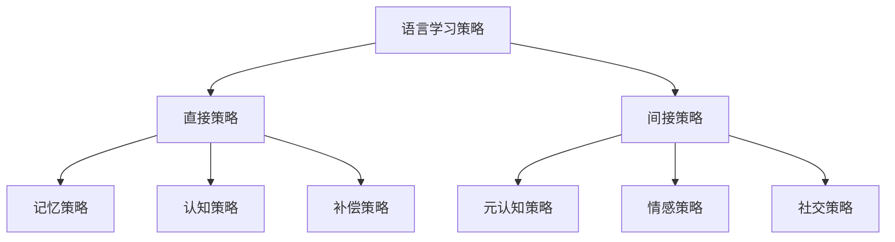
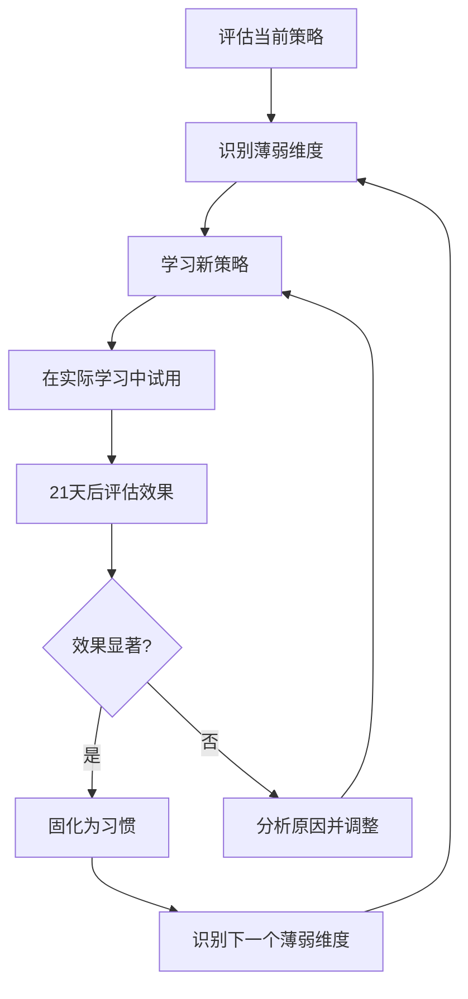

## 五、语言学习策略

语言学习策略是连接"学习者"与"语言能力"之间的桥梁。两个起点相同的学习者，使用不同的策略，一年后的差距可能超过十倍。本节系统梳理语言学习策略的理论框架、分类体系、培养路径和实操方法，帮助学习者建立"策略意识"——从无意识地学习，转变为有策略地学习。

### 5.1 什么是语言学习策略

#### 5.1.1 定义与本质

语言学习策略（Language Learning Strategies）是指学习者为促进语言的习得、存储、提取和使用而采取的有意识或半意识的行为、行动、步骤和技巧。

这一定义包含三个关键维度：

| 维度 | 说明 | 举例 |
|------|------|------|
| **目的性** | 策略服务于语言学习目标 | 为了记住单词而使用联想法 |
| **可操作性** | 策略是具体的行为或步骤 | 在阅读中标记生词、查阅后记录到笔记本 |
| **可调节性** | 策略可以根据效果调整 | 发现死记硬背效率低，改用间隔重复 |

#### 5.1.2 策略研究的里程碑

语言学习策略研究经历了三个阶段：

**第一阶段：优秀学习者研究（1970s）**。Joan Rubin（1975）率先研究"优秀语言学习者"（The Good Language Learner）的行为特征，发现他们会主动寻找实践机会、关注语言形式、监控自身产出。这一研究开创了策略研究的先河。

**第二阶段：分类体系建立（1980s-1990s）**。O'Malley和Chamot（1990）提出三分法（元认知策略、认知策略、社会/情感策略），Oxford（1990）提出更细致的六分类体系。这些框架至今仍是策略研究的主流参照。

**第三阶段：策略教学研究（2000s至今）**。Rebecca Oxford、Andrew Cohen等人推动了"策略导向教学"（Strategy-Based Instruction, SBI），研究如何将策略训练融入课堂教学。研究表明，接受系统策略训练的学习者，语言成绩平均提高15%-25%（Cohen & Weaver, 2006）。

#### 5.1.3 策略与技巧的区别

很多人混淆"策略"和"技巧"。两者的关系如下：

策略（Strategy）= 有目的的、系统的方法选择
技巧（Technique）= 具体的操作手段

例如：
  策略："我选择通过大量输入来提高听力"
  技巧："每天用1.25倍速听播客，听不懂的地方回放三次"

策略是上位概念，包含目标设定、方法选择、效果评估的完整循环；技巧是策略的具体执行方式。一个策略可以包含多个技巧。

### 5.2 Oxford 六分类策略体系

Rebecca Oxford（1990）在 *Language Learning Strategies: What Every Teacher Should Know* 中提出了最全面的策略分类框架，将策略分为**直接策略**（直接处理语言）和**间接策略**（管理学习过程）两大类、六小类。

#### 5.2.1 记忆策略（Memory Strategies）

记忆策略帮助大脑存储和提取语言信息。它的核心原理是：**将新信息与已知信息建立联系，创造提取路径**。

**分组归类法**：将词汇按语义场（semantic field）组织。例如学习水果词汇时，将 apple、banana、grape 归为一组，而不是与 car、hospital 混在一起记忆。认知心理学研究表明，组织化的信息比零散信息记忆效率高3-4倍。

**意象联想法**：将抽象的语言符号转化为生动的心理图像。例如记忆日语单词"猫（ねこ/neko）"，想象一只猫在捏（ne）一个椰子（ko）。这种方法激活了大脑的视觉皮层，创造了额外的神经通路。

**关键词法（Keyword Method）**：在母语中找一个与目标语发音相似的词，然后与目标词义建立视觉联系。例如记忆英语 "ambulance"（救护车），谐音"俺不能死"→救护车。大量实验研究表明，关键词法在词汇记忆初期效果显著，但长期保持效果因人而异。

**位置记忆法（Method of Loci）**：将需要记忆的内容放置在熟悉的"心理地图"中的不同位置。例如将10个生词分别放在从家到公司的10个标志物上，回忆时在脑中"走"一遍路线。这一方法源自古希腊，被现代记忆竞赛选手广泛使用。

**身体动作法（TPR, Total Physical Response）**：将语言与身体动作绑定。例如学习"open"时做开门动作，学习"jump"时跳一下。James Asher 提出的 TPR 教学法表明，动觉参与能显著增强记忆保持。

#### 5.2.2 认知策略（Cognitive Strategies）

认知策略是直接作用于语言材料的策略，涉及信息的接收、分析、转换和产出。

**精加工策略（Elaboration）**：将新信息与已有知识深度关联。例如学习 "procrastination"（拖延症）时，不仅记住词义，还造句"I always procrastinate before deadlines"，联想到自己的拖延经历，甚至画一幅表现拖延场景的漫画。精加工越深，记忆越牢。

**记笔记策略**：不是机械抄写，而是用**康奈尔笔记法**（Cornell Note-taking System）进行结构化记录：

| 区域 | 内容 | 作用 |
|------|------|------|
| 右侧主栏 | 课堂/阅读笔记原文 | 记录 |
| 左侧窄栏 | 关键词、问题、提示 | 线索提取 |
| 底部总结栏 | 用自己的话概括要点 | 深度加工 |

**归纳推理策略**：从语言实例中发现规则。例如观察到 "I go → He goes, I do → He does, I have → He has"，归纳出第三人称单数加 -s/-es 的规则。这比直接被告知规则印象更深。

**演绎推理策略**：将已知规则应用到新情境。例如掌握了英语比较级规则后，遇到新词 "beautiful"，推理出 "more beautiful"。

**分析对比策略**：通过母语和目标语的对比来发现差异。例如中文说"我在桌子上放了一本书"，英语说 "I put a book on the table"——注意介词位置的差异。对比分析能帮助学习者预见和避免母语干扰错误。

**输出实践策略**：Swain（1985）的"可理解输出假说"指出，输出（说和写）不仅是语言能力的展现，更是语言习得的驱动力。输出迫使学习者注意到自己语言知识的缺口（noticing the gap），从而推动语言系统的重构。

#### 5.2.3 补偿策略（Compensation Strategies）

补偿策略帮助学习者在语言能力不足时仍能有效沟通。

**猜测策略（Guessing from Context）**：阅读时遇到生词，不急于查字典，而是通过上下文、词根词缀、语法结构来推测词义。研究表明，高水平学习者平均能从上下文中正确猜测出60%-70%的生词含义。具体步骤：

1. 先读完整句子，理解大意
2. 识别生词的词性（名词？动词？形容词？）
3. 分析前后文的逻辑关系（因果？转折？并列？）
4. 利用词根词缀（如 un- 表否定，-tion 表名词）
5. 给出猜测，代入句子验证是否通顺

**同义替换策略**：不知道某个词时，用已知的近义词或描述性表达替代。例如不知道 "thermometer"，就说 "the thing that measures temperature"。这是口语中最高频使用的补偿策略。

**迂回表达策略（Circumlocution）**：当无法直接表达时，通过描述功能、特征、用途等方式间接传达。例如想说"螺丝刀"但不知道英文，可以说 "the tool you use to turn screws"。这种能力本身就是语言流利度的重要指标。

**非语言补偿**：使用手势、表情、画图等非语言手段辅助沟通。跨文化沟通中尤其重要——一个恰当的手势往往比搜肠刮肚找词汇更有效。

#### 5.2.4 元认知策略（Metacognitive Strategies）

元认知策略是**关于学习的学习**——管理、监控和评估自己的学习过程。Oxford 称其为"学习策略的指挥官"，研究反复证明，元认知策略是区分高效与低效学习者的最关键因素（Wenden, 1998）。

**计划策略**包含三个层次：

| 层次 | 时间跨度 | 内容 |
|------|----------|------|
| 宏观计划 | 6个月-1年 | 确定学习目标、选择教材、安排总体进度 |
| 中观计划 | 1-4周 | 划分学习单元、设定阶段性里程碑 |
| 微观计划 | 每次学习 | 确定本次学习的具体任务、时长、方法 |

**注意力集中策略**：创造专注的学习环境，设定"深度学习时间段"。具体做法包括：使用番茄工作法（25分钟专注+5分钟休息）、手机开飞行模式、选择固定的学习场所（环境线索能触发学习状态）。

**自我监控策略**：在学习和使用语言的过程中，持续检查自己的理解和产出。例如阅读时定期停下来问自己"这段话的核心意思是什么"；说话时在脑中有一个"旁听者"在审查自己的语法和用词。

**自我评估策略**：定期检验学习成果。具体方法包括：

- 每周用标准化小测验检测词汇量增长
- 每月录制一段口语音频，与上月对比
- 使用 CEFR（欧洲语言共同参考框架）自评量表，判断自己处于 A1-C2 哪个等级
- 参加模拟考试或正式考试检验综合水平

**策略调整策略**：当发现某种方法效果不佳时，果断更换。例如发现纯背单词书效率低，改为在语境中学习；发现看美剧总是看字幕，改为先听再看字幕。这种灵活调整能力是高水平学习者的标志。

#### 5.2.5 情感策略（Affective Strategies）

语言学习不仅是认知过程，也是情感过程。焦虑、恐惧、自卑等负面情绪会显著阻碍语言习得——Krashen 的"情感过滤假说"（Affective Filter Hypothesis）指出，过高的焦虑会形成一道屏障，阻止输入进入语言习得装置。

**降低焦虑策略**：

- **渐进暴露法**：先从低压力情境开始（自言自语、对着镜子说），逐步过渡到高压力情境（与母语者对话、公开演讲）
- **认知重构法**：将"我怕说错"重构为"犯错是学习的一部分"；将"别人会笑话我"重构为"大多数人对学习者很友善"
- **深呼吸法**：说话前做3次深呼吸，激活副交感神经系统，降低生理紧张

**自我鼓励策略**：

- 建立"成就日志"，记录每一次进步——哪怕是"今天听懂了一个完整的句子"
- 设定小目标并奖励自己——完成一周学习计划后看一部电影
- 与同样在学习语言的朋友组建互助小组，互相鼓励

**情绪觉察策略**：定期检查自己的学习情绪状态。可以用1-10分评估自己的学习动力、焦虑程度、成就感等指标。当发现动力持续低于4分时，需要分析原因并采取措施——可能是目标太高、方法不对、或者需要换一种学习方式。

#### 5.2.6 社交策略（Social Strategies）

语言本质上是社会性的——它是沟通工具。社交策略强调通过人际互动来促进语言学习。

**提问策略**：不理解时主动请求澄清。学会用目标语提问的多种方式：

- "Could you say that again, please?"
- "What does _____ mean?"
- "Could you speak a little slower?"

**合作学习策略**：与同伴组成学习小组，进行角色扮演、辩论、互改作文等活动。Vygotsky 的"最近发展区"理论表明，在同伴帮助下完成的任务，日后能独立完成——同伴既是脚手架，也是学习动力源。

**文化理解策略**：语言与文化不可分割。了解目标语文化中的禁忌、礼仪、幽默方式，能帮助理解语言的深层含义。例如英语中的 "That's interesting" 有时实际上是委婉的否定，不理解这个文化密码就会误判对方态度。

**共情倾听策略**：在与母语者交流时，不仅关注语言形式，还关注对方的情感和意图。这种深层沟通能力使学习者获得更丰富的语言输入和更多样的交流机会。

### 5.3 自我调节学习理论

自我调节学习（Self-Regulated Learning, SRL）由 Zimmerman（2002）系统提出，是理解学习策略的更高层理论框架。SRL 理论认为，高效学习者不是天生聪明，而是善于管理自己的学习过程。

#### 5.3.1 SRL 三阶段循环模型

**前瞻阶段**：学习开始前的规划。包括目标设定（"本周掌握100个学术词汇"）、自我效能评估（"我能做到吗？"）、策略选择（"用间隔重复法最有效"）、学习环境规划（"在图书馆学习效率最高"）。

**执行阶段**：学习过程中的自我管理。包括注意力聚焦（"现在不要看手机"）、策略使用（"用上下文猜测法处理这个生词"）、自我对话（"加油，这部分我已经懂了一半"）、任务策略调整（"精听太难了，先从泛听开始"）。

**反思阶段**：学习完成后的自我评估。包括结果判断（"今天的计划完成了80%"）、归因分析（"没完成是因为中途被打断了"）、策略评价（"联想法今天效率不高，下次试试语境法"）、适应性反应（"明天把学习时间调到早上，注意力更集中"）。

#### 5.3.2 从策略到习惯的转化

一个学习策略从"有意识使用"到"自动化习惯"需要经历四个阶段：

| 阶段 | 特征 | 举例 |
|------|------|------|
| 认知阶段 | 有意识地、缓慢地执行策略 | 每次遇到生词都刻意停下来用猜测法 |
| 联结阶段 | 错误减少，速度提高 | 猜测法越来越快，正确率提高 |
| 自动化阶段 | 策略变成习惯，无需刻意执行 | 自然地从上下文猜测词义 |
| 精通阶段 | 能灵活变通，教别人使用 | 知道什么时候猜测、什么时候查字典 |

研究表明，一个策略从认知阶段到自动化阶段，通常需要**21-66天**的持续使用（Lally et al., 2010）。这就是为什么学习策略不是知道就能用——必须反复练习到成为习惯。

### 5.4 高效学习者的策略图谱

多项研究（Rubin, 1975; Stern, 1975; Griffiths, 2018）揭示了成功语言学习者的策略共性。以下是经过研究验证的高效学习者策略图谱：

#### 5.4.1 核心策略特征

**1. 策略多样性与灵活性**。高效学习者平均使用15-20种不同策略，而低效学习者通常只使用3-5种。更重要的是，高效学习者会根据任务类型灵活切换策略——精听时使用一种策略，泛读时使用另一种。

**2. 以元认知为指挥官**。高效学习者将元认知策略作为核心，用它来监控其他策略的使用效果。一个简单的元认知循环：

设定目标 → 选择策略 → 执行学习 → 评估效果 → 调整策略 → 设定新目标

**3. 大量可理解输入**。Krashen 的输入假说（i+1）得到了大量实证支持。高效学习者会主动创造大量的、略高于当前水平的语言输入环境——阅读分级读物、收听适合水平的播客、观看带字幕的影视作品。

**4. 积极的语言产出**。不仅被动输入，还主动输出。写日记、做口头总结、参加语言交换——高效学习者的输入输出比例通常在 7:3 到 6:4 之间。

**5. 错误容忍度高**。将错误视为学习的信号而非失败的证据。研究发现，对错误的恐惧是阻碍成人语言学习的最大情感障碍之一。高效学习者常说的一句话是："我宁愿犯10个错误也不愿意一句不说。"

**6. 学习社群参与**。高效学习者通常不是独行侠——他们加入学习社群、寻找语言交换伙伴、参加语言角。社会互动提供了真实的沟通需求、即时反馈和情感支持。

#### 5.4.2 不同水平的策略偏好

研究发现，学习者在不同阶段依赖的策略组合不同：

| 水平 | 主要策略 | 原因 |
|------|----------|------|
| 初级（A1-A2） | 记忆策略、认知策略、补偿策略 | 需要大量记忆基础词汇和句型 |
| 中级（B1-B2） | 认知策略、元认知策略、社交策略 | 需要系统化管理和大量实践 |
| 高级（C1-C2） | 元认知策略、情感策略、社交策略 | 需要精细化管理和跨文化能力 |

### 5.5 策略导向的教学与自学

#### 5.5.1 策略导向教学（SBI）的核心原则

Andrew Cohen 提出的策略导向教学（Strategy-Based Instruction）强调：不仅要教语言内容，还要教学习方法。对于自学为主的成人学习者，这意味着需要**有意识地培养策略能力**。

SBI 的实施步骤：

1. **策略诊断**：使用策略量表（如 Oxford 的 SILL, Strategy Inventory for Language Learning）评估自己当前使用了哪些策略、使用频率如何
2. **策略意识培养**：了解有哪些策略可用，理解每种策略的原理和适用场景
3. **策略示范**：看到优秀学习者如何使用具体策略（通过视频、案例、他人经验）
4. **策略练习**：在真实学习任务中刻意使用新策略
5. **策略评估**：定期评估策略效果，保留有效策略，替换无效策略

#### 5.5.2 针对四项技能的策略选择

不同语言技能需要不同的策略组合：

**听力策略**：

| 策略类型 | 具体做法 |
|----------|----------|
| 自上而下 | 先看标题/话题，预测内容，激活背景知识 |
| 自下而上 | 精听关键词、信号词（however, in addition），捕捉语法线索 |
| 交互式 | 将背景知识和语言知识结合，边听边验证预测 |
| 元认知 | 选择适合自己水平的材料，从泛听过渡到精听，定期评估进步 |

**口语策略**：

| 策略类型 | 具体做法 |
|----------|----------|
| 流利度优先 | 先追求能说、敢说，不纠结语法完美 |
| 影子跟读 | 同步模仿母语者的语音语调，建立肌肉记忆 |
| 话题准备 | 针对常见话题预先准备词汇和表达 |
| 自我录音 | 定期录音回听，发现发音和流利度问题 |

**阅读策略**：

| 策略类型 | 具体做法 |
|----------|----------|
| 略读（Skimming） | 快速浏览获取大意，关注标题、首尾句 |
| 扫读（Scanning） | 寻找特定信息，如数字、人名、日期 |
| 精读（Intensive Reading） | 逐句分析词汇、语法、修辞 |
| 泛读（Extensive Reading） | 大量阅读略低于水平的材料，培养语感 |

**写作策略**：

| 策略类型 | 具体做法 |
|----------|----------|
| 头脑风暴 | 写前列出所有相关想法，不做判断 |
| 提纲法 | 先构建文章结构（论点-论据-结论），再填充内容 |
| 模仿法 | 分析优秀范文的结构和表达，模仿其风格 |
| 修改循环 | 初稿→自查语法→检查逻辑→他人反馈→终稿 |

### 5.6 刻意练习在语言学习中的应用

刻意练习（Deliberate Practice）由 K. Anders Ericsson 提出，是指有目的、有计划、有即时反馈、在舒适区边缘进行的系统练习。它不同于"随意练习"——随意练习只重复已会的内容，刻意练习专注于不会的内容。

#### 5.6.1 刻意练习的四个核心要素

**明确的子目标**：将"提高口语"这种模糊目标分解为可操作的子目标。例如：

大目标：能流利地用英语进行日常对话
  ├─ 子目标1：掌握200个日常高频短语
  ├─ 子目标2：能听懂常速英语播客80%内容
  ├─ 子目标3：发音准确率从60%提高到85%
  └─ 子目标4：能连续说2分钟不卡顿

**专注与强度**：刻意练习需要高度集中注意力。研究表明，每天1-2小时的高度专注练习，效果优于5小时的"磨时间"练习。Ericsson 发现，即使是顶尖演奏家，每天真正的刻意练习时间也不超过4小时。

**即时反馈**：没有反馈的练习等于闭门造车。获取反馈的渠道：

- 使用 AI 语音评测工具检测发音
- 使用 Grammarly 等工具检查写作
- 请母语者或教师指出错误
- 录音/录像回放自我检查
- 使用语言交换平台获得即时对话反馈

**逐步提升难度**：当某个难度水平的练习变得"舒适"时，立即提升难度。例如听力练习的进阶路径：

慢速VOA → 常速VOA → TED Talks → 英文播客 → 英文电影(无字幕)

#### 5.6.2 刻意练习 vs. 随意练习

| 维度 | 刻意练习 | 随意练习 |
|------|----------|----------|
| 目标 | 明确的子目标 | 模糊的"多练" |
| 注意力 | 高度集中 | 可能走神 |
| 反馈 | 即时、具体 | 延迟或缺失 |
| 难度 | 略高于当前水平 | 舒适区内重复 |
| 效果 | 高效进步 | 平台期/退步 |
| 举例 | 精听一段30秒音频20遍直到100%听懂 | 边做家务边听英文广播"磨耳朵" |

需要强调的是，随意练习并非毫无价值——它能帮助维持语感和增加输入量。但如果只做随意练习，进步会非常缓慢。理想的比例是**刻意练习占40%-60%，随意练习占40%-60%**，根据当前水平和阶段动态调整。

### 5.7 常见的策略误区

#### 误区一：只用一种策略

"我背单词效率最高，所以我就只背单词。"——这是最常见的策略单一化问题。词汇是基础，但语言能力是词汇、语法、语音、语用的综合体。只用一种策略就像只练臂力的运动员——某一维度强，整体弱。

**纠正方法**：绘制"策略轮盘"，覆盖记忆、认知、补偿、元认知、情感、社交六个维度，每周至少在4个维度上使用策略。

#### 误区二：策略使用不坚持

"我试过间隔重复，感觉没用就放弃了。"——任何策略都需要时间才能见效。间隔重复至少需要坚持30天才能看到显著效果。很多学习者在策略"起效期"之前就放弃了。

**纠正方法**：给每个新策略设定"最低试用期"——至少坚持使用21天，然后评估效果。记录使用日志，客观比较使用前后的变化。

#### 误区三：忽视元认知策略

"我每天学2小时英语就够了。"——学习时长不是最重要的，学习效率才是。没有元认知监控的2小时学习，效果可能不如有策略管理的30分钟。

**纠正方法**：每次学习前后花2分钟做"微规划"和"微反思"——这次学什么？用什么方法？学完了效果怎样？下次需要调整什么？

#### 误区四：将补偿策略当作目标

"我听不懂就看中文字幕，总比不看强。"——补偿策略的初衷是"过渡性"的，如果长期依赖字幕，听力能力永远不会提高。补偿策略应该是从"不会"到"会"的桥梁，而不是避风港。

**纠正方法**：定期检测自己对补偿策略的依赖程度。如果某个补偿行为已经持续超过3个月且没有减退趋势，说明需要强制降低依赖，逼迫自己使用真实能力。

#### 误区五：策略训练脱离实际

"我读了很多语言学习方法论的书，但从来不实践。"——知道策略和使用策略之间存在巨大鸿沟。策略的有效性来自反复使用，不是来自理论理解。

**纠正方法**：学一个策略就用一个策略。"学以致用"的原则在这里尤其适用——每学完一种新策略，在接下来的3天内至少使用3次。

### 5.8 技术增强的策略工具

现代技术为语言学习策略提供了强大的工具支持：

**间隔重复系统（SRS）**：Anki、Quizlet 等工具内置了间隔重复算法，自动安排复习时间。研究显示，使用 SRS 的词汇记忆效率比传统方法高 2-3 倍。

**语料库工具**：Skell、COCA（Corpus of Contemporary American English）等语料库可以帮助学习者查看词汇的真实用法、搭配频率和语境分布，远比词典提供的信息丰富。

**语音识别与评测**：ELSA Speak、Speechling 等工具利用 AI 对学习者的发音进行即时评分和纠错，解决了"自我监控难"的问题。

**语言交换平台**：HelloTalk、Tandem、italki 等平台让学习者可以随时找到母语者进行语言交换，解决了社交策略中"找不到语伴"的痛点。

**AI 辅助学习**：ChatGPT 等大语言模型可以充当"无限耐心的语言伙伴"——练习对话、批改作文、解释语法、模拟场景。AI 的优势是24小时可用、不会评判、能提供即时反馈。但它不能完全替代真人互动——缺乏真实的沟通压力和文化体验。

### 5.9 策略自评与优化流程

#### 5.9.1 策略自评清单

每月进行一次策略自评，用以下清单检查自己的策略使用情况：

| 策略维度 | 评估问题 | 评分(1-5) |
|----------|----------|-----------|
| 记忆策略 | 我是否使用了多种记忆技巧（联想、分组、间隔重复）？ | |
| 认知策略 | 我是否有目的地精读/精听，而不只是泛泛接触？ | |
| 补偿策略 | 我是否在逐渐减少对补偿手段的依赖？ | |
| 元认知策略 | 我是否有明确的学习计划并定期评估进度？ | |
| 情感策略 | 我是否有效地管理了学习焦虑和动力？ | |
| 社交策略 | 我是否有定期的语言实践和社交互动？ | |

评分标准：1=完全没用，2=偶尔使用，3=经常使用但不系统，4=系统使用，5=灵活运用且持续优化。

#### 5.9.2 策略优化循环

这个循环的关键在于**渐进式优化**——每次只引入1-2个新策略，等它们变成习惯后再引入新的。同时改变太多策略会导致认知过载，反而降低学习效率。

### 5.10 本节核心要点

| 要点 | 说明 |
|------|------|
| 策略决定效率 | 同样的学习时间，策略不同，效果可以相差数倍 |
| 六类策略需均衡发展 | 记忆、认知、补偿、元认知、情感、社交缺一不可 |
| 元认知是核心 | 计划、监控、评估、调整——这是策略的"策略" |
| 刻意练习优于随意练习 | 有目标、有反馈、有挑战的练习才能突破瓶颈 |
| 策略需要练习才能内化 | 从有意识使用到自动化习惯需要21-66天 |
| 技术是策略的放大器 | 善用SRS、语料库、AI工具等提升策略效率 |
| 定期自评并优化 | 每月检查策略使用情况，持续迭代改进 |

掌握语言学习策略，本质上就是学会"学习"本身。它不仅适用于语言学习，还能迁移到任何技能的习得中。投资在策略能力上的时间，是回报率最高的学习投资。
