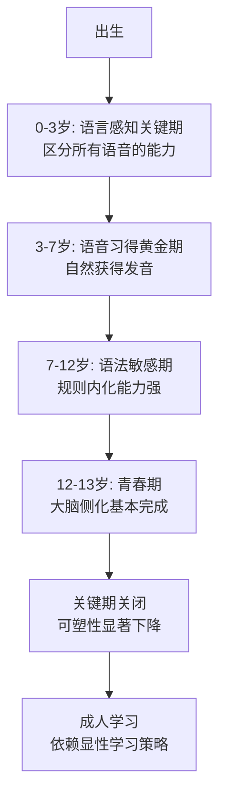
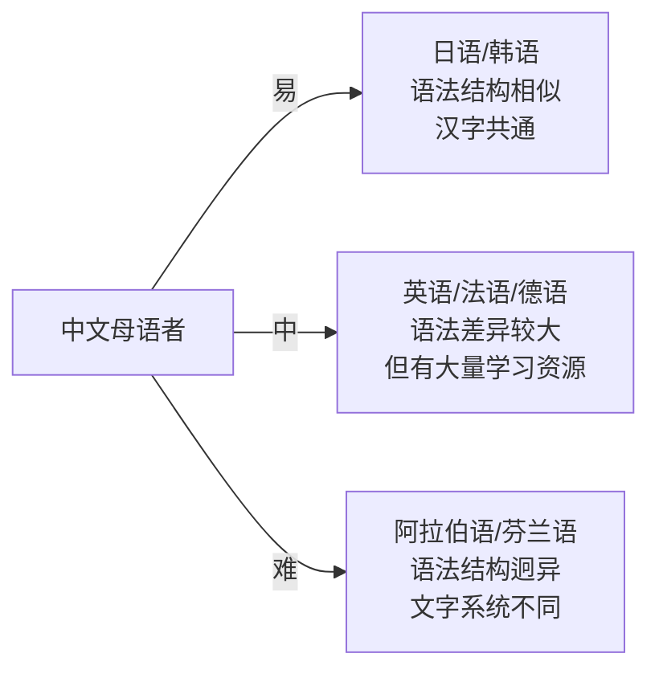
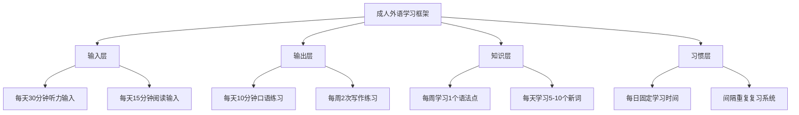

## 六、关键期假说与年龄因素

年龄对外语学习的影响是一个持续数十年的学术争议。有人说"学语言要趁早"，也有人说"什么时候开始都不晚"。这两种观点各有什么证据支撑？关键期到底存不存在？成人学习者真的注定无法达到母语水平吗？本节将从神经科学、认知心理学和语言习得研究的多维视角，系统梳理这一领域的核心理论和最新发现。

### 6.1 关键期假说的起源与核心主张

#### 6.1.1 Lenneberg的经典理论

1967年，美国神经语言学家埃里克·伦尼伯格（Eric Lenneberg）在其里程碑式著作《语言的生物学基础》（*Biological Foundations of Language*）中提出了关键期假说（Critical Period Hypothesis, CPH）。该假说的核心主张包含三个层面：

**时间窗口**：语言习得存在一个生物学上的敏感窗口，大约从出生开始，持续到青春期（约12-13岁）。在此期间，大脑的语言区域具有高度可塑性，语言习得可以自然、高效地发生。

**生物学基础**：这一窗口的关闭与大脑侧化（lateralization）的完成密切相关。Lenneberg认为，青春期前大脑两半球的功能尚未完全分化，语言功能可以由两个半球共同承担；青春期后，语言功能逐渐固定于左半球，可塑性急剧下降。

**不可逆性**：一旦关键期关闭，即使投入大量时间和精力，学习者也很难达到完全的母语者水平，尤其在语音和语法直觉方面。

Lenneberg的理论最初是基于对母语习得的观察提出的。他引用的核心证据包括：遭受严重语言剥夺的儿童（如"野孩子"Genie案例）在青春期后即使接受密集语言训练，也无法完全掌握语言；而正常儿童则在关键期内自然习得母语，不需要显性教学。

#### 6.1.2 关键期假说向二语习得的扩展

后来的研究者将Lenneberg的理论从母语习得扩展到了第二语言习得领域。这一扩展产生了大量的实证研究，其中最具影响力的包括：

**Johnson和Newport（1989）的经典实验**：研究者测试了46名不同年龄到达美国的中国和韩国移民对英语语法规则的判断能力。结果发现，3-7岁到达美国的移民表现与英语母语者无异；8-16岁到达的移民表现随年龄增长呈线性下降；17岁后到达的移民表现显著更差，且年龄差异不再有统计意义。这一研究成为支持关键期假说的核心证据之一。

**Snow和Hoefnagel-Höhle（1978）的纵向研究**：研究者追踪了英语母语者在荷兰学习荷兰语的过程，持续跟踪了5年。研究发现，青少年（12-15岁）在最初1-2年的学习速度实际上快于儿童和成人，但儿童在长期来看更有可能达到更高的最终水平。

**Patkowski（1980）的研究**：对67名在美国生活至少5年的移民进行语音评估，发现只有在青春期前到达的被试能够达到母语者的语音水平。

这些研究为关键期假说的二语版本提供了初步支持，但也引发了大量的争议和反驳。

#### 6.1.3 关键期假说的神经科学证据

现代神经科学研究从多个角度为关键期假说提供了生物学层面的支持：

**突触修剪（Synaptic Pruning）**：人类大脑在出生时拥有约100万亿个突触连接。在儿童发育过程中，"用进废退"的原则决定了哪些连接被保留、哪些被修剪。常用的语言相关神经回路被强化并固定，不常用的则被消除。到青春期前后，突触密度降低到成人水平，大脑结构趋于稳定。

**髓鞘化（Myelination）**：神经纤维的髓鞘化过程从出生持续到20多岁。语言相关区域（如布洛卡区和韦尼克区）的髓鞘化在青春期前后基本完成，这使得神经信号传输更快、更稳定，但也意味着通过神经可塑性来建立新连接的能力下降。

**脑成像研究**：fMRI研究表明，早期双语者（early bilinguals）在处理两种语言时激活的是同一脑区，而晚期双语者（late bilinguals）在处理第二语言时需要额外激活其他脑区，说明大脑采用了不同的神经机制来处理后期习得的语言。

**关键期的分子机制**：2019年，MIT的研究团队在《自然》杂志上发表研究，发现大脑中一种叫做perineuronal net（神经元周围网）的结构会限制成年小鼠的语音学习能力。当研究者用酶降解这些结构后，成年小鼠重新获得了类似幼年时期的语言学习能力。这为关键期的分子基础提供了直接证据。

### 6.2 反对关键期假说的证据与争论

关键期假说虽然影响力巨大，但从诞生之日起就伴随着激烈的学术争论。反对者提出了大量反驳证据，主要集中在以下几个方面。

#### 6.2.1 "迟到但完美"的反例

最直接的反驳来自那些在关键期后开始学习却达到接近母语水平的案例：

**Snow和Hoefnagel-Höhle（1978）**的发现表明，青少年在学习速度上并不逊于儿童。**Bongaerts等人（1997）**的研究更具有颠覆性——他们对在青春期后开始学习英语的荷兰高级学习者进行了严格的语音测试，结果发现有部分被试的英语发音被英语母语者评为与母语者无异。这些学习者接受过专门的语音训练，这说明通过有针对性的训练，成人可以克服年龄的限制。

**Birdsong（1992）**对法语二语学习者的研究也发现了类似的"晚学者但高水平"的个体，挑战了关键期假说的"硬边界"假设。

#### 6.2.2 关键期假说的理论困境

**单关键期 vs. 多关键期**：如果关键期真的存在，它是一个统一的窗口还是多个独立的窗口？语言包含语音、语法、语义、语用等多个子系统，它们的发展时间线并不一致。例如，语音习得的敏感期似乎比语法习得的敏感期更早关闭。这意味着不存在一个统一的"语言关键期"，而是存在多个针对不同语言子系统的敏感期。

**"关键期"vs."敏感期"**：严格的"关键期"意味着窗口关闭后能力完全丧失或几乎丧失。但外语学习的情况并非如此——成人仍然能够成功学习外语，只是最终水平可能不如早期学习者。因此，许多研究者倾向于使用"敏感期"（Sensitive Period）这一更温和的术语，认为年龄是一个增加学习难度的因素，而不是一个绝对的障碍。

**社会因素的混淆**：批评者指出，许多支持关键期假说的研究没有充分控制社会环境因素。早期移民儿童与本地同龄人有大量社交互动，处于全沉浸的语言环境；而成年移民往往与同胞社区保持更紧密的联系，缺乏同等质量的语言输入和互动机会。当研究者尝试控制这些社会变量后，年龄的效应往往会减小。

#### 6.2.3 Bialystok的双刃剑理论

著名双语研究者Ellen Bialystok提出了一个更细致的观点：语言学习的"年龄效应"实际上是多种因素共同作用的结果，而非一个单一的生物学窗口。她认为：

- **语音层面**确实存在较强的年龄限制，与听觉系统和发音器官的发育相关
- **语法层面**的年龄效应更多与认知方式的改变有关，而非可塑性的丧失
- **词汇层面**几乎没有年龄限制，成人完全可以持续扩大词汇量到母语者水平
- **语用层面**（社交语言能力）实际上随着年龄增长而增强

#### 6.2.4 支持与反对关键期假说的证据对比

| 维度 | 支持CPH的证据 | 反对CPH的证据 |
|------|--------------|--------------|
| 语音 | 早期学习者发音更好 | 部分晚期学习者也能达到母语水平 |
| 语法 | 早到者语感更好 | 成人初期语法学习更快 |
| 词汇 | 无争议——成人词汇发展更快 | 成人词汇深度和广度均可超过儿童 |
| 神经科学 | 大脑可塑性随年龄下降 | 成人神经可塑性并未完全消失 |
| 研究方法 | 大样本统计趋势明显 | 个体差异极大，反例众多 |
| 理论预测 | 预测明确，可证伪 | 实际数据存在大量例外 |

### 6.3 成人学习者的独特优势

关键期假说不应成为成人学习者的心理障碍。事实上，成人学习者在多个维度上拥有儿童所不具备的独特优势。

#### 6.3.1 认知优势：元语言意识

成人具备成熟的元语言意识（metalinguistic awareness），即把语言本身作为认知对象进行分析和反思的能力。这种能力使成人能够：

- **显性学习语法规则**：成人可以直接学习"英语有12种时态，每种时态的构成和使用场景是什么"，然后通过练习将显性知识转化为隐性知识。儿童则需要通过大量输入被动内化这些规则，效率更低。
- **对比分析**：成人能够有意识地比较母语和目标语言的异同，预判学习难点，主动规避典型错误。
- **自我纠错**：成人具备自我监控能力，能够在输出时有意识地检查自己的语言使用是否正确。

**实证数据**：DeKeyser（2000）的研究发现，在实验室条件下的语法学习任务中，成人学习者在学习初期的进步速度显著快于儿童学习者。这表明成人的认知优势在特定条件下可以转化为学习速度优势。

#### 6.3.2 学习策略优势

成人学习者拥有更丰富的学习策略工具箱：

**元认知策略**：能够制定学习计划、监控学习进度、评估学习效果。例如，一个成人学习者可以选择"每天用Anki复习30分钟词汇，每周写一篇英语日记，每月进行一次口语测试"这样的系统化学习计划，而儿童通常缺乏这种自我管理能力。

**补偿策略**：当遇到表达困难时，成人可以使用迂回表达、近义词替代、手势辅助等策略来维持交流，这种能力在实际语言使用中极为重要。

**资源利用能力**：成人能够独立查找和利用各种学习资源——字典、语法书、语料库、在线课程——而不需要依赖教师或家长的引导。

#### 6.3.3 已有知识的正迁移

成人已经掌握了母语，这种语言知识不仅是负担，更是资产：

- **词汇层面**：如果目标语言与母语有词源关系（如英语和法语之间的大量同源词），成人的词汇量可以快速增长
- **概念层面**：成人已经建立的概念体系可以直接映射到新语言上，不需要像儿童那样同时学习概念和表达
- **读写技能**：如果目标语言与母语使用相同或相近的文字系统，阅读和书写技能可以部分迁移。中文母语者学习日语时对汉字的认知就是典型例子
- **学术/专业词汇**：许多学术和专业术语在不同语言中发音相近（如"democracy"在英语、法语、德语中的发音接近），成人学习者可以利用这些跨语言词汇的共性

#### 6.3.4 动机与目标驱动

成人学习外语通常有明确的动机——职业需要、移民准备、学术研究、个人兴趣——这种内在或外在的驱动力可以维持长期的学习投入。成人具备延迟满足的能力，能够在枯燥的积累期坚持下去，等待量变到质变的突破。

### 6.4 母语迁移的机制与应对

#### 6.4.1 正迁移与负迁移

母语迁移（Language Transfer）是指母语的知识、习惯和模式对目标语言学习产生的影响。迁移分为两种：

**正迁移（Positive Transfer）**：当母语和目标语言在某个方面相似时，母语知识直接帮助目标语言的学习。

示例：
- 中文母语者学习日语中的汉字（如"学校"、"先生"、"料理"），可以直接利用已有的汉字知识
- 西班牙语母语者学习意大利语，两种语言在词汇、语法结构上的高度相似使得学习速度极快
- 英语母语者学习德语，可以识别大量的同源词（house/Haus, water/Wasser, night/Nacht）

**负迁移（Negative Transfer）**：当母语和目标语言在某个方面存在差异时，母语的习惯会干扰目标语言的学习。

中文母语者学习英语时的典型负迁移：

| 母语习惯 | 正确英语表达 | 负迁移表现 |
|----------|-------------|-----------|
| 中文无时态变化 | I **went** to school yesterday. | ~~I go to school yesterday.~~ |
| 中文量词系统不同 | a piece of paper | ~~a paper~~ |
| 中文主语可省略 | **It** is raining. | ~~Is raining.~~ |
| 中文语序"主-动-宾" | I like **very much** this book. | ~~I like this book very much.~~ |
| 中文无冠词 | **The** sun is bright. | ~~Sun is bright.~~ |

#### 6.4.2 回避策略

负迁移不仅导致错误，还会引发回避策略（avoidance strategy）。学习者因为意识到母语和目标语言之间的差异而主动回避某些语言结构。例如：

- 中文母语者倾向于回避英语的复杂从句结构，因为中文更多使用短句和意合
- 日语母语者倾向于回避英语的辅音连缀（consonant clusters），如"strengths"，因为日语音节结构以辅音+元音为主
- 韩语母语者倾向于回避英语的/f/和/v/音，因为韩语中没有这两个音素

回避策略虽然避免了错误，但也限制了学习者的发展空间。认识到回避策略的存在，有助于学习者有意识地挑战自己不舒适的语言区域。

#### 6.4.3 语言距离的影响

语言距离（linguistic distance）是指两种语言之间的差异程度。语言距离对学习难度有直接影响：

美国外交学院（FSI）根据数十年的语言教学经验，将世界语言按难度分为四类（以英语母语者为参照）：

- **第一类**（600-750课时）：西班牙语、法语、意大利语、葡萄牙语、德语、荷兰语等
- **第二类**（900课时）：印尼语、马来语、斯瓦希里语等
- **第三类**（1100课时）：俄语、印地语、泰语、越南语、芬兰语等
- **第四类**（2200课时）：中文、日语、韩语、阿拉伯语

对中文母语者而言，日语和韩语因为语法结构和文化背景的相似性，学习难度远低于阿拉伯语或芬兰语。了解语言距离可以帮助学习者合理设定预期和规划学习时间。

#### 6.4.4 克服负迁移的实操方法

**对比分析法**：系统地对比母语和目标语言的差异点，列出容易出错的语法和词汇项目。例如，中文母语者可以专门制作一份"中英差异清单"，涵盖时态、冠词、介词、从句结构等维度。

**大量输入+刻意注意**：在阅读和听力练习中，有意识地关注那些与母语不同的表达方式。例如，中文母语者在阅读英文时可以特别注意冠词的使用规律（为什么这里用the而不用a？为什么这里不加冠词？）。

**纠错反馈循环**：找一位母语者或高水平学习者作为语言伙伴，定期获得关于母语迁移错误的反馈。

**反母语训练**：专门练习那些与母语习惯相反的结构。例如，中文母语者可以专门练习英语的"it"作为形式主语的句型（It is important that...），因为中文中没有这种结构。

### 6.5 多语言学习者的跨语言影响

#### 6.5.1 第三语言习得中的迁移

当学习者已经掌握两种或更多语言时，语言迁移变得更加复杂。第三语言（L3）习得的研究发现：

- **母语迁移仍然是最常见的方式**：即使在L3习得中，母语仍然是迁移的主要来源
- **二语迁移不可忽视**：当L3与L2在语言类型上更接近时，L2的影响可能超过L1。例如，一个中文母语者（L1）先学英语（L2），再学法语（L3），在法语学习中可能更多受到英语的影响，因为英语和法语同属印欧语系
- **先行效应（Typological Primacy Model）**：Bardel和Falk（2007）提出，学习者更倾向于从与L3类型更接近的已知语言中迁移，而不论该语言是L1还是L2

#### 6.5.2 多语言学习的正向效应

掌握多种语言的学习者也拥有一种独特的优势——多语言意识（multilingual awareness）：

- **学习策略的累积**：每学习一门新语言，学习者都会积累新的学习策略和对语言本质的理解
- **跨语言元认知**：多语言者能够从更高的抽象层面理解语言的共性和差异
- **语言学习的"滚雪球"效应**：第二门外语的学习通常比第一门快，第三门比第二门更快。研究表明，已掌握两种罗曼语的学习者学习第三种罗曼语的速度比只掌握一种的快40%-60%

#### 6.5.3 跨语言干扰的管理策略

当多种语言在大脑中"共存"时，干扰（cross-linguistic interference）是不可避免的。以下是几种管理策略：

- **语境切换**：为不同的语言创造不同的使用场景（如用英语处理工作、用日语看动漫），帮助大脑建立清晰的语言边界
- **主动对比**：定期对比正在学习的几门语言之间的异同，将干扰转化为学习资源
- **分阶段强化**：在L3学习初期，适当减少L2的使用，避免三种语言同时处于不稳定状态
- **语言日记**：记录在使用某种语言时发生的跨语言干扰，分析干扰模式并有针对性地练习

### 6.6 年龄因素的分层解析

"年龄影响语言学习"这个笼统的陈述掩盖了许多重要细节。不同的语言子系统受年龄的影响程度截然不同。

#### 6.6.1 语音习得与年龄

语音是受年龄影响最大的语言子系统。具体表现为：

**音素感知**：婴儿在6-8个月大时开始"窄化"自己对语音差异的感知——保留母语中区分意义的音素差异，忽略母语中不需要的差异。这一过程使儿童高效习得母语语音，但也使得后续感知其他语言的音素差异变得更加困难。例如，日语母语者区分英语/r/和/l/的困难就源于这一早期窄化过程。

**发音习得**：发音器官（舌头、嘴唇、声带）的运动模式在关键期内逐渐固化。越早开始学习，发音越容易接近母语者。但需要注意的是，发音是可以通过专项训练显著改善的。语音训练（如使用语音识别软件进行发音对比、接受专门的口音训练课程）可以帮助成人学习者大幅改善发音。

**实用建议**：
- 如果你的目标是"完美的母语者口音"，那么越早开始越好
- 如果你的目标是"清晰可理解的发音"，那么任何时候开始训练都不晚
- 不要让口音成为心理障碍——全球70%以上的英语使用者是非母语者，口音是正常现象

#### 6.6.2 语法习得与年龄

语法的年龄效应比语音弱，但仍然存在：

- **隐性语法知识**（直觉判断"这个句子听起来对不对"）：受年龄影响较大，早期学习者更有优势
- **显性语法知识**（明确知道规则"第三人称单数动词加s"）：不受年龄影响，成人学习者甚至更好
- **语法复杂度**：高级语法结构（如虚拟语气、条件句）的学习受年龄影响较小，因为这些结构更多依赖认知能力而非语言直觉

#### 6.6.3 词汇与语义习得与年龄

词汇习得几乎不受关键期限制：

- 成人的词汇学习速度在绝对数量上远超儿童
- 成人可以利用词根、词缀、词源等分析策略高效扩大词汇量
- 成人的概念体系更丰富，有助于理解抽象词汇和专业术语
- 研究表明，受过良好教育的成人二语学习者的词汇量可以达到甚至超过许多母语者

#### 6.6.4 语用能力与年龄

语用能力（在社交语境中恰当使用语言的能力）实际上是随着年龄增长而增强的：

- 成人对社交规范、礼貌策略、权力关系的理解比儿童更深刻
- 成人能够根据语境调整语言的正式程度
- 成人在跨文化交际中的语用能力通常优于儿童

### 6.7 不同年龄段的学习策略指南

基于上述分析，不同年龄段的学习者应采取不同的策略来最大化学习效果。

#### 6.7.1 儿童学习者（3-12岁）

**核心优势**：语音习得能力强、语法内化自然、不怕犯错

**策略建议**：
- 创造沉浸式环境：多看动画、听儿歌、玩互动游戏
- 强调听说而非读写：先建立语音基础，再引入文字
- 利用游戏化学习：语言学习应融入游戏和社交互动
- 保持趣味性：避免过早引入应试压力，保护学习兴趣
- 保证输入量：每天至少1-2小时的目标语言暴露

**注意事项**：不要过度依赖"双语幼儿园"的概念——如果环境中的目标语言质量不高（如教师发音不标准），反而可能形成错误的语言习惯。

#### 6.7.2 青少年学习者（13-18岁）

**核心优势**：学习速度快、认知能力成熟、社交动机强

**策略建议**：
- 利用社交媒体和流行文化：音乐、电影、游戏、社交媒体是天然的学习资源
- 设定明确目标：如考试成绩、出国交换、口语能力等级
- 发展系统学习习惯：开始使用间隔重复、主动回忆等科学学习方法
- 寻找语言伙伴：利用语言交换平台找到同龄的母语者伙伴
- 关注学术语言：为将来的学业和职业发展打基础

#### 6.7.3 成人学习者（18岁以上）

**核心优势**：元认知能力强、学习策略丰富、动机明确

**策略建议**：
- **接受不完美，聚焦沟通**：不要追求"完美发音"作为目标，而应以清晰有效的沟通为目标
- **系统化学习+沉浸式练习并行**：利用成人的分析能力系统学习语法规则，同时通过大量输入和输出练习内化这些规则
- **利用专业优势**：如果你是IT从业者，直接阅读英文技术文档；如果你是金融从业者，听英文财经播客——在你熟悉的领域学习语言，事半功倍
- **科学训练发音**：使用语音识别工具（如ELSA Speak、Forvo）对比自己的发音和母语者发音，针对性纠正
- **建立"最小可用语言"框架**：先掌握最高频的500个词和20个核心语法结构，就能覆盖80%的日常对话
- **保持长期投入**：成人学习外语需要的时间更长，但只要坚持，完全可以达到高级水平

### 6.8 常见误区与纠偏

#### 误区一："我已经过了关键期，学不好了"

**真相**：关键期假说的证据远没有许多人想象的那么确定。即使接受关键期假说，它主要影响的是语音层面达到完美母语者水平的可能性，而绝大多数学习者的目标从来不是"听起来像母语者"，而是"能够有效沟通"。在沟通能力、读写能力、学术能力等方面，年龄从来不是决定性因素。

#### 误区二："孩子学语言不需要刻意努力"

**真相**：儿童的"自然习得"实际上是大量高质量输入+社交互动的结果。一个在英语国家生活的孩子每天接受数小时的英语沉浸式输入，这本身就构成了巨大的学习投入。成人学习者如果能够提供类似质量的输入量和互动机会，学习效果也会显著提升。

#### 误区三："学外语会影响孩子的母语发展"

**真相**：研究表明，双语儿童在单项语言测试中的词汇量可能暂时落后于单语儿童，但两种语言的总词汇量通常不亚于单语儿童。而且，双语儿童在执行功能（executive function）、注意力切换、创造力等认知能力上往往优于单语儿童。

#### 误区四："年龄越大口音越重，所以不值得练发音"

**真相**：口音的可训练性被严重低估了。专门的发音训练（如最小对立对练习、影子跟读、语音反馈软件）可以显著改善发音。成人学习者应该在学习早期就投入发音训练，而不是等到后期。

#### 误区五："学多门语言会互相混淆"

**真相**：虽然语言之间的干扰确实存在，但大脑有足够的能力同时管理多种语言。研究表明，多语言者在语言切换能力、元语言意识、认知灵活性等方面都优于单语言者。干扰问题可以通过科学的学习安排来管理。

### 6.9 最新研究进展

#### 6.9.1 "开放窗口"假说

2018年，纽约大学的研究团队提出了关键期的"关闭-重新开放"模型。他们发现，某些特定的经历（如高度沉浸式环境、情感投入、高强度训练）可能部分"重新开放"已经关闭的神经可塑性窗口。这为成人学习者的潜力提供了新的理论支持。

#### 6.9.2 神经可塑性的终身性

现代神经科学已经推翻了"成人大脑不可塑"的旧观念。虽然成人大脑的可塑性低于儿童，但这种可塑性从未完全消失。终身学习、新环境刺激、持续的语言使用都可以促进大脑的持续重组。

#### 6.9.3 基因与环境的交互作用

最新的行为遗传学研究发现，语言学习能力受基因和环境因素的共同影响。某些基因变异（如FOXP2基因的特定等位基因）可能影响语音学习的敏感性，但这些基因效应会被环境因素（如学习动机、语言暴露量、教学方法）显著调节。这意味着"基因决定论"在语言学习中同样不成立。

### 6.10 本节核心要点

1. **关键期假说是一个有争议的理论**：它在语音习得方面有较强的证据支持，但在语法和词汇方面的证据不够充分
2. **关键期影响的程度被高估了**：它主要影响语音层面达到完美水平的可能性，不影响整体沟通能力的发展
3. **成人学习者拥有独特优势**：认知能力、学习策略、已有知识、动机和经验都是宝贵的资产
4. **母语迁移是双刃剑**：既可以帮助也可以阻碍学习，关键是理解并管理它
5. **不同语言子系统受年龄影响不同**：语音 > 语法 > 词汇 > 语用，从最受影响到最少受影响
6. **任何时候开始都不晚**：只要方法科学、投入持续，成人完全可以达到高级外语水平

> **行动建议**：不要因为年龄而犹豫是否开始学习一门新语言。年龄会改变你的学习方式——从"自然沉浸"变为"系统训练"——但不会消除你学好的可能性。关键不是你几岁开始，而是你如何学习以及投入多少。

***
