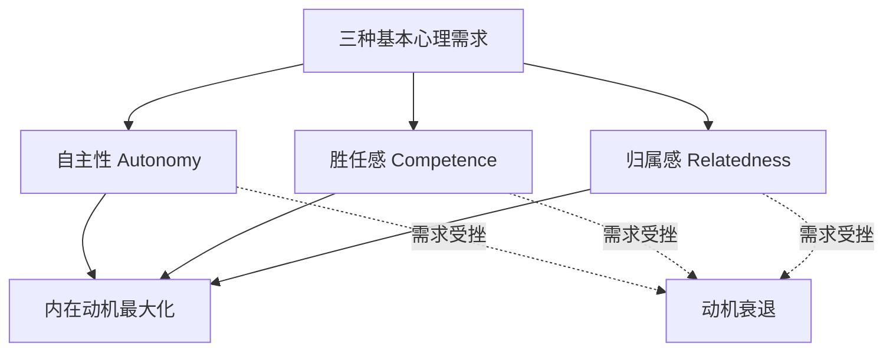
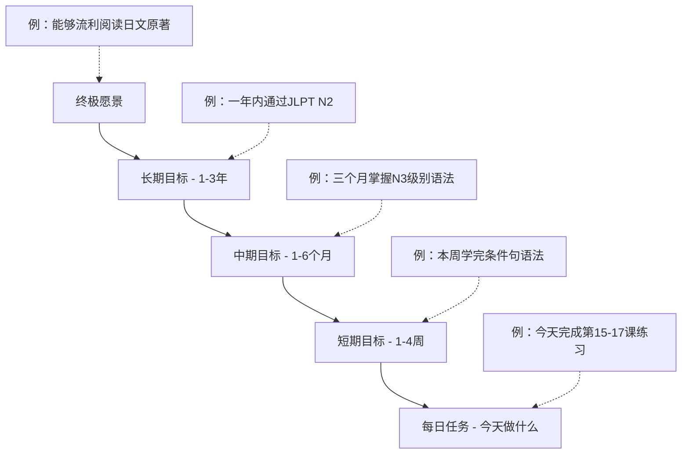
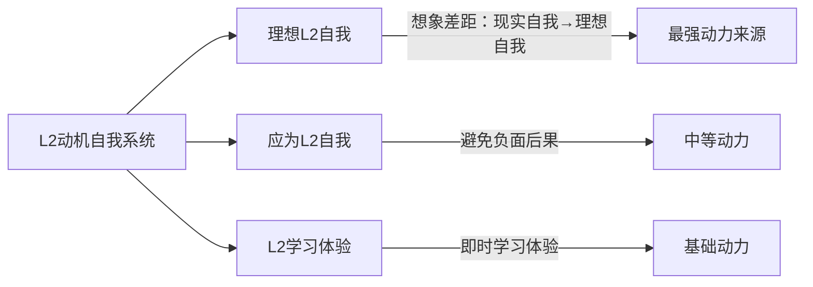
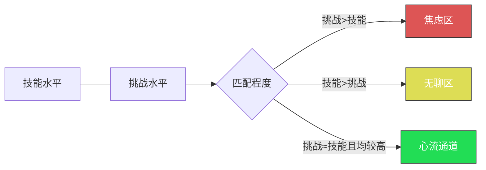
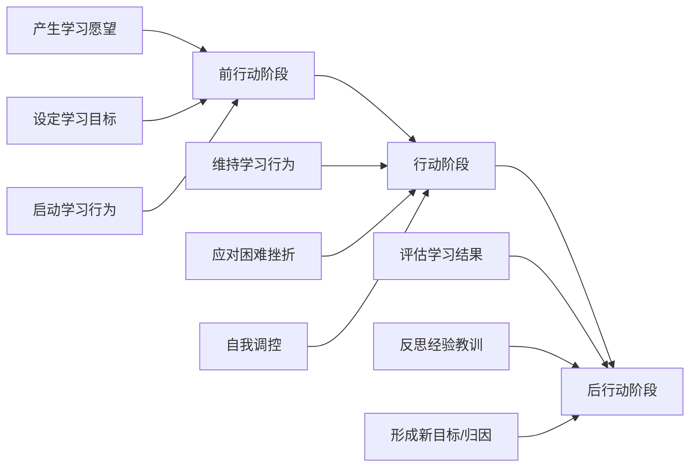
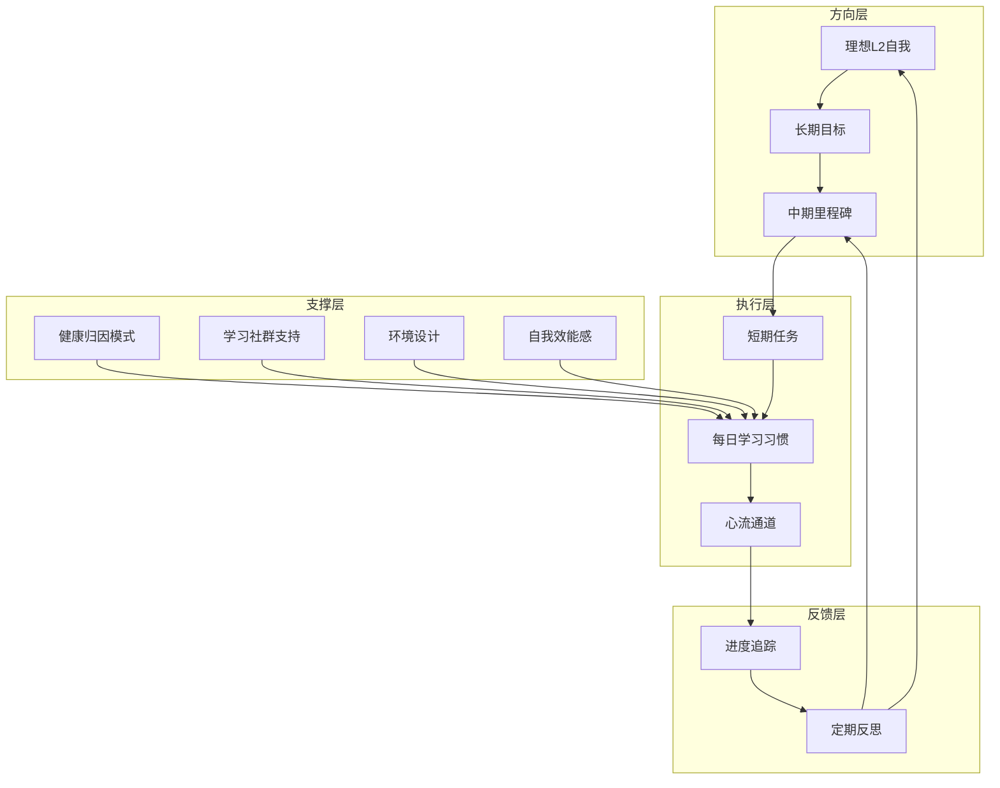

## 七、动机理论与语言学习

动机是语言学习中最核心的个体差异变量之一。大量实证研究表明，动机水平对语言学习成效的预测力甚至超过智力因素——一个动机强烈的普通学习者，往往比一个天赋出众但缺乏动力的学习者走得更远、走得更稳。本章系统梳理语言学习动机的主要理论流派，从经典到前沿，从理论到实操，帮助你理解"为什么想学"这个根本问题，并将其转化为持续行动的动力引擎。

### 7.1 经典动机理论：Gardner 的社会教育模型

#### 7.1.1 融入型动机与工具型动机

加拿大社会心理学家 Robert Gardner 从20世纪60年代开始研究第二语言习得动机，提出了影响深远的**社会教育模型（Socio-Educational Model）**。该模型将语言学习动机分为两种基本类型：

**融入型动机（Integrative Motivation）**：学习者对目标语言社群有真实的兴趣，希望与该社群成员交流、理解其文化，最终融入其中。例如：
- 因为深爱法国文学和哲学而学习法语
- 因为计划移民加拿大而学习英语/法语
- 因为希望与日本朋友用母语交流而学习日语

**工具型动机（Instrumental Motivation）**：将语言作为实现外部目标的工具，关注语言学习带来的实际利益。例如：
- 为了通过大学英语四六级考试获得学位
- 为了在职场晋升中外语能力加分
- 为了读懂专业领域的英文文献

#### 7.1.2 两种动机的效果对比

Gardner 和 Lambert 在蒙特利尔的系列研究中发现：

| 维度 | 融入型动机 | 工具型动机 |
|------|-----------|-----------|
| 学习深度 | 倾向于深层学习，关注语言的交际功能 | 倾向于表层学习，关注语言的知识点 |
| 口语表现 | 通常更优，因为主动寻求交际机会 | 可能较弱，缺乏真实交际需求 |
| 持久性 | 较强，兴趣驱动不依赖外部条件 | 可能减弱，目标达成后动力消失 |
| 文化理解 | 深入理解目标语言文化 | 了解有限，以实用为主 |
| 适用场景 | 目标语言环境中的长期学习者 | 特定考试或职业需求的学习者 |
| 高级阶段 | 优势明显，推动突破高级瓶颈 | 可能成为瓶颈，缺乏深入动力 |

但需要注意：**两种动机并非对立**。最有效的策略是将两者结合——既享受语言和文化的魅力，又设定具体的工具性目标作为里程碑。例如，既因为热爱日语文化而学习，又以通过JLPT N1考试作为阶段性目标。

#### 7.1.3 Gardner 模型的局限

Gardner 的理论在二语习得领域统治了近三十年，但也存在明显局限：
- 主要基于加拿大双语环境研究，在外语环境（如中国学生学英语）中的适用性存疑
- 融入型动机的概念在缺乏目标语言社群接触的环境中难以定义
- 低估了课堂环境和教学方法对动机的影响
- 对动机随时间变化的动态过程关注不足

这些局限催生了后续一系列理论的修正和发展。

### 7.2 自我决定理论（Self-Determination Theory）

#### 7.2.1 理论核心框架

德西和瑞安（Deci & Ryan, 1985, 2000）提出的自我决定理论（SDT）是当代动机心理学中最具影响力的理论之一。该理论认为人类有三种与生俱来的基本心理需求，这三种需求的满足程度决定了内在动机的强弱：

**自主性（Autonomy）**：感觉自己是行为的发起者，而非被外部力量操控。不是"独立"——你可以在接受指导的同时保持自主感，关键在于是否感到自愿。

**胜任感（Competence）**：感觉自己能够有效地与环境互动，能够完成挑战性任务。需要在"太简单→无聊"和"太难→挫败"之间找到平衡点。

**归属感（Relatedness）**：感觉自己与他人有联结，被关心和理解。语言作为社交工具，这一需求在语言学习中尤为重要。

#### 7.2.2 动机的自我决定连续体

SDT 进一步提出了动机的**连续体**概念，从无动机到内在动机形成了一个谱系：

无动机 → 外部调节 → 内摄调节 → 认同调节 → 整合调节 → 内在动机
←─── 外在动机 ───────────────────────────────────→ ←─ 内在 ─→
←─── 低自主性 ──────────────────────────────────────── 高自主性 ─→

各类型在语言学习中的典型表现：

| 动机类型 | 典型想法 | 自主程度 | 持久性 | 学习质量 |
|---------|---------|---------|--------|---------|
| 无动机 | "学英语有什么用？我不想学" | 无 | 无 | 无 |
| 外部调节 | "不学就会挂科/被骂" | 极低 | 目标消失即停 | 最低效 |
| 内摄调节 | "不学的话我会觉得自己很差劲" | 低 | 依赖自尊压力 | 中低 |
| 认同调节 | "英语对我职业发展确实重要" | 中 | 较强 | 中高 |
| 整合调节 | "英语是我身份的一部分" | 高 | 强 | 高 |
| 内在动机 | "我就是喜欢学语言的过程" | 最高 | 最强 | 最高 |

#### 7.2.3 SDT 在语言学习中的实操应用

满足三种心理需求的具体策略：

**满足自主性需求：**
- 在教材、方法、时间安排上保留选择空间。即使在课程框架内，也可以选择阅读自己感兴趣的英文博客而非指定教材
- 使用"邀请式"而非"命令式"的自我对话："我选择在这个阶段专注于听力"而不是"我必须每天听两小时"
- 定期审视自己的学习目标，确保它们源于自己的真实意愿而非外界压力
- 允许自己偶尔"放纵"——某天只看美剧不上语法课，并不意味着失败

**满足胜任感需求：**
- 严格控制材料难度，确保"可理解输入+适度挑战"（i+1原则的延伸）
- 将学习内容分层，用明确的进度标记（如词汇量测试、级别考试）让自己"看到"进步
- 设置"微成就"系统：连续学习7天、第一次听懂一首歌、第一次和外国人完整对话
- 记录学习日志，定期回看自己三个月前的水平，对比之下进步变得具体可见

**满足归属感需求：**
- 加入语言学习社群（线上：Reddit、Discord语言交换频道；线下：语言角、国际交流活动）
- 找到语言学习伙伴或"语言搭子"，建立定期交流机制
- 与母语者建立真实关系——不是机械的对话练习，而是真正的交流
- 参与目标语言社群的活动：日语学习者参加动漫展，英语学习者参加Toastmasters演讲俱乐部

#### 7.2.4 动机内化的阻碍因素

了解什么会破坏内在动机同样重要：

- **过度控制**：家长或教师强制要求每天学习X小时，剥夺自主感
- **频繁的外部评价**：每次学习都被打分、排名，将注意力从学习本身转移到成绩
- **不切实际的期望**：设定过高的目标，反复体验挫败，损害胜任感
- **孤立学习**：完全独自学习，缺乏归属感，容易感到孤独和无意义
- **过度监控**：学习App不断弹出提醒和统计数据，让人感到被"盯着"

### 7.3 目标设定理论（Goal-Setting Theory）

#### 7.3.1 SMART-ER 目标框架

洛克和拉萨姆（Locke & Latham, 1990, 2002）的目标设定理论是组织心理学中被验证最充分的动机理论之一。核心发现：**具体且有挑战性的目标比"尽力而为"目标平均提高10%-25%的绩效水平**。

在语言学习中，目标设定需要遵循SMART-ER原则（SMART的扩展版）：

| 原则 | 含义 | 反面案例 | 正面案例 |
|------|------|---------|---------|
| Specific（具体） | 明确定义学习什么、怎么学 | "提高英语" | "提高英语口语流利度" |
| Measurable（可衡量） | 有量化的评估标准 | "多背单词" | "掌握3000个高频词" |
| Achievable（可达成） | 基于当前水平设定可实现的目标 | "三个月达到母语水平" | "三个月通过四级" |
| Relevant（相关） | 与个人真实需求和兴趣相关 | 被迫学不需要的语言 | 选择与职业/兴趣相关的方向 |
| Time-bound（有时限） | 有明确的截止日期 | "以后再说" | "2026年12月前完成" |
| Evaluated（可评估） | 定期检查目标完成度 | 设定后不管 | 每两周评估一次进展 |
| Readjusted（可调整） | 根据反馈灵活调整目标 | 死板执行不调整 | 发现太难则降低或拆分目标 |

#### 7.3.2 目标层级系统

有效的目标设定不是单个目标，而是一个层级系统：

每个层级的功能：
- **终极愿景**：提供方向感和意义感，回答"为什么学"
- **长期目标**：将愿景转化为可执行的里程碑
- **中期目标**：提供阶段性反馈，允许调整方向
- **短期目标**：创造紧迫感和专注力
- **每日任务**：将一切落实到具体行动

#### 7.3.3 学习目标与表现目标

目标设定理论还有一个重要区分——**学习目标（mastery goals）** 与 **表现目标（performance goals）**：

| 类型 | 关注点 | 典型目标 | 在困难面前 |
|------|--------|---------|-----------|
| 学习目标 | 掌握技能本身 | "掌握虚拟语气的用法" | 更具韧性，倾向于坚持和寻求帮助 |
| 表现目标 | 展示能力、超越他人 | "考试成绩超过班级平均分" | 更容易放弃，回避困难以保护自尊 |

研究建议：**以学习目标为主、表现为辅**。考试可以作为检验手段，但内心的动力应该是"我想真正掌握这门语言"而非"我要考过别人"。

#### 7.3.4 常见的目标设定误区

- **目标过于宏大且缺乏拆解**：导致每次想到目标就感到压倒性的焦虑
- **只设目标不设过程**：目标是结果，但每天执行的是过程——需要"过程目标"（如"每天听30分钟播客"）
- **目标设定后一成不变**：随着水平提升和兴趣变化，目标应该动态调整
- **用他人的目标衡量自己**：别人的"一年过N1"可能有完全不同的学习背景和可用时间
- **忽视隐性目标**：除了显性的语言目标，还有"证明自己聪明""不辜负父母期望"等隐性目标——识别它们有助于理解自己的真实动机来源

### 7.4 Dörnyei 的 L2 动机自我系统

#### 7.4.1 理论背景与核心概念

匈牙利裔动机研究学者 Zoltán Dörnyei 在2005年提出了**L2 动机自我系统（L2 Motivational Self System）**，这是当代二语习得动机研究中最有影响力的理论框架。该理论综合了心理学中的"可能自我"理论和Gardner的社会心理学路径，提出了三个核心构念：

**理想L2自我（Ideal L2 Self）**：你希望成为的那个会说外语的"理想自己"的形象。这个形象越生动、越具体，其激发动力的效果就越强。例如："想象自己在国际会议上用流利的英语做报告的那个我"。

**应为L2自我（Ought-to L2 Self）**：你觉得自己"应该"成为的样子——受到外部压力、义务和社会期望的驱动。例如："我应该通过六级考试，否则拿不到学位"。

**L2学习体验（L2 Learning Experience）**：与当前学习环境直接相关的动机因素——教师、教材、课堂氛围、学习社群等。

#### 7.4.2 构建理想L2自我的实操方法

理想L2自我是该理论中最具实践价值的概念。以下是系统构建理想L2自我的具体方法：

**第一步：视觉化练习**
- 闭上眼睛，详细想象一年后/三年后使用外语的具体场景：你在做什么？和谁在一起？周围环境是什么样的？你的感受如何？
- 越具体越好：不是"流利地说英语"，而是"在纽约的咖啡馆里和朋友用英语讨论电影，对方完全没有意识到你是外国人"
- 制作"愿景板"（vision board）：收集代表理想L2自我的图片，放在每天能看到的地方

**第二步：缩小想象差距**
- 列出"现在的我"和"理想的我"之间的具体差距
- 将差距转化为可执行的学习任务
- 每完成一项学习任务，提醒自己"这让我离理想的自己更近了一步"

**第三步：强化理想自我**
- 写一封"未来自我"的信：描述你达到目标后的感受和经历
- 定期进行"如果我不学"的反事实思维：想象放弃学习后一年的生活状态——这种"避免损失"的心理同样具有强大动力
- 找到一个"榜样人物"——可以是公众人物，也可以是身边的人——他们的外语能力就是你想达到的状态

#### 7.4.3 三种动机源的协同

最理想的状态是三种动机源协同运作：
- **理想L2自我**提供长远方向和意义感
- **应为L2自我**提供阶段性紧迫感（如考试截止日期）
- **L2学习体验**提供日常的学习乐趣和满足感

当只有"应为L2自我"在驱动时（纯粹为了考试、为了不被批评），学习体验容易痛苦且不可持续。当理想自我和学习体验都很弱时，是最危险的信号——这通常意味着学习者即将放弃。

### 7.5 归因理论与语言学习

#### 7.5.1 Weiner 的归因理论

心理学家 Bernard Weiner 提出，人们对成功或失败的**归因方式**会深刻影响后续的动机水平。归因可以从三个维度来分析：

| 归因 | 内外维度 | 稳定性 | 可控性 | 对后续动机的影响 |
|------|---------|--------|--------|----------------|
| 能力 | 内部 | 稳定 | 不可控 | 失败→"我不擅长语言"→习得性无助 |
| 努力 | 内部 | 不稳定 | 可控 | 失败→"我需要更努力"→积极调整 |
| 任务难度 | 外部 | 稳定 | 不可控 | 失败→"这个太难了"→换材料 |
| 运气 | 外部 | 不稳定 | 不可控 | 成功→"只是运气好"→不稳定 |
| 学习方法 | 内部 | 不稳定 | 可控 | 失败→"方法不对"→寻找新方法 |
| 身体/情绪状态 | 内部 | 不稳定 | 不可控 | 失败→"今天状态不好"→短暂归因 |

#### 7.5.2 健康归因 vs. 不健康归因

**不健康的归因模式（需要纠正）：**
- "我没有语言天赋"（内部、稳定、不可控）→ 习得性无助，放弃努力
- "中文环境学不好英语是正常的"（外部、稳定、不可控）→ 宿命论，不采取行动
- "这次考试运气好而已"（外部、不稳定、不可控）→ 即使成功也无法建立信心

**健康的归因模式（需要培养）：**
- "这次失败是因为我准备不充分"（内部、不稳定、可控）→ 可以通过增加投入来改变
- "这个方法不适合我，换一个试试"（内部、不稳定、可控）→ 方法是可以调整的
- "我已经比三个月前进步了很多"（内部、稳定、可控）→ 肯定积累的力量

#### 7.5.3 归因再训练策略

当你发现自己陷入不健康的归因模式时，可以使用以下策略：

1. **收集反证**：如果你认为"我没有语言天赋"，去搜集你曾经学好任何一项技能的证据——语言学习能力和你的数学能力、运动能力没有本质联系
2. **归因转换练习**：每次遇到挫折，写下你最初的想法，然后有意识地将其转换为更健康的归因。例如："我不是学语言的料"→"我目前的方法效率不高，我需要调整学习策略"
3. **关注可控因素**：将注意力从"我不够聪明"转移到"我可以投入更多时间""我可以找到更好的方法"——因为后者是你能改变的
4. **设立归因日记**：每天记录一个学习事件和你的归因，一周后回顾，识别自己的归因模式

### 7.6 心流理论与语言学习

#### 7.6.1 Csikszentmihalyi 的心流理论

心理学家 Mihaly Csikszentmihalyi 提出的**心流（Flow）**理论描述了一种最佳体验状态——当人完全沉浸在一项活动中时，时间感消失，自我意识淡化，体验到深度的满足和愉悦。

进入心流的核心条件：

心流的九个特征（Csikszentmihalyi, 1990）：
1. 明确的目标——清楚知道当前在做什么
2. 即时反馈——立刻知道做得好不好
3. 技能与挑战的平衡——不太容易也不太难
4. 行动与意识的融合——"自然而然"地行动
5. 注意力高度集中——排除无关干扰
6. 意识控制感——感觉自己掌控局面
7. 自我意识消失——不再担心别人怎么看
8. 时间感扭曲——"不知不觉两小时过去了"
9. 内在奖励——活动本身就是奖励

#### 7.6.2 在语言学习中创造心流

| 心流条件 | 语言学习中的对应策略 |
|---------|-------------------|
| 明确的目标 | 每次学习都有清晰的任务："用今天学的10个词写一段话" |
| 即时反馈 | 使用有即时纠错功能的工具，如对话练习后立即查看正确表达 |
| 挑战匹配 | 选择难度适中的材料——生词率控制在5%-15%之间 |
| 注意力集中 | 创造无干扰环境，关闭通知，使用番茄钟 |
| 自主选择 | 选择自己感兴趣的学习内容和方式 |
| 沉浸体验 | 使用故事驱动的学习材料（小说、电视剧、游戏）而非枯燥的语法练习 |

具体到不同学习活动的心流设计：

- **听力**：选择略高于当前水平的播客或视频，带字幕→去字幕→复述，逐步提升挑战
- **口语**：从话题卡随机抽取话题进行2分钟自由表达，录音后自评，设置计时增加紧迫感
- **阅读**：选择稍有难度但可读的小说章节，边读边标记生词，一章结束后测验自己
- **写作**：限时10分钟自由写作，之后检查语法和用词，对比一个月前的写作品质

#### 7.6.3 心流与长期坚持

心流体验不仅能提高单次学习的效率，更是长期坚持的关键。研究发现，能够经常进入心流状态的学习者，其学习持续性是普通学习者的2-3倍。原因是心流将学习从"需要坚持"变成了"想要继续"——内在动机的最高形式。

### 7.7 动机的动态变化与维持策略

#### 7.7.1 Dörnyei 动机过程模型

Dörnyei 和 Ottó（1998）提出的动机过程模型将语言学习动机分为三个时序阶段：

**前行动阶段**的关键任务：明确学习理由、形成具体学习意图、选择启动时机。很多学习者的问题在于跳过了这个阶段——没有想清楚"为什么学"就开始学，导致遇到第一个困难就动摇。

**行动阶段**的关键任务：保持专注、管理注意力、应对分心和拖延、维持自信心。这是最需要"策略"的阶段，也是大多数人最容易失败的阶段。

**后行动阶段**的关键任务：评估结果、反思过程、调整策略、形成下一步计划。缺乏反思的学习是"机械重复"——同样的错误会反复出现。

#### 7.7.2 动机低谷的应对策略

语言学习中存在几个典型的"动机低谷期"：

**低谷一：初学后的"幻灭期"（通常在第1-3个月）**
- 特征：新鲜感消退，发现自己远未达到目标，学习变得枯燥
- 对策：降低短期期望，回顾已取得的进步，更换学习材料和方法，找到学习伙伴

**低谷二：中级"高原期"（通常在6-18个月）**
- 特征：进步速度明显放缓，感觉"怎么学都那样"，产生自我怀疑
- 对策：接受进步曲线的自然变化，尝试新的学习方式（如从教材转向真实材料），设定新的挑战性目标

**低谷三：高级"瓶颈期"（通常在2-3年后）**
- 特征：日常交流没问题但高级表达力不从心，感觉"够用了但不够好"
- 对策：找到新的使用场景（如写作、演讲、专业领域），与更高水平的学习者或母语者深入交流，设定更有雄心的目标

#### 7.7.3 动机维持的日常策略清单

以下是经过实证研究支持的动机维持策略，按类型分类：

**环境设计类：**
- 将外语融入日常环境：手机系统语言、社交媒体、新闻订阅
- 减少学习的"启动成本"：材料触手可及，学习流程标准化
- 创造"不得不学"的场景：报名考试、承诺公开写作、加入必须打卡的社群

**自我奖励类：**
- 设置里程碑奖励：达到1000词汇量奖励自己一本书，通过考试奖励一次旅行
- 记录"连胜天数"（streak）：连续学习的天数本身成为奖励
- 完成困难任务后给自己充分的休息和庆祝

**社交支持类：**
- 找到"学习搭档"：互相监督、分享进度、交流心得
- 加入学习社群：参与讨论、分享笔记、互相解答问题
- 公开承诺：在社交媒体上宣布学习目标，利用社会压力

**认知策略类：**
- 定期回顾学习"初心"：重新阅读当初写下的学习理由
- 使用"如果-那么"计划：预先设定应对困难的反应，如"如果我今天不想学，那么我至少听10分钟播客"
- 采用"两天规则"：绝不连续两天不学习——允许偶尔休息，但不允许连续放弃

### 7.8 特殊情境下的动机分析

#### 7.8.1 儿童与青少年的语言学习动机

儿童和青少年的动机形成机制与成人有显著差异：

| 年龄段 | 主要动机来源 | 关键特征 | 教育者/家长策略 |
|--------|------------|---------|---------------|
| 3-6岁 | 游戏、故事、歌曲 | 天然好奇心，无明确目标感 | 通过趣味活动自然接触，绝不施压 |
| 7-12岁 | 成就感、同伴认可 | 开始有竞争意识和自我评价 | 提供适度挑战，肯定进步，创造使用机会 |
| 13-18岁 | 身份认同、兴趣关联 | 叛逆期可能抵触"被安排"的学习 | 尊重自主选择，将语言与青少年文化（音乐、游戏、社交）结合 |

#### 7.8.2 职场语言学习动机

成人职场语言学习有其独特的动机特征：
- 通常由**工具型动机**主导，但可以通过与职业身份认同结合提升为**整合型动机**
- 最大的动机挑战是**时间冲突**：工作、家庭、社交已经占用大量时间和精力
- 有效策略：将语言学习与工作直接结合（用外语处理邮件、阅读行业报告），实现"学习即工作，工作即学习"

#### 7.8.3 退休后的语言学习动机

老年人学习语言的动机往往最为"纯粹"——主要是兴趣驱动和认知保持。研究发现，退休后学习语言有助于延缓认知衰退，这种"认知健康"的期望本身就是强大的动机来源。策略上应强调享受过程而非追求效率，降低考试压力，增加社交学习成分。

### 7.9 动机评估：了解你的动机现状

#### 7.9.1 自我诊断清单

用以下问题快速评估你的动机状态。每项1-5分（1=完全不同意，5=完全同意）：

**理想L2自我维度：**
- 我有清晰的"会说外语后的自己"的形象
- 那个形象让我感到兴奋和向往
- 我能具体描述那个自己在做什么、说什么

**应为L2自我维度：**
- 我感到如果不学外语会有不好的后果
- 外语学习主要是为了满足外部要求
- 如果没有人要求，我可能不会主动学

**学习体验维度：**
- 我觉得学习外语的过程是有趣的
- 我喜欢当前的学习材料和方法
- 学习时我经常感到时间过得很快

**自我效能维度：**
- 我相信自己有能力学好外语
- 我能从失败中恢复并继续学习
- 遇到困难时我会寻找解决方法而非放弃

得分解读：
- 理想L2自我得分高 → 长期动力充足
- 应为L2自我得分远高于其他 → 动力来源过于依赖外部，需要加强内在动机建设
- 学习体验得分低 → 需要更换学习材料或方法
- 自我效能得分低 → 需要从简单任务开始重建信心，调整归因模式

#### 7.9.2 动机追踪日志模板

建议每周填写以下追踪日志，连续记录4-8周以发现自己的动机模式：

日期：________
本周学习时长：____小时
动机水平（1-10）：____
主要动机来源：□兴趣 □考试 □工作 □社交 □习惯 □其他____
本周最大成就：____________________
本周最大困难：____________________
遇到困难时的想法：____________________
应对方式：____________________
下周调整计划：____________________

### 7.10 常见误区与纠正

**误区一："只要有足够的意志力就能坚持学习"**
纠正：意志力是有限资源。真正有效的动机维持依赖于环境设计、习惯养成和内在兴趣，而非单纯的"咬牙坚持"。将学习变成习惯（每天固定时间、固定流程）比依赖意志力可靠得多。

**误区二："我天生就不是学语言的料"**
纠正：没有证据表明语言学习能力是固定的天赋。双胞胎研究显示，基因对语言学习的影响远小于学习方法、投入时间和学习环境。归因于"天赋"是一种逃避——它给了你一个停止努力的借口。

**误区三："外在动机是不好的，只有内在动机才值得追求"**
纠正：外在动机本身不是问题，问题在于**只有**外在动机。考试、工作、证书等外在目标可以提供有效的阶段性推动。关键是不要让外在动机成为唯一的驱动力，同时培养对语言和文化本身的兴趣。

**误区四："动机是静态的——有了就一直有"**
纠正：动机是波动的，几乎没有人能始终保持高涨的学习热情。接受动机的波动性，在低谷期使用预设的应对策略（如"两天规则"），比期望永远保持激情更现实、更有效。

**误区五："别人的方法有效所以我也应该用"**
纠正：动机来源是高度个人化的。有人因追星学韩语，有人因读论文学英语，有人因旅行学法语——没有"正确"的动机来源，只有"你的"动机来源。找到对你个人有意义的学习理由，比模仿他人的方法更重要。

**误区六："学习应该总是有趣的，如果无聊说明方法不对"**
纠正：语言学习中总有一些"必要但不有趣"的环节——语法规则的记忆、发音的反复练习、词汇的刻意积累。心流状态是理想目标，但不必每次都达到。接受学习中存在"不那么有趣"的部分，用目标和习惯来推动它们的完成。

### 7.11 进阶：构建个人动机系统

将本章的理论整合为一个可操作的个人动机系统：

**构建步骤：**

1. **明确方向**：通过视觉化练习构建你的理想L2自我，写下具体的长期目标
2. **拆解执行**：将长期目标拆解为季度里程碑→月度任务→每周计划→每日习惯
3. **建设支撑**：识别你的主要动机来源，建立归因日记，设计学习环境，找到学习社群
4. **建立反馈**：每周填写动机追踪日志，每月回顾和调整目标，每季度重新审视理想自我
5. **动态调整**：根据追踪数据调整策略——如果学习体验分数持续下降，更换方法；如果应为自我分数过高，增加兴趣驱动的学习内容

这个系统不是一劳永逸的——它需要定期维护和调整，就像你的学习计划一样。但它提供了一个结构化的框架，让你不再"凭感觉"管理动机，而是有意识、有策略地维持和增强学习动力。

***
