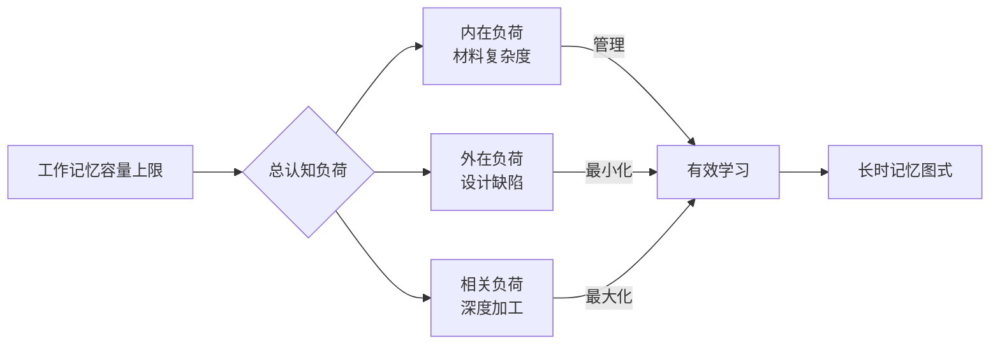

## 八、认知负荷理论与语言学习设计

很多语言学习者都有过这种体验：明明很努力地背单词、学语法，但脑子像一团浆糊，学了后面忘了前面，越学越焦虑。这不是你不够聪明，而是你的大脑在发出"过载"信号。认知负荷理论（Cognitive Load Theory，简称 CLT）正是解释这一现象的核心框架，也是科学设计语言学习方案的底层逻辑。

本章将从理论根基出发，逐层展开认知负荷的三种类型，然后给出可直接落地的学习设计策略，帮助你让每一分脑力都花在刀刃上。

---

### 8.1 理论根基：工作记忆的硬约束

#### 8.1.1 工作记忆模型

认知负荷理论的心理学基础是 Baddeley 和 Hitch 提出的工作记忆模型（Working Memory Model）。工作记忆不是单一的存储空间，而是一个由多个组件构成的系统：

| 组件 | 功能 | 语言学习中的作用 |
|------|------|-----------------|
| 语音环路（Phonological Loop） | 暂时存储和复述语音信息 | 处理发音、听力输入、默读 |
| 视空间画板（Visuospatial Sketchpad） | 处理视觉和空间信息 | 阅读文字、看图表、理解书写结构 |
| 中央执行器（Central Executive） | 注意力控制、任务切换 | 在语法分析和意义理解之间分配注意 |
| 情景缓冲区（Episodic Buffer） | 整合多模态信息 | 将语音、图像、语义整合为完整理解 |

关键限制：工作记忆的容量极其有限。Miller（1956）的经典研究表明，工作记忆一次只能处理 7±2 个信息块（chunk）。更近期的研究（Cowan，2001）将这个数字修正为 **4±1 个信息块**。这意味着，如果你试图同时学习超过 4-5 个全新的语言元素，大脑就会开始"丢帧"。

#### 8.1.2 从工作记忆到长时记忆：图式的桥梁

工作记忆的限制之所以不是致命的，是因为**长时记忆（Long-term Memory）**的容量几乎是无限的。语言学习的本质过程就是：将工作记忆中处理的信息编码为长时记忆中的**图式（schema）**。

图式是什么？它是知识在大脑中的组织结构。举个例子：

- 初学者看到 "I eat an apple"，需要逐词分析：I 是主语，eat 是动词，an apple 是宾语——这消耗了 3-4 个工作记忆槽位。
- 熟练者看到同样的句子，直接识别为"[主语] + [及物动词] + [宾语]"的 SVO 结构——只消耗 1 个工作记忆槽位。

这就是图式的力量：它把多个信息元素打包成一个单元，让工作记忆的"带宽"得到倍增。Sweller（1988）正是基于这一机制提出了认知负荷理论——教学设计的核心目标就是**促进图式的构建和自动化**。

#### 8.1.3 认知负荷的计算公式

Sweller 将总认知负荷定义为三种负荷的叠加：

总认知负荷 = 内在认知负荷 + 外在认知负荷 + 相关认知负荷

由于工作记忆容量是硬上限，当总负荷超过容量时，学习就会崩溃。因此，学习设计的核心策略是：

1. **最小化**外在认知负荷（它是浪费）
2. **管理**内在认知负荷（它是必要但可控的）
3. **最大化**相关认知负荷（它是有效学习的来源）

---

### 8.2 三种认知负荷的深度解析

#### 8.2.1 内在认知负荷（Intrinsic Cognitive Load）

内在认知负荷由学习材料本身的**元素交互性（element interactivity）**决定。元素交互性越高，内在负荷越大。

在语言学习中，元素交互性的典型表现：

| 语言元素 | 低交互性（低负荷） | 高交互性（高负荷） |
|---------|------------------|------------------|
| 词汇 | 孤立的名词（apple, book） | 需要搭配的动词短语（put up with） |
| 语法 | 简单句（I run） | 虚拟语气嵌套从句（If I had known that he would have...） |
| 发音 | 单个音素（/p/, /b/） | 连读+弱读+语调的综合处理 |
| 写作 | 填词造句 | 学术论文中的论证结构+引用规范+风格统一 |

**关键洞察**：内在负荷不完全取决于材料本身，还取决于学习者已有的图式。同样一份材料，对初学者来说是高负荷，对进阶者来说可能只是低负荷。这就是为什么"跳级学习"往往事倍功半——你试图让工作记忆处理超出其能力的元素交互。

**管理内在负荷的原理**：

- **分离元素法（Element Immethod）**：先单独教授每个元素，再进行整合。例如，先分别练时态和语态，再组合成被动语态的过去完成时。
- **逆向渐进法（Reverse Fading）**：先展示完整的问题解决过程，再逐步撤去提示，让学习者独立完成。
- **序列化呈现**：不要一次性呈现所有新规则，而是按依赖关系逐个引入。

#### 8.2.2 外在认知负荷（Extraneous Cognitive Load）

外在认知负荷完全是由**不良的教学设计**造成的。它不促进学习，纯粹是对认知资源的浪费。在语言学习中，外在负荷的常见来源令人触目惊心：

**来源一：冗余效应（Redundancy Effect）**

当你同时呈现相同信息的两种形式，而学习者需要整合它们时，反而增加了负荷。例如：
- 听力材料同时显示逐字稿——学习者需要边听边对照，反而分散了注意力
- PPT 上放满了讲者口头已经说过的文字——两种信息源互相干扰

**来源二：分散注意力效应（Split-attention Effect）**

当学习者需要在多个信息源之间来回切换注意力时，产生额外负荷。例如：
- 语法书把例句放在一页，解释放在另一页
- 教材把生词表放在课文后面，需要频繁翻页
- 视频课老师在说话，屏幕上的文字却完全不同

**来源三：冗余图文效应**

图片+文字的组合如果设计不当，反而不如纯文字。关键原则是：文字应该直接标注在图片的相关位置附近，而不是放在单独的文本框中。

**来源四：无关信息干扰**

教材中与学习目标无关的装饰性图片、花哨的背景、不必要的动画，都会消耗宝贵的认知资源。

#### 8.2.3 相关认知负荷（Germane Cognitive Load）

相关认知负荷是学习者**主动投入**用于构建和强化图式的认知努力。这是唯一"有用"的负荷。

增加相关认知负荷的方式：
- **精细化编码**：将新信息与已有知识建立多重联系。例如，学习法语 "maison"（房子）时，不仅记住中文翻译，还联想英语 "mansion"（豪宅，同源词）、想象一个具体的法国房子的画面。
- **自我解释**：学习语法规则后，尝试用自己的话解释为什么规则是这样。
- **对比分析**：将目标语言的结构与母语进行系统对比，识别差异点。
- **生成性学习**：不是被动接受知识，而是主动创造产出（造句、写作、对话）。

**重要区分**：相关认知负荷和外在认知负荷都会增加学习者的"负担感"，但效果截然不同。外在负荷带来的负担感是无效的（学习效果差），相关负荷带来的负担感是有效的（学习效果好）。不能简单地追求"轻松学习"——有时候觉得吃力恰恰说明大脑在构建新图式。

---

### 8.3 语言学习设计的八大策略

基于认知负荷理论，以下是经过验证的语言学习设计策略：

#### 策略一：分块渐进（Chunking & Sequencing）

**原理**：将高元素交互性的材料分解为低交互性的子单元，逐步整合。

**实操方法**：

以学习日语动词变形为例，不要一次性教"て形"的所有规则：

第一步：只教规则变化（書く→書いて、読む→読んで）
第二步：加入特殊变化（する→して、来る→来て）
第三步：加入与敬体的组合（書いています）
第四步：加入实际场景运用（请求、许可、进行体）

每一步都确保学习者在进入下一步之前，前一步已经形成自动化图式。

#### 策略二：先行组织者（Advance Organizer）

**原理**：在呈现新内容之前，提供一个高层次的框架，帮助学习者将新信息"挂"到已有的知识结构上。

**实操方法**：

学习一个新的语法主题前，先画出结构图：

"西班牙语条件式"的先行组织者：
┌─ 条件式 = 动词词根 + 特殊词尾
├─ 用途一：表达假设（如果...就会...）
├─ 用途二：表达礼貌请求
└─ 用途三：表达愿望
    → 这和英语的 would 用法类似

有了这个框架，学习者在接触具体规则时，知道每条规则应该归入哪个类别，认知负荷大幅降低。

#### 策略三：worked examples 效应

**原理**：Sweller 最早发现的效应之一——对于新手来说，研究详细的问题解决步骤（worked example）比自己尝试解决问题更有效。

**语言学习中的应用**：

不要一上来就让初学者造句。先给他们看"造句过程的完整示范"：

目标：用"尽管...但是..."造句

步骤 1：确定让步的事实 → 天气很冷
步骤 2：确定与之矛盾的结果 → 他穿得很薄
步骤 3：套用句式 → 尽管天气很冷，但是他穿得很薄。
步骤 4：检查语法正确性 ✓

变式练习：尽管（    ），但是（    ）。

当学习者积累了足够的 worked examples 后，再逐步撤去脚手架（fading），让他们独立完成。

#### 策略四：多模态互补呈现

**原理**：Mayer 的多媒体学习认知理论（Cognitive Theory of Multimedia Learning）指出，视觉通道和听觉通道可以并行处理信息，有效倍增工作记忆的"带宽"。

**关键原则**：
- 语音 + 图像 > 语音 + 文字（避免双通道文字竞争）
- 图像上的文字标注应该紧邻相关区域（避免分散注意力）
- 动画 + 解说 > 动画 + 字幕（同一个视觉通道不要塞两种信息）

**实操方法**：

学习身体部位词汇时：
- ✅ 语音说"左手"的同时，图片上左手位置出现高亮标注
- ❌ 语音说"左手"的同时，屏幕上显示一段文字解释

#### 策略五：变式练习（Variability of Practice）

**原理**：在不同情境下练习同一图式，有助于形成更灵活、更可迁移的知识结构。

**实操方法**：

学习英语过去时态，不要只做填空练习。要混合以下练习类型：
1. 填空：Yesterday I ___ (go) to school.
2. 改错：He goed to the store yesterday.
3. 情境选择：下面哪个句子用过去时是正确的？
4. 自由写作：描述你昨天做了什么。
5. 听力判断：听一段对话，标记所有过去时态的动词。
6. 口语复述：用过去时复述一个故事。

每种变式激活图式的不同侧面，使图式更加稳固和灵活。

#### 策略六：分阶段释放复杂度

**原理**：Johnson（2004）提出的"分阶段学习"（staged learning）将语言输入的复杂度分阶段释放，确保每个阶段的内在负荷不超过学习者当前的工作记忆容量。

**框架**：

| 阶段 | 输入特征 | 认知负荷策略 |
|------|---------|-------------|
| 接触期 | 短句、高频词、慢速、有视觉支持 | 最低内在负荷，建立基础图式 |
| 发展期 | 中等长度句子、正常语速、上下文丰富 | 适度增加负荷，扩展图式范围 |
| 巩固期 | 长段落、自然语速、多种口音 | 接近真实负荷，促进图式自动化 |
| 精通期 | 原生材料、方言俚语、即兴对话 | 满负荷运作，图式高度自动化 |

#### 策略七：减少切换成本（Task-switching Cost）

**原理**：任务切换本身会消耗认知资源（Monsell，2003）。频繁在不同语言技能之间切换（听→读→写→说），每次切换都有"启动成本"。

**实操方法**：
- 不要在一小时的学习中混杂 4 种技能。建议按"技能块"安排：前 30 分钟专注听力，后 30 分钟专注口语。
- 同一技能块内，练习材料应保持主题一致，减少上下文切换。
- 如果必须混合技能，让输入技能（听/读）在前，输出技能（说/写）在后，利用输入激活的图式支撑输出。

#### 策略八：利用自动化释放工作记忆

**原理**：当底层技能实现自动化后，它们不再占用工作记忆资源，从而为更高层的任务释放"带宽"。

这是语言学习中最重要的长期策略。它解释了为什么"先练基础，再建高楼"是唯一正确的路径：

发音自动化 → 释放工作记忆给听力理解
基础词汇自动化 → 释放工作记忆给语法分析
简单句型自动化 → 释放工作记忆给复杂句构建
日常表达自动化 → 释放工作记忆给即兴交流

**如何促进自动化**：大量重复，但不是机械重复——是有变化的、在不同语境中的重复。间隔重复系统（如 Anki）在这方面特别有效。

---

### 8.4 常见误区与纠正

#### 误区一："沉浸式学习 = 把自己扔进原生材料中"

很多学习者认为，直接听原版播客、看原版电影就是最好的学习方式。从认知负荷角度看，这是典型的**内在负荷超载**。初学者面对原生材料，每个句子都有 10+ 个未知元素，工作记忆瞬间崩溃。

**纠正**：使用"可理解输入"（Krashen 的 i+1 原则），确保材料中 95% 以上是已知内容，只有 5% 是新内容。使用分级读物、慢速新闻、教材配套音频等可控材料。

#### 误区二："学得越多越好"

一次性学习 50 个新单词、3 条语法规则、一套发音规则——这不叫高效，这叫认知自杀。工作记忆的限制是硬性的，超过容量的信息会被直接丢弃。

**纠正**：每次学习新内容控制在 3-5 个信息块以内。宁可少学，但学扎实。

#### 误区三："笔记记得越详细越好"

很多学习者把笔记当成抄写，恨不得把所有内容都写下来。这种行为本身消耗大量认知资源（书写占用语音环路和视空间画板），反而减少了用于理解的资源。

**纠正**：用关键词和思维导图代替逐字记录。在课堂/学习过程中以听和理解为主，课后再整理笔记。

#### 误区四："多媒体 = 更好的学习"

看到教材有视频、音频、互动练习就觉得是好教材。但如果多媒体元素设计不当（分散注意力、冗余、无关装饰），反而比纯文字更糟糕。

**纠正**：评估多媒体材料是否遵循了 Mayer 的多媒体学习原则。如果视频让你需要同时看字幕、看画面、听声音，这可能不是好设计。

#### 误区五："觉得学得轻松 = 学得好"

认知负荷理论告诉我们，相关认知负荷是有效学习的来源，而相关负荷会带来"有收获的困难"（desirable difficulty，Bjork，1994）。学得太轻松可能意味着你在用低效的策略（如反复抄写而不是主动回忆）。

**纠正**：接受一定程度的困难感。测试自己、主动回忆、用新学的知识造句——这些活动会更"费脑子"，但学习效果远好于被动复习。

---

### 8.5 认知负荷评估与自测工具

学习者如何判断自己的认知负荷是否合理？以下是几个实用的自测指标：

**主观评估**：NASA 任务负荷指数（NASA-TLX）的简化版

| 维度 | 1分（轻松） | 5分（极重） |
|------|-----------|-----------|
| 脑力需求 | 不需要动脑 | 需要全神贯注 |
| 时间压力 | 从容不迫 | 赶不上节奏 |
| 努力程度 | 不费力 | 拼尽全力 |
| 挫败感 | 没有挫败 | 非常挫败 |

评分建议：
- 总分 4-8：负荷偏低，可以增加难度或加速
- 总分 9-14：负荷适中，继续当前节奏
- 总分 15-20：负荷过高，需要降低难度或放慢速度

**客观行为指标**：

以下信号提示你正在经历认知过载：
- 读同一段文字 3 遍仍然不理解
- 听力材料听起来像"一团噪音"
- 做练习时频繁犯本来不会犯的低级错误
- 学习后完全记不住刚才学了什么
- 出现焦虑、烦躁、想放弃的情绪

---

### 8.6 工具与资源

| 工具 | 类型 | 认知负荷管理功能 |
|------|------|-----------------|
| Anki | 间隔重复 | 自动调节复习间隔，将重复分散到时间维度，避免一次性超载 |
| LingQ | 分级阅读 | 标注已知/未知词汇，自动调整材料难度 |
| Readlang | 浏览器扩展 | 即时翻译生词，减少因查词导致的注意力分散 |
| Language Reactor | 视频学习 | 双语字幕+逐句播放，可控的信息呈现节奏 |
| Clozemaster | 语境填空 | 在句子语境中学习词汇，避免孤立记忆的低效 |

---

### 8.7 进阶：认知负荷理论的前沿发展

#### 8.7.1 专家反转效应（Expertise Reversal Effect）

Sweller 等人（2011）发现了一个重要反转：对新手有效的策略（如详细的 worked examples），对专家反而有害——专家会因为被迫处理冗余信息而增加外在负荷。

**语言学习中的体现**：
- 初学者需要详细的语法讲解和例句 → 有益
- 高级学习者再看同样的详细讲解 → 冗余，浪费时间
- 高级学习者应该使用更精简的参考材料，直接在实践中学习

这意味着**学习策略必须随着水平提升而调整**。没有一种策略适合所有阶段。

#### 8.7.2 交互效应（Imagination Effect）

对于已有一定图式的学习者，让他们**想象**某个概念的解释（而非被动阅读）反而更有效。这与"生成效应"（generation effect）一致——主动创造比被动接受更能巩固记忆。

**应用**：中级学习者在复习语法时，不要重新阅读语法书，而是闭上眼睛，试着"在脑中重现"规则和例句。

#### 8.7.3 元素孤立效应（Isolated Interacting Elements Effect）

当元素交互性很高时，先单独呈现每个元素（即使它们在实际使用中是不可分离的），等学习者掌握每个单独元素后，再进行整合。这在语言学习中尤为实用——比如先分别练中文的声调和拼音，再合并为带声调的拼音朗读。

#### 8.7.4 认知负荷与情绪的交互

最新研究表明，负面情绪（焦虑、挫败感）本身会占用工作记忆资源，从而增加有效认知负荷。这在语言学习中尤为重要——**语言焦虑（Language Anxiety）**不仅影响心理状态，还直接减少可用于学习的认知资源。

**应对策略**：
- 选择略低于当前水平的材料开始（降低焦虑源）
- 在安全的环境中练习（如与 AI 对话而非直接面对真人）
- 使用正念呼吸等技巧在学习前清空工作记忆中的焦虑信息

---

### 8.8 综合案例：用认知负荷理论设计一周学习计划

以下是一个英语中级学习者（B1 水平）的一周学习计划设计，体现认知负荷理论的完整应用：

| 时间 | 活动 | 认知负荷设计要点 |
|------|------|-----------------|
| 周一 30min | 语法：虚拟语气基础（worked examples 为主） | 分离元素法：先只教 "if I were..." 句型 |
| 周二 30min | 听力：对应主题的分级听力材料 | 可理解输入，语速可调，带文本支持 |
| 周三 30min | 词汇：用间隔重复复习+学习 5 个新词 | 控制新词数量在 5 个以内（4±1 原则） |
| 周四 30min | 口语：用虚拟语气造句（变式练习） | 多变式练习，从填空到自由表达 |
| 周五 30min | 阅读：含虚拟语气的文章（分级读物） | 先行组织者：提前预告文章中的语法结构 |
| 周六 30min | 写作：写一段使用虚拟语气的短文 | 输出驱动，整合已学的语法和词汇 |
| 周日 | 休息或轻度复习（Anki） | 让长时记忆巩固过程不被打断 |

**设计逻辑**：一周内，同一个语法主题（虚拟语气）通过 6 种不同的技能和变式被反复激活，但每次激活的模态和任务类型都不同。这既管理了内在负荷（同一主题，不需要额外学习新规则），又最大化了相关负荷（多种变式促进图式的灵活构建），同时最小化了外在负荷（材料设计简洁、信息呈现直接）。

---

### 8.9 核心要点回顾

| 原则 | 行动 |
|------|------|
| 工作记忆容量有限（4±1 块） | 每次只学 3-5 个新信息块 |
| 三种负荷的总和不能超过上限 | 减外在、管内在、增相关 |
| 图式是突破容量限制的关键 | 先打好基础自动化，再学高级内容 |
| 新手和专家需要不同的策略 | 随水平提升调整学习方法 |
| 困难不等于低效 | 接受"有收获的困难"，警惕"无效的轻松" |
| 多媒体不是万能的 | 评估是否遵循多媒体学习原则 |
| 情绪也是认知负荷 | 管理焦虑，保护工作记忆资源 |

认知负荷理论给语言学习者的核心启示是：**你的大脑不是不够用，而是需要被正确地使用。** 科学的学习设计不是让你学得更轻松，而是让你的每一分认知努力都花在真正促进学习的地方。
