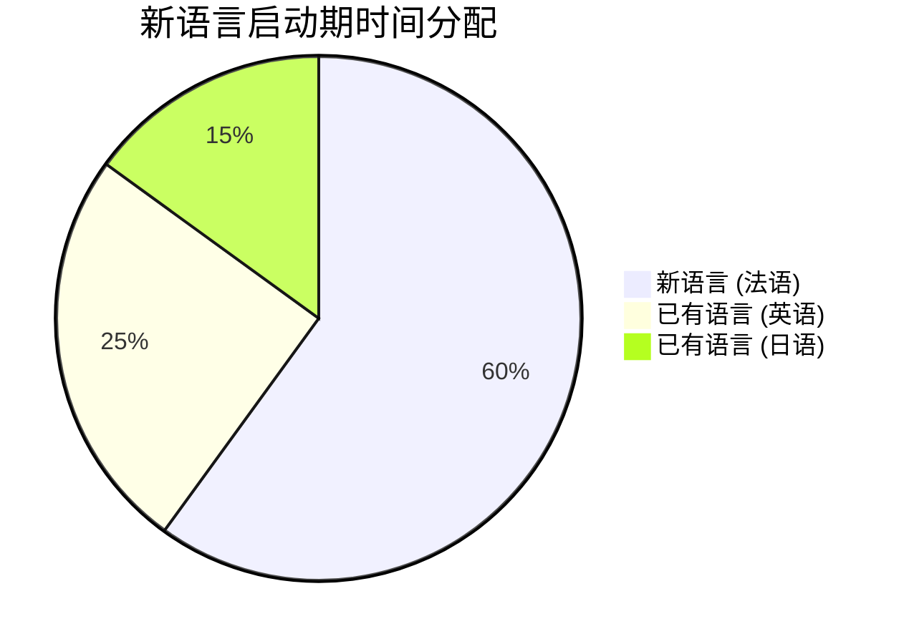
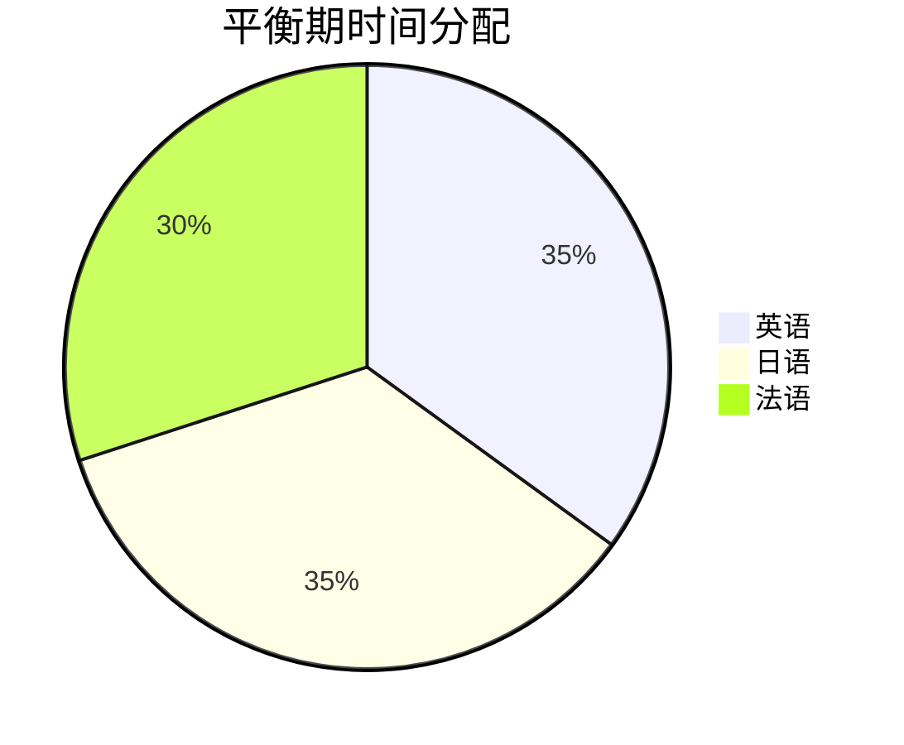
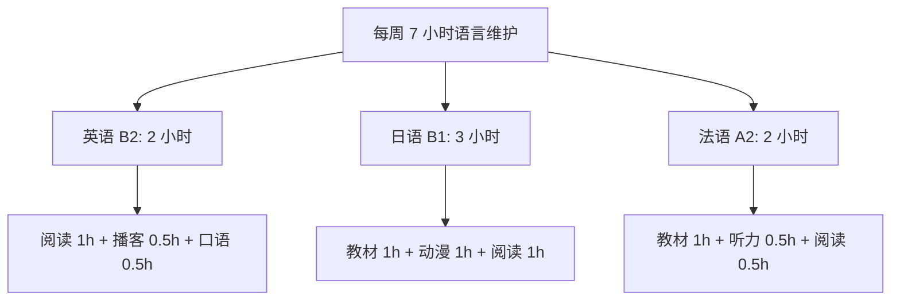

## 九、多语言学习

全球化时代，掌握两门以上语言已不再是少数人的天赋，而成为越来越多人的主动选择。然而，多语言学习并非简单的"多学几门语言"——它涉及认知科学、语言类型学、时间管理、记忆维护等多个维度的复杂问题。本节从认知优势出发，深入探讨多语言学习的理论基础、核心策略、常见陷阱和长期维护方法，为有意成为多语者的学习者提供系统指导。

### 9.1 多语言能力的认知优势

多语言能力不仅是沟通工具的扩展，更是对大脑认知系统的深度改造。大量实证研究表明，多语言者在以下维度具有显著的认知优势。

#### 9.1.1 执行功能增强

执行功能（Executive Function）是大脑前额叶负责的高级认知控制能力，包括抑制控制、认知灵活性和工作记忆三个核心成分。

**抑制控制**：多语言者在日常交流中需要持续激活目标语言、抑制非目标语言。这种"语言选择"训练使他们的抑制控制能力优于单语者。Ellen Bialystock 等人在 2004 年的经典研究中发现，双语儿童在需要抑制干扰信息的任务（如 Simon 任务）中表现明显优于单语儿童，反应时间更短、错误率更低。

**认知灵活性**：多语言者习惯于在不同语言系统之间切换，这种切换训练直接增强了认知灵活性。具体表现为：在任务切换实验中，多语言者的切换成本（switch cost）更低，即从一个任务转换到另一个任务时，性能下降幅度更小。

**工作记忆**：多语言者需要同时管理多个语言系统的信息，这种持续的多任务处理训练增强了工作记忆容量。2015 年 Morales 等人的研究发现，双语儿童在工作记忆任务中的表现优于单语儿童，且这种优势在需要同时处理多种信息的任务中尤为明显。

> **与第八章的关联**：认知负荷理论指出工作记忆容量有限，但多语言训练恰好在"不超载"的前提下扩大了有效工作记忆容量——这与肌肉训练的"渐进超负荷"原理类似。

#### 9.1.2 元语言意识提升

元语言意识（Metalinguistic Awareness）是指对语言本身的结构、功能和规则进行反思的能力。多语言者因为需要对比不同语言系统，天然具有更强的元语言意识。

具体表现为：

| 元语言能力维度 | 单语者典型表现 | 多语者典型表现 |
|:---|:---|:---|
| 语音意识 | 能辨别母语语音差异 | 能跨语言辨别语音，理解音位系统的差异 |
| 词法意识 | 了解母语构词规则 | 能对比不同语言的构词逻辑，如英语 un- 与中文"不"的功能类比 |
| 句法意识 | 自动化使用母语语法 | 能反思语法规则的多样性，理解"SVO语序不是唯一选择" |
| 语用意识 | 在母语文化中得体使用语言 | 能对比不同文化的语言使用规范，跨文化敏感度更高 |

这种元语言优势直接反哺语言学习——元语言意识强的学习者在面对新语言时，能更快识别其结构特征、归纳语法规则、发现与已知语言的异同。

#### 9.1.3 新语言学习的加速效应

多语言者学习新语言的速度通常快于单语者，这被称为"语言学习的复利效应"。原因有三：

1. **已有的语言学习策略库**：多语言者已经掌握了词汇记忆、语法归纳、听力训练等方法论，学习新语言时可以复用这些策略，无需从零摸索
2. **跨语言迁移网络**：每增加一门语言，学习下一门语言时可用的"参照系"就更丰富。例如，同时掌握英语和中文的学习者学习日语时，可以从英语借用外来词词汇、从中文借用汉字和部分语法概念
3. **更强的语音辨别能力**：多语言者对不同语音系统的适应能力更强，能更快辨别新语言中的陌生音素

#### 9.1.4 认知储备与脑健康

多语言能力对大脑的保护作用已得到大量神经影像学研究的支持（详见第十章）。核心发现包括：

- **延缓痴呆发病**：Ellen Bialystock 团队 2007 年对 184 名痴呆患者的研究发现，双语者的痴呆症状出现时间平均比单语者晚 4-5 年，即使在控制了教育水平、职业和移民 status 等变量后，这一差异依然显著
- **灰质密度增加**：多语言者在左侧顶下小叶、前扣带回等区域的灰质密度更高
- **白质完整性增强**：胼胝体等连接大脑两半球的白质束在多语言者中表现出更强的完整性

这些神经层面的变化意味着，多语言学习不仅是一种"技能投资"，更是一种"脑健康投资"。

### 9.2 多语言学习的核心策略

多语言学习面临的核心矛盾是：有限的时间和认知资源 vs. 多个语言系统的并行维护。以下是经过研究验证和实践检验的核心策略。

#### 9.2.1 语言间隔策略

**核心原则**：不要同时开始学习两门全新的语言。

这是多语言学习中最重要的策略之一。同时启动两门全新语言会导致：

- **认知过载**：两门语言都在"混乱期"，大脑无法有效区分和归类
- **负迁移增加**：两门语言的混淆概率大幅上升，特别是在语音和基础语法层面
- **动机分散**：两门语言都无法获得足够的练习时间，导致两门都进步缓慢，挫败感叠加

**推荐的间隔方案**：

**具体操作**：
- **B1 水平门槛**：当第一门语言达到 CEFR B1 水平（能进行日常对话、理解主要观点、写出简单连贯的文本）时，再启动第二门语言。B1 水平意味着该语言已形成稳定的"心理表征"，不容易被新语言干扰
- **时间参考**：以每天 1 小时学习时间计算，英语达到 B1 通常需要 6-9 个月，日语需要 9-12 个月，阿拉伯语需要 12-18 个月
- **例外情况**：如果两门语言差异极大（如英语和日语），干扰较小，可以在第一门达到 A2 时就启动第二门

#### 9.2.2 利用正迁移

正迁移（Positive Transfer）是指已掌握的语言对新语言学习的促进作用。善用正迁移可以大幅降低学习难度和时间。

**语言族谱与迁移路径**：

| 已掌握语言 | 高正迁移目标语言 | 中正迁移目标语言 | 低正迁移目标语言 |
|:---|:---|:---|:---|
| 英语 | 荷兰语、德语、瑞典语 | 法语、西班牙语、意大利语 | 中文、日语、阿拉伯语 |
| 中文 | 日语（汉字） | 韩语（部分词汇） | 英语、法语、阿拉伯语 |
| 西班牙语 | 葡萄牙语、意大利语、法语 | 罗马尼亚语 | 英语、德语、俄语 |
| 日语 | （独特语系，迁移有限） | 韩语（语法结构相似） | 英语、中文（除汉字外） |

**迁移的具体维度**：

- **词汇迁移**：同语族语言间存在大量同源词。例如，西班牙语和葡萄牙语的词汇相似度高达 89%，法语和意大利语约为 85%。这意味着学过西班牙语的人学习葡萄牙语时，80% 以上的词汇无需重新记忆
- **语法迁移**：同一语系的语言通常共享核心语法结构。例如，德语和荷兰语都是 SOV 语序（从句中）、都有性/数/格变化系统
- **语音迁移**：同一语系的语言通常共享部分音素。例如，学过法语的人学习其他罗曼语时，鼻化元音的发音无需重新学习
- **书写系统迁移**：中文学习者学习日语时，汉字部分可以大幅跳过；英语学习者学习任何使用拉丁字母的语言时，书写系统无需重新学习

**需要注意的负迁移**：正迁移的反面是负迁移（Negative Transfer），即已知语言对新语言的干扰。例如：

- 中文母语者学习英语时，常犯"I very like it"（副词位置迁移）的错误
- 英语母语者学习法语时，常把英语的"have + 过去分词"结构直接套用到法语中，忽略助动词的选择规则
- 日语学习者学习韩语时，虽然语法结构相似，但助词的具体用法和语感差异会导致错误迁移

**策略总结**：选择与已掌握语言有一定相似性但不至于混淆的新语言来学习。理想的选择是"有足够正迁移降低难度，但差异足够大以避免混淆"。

#### 9.2.3 差异化学习策略

多语言学习者面临的最大挑战之一是语言间的干扰。差异化学习策略的核心是：让每门语言在大脑中形成独立的"存储空间"，减少相互干扰。

**维度一：学习环境差异化**

为不同语言创造不同的学习"场景标记"：

- **英语**：在书桌前用电脑学习，听 BBC 播客
- **日语**：在沙发上用平板学习，看 NHK 新闻
- **法语**：在咖啡馆学习，听法语香颂

环境差异帮助大脑将不同语言与不同情境绑定，形成"情境依赖记忆"。

**维度二：学习材料差异化**

每门语言使用不同类型的主打材料：

| 语言 | 主打材料类型 | 辅助材料 |
|:---|:---|:---|
| 英语 | 学术论文、播客 | YouTube 视频、小说 |
| 日语 | 动漫、轻小说 | 新闻、教材 |
| 法语 | 电影、歌曲 | 教材、新闻 |

**维度三：学习时段差异化**

固定每门语言的学习时段，形成"时间锚点"：

- 早晨 7:00-7:30 → 日语（清醒状态适合学习需要高度集中的新语言）
- 午休 12:30-13:00 → 英语（维护性学习，不需要高度集中）
- 晚间 21:00-21:30 → 法语（轻松的输入型学习，如看法语电影片段）

**维度四：笔记系统差异化**

使用不同的笔记本或笔记应用来记录不同语言的学习内容，避免混杂：

- 英语笔记用 Notion，蓝色主题
- 日语笔记用 Obsidian，粉色主题
- 法语笔记用纸质笔记本

#### 9.2.4 时间分配策略

多语言学习的时间分配需要遵循"优先级动态调整"原则。

**初期阶段**（新语言刚启动）：

新语言获得 60% 的时间，因为初期需要大量输入来建立基础。已有语言各获得 20-25% 的时间用于维护。

**平衡阶段**（所有语言都在 B1 以上）：

所有语言获得大致相等的时间。可以根据个人目标微调，例如工作需要英语就给英语多分配一些。

**冲刺阶段**（某门语言有考试或使用需求）：

考试或出差前，将 60-70% 的时间分配给目标语言，其他语言降为维护模式（每周 1-2 次，每次 15-20 分钟）。

**每日时间分配模板**（以每日总学习时间 2 小时为例）：

| 时段 | 语言 | 活动 | 时长 |
|:---|:---|:---|:---|
| 早起 | 日语 | 核心词汇 + 语法学习 | 30 分钟 |
| 通勤 | 英语 | 英文播客/有声书 | 30 分钟 |
| 午休 | 法语 | 课文阅读 + 词汇记忆 | 20 分钟 |
| 晚间 | 日语/英语 | 影视/阅读/口语练习 | 40 分钟 |

### 9.3 第三语言习得的特殊性

第三语言习得（Third Language Acquisition，简称 L3A）是应用语言学中相对新兴但发展迅速的研究领域。它与传统的第二语言习得（SLA）有着本质区别，理解这些区别对多语言学习者至关重要。

#### 9.3.1 L3A 与 L2A 的核心差异

传统的第二语言习得研究假设学习者只有一种母语背景，但第三语言学习者同时拥有母语（L1）和第二语言（L2）两个语言系统。这带来了以下关键差异：

**迁移来源的复杂性**：

在 L2 学习中，迁移主要来自 L1。但在 L3 学习中，L1 和 L2 都可能成为迁移来源，而且迁移的方向并非简单地由"母语"决定。

**迁移方向的决定因素**——主要有三种理论模型：

1. **语言相近性模型（Typological Primacy Model，TPM）**：由 Rothman（2011，2015）提出，认为 L3 语法迁移的方向主要由 L1 和 L2 中哪一种与 L3 在结构上更相似来决定，而非由习得顺序决定。例如，一个先学英语、后学西班牙语的中文母语者学习葡萄牙语时，语法迁移主要来自西班牙语（因为西班牙语与葡萄牙语更相似），而非英语或中文

2. **累积增强模型（Cumulative Enhancement Model，CEM）**：由 Flynn 等人（2004）提出，认为所有先前语言的知识都可能对 L3 学习产生促进作用，且这种促进作用是累积的——多语言者不会比双语者更差，只会更好或持平

3. **脚本模型与 L2 状态因素模型**：Bardel 和 Falk（2007）提出，L2（而非 L1）可能是更强的迁移来源，因为 L2 的学习方式更"显性"，与 L3 的学习方式更接近

**实际启示**：理解迁移方向对学习策略有直接指导意义。例如，如果你的 L2 是法语，现在要学西班牙语，你应该充分利用法语知识进行正迁移，同时警惕那些法语和西班牙语"看似相同实则不同"的"假朋友"（faux amis）。

#### 9.3.2 多语者的元认知优势

第三语言学习者在元认知层面具有显著优势：

- **语言学习的"学习能力"**：经过两次完整的语言学习过程，L3 学习者已经知道"如何学习一门语言"——他们了解自己的学习风格、有效的记忆策略、适合自己的输入材料类型
- **语法意识**：L3 学习者对语法规则的敏感度更高，能更快地归纳和验证语法假设
- **错误容忍度**：经历过 L2 学习中的无数次错误后，L3 学习者对错误的心理承受力更强，更敢于尝试和犯错
- **策略迁移**：L2 学习中积累的有效策略（如间隔重复记单词、影子跟读练听力）可以直接迁移到 L3 学习中

研究表明，L3 学习者在同等学习时间内的进步速度通常快于 L2 学习者，特别是在语法习得和词汇学习方面。

#### 9.3.3 语言间的"第三方效应"

多语言环境下存在一种独特的"第三方效应"——两种语言的互动会受到第三种语言的影响。例如：

- **语法判断的波动**：L3 学习者在判断 L2 句子的语法正确性时，可能受到 L3 最近学习内容的影响
- **词汇通达的干扰**：在使用 L2 时，最近频繁使用的 L3 词汇可能被优先激活，导致口误或词不达意
- **语音系统的漂移**：长期不使用某种语言时，其语音系统可能受到其他语言的影响而发生漂移

这些现象提醒多语言学习者：语言系统之间是动态互动的，而非各自独立的静态模块。

### 9.4 多语言维护与衰退管理

学习多门语言的真正挑战不在于"学会"，而在于"维持"。语言衰退（Language Attrition）是多语言者面临的最大威胁。

#### 9.4.1 语言衰退的机制

语言衰退是指因长期不使用而导致的语言能力下降。根据 Keijzer（2011）的研究，语言衰退遵循"后进先出"（Last In，First Out）原则——最后学习的语言最先衰退，最先学习的语言（通常是母语）最不容易衰退。

衰退的具体表现：

| 语言能力维度 | 衰退速度 | 衰退表现 |
|:---|:---|:---|
| 词汇 | 最快 | 主动词汇量下降，找词困难（tip-of-the-tongue 现象增加） |
| 口语流利度 | 较快 | 说话速度下降，停顿和犹豫增加 |
| 语法准确性 | 中等 | 复杂语法结构使用频率下降，简单结构替代 |
| 语音 | 较慢 | 口音可能略有加重，但核心发音能力保留 |
| 阅读/听力理解 | 最慢 | 被动理解能力保留最久，即使主动产出能力已大幅下降 |

#### 9.4.2 维护策略：最小有效剂量

多语言维护的核心问题是：每门语言需要多少"维护剂量"才能防止衰退？

根据语言维护研究和实践经验，以下是每门语言的**最小维护剂量**参考：

| 语言水平 | 每周最小接触量 | 推荐活动 |
|:---|:---|:---|
| B1（中级） | 3-4 小时 | 教材学习 + 简单阅读 + 听力练习 |
| B2（中高级） | 2-3 小时 | 阅读原版书 + 看影视剧 + 口语练习 |
| C1（高级） | 1-2 小时 | 阅读 + 偶尔口语/写作 |
| C2（精通） | 0.5-1 小时 | 保持接触即可，阅读或听力 |

**关键原则**：被动接触也算维护。看一部英文电影、听一首日文歌、读一篇法语新闻文章，都算作对该语言的有效接触。

#### 9.4.3 多语言维护的时间分配框架

假设你掌握 3 门语言（英语 B2、日语 B1、法语 A2），每周可分配 7 小时给语言维护：

**优先级规则**：
1. 水平越低的语言需要越多维护时间（因为更容易衰退）
2. 最近有使用需求的语言临时提升优先级
3. 已达 C1 以上的语言可以降低维护频率，但仍不可完全放弃

#### 9.4.4 利用"浸泡"替代"学习"

当语言达到 B2 以上水平后，维护方式可以从"刻意学习"转向"自然浸泡"：

- 将手机系统语言切换为目标语言
- 用目标语言搜索信息（而非习惯性地用中文或英文）
- 订阅目标语言的 YouTube 频道、播客、新闻源
- 用目标语言写日记或社交媒体帖子
- 找语伴进行定期对话练习
- 在工作或学习中尽量使用目标语言

### 9.5 多语言学习中的常见陷阱

#### 9.5.1 陷阱一：贪多嚼不烂

**表现**：同时学习 3-4 门语言，每门语言都只停留在入门阶段。

**根本原因**：低估了每门语言达到可用水平所需的时间投入。根据美国外交学院（FSI）的数据，英语母语者达到专业工作水平（ILR Level 3，约等于 CEFR C1）所需的时间：

| 语言难度类别 | 语言举例 | 所需学时 |
|:---|:---|:---|
| I 类（最易） | 西班牙语、法语、意大利语 | 600-750 小时 |
| II 类 | 德语、印尼语 | 900 小时 |
| III 类 | 俄语、泰语、越南语 | 1,100 小时 |
| IV 类（最难） | 中文、日语、阿拉伯语、韩语 | 2,200 小时 |

**纠正方法**：在同一时期最多专注 2 门语言（1 门主力学习 + 1 门维护），等主力语言达到 B1 后再考虑增加新语言。

#### 9.5.2 陷阱二：语言混合与退化

**表现**：使用一门语言时频繁混入另一门语言的词汇或语法结构，且这种混合不是有意为之的语码转换（code-switching），而是无法控制的干扰。

**常见场景**：
- 学了日语后，说英语时偶尔冒出日语的"那个..."（あの/eto）
- 同时学法语和西班牙语时，两者的词汇和语法频繁混淆
- 中文母语者用英文写作时，句子结构受到中文影响

**纠正方法**：
1. 混淆发生在两门"同水平"且"同语族"的语言之间最为严重。解决方案是拉开两门语言的水平差距——让一门明显强于另一门
2. 使用"切换仪式"：在从一门语言切换到另一门语言之前，花 2-3 分钟阅读或听目标语言的材料，帮助大脑"调频"
3. 刻意练习"语言分离"：在口语练习中，一旦发现混用了错误语言的词汇，暂停并用正确语言重新表达

#### 9.5.3 陷阱三：忽视输出练习

**表现**：每门语言都在"输入"（阅读、听力）上花了大量时间，但"输出"（口语、写作）严重不足。

**为什么多语言者特别容易犯这个错误**：
- 时间有限，输入型活动更容易安排（可以碎片化进行）
- 输出型活动需要找到对话者或写作反馈，门槛更高
- 多语言者容易产生"我已经会了"的错觉——能听懂不代表能说出来

**纠正方法**：为每门语言设定最低输出量目标。例如：
- 每周至少 1 次 15 分钟的口语练习（可以用 AI 对话工具）
- 每周至少写 1 篇 200 字的短文（日记、读后感等）
- 每天至少用目标语言自言自语 5 分钟（描述正在做的事情）

#### 9.5.4 陷阱四：完美主义导致停滞

**表现**：因为担心发音不标准、语法不完美而不敢开口，导致口语能力长期停滞。

**多语言背景下的特殊性**：多语言者往往有"比较心态"——将新语言的表现与自己最熟练的语言进行比较，产生落差感。例如，英语已经达到 C1 水平，但法语只有 A2，每次说法语时都感到"自己很差"，从而回避法语输出。

**纠正方法**：
1. 接受每门语言都有独立的进步曲线，不要横向比较
2. 设定"最低可用标准"而非"完美标准"——能沟通就先沟通，错误以后再修正
3. 利用语言之间的正反馈：法语口语练习中犯的错误，会让你更深刻地理解语言规律，这些规律可能反过来帮助英语的提升

#### 9.5.5 陷阱五：缺乏系统性

**表现**：每天随机选一门语言学习，没有明确的计划和进度追踪。

**纠正方法**：
- 制定周计划，明确每天每门语言的学习内容和时长
- 使用 Anki 等间隔重复工具为每门语言维护词汇
- 每月回顾一次各语言的进步情况，调整计划
- 记录"语言日志"，追踪每门语言的学习状态和感受

### 9.6 多语言学习的实用工具体系

#### 9.6.1 间隔重复系统

多语言者需要同时维护多门语言的词汇，间隔重复系统（SRS）是最高效的工具：

**Anki**：最灵活的 SRS 工具，支持自定义卡片、多语言牌组、图片和音频嵌入。推荐为每门语言创建独立的牌组，并使用共享牌组节省制卡时间。

**推荐牌组管理方式**：

Anki 牌组结构：
├── 英语
│   ├── 核心词汇 (COCA 5000)
│   ├── 学术词汇
│   └── 阅读生词
├── 日语
│   ├── JLPT N3 词汇
│   ├── 动漫生词
│   └── 汉字
└── 法语
    ├── 核心词汇
    └── 教材词汇

#### 9.6.2 语言学习应用矩阵

| 应用 | 适用场景 | 多语言支持 | 推荐指数 |
|:---|:---|:---|:---|
| Anki | 词汇记忆 | 无限制语言数量 | ★★★★★ |
| iTalki | 口语练习（1对1） | 支持 150+ 语言 | ★★★★★ |
| Tandem | 语伴交换 | 支持 160+ 语言 | ★★★★☆ |
| LingQ | 阅读 + 听力 | 支持 20+ 语言 | ★★★★☆ |
| Clozemaster | 语境词汇学习 | 支持 50+ 语言 | ★★★★☆ |
| Lingvist | AI 驱动词汇学习 | 支持 5 种语言 | ★★★☆☆ |
| Busuu | 系统课程 | 支持 14 种语言 | ★★★☆☆ |

#### 9.6.3 多语言阅读管理

多语言者的阅读管理需要特别的工具支持：

- **LingQ**：支持多语言导入文本，自动标记生词，内置 SRS
- **Learning with Texts（LWT）**：开源的多语言阅读工具，支持自建服务器
- **浏览器扩展**：如 Toucan（自动在浏览的网页中插入目标语言词汇）、Mate Translate（即时翻译）

#### 9.6.4 多语言输入法管理

多语言者需要在不同语言的输入法之间快速切换：

- **手机端**：iOS 和 Android 原生输入法都支持多语言键盘，推荐使用系统自带输入法避免第三方输入法的兼容性问题
- **电脑端**：macOS 使用 Command+Space 切换输入法，Windows 使用 Win+Space。推荐为每种语言设置固定的快捷键
- **特殊字符**：使用系统字符面板（macOS: Control+Command+Space，Windows: Win+句号）输入特殊字符和 emoji

### 9.7 真实案例：多语言学习者的时间表

以下是一个真实的多语言学习者（同时维护英语、日语、西班牙语三门语言）每周时间分配方案：

**学习者背景**：英语 C1（工作语言）、日语 N2（兴趣驱动）、西班牙语 B1（新启动语言）

**周一至周五（工作日）**：

| 时间段 | 语言 | 活动 | 时长 |
|:---|:---|:---|:---|
| 7:00-7:20 | 西班牙语 | Anki 词汇复习 + 教材学习 | 20 分钟 |
| 通勤路上 | 英语 | 技术播客（如 Lex Fridman） | 40 分钟 |
| 午休 | 西班牙语 | Clozemaster 练习 | 15 分钟 |
| 18:30-19:00 | 日语 | 阅读轻小说 | 30 分钟 |
| 睡前 | 日语 | 看 1 集动漫（无字幕或日文字幕） | 25 分钟 |

**周末**：

| 时间段 | 语言 | 活动 | 时长 |
|:---|:---|:---|:---|
| 10:00-11:00 | 西班牙语 | iTalki 口语课 + 复习笔记 | 60 分钟 |
| 14:00-15:00 | 日语 | NHK 新闻 + 生词整理 | 60 分钟 |
| 随时 | 英语 | 阅读英文书籍或文章 | 60 分钟 |

**每周总计**：约 11 小时，其中西班牙语（主力学习）约 4.5 小时，日语（维护+提升）约 3.5 小时，英语（自然维护）约 3 小时。

**关键经验**：
1. 英语作为工作语言，几乎不需要额外安排"学习时间"，通过日常工作自然维护
2. 西班牙语作为新启动语言获得最多时间，且集中在早晚"黄金时间"
3. 日语以兴趣驱动的输入型活动为主（阅读、看动漫），保持乐趣感
4. 周末安排一次口语课，弥补工作日缺乏输出练习的不足

### 9.8 从双语者到多语者的跃迁

从"学习一门外语"到"成为多语言者"不仅是数量的增加，更是身份和认知方式的转变。

#### 9.8.1 身份认同的扩展

多语言者通常会发展出"多重语言身份"——在使用不同语言时，可能表现出不同的性格特征、思维方式和社交风格。这不是"分裂"，而是语言与文化的自然融合。研究发现，双语者在使用不同语言时确实会表现出不同的个性特征，这与语言所承载的文化价值有关。

#### 9.8.2 思维方式的多元化

不同语言提供了不同的概念化世界的方式。例如：

- 中文用"上/下"描述时间（上周、下周），而英语用"前/后"（last week, next week）
- 日语有专门表达"努力到令人感动"的词汇（頑張る），这在英语中需要一个完整的句子来表达
- 德语有 Schadenfreude（幸灾乐祸）这样的精确词汇，而中文需要四字成语来描述

掌握多种语言意味着你拥有了多种看待世界的"透镜"，这种多元视角对创造力和问题解决能力有显著的促进作用。

#### 9.8.3 持续成长的心态

多语言学习是一个永无终点的旅程。即使是已达到 C2 水平的语言，也总有新的词汇、表达方式和文化内涵等待探索。接受这种"永远在路上"的状态，将注意力从"达到某个水平"转向"享受学习过程本身"，是多语言者保持长期动力的关键。

多语言能力是认知优势的放大器、文化理解的桥梁、个人成长的引擎。选择适合自己的语言组合，遵循科学的学习策略，耐心经营每一种语言，你将在多语言的道路上收获远超预期的回报。
