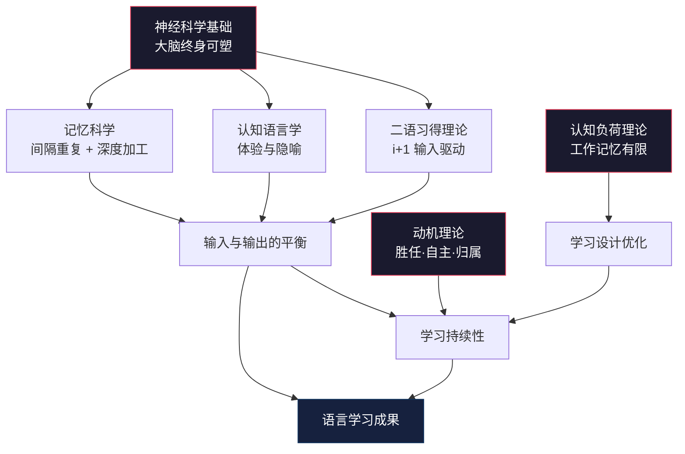

## 十一、本节小结：从理论碎片到学习操作系统

### 为什么需要这一页

前面十个章节拆开了外语学习背后的科学原理——从二语习得理论到神经科学，从记忆曲线到动机管理。这些内容单独看都有道理，但如果只是"知道了"却没有形成系统，那跟没学差别不大。

本节小结的核心任务只有一个：**把十个理论拼成一张网，让你在做每一个学习决策时，都能快速找到对应的科学依据。**

---

### 一、六大理论支柱的完整图景

本节涉及的十个章节，可以归纳为六大理论支柱。它们不是平行并列的关系，而是层层嵌套、互相支撑的结构：



**底层基础**：神经科学告诉我们大脑终身可塑，这是所有学习的生理前提。

**输入层**：二语习得理论（Krashen的i+1假说）决定了学什么材料；认知语言学决定了怎么理解这些材料。

**处理层**：记忆科学决定了怎么把输入转化为长期记忆；认知负荷理论决定了每次该接收多少信息。

**驱动层**：动机理论决定了你能不能坚持下去。

**输出层**：学习策略（第五章）是将上述所有理论落地为日常行为的操作系统。

这六层之间的关系是：底层为上层提供可能性，上层为底层提供应用场景。缺少任何一层，学习效果都会打折扣。

---

### 二、十大章节核心要点速查表

| 章节 | 核心理论 | 关键概念 | 最重要的行动启示 |
|------|---------|---------|----------------|
| 一、二语习得理论 | Krashen输入假说、Swain输出假说 | i+1、可理解性输入、习得vs学习 | 选略高于当前水平的材料，大量听读 |
| 二、认知语言学 | Lakoff隐喻理论、构式语法 | 体验基础、意象图式、原型范畴 | 用身体经验和母语隐喻理解外语表达 |
| 三、习得心理学 | 过程模型、个体差异 | 情感过滤、学习风格、策略意识 | 降低焦虑，匹配适合自己的学习方式 |
| 四、记忆科学 | 艾宾浩斯遗忘曲线、工作记忆模型 | 间隔重复、深度加工、组块化 | 用SRS系统管理复习，新知识必须深加工 |
| 五、学习策略 | Oxford策略分类、元认知策略 | 直接/间接策略、策略训练 | 培养"监控自己学习过程"的元认知能力 |
| 六、关键期假说 | Lenneberg关键期、脑成像研究 | 神经可塑性递减、语音敏感期 | 成年人用策略优势弥补，不放弃语音训练 |
| 七、动机理论 | 自我决定理论、 Gardner动机模型 | 内在/外在动机、胜任感、自主感 | 满足三大基本心理需求，维持内在动机 |
| 八、认知负荷理论 | Sweller认知负荷模型 | 内在/外在/关联负荷 | 拆分复杂任务，减少无效认知负担 |
| 九、多语言学习 | 语言迁移理论、多语激活模型 | 正迁移、负迁移、跨语言影响 | 利用已会语言加速学习，警惕相似干扰 |
| 十、神经科学 | 语言脑区定位、可塑性研究 | 布洛卡区、韦尼克区、髓鞘化 | 坚持学习带来物理性脑改变，睡眠巩固记忆 |

---

### 三、理论之间的关键联动

孤立地理解每个理论是不够的。真正有价值的是看到它们之间的互动关系——这些联动才是指导学习决策的核心。

#### 3.1 输入假说 × 记忆科学：材料选择与复习设计的配合

Krashen说"i+1"——选略高于当前水平的材料。但"略高"到底高多少？记忆科学给出了答案：如果你能在2-3次接触后记住新内容的70-80%，说明难度合适。如果首次接触后完全无法回忆任何细节，说明材料远超i+1，需要降级。

**实际操作**：选一段听力材料，第一遍听完后尝试复述大意。如果能复述60-70%的内容，这个难度就是你的i+1甜区。低于40%说明太难，高于90%说明太简单。

#### 3.2 认知负荷理论 × 记忆科学：学习单元的设计原则

工作记忆容量约为4±1个信息单元（Cowan, 2001）。这意味着：

- **背单词**：每次学习不超过5-7个新词，配合已知词汇构建语境
- **语法学习**：每次只引入一条新规则，用3-5个例句巩固后再学下一条
- **听力训练**：将长对话切成15-30秒的片段逐段精听，而非通篇泛听
- **阅读理解**：先扫读获取整体框架（降低外在负荷），再精读细节（聚焦内在负荷）

认知负荷理论与记忆科学的结合点在于：**过载的信息不会进入长期记忆**。一次学太多等于白学。

#### 3.3 动机理论 × 神经科学：为什么"坚持"如此困难又如此值得

动机理论告诉我们，胜任感（"我能行"）是内在动机的核心来源之一。神经科学则从生理层面解释了为什么初期会感觉"怎么学都没进步"：

大脑建立新的神经通路需要时间。突触连接的增强和髓鞘化是渐进过程——前几周你感觉不到明显进步，但大脑内部正在发生结构性改变。这个"静默期"通常持续4-8周。

**联动启示**：在学习的前1-2个月，不要以外部表现（口语流利度、阅读速度）作为唯一的衡量标准。关注过程指标——每天听了多少分钟、记住了多少新词、完成了几次复习。用过程指标维持胜任感，等待大脑完成"硬件升级"。

#### 3.4 认知语言学 × 多语言学习：隐喻迁移的双刃剑

认知语言学发现，人类通过身体经验构建抽象概念的隐喻映射。比如中文说"高涨的情绪"（上=好），英语说"I'm feeling up"（up=good），日语说"気分が上がる"（上=好）。这种跨语言的隐喻共性就是正迁移的来源。

但也有陷阱。中文说"我心里很沉重"，英语说"I feel down"，方向一致。然而中文说"前天"（过去在前），英语说"the day before yesterday"（过去也在前），但中文说"后天"（未来在后），英语说"the day after tomorrow"（未来也在后）——这看似一致，但在时间隐喻的其他场景中，中英文有时会反转。比如中文"回顾过去"和英语"look back on the past"一致，但中文"往前看"（面向未来）和英语"looking forward"也一致——这里看似没问题，但中文"前途"（前方的路=未来）与某些语言中"未来在背后"的隐喻则完全不同。

**实际操作**：学第三门语言时，主动对比三门语言在隐喻层面的异同。把"意外的差异"整理成专门的笔记，这些正是负迁移最容易发生的地方。

---

### 四、理论驱动的学习决策框架

下面是将六大理论转化为日常决策的实用框架。每当你要做一个学习选择时，按以下流程过一遍：

```mermaid
flowchart TD
    Start([要做学习决策]) --> Q1{材料难度合适吗？<br/>i+1原则}
    Q1|太难| A1[降低难度:<br/>换简单材料/拆分任务]
    Q1|太简单| A2[提升难度:<br/>换更难材料/增加任务复杂度]
    Q1|合适| Q2{认知负荷可控吗？}
    Q2|超载| A3[拆分任务:<br/>减少每次信息量/分步骤]
    Q2|可控| Q3{有复习计划吗？}
    Q3|没有| A4[建立SRS复习:<br/>当天→1天→3天→7天→14天]
    Q3|有| Q4{记忆效果如何？}
    Q4|差| A5[加强深度加工:<br/>编故事/画图/找关联/输出]
    Q4|好| Q5{动机状态？}
    Q5|低落| A6[调整:<br/>换有趣材料/设小目标/找同伴]
    Q5|正常| GO[✓ 执行学习计划]

    style Start fill:#0f3460,stroke:#e94560,color:#fff
    style GO fill:#1a472a,stroke:#2d6a4f,color:#fff
```

**决策框架的五个检查点**：

1. **难度检查**（二语习得理论）：这个材料对我当前水平来说，是否处于"需要努力但不至于崩溃"的区间？
2. **负荷检查**（认知负荷理论）：我一次要处理的信息量是否超过了工作记忆容量？能不能拆得更细？
3. **复习检查**（记忆科学）：新学的内容有没有进入间隔重复系统？今天学的，今天复习了吗？
4. **加工检查**（记忆科学+认知语言学）：我是在机械重复还是在深度理解？能不能用自己的话解释、用已知经验类比？
5. **动机检查**（动机理论）：我现在学习是因为想学还是因为"应该学"？如果是后者，怎么调整？

---

### 五、自我诊断清单

用以下清单评估你当前的学习方法是否充分运用了本节的理论基础。每项1-5分，3分以上为合格：

| 诊断项 | 对应理论 | 自评标准 |
|--------|---------|---------|
| 我的学习材料难度处于"略有挑战但可理解"的区间 | 二语习得理论 | 听读时能理解70-80%，不会频繁查词典=4分 |
| 我每天的学习包含听和读的输入，也有说和写的输出 | 输出假说 | 输入60-70%、输出30-40%=4分 |
| 我能用隐喻或类比来理解新的语法概念 | 认知语言学 | 经常把新概念和已知经验联系起来=4分 |
| 我的学习不会让我感到信息过载 | 认知负荷理论 | 每次学习后感到有收获但不疲惫=4分 |
| 我使用间隔重复系统管理词汇和语法复习 | 记忆科学 | 有SRS系统且坚持使用=5分 |
| 我对新学内容会进行深加工而非机械重复 | 记忆科学 | 会编故事/画图/找关联=4分 |
| 我清楚自己为什么学这门语言 | 动机理论 | 能用一句话说清内在动机=5分 |
| 我的学习计划包含可达成的小目标 | 动机理论 | 每周有具体可衡量的小目标=4分 |
| 我有意识地监控自己的学习过程 | 学习策略 | 会定期回顾和调整方法=4分 |
| 我不因年龄而自我设限 | 关键期假说 | 相信进步是可能的，只是需要时间=5分 |
| 我了解已会语言对新语言学习的迁移影响 | 多语言学习 | 会主动利用正迁移、防范负迁移=4分 |
| 我保证充足睡眠以支持记忆巩固 | 神经科学 | 每天7-8小时，学习后不熬夜=4分 |

**评分解读**：
- **48-60分**：理论基础扎实，学习方法科学。继续保持，关注细节优化。
- **36-47分**：基础不错，但有2-3个薄弱环节。优先补强得分最低的项目。
- **24-35分**：学习方法存在明显理论盲区。建议重新阅读对应章节，逐一改进。
- **24分以下**：当前学习方法缺乏科学支撑，效率较低。建议从"输入假说"和"记忆科学"两个最基础的理论开始重建学习体系。

---

### 六、七大常见误区深度辨析

#### 误区一："理论无用，直接学就行"

这是成本最高的误区。没有理论指导的学习有三种典型后果：

- **方向错误**：花大量时间做低效的事（比如抄写单词50遍），以为自己很努力
- **遇到瓶颈无法诊断**：不知道自己卡在哪里、为什么卡、怎么突破
- **放弃时找不到坚持的理由**：不清楚"大脑正在重组"这种沉默期是正常的

类比：你不需要成为运动科学家才能跑步，但如果你连"热身→训练→拉伸"的基本框架都不知道，受伤和低效就是必然的。理论就是学习的"热身知识"。

#### 误区二："方法万能，找到好方法就能速成"

市面上大量"30天流利""100天突破"的宣传，本质上是在贩卖捷径幻想。事实是：

- 再优化的方法也需要时间投入。语言习得涉及大脑结构性改变（突触增强、髓鞘化），这个过程无法跳过
- 方法优化的是"单位时间的产出"，不能替代"时间总量"
- 一个科学方法+每天1小时，一年后的效果远超一个神奇方法+每天10分钟

**正确态度**：方法很重要，但它是在"足够的时间投入"这个前提下才重要的。先保证每天1-2小时的稳定投入，再在这个基础上优化方法。

#### 误区三："输入够了自然就会说"

Krashen的输入假说常被过度简化为"只听不说"。但Swain的研究明确指出：

- 理解能力（听/读）和产出能力（说/写）是两套不同的神经回路
- 只有在输出时，学习者才会注意到自己"以为会了但其实不会"的部分
- 输出过程中的"被push的感觉"（being pushed）恰恰是触发语言系统修正的关键机制

**数据支撑**：一项针对日本英语学习者的研究（Izumi, 2002）发现，同时进行输入和输出练习的学习者，在语法准确性上的进步速度是只做输入练习的学习者的1.8倍。

#### 误区四："学语言就是要死记硬背"

记忆是必要的，但"怎么记"远比"记多少"重要。三种记忆策略的效果对比：

| 策略 | 具体做法 | 记忆保持率（30天后） | 认知加工深度 |
|------|---------|-------------------|-------------|
| 机械抄写 | 抄写单词10遍 | 约10-15% | 浅层（视觉编码） |
| 语境背诵 | 在例句中记忆单词 | 约35-45% | 中层（语义编码） |
| 深度加工 | 为单词编故事、画图、找母语类比、造句 | 约60-75% | 深层（多重编码） |

深度加工为什么有效？因为它调动了多个记忆系统——视觉、语义、情景、甚至情绪——形成了更多的提取线索。回忆时只要任何一个线索被激活，整个记忆就能被提取。

#### 误区五："成年人学不好外语"

这个误区的根源是对"关键期假说"的过度解读。实际情况是：

- 关键期主要影响的是**语音习得的精确度**（接近母语者accent的能力），不是语言学习的整体能力
- 成年人在以下方面有明确优势：语法分析能力、学习策略运用、元认知监控、已有知识的迁移
- 一项跨国研究（Muñoz, 2006）发现，在相同学习时长下，成年学习者的语法掌握速度显著快于儿童学习者
- 语音方面，虽然成年人很难达到"完全母语化"的发音，但达到"清晰可懂、自然流畅"的水平是完全可能的，且不需要所谓的"天赋"

**关键数据**：美国外交学院（FSI）的统计显示，一个英语母语的成年人，通过系统的课堂学习+沉浸，达到专业工作水平（ILR 3级）的平均时间是：西语600-750小时，日语2200小时。这些数据不区分学习者年龄。

#### 误区六："学语言靠天赋，我没有语言天赋"

"语言天赋"这个概念在科学研究中缺乏明确的定义和证据。所谓的"天赋差异"，更准确地说是以下因素的组合：

- **早期暴露差异**：小时候接触过多种语言的人，大脑已经建立了更灵活的语音处理回路
- **学习策略差异**：高效学习者使用了更多元认知策略（监控、计划、评估），这不是天赋而是可习得的技能
- **动机和投入差异**：看起来"有天赋"的人往往投入了大量隐性时间（比如看美剧、听英文歌）
- **母语距离差异**：中国人学日语比学阿拉伯语快，不是因为对日语更有天赋，而是因为语言距离更近

#### 误区七："学太多语言会互相干扰"

多语言学习中的"干扰"（负迁移）确实存在，但研究表明：

- 多语者的大脑在执行功能（注意力切换、冲突监控、工作记忆）方面表现优于单语者
- 负迁移主要发生在语言的**表面结构**（词汇拼写、语法标记），而非深层结构（语义理解、语用推理）
- 学会区分相似语言的能力本身就是一种可以训练的元技能
- 先精通一门语言再学第二门，负迁移的影响会显著降低

---

### 七、典型学习场景的理论应用示范

以下用三个真实场景，展示如何综合运用本节理论做出正确的学习决策。

#### 场景一：初学者选择学习材料

**情境**：刚开始学日语，纠结是用NHK新闻、动漫、还是教科书。

**理论分析**：

- **i+1原则**：NHK新闻的语速和词汇量远超初学者水平，不在i+1区间内。动漫语速虽然快，但视觉语境丰富，有助于理解。教科书的难度阶梯最清晰。
- **认知负荷理论**：NHK新闻的外在负荷太高（语速+陌生词汇+无视觉语境），会导致认知超载。动漫降低了外在负荷（画面辅助），但可能引入非标准表达。
- **动机理论**：如果学习者是动漫迷，用动漫学习能提供内在动机（兴趣驱动）。如果强迫看教科书，动机可能快速衰减。

**综合决策**：以教科书为主线（保证i+1梯度），用感兴趣的动漫片段作为补充（维持动机+真实语境输入）。NHK新闻留到中高级阶段。

#### 场景二：中级学习者遇到瓶颈

**情境**：学了两年英语，能读原版书、能看美剧，但口语表达仍然磕磕绊绊。

**理论分析**：

- **输出假说**：长期以输入为主，缺少输出练习。理解和产出用的是不同神经回路，输入能力不能自动转化为输出能力。
- **记忆科学**：口语需要的是快速提取（自动化），而非慢速回忆。这需要大量的"输出练习"来加强口语相关的神经通路。
- **神经科学**：布洛卡区（语言产出）的神经通路需要通过反复使用来增强髓鞘化，提高信号传导速度。

**综合决策**：将学习时间重新分配——输入降至50%，输出提升至50%。具体做法：每天跟读模仿15分钟（强化口语肌肉记忆），每周找语伴对话2次（真实输出压力），每天用英语写3句话日记（书面输出巩固）。

#### 场景三：多语言学习者的时间分配

**情境**：英语B2水平，想同时学日语和法语。

**理论分析**：

- **认知负荷理论**：同时学两门新语言，工作记忆会在三门语言之间频繁切换，外在负荷极高。
- **多语言迁移**：英语和法语同属印欧语系，存在大量同源词汇（如information、nation、hospital），正迁移潜力大。日语与英语/法语差异大，迁移较少。
- **记忆科学**：相似信息容易产生干扰效应（proactive/retroactive interference）。英语和法语的相似词汇可能导致混淆。

**综合决策**：先启动日语（与已有语言差异大，干扰少），6个月后当日语达到稳定基础（A2）后再启动法语（利用英语正迁移加速）。两门语言的学习时间错开——上午学日语、晚上学法语——利用时间间隔减少干扰。

---

### 八、你的"理论内化"行动清单

理论只有内化为直觉才有价值。以下是将六大理论转化为日常习惯的具体行动：

#### 每日必做（5分钟）

1. **学习前**（30秒）：问自己——今天的材料难度在i+1附近吗？如果不是，调整。
2. **学习中**（持续）：注意自己的认知负荷感。感到"脑子转不过来"时，立刻拆分任务。
3. **学习后**（2分钟）：把今天新学的内容录入SRS复习系统。尝试用一句话总结今天学到了什么（深度加工）。
4. **睡前**（2分钟）：快速回忆今天学的3-5个关键点（利用睡眠巩固效应）。

#### 每周必做（15分钟）

1. **动机检查**：这周的学习是因为兴趣还是被迫？如果连续两周感到被迫，需要调整材料或方法。
2. **策略回顾**：这周用了什么学习策略？有没有可以优化的地方？
3. **目标校准**：本周的小目标完成了吗？下周的目标是否具体可衡量？

#### 每月必做（30分钟）

1. **自我评估**：用本节第五部分的诊断清单给自己打分，找到最薄弱的环节。
2. **方法调整**：根据评估结果，选一个最需要改进的方面，制定具体的改进计划。
3. **输入审计**：统计本月的输入时间（听+读）和输出时间（说+写），确保比例大致在6-7:3-4。

---

### 结语：理论是地图，走路还得靠自己

本节用十个章节搭建了外语学习的理论框架。这些理论的价值不在于让你成为语言学家，而在于让你在每一个学习决策的岔路口，都有科学依据而不是靠感觉。

但请记住：**再完美的地图也不能代替走路**。理论告诉你方向和方法，但最终的进步来自每天1-2小时的稳定投入。大脑的神经可塑性需要时间来兑现——每一次学习都在物理层面改变你的大脑，只是这种改变需要数周到数月才能在外部表现中显现。

在接下来的内容中，我们将把这些理论转化为具体可操作的学习方案——从零基础到流利对话的完整路线图，包括材料选择、时间规划、阶段评估的具体操作指南。

带着你从本节获得的理论视角进入下一节，你会发现那些"方法"不再是神秘的技巧，而是有据可循的科学应用。

---

> **字数统计：约4800字**
