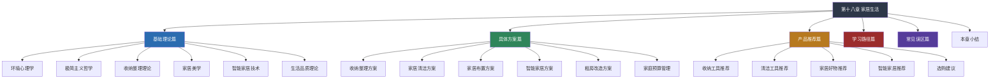

# 第十八章 家居生活

## 章节概览

### 为什么家居生活值得重视

家，是我们每天结束忙碌后回归的港湾，是我们休息、恢复、成长的空间。一个人的家居环境，不仅影响着他的身体健康和心理状态，更深刻地塑造着他的生活品质和幸福感。

你是否有过这样的体验：走进一个整洁、温馨的房间，心情立刻变得舒畅；而走进一个杂乱、拥挤的空间，莫名地感到烦躁和压抑。这并非偶然——环境心理学的研究已经充分证明，我们的居住环境会直接影响情绪、认知和行为。

在快节奏的现代生活中，很多人忽视了家居生活的重要性。他们把大部分精力投入到工作和社交中，回到家只是睡觉和充电。但事实上，家居生活的质量决定了我们"充电"的效率。一个舒适、有序、有品质的家居环境，能够帮助我们更快地恢复精力，更好地面对生活的挑战。

#### 居住环境对身心的影响：数据说话

居住环境对人的影响不是玄学，而是有大量实证研究支撑的科学事实：

| 影响维度 | 研究发现 | 来源 |
|---------|---------|------|
| **压力水平** | 居住在杂乱环境中的人，皮质醇（压力激素）水平比整洁环境居住者高 23% | UCLA Center on Everyday Lives and Families |
| **睡眠质量** | 卧室环境整洁、光线适宜的人，入睡时间缩短 37%，深度睡眠比例提高 19% | National Sleep Foundation |
| **认知功能** | 在整洁环境中工作的人，任务完成效率提高 15%，错误率降低 12% | Princeton Neuroscience Institute |
| **情绪状态** | 居住在有自然光照和绿植环境中的人，抑郁症状发生率降低 32% | Journal of Environmental Psychology |
| **社交意愿** | 对自己居住环境满意的人，邀请朋友做客的频率是不满意者的 2.4 倍 | American Sociological Review |

这些数据清楚地表明：投入时间和精力改善家居环境，不是"矫情"，而是对身心健康的一种高回报投资。

#### 家居生活与个人发展的关联

家居生活不仅仅是"把家收拾干净"这么简单。它与个人发展有着深层的关联：

**自律的训练场。** 维持一个整洁有序的家，本身就是一种日常自律的练习。这种自律会迁移到工作和学习中。一个连自己生活空间都管理不好的人，很难在更大的领域展现出优秀的自我管理能力。

**审美的培养皿。** 家居布置是一个持续的审美实践过程。从选择一件家具到搭配一组色彩，这些日常的审美决策会逐步提升你的品味和判断力。

**创造力的孵化器。** 一个舒适、有秩序的空间能够显著提升创造力。很多作家、设计师、程序员都强调，一个好的工作/生活空间是高质量产出的前提条件。

**人际关系的润滑剂。** 一个温馨有品味的家，会让你更愿意邀请朋友来做客，也会让你的伴侣和家人感到被重视。家居生活的品质直接影响家庭关系的和谐度。

### 本章完整内容地图

本章从理论到实践，构建了一个完整的家居生活知识体系。以下是完整的内容地图，帮助你快速定位自己需要的内容：

#### 基础理论篇：理解"为什么"

基础理论篇是整个章节的地基。不理解原理，实践就会变成盲目模仿。这一部分包含六个核心理论模块：

**环境心理学** 是理解家居生活的第一把钥匙。它解释了为什么某些空间让你感到放松，而另一些让你焦虑；为什么自然光能改善心情，为什么噪音会降低专注力。掌握环境心理学的基本原理，你就能有意识地设计自己的居住环境，而不是凭感觉乱来。核心知识点包括：环境-行为关系模型、场所依恋理论、恢复性环境理论、环境压力模型。

**极简主义哲学** 不是让你把所有东西扔掉，而是帮你建立一种"有意识拥有"的生活态度。这一部分会深入探讨极简主义的思想源流（从梭罗到近藤麻理惠）、极简主义的多种实践形态（从数字极简到财务极简）、以及如何在消费主义盛行的社会中找到自己的平衡点。核心问题是：你拥有的东西，是在服务你，还是在消耗你？

**收纳整理理论** 超越"把东西放进盒子里"的层面，探讨空间组织的底层逻辑。包括：动线设计原理（如何根据生活习惯规划物品位置）、频率-位置匹配原则（高频物品就近放置，低频物品集中存放）、视觉信息管理（为什么"看不见"比"放得整齐"更有效）。

**家居美学** 讲的是如何让家"好看"。不是让你成为室内设计师，而是掌握基本的审美原则：色彩搭配的 60-30-10 法则、材质混搭的平衡感、空间比例与视觉重心、不同风格（北欧/日式/中式/现代简约）的核心特征和适用场景。

**智能家居技术** 帮助你理解当前智能家居的技术生态：主流协议（Zigbee/Wi-Fi/蓝牙/Matter）的区别与选择、核心设备品类（照明/安防/环境/家电）、不同预算档位的搭建方案、以及隐私安全的注意事项。

**生活品质理论** 从更宏观的视角审视家居生活。什么是"好生活"？生活品质由哪些要素构成？如何在物质享受和精神满足之间找到平衡？这一部分会引入马斯洛需求层次、积极心理学的 PERMA 模型、以及日本和北欧的不同生活哲学。

#### 具体方案篇：知道"怎么做"

具体方案篇是本章的核心，将理论转化为可执行的操作。每个方案都包含：目标说明、所需工具/材料、分步骤操作指南、时间估算、常见问题应对。

**收纳整理方案** 覆盖六大空间（玄关/客厅/卧室/厨房/卫生间/阳台）的系统整理方法。核心流程是：清空→分类→筛选→归位→维护。特别值得注意的是"一次整理，长期维护"的理念——真正的收纳不是一次性大扫除，而是建立一套日常运转的系统。

**家居清洁方案** 提供科学的清洁体系：日清洁（10 分钟快速整理）、周清洁（各区域深度清洁轮换）、月清洁（死角清洁和设备维护）、季清洁（换季整理和大件清洁）。还会讲解不同材质（实木/不锈钢/瓷砖/玻璃/布艺）的清洁要点和禁忌。

**家居布置方案** 从零开始教你布置一个房间：空间测量与平面图绘制、家具尺寸选择与摆放原则、灯光设计（主灯+辅助灯+氛围灯的三层照明）、软装搭配（窗帘/地毯/抱枕/挂画的协调方法）。

**智能家居方案** 提供三个预算档位的搭建路径：入门级（500 元以内，智能灯泡+智能插座+语音助手）、进阶级（2000-5000 元，全屋照明+安防+环境监测）、专业级（1 万元以上，全屋联动+自动化场景）。

**租房改造方案** 专门面向租房群体：如何在不破坏房屋结构的前提下提升居住品质。核心策略包括：可逆改造（免钉挂钩/自粘壁纸/可拆卸地板贴）、视觉改造（灯光/窗帘/软装的力量）、功能改造（移动家具/模块化收纳）。

**家庭预算管理** 教你如何在有限预算内最大化家居改善效果。包括：家居消费的优先级排序、性价比最优的采购时机、DIY 与购买的决策框架、二手家具的选购技巧。

#### 产品推荐篇：选择"用什么"

产品推荐篇是工具层面的指南，帮助你在海量的家居产品中做出明智选择。我们不做简单的"好物清单"，而是提供：

- 每个品类的选购逻辑（什么参数重要，什么是营销噱头）
- 不同预算档位的推荐方案
- 真实使用体验和长期耐久性评估
- 常见智商税产品的识别方法

涵盖五大品类：收纳工具（从基础收纳盒到专业收纳系统）、清洁工具（从传统工具到智能清洁设备）、家居好物（提升幸福感的实用好物）、智能家居设备（各品类的选购指南）、以及综合选购建议（如何看参数、如何比价、如何避坑）。

#### 学习路径篇：规划"怎么学"

学习路径篇为不同起点的读者设计个性化的提升路线。不是所有人都需要从头学起——如果你已经有良好的整理习惯，可以直接跳到进阶内容。

#### 常见误区篇：避免"踩什么坑"

家居生活中有很多似是而非的观念在流传。这一部分逐一拆解常见误区，包括但不限于：

- "整理就是扔东西" → 整理的核心是建立系统，不是简单丢弃
- "收纳就是买收纳盒" → 没有经过筛选的收纳只是把混乱藏起来
- "好家居要花大钱" → 很多高性价比的方法被忽视了
- "极简就是空无一物" → 极简是拥有刚好够用的东西，不是苦行
- "智能家居是智商税" → 选对设备和场景，智能化确实能提升效率
- "租房不值得投入" → 租来的房子也是你生活的主场

### 家居生活的核心理念

在开始学习之前，请先建立以下五个核心理念。它们将贯穿整章内容，是所有具体方案的底层逻辑。

#### 第一，家是为自己而存在的

家居布置不需要迎合他人的审美，最重要的是让自己感到舒适和愉悦。不要因为追求"好看"而牺牲实用性，也不要因为追求"高级感"而忽略个人偏好。

这个理念看似简单，但在实践中极易被社交媒体上的"家居博主"带偏。你看到的那些完美家居照片，往往是精心摆拍的产物——拍摄前会收拾 2 小时，拍摄后东西又会乱回去。真实的家是生活的地方，不是展览馆。

**实践检验标准：** 如果一件家居物品让你使用时感到不便（比如为了好看买的高脚杯，但每次用都要小心翼翼），那它就违背了"家是为自己而存在"的原则。

#### 第二，整理是起点，不是终点

整理只是家居生活的第一步，真正的目标是建立一套可持续的生活系统，让整洁成为自然而然的状态，而非需要反复努力才能维持的成果。

很多人陷入"整理→变乱→再整理"的死循环，根本原因是只做了"整理"这一步，而没有建立"维护"的机制。一个真正有效的家居系统，应该满足以下条件：

- 每件物品都有固定的"家"（存放位置）
- 取用和归位的动作足够简单（三步以内完成）
- 日常维护每天只需 10-15 分钟
- 家庭成员都理解并遵守基本规则

#### 第三，少即是多

拥有更少但更好的物品，往往比拥有大量廉价物品带来更高的生活品质。学会选择和取舍，是家居生活的重要课题。

这不意味着要你把所有东西都扔掉。"少即是多"的核心是：**每一件你决定拥有的东西，都应该经过有意识的选择。** 问自己三个问题：

1. 我在过去 6 个月里用过它吗？（频率判断）
2. 如果丢了它，我会在一周内重新购买吗？（必要性判断）
3. 它是否在服役期内，功能完好？（状态判断）

三个问题的答案都是"是"，才值得保留。

#### 第四，仪式感让生活更有温度

在日常生活中加入小小的仪式感，能够让平凡的日子变得特别。一杯精心冲泡的咖啡、一束鲜花、一段安静的阅读时光，都是生活仪式感的体现。

仪式感不是"小资情调"，而是一种对日常生活的尊重和珍视。心理学研究表明，带有仪式感的日常活动能够显著提升主观幸福感——因为它迫使你放慢节奏，专注于当下，而不是永远在赶往下一个任务。

**低成本仪式感清单：**
- 早起后打开窗户深呼吸 30 秒
- 用喜欢的杯子喝每天的第一杯水
- 每周买一束鲜花放在桌上
- 晚饭后点一支香薰蜡烛
- 睡前写下今天的三件好事

#### 第五，预算是约束，不是障碍

提升家居生活品质不一定需要大量花费。很多改善只需要改变习惯和思维方式，而非购买昂贵的物品。

事实上，一些最有效的家居改善是零成本的：

| 改善措施 | 成本 | 效果 |
|---------|------|------|
| 重新规划物品摆放位置 | 0 元 | 动线效率提升 30%+ |
| 每天定时 10 分钟快速整理 | 0 元 | 维持基础整洁度 |
| 减少不必要的物品 | 0 元（甚至能卖钱） | 释放空间，降低维护负担 |
| 保持窗户清洁，最大化自然光 | 0 元 | 改善采光和心情 |
| 定期清洗窗帘和床品 | 洗涤剂费用 | 空气清新度显著提升 |

### 本章学习路径导览

不同起点的读者，应该采用不同的阅读策略。以下是三种典型路径：

#### 路径 A：从零开始（家居小白）

**适合人群：** 刚刚独立生活、感觉家里总是乱糟糟、不知道从哪里开始的人。

**阅读顺序：**
1. 先读本篇（章节概览），建立基本认知
2. 跳到「常见误区篇」，避免走弯路
3. 读「基础理论篇」的环境心理学和收纳整理理论
4. 直接进入「具体方案篇」的收纳整理方案，跟着做
5. 根据需要阅读产品推荐

**预估投入时间：** 阅读 3-4 小时 + 实践 1-2 个周末

#### 路径 B：进阶提升（有基础的人）

**适合人群：** 家里基本整洁，但想进一步提升品质和美感的人。

**阅读顺序：**
1. 浏览本篇，了解章节全貌
2. 按兴趣选读「基础理论篇」（推荐家居美学和生活品质理论）
3. 重点阅读「具体方案篇」的家居布置方案和智能家居方案
4. 参考产品推荐进行有针对性的升级

**预估投入时间：** 阅读 2-3 小时 + 持续优化

#### 路径 C：专项突破（有针对性需求的人）

**适合人群：** 有明确的需求（如租房改造、预算有限、想做智能家居）的人。

**阅读策略：** 直接跳到对应的小节，按需阅读。每个小节都是相对独立的模块，可以单独学习和应用。

### 本章适用人群

- 刚刚独立生活，需要学习基本家务技能的年轻人
- 感觉家里总是乱糟糟，想要改变现状的人
- 希望提升生活品质，让家更舒适的人
- 想要在有限预算内打造理想家居的人
- 对收纳整理感兴趣，想要系统学习的人
- 租房群体，想在不改造房屋的前提下提升居住体验
- 对智能家居感兴趣，想了解如何入门的人
- 希望通过改善家居环境来提升工作效率和心理健康的人

### 开始之前：家居现状自评

在正式开始学习之前，建议你花 5 分钟做一个简单的自我评估，明确自己当前的状态和最需要改善的方向。

**自评清单（每项 1-5 分，1=很差，5=很好）：**

| 评估维度 | 评估内容 | 你的评分 |
|---------|---------|---------|
| 整洁度 | 地面和桌面是否整洁，物品是否归位 | ___ |
| 收纳系统 | 每件物品是否有固定的存放位置 | ___ |
| 清洁习惯 | 是否有规律的清洁计划并执行 | ___ |
| 视觉美感 | 家里的色彩、灯光、装饰是否协调 | ___ |
| 功能布局 | 空间动线是否合理，取用物品是否方便 | ___ |
| 空气与光线 | 自然光是否充足，通风是否良好 | ___ |
| 舒适度 | 家具是否舒适，温度湿度是否适宜 | ___ |
| 仪式感 | 是否有让自己感到愉悦的日常仪式 | ___ |
| 预算控制 | 家居消费是否在合理范围内 | ___ |
| 总体满意度 | 对自己的居住环境总体是否满意 | ___ |

**评分解读：**
- **40-50 分：** 你的家居状态已经很好，可以直接学习进阶内容
- **30-39 分：** 有不错的基础，在某些方面需要优化
- **20-29 分：** 需要系统性地改善，建议从基础开始
- **10-19 分：** 别担心，每个人都是从零开始的，本章会一步步带你走

把你的评分记下来。等学完本章全部内容后，再做一次自评，你会清楚地看到自己的进步。

让我们一起开始打造理想中的家居生活。
