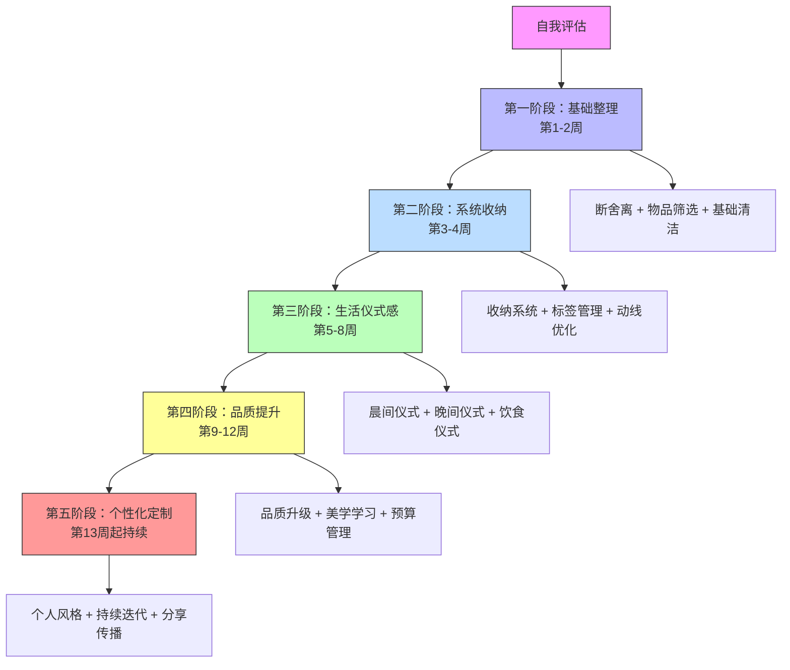
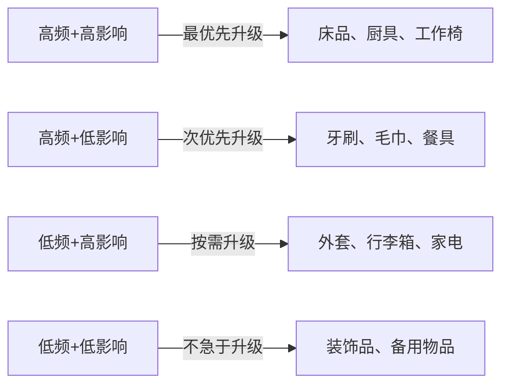

# 家居生活：学习路径

## 一、为什么需要学习路径

很多人尝试改善家居生活时会遇到两种困境：一种是不知道从哪里开始，面对满屋子的杂物感到无从下手，最终不了了之；另一种是兴致勃勃地买了一堆收纳工具和家居好物，结果家里没有变整洁，反而多了一堆"收纳盒里的混乱"。

这两种困境的根源相同——缺乏系统性的路径规划。家居生活是一门涵盖环境心理学、空间规划、收纳管理、清洁维护、生活美学的综合技能，不是"买几本书看几个视频"就能掌握的。它需要按照正确的顺序，从基础到高级，逐步建立能力。

### 1.1 学习路径的理论基础

这个路径的设计基于三个经过验证的学习理论：

**库里克学习曲线理论**：学习新技能时，初期的进步速度最快，随后进入平台期。因此路径将最容易看到效果的"整理收纳"放在最前面，让你在第一周就能感受到明显变化，建立信心和动力。

**习惯堆叠理论（Habit Stacking）**：行为科学教授BJ Fogg的研究表明，新习惯最容易在已有习惯之后建立。路径中的习惯建立遵循"锚定→执行→奖励"的链条——比如"喝完早咖啡（锚定）→整理床铺（执行）→看5分钟喜欢的视频（奖励）"。

**刻意练习理论**：心理学家Anders Ericsson的研究发现，刻意练习是技能提升的核心。路径中每个阶段都设定了明确的目标、练习内容和评估标准，避免"随便做做"导致的原地踏步。

### 1.2 学习路径总体框架

---

## 二、开始之前：自我评估

在选择学习路径之前，先花10分钟做一个自评，确定你的起点。

### 2.1 家居现状评分表

对以下10个项目进行评分（1-5分，1=非常差，5=非常好）：

| 评估维度 | 1分（很差） | 3分（一般） | 5分（很好） | 你的评分 |
|----------|------------|------------|------------|---------|
| **衣物管理** | 衣柜塞满找不到衣服 | 基本整齐但有闲置衣物 | 分类清晰、全部合身穿着 | __ |
| **厨房状态** | 过期食品堆积、厨具混乱 | 基本整洁但效率不高 | 干净高效、做饭很顺手 | __ |
| **物品总量** | 到处堆满杂物 | 有些区域比较乱 | 每件物品都有固定位置 | __ |
| **清洁习惯** | 积灰严重才打扫 | 偶尔打扫，不够规律 | 每天花15分钟日常清洁 | __ |
| **空间利用** | 很多空间被浪费 | 部分空间利用合理 | 每个角落都利用得当 | __ |
| **氛围感受** | 回家觉得压抑 | 回家无特别感受 | 回家感到放松舒适 | __ |
| **仪式感** | 完全没有生活仪式 | 偶尔有仪式感时刻 | 每天都有小仪式 | __ |
| **来客信心** | 不好意思请人来做客 | 稍作整理才能接待 | 随时欢迎朋友来访 | __ |
| **物品品质** | 大部分物品凑合用 | 核心物品品质不错 | 关键物品都精心挑选 | __ |
| **维护系统** | 没有固定维护计划 | 偶尔想起来会维护 | 有完善的维护周期表 | __ |

**总分解读**：

- **10-20分**：从第一阶段开始，你需要全面的基础整理
- **21-30分**：从第一或第二阶段开始，重点解决收纳问题
- **31-40分**：可以从第二或第三阶段开始，基础已具备
- **41-50分**：从第四阶段开始，重点在品质和美学提升

### 2.2 确定优先级

不是所有维度都需要同时提升。根据你的生活状态确定优先级：

| 你的现状 | 最高优先级 | 原因 |
|----------|-----------|------|
| 刚搬新家/刚独立生活 | 物品管理 → 清洁习惯 | 先建立基础秩序 |
| 家里很乱但不想大动 | 一个房间 → 一个区域 | 小范围成功带来动力 |
| 基本整洁但缺乏品质 | 生活仪式感 → 品质升级 | 从体验层面提升 |
| 什么都想改善 | 按阶段顺序来 | 系统性最高效 |

---

## 三、第一阶段：基础整理（第1-2周）

这个阶段的目标不是让家变得完美，而是完成一次"重启"——把累积的混乱清理掉，建立一个可以继续优化的基础状态。

### 3.1 阶段目标

- 完成全屋物品筛选，淘汰30%以上的闲置物品
- 学会基础的整理分类方法
- 建立每日15分钟清洁的基本习惯
- 让每个房间恢复"可用"状态

### 3.2 核心理论：断舍离的正确打开方式

断舍离不是"扔扔扔"，而是一套有逻辑的决策系统。它的核心是三个判断标准：

**使用频率判断**：过去12个月内没有使用的物品，大概率不再需要。但有例外——季节性物品（冬衣、电风扇）和应急物品（急救箱、灭火器）不适用此规则。

**情感价值判断**：有真实情感价值的物品（亲人照片、手写信件）值得保留，但"也许将来某天会用到"不是情感价值，而是损失厌恶心理在作祟。

**替代成本判断**：如果扔掉后能用100元以内重新买到的物品，不值得为它占用你昂贵的居住空间。

### 3.3 每日执行计划

#### 第1天：准备工作与衣物整理启动（2-3小时）

**准备工作清单**：

- 准备4个大号垃圾袋，分别标记"丢弃""捐赠""转卖""待定"
- 准备清洁用品（抹布、清洁剂、垃圾袋）
- 拍照记录整理前的状态（这是你的"进度起点"，后面对比会很有成就感）

**衣物整理流程**：

1. 把衣柜里所有的衣物搬到床上或地板上（是的，全部拿出来）
2. 逐一拿起每件衣物，问自己三个问题：
   - 过去12个月我穿过它吗？
   - 它合身吗？穿着好看吗？
   - 如果在商店看到它，我会花钱买吗？
3. 三个问题中有两个"否"，放入对应的袋子里
4. 对于犹豫不决的衣物，放入"待定"袋，设置30天观察期——30天内没有想起来要穿，就处理掉

**KonMari折叠法详解**：

近藤麻理惠的折叠法的核心理念是让衣物"站立"在抽屉里，而不是平铺堆放。这样每件衣物都能一目了然，取用时不会弄乱其他衣物。

折叠步骤（以T恤为例）：

1. 将T恤正面朝下平铺
2. 将左右两侧向中间折叠，形成一个长条
3. 将长条从下往上折叠成三折或四折
4. 折好的T恤应该能够自己"站立"在平面上

不同衣物的折叠策略：

| 衣物类型 | 折叠方法 | 存放位置 |
|----------|---------|---------|
| T恤/卫衣 | KonMari标准折叠 | 抽屉，竖立排列 |
| 衬衫 | 挂起来或KonMari折叠 | 衣架或抽屉 |
| 裤子 | 对折后挂起，或三折后竖立 | 裤架或抽屉 |
| 内衣袜子 | 卷起来或专用格子 | 抽屉分隔盒 |
| 外套大衣 | 全部挂起来 | 衣柜挂衣区 |
| 围巾帽子 | 卷起放入收纳盒 | 衣柜顶部或抽屉 |

#### 第2-3天：厨房整理（2-3小时）

厨房是家里最容易积累过期物品和冗余工具的区域。整理厨房需要更强的决断力，因为很多东西看起来"还能用"。

**清理流程**：

1. **冰箱清理**（30分钟）：
   - 检查所有食品的保质期，过期的直接丢弃
   - 打开闻一下可疑的酱料和调味品
   - 用温水+小苏打擦拭冰箱内壁
   - 清理冰箱密封条（这里最容易发霉）

2. **调料区清理**（20分钟）：
   - 保质期超过2年的干货调料检查是否变质
   - 同类型的调料只保留一份（3瓶酱油只留1瓶）
   - 将调料按使用频率排列：常用的放在灶台旁

3. **厨具筛选**（30分钟）：
   - 重复功能的只保留最好用的那一件
   - 缺角、掉漆、变形的餐具淘汰
   - 一年没用过的特殊厨具（比如只用过一次的蛋糕模具）考虑处理

4. **橱柜整理**（30分钟）：
   - 按功能分区：烹饪区、备餐区、餐具区、储物区
   - 重的物品放下层，轻的放上层
   - 常用的物品放在最容易拿取的位置（黄金区域：腰部到视线高度）

#### 第4-5天：卫生间与客厅（各1-2小时）

**卫生间整理重点**：

- 清理过期的化妆品和护肤品（大部分护肤品开封后保质期只有6-12个月）
- 淘汰发硬的毛巾和牙刷（牙刷建议3个月更换一次）
- 清理积攒的小样和旅行装（超过半年没用的基本不会再用）
- 检查药品箱，丢弃过期药品

**客厅整理重点**：

- 整理堆积的遥控器（一个万能遥控器可以替代5-6个）
- 收纳散落的充电线（用扎带或理线器整理）
- 清理茶几和沙发上的杂物（只保留当天会用到的物品）
- 整理电视柜和书架

#### 第6-7天：全屋深度清洁

在物品整理完成后，进行一次全屋深度清洁：

**清洁顺序原则**：从上到下，从里到外。先清洁天花板和高处，灰尘会自然落到低处，最后统一清洁地面。每个房间的清洁顺序：顶部→墙面→家具表面→地面。

**清洁清单**：

| 区域 | 清洁项目 | 频率建议 |
|------|---------|---------|
| 卧室 | 更换床单被套、擦拭床头柜、清理衣柜顶部 | 深度清洁 |
| 厨房 | 抽油烟机滤网、灶台缝隙、水槽排水口 | 深度清洁 |
| 卫生间 | 马桶底座、淋浴间水垢、排风扇 | 深度清洁 |
| 客厅 | 窗帘除尘、沙发缝隙、空调滤网 | 深度清洁 |
| 全屋 | 擦窗户、拖地、门把手消毒 | 每周一次 |

#### 第2周：建立每日清洁习惯

深度清洁完成后，重点转向建立可持续的日常习惯。

**15分钟日常清洁方案**：

早晨（5分钟）：
  - 起床后立即整理床铺（1分钟）
  - 洗完脸擦拭洗手台（1分钟）
  - 检查厨房台面，简单擦拭（2分钟）
  - 出门前环顾一圈，归位散落物品（1分钟）

晚上（10分钟）：
  - 饭后立即洗碗或启动洗碗机（5分钟）
  - 擦拭灶台和餐桌（2分钟）
  - 扫地或用吸尘器清理重点区域（2分钟）
  - 检查各台面，将不属于该位置的物品归位（1分钟）

**习惯养成的关键技巧**：

- **绑定已有习惯**：把清洁动作绑定到你已经在做的事情上。比如"洗完碗后立刻擦灶台"，而不是"找个时间擦灶台"。
- **降低启动门槛**：清洁工具放在最容易拿到的地方。抹布挂在水槽旁，扫帚放在厨房角落。
- **计时器法**：设置15分钟倒计时，开始清洁。时间到了就停止，不管做没做完。这能避免"做起来就停不下来"的焦虑感，也能让大脑觉得"只需要15分钟"从而更容易开始。

### 3.4 第一阶段里程碑检查

完成第一阶段后，你应该达到以下标准：

- [ ] 全屋物品数量减少了至少30%
- [ ] 每个房间可以正常使用，没有"无处下脚"的区域
- [ ] 掌握了KonMari折叠法，衣物整齐竖立在抽屉中
- [ ] 冰箱和调料区没有过期物品
- [ ] 建立了每天15分钟清洁的习惯，已连续执行7天以上
- [ ] 拍一张"整理后"的照片，与第1天的对比

---

## 四、第二阶段：系统收纳（第3-4周）

基础整理清除了多余的物品，现在要做的是为剩下的物品建立一套"各就各位"的管理系统。

### 4.1 阶段目标

- 为每类物品确定固定的存放位置
- 建立标签化的收纳系统
- 优化家居动线，减少不必要的走动
- 实现"30秒内找到任何需要的物品"

### 4.2 核心理论：收纳的三层体系

高效的收纳系统不是"把东西塞进盒子里"，而是遵循一个三层体系：

**第一层：功能分区**。把家按照使用场景分成若干区域——烹饪区、衣物区、清洁区、工作区、休闲区。每个区域内的物品都应该与该区域的功能相关。你不会在卧室里放拖把，也不会在厨房里放书——这就是功能分区的逻辑。

**第二层：使用频率**。在每个功能区内，按照使用频率排列物品。每天都用的放在最容易拿到的位置（腰部高度，视线范围内）；每周用一两次的放在稍远一些的位置；每月或更少使用的放在高处或深处。

**第三层：分类标签**。同一类物品集中存放，并用标签标识。标签不需要花哨，简单的手写标签贴在收纳盒外面就足够好。关键是一致性——所有标签用同一种风格，同一种字体大小。

### 4.3 各空间收纳方案详解

#### 衣柜收纳系统

**空间分配原则**：

┌─────────────────────────┐
│    换季衣物/行李箱       │  ← 高处（不常用）
├─────────────────────────┤
│    当季外套/大衣         │  ← 挂衣区上层
│    衬衫/连衣裙           │  ← 挂衣区中层
├─────────────────────────┤
│    ┌───┬───┬───┬───┐    │
│    │T恤│裤子│内衣│袜子│    │  ← 抽屉区（KonMari折叠）
│    └───┴───┴───┴───┘    │
├─────────────────────────┤
│    鞋子/包包             │  ← 底部
└─────────────────────────┘

**具体收纳技巧**：

- **挂衣区**：统一使用同一种衣架（推荐植绒衣架，防滑且薄，节省空间）。按颜色从浅到深排列，视觉整齐且方便找衣服。
- **抽屉区**：使用抽屉分隔板将空间分成小格。每格放一类物品，折叠方式统一。
- **包包收纳**：不用的包里塞入填充物保持形状，放在衣柜顶部或专用包架上。
- **换季处理**：换季时把不穿的衣服用真空压缩袋压缩后放入收纳箱，标注内容物和季节。

#### 厨房收纳系统

**黄金三角原则**：冰箱→水槽→灶台，这三个点构成厨房的工作三角。收纳安排应该让这个三角的移动路径最短。

| 区域 | 收纳内容 | 收纳工具 |
|------|---------|---------|
| 灶台旁 | 常用调料、锅铲、锅 | 调料架、挂钩、锅架 |
| 水槽上方/下方 | 洗洁精、海绵、垃圾袋 | 水槽沥水架、壁挂收纳 |
| 冰箱 | 食材、饮料、酱料 | 冰箱收纳盒、鸡蛋架 |
| 操作台面 | 电饭煲、热水壶（仅限高频电器） | 不放杂物，保持台面空旷 |
| 吊柜 | 不常用餐具、干货、备用调料 | 透明收纳盒+标签 |
| 地柜 | 锅具、米面、清洁用品 | 可抽拉式置物架 |

**厨房收纳的关键细节**：

- 台面只保留每天至少使用一次的电器和工具，其他收入柜中
- 调料瓶统一规格和标签方向，视觉整洁且方便取用
- 冰箱门架放酱料和饮料，冷藏室上层放剩菜和即食食品，中层放蔬菜，下层放生肉（防止滴漏污染）
- 用透明容器储存干货（大米、面条、豆类），既防虫又一目了然

#### 卫生间收纳系统

卫生间通常空间最小但物品种类最多，收纳的核心是"向上借空间"。

- **镜柜内部**：用小型收纳盒分隔，护肤品、药品、化妆品各占一格
- **洗手台下方**：安装可抽拉置物架，放备用洗浴用品和清洁用品
- **马桶上方**：安装置物架，放毛巾和装饰品
- **淋浴区**：使用壁挂置物架（免打孔款），放洗发水和沐浴露
- **门后空间**：安装挂钩，放浴袍和换洗衣物

### 4.4 标签管理系统

标签是收纳系统的"索引"，没有标签的收纳和没有目录的书一样。

**标签制作方案**：

| 方案 | 适用场景 | 成本 | 效果 |
|------|---------|------|------|
| 手写标签+透明胶带 | 快速标注，临时方案 | 几乎为零 | ★★★ |
| 标签打印机（如精臣） | 长期使用，美观需求 | 100-200元 | ★★★★★ |
| 可擦写标签贴 | 内容经常变化的收纳盒 | 20-50元 | ★★★★ |
| 彩色标签纸+马克笔 | 按颜色区分区域 | 10-20元 | ★★★★ |

**标签内容规范**：

- 用名词而非动词："药品"而不是"放药品"
- 标注关键信息：药品标签加上有效期
- 保持一致性：全屋使用同一种标签风格
- 标签位置统一：收纳盒正面右下角或正面中央

### 4.5 动线优化

动线是指你在家里从一个位置移动到另一个位置的路径。好的动线设计能减少不必要的走动，提高日常效率。

**动线优化的方法**：

1. **观察记录**：花一天时间留意自己在家中的移动路径。从起床到出门，做了哪些移动？哪些是重复的、可以减少的？

2. **物品就近原则**：把物品放在使用它的地方，而不是"收纳它"的地方。比如钥匙放在门口而不是抽屉里，遥控器放在茶几上而不是电视柜里。

3. **消除动线障碍**：检查主要走动路径上是否有障碍物。门口放鞋架挡住通道？走廊堆了杂物？这些都是需要清除的。

4. **设置"中转站"**：在动线交汇点设置小型收纳点。比如玄关放钥匙托盘和雨伞架，床头放手机充电位和眼镜盒。

### 4.6 收纳工具选购指南

**先做收纳规划，再买工具**。量好尺寸、确定需求后再下单。

| 推荐工具 | 适用场景 | 选购要点 | 参考价格 |
|----------|---------|---------|---------|
| 抽屉分隔板 | 衣柜、书桌 | 可调节宽度，免安装 | 20-50元/套 |
| 植绒衣架 | 衣柜 | 超薄防滑，统一颜色 | 2-3元/个 |
| 透明收纳盒 | 换季衣物、杂物 | 带盖防尘，可叠加 | 15-40元/个 |
| 冰箱收纳盒 | 冰箱 | 食品级材质，带沥水功能 | 10-30元/个 |
| 壁挂置物架 | 厨房、卫生间 | 免打孔，承重够 | 30-80元/个 |
| 标签打印机 | 全屋通用 | 热敏打印，APP编辑 | 100-200元 |

**不推荐购买的收纳工具**：

- 花哨但不实用的"网红收纳神器"——大部分用两次就闲置
- 尺寸固定的收纳盒（无法适配不同大小的物品）
- 不透明的收纳盒（看不见里面放了什么，时间久了就忘了）
- 过于复杂的收纳系统（维护成本太高，三天就会放弃）

### 4.7 第二阶段里程碑检查

- [ ] 每件常用物品都有固定的存放位置
- [ ] 衣柜收纳系统完善，能在30秒内找到想要的衣服
- [ ] 厨房收纳系统完善，做饭动线流畅
- [ ] 主要收纳盒/抽屉都有标签
- [ ] 家中主要走动路径无障碍物
- [ ] 可以在不看标签的情况下，说出任意一类物品的存放位置

---

## 五、第三阶段：生活仪式感（第5-8周）

当家居环境从混乱变得有序之后，下一步是让这个有序的空间变得有温度。仪式感不是奢侈的装饰，而是让平凡日常变得值得回味的微小设计。

### 5.1 阶段目标

- 建立稳定的晨间仪式和晚间仪式
- 提升烹饪和用餐的体验感
- 学会用低成本方式营造家居氛围
- 形成"主动享受生活"的意识和习惯

### 5.2 核心理论：仪式感的心理学机制

为什么仪式感能提升幸福感？哈佛商学院的研究给出了两个解释：

**注意力锚定效应**：仪式感的本质是让你把注意力集中在当下。当你用漂亮的杯子喝咖啡时，你不仅仅是在"喝咖啡"，而是在"品味这一刻"。这种注意力的聚焦能激活大脑的奖赏系统，让同样的事物产生更强的愉悦感。

**意义建构机制**：人类的大脑天生需要"意义"。仪式感把普通的日常行为转化为有象征意义的行动——早晨的第一杯咖啡不仅是补充咖啡因，更是"新一天开始"的信号。这种意义建构让我们对生活有更强的掌控感和满足感。

### 5.3 晨间仪式设计

晨间仪式不需要很长，15-30分钟就足够。关键是每天固定执行，形成稳定的心理启动程序。

**晨间仪式模板（基础版，15分钟）**：

06:30  起床，拉开窗帘让自然光进入
06:32  喝一杯温水（提前在床头放好保温杯）
06:35  简单拉伸或深呼吸3分钟
06:38  洗漱护肤
06:45  整理床铺（只需30秒，不求完美，拉平被子即可）
06:46  做早餐或冲咖啡/茶，用喜欢的杯子
06:50  安静地享用早餐，不看手机

**晨间仪式模板（进阶版，30分钟）**：

06:15  起床，拉开窗帘
06:17  喝温水 + 5分钟冥想或正念呼吸
06:22  简单运动（俯卧撑/瑜伽/散步任选其一，10分钟）
06:32  洗漱护肤
06:40  整理床铺 + 简单清扫卧室地面
06:43  准备早餐，认真摆盘
06:50  享用早餐，可以听轻音乐或播客
07:00  规划今天的3件最重要的事
07:05  出门准备

**设计原则**：

- 选择你真正享受的活动，而不是"应该做"的活动
- 固定顺序比固定时间更重要——大脑更容易记住顺序
- 每周给自己一天"自由日"，不执行固定仪式，避免变成负担

### 5.4 晚间仪式设计

晚间仪式的目标是从"工作模式"切换到"休息模式"，帮助大脑和身体放松。

**晚间仪式模板（90分钟）**：

20:30  停止处理工作消息和邮件
20:35  简单收拾房间（5分钟，物归原位）
20:40  洗澡/泡脚，使用喜欢的沐浴产品
21:00  护肤（不赶时间，慢慢来）
21:10  泡一杯花草茶或热牛奶
21:15  阅读纸质书（不是手机！）或写日记
21:45  准备明天的衣物和要带的东西
21:50  调暗灯光，播放白噪音或轻音乐
22:00  入睡

**晚间仪式的关键要素**：

- **电子设备隔离**：睡前1小时尽量不看手机屏幕。蓝光会抑制褪黑素分泌，影响入睡质量。如果做不到完全不用手机，至少开启夜间模式并降低亮度。
- **环境信号**：调暗灯光是告诉大脑"该休息了"的最强信号之一。可以使用暖色台灯替代顶灯。
- **预置明天**：晚上花5分钟准备明天要穿的衣服和要带的东西，能显著降低早晨的决策疲劳和焦虑感。

### 5.5 饮食仪式感

饮食仪式感不需要昂贵的餐具或精湛的厨艺，只需要对"吃饭"这件事多投入一点注意力。

**低成本提升饮食仪式感的方法**：

- **摆盘**：即使是外卖，倒在盘子里吃也比在塑料盒里吃体验好10倍。准备一套简洁的白色餐具，百搭且出片。
- **餐桌布置**：不需要每次都铺桌布，但可以在餐桌中央放一个小花瓶，每周换一次花（超市鲜花10-20元一束）。
- **专注用餐**：吃饭时不看视频不刷手机，专注于食物的味道和口感。这不仅能提升用餐体验，还能帮助控制食量（研究表明分心进食会多吃25%）。
- **定期尝试新菜谱**：每周学做一道新菜。不需要复杂，简单的家常菜换个做法也是新鲜感。

### 5.6 氛围营造

家居氛围由四个要素构成：光线、气味、声音、触感。每个要素都可以用低成本方式改善。

| 要素 | 基础方案（0-50元） | 进阶方案（50-200元） |
|------|-------------------|---------------------|
| **光线** | 更换暖色灯泡（3000K） | 添加氛围灯/落地灯 |
| **气味** | 香薰蜡烛/无火香薰 | 扩香机+精油 |
| **声音** | 手机播放环境音乐 | 蓝牙音箱+环境音APP |
| **触感** | 添加一块柔软的地毯 | 更换高品质床品四件套 |

**灯光是最重要的氛围要素**。一盏暖色调的台灯可以彻底改变一个房间的感觉。色温选择建议：卧室和客厅用2700-3000K暖白光，书房和厨房用4000K中性白光，避免使用6500K冷白光作为日常照明（那是超市和办公室的色温）。

### 5.7 第三阶段里程碑检查

- [ ] 晨间仪式连续执行21天以上
- [ ] 晚间仪式连续执行14天以上
- [ ] 享受做饭的过程，而不仅仅是"解决吃饭问题"
- [ ] 家居氛围有明显改善（灯光、气味、整洁度）
- [ ] 有至少一项"每天都期待的小仪式"
- [ ] 朋友来家里做客时感受到了氛围变化

---

## 六、第四阶段：品质提升（第9-12周）

当家已经整洁有序、生活有了仪式感之后，下一步是提升物品和空间的品质。这个阶段的核心原则是"升级而非增量"——用更好的物品替代凑合的物品，而不是增加新的物品。

### 6.1 阶段目标

- 识别并升级高频使用物品的品质
- 学习基础的家居美学和色彩搭配
- 建立物品生命周期管理思维
- 制定可持续的家居维护计划

### 6.2 物品品质升级策略

**升级优先级矩阵**：

不是所有物品都值得升级。使用"频率×影响"矩阵来确定升级顺序：

**核心升级清单**：

| 物品 | 升级标准 | 推荐投入 | 升级理由 |
|------|---------|---------|---------|
| 床垫/枕头 | 乳胶或记忆棉材质 | 2000-5000元 | 人生1/3时间在床上，直接影响睡眠和健康 |
| 锅具 | 一口好炒锅+一口好汤锅 | 300-800元 | 好锅做菜更好吃，做饭体验完全不同 |
| 菜刀 | 一把好的主厨刀 | 200-500元 | 切菜效率和安全性大幅提升 |
| 毛巾 | 长绒棉或竹纤维 | 50-100元/条 | 每天使用，触感差异明显 |
| 床品四件套 | 60支以上纯棉或天丝 | 300-800元 | 睡眠体验直接提升 |
| 办公椅 | 人体工学椅 | 1000-3000元 | 久坐人群的脊椎保护 |

**升级购买原则**：

- **每次只升级一到两件物品**，体验后再决定下一步
- **先试后买**：能去实体店体验的就去体验，手感和质感只有亲手摸到才知道
- **关注核心功能而非附加功能**：一口好炒锅只需要不粘和导热均匀，不需要花哨的涂层和造型
- **计算"每次使用成本"**：一把300元的刀用5年（每天0.16元）比一把50元的刀用半年（每天0.27元）更划算

### 6.3 家居美学入门

美学不是天赋，是可以学习的知识体系。掌握以下几个基础原则，你的家就能提升一个档次。

**色彩搭配基础**：

家居配色遵循"6-3-1"法则：

- **60% 主色调**：墙面、地面、大型家具——选择中性色（白、灰、米白、浅木色）最安全
- **30% 辅助色**：窗帘、地毯、沙发——选择与主色调协调的颜色
- **10% 点缀色**：抱枕、花瓶、装饰画——可以大胆使用亮色

**风格速查表**：

| 风格 | 核心特征 | 配色方案 | 适合人群 |
|------|---------|---------|---------|
| 日式无印风 | 原木色+白色，线条简洁 | 米白+浅木色+绿色 | 喜欢简洁干净的人 |
| 北欧风 | 功能主义，自然材质 | 白+灰+原木+少量亮色 | 喜欢温暖实用的人 |
| 现代简约 | 少即是多，金属+玻璃 | 黑白灰+金属色 | 喜欢利落大气的人 |
| 侘寂风 | 自然质感，不完美之美 | 灰+米+陶土色 | 喜欢文艺安静的人 |
| 复古风 | 旧物件，暖色调 | 棕+墨绿+酒红 | 喜欢怀旧有故事感的人 |

**不需要纠结风格名称**。最实用的做法是：打开手机相册，找出你收藏的家居图片，分析它们的共同点——颜色、材质、布局——那就是你真正喜欢的风格。

### 6.4 维护系统建立

品质提升之后，需要一套维护系统来保持成果。

**家居维护周期表**：

| 频率 | 维护项目 | 预计时间 |
|------|---------|---------|
| **每天** | 物归原位、擦拭厨房台面、简单清扫 | 15分钟 |
| **每周** | 拖地、换洗床单、清洁卫生间、冰箱整理 | 1-2小时 |
| **每月** | 深度清洁厨房、清洗窗帘、检查过期物品 | 2-3小时 |
| **每季** | 换季衣物整理、空调滤网清洗、床垫翻转 | 半天 |
| **每年** | 全屋深度清洁、家电维护检查、物品大盘点 | 1-2天 |

**维护系统运行技巧**：

- 把维护任务写入日历或待办APP，设置提醒
- 每周固定一个"家庭维护日"（比如周六上午）
- 大任务拆小：与其"周末大扫除2小时"，不如"每天做20分钟，一周做6天"
- 维护时可以听播客或音乐，把它变成享受而非负担

### 6.5 第四阶段里程碑检查

- [ ] 至少升级了3件高频使用物品
- [ ] 家居配色有意识地遵循了6-3-1法则
- [ ] 确定了自己的家居风格方向
- [ ] 建立了维护周期表并执行了至少一个完整周期
- [ ] 可以自信地向朋友介绍自己的家居布置理念
- [ ] 开始享受维护家居的过程，而非觉得是负担

---

## 七、第五阶段：个性化定制（第13周起持续）

到了这个阶段，你已经掌握了家居生活的核心技能。接下来不再是学习"通用方法"，而是根据自己的生活方式、审美偏好和实际需求，定制属于自己的家居系统。

### 7.1 阶段目标

- 建立完全适合自己的家居管理系统
- 发展出个人的家居审美和生活哲学
- 将家居维护变成自动驾驶般的自动习惯
- 能够指导他人改善家居生活

### 7.2 个性化探索方向

**深度定制方向一：智能家居整合**

当基础家居管理已经稳定之后，可以通过智能家居进一步提升效率。不需要一步到位，从一个最痛点开始：

| 起点产品 | 解决的问题 | 入门预算 |
|----------|-----------|---------|
| 智能门锁 | 不用带钥匙、远程开门 | 800-2000元 |
| 扫地机器人 | 日常地面清洁 | 1500-3000元 |
| 智能灯泡/开关 | 灯光场景一键切换 | 50-300元 |
| 智能插座 | 定时开关电器 | 30-80元/个 |

**深度定制方向二：可持续家居**

- 建立家庭回收系统（可回收物、厨余垃圾、有害垃圾分类）
- 尝试自制清洁剂（白醋+小苏打可以解决80%的清洁问题）
- 选择环保材质的家居用品
- 减少一次性用品使用

**深度定制方向三：个人风格深化**

- 探索DIY家居装饰（旧物改造、手工制作）
- 建立自己的"家居灵感库"（收集喜欢的图片和创意）
- 培养花艺、陶艺等与家居相关的爱好
- 尝试季节性家居布置更换

### 7.3 持续迭代系统

**月度回顾模板**（每月花30分钟填写）：

本月家居回顾
─────────────
做得好的地方：
  1. _______________
  2. _______________

需要改善的地方：
  1. _______________
  2. _______________

下月计划：
  - _______________

新增物品清单：
  - _______________

处理物品清单：
  - _______________

家居预算使用情况：
  - 计划：____元
  - 实际：____元
  - 结余/超支：____元

**季节性调整清单**：

| 季节 | 调整重点 |
|------|---------|
| 春季 | 大扫除、换季衣物整理、添置绿植 |
| 夏季 | 更换薄床品、增加遮光窗帘、整理换季鞋 |
| 秋季 | 添置暖色调软装、准备秋冬被褥 |
| 冬季 | 添加温暖元素（地毯、暖灯）、节日装饰 |

---

## 八、不同人群的定制路径

以上是通用路径，但不同人群的起点和侧重点不同。以下是四类典型人群的定制方案。

### 8.1 独居年轻人

**典型画像**：20-30岁，租住一居室或合租单间，面积30-60㎡，预算有限。

**核心挑战**：空间小、物品少但杂乱、缺乏家务经验、容易"将就"。

**定制路径**：

| 周次 | 重点任务 | 预算建议 |
|------|---------|---------|
| 第1周 | 全屋断舍离（独居者衣物和杂物通常最容易堆积） | 0元 |
| 第2周 | 小空间收纳：利用床底、墙面、门后等垂直空间 | 100-200元 |
| 第3-4周 | 学习3-5道基础菜谱，建立简单的烹饪习惯 | 200-300元（基础调料和厨具） |
| 第5-6周 | 建立晨间/晚间仪式 | 0-50元 |
| 持续 | 每月添置1-2件提升品质的小物 | 每月50-100元 |

**独居专属建议**：

- 一个人住更需要仪式感，因为没有人督促和分享，容易陷入"反正只有自己看到"的将就心态
- 合租场景下重点管理好自己的私人空间，公共区域遵守基本规则即可
- 租房优先投资可带走的物品（好的床品、厨具、收纳工具），少做固定装修

### 8.2 新婚/同居伴侣

**典型画像**：两人物品合并，需要从两套习惯过渡到一套共同的系统。

**核心挑战**：物品合并筛选、空间分配协调、家务分工、习惯差异。

**定制路径**：

| 周次 | 重点任务 | 关键技巧 |
|------|---------|---------|
| 第1周 | 共同筛选物品（各自先处理自己的，再合并公共物品） | 各自对自己物品有决定权，公共物品协商 |
| 第2周 | 协商收纳空间分配（衣橱、浴室、书桌） | 用50/50原则，各占一半空间 |
| 第3周 | 建立家务分工系统 | 按偏好分工，而非按性别 |
| 第4周 | 共同设计生活仪式 | 找到两人都享受的共同仪式 |

**伴侣协作要点**：

- **物品决策权**：谁的东西谁决定去留，不要替对方决定。公共物品（家电、家具）协商决定。
- **家务分工**：不是"平均分配"而是"各取所长"。讨厌洗碗的人可以负责做饭，讨厌扫地的人可以负责洗衣服。关键是一起制定规则，而不是一方安排另一方执行。
- **冲突处理**：审美差异是正常的。解决方案是划定"个人领地"（各自的书桌区域、各自的床头柜）和"公共领地"（客厅、厨房）。公共领地协商风格，个人领地自由发挥。

### 8.3 有孩子的家庭

**典型画像**：有0-12岁孩子的家庭，物品量是无孩家庭的2-3倍。

**核心挑战**：物品爆发式增长、安全需求、多功能空间、培养孩子自理能力。

**定制路径**：

| 阶段 | 重点任务 | 关键原则 |
|------|---------|---------|
| 第1周 | 儿童物品专项整理（玩具、衣物、学习用品） | 孩子参与筛选，学会取舍 |
| 第2周 | 家居安全检查和改善 | 插座保护、桌角防撞、柜子固定 |
| 第3周 | 建立儿童物品收纳系统 | 按孩子身高设计，低处放常用物品 |
| 持续 | 培养孩子的整理习惯 | "玩完归位"规则 + 定期淘汰 |

**亲子家居核心建议**：

- **玩具管理**：用"玩具轮换制"——把玩具分成3-4组，每次只拿出一组，每1-2周轮换。这样孩子每次都觉得是"新玩具"，也减少了同时在用的玩具数量。
- **儿童收纳设计**：收纳盒放在孩子能够到的高度，使用图片标签（小年龄孩子不识字）。让孩子参与整理是培养责任感的好机会。
- **安全底线**：所有柜子必须固定在墙上（防止翻倒），窗户安装限位器，楼梯口安装安全门。这些不能省。

### 8.4 租房人群

**典型画像**：租房居住，不能大幅改造房屋结构，可能1-2年搬一次家。

**核心挑战**：空间受限、不能打孔/刷墙、频繁搬家需要方便打包。

**定制路径**：

| 周次 | 重点任务 | 预算建议 |
|------|---------|---------|
| 第1周 | 基础断舍离（搬家前是最好的筛选时机） | 0元 |
| 第2周 | 免打孔收纳方案（无痕挂钩、磁吸收纳、置物架） | 200-400元 |
| 第3-4周 | 软装提升（窗帘、地毯、灯光、绿植） | 300-600元 |
| 持续 | 控制物品总量，建立"可打包"的收纳系统 | 适量 |

**租房专属建议**：

- **可逆性原则**：所有改造都应该是可以完全恢复原状的。无痕挂钩、静电贴膜、落地式家具——这些搬家时可以带走或不留痕迹。
- **控制物品增长**：租房最大的敌人是物品越积越多。每次购物前问自己："搬家时我愿意搬这个吗？"
- **投资"可带走"物品**：好的床品、厨具、收纳工具、台灯——这些跟随你搬到每个新家，性价比最高。
- **软装大法**：更换窗帘（从出租屋标配的丑窗帘换成喜欢的款式）、铺一块地毯、加一盏落地灯——这三样东西花费不到500元，但能让出租屋瞬间变成"家"的感觉。

---

## 九、常见卡点与突破策略

学习路径不是一帆风顺的，每个人都会在某些阶段遇到阻碍。以下是常见的卡点和对应的突破策略。

### 9.1 第一阶段卡点："舍不得扔"

**表现**：很多物品明明一年没用过，但总觉得"以后可能用到"。

**突破方法**：

- **"100元法则"**：如果这件物品能在100元以内重新买到，就果断处理。它占用的居住空间每平米价值远超100元。
- **"朋友箱子"**：把犹豫不决的物品打包放入箱子，标注日期。3个月后如果一次都没打开过，整箱处理。
- **拍照留念**：对有纪念价值但实际不再使用的物品拍张照片，然后处理实物。照片占用的是手机空间，不占用你的生活空间。

### 9.2 第二阶段卡点："收纳买了但不会用"

**表现**：买了一堆收纳盒，但东西还是找不到，或者收纳系统坚持不下去。

**突破方法**：

- **简化系统**：如果一个收纳方案需要你记住太多规则，它就太复杂了。最好的系统是"闭着眼睛也能把东西放对位置"的系统。
- **一次只整理一个区域**：不要试图一天整理完整个家。今天整理衣柜，明天整理厨房——每次专注于一个小区域，成功率更高。
- **给系统两周适应期**：新的收纳方案坚持两周再评估。前两周会不习惯，这是正常的。

### 9.3 第三阶段卡点："仪式感坚持不下去"

**表现**：晨间仪式执行了3天就放弃了，觉得太麻烦。

**突破方法**：

- **缩减版本**：把15分钟的晨间仪式缩减到5分钟——起床、喝水、叠被子。5分钟的仪式能坚持一个月，比15分钟的仪式坚持3天有价值得多。
- **不要追求完美**：周末睡过头没执行晨间仪式？没关系，明天继续就好。偶尔的跳过不等于失败。
- **奖励自己**：坚持一周仪式感后，给自己一个小奖励（买一本想看的书、吃一顿喜欢的餐厅）。

### 9.4 第四阶段卡点："预算不够升级"

**表现**：知道该升级物品品质，但没有足够的预算。

**突破方法**：

- **"一进一出"规则**：每买一件新物品，就必须处理掉一件旧物品。这不仅能控制物品数量，还能让你更慎重地选择新物品。
- **分阶段升级**：不用一次性升级所有物品。这个月升级床品，下个月升级厨具——每次只花200-500元，3个月就能完成核心升级。
- **二手市场**：很多高品质家居物品在闲鱼等平台上可以用3-5折的价格买到。
- **等待促销**：大型促销活动（618、双11）是升级家居物品的好时机。

### 9.5 通用卡点："回退到旧习惯"

**表现**：整理好的家又慢慢变乱了，觉得自己的努力白费了。

**突破方法**：

- **接受回退是正常的**：习惯的养成不是直线上升，而是螺旋上升。回退不代表失败，而是代表你正在改变。
- **设置"重启点"**：发现家里开始变乱时，不要等它乱到不可收拾。周末花2小时做一次小规模"重启"，恢复到有序状态。
- **分析回退原因**：是因为某个收纳方案不好用？还是因为生活节奏变了？找到原因才能对症下药。
- **降低维护门槛**：如果你的系统每天需要30分钟维护才能保持，那这个系统太复杂了。简化到每天15分钟以内。

---

## 十、学习资源体系

### 10.1 书籍推荐（按阶段排列）

| 阶段 | 书名 | 作者 | 核心收获 |
|------|------|------|---------|
| 入门 | 《怦然心动的人生整理魔法》 | 近藤麻理惠 | 物品筛选方法、KonMari折叠法 |
| 入门 | 《断舍离》 | 山下英子 | 物品与人的关系、放下执念 |
| 进阶 | 《小家，越住越大》 | 逯薇 | 小户型空间规划、收纳设计 |
| 进阶 | 《收纳的艺术》 | 近藤典子 | 系统化收纳思维 |
| 中级 | 《Hygge：丹麦幸福学》 | 迈克·维金 | 生活仪式感、家居氛围营造 |
| 中级 | 《生活的100个基本》 | 松浦弥太郎 | 日常生活美学、微小仪式 |
| 高级 | 《设计准则》 | 伊莱恩·格里芬 | 家居色彩搭配、空间美学 |

### 10.2 视频学习资源

- **B站**：搜索"收纳整理教程""家居改造""断舍离实操"，关注播放量和评论质量
- **小红书**：搜索"家居收纳""租房改造""生活仪式感"，关注实操类而非纯展示类内容
- **YouTube**：搜索"home organization""minimalist living""room makeover"

### 10.3 工具类APP

| APP | 用途 | 平台 |
|-----|------|------|
| 好好住 | 家居灵感、真实案例分享 | iOS/Android |
| 一兜糖 | 装修经验、家居好物推荐 | iOS/Android |
| 小红书 | 收纳技巧、家居好物 | iOS/Android |
| 滴答清单 | 维护任务提醒、习惯打卡 | iOS/Android |
| 闲鱼 | 二手家居物品买卖 | iOS/Android |

---

## 十一、学习路径调整原则

### 11.1 时间调整

以上路径的时间安排是理想情况，实际执行时请根据自己的可用时间灵活调整：

- **时间充裕**（每天1-2小时可投入）：按原计划执行
- **时间有限**（每天只有30分钟）：每个阶段延长1-2周
- **极度紧张**（周末才有空）：每个阶段用2-3个周末完成，平时只维持日常清洁习惯

### 11.2 跳跃与回退

- **可以跳过的阶段**：如果某个维度已经做得很好，可以跳过对应阶段直接进入下一个
- **需要回退的情况**：进入新阶段后发现基础不牢固，可以回到上一阶段巩固
- **并行执行**：不同房间可以处于不同阶段——卧室已经到了"仪式感"阶段，厨房还在"收纳"阶段，这很正常

### 11.3 避免完美主义

家居生活的提升是一个渐进的过程。比起一个"完美但维持不了"的家，一个"持续改善中"的家更有意义。接受不完美，享受进步的过程。

每个月花30分钟回顾一下：

- 哪些改变效果好，值得继续？
- 哪些习惯没有坚持，原因是什么？
- 有哪些新的需求或痛点？
- 下个月可以改善什么？

---

## 十二、本节小结

家居生活的提升不是一蹴而就的工程，而是一个从混乱到有序、从有序到舒适、从舒适到精致的渐进过程。这个学习路径的五个阶段——基础整理、系统收纳、生活仪式感、品质提升、个性化定制——构成了一个完整的家居生活能力成长体系。

回顾一下关键原则：

1. **先减后加**：先通过断舍离减少物品，再通过收纳系统管理物品，最后通过品质升级提升物品
2. **先实用后美观**：先解决"好用"的问题，再解决"好看"的问题
3. **先习惯后系统**：先养成每天15分钟清洁的小习惯，再建立完整的维护系统
4. **先个人后共享**：先管好自己的空间和物品，再与家人协作共建

最重要的是开始行动。不需要等到"完美时机"，今天就可以开始一个小改变——整理一个抽屉、清理一个角落、换一盏暖色灯。每一个小改变，都在让你的家变得更接近你理想中的样子。
