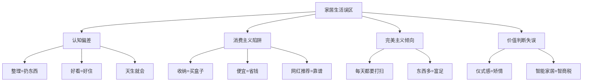
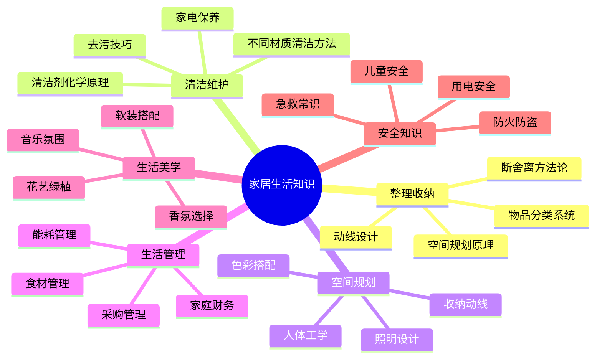

# 家居生活：常见误区

家居生活看似简单，实际上存在大量被广泛接受却经不起推敲的错误认知。这些误区不仅浪费你的时间和金钱，更会阻碍你建立真正舒适、高效的居住环境。本章逐一拆解十大典型误区，从心理学机制到行为经济学原理，从认知根源到纠正方案，帮你建立科学的家居生活观。

## 误区认知地图

在逐个分析之前，先看清全貌。这十个误区可以归纳为四大认知陷阱：

| 认知陷阱 | 涉及误区 | 核心问题 |
|---------|---------|---------|
| **认知偏差** | 误区1、3、10 | 对家居生活的本质理解错误 |
| **消费主义陷阱** | 误区2、5、6 | 用购买替代思考，用消费替代行动 |
| **完美主义倾向** | 误区4、7 | 追求不切实际的标准，或用数量替代质量 |
| **价值判断失误** | 误区8、9 | 低估情感价值，高估传统惯性 |

---

## 误区一：整理就是扔东西

### 误区描述

"断舍离"三个字在社交媒体上被简化为"扔扔扔"。很多人要么因为舍不得扔而无法开始整理，要么走向另一个极端——为了追求"极简人设"而过度丢弃，扔完又后悔，再买回来，陷入"扔→买→扔"的恶性循环。

### 认知根源分析

这个误区之所以根深蒂固，有三个心理学机制在起作用：

**1. 锚定效应。** 山下英子的《断舍离》在国内传播时，"断舍离"三个字本身就带有强烈的"舍弃"暗示，读者的大脑自动将"整理"锚定在"丢弃"这个动作上，忽略了断舍离的完整内涵。

**2. 非此即彼的二元思维。** 人的认知倾向于简化复杂问题——要么留着，要么扔掉。但整理是一个连续光谱，从"必须保留"到"立即丢弃"之间，存在"暂时保留观察""转赠他人""二手出售""改造再利用"等多种处理方式。

**3. 社交媒体的表演性极简。** Instagram和小红书上的"极简生活"博主展示的是视觉上空旷的空间，这种视觉冲击让人误以为"空=好"。但那些博主可能把杂物都藏到了镜头外的储物间里。

### 为什么这是误区

断舍离的完整定义是：**断绝不需要的东西进入（断），舍弃多余的物品（舍），脱离对物品的执念（离）**。注意，"断"排在第一位——阻止不需要的东西进入家门，比事后丢弃更重要。

盲目扔东西的具体危害：

- **经济损失。** 扔掉之后又需要重新购买，直接浪费金钱。据日本消费者协会调查，约34%的人在大整理后6个月内会重新购买至少3件被丢弃的同类物品。
- **情感伤害。** 有纪念价值的物品一旦丢弃就无法找回。老照片、手写信件、祖辈遗物等具有不可替代的情感价值。
- **心理反弹。** 过度丢弃后的"空虚感"会导致补偿性购物——买更多东西来填补心理空缺，反而比整理前更糟。
- **实用缺失。** 为追求极简美感而扔掉"不常用但关键时刻需要"的物品（如急救包、备用工具），在真正需要时追悔莫及。

### 科学整理的决策框架

不要用"扔不扔"来思考，用"留不留"来决策。以下是经过整理收纳师验证的四维评估法：

| 评估维度 | 具体问题 | 权重 |
|---------|---------|------|
| **功能性** | 过去12个月是否使用过？未来12个月是否计划使用？ | 40% |
| **情感性** | 看到这件物品时，内心感受是愉悦还是愧疚？ | 25% |
| **替代性** | 如果现在没有这件物品，我会花钱去买吗？ | 20% |
| **空间性** | 这件物品占用的空间是否影响其他更需要的物品？ | 15% |

**决策矩阵：**

- 功能性高 + 情感性高 = 必须保留，放在最容易取用的位置
- 功能性高 + 情感性低 = 保留，但放在不占黄金空间的位置
- 功能性低 + 情感性高 = 保留，但集中存放在记忆箱中
- 功能性低 + 情感性低 = 转赠、出售或丢弃

### 实操方案

**步骤一：设定观察期。** 对于犹豫不决的物品，装进一个标记了日期的箱子，放在不碍事的地方。如果3个月内没有打开过，说明你确实不需要它。

**步骤二：拍照留念。** 对于有情感价值但确实占空间的物品（如孩子的手工作品、旧衣服），拍一张高质量照片保存，实物可以处理掉。照片能保留80%以上的情感连接。

**步骤三：建立"一进一出"规则。** 每买进一件新物品，就必须处理掉一件旧物品。这从根本上控制物品总量，比事后大规模丢弃更可持续。

**步骤四：分类处理。** 不要只分"留"和"扔"两类，至少分为：

1. 日常使用 → 放在随手可取的位置
2. 定期使用 → 放在储物空间
3. 纪念保留 → 集中存放在记忆箱
4. 可以转赠 → 打包送给需要的人
5. 可以出售 → 挂闲鱼或二手平台
6. 确实丢弃 → 回收或丢弃

---

## 误区二：收纳就是买收纳盒

### 误区描述

"这个抽屉太乱了，买个收纳格"——这可能是最多人犯的家居错误。打开购物App搜索"收纳"，弹出无数种收纳盒、收纳架、收纳袋，让人产生一种"买了就能变整洁"的错觉。结果呢？收纳盒本身成了新的杂物，家里反而更拥挤了。

### 认知根源分析

这个误区的本质是**将工具误认为解决方案**。就像买了健身器材不等于健身一样，买了收纳盒不等于收纳。

行为经济学中的"安慰剂效应"在此处发挥作用：购买收纳盒这个行为本身会让人产生"我在解决问题"的心理满足感，但实际上问题并没有被解决。这就是为什么很多人热衷于购买收纳工具，却从不真正整理。

### 为什么这是误区

**收纳工具的悖论：** 在没有做好物品筛选和分类之前，收纳盒只是"把混乱装进了盒子里"。你看着整齐了，但打开盒子还是一团乱。

**常见的收纳盒陷阱：**

| 陷阱 | 表现 | 后果 |
|------|------|------|
| 尺寸不匹配 | 没量就买，放不进柜子 | 闲置浪费 |
| 材质不适配 | 厨房用布艺收纳盒 | 发霉、难清洁 |
| 过度细分 | 一个抽屉放了8个格子 | 大件物品放不下 |
| 风格优先 | 买好看的藤编盒 | 不透明，找不到东西 |
| 跟风购买 | 看到博主推荐就买 | 不适合自己家的布局 |

### 正确的收纳流程

收纳是一个系统工程，必须按照正确的顺序来：

**第一步：筛选（最重要）。** 用前面误区一中的四维评估法处理每一件物品。目标是将物品总量减少30%-50%，这一步完成后你会发现自己根本不需要那么多收纳工具。

**第二步：分类。** 按使用场景和频率分类：
- 按房间：厨房用品、卧室用品、卫生间用品
- 按频率：每日使用、每周使用、每月使用、偶尔使用
- 按类别：衣物、文件、工具、消耗品、纪念品

**第三步：规划。** 测量每个收纳区域的精确尺寸，画一张简单的平面图，标注每个区域放什么类型的物品。重点关注"黄金区域"——站立时手臂自然下垂到视线高度之间的空间，这是最容易取用的区域。

**第四步：选择工具。** 只在规划完成后才购买收纳工具。选购原则：

- **透明优先。** 能看到里面是什么，减少翻找时间。
- **统一规格。** 同一区域的收纳盒尽量统一尺寸和颜色，视觉上更整洁。
- **可叠放。** 纵向利用空间。
- **先用现有的。** 鞋盒、饼干铁盒、玻璃罐都是免费的收纳工具。

**第五步：执行。** 将物品放入对应的收纳位置，在每个盒子/区域贴上标签。

**第六步：维护。** 每周花5分钟检查一下，确保物品放回了正确的位置。

### 不同场景的收纳工具选择

| 场景 | 推荐工具 | 不推荐 | 原因 |
|------|---------|--------|------|
| 衣柜 | 抽屉式收纳盒 + 悬挂收纳袋 | 叠放 | 叠放容易乱，取用不便 |
| 厨房 | 旋转置物架 + 磁吸刀架 | 台面收纳架 | 占用操作台面空间 |
| 书桌 | 桌下抽屉 + 线缆收纳盒 | 桌面多层架 | 桌面越简洁越好 |
| 卫生间 | 壁挂置物架 + 吸盘挂钩 | 落地置物架 | 地面潮湿，不方便清洁 |
| 鞋柜 | 可叠放透明鞋盒 | 原装鞋盒 | 看不到里面的鞋，容易忘记 |

---

## 误区三：装修好看就是好的家居生活

### 误区描述

"这个北欧风好高级！""这个侘寂风太美了！"——很多人在装修时被效果图迷住，花大价钱打造"网红同款"，入住后才发现：白色墙面不耐脏、开放书架积灰严重、岩板台面容易渗色、下沉式玄关绊倒过三次。

### 认知根源分析

这个误区的核心是**将视觉审美等同于生活品质**。人脑处理视觉信息的速度远快于其他感官，所以我们在评估家居环境时，视觉权重天然就偏高。但家居生活是五感综合体验——触感、气味、声音、温度同样重要。

心理学中的"峰终定律"（Peak-End Rule）也在此起作用：人们记住的是体验的高峰和结尾，而不是平均体验。装修的效果图就是"高峰"，但日常生活是"平均体验"。

### 为什么这是误区

**好看但不好住的典型案例：**

- **纯白色极简风。** 效果图上干净通透，现实中每一粒灰尘、每一个指纹都清晰可见。维护成本极高，两个月后就变成"旧白色极简风"。
- **开放式厨房。** 对于中式烹饪（爆炒、煎炸）来说，油烟问题会让你的客厅永远有一股味道。
- **全屋大理石。** 视觉上高级，但冬天冰冷，脚感差，渗色后难以修复。
- **无主灯设计。** 效果图上光影层次丰富，现实中晚上看书亮度不够，想亮一点就得开一堆灯。
- **网红岩板餐桌。** 好看但硬，碗碟放上去叮当响，边缘容易磕碰崩瓷。

### 好家居的核心指标

一个真正好的家居环境应该同时满足以下指标：

| 指标 | 权重 | 评估方法 |
|------|------|---------|
| **动线合理性** | 25% | 日常活动（做饭→上菜→收拾）路径是否顺畅，有没有反复折返 |
| **清洁便利性** | 20% | 日常清洁是否轻松，有无难以清洁的死角 |
| **收纳充足性** | 20% | 所有物品是否有合理的存放位置 |
| **感官舒适度** | 15% | 光线、温度、噪音、气味是否舒适 |
| **视觉美感** | 10% | 整体风格是否协调，是否符合个人审美 |
| **安全可靠性** | 10% | 有无安全隐患（尖角、湿滑、电线外露等） |

注意，视觉美感只占10%。这不是说美观不重要，而是说它不应该凌驾于其他指标之上。

### 装修决策的实用原则

**原则一：先生活后审美。** 在确定装修方案之前，先列出你家的"生活清单"——每天几点起床、在哪里做饭、衣服放在哪里、鞋子有几双、有什么爱好需要什么空间。用生活需求驱动设计，而非用设计套生活。

**原则二：关注"使用频率×使用时长"。** 一张每天睡8小时的床，比一个每周看一次的电视背景墙重要得多。把预算优先分配给高频使用、长时间接触的物品和区域。

**原则三：模拟日常场景。** 去样板间或朋友家时，不要只看，要"用"——在厨房模拟做一顿饭的动作，打开衣柜试试取衣服方不方便，坐在马桶上看看有没有地方放手机。

**原则四：预留弹性空间。** 生活会变化——可能有孩子、可能养宠物、可能居家办公。设计时预留一些可调整的空间，避免过度定制化。

---

## 误区四：每天都需要打扫

### 误区描述

"保持家里干净太累了，每天都要打扫一两个小时。"——持这种想法的人要么把自己搞得很疲惫（洁癖型），要么干脆放弃（摆烂型），家里越来越乱。

### 认知根源分析

这个误区源于**对"整洁"的错误定义**。很多人认为整洁 = 一尘不染 + 一切归位 + 完美状态。但实际上，家是生活的地方，不是展览馆。"整洁"的合理定义是：**需要什么东西能立刻找到，整体环境让人心情舒适**。

另一个根源是**没有建立系统**。没有系统的人只能靠"打扫"来维持整洁，而有系统的人靠"习惯"来维持整洁——两者的精力消耗完全不同。

### 为什么这是误区

**过度清洁的危害：**

- **时间成本。** 每天打扫2小时 × 365天 = 730小时/年 = 30天/年。一年中有一个月在打扫，这些时间可以用来学习、运动、陪伴家人。
- **化学暴露。** 过度使用清洁剂会增加室内化学物质暴露，影响呼吸系统健康。美国环保署（EPA）的研究表明，室内空气污染可能是室外的2-5倍，清洁剂是主要来源之一。
- **心理压力。** 洁癖式的清洁标准会造成持续的心理焦虑——一旦家里"不够干净"就感到不安。

**不打扫的代价：**

- 积灰影响呼吸健康，特别是过敏体质人群
- 油污、水垢积累后更难清除
- 杂乱环境影响心情和专注力
- 长期不清洁会缩短家具家电的使用寿命

### 科学清洁的时间框架

真正的关键不是"每天打扫多久"，而是"建立什么样的习惯和系统"：

**日常习惯（每天5-15分钟，不做才奇怪的那种）：**

| 动作 | 时间 | 频率 | 说明 |
|------|------|------|------|
| 物归原位 | 3-5分钟 | 每次使用后 | 用完的东西立刻放回去 |
| 餐后清理 | 5-10分钟 | 每餐后 | 碗筷不要过夜 |
| 台面擦拭 | 2分钟 | 做饭后 | 灶台、台面随手擦 |
| 地面巡视 | 2分钟 | 每天 | 看到明显垃圾顺手捡 |
| 洗衣归类 | 3分钟 | 每天 | 脏衣服丢进洗衣篮 |

**周度清洁（每周1次，30-60分钟）：**

- 吸尘/拖地全屋
- 卫生间深度清洁（马桶、洗手台、淋浴间）
- 更换床单被套
- 厨房抽油烟机擦拭
- 垃圾分类处理

**月度清洁（每月1次，1-2小时）：**

- 家电表面深度清洁（冰箱、微波炉、空调滤网）
- 门窗玻璃擦拭
- 衣柜整理
- 过期物品清理

**季度/年度（每季/年1次）：**

- 深度清洁地毯、窗帘
- 家具保养（木质上蜡、皮质护理）
- 全屋断舍离

### 清洁系统搭建

**工具简化法：** 不需要十几种清洁剂，以下5种基本能覆盖90%的场景：

1. **万能清洁剂**（中性pH值）→ 台面、桌面、大部分表面
2. **玻璃清洁剂** → 镜子、窗户、屏幕
3. **除霉剂/漂白剂** → 卫生间、厨房缝隙
4. **小苏打 + 白醋** → 去异味、疏通下水道、清洁不锈钢
5. **一次性除尘纸** → 快速除尘，用完即扔

**区域分配法：** 不要"全屋大扫除"，而是每天打扫一个区域。周一厨房、周二卫生间、周三客厅……每天只花20-30分钟，周末就能完全休息。

---

## 误区五：便宜的东西就是省钱

### 误区描述

"这个才9.9，买！"——这种消费心理在家居用品领域尤其普遍。结果呢？9.9的拖把用一个月就散架，19.9的不粘锅三个月涂层脱落，29.9的收纳盒一压就变形。一年下来，同一件东西买了三四次，总花费比买一件好的还贵。

### 认知根源分析

行为经济学中的"心理账户"（Mental Accounting）理论解释了这个现象：人在购买时倾向于关注单次支出金额（"才9.9"），而忽略总拥有成本（Total Cost of Ownership）。另一个因素是"即时满足偏差"——便宜的东西能立刻买到，而贵的东西需要"攒钱""考虑"，这个延迟让人倾向于选择便宜的。

此外，"价格锚定效应"让我们把价格和质量简单线性关联——"贵的一定好"或"便宜的也差不多"，但实际上价格和质量之间的关系是S型曲线：低价区间质量差异大，中高价位质量差异收窄。

### 为什么这是误区——数据说话

以一把拖把为例，计算5年总成本：

| 方案 | 单价 | 预期寿命 | 5年需要数量 | 5年总成本 | 每次使用成本 |
|------|------|---------|------------|----------|------------|
| 廉价拖把 | 15元 | 3个月 | 20把 | 300元 | 0.16元 |
| 中档拖把 | 60元 | 12个月 | 5把 | 300元 | 0.08元 |
| 优质拖把 | 150元 | 30个月 | 2把 | 300元 | 0.05元 |

价格不同，但5年总成本可能相近——而使用体验和时间成本差异巨大。廉价拖把不仅需要频繁更换，每次更换还需要花时间选购、等待物流、适应新手感。

### 聪明消费的决策框架

**"每次使用成本"公式：** `每次使用成本 = 购买价格 ÷ 预期使用次数`

一个150元用了300次的背包，每次使用成本0.5元。一个50元用了20次就坏的背包，每次使用成本2.5元——后者反而贵了5倍。

**"频率-品质"矩阵：**

| | 高频使用 | 低频使用 |
|---|---------|---------|
| **高接触度**（贴身/长时间） | 买最好的（床垫、椅子、鞋子、手机） | 买中档偏上（冬装、行李箱） |
| **低接触度**（间接/短时间） | 买中档偏上（厨具、工具） | 买性价比高的（节日装饰、一次性用品） |

**具体品类的消费建议：**

- **值得投资的：** 床垫（每天8小时）、办公椅（每天8小时）、菜刀（每天做饭）、好品质的毛巾和床品（贴身接触）、主力鞋子
- **不必追求贵的：** 收纳盒（功能简单）、清洁工具（消耗品）、装饰摆件（审美会变）、季节性用品

---

## 误区六：跟着网红买就不会错

### 误区描述

"这个博主推荐的""这个小红书上超火"——社交媒体时代，网红推荐已经成为很多人购物决策的主要来源。家居领域尤其如此，因为"种草"内容的视觉冲击力很强。但跟着买回来，常常发现"买家秀"和"卖家秀"差距巨大。

### 认知根源分析

**光环效应（Halo Effect）。** 网红在某个领域（如穿搭、美妆）建立了信任后，其推荐会被自动延伸到其他领域（如家居）。但穿搭好看不等于家居专业。

**社会认同偏差。** "10万人都在买"的标签让人觉得"这么多人选，不会错"。但社交媒体的传播机制决定了，一个好笑的种草视频能触达百万人，不代表这个产品真的好。

**信息不对称。** 你看到的是精心布景的拍摄环境、专业灯光、后期修图。你没看到的是：这个产品是不是广告、使用一周后的真实状态、不适合的场景。

### 网红推荐的隐藏真相

**"好物推荐"的类型分析：**

| 类型 | 可信度 | 识别方法 |
|------|--------|---------|
| 纯广告（品牌付费） | 低 | 小字标注"广告""合作"，或完全不标注 |
| 好物分享（自用推荐） | 中等 | 有真实使用痕迹，提到缺点 |
| 专业测评（有对比数据） | 较高 | 有横向对比、数据测试、长期使用反馈 |
| 用户口碑（非商业内容） | 高 | 素人发布，内容朴素，有正负评价 |

**家居博主常见的"美化手法"：**

- 拍摄前专门整理，展示的不是日常状态
- 使用专业灯光，让物品看起来质感更好
- 选择最佳角度，隐藏缺陷
- 搭配高级背景，提升物品档次感
- 只展示拆封瞬间，不展示使用一段时间后的状态

### 理性种草的决策流程

**Step 1：需求确认。** 看到推荐后，先问自己三个问题：
1. 我在看到这个推荐之前，有没有意识到自己需要它？
2. 我现在是怎么解决这个问题的？是否真的需要换？
3. 如果没有看到这个推荐，我会主动去搜索这个产品吗？

如果三个答案都是"没有/不需要/不会"，那大概率是被"种草"而非真的有需求。

**Step 2：多源验证。** 不要只看一个博主的推荐，去以下渠道查看真实反馈：
- 电商平台的追评（使用一段时间后的评价）
- 问答区的买家提问
- 社交媒体上搜"产品名 + 踩雷/避坑"
- 专业测评网站的横向对比

**Step 3：冷静期。** 加入购物车后等3天。如果3天后你还记得这个东西并且确认需要，再购买。冲动消费的欲望通常在24小时内消退50%以上。

**Step 4：先试后买。** 能借来试用就先试用，能去线下店体验就先体验。特别是家居用品，手感、气味、尺寸这些信息在线上是无法完全感知的。

---

## 误区七：家里东西多说明生活富足

### 误区描述

"你看人家家里多充实，什么都有。"——在传统文化中，"满"是富足的象征。这种观念让很多人不断购买和囤积，即使很多东西根本用不上，扔掉又觉得"可惜"，家里越堆越多。

### 认知根源分析

这个误区有深刻的文化和心理学根源：

**稀缺记忆的代际传递。** 很多人的父母或祖父母经历过物资匮乏的年代，"留着以后可能用得上"是一种生存策略。这种思维方式被代际传递下来，即使物质条件已经大幅改善，行为惯性仍在。

**禀赋效应（Endowment Effect）。** 心理学研究证明，人对自己拥有的物品会高估其价值。你觉得"这个以后可能用得上"，但实际上如果现在去商店看到这个东西，你根本不会买它。

**沉没成本谬误。** "这个东西花了200块买的，虽然不用了但扔掉太可惜。"但那200块已经花出去了，无论你留不留这件东西，钱都不会回来。留着它反而占用你值钱的居住空间。

### 为什么这是误区——物品的真实成本

每一件闲置物品都有隐性成本，远不止购买价格：

| 成本类型 | 具体表现 | 估算（以一线城市为例） |
|---------|---------|-------------------|
| **空间成本** | 占用的居住面积 | 房价5万/㎡，一件占0.1㎡的闲置物品 = 5000元空间成本 |
| **时间成本** | 寻找其他物品时需要翻找 | 每天多花5分钟找东西 = 30小时/年 |
| **心理成本** | 看到杂乱环境的压力感 | 研究表明杂乱环境会导致皮质醇（压力激素）水平升高 |
| **维护成本** | 清洁、整理、防潮防虫 | 每件物品的维护时间 × 时间价值 |

一个充满闲置物品的房间，真正的"富足"程度远不如一个物品精简但每件都好用的房间。

### 真正的富足：少而精的生活哲学

**"足够好"的标准：**

不是拥有一切，而是拥有的每一件物品都满足以下条件：
1. **正在使用或确定会使用。** 不是"可能有一天会用"。
2. **质量好、手感好。** 使用时有愉悦感。
3. **有明确的存放位置。** 不是堆在角落吃灰。
4. **能够替换但不需要替换。** 耐用、好用。

**实践方法——"90/90法则"：** 拿起一件物品，问自己两个问题：过去90天我用过它吗？未来90天我会用它吗？如果两个答案都是"没有/不会"，它就不应该占用你的生活空间。

### 数字化替代方案

很多实物可以被数字化替代，释放大量空间：

| 实物 | 数字化替代 | 释放空间 |
|------|----------|---------|
| 书籍（非珍藏版） | 电子书 / Kindle | 一个书架 |
| CD/DVD | 流媒体服务 | 一整面墙 |
| 纸质照片 | 数字相册 / 云存储 | 几个箱子 |
| 纸质文件 | 扫描存档（重要原件除外） | 一个文件柜 |
| 实体游戏 | 数字版游戏 | 一个柜子 |
| 纸质笔记 | 电子笔记（Notion/笔记软件） | 桌面空间 |

---

## 误区八：仪式感就是矫情

### 误区描述

"过日子就是柴米油盐，搞什么仪式感，矫情。"——持这种观点的人不在少数。他们认为仪式感是文艺青年的自嗨，是社交媒体的表演，和真正的生活无关。

### 认知根源分析

**实用主义的文化惯性。** 中国传统文化强调"实在"和"实用"，任何看似"不实用"的行为都会被质疑。"这有什么用"是默认的评判标准。

**对"仪式感"的狭隘理解。** 很多人把仪式感等同于"花大钱搞排场"——铺张的生日派对、昂贵的节日礼物、精心策划的旅行打卡。但实际上，仪式感的本质是**用有意的行为标记特殊时刻**，和花钱多少没有必然关系。

### 为什么这是误区——科学证据

**哈佛大学积极心理学研究（Tal Ben-Shahar, 2007）** 发现，日常仪式感能显著提升主观幸福感。具体机制包括：

**1. 时间标记功能。** 大脑倾向于压缩相似的记忆，让日子过得"飞快"。仪式感能打破日常的同质性，创造独特的记忆节点，让时间感更加丰富。这就是为什么旅行中的日子"过得很慢"，而日复一日的上班"一眨眼就过去了"。

**2. 注意力聚焦功能。** 仪式感让你把注意力从"自动驾驶模式"切换到"主动觉察模式"。认真冲泡一杯茶的过程，让你从刷手机的无意识状态中抽离出来，回到当下。

**3. 多巴胺释放功能。** 期待一个"特别的时刻"会触发多巴胺分泌，让人感到愉悦。周五晚上固定的电影之夜、每月一次的外出就餐，这些可预期的小确幸能持续提供正向情绪。

**4. 关系联结功能。** 共同的仪式（家庭聚餐、纪念日庆祝）是关系的"锚点"。关系研究专家John Gottman发现，稳定的关系中存在大量"微小仪式"——早安吻、睡前聊天、周末一起做饭。

### 低成本高回报的生活仪式

| 仪式 | 成本 | 频率 | 效果 |
|------|------|------|------|
| 起床后泡一杯喜欢的茶/咖啡 | ~3元/天 | 每天 | 用味觉唤醒一天的仪式感 |
| 睡前写下三件今天感恩的事 | 0元 | 每天 | 提升幸福感（积极心理学经典练习） |
| 每周选一天自己做一顿认真的饭 | ~30-50元 | 每周 | 专注烹饪的过程本身就是正念练习 |
| 每月一次家庭游戏/电影之夜 | ~0-50元 | 每月 | 创造共同记忆，增进关系 |
| 每季换一次床品/桌布 | ~100-200元 | 每季 | 给空间带来新鲜感 |
| 固定节日的专属食物或活动 | 因节日而异 | 年度 | 建立家庭传统，传承文化记忆 |

**关键原则：** 仪式感的核心不是"花钱"，而是"有意"。有意识地把一件普通的事情变得不普通——用好看的杯子喝水、在餐桌上铺一块桌布、给晚餐点一根蜡烛——这些微小的改变就能让日常多出一份温度。

---

## 误区九：智能家居都是智商税

### 误区描述

"买那个干嘛，手动开关一下就好了。"——对智能家居的怀疑态度很常见，尤其是被一些华而不实的产品"伤过"之后。但把所有智能家居一棍子打死，和把所有传统方法奉为圭臬，都是不理性的。

### 认知根源分析

**"一朝被蛇咬"效应。** 早期的智能家居产品确实问题多多——连接不稳定、语音识别差、学习成本高、隐私担忧。这些负面体验形成了强烈的锚定，让人对整个品类产生偏见。

**现状偏见（Status Quo Bias）。** 人天然倾向于维持现状，改变需要额外的心理能量。"手动开关灯"已经是几十年的习惯，用语音控制灯需要打破习惯，而打破习惯本身就被大脑判定为"麻烦"。

**技术恐惧。** 对于不熟悉技术的人来说，"智能"两个字就意味着"复杂""可能会出问题""我学不会"。

### 为什么这是误区——用数据说话

智能家居不是未来概念，而是已经进入主流的成熟技术：

- **全球智能家居渗透率：** 2024年已达17.1%，预计2028年将达到33.4%（Statista数据）。
- **用户满意度：** Parks Associates的调查显示，85%的智能家居用户表示生活质量有所提升。
- **投资回报：** 智能恒温器（如Nest）平均节省10%-15%的能源费用，2-3年即可收回投资成本。

### 智能家居的分级推荐

不是所有智能家居都值得买，按"投入产出比"分为三个梯队：

**第一梯队：闭眼买（投入低、提升明显）**

| 产品 | 价格区间 | 核心价值 | 回本周期 |
|------|---------|---------|---------|
| 智能门锁 | 500-2000元 | 告别钥匙焦虑，支持临时密码 | 立刻（便利性） |
| 扫地机器人 | 1500-4000元 | 每天自动清扫30-60分钟 | 3-6个月（时间价值） |
| 智能灯泡/灯带 | 30-100元/个 | 手机/语音控制亮度色温 | 立刻（体验提升） |
| 智能插座 | 30-80元/个 | 远程控制、定时开关 | 1-2个月（电费节省） |

**第二梯队：按需选（中等投入、场景依赖）**

| 产品 | 价格区间 | 适用场景 | 注意事项 |
|------|---------|---------|---------|
| 智能恒温器 | 800-2000元 | 北方供暖、中央空调家庭 | 安装可能需要专业人员 |
| 智能摄像头 | 200-600元 | 有老人/小孩/宠物的家庭 | 注意隐私保护，选本地存储 |
| 智能窗帘电机 | 300-800元 | 高窗/落地窗、行动不便者 | 需要预留电源 |
| 空气净化器（智能款） | 1000-3000元 | 空气质量差的地区 | 定期更换滤芯成本 |

**第三梯队：观望（高投入、提升有限）**

| 产品 | 问题 | 建议 |
|------|------|------|
| 智能冰箱（带屏幕） | 屏幕功能手机都能做，溢价高 | 普通冰箱足够 |
| 全屋智能中控 | 价格高、系统封闭、学习成本大 | 等生态成熟再考虑 |
| 智能镜子 | 噱头大于实用 | 不推荐 |
| 陪伴机器人 | 技术不成熟，交互生硬 | 等3-5年 |

### 入门路径建议

如果你从未尝试过智能家居，推荐以下入门路径：

第1周：买一个智能插座 + 一个智能灯泡（总投入<100元）
       ↓ 体验基础的定时、远程控制功能
第2-4周：如果体验不错，给常用灯泡全部换智能灯
       ↓ 体验语音控制和场景联动
第2个月：购入扫地机器人（最能改变生活的单品）
       ↓ 释放每天30-60分钟的打扫时间
第3个月：考虑智能门锁（安全性提升 + 便利性提升）
       ↓ 告别钥匙
后续：根据实际需求决定是否继续扩展

**选择生态系统的建议：** 尽量选择同一个生态系统的产品（如米家、HomeKit、天猫精灵），避免"每个设备一个App"的碎片化体验。

---

## 误区十：家居生活不需要学习

### 误区描述

"做家务谁不会啊，不就是打扫卫生嘛。"——这种态度让很多人在家居生活中长期低效运行。他们不是不勤快，而是不知道更好的方法。结果花了很多时间，效果却一般。

### 认知根源分析

**"熟悉领域"偏差。** 人倾向于低估自己熟悉领域中的知识深度。每个人都"会"做饭、"会"打扫、"会"收纳，就像每个人都"会"跑步一样。但业余跑步和科学训练之间的差距，就是随意打扫和科学清洁之间的差距。

**隐性知识的不可见性。** 高效的家居管理涉及大量隐性知识——物品的最佳存放位置、清洁的最佳顺序、不同材质的护理方法——这些知识不会从天而降，需要主动学习和积累。

### 为什么这是误区

**家居生活的知识体系远比想象中庞大：**

以"擦桌子"为例——看似简单，但不同材质的桌面需要完全不同的清洁方式：

| 桌面材质 | 清洁方法 | 禁忌 |
|---------|---------|------|
| 实木 | 微湿布擦拭，定期上木蜡油 | 不能用湿布长时间覆盖，不能用酒精 |
| 大理石 | 中性清洁剂 + 软布 | 不能用酸性清洁剂（醋、柠檬汁） |
| 岩板 | 湿布 + 中性清洁剂 | 避免重物磕碰边角 |
| 玻璃 | 玻璃清洁剂 + 无纺布 | 不能用粗糙抹布（会刮花） |
| 不锈钢 | 沿纹理方向擦拭 | 不能用钢丝球 |

如果不知道这些区别，你可能在用错误的方式清洁，不仅效果差，还可能损坏家具。

### 高效学习的路径

**阶段一：认知升级（1-2周）**

阅读以下书籍，建立系统的家居知识框架：
- 《怦然心动的人生整理魔法》（近藤麻理惠）—— 整理收纳方法论
- 《扫除力》（舛田光洋）—— 清洁与心理的关系
- 《小家，越住越大》（逯薇）—— 中式住宅的空间规划
- 《收纳的艺术》（近藤典子）—— 收纳系统设计

**阶段二：技能练习（1-3个月）**

选定一个领域开始实践，建议从"整理收纳"开始，因为效果最直观：

1. 选择一个区域（如衣柜、书桌、厨房台面）
2. 按照本章推荐的方法进行整理
3. 记录整理前后的对比照片
4. 建立维护习惯，坚持一个月
5. 扩展到下一个区域

**阶段三：系统优化（3-6个月）**

将单点技能整合为系统：
- 建立全屋的物品管理系统
- 制定清洁日程表
- 优化家中的动线和收纳
- 建立采购和库存管理习惯

**阶段四：持续迭代（长期）**

家居生活不是一劳永逸的项目，而是持续优化的过程。每个季度做一次回顾：哪些习惯坚持了？哪些方法需要调整？家里有什么新的痛点？

---

## 误区之外：隐藏的认知陷阱

除了以上十大误区，还有几个容易被忽略的认知陷阱，值得警惕：

### 陷阱一：比较心理

"别人家怎么那么好？"——你在社交媒体上看到的"完美家居"，通常是精心挑选角度、后期修图、甚至专门为了拍摄而整理的结果。把别人的"精修图"和自己的"实时状态"比较，本身就是不公平的。

### 陷阱二：一步到位思维

"等我有钱了/有时间了，再一次性搞定。"——家居生活的提升是一个渐进过程，每天改变一点点，比等待一个"完美时机"更现实、更有效。今天就整理一个抽屉，比"等搬家后再好好整理"有意义得多。

### 陷阱三：方法论洁癖

"我还没找到最好的方法，所以先不动。"——过度研究方法论而不行动，本身就是一种拖延。最好的方法是"开始做的方法"。做得不好没关系，下次改进就是了。

### 陷阱四：极端化倾向

"要么极简，要么不收拾"——大多数人不需要也不应该追求极端极简。适合自己的才是最好的。一个有小孩的家庭和一个独居青年的标准完全不同，不要用别人的标准要求自己。

---

## 误区自检清单

用以下清单快速检查自己是否中招：

- [ ] 整理时总觉得"扔了可惜"，但留着也从来不用
- [ ] 家里有很多收纳盒，但里面的物品仍然是乱的
- [ ] 装修后发现很多设计"好看但不好用"
- [ ] 觉得保持家里整洁需要花很多时间
- [ ] 买家居用品时总是选最便宜的
- [ ] 跟着博主买了不少"踩雷"的东西
- [ ] 家里有很多"可能有一天会用到"的东西
- [ ] 觉得仪式感是花架子
- [ ] 对智能家居完全没兴趣或完全不了解
- [ ] 从未系统学习过整理收纳的方法

中了3条以上？恭喜，你已经知道自己的改进方向了。中了5条以上？建议从误区一和误区四开始改——这两个是基础，改好了其他误区会自然改善。

---

## 总结

以上十个误区涵盖了家居生活中最常见的认知陷阱。它们的共同根源是：

1. **缺乏系统思维。** 用碎片化的方式对待家居生活，而不是建立系统。
2. **消费替代行动。** 以为买东西能解决问题，实际上改变习惯才能解决问题。
3. **完美主义作祟。** 追求不切实际的标准，反而让自己无法开始。
4. **经验替代学习。** 凭直觉做事，不学习已经被验证的科学方法。

克服误区不是一次性的事，而是一个持续的认知升级过程。从今天开始，选择一个你最容易突破的误区，做一个小改变。一个月后，你会惊讶于这个小改变带来的连锁反应。

记住：**好的家居生活不是拥有最多的东西，不是花最多的钱，也不是花最多的时间打扫——而是用最少的精力，获得最大的舒适感。** 这需要知识、需要系统、需要习惯，但一旦建立起来，它会让你的生活质量持续提升，每一天都过得更舒服一点。
