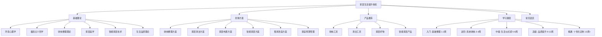

# 家居生活：本章小结

## 一、本章知识全景

本章从"道"（理论认知）到"术"（具体操作）再到"器"（工具产品），构建了一套完整的家居生活提升体系。以下用一张知识地图来呈现全章的核心脉络：

下面按板块逐一梳理核心内容。

---

## 二、基础理论板块回顾

### 2.1 环境心理学的核心发现

环境心理学告诉我们，居住环境不是"背景板"，而是直接参与塑造情绪、认知和行为的"隐形力量"。本节涉及的核心机制包括：

- **压力恢复理论**（Roger Ulrich, 1984）：自然元素和整洁环境能降低皮质醇水平，加速压力恢复。实验证明，在整洁房间中完成认知任务的被试，错误率比杂乱房间低约 25%。
- **环境负荷理论**（Milgram, 1970）：过多的视觉刺激（杂物、噪音、混乱的色彩）会消耗认知资源，导致注意力下降和决策疲劳。
- **个人空间与领域感**：人在家中需要"可控领地"——一个能按自己意愿布置和改变的空间。这种控制感是心理健康的重要缓冲器。
- **色彩与情绪的关联**：暖色调（米白、浅黄）增加温馨感，冷色调（灰蓝、薄荷绿）促进放松，高饱和色长期暴露会导致焦虑。

**关键认知升级**：杂乱不仅影响心情，还会影响你的认知能力和决策质量。整理家居不只是"爱干净"，而是对大脑的一种保护。

### 2.2 极简主义的本质

极简主义不是"什么都不买"或"把家扔空"，而是一种有意识的选择哲学。本节的核心论点：

- **注意力是最稀缺的资源**：每一件多余的物品都在分散你的注意力。心理学中的"选择过载"（Barry Schwartz）表明，物品越多，决策越难，满意度反而下降。
- **80/20法则在家居中的体现**：你日常使用的物品大约只占你拥有物品的 20%。剩下的 80% 在占用空间、积灰、制造视觉噪音。
- **极简是手段，自由是目的**：减少物品不是为了受苦，而是为了把时间、金钱和精力释放出来，投入到真正重要的事情上。

### 2.3 收纳整理理论

收纳不是"把东西塞进盒子"，而是一套信息管理系统。核心理论包括：

- **近藤麻理惠的 KonMari 方法**：以"是否怦然心动"为筛选标准，按类别（而非按房间）整理，让每件物品都有固定的"家"。
- **FIFO 原则**（先进先出）：特别适用于食品、化妆品等有保质期的物品，确保旧物先用完。
- **动线收纳原则**：物品应存放在使用场景附近——厨房调料靠近灶台，清洁用品靠近卫生间，钥匙靠近门口。
- **竖立收纳 vs 堆叠收纳**：竖立收纳（如 KonMari 折叠法）让每件物品一目了然，避免"压在底下的永远找不到"。

### 2.4 家居美学的基本原则

美学不是"花钱买贵的"，而是理解视觉规律后做出的合理选择：

- **色彩搭配的 60-30-10 法则**：60% 主色调（墙面、大面积家具）+ 30% 辅助色（窗帘、地毯）+ 10% 点缀色（抱枕、装饰品）。
- **材质混搭的温度感**：木头 + 棉麻 = 温暖；金属 + 玻璃 = 冷峻。家居中建议以温暖材质为主，冷材质做点缀。
- **留白的力量**：墙面不一定要挂满，桌面不一定要摆满。适当的空白给眼睛"休息区"，让空间看起来更开阔。
- **光线层次设计**：主灯 + 氛围灯（台灯、落地灯）+ 功能灯（阅读灯、橱柜灯带）的三层设计，比单一主灯的体验好得多。

### 2.5 智能家居技术

智能家居不是"炫技"，而是用技术降低日常生活的摩擦成本：

- **入门级智能设备**：智能灯泡（定时开关、调色温）、智能插座（远程控制普通电器）、智能门锁（免钥匙出入）。
- **进阶自动化场景**：回家模式（自动开灯 + 开空调 + 播放音乐）、离家模式（自动关灯 + 关电器 + 启动扫地机器人）、睡眠模式（关灯 + 开加湿器 + 调低空调温度）。
- **协议选择**：WiFi 设备适合少量部署，Zigbee/蓝牙 Mesh 适合大面积组网。建议选择支持 Matter 协议的产品，避免品牌锁定。

### 2.6 生活品质理论

生活品质 = 舒适度 × 功能性 × 美观度 × 秩序感。四个维度缺一不可：

| 维度 | 含义 | 常见短板 |
|------|------|----------|
| 舒适度 | 身体的感受（温度、光线、触感） | 忽视睡眠环境、忽视座椅人体工学 |
| 功能性 | 拿取方便、操作顺畅 | 动线不合理、收纳位置远离使用点 |
| 美观度 | 视觉上的愉悦感 | 风格混乱、颜色过多、装饰过满 |
| 秩序感 | 每样东西各归其位 | 没有固定归位习惯、临时堆放成瘾 |

**核心原则**：四个维度不需要都满分，但不能有明显短板。一个功能性和秩序感极强但毫无美感的家，住久了会感到乏味；一个美观但功能混乱的家，住起来会很烦躁。

---

## 三、具体方案板块回顾

### 3.1 收纳整理方案

本节提供了分房间的详细整理指南，核心流程为：

**四步整理法**：①全部取出 → ②逐一筛选 → ③分类归位 → ④建立维持

各房间的重点整理要点：

| 空间 | 核心整理对象 | 关键技巧 |
|------|-------------|----------|
| 衣柜 | 衣物、鞋帽、配饰 | KonMari 竖立折叠，按季节/场景分区 |
| 厨房 | 食材、调料、厨具、餐具 | FIFO 管理食材，调料靠近灶台，常用厨具挂墙 |
| 卫生间 | 洗护用品、药品、毛巾 | 过期物品每月清理，镜柜利用纵向空间 |
| 客厅 | 书籍、遥控器、充电线 | 集中管理遥控器，线缆用理线器整理 |
| 书房 | 书籍、文件、电子设备 | 文件按"待处理/归档/丢弃"三篮法则 |

### 3.2 家居清洁方案

清洁不是苦差事，关键在于**频率管理**和**工具选择**：

- **日常清洁（每天 15-20 分钟）**：洗碗、擦灶台、归位物品、简单除尘。
- **周度清洁（每周 1-2 小时）**：拖地、擦玻璃、清洗卫生间、更换床品。
- **月度深度清洁**：清洗空调滤网、冰箱除霜清洁、窗帘清洗、橱柜整理。
- **季度大扫除**：清洗地毯、沙发、纱窗，整理储藏间。

**清洁顺序的黄金法则**：从上到下（先擦高处再擦地面），从里到外（先擦房间深处再往门口方向），从干到湿（先除尘再湿擦）。

### 3.3 家居布置方案

布置的核心不是"买贵的东西"，而是**理解空间关系**：

- **动线设计**：高频动线（起床→卫生间→厨房→出门）要畅通无阻，不放障碍物。
- **功能分区**：即使在小空间中，也要用家具、地毯、灯光来划分"工作区""休息区""用餐区"。
- **视觉焦点**：每个空间设置一个视觉焦点（一幅画、一盆绿植、一盏特别的灯），其余部分做"配角"。

### 3.4 智能家居方案

智能家居的搭建应循序渐进，不要一步到位：

- **第一步**：智能灯泡 + 智能插座（投入 100-300 元，体验最直接）。
- **第二步**：智能门锁 + 智能摄像头（安全性提升最显著）。
- **第三步**：扫地机器人 + 智能音箱（日常便利性大幅提升）。
- **第四步**：全屋自动化场景（需要中枢网关，投入较大但体验最好）。

### 3.5 租房改造方案

租房不是"将就"的理由。低成本改造的核心策略：

- **可逆改造**：免钉挂钩、自粘墙纸、可移动家具、磁吸灯带。
- **重点投入**：床品（直接影响睡眠质量）、灯光（氛围改变最大）、绿植（成本最低的装饰）。
- **低成本高回报**：更换窗帘（200 元以内即可大幅改变房间氛围）、铺设地毯（增加温馨感）、添加氛围灯（改变空间情绪）。

### 3.6 家庭预算管理

提升家居品质不等于花更多钱，关键在于**优先级排序**：

- **高优先级投入**：床垫和枕头（每天使用 8 小时）、办公椅（每天使用 6-8 小时）、厨房核心工具（好锅好刀提升烹饪体验）。
- **中优先级投入**：收纳系统、灯光改善、基本智能设备。
- **低优先级投入**：装饰品、季节性更换物品、非必要的小家电。

**省钱核心策略**：买贵的用得久的，不买便宜的用不久的。一个 300 元用 5 年的锅，比一个 50 元用半年的锅划算得多。

---

## 四、产品推荐板块回顾

本章产品推荐覆盖四大类，核心筛选标准为：**使用频率高 × 质量可靠 × 性价比合理**。

| 类别 | 核心推荐 | 选购要点 |
|------|----------|----------|
| 收纳工具 | 抽屉分隔盒、真空压缩袋、标签打印机 | 尺寸先量后买，优先透明材质 |
| 清洁工具 | 蒸汽拖把、电动清洁刷、除霉啫喱 | 关注替换耗材成本，优先电动省力工具 |
| 家居好物 | 遮光窗帘、乳胶枕、落地衣架 | 先解决痛点（睡眠、收纳），再考虑美化 |
| 智能家居 | 智能灯泡、扫地机器人、智能门锁 | 关注协议兼容性，优先选支持 Matter 的 |

**选购的三条铁律**：
1. **高频使用的东西买好的**——每天用的床品、厨具、办公设备值得投资。
2. **先试后买**——不确定的东西先买一个试用，好用再批量购入。
3. **关注总拥有成本**——不只看购买价格，还要看耗材、电费、维护成本。

---

## 五、学习路径板块回顾

本章设计了一条 13 周以上的渐进式提升路径，五个阶段的目标和关键里程碑如下：

| 阶段 | 时间 | 核心目标 | 关键里程碑 |
|------|------|----------|-----------|
| 入门 | 第 1-2 周 | 基础整理 | 全屋基础整理完成，每日清洁习惯建立 |
| 进阶 | 第 3-4 周 | 系统收纳 | 每件物品有固定位置，30 秒内找到任何物品 |
| 中级 | 第 5-8 周 | 生活仪式感 | 晨间/晚间仪式成为习惯，生活品质感提升 |
| 高级 | 第 9-12 周 | 品质提升 | 物品品质优化，家居美学明显改善 |
| 精通 | 第 13 周+ | 个性化定制 | 形成自己的家居生活风格，持续优化迭代 |

**路径设计的底层逻辑**：
- 先解决"乱"（整理收纳），再解决"丑"（美学布置），最后解决"平"（品质提升）。
- 每个阶段都建立在前一阶段的基础上——没有前面的秩序感，后面的美学投入会被杂乱淹没。
- 不需要严格按照时间表执行，可以根据自己的起点和节奏调整，但**顺序不能跳**。

---

## 六、常见误区板块回顾

本章列举了五个最常见的家居生活误区，这里用对比表格做最终总结：

| 误区 | 错误认知 | 正确认知 | 核心纠正 |
|------|----------|----------|----------|
| 整理 = 扔东西 | 越少越好，扔就对了 | 整理是"选择"，保留有价值的 | 用"需要/喜欢/适合"三标准判断 |
| 收纳 = 买盒子 | 买收纳工具就解决了 | 先筛选分类，再选工具 | 先整理后购买，工具是辅助不是答案 |
| 装修好 = 住得好 | 花钱装修就能提升生活 | 日常舒适比展示美观更重要 | 住出来的家比装出来的家更有温度 |
| 每天都要打扫 | 保持整洁很费时间 | 良好习惯让清洁变得轻松 | 物归原位 > 疯狂打扫 |
| 便宜 = 省钱 | 省钱就是买最便宜的 | 长期性价比比短期价格重要 | 高频用品投资好物，低频用品够用就好 |

五个误区的共同根源：**试图用"物"来解决"人"的问题**。真正的家居生活提升，始于习惯和态度的改变，而非物品的增减。

---

## 七、核心方法论速查表

以下是本章所有核心方法论的一张速查表，方便日常参考：

| 方法 | 适用场景 | 核心步骤 | 记忆口诀 |
|------|----------|----------|----------|
| 断舍离 | 物品筛选 | 断=不买新的, 舍=扔掉多余, 离=脱离执念 | "不需要的不进，多余的不留" |
| KonMari 折叠法 | 衣物收纳 | 竖立折叠，直立存放 | "站起来的衣服更好找" |
| FIFO 原则 | 食品/消耗品管理 | 先买的先用，后买的后用 | "先进先出，不过期" |
| 60-30-10 法则 | 家居色彩搭配 | 主色60%+辅色30%+点缀10% | "六三一，不出错" |
| 四步整理法 | 任何空间整理 | 取出→筛选→归位→维持 | "一取二筛三归四维" |
| 三篮法则 | 文件/杂物处理 | 待处理/归档/丢弃三篮 | "三篮分天下" |
| 15 分钟法则 | 日常清洁 | 每天花 15 分钟做基础清洁 | "每天一刻钟，整洁在其中" |
| 一年法则 | 物品去留判断 | 一年没用过就考虑处理 | "一年不见面，该说再见" |

---

## 八、自我评估清单

读完本章后，用以下清单评估你当前的家居生活状态。每个问题回答"是"计 1 分，最后计算总分。

### 基础秩序（满分 5 分）
- [ ] 每件常用物品都有固定的存放位置
- [ ] 用完的东西能及时归位
- [ ] 衣柜整洁，能在 30 秒内找到想穿的衣服
- [ ] 厨房台面干净，没有堆积的杂物
- [ ] 地面没有随意放置的物品

### 清洁习惯（满分 5 分）
- [ ] 每天花 15-20 分钟做基础清洁
- [ ] 每周进行一次较全面的清洁
- [ ] 定期清理冰箱，没有过期食品
- [ ] 卫生间保持干燥清洁
- [ ] 床品每 1-2 周更换一次

### 生活品质（满分 5 分）
- [ ] 家里有让自己感到愉悦的装饰或绿植
- [ ] 灯光有层次感，不只是一个主灯
- [ ] 睡眠环境舒适（遮光、安静、温度适宜）
- [ ] 有固定的放松/享受时光的方式
- [ ] 对家的整体状态感到满意

### 评分标准：
- **12-15 分**：家居生活已达精通水平，继续保持并探索个性化风格
- **8-11 分**：基础扎实，可以在仪式感和美学方面继续提升
- **4-7 分**：处于入门到进阶阶段，建议从收纳整理开始系统改善
- **0-3 分**：有巨大的提升空间，从今天开始做一个小改变

---

## 九、行动建议

读完本章后，建议按以下顺序采取行动，每个行动都足够小，可以立即开始：

### 今天就做（5 分钟内完成）
1. **整理一个抽屉**——选择家里最乱的一个抽屉，用"一年法则"筛选后归位
2. **清理手机相册里的家居灵感图**——建立一个"家居改造"相册，收集喜欢的风格
3. **检查床品**——如果枕头发黄、被子超过 2 年没换，列入采购清单

### 本周完成
1. **选择一个房间**进行完整的断舍离——建议从卧室或衣柜开始
2. **购买一个改变最大的单品**——遮光窗帘或一个好的枕头
3. **建立 15 分钟日常清洁习惯**——设定每天固定时间（如晚饭后）

### 本月完成
1. **完成全屋基础整理**——按学习路径的入门阶段执行
2. **建立一套收纳系统**——至少让衣柜和厨房有清晰的分类体系
3. **设计你的晨间或晚间仪式**——不需要复杂，一杯茶 + 10 分钟安静时间即可

### 持续进行
1. **每月回顾一次家居状态**——用上面的自评清单打分，跟踪进步
2. **每季度进行一次深度清理**——换季时是最好的整理时机
3. **每年审视一次家居预算分配**——确保钱花在了真正提升生活品质的地方

---

## 十、最后的话

家是我们生活的起点和终点。一个舒适、整洁、有温度的家，能够给我们力量去面对外面的世界，也能给我们安慰来治愈一天的疲惫。

提升家居生活不需要一步到位，也不需要大量花费。**从今天开始，做一个小改变**——整理一个抽屉、清理一个角落、点一支蜡烛、泡一杯茶。每一个小改变，都在让你的家变得更好，让你的生活变得更好。

家居生活的提升是一个螺旋上升的过程：整理→维持→优化→再整理。不要追求完美，追求"比昨天好一点"就够了。当你回头看自己三个月前的家，你会惊讶于变化有多大。

记住，家的样子，就是你对待生活的态度。用心经营你的家，就是在用心经营你的人生。
