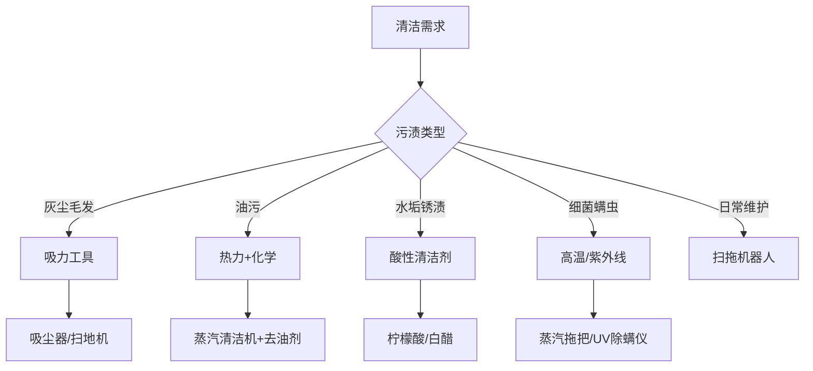
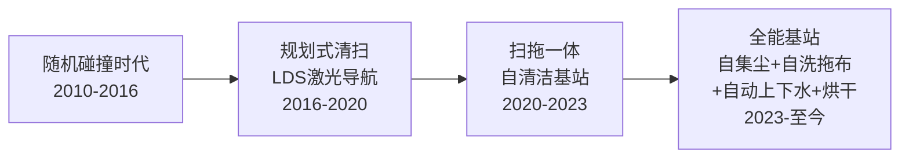

## 二、清洁工具推荐

清洁工具是家居维护的基础设施。选对工具，事半功倍；选错工具，费力不讨好。本章从清洁原理出发，帮你建立"工具-场景-方法"的完整认知，做到每一分钱都花在刀刃上。

### 2.1 清洁原理：为什么工具选型很重要

清洁的本质是四种物理/化学作用的组合：

| 作用类型 | 原理 | 对应工具 | 适用污渍 |
|---------|------|---------|---------|
| **机械力** | 摩擦、刮擦去除附着物 | 拖把、刷子、百洁布 | 泥土、灰尘、轻度油污 |
| **吸力** | 负压吸附颗粒物 | 吸尘器、扫地机 | 灰尘、毛发、碎屑 |
| **热力** | 高温溶解油脂、杀灭细菌 | 蒸汽拖把、蒸汽清洁机 | 油污、细菌、螨虫 |
| **化学反应** | 酸碱中和、氧化还原 | 清洁剂、小苏打、白醋 | 水垢、锈渍、顽固油污 |

理解这个框架后，你会发现：没有万能工具，只有场景匹配。厨房油污需要化学+热力组合，地毯深层灰尘需要强吸力+振动拍打，浴室水垢需要酸性清洁剂溶解。盲目购买只会让工具吃灰。

### 2.2 吸尘器

吸尘器是现代家庭清洁的核心装备。选购时需要关注四个核心参数：吸力（AW或Pa）、续航、重量、过滤系统。

#### 2.2.1 吸尘器的核心参数解读

**吸力单位换算：**

- **AW（Air Watts）**：气动功率，是衡量吸尘器实际清洁能力的最准确指标。一般家用无线吸尘器在100-200AW之间，戴森旗舰可达到240AW以上。
- **Pa（帕斯卡）**：真空度，反映最大吸力。手持吸尘器通常在20000-30000Pa，桶式吸尘器可达25000Pa以上。
- **W（瓦特）**：电机功率，不等于吸力，但高功率通常意味着更强的吸力上限。

> **注意**：很多品牌标注的是"最大功率"而非"持续功率"。实际使用中，持续功率才是日常清洁的有效吸力。选购时优先看AW值，其次看Pa值，W值仅作参考。

**过滤系统等级：**

| 过滤等级 | 过滤精度 | 拦截物 | 典型应用 |
|---------|---------|-------|---------|
| HEPA H10 | 85% @ 0.3μm | 大颗粒灰尘 | 入门级 |
| HEPA H12 | 99.5% @ 0.3μm | 花粉、霉菌孢子 | 中端主流 |
| HEPA H13 | 99.95% @ 0.3μm | PM2.5、细菌 | 高端标配 |
| HEPA H14 | 99.995% @ 0.3μm | 病毒载体颗粒 | 医疗级 |

有过敏体质或养宠家庭，强烈建议选择H12及以上等级。H10过滤效率不够，微小过敏原会从排气口重新喷出，反而加重过敏。

**气旋分离 vs 尘袋式：**

- **气旋分离**（戴森首创）：利用离心力分离灰尘，不堵塞滤网，吸力持久。缺点是清理集尘桶时会有灰尘飞扬。
- **尘袋式**：密封性好，丢弃时不会扬尘。缺点是尘袋是耗材，长期使用成本更高，且尘袋满后吸力下降明显。

#### 2.2.2 产品推荐与对比

**高端旗舰：戴森（Dyson）V15 Detect / Gen5detect**

- 价格：4000-5500元
- 吸力：240AW（V15）/ 262AW（Gen5）
- 续航：60分钟（节能模式）/ 8-12分钟（强效模式）
- 核心卖点：激光灰尘探测（绿光照射地面，肉眼可见灰尘分布）、压电式声学传感器（实时显示吸入颗粒大小和数量）、整机HEPA H13过滤
- 适合人群：对清洁品质有极致要求、有过敏体质、养宠家庭
- 不足：强效模式续航短、重量偏重（约3.1kg）、价格门槛高

**性价比之王：追觅（Dreame）V16 / T30 Pro**

- 价格：1500-2500元
- 吸力：210-240AW
- 续航：70-90分钟（标准模式）
- 核心卖点：吸力接近戴森旗舰水平，价格仅为一半。自研高速马达（15万转/分钟），双滚刷设计兼顾硬地面和地毯
- 适合人群：追求高性能但预算有限的家庭
- 不足：品牌知名度不如戴森，配件生态稍弱

**入门首选：小米（Xiaomi）G10 / 米家无线吸尘器2 Pro**

- 价格：500-1200元
- 吸力：150-185AW
- 续航：45-65分钟
- 核心卖点：米家生态链联动、性价比极高、配件易购。G10带自动调节吸力功能，根据灰尘量自动切换档位
- 适合人群：预算有限的首次购买者、租房党
- 不足：吸力与中高端有差距、HEPA滤网等级偏低（部分型号仅H10）

**有线桶式：美的/海尔工业吸尘器**

- 价格：200-600元
- 吸力：20000-25000Pa
- 续航：无限（有线供电）
- 核心卖点：吸力强劲且不受续航限制，适合大面积、重度清洁场景。可吸水（湿干两用），适合装修后开荒清洁
- 适合人群：有大面积清洁需求、装修后清洁、车库/地下室
- 不足：体积大、噪音高、移动不便

**选购决策矩阵：**

| 需求场景 | 推荐类型 | 预算范围 | 首选品牌 |
|---------|---------|---------|---------|
| 日常家用（硬地面为主） | 无线手持 | 1000-2500元 | 追觅、小米 |
| 日常家用（地毯为主） | 无线手持+电动地刷 | 2000-4000元 | 戴森、追觅 |
| 养宠家庭 | 高吸力+HEPA H13 | 2000-5500元 | 戴森V15、追觅T30 |
| 过敏体质 | HEPA H13+密封过滤 | 3000-5500元 | 戴森Gen5 |
| 大面积/开荒清洁 | 有线桶式 | 3000-8000元 | 美的、卡赫 |
| 预算有限 | 入门无线 | 500-1000元 | 小米、德尔玛 |

#### 2.2.3 使用与维护技巧

1. **定期清理滤网**：每2-4周用水清洗HEPA滤网（部分品牌不支持水洗，需用小刷子清理），晾干24小时后装回。滤网堵塞是吸力下降的最常见原因。
2. **不要等到尘杯满了才倒**：集尘量达到MAX线的2/3时就应清理，否则气旋分离效率下降，吸力明显减弱。
3. **电池保养**：避免长期满电或完全放电存放。日常使用后充电至100%即可拔下，长期不用时保持50-80%电量。
4. **刷头清理**：滚刷上缠绕的毛发需要定期用剪刀或附带的清理工具去除，否则电机负载增大，清洁效率下降。

### 2.3 扫地机器人

扫地机器人是"懒人清洁"的核心装备，但它的定位是**日常维护**，而非深度清洁。理解这个定位很重要——它能保持地面70-80%的洁净度，但顽固污渍、角落缝隙、地毯深层清洁仍需手动补充。

#### 2.3.1 核心技术演进

2024-2026年的旗舰级扫地机器人已经进入"全自动"时代：自动集尘（2-3个月换一次尘袋）、自动清洗拖布（热水洗+热风烘干）、自动上下水（接水管后无需手动换水）、自动添加清洁液。真正实现了"装好之后几乎不用管"。

#### 2.3.2 产品推荐

**高端旗舰：石头（Roborock）S8 MaxV Ultra / T8**

- 价格：4000-6000元
- 核心卖点：双滚刷防缠绕、6000Pa大吸力、声波震动拖布（每分钟3000次震动，模拟手动擦地）、RGB摄像头+结构光避障（可识别鞋子、数据线、宠物粪便等60+种障碍物）
- 全能基站：自动集尘+55°C热水洗拖布+热风烘干+自动上下水+自动添加清洁液
- 适合人群：追求极致自动化、120㎡以上户型

**性价比之选：科沃斯（Ecovacs）T30 Pro / X5 Pro**

- 价格：2500-4000元
- 核心卖点：零缠绕滚刷设计（真正不缠毛发）、智能复洗复拖（脏区域自动二次清洁）、YIKO语音助手
- 适合人群：养宠家庭、中大户型

**入门推荐：小米（Xiaomi）X20 Pro / 追觅 S20 Pro**

- 价格：1800-2800元
- 核心卖点：功能全面，基站配置齐全，性价比极高。小米支持米家生态联动，可设定"离家自动清扫"等场景
- 适合人群：首次购买、中小户型、智能家居用户

#### 2.3.3 选购关键指标

| 指标 | 说明 | 建议值 |
|-----|------|-------|
| 吸力 | Pa值，影响灰尘/颗粒物清扫能力 | ≥5000Pa |
| 导航方式 | LDS激光 vs 视觉导航 | 激光更稳定，视觉避障更好 |
| 避障能力 | 是否有结构光/摄像头避障 | 必须有，否则经常卡住 |
| 拖地方式 | 旋转拖布 vs 震动拖布 vs 平拖 | 震动拖布清洁力最强 |
| 基站功能 | 自集尘/自洗拖布/烘干/上下水 | 预算允许全选 |
| 噪音 | 标准模式下噪音 | ≤65dB |
| 地毯识别 | 是否能自动识别地毯并抬升拖布 | 必须有（否则湿地毯） |

#### 2.3.4 使用注意事项

1. **地面预处理**：清扫前收起地面上的袜子、数据线、小玩具等，否则容易缠绕或卡住机器人。虽然旗舰机有避障，但并非100%可靠。
2. **定期维护**：每2周检查主刷和边刷是否缠绕毛发，每月清理传感器（激光头、悬崖传感器），每2-3个月更换尘袋。
3. **拖布更换**：拖布属于消耗品，建议每3-6个月更换一次。使用时间过长后拖布纤维板结，清洁效果大幅下降。
4. **清洁液选择**：优先使用品牌配套清洁液。自制清洁液（如加入过多洗洁精）可能产生过多泡沫，损坏基站水泵。

### 2.4 拖把

拖把是最基础也最不可或缺的清洁工具。即使有扫地机器人，边角、楼梯、卫生间等场景仍然需要手动拖地。

#### 2.4.1 拖把类型全解析

**旋转拖把（拧水拖把）**

- 价格：50-150元
- 推荐品牌：大卫、妙洁、拓朴
- 原理：通过脚踏或手压旋转机构高速甩干拖布
- 优点：拧水彻底、不脏手、适合大面积拖地
- 缺点：桶体积大、存放占空间、甩干桶底部容易积水发霉
- 适合场景：硬地面日常清洁、大面积拖地
- 推荐指数：★★★★☆

**平板拖把（一次性/可换布）**

- 价格：30-100元
- 推荐品牌：大卫、妙洁、3M思高
- 原理：薄型平板夹持一次性静电除尘布或可水洗超细纤维布
- 优点：轻便灵活、可深入家具底部、不用洗拖布（一次性布）、静电除尘效果好
- 缺点：一次性布有耗材成本、清洁力不如湿拖
- 适合场景：日常除尘、家具底部清洁、木地板养护
- 推荐指数：★★★★★

**蒸汽拖把**

- 价格：200-800元
- 推荐品牌：鲨客（Shark）、必胜（Bissell）、卡赫（Kärcher）
- 原理：将水加热到120-150°C产生高温蒸汽，通过高温溶解油脂、杀灭99.9%细菌
- 优点：无需化学清洁剂、深度杀菌消毒、适合有小孩/宠物的家庭
- 缺点：需要预热时间（约30秒）、重量偏重（2-4kg）、只适合硬地面（木地板需谨慎使用，高温可能损伤漆面）
- 适合场景：厨房油污地面、卫生间消毒、瓷砖缝隙清洁
- 推荐指数：★★★★☆

> **蒸汽拖把使用注意**：不建议在实木地板上长时间停留，高温蒸汽可能导致木材膨胀变形。强化复合地板可以使用但要快速移动，不要在同一位置停留超过3秒。

**电动旋转拖把**

- 价格：200-500元
- 推荐品牌：洒哇地咔、由利
- 原理：电机驱动拖布盘高速旋转，模拟手动擦地动作
- 优点：省力、清洁效率高于手动拖把、自带喷水功能
- 缺点：需要充电、拖布盘较小、角落清洁能力一般
- 适合场景：日常快速拖地、不想弯腰拖地的用户

#### 2.4.2 拖布材质选择

| 材质 | 吸水性 | 去污力 | 适用地面 | 耐用度 |
|------|-------|-------|---------|-------|
| 超细纤维 | ★★★★★ | ★★★★☆ | 所有硬地面 | 高（可洗200+次） |
| 棉纱 | ★★★★☆ | ★★★☆☆ | 瓷砖、石板 | 中（易发硬） |
| 静电除尘布 | ★★☆☆☆ | ★★☆☆☆ | 所有地面 | 一次性 |
| 海绵 | ★★★★★ | ★★☆☆☆ | 瓷砖 | 低（易破损） |
| 雪尼尔 | ★★★★★ | ★★★★☆ | 所有硬地面 | 高 |

**最佳搭配方案**：日常除尘用平板拖把+静电除尘布，湿拖用旋转拖把+超细纤维布，深度消毒用蒸汽拖把。三者组合覆盖所有场景。

### 2.5 洗地机

洗地机是近年清洁电器领域最大的创新品类，它将吸尘、拖地、自清洁三合一，特别适合中国家庭硬地面为主的使用场景。

#### 2.5.1 洗地机 vs 吸尘器 vs 扫地机器人

| 维度 | 洗地机 | 无线吸尘器 | 扫地机器人 |
|------|-------|-----------|-----------|
| 干垃圾清洁 | ★★★★☆ | ★★★★★ | ★★★★☆ |
| 湿垃圾/液体 | ★★★★★ | ★☆☆☆☆ | ★★☆☆☆ |
| 油污清洁 | ★★★★★ | ★☆☆☆☆ | ★★☆☆☆ |
| 自动化程度 | ★★★☆☆ | ★★☆☆☆ | ★★★★★ |
| 边角清洁 | ★★★★☆ | ★★★★★ | ★★★☆☆ |
| 适用场景 | 厨房、餐厅、卫生间 | 全屋灰尘 | 日常维护 |
| 典型价格 | 1500-4000元 | 1000-5000元 | 2000-6000元 |

**结论**：洗地机和扫地机器人不是替代关系，而是互补。扫地机器人负责日常自动维护，洗地机负责深度清洁和突发污渍处理。

#### 2.5.2 产品推荐

**追觅（Dreame）H12 Pro Plus / H20 Pro**

- 价格：2000-3500元
- 核心卖点：热水洗地（60°C热水溶解油污）、双滚刷（前刷湿拖、后刷速干）、自清洁+热风烘干、电解水除菌（无需额外消毒液）
- 适合人群：厨房重度使用、有小孩的家庭

**添可（Tineco）芙万3.0 / iFloor 3**

- 价格：2000-3500元
- 核心卖点：智能识污（根据地面脏污程度自动调节吸力和出水量）、LCD屏幕显示清洁状态、语音提示
- 适合人群：追求智能化体验

**石头（Roborock）Flexi Pro**

- 价格：2000-3000元
- 核心卖点：平躺设计可深入家具底部（仅13cm高度）、可拆卸电池设计延长使用寿命
- 适合人群：家具底部空间低矮的家庭

#### 2.5.3 使用与维护

1. **每次使用后必须自清洁**：洗地机的最大杀手是不及时清洁导致的发臭。每次用完放回基站，启动自清洁程序。
2. **滚刷晾干**：自清洁后如果有热风烘干功能则自动烘干；如果没有，需要取出滚刷晾干，否则24小时内会发臭。
3. **污水箱及时倾倒**：污水箱中的脏水含有有机物，放置超过1天就会发臭、滋生细菌。
4. **清洁液使用**：优先使用品牌配套清洁液，不要加入洗洁精（泡沫过多会损坏机器）。

### 2.6 清洁剂

清洁剂的选择直接影响清洁效果和家庭安全。本节从化学原理出发，帮你建立科学的清洁剂认知。

#### 2.6.1 清洁剂的化学原理

| 污渍类型 | 化学本质 | 清洁原理 | 对应清洁剂 |
|---------|---------|---------|-----------|
| 油脂 | 甘油三酯（有机物） | 碱性皂化反应 | 洗洁精、烧碱、小苏打 |
| 水垢 | 碳酸钙/硫酸钙（无机盐） | 酸性溶解反应 | 白醋、柠檬酸、盐酸 |
| 锈渍 | 氧化铁（金属氧化物） | 酸性还原反应 | 草酸、柠檬酸、除锈剂 |
| 霉斑 | 真菌菌丝体 | 氧化杀灭 | 84消毒液（次氯酸钠）、双氧水 |
| 蛋白质污渍 | 蛋白质变性附着 | 酶解反应 | 含酶洗衣液、生物去渍剂 |
| 尿垢 | 尿酸结晶 | 碱性溶解 | 小苏打、专用尿垢清洁剂 |

> **安全警告**：84消毒液（次氯酸钠）和洁厕灵（盐酸）**绝对不能混用**！两者反应会产生氯气（Cl₂），吸入后可导致呼吸道灼伤甚至死亡。这不是"建议"，而是安全底线。

#### 2.6.2 家用万能清洁方案（小苏打+白醋+柠檬酸）

这三种天然清洁剂组合使用，可以覆盖家庭80%的清洁需求，且安全无毒、成本极低：

**小苏打（碳酸氢钠，NaHCO₃）**

- 原理：弱碱性（pH≈8.3），能与油脂发生皂化反应，生成可溶于水的皂盐
- 用法1：冰箱除臭——敞口放置一小碗，每月更换
- 用法2：厨房去油——小苏打+少量水调成糊状，涂抹油污处，静置10分钟后擦拭
- 用法3：下水道疏通——半杯小苏打+半杯白醋，倒入下水道，反应产生的气泡可松动堵塞物，15分钟后用热水冲
- 用法4：砧板消毒——撒小苏打后用柠檬切面擦拭，既能去味又能消毒
- 成本：约5元/500g

**白醋（醋酸，CH₃COOH，浓度5%）**

- 原理：弱酸性（pH≈2.4），能溶解碳酸钙类水垢
- 用法1：电水壶除水垢——倒入白醋没过水垢，加热煮沸后浸泡30分钟，水垢自动脱落
- 用法2：玻璃清洁——白醋+水1:1混合装入喷壶，喷洒后用报纸或超细纤维布擦拭，无水痕
- 用法3：洗衣机清洁——倒入200ml白醋，运行一个空桶热水洗涤程序，可去除内筒霉菌和异味
- 用法4：微波炉清洁——一碗水+2勺白醋，微波加热5分钟，蒸汽软化内壁污渍，轻松擦拭
- 成本：约5元/500ml

**柠檬酸（C₆H₈O₇）**

- 原理：有机酸，酸性强于白醋，对水垢的溶解效率更高
- 用法1：电水壶/热水瓶除水垢——1勺柠檬酸+水煮沸，效果优于白醋
- 用法2：淋浴花洒清洁——柠檬酸+温水浸泡花洒头30分钟，去除出水孔堵塞
- 用法3：不锈钢器具光亮——柠檬酸水溶液擦拭不锈钢表面，去除水渍和指纹
- 用法4：马桶除垢——撒入柠檬酸，静置30分钟后刷洗
- 成本：约8元/500g

#### 2.6.3 专业清洁剂推荐

**厨房去油：**

- **威猛先生厨房重油污清洁剂**（约15元/500ml）：喷洒后泡沫附着油污表面，分解油脂后擦拭即可。适合抽油烟机、灶台、墙面瓷砖。
- **花王（Kao）厨房泡沫漂白喷雾**（约25元/400ml）：日本配方，泡沫细腻，对陈年油污效果好。
- **Frosch菲洛施厨房清洁剂**（约40元/500ml）：德国品牌，植物基配方，无刺激性气味，适合不喜欢化学气味的用户。

**卫浴清洁：**

- **花王魔术灵马桶清洁剂**（约20元/300ml）：弯嘴设计直达马桶内壁死角，凝胶质地附着力强，静置10分钟后冲水即可。
- **Mistolin浴室清洁剂**（约30元/500ml）：葡萄牙品牌，对浴室玻璃水渍、瓷砖缝隙霉斑效果显著。
- **威猛先生浴室清洁剂**（约15元/500ml）：性价比选择，日常使用足够。

**地板清洁：**

- **碧丽珠木地板清洁剂**（约25元/500ml）：专为木地板设计，含养护成分，清洁同时保护漆面。
- **庄臣（SC Johnson）地板清洁片**（约20元/30片）：一次一片溶于水，方便计量，适合日常湿拖。
- **花王地板清洁剂**（约30元/400ml）：速干配方，不留水痕。

**除霉专用：**

- **花王除霉泡沫喷雾**（约25元/400ml）：喷洒后泡沫自动分解霉斑，无需刷洗，10分钟后冲洗即可。对浴室硅胶条、瓷砖缝隙黑霉效果极佳。
- **84消毒液**（约5元/500ml）：最经济的除霉方案，但有刺激性气味，使用时需通风。注意：只能用于白色表面，会漂白有色材质。

#### 2.6.4 清洁剂安全使用守则

1. **绝不混用**：84消毒液+洁厕灵=氯气（剧毒）；84消毒液+酒精=氯仿（有害）；双氧水+白醋=过氧乙酸（腐蚀性强）。任何两种清洁剂混用前，先确认化学兼容性。
2. **通风使用**：使用含氯、含氨清洁剂时务必开窗通风，避免呼吸道刺激。
3. **戴手套**：长期接触清洁剂会导致皮肤屏障受损。做家务时佩戴橡胶手套，完成后涂抹护手霜。
4. **存放安全**：清洁剂放在儿童无法触及的高处，不同品类分开存放，避免标签脱落导致误用。
5. **先小面积测试**：新清洁剂首次使用时，先在不显眼的小区域测试，确认不会损伤材质。

### 2.7 专用清洁工具

除了上述大件，以下小工具也是家庭清洁的刚需：

#### 2.7.1 玻璃清洁

**磁力擦窗器**

- 价格：50-200元
- 原理：两块磁力板分别贴在玻璃内外侧，移动内侧时外侧同步移动
- 适用场景：高层外窗清洁，不用探身窗外
- 注意事项：根据玻璃厚度选择磁力档位（单层玻璃选弱磁，双层中空玻璃选强磁）。初次使用容易掉落，需要适应操作手法。

**玻璃刮水器**

- 价格：15-50元
- 用法：喷洒玻璃清洁液后，用刮水器从上到下、从左到右依次刮除，每刮一道用干布擦拭刮条
- 效果：比报纸擦拭更快、更干净、无水痕

#### 2.7.2 除螨工具

**紫外线除螨仪**

- 价格：200-600元
- 推荐品牌：戴森、小米、摩飞
- 原理：UV-C紫外线（波长254nm）破坏螨虫DNA，配合高频振动拍打将螨虫从织物深层震出，再用吸力吸走
- 使用频率：每周1-2次，每次每个区域照射30秒以上
- 注意事项：UV-C对皮肤和眼睛有伤害，使用时不要直视灯管。仅对织物表面有效，无法深入床垫内部。

**除螨喷雾**

- 价格：30-80元
- 原理：含有苯甲酸苄酯等成分，通过化学方式杀灭螨虫
- 适合场景：不便使用除螨仪的场景（如厚窗帘、大型布艺沙发）
- 注意事项：喷洒后需通风，部分人可能对喷雾成分过敏

#### 2.7.3 马桶刷

**一次性马桶刷**

- 价格：刷柄30-50元 + 替换头约30元/30个
- 推荐品牌：庄臣（Scrubbing Bubbles）、妙洁
- 优点：刷头含清洁剂，用完即弃，不滋生细菌。传统马桶刷最大的问题是刷头长期潮湿、细菌滋生。
- 替代方案：电动马桶刷（约100-200元），旋转刷头省力高效

#### 2.7.4 缝隙清洁工具

- **缝隙清洁刷**（约10-30元/套）：专门设计的窄头刷子，适合清洁推拉门轨道、窗框缝隙、瓷砖接缝
- **高压蒸汽清洁笔**（约100-200元）：用高温蒸汽清洁顽固缝隙污渍，无需化学清洁剂
- **硅胶刮条**（约10-20元）：清洁淋浴房玻璃水渍、台面积水，不伤表面

### 2.8 清洁工具的收纳与管理

工具买回来只是开始，合理的收纳和管理决定了你是否会持续使用它们。

#### 2.8.1 收纳原则

1. **就近原则**：清洁工具存放在使用场景附近。厨房清洁剂放厨房水槽下方，卫生间清洁剂放浴室柜内。
2. **通风干燥**：拖把、刷子使用后必须悬挂晾干，不能平放在地上或塞在角落。潮湿环境下细菌繁殖速度是干燥环境的10倍以上。
3. **垂直收纳**：利用墙面挂钩、洞洞板、伸缩杆等工具，将清洁工具挂起来，节省地面空间且便于沥水。
4. **标签化**：自制清洁液的喷壶上必须贴标签，注明成分和配比。无标签的透明液体是最危险的——你无法区分是清水、白醋还是消毒液。

#### 2.8.2 清洁工具更换周期

| 工具 | 更换周期 | 更换信号 |
|------|---------|---------|
| 拖把头/拖布 | 3-6个月 | 纤维板结、异味无法去除 |
| 吸尘器HEPA滤网 | 6-12个月 | 清洗后吸力仍明显下降 |
| 扫地机边刷 | 3-6个月 | 刷毛弯曲变形、清扫边缘有遗漏 |
| 扫地机主刷 | 6-12个月 | 刷毛磨损明显 |
| 扫地机尘袋 | 1-3个月 | 基站提示或集尘效果下降 |
| 洗地机滚刷 | 3-6个月 | 滚刷变色、清洁后地面仍有水痕 |
| 百洁布/海绵 | 2-4周 | 变色、异味、清洁力下降 |
| 马桶刷 | 3-6个月（传统）/ 用完即弃（一次性） | 刷毛变形 |

### 2.9 不同户型的清洁工具配置方案

#### 2.9.1 单身公寓（30-60㎡）

| 工具 | 推荐 | 预算 |
|------|------|------|
| 日常清洁 | 扫地机器人（小米X20/追觅S20） | 1800-2500元 |
| 深度清洁 | 洗地机（追觅H12 Pro） | 2000-2500元 |
| 除尘 | 小米无线吸尘器 | 600-1000元 |
| 拖地 | 平板拖把+静电布 | 50-100元 |
| 清洁剂 | 小苏打+白醋+柠檬酸+一瓶厨房去油剂 | 30-50元 |
| **合计** | | **约4500-6000元** |

#### 2.9.2 三口之家（80-120㎡）

| 工具 | 推荐 | 预算 |
|------|------|------|
| 日常清洁 | 扫地机器人全能基站（石头S8/科沃斯T30） | 3000-4500元 |
| 深度清洁 | 洗地机（添可芙万3.0/追觅H20 Pro） | 2500-3500元 |
| 除尘 | 追觅V16/戴森V12 | 1500-3000元 |
| 拖地 | 旋转拖把+蒸汽拖把 | 250-500元 |
| 除螨 | 除螨仪（小米/戴森） | 300-500元 |
| 窗户 | 磁力擦窗器 | 100-200元 |
| 清洁剂 | 全品类配齐 | 100-200元 |
| **合计** | | **约7500-12000元** |

#### 2.9.3 大户型/别墅（150㎡+）

| 工具 | 推荐 | 预算 |
|------|------|------|
| 日常清洁 | 扫地机器人×2（多楼层各一台） | 6000-10000元 |
| 深度清洁 | 洗地机+有线桶式吸尘器 | 3000-6000元 |
| 除尘 | 戴森Gen5detect/V15 | 3500-5500元 |
| 拖地 | 蒸汽拖把（卡赫）+旋转拖把 | 400-800元 |
| 除螨 | 高端除螨仪（戴森） | 500-800元 |
| 窗户 | 电动擦窗机器人 | 500-1500元 |
| 高压清洗 | 高压水枪（卡赫）庭院/车库 | 800-2000元 |
| 清洁剂 | 全品类+大容量 | 200-400元 |
| **合计** | | **约15000-27000元** |

### 2.10 常见误区与纠正

**误区一：扫地机器人能完全替代手动清洁**

事实：扫地机器人擅长日常维护性清洁，但对顽固污渍、角落缝隙、地毯深层清洁效果有限。正确做法是扫地机器人做日常（每天/隔天），每周1次手动深度清洁。

**误区二：吸尘器吸力越大越好**

事实：吸力过大对轻薄织物（窗帘、薄纱）可能造成吸附损伤，对木地板也可能刮伤表面。关键是吸力可调节，不同场景用不同档位。

**误区三：清洁剂越贵越好**

事实：小苏打+白醋+柠檬酸这三种总成本不超过20元的天然清洁剂，可以解决家庭80%的清洁问题。专业清洁剂是针对特定场景的补充，而非替代。

**误区四：蒸汽拖把万能**

事实：蒸汽拖把对硬地面油污和杀菌效果确实出色，但不适用于实木地板（高温损伤漆面）、不适用于地毯、不适用于有涂层的表面。

**误区五：洗地机能替代吸尘器**

事实：洗地机对干垃圾（特别是大颗粒如碎纸屑）的吸入能力不如专业吸尘器，而且不适合清洁地毯。洗地机的强项是湿垃圾和液体污渍。

**误区六：84消毒液和洁厕灵一起用更干净**

事实：这是最危险的清洁误区。两者混合会产生剧毒的氯气，每年都有因此中毒甚至死亡的案例。任何情况下都不要混用含氯和含酸的清洁剂。
