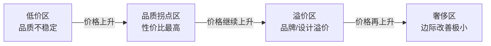

## 三、家居好物推荐

家居好物不是"别人说好就买"，而是基于你的生活场景、动线习惯和预算约束做出的系统性选择。本章按空间维度拆解每个房间的核心好物，但在此之前，先建立一套通用的选购思维框架——选对东西的前提是知道怎么选。

### 3.1 家居好物的选购方法论

#### 3.1.1 三层筛选模型

面对任何家居产品，用三层漏斗逐步收窄选择范围：

| 筛选层级 | 核心问题 | 决策依据 |
|---------|---------|---------|
| 第一层：必要性 | 这个东西解决的是真实痛点还是伪需求？ | 回忆过去一个月是否三次以上因为缺少它而感到不便 |
| 第二层：品质阈值 | 这个品类的品质底线在哪里？低于什么标准不如不买？ | 查阅专业测评，确定该品类的"及格线"参数 |
| 第三层：性价比区间 | 在品质达标的产品中，哪个价位段的边际收益最高？ | 对比价格与核心性能指标的关系曲线 |

大多数人的购买错误发生在第一层——被种草内容制造了伪需求。一个简单的验证方法：把这个东西加入购物车，等 7 天。如果 7 天后你仍然清楚地记得"我为什么需要它"，再下单。

#### 3.1.2 品类定价规律

家居产品存在明显的"品质拐点"——低于某个价位品质断崖式下降，高于某个价位边际改善极小：

**各品类典型品质拐点参考：**

| 品类 | 低价陷阱区 | 品质拐点区（推荐） | 溢价区 |
|-----|----------|----------------|-------|
| 枕头 | <50 元 | 100-300 元 | >500 元 |
| 床品四件套 | <150 元 | 250-600 元 | >1000 元 |
| 锅具 | <80 元 | 200-500 元 | >800 元 |
| 花洒 | <100 元 | 200-600 元 | >1000 元 |
| 落地灯 | <60 元 | 150-400 元 | >800 元 |

核心原则：在品质拐点区购买，不追低价也不追奢侈。把省下来的预算分配到使用频率最高的物品上。

#### 3.1.3 使用频率决定投入权重

一个简单公式：**单品投入上限 = 日均使用次数 × 单次使用时长(分钟) × 0.5 元**

举例：枕头每晚使用 1 次 × 480 分钟 = 240 元合理投入上限；厨房计时器每天使用 2 次 × 5 分钟 = 5 元——所以计时器买最便宜的就行，枕头则值得认真挑选。

### 3.2 卧室好物：睡眠质量是第一优先级

人的一生有三分之一在卧室度过。卧室好物的核心逻辑只有一条：**一切服务于睡眠质量**。

#### 3.2.1 乳胶枕

**为什么枕头值得重金投入？**

枕头直接影响颈椎曲度。人体颈椎有一个自然的 C 形前凸弧度，枕头的作用是在侧卧和仰卧时维持这个弧度。枕头过高，颈椎被迫前屈；过低，颈椎悬空——两种情况都会导致颈部肌肉整夜处于紧张状态，第二天醒来肩颈酸痛。

**乳胶枕的核心参数：**

| 参数 | 说明 | 推荐值 |
|-----|------|-------|
| 乳胶含量 | 天然乳胶占总重量百分比 | ≥90%（低于 80% 大概率是合成胶） |
| 密度 | 影响软硬和支撑力 | 40-60D（偏硬选 55D+，偏软选 40-45D） |
| 高度 | 仰卧时拳头高度 ≈ 枕高 | 仰卧为主选 8-10cm，侧卧为主选 10-13cm |
| 透气孔 | 影响散热和排湿 | 蜂窝状透气孔越多越好 |
| 气味 | 天然乳胶有淡淡橡胶味 | 有刺鼻化学气味的直接排除 |

**选购避坑要点：**

- **真假乳胶辨别**：真乳胶表面有自然的纹理和少量瑕疵，颜色呈乳白偏黄；过于洁白光滑的大概率是合成胶或添加了荧光剂。用手掰弯乳胶枕，真乳胶不会出现碎屑脱落。
- **"泰国进口"陷阱**：国内很多所谓泰国进口乳胶枕，实际是国产乳胶贴牌。辨别方法：查看报关单和原产地证明，或者认准有泰国工厂直营资质的品牌（如 Napatig、Ventry、Latex Systems）。
- **价格底线**：100 元以下的"天然乳胶枕"基本不可能是真正的天然乳胶，原料成本就不够。品质拐点在 150-300 元区间。

**推荐品牌与价位：**

| 品牌 | 价位 | 特点 | 适合人群 |
|-----|------|-----|---------|
| NapPatig（泰国） | 200-350 元 | 乳胶含量 93%+，蜂窝透气孔设计 | 追求正宗泰国乳胶 |
| Latex Systems（泰国） | 250-400 元 | 工厂直营，品质稳定 | 预算充足，看重品控 |
| 网易严选/京东京造 | 150-250 元 | 性价比高，平台品控有保障 | 预算有限但拒绝劣质品 |
| 邓禄普工艺枕 | 200-350 元 | 邓禄普工艺（比特拉雷工艺更硬实） | 偏好硬枕、体重较大者 |

#### 3.2.2 遮光窗帘

**遮光的科学依据：**

人体的褪黑素分泌受光线调控。即使闭眼，眼皮只能阻挡约 80% 的光线——剩余 20% 仍会通过眼皮刺激视网膜，抑制褪黑素分泌。研究显示，卧室光照强度每增加 10 lux，入睡潜伏期延长约 5 分钟，深度睡眠时间减少约 8%。

**遮光窗帘的三个等级：**

| 遮光等级 | 遮光率 | 适用场景 | 价格区间 |
|---------|-------|---------|---------|
| 半遮光 | 70-85% | 客厅、书房（不需要完全黑暗） | 50-150 元/米 |
| 全遮光 | 90-95% | 普通卧室 | 100-300 元/米 |
| 100% 遮光 | 99%+ | 对光线敏感者、白天需要睡觉的人（如夜班工作者） | 150-500 元/米 |

**选购要点：**

- **面料选择**：全遮光窗帘通常采用涂银、涂白或三明治结构（两层面料中间夹黑丝）。涂银款遮光效果最好但手感较硬，三明治结构兼顾遮光和手感。
- **窗帘宽度**：窗帘宽度应为窗户宽度的 1.5-2 倍，太窄会产生漏光缝隙。顶部漏光是常见问题，建议搭配窗帘盒或选择顶部遮光设计的款式。
- **安装方式**：罗马杆漏光较严重（杆体两侧和顶部），窗帘盒+滑轨是遮光效果最好的安装方式。如果已经装了罗马杆，可以加装挡光板。
- **颜色选择**：深色面料的遮光率通常比浅色高 5-10%，但差距不大。卧室推荐深灰、深蓝等低饱和度颜色，有助于营造睡眠氛围。

#### 3.2.3 床品四件套

**面料知识体系：**

床品面料直接决定触感、透气性和耐久性。核心要理解的不是品牌，而是面料纤维本身：

| 面料 | 触感 | 透气性 | 耐久性 | 价位（四件套） | 适合季节 |
|-----|------|-------|-------|-------------|---------|
| 纯棉（40 支） | 柔软，略有粗糙感 | ★★★★ | ★★★★ | 150-300 元 | 四季通用 |
| 长绒棉（60 支） | 丝滑细腻 | ★★★★☆ | ★★★★★ | 300-600 元 | 四季通用 |
| 长绒棉（100 支） | 接近丝绸质感 | ★★★★ | ★★★★★ | 500-1200 元 | 四季通用 |
| 天丝（莱赛尔） | 凉感丝滑 | ★★★★★ | ★★★ | 300-700 元 | 春夏 |
| 真丝 | 极致顺滑 | ★★★★★ | ★★ | 1500 元+ | 春夏 |
| 磨毛 | 温暖柔软 | ★★★ | ★★★★ | 200-400 元 | 秋冬 |
| 法兰绒 | 厚实保暖 | ★★ | ★★★ | 150-350 元 | 严冬 |

**"支数"是什么？**

支数（S）表示纱线的粗细程度——1 磅棉花纺成 840 码长的纱线，就是 1 支。支数越高，纱线越细，面料越细腻。但支数不是越高越好：60 支是性价比最高的甜蜜点，100 支以上面料过于细腻反而容易勾丝起球，且日常使用体感差异不大。

**选购实操指南：**

1. **看标签执行标准**：国标 GB/T 22844-2009 是床品的强制标准，优等品 > 一等品 > 合格品。至少选一等品。
2. **看面料成分**：标注"100% 棉"才是纯棉。"棉混纺""涤棉"都不是纯棉。长绒棉应标注具体品种（新疆长绒棉、埃及棉、匹马棉）。
3. **看织造方式**：贡缎（缎纹）比平纹和斜纹更光滑细腻，但更容易滑动。日常使用推荐斜纹，兼顾手感和耐用。
4. **闻气味**：有刺鼻气味的不要买，可能甲醛超标或使用了劣质染料。
5. **水洗标信息**：正规产品水洗标上应有：纤维成分、洗涤说明、执行标准号、安全类别（A 类婴幼儿可接触 > B 类可直接接触皮肤 > C 类非直接接触）。

#### 3.2.4 白噪音机

**白噪音改善睡眠的原理：**

白噪音包含人耳可听范围（20Hz-20kHz）内的所有频率，且能量均匀分布。它的助眠机制是"声掩蔽"——用一个稳定的、无信息量的声音信号覆盖环境中的突发噪音（汽车声、邻居说话声、水管声），使大脑不被这些突变信号惊醒。

**白噪音 vs 粉噪音 vs 棕噪音：**

| 类型 | 频率特征 | 听感 | 适合场景 |
|-----|---------|------|---------|
| 白噪音 | 各频率能量相等 | 嘶嘶声，类似电视雪花 | 掩蔽高频噪音 |
| 粉噪音 | 低频能量更强 | 像瀑布、下雨声 | 大多数人的最佳助眠选择 |
| 棕噪音 | 低频能量极强 | 低沉的轰鸣声 | 深度放松、冥想 |

**选购要点：**

- **音源类型**：硬件白噪音机比手机 App 好在两点——不消耗手机电量、不会被通知消息打断。但如果你已经习惯用手机，一个好用的 App（如潮汐、小睡眠）完全可以替代硬件。
- **音效种类**：至少要有雨声、海浪、风扇声、森林声这几类。每个人的偏好不同，最好先用 App 试听找到最适合自己的声音类型。
- **音量控制**：推荐音量在 40-50 分贝（相当于轻声交谈），过高反而干扰睡眠。
- **定时功能**：必须有，整晚播放既费电也容易让大脑产生依赖。建议设定 30-60 分钟后自动关闭，此时你已经入睡。

**推荐产品：**

| 产品 | 价位 | 特点 |
|-----|------|-----|
| 潮汐 App（免费/付费） | 0-98 元/年 | 界面精美，音效丰富，国产最佳 |
| LectroFan | 200-350 元 | 20 种音效，专业级白噪音机 |
| Yogasleep Dohm | 150-250 元 | 物理风扇产生真实白噪音，非电子模拟 |
| 小睡眠 App | 免费 | 音效种类极多，支持混音自定义 |

### 3.3 客厅好物：舒适与氛围并重

客厅是家的社交中心和日常起居空间。好物选择的核心逻辑：**提升日常舒适度 + 营造空间氛围感**。

#### 3.3.1 落地灯

**为什么落地灯比主灯更舒适？**

主灯（吸顶灯/吊灯）提供的是顶部直射光，照度高但光线方向单一，容易产生眩光和阴影对比过强。落地灯提供的是间接照明——光线经过灯罩漫反射后柔和地散布到空间中，照度较低但均匀度高，更接近黄昏时的自然光环境，视觉舒适度显著优于主灯。

**灯光色温与场景对照：**

| 色温 | 视觉感受 | 适合场景 | 推荐值 |
|-----|---------|---------|-------|
| 2700K | 暖黄光，温馨放松 | 休息、阅读、睡前 | 客厅首选 |
| 3000K | 暖白光，自然舒适 | 日常起居、会客 | 全屋通用 |
| 4000K | 中性白光，清醒明亮 | 厨房操作、工作区 | 不推荐客厅 |
| 5000K+ | 冷白光，偏蓝 | 办公室、手术室 | 家庭环境避免使用 |

**落地灯类型与适用场景：**

| 类型 | 特点 | 适合位置 | 价格区间 |
|-----|------|---------|---------|
| 间接照明落地灯 | 光线向上打到天花板再漫反射 | 沙发旁、角落 | 150-500 元 |
| 阅读落地灯 | 灯头可调节角度，定向照明 | 沙发旁、书桌旁 | 100-400 元 |
| 装饰落地灯 | 造型独特，以装饰为主 | 电视墙旁、玄关 | 200-800 元 |
| 氛围落地灯 | 可调色温/亮度/颜色 | 沙发区、阳台 | 100-600 元 |

**选购要点：**

- **光源类型**：首选 LED，功耗低、寿命长、不发热。确认是否支持色温和亮度调节（调光调色），能调的实用性远高于固定色温。
- **灯罩材质**：布艺灯罩出光柔和，适合氛围照明；金属灯罩出光集中，适合定向照明；玻璃灯罩兼顾装饰和照明。
- **稳定性**：落地灯重心要稳，底座直径越大越稳。有宠物或小孩的家庭，选择底座重且不易倾倒的款式。
- **智能控制**：支持遥控器或 App 控制的落地灯使用体验远好于需要弯腰去按开关的款式。

#### 3.3.2 香薰机/加湿器

**加湿的必要性：**

中国北方冬季供暖期间室内相对湿度可低至 15-20%，远低于人体舒适的 40-60% 区间。低湿度环境会导致：皮肤干裂、鼻腔黏膜干燥（降低上呼吸道免疫力，更容易感冒）、静电频发、木质家具开裂。加湿器不是可选的装饰品，而是北方冬季的刚需电器。

**超声波式 vs 蒸发式加湿器：**

| 对比维度 | 超声波式 | 蒸发式 |
|---------|---------|-------|
| 工作原理 | 高频振荡将水雾化 | 风扇吹过湿润滤网自然蒸发 |
| 加湿效率 | 高，出雾可见 | 中等，无可见水雾 |
| 水质要求 | 高（自来水会产生白色粉末） | 低（自来水可用） |
| 噪音 | 低 | 中等（有风扇声） |
| 细菌风险 | 较高（水雾携带细菌） | 较低（自然蒸发） |
| 价格 | 100-400 元 | 200-800 元 |
| 适合场景 | 卧室、小面积空间 | 客厅、大面积空间、有呼吸道敏感者 |

**选购要点：**

- **水箱容量**：卧室用 2-3L（连续工作 8-12 小时），客厅用 4-6L。水箱太小需要频繁加水，太大则换水时搬动不便。
- **加湿量**：卧室建议 200-300mL/h，客厅建议 300-500mL/h。加湿量过大会导致局部湿度过高，容易滋生霉菌。
- **噪音**：卧室使用噪音必须 <35dB，客厅 <45dB。购买前查看产品标注的噪音值，实际使用噪音通常比标注值高 5-10dB。
- **清洁便利性**：水箱口径要大，手能伸进去清洗。窄口设计的水箱用不了多久就会在内壁形成黏滑的生物膜，成为细菌温床。
- **香薰功能**：如果需要香薰功能，确认是独立的香薰盒设计（精油不经过水箱和超声波片），否则精油会腐蚀超声波片并污染水箱。

**推荐品牌：**

| 品牌 | 类型 | 价位 | 特点 |
|-----|------|-----|------|
| 小熊 | 超声波 | 80-200 元 | 性价比高，款式多 |
| 舒乐氏 | 蒸发式 | 300-600 元 | 无白粉，适合呼吸道敏感者 |
| 无印良品 | 超声波+香薰 | 200-400 元 | 设计简洁，香薰效果好 |
| 米家 | 超声波/蒸发 | 100-400 元 | 智能联动，App 控制 |

#### 3.3.3 懒人沙发/豆袋

**为什么懒人沙发让人放松？**

传统沙发有固定靠背角度，身体必须迁就家具。懒人沙发（豆袋）的填充物会根据你的体形自适应塑形，使身体重量均匀分布，减少压力集中点。从人体工学角度，这类似于"零重力"状态——身体各部位受力均匀，肌肉不需要持续紧张来维持姿势。

**选购要点：**

- **填充物**：EPS（聚苯乙烯）颗粒是最常见的填充物，直径越大越耐用（推荐 1mm+）。劣质小颗粒用几个月就会被压碎塌陷。高端款使用记忆棉碎片或混合填充。
- **外套材质**：棉麻材质透气但不耐脏，科技布/超纤皮耐脏好清洁但透气性差。推荐可拆洗的双层设计（内胆+外套）。
- **尺寸**：单人选 80-100cm 直径，双人选 120cm+。太小坐感局促，太大占据过多空间。
- **回弹性**：好的豆袋坐下去后起身能迅速恢复原状，差的需要手动拍打才能复原。

**价格区间与品质对应：**

| 价位 | 品质预期 |
|-----|---------|
| 100-200 元 | 基础款，填充物质量一般，半年左右需要补充颗粒 |
| 200-500 元 | 品质款，填充物密度高，外套可拆洗，1-2 年不用补充 |
| 500-1000 元 | 高端款，记忆棉混合填充，设计感强，使用寿命 3 年+ |

#### 3.3.4 收纳茶几

**客厅收纳的痛点：**

客厅是家里最容易乱的空间——遥控器、纸巾盒、零食、杂志、充电线、游戏手柄……这些小物件如果全摆在茶几表面，视觉上就是一团混乱。收纳茶几的核心价值是"台面极简，内部充裕"。

**收纳茶几的类型：**

| 类型 | 特点 | 适合场景 | 价格区间 |
|-----|------|---------|---------|
| 抽屉式 | 两侧或单侧抽屉 | 需要分类收纳小物件 | 300-800 元 |
| 开放式下层 | 底部开放式搁板 | 放置书籍、杂志 | 200-500 元 |
| 升降式 | 桌面可升高，内部储物 | 兼做餐桌/工作台 | 500-1500 元 |
| 翻盖式 | 整个桌面可翻开 | 大量收纳需求 | 400-1000 元 |

**选购要点：**

- **高度**：茶几高度应与沙发座面齐平或略低（通常 35-45cm），过高使用不便，过低拿取物品需要弯腰。
- **边角处理**：有小孩的家庭选择圆角设计，避免磕碰受伤。
- **材质**：实木耐用但重，板材轻但耐用性一般，钢化玻璃时尚但需要经常擦拭。日常实用首选实木或高质量板材。
- **尺寸**：茶几长度建议为沙发长度的 1/2 到 2/3，太长影响动线，太小使用不便。

### 3.4 厨房好物：效率与体验并重

厨房是家中设备密度最高的空间，好物选择的核心逻辑是**提升烹饪效率、降低清洁成本**。

#### 3.4.1 铸铁锅

**为什么铸铁锅值得投资？**

铸铁的热容量（单位体积储存热量的能力）远高于不锈钢和铝合金。这意味着铸铁锅在大火加热后能保持稳定的温度，食材下锅时不会出现明显的温度骤降——这就是为什么铸铁锅煎牛排能产生完美的美拉德反应（焦化外壳），而不粘锅煎出来总是水煮的效果。

**铸铁锅的核心参数：**

| 参数 | 说明 | 推荐值 |
|-----|------|-------|
| 重量 | 越重蓄热越好，但操作不便 | 28cm 煎锅 3-4kg 为佳 |
| 壁厚 | 影响蓄热均匀性 | 4-5mm |
| 内壁处理 | 机加工光滑 vs 砂铸粗糙 | 机加工光滑面更易清洁和养锅 |
| 涂层 | 预Seasoned（已开锅）vs 裸铁 | 新手选预 Seasoned |

**铸铁锅的使用和养护：**

1. **开锅**：新铸铁锅需要开锅——清洗后擦干，薄薄涂一层植物油（亚麻籽油最佳），放入烤箱 200°C 烤 1 小时，自然冷却。重复 2-3 次。开锅的目的是在铁表面形成一层聚合油膜，即天然不粘层。
2. **日常使用**：中火预热 2-3 分钟（手放锅上方 10cm 感觉热气即可），加油，开始烹饪。铸铁锅不需要大火，中火就能达到很好的效果。
3. **清洁**：趁温热时用热水+软刷清洗，不要用洗洁精（会破坏油膜）。顽固残渣可以用粗盐+纸巾擦拭。洗后立即擦干或小火烘干，薄涂一层油。
4. **存放**：放在干燥通风处，叠放时用厨房纸隔开。

**常见误区：**

| 误区 | 纠正 |
|-----|------|
| 铸铁锅不能做酸性食物 | 短时间烹饪（<30 分钟）酸性食物没问题，但不要长时间炖煮番茄酱等酸性食物，会腐蚀油膜并有铁味 |
| 铸铁锅越重越好 | 重量要和使用者臂力匹配，太重的操作不便反而降低使用频率 |
| 铸铁锅永远不用换 | 保养得当的铸铁锅确实可以用几十年甚至传代，但如果出现裂纹则必须更换 |

**推荐品牌：**

| 品牌 | 价位 | 特点 | 适合人群 |
|-----|------|-----|---------|
| Lodge（美国） | 150-350 元 | 性价比之王，预开锅，品质稳定 | 首次购买铸铁锅 |
| Staub（法国） | 500-1500 元 | 珐琅铸铁，无需养锅，颜值高 | 预算充足，不想养锅 |
| Le Creuset（法国） | 600-2000 元 | 珐琅铸铁标杆，颜色丰富 | 追求品质和设计 |
| 珠江/臻三环 | 80-200 元 | 国产老牌铸铁，性价比高 | 预算有限 |

#### 3.4.2 硅胶厨具套装

**为什么需要硅胶厨具？**

不粘锅的涂层（特氟龙/PTFE）硬度低，金属锅铲会在表面产生划痕，加速涂层脱落。硅胶厨具的硬度远低于涂层材料，不会造成机械损伤。同时硅胶耐温范围广（-40°C 至 230°C），可以安全用于高温烹饪。

**选购要点：**

- **材质认证**：必须是食品级硅胶（通过 FDA 或 LFGB 认证）。非食品级硅胶在高温下可能释放有害物质。辨别方法：拉伸后不应出现白色——纯硅胶拉伸不变色，掺了白炭黑（二氧化硅填充剂）的拉伸会发白。
- **骨架材质**：硅胶铲内部通常有不锈钢或尼龙骨架。不锈钢骨架更耐用，尼龙骨架更轻便。
- **耐温上限**：确认标注的耐温范围，至少 200°C 以上。低于 180°C 的在爆炒场景下可能变形。
- **套装内容**：基础套装应包含：锅铲、汤勺、漏勺、油刷、夹子。不需要的工具不要买，厨房收纳空间宝贵。

**推荐产品：**

| 品牌 | 价位 | 特点 |
|-----|------|-----|
| Joseph Joseph | 100-300 元 | 设计精良，收纳方案好 |
| 双立人硅胶系列 | 150-400 元 | 品质稳定，耐温高 |
| 国产食品级硅胶套装 | 30-80 元 | 性价比高，功能齐全 |

#### 3.4.3 厨房计时器

**为什么不用手机计时？**

手机计时的三个问题：（1）厨房手上有油水时操作手机不卫生且容易打滑；（2）手机放在厨房容易被油烟覆盖；（3）手机来电/通知会打断计时。一个 20 元的磁吸计时器彻底解决这些问题。

**选购要点：**

- **磁吸功能**：可以吸附在冰箱或油烟机上，随手可拿。
- **时间范围**：至少支持 99 分 59 秒，部分菜品需要更长时间（如炖煮），选购支持小时计时的款。
- **响铃音量**：厨房环境噪音大（油烟机、炒菜声），计时器响铃必须足够响，至少 80dB。
- **操作方式**：旋转拨盘式比按键式操作更快——一只手就能设定时间。

#### 3.4.4 沥水篮

**沥水篮的选择逻辑：**

沥水篮看起来是小事，但每天使用频率极高（洗菜、洗水果、洗碗后沥水），选错会天天烦。

**类型对比：**

| 类型 | 特点 | 适合场景 | 价格 |
|-----|------|---------|-----|
| 台面沥水篮 | 放在台面上，底部有接水盘 | 水槽旁有足够台面空间 | 20-60 元 |
| 水槽沥水篮 | 架在水槽上方，直接沥入水槽 | 台面空间不足 | 30-80 元 |
| 可折叠沥水篮 | 不用时可折叠收纳 | 厨房空间极小 | 30-70 元 |
| 旋转沥水篮 | 可 360° 旋转，方便操作 | 沙拉脱水、洗菜 | 50-150 元 |

**选购要点：**

- **材质**：PP 塑料轻便但容易老化变色，304 不锈钢耐用但较重。日常家用 PP 就够了，追求耐用选不锈钢。
- **孔径**：洗米洗菜需要小孔径（2-3mm）防止米粒/细小食材漏出，洗水果可以选大孔径（5mm+）沥水更快。
- **容量**：2-3 人家庭选 3-4L，4 人以上选 5L+。
- **排水设计**：底部最好有导流槽或倾斜设计，水能自动排走而不积水。

### 3.5 浴室好物：每天提升一点幸福感

浴室的使用特点是高频、短时、私密。好物选择的核心逻辑：**减少不适感 + 提升卫生水平**。

#### 3.5.1 恒温花洒

**为什么水温忽冷忽热？**

传统花洒没有温度控制能力，水温完全取决于冷热水的管道压力比。当家里其他水点（如厨房水龙头、洗衣机）用水时，冷水管道压力下降，冷水量减少，花洒出水温度瞬间升高——这就是你洗澡时突然被烫一下的原因。恒温花洒内置恒温阀芯，通过热敏元件（蜡质或形状记忆合金）自动调节冷热水混合比例，在 0.5 秒内将水温稳定在设定值。

**恒温花洒的核心参数：**

| 参数 | 说明 | 推荐值 |
|-----|------|-------|
| 阀芯类型 | 蜡质阀芯 vs 形状记忆合金阀芯 | 蜡质阀芯响应快、寿命长 |
| 温度精度 | 水温波动范围 | ±1°C 以内 |
| 安全锁定 | 防止误操作导致水温过高 | 必须有 38°C 安全锁 |
| 最低启动水压 | 低水压环境下能否正常工作 | 0.1MPa 以下 |
| 出水模式 | 不同出水方式的数量 | 至少 3 种（雨淋/按摩/混合） |

**选购要点：**

- **阀芯品牌**：恒温阀芯是核心部件，认准德国产（如汉斯格雅、高仪）或日本产（如 TOTO、KVK）。国产阀芯在温度精度和耐久性上仍有差距。
- **热水器适配**：恒温花洒需要热水器提供稳定的热水供应。即热式电热水器（功率不足时）和太阳能热水器（水温波动大）配合使用效果可能不佳。
- **安装条件**：需要确认冷热水管道间距（标准 15cm）和水压。老旧小区水压不稳定的建议先安装增压泵。
- **日常维护**：恒温阀芯对水质有要求，硬水地区建议在进水端加装简易过滤器，防止水垢堵塞阀芯。

**推荐品牌与价位：**

| 品牌 | 价位 | 特点 |
|-----|------|-----|
| 汉斯格雅 | 1500-5000 元 | 恒温花洒标杆，德国阀芯 |
| 高仪 | 1000-3000 元 | 品质稳定，性价比高于汉斯格雅 |
| 摩恩 | 500-1500 元 | 美系品牌，耐用性好 |
| 箭牌/九牧 | 200-800 元 | 国产龙头，入门恒温花洒 |

#### 3.5.2 速干浴巾

**为什么普通浴巾不够好？**

普通纯棉浴巾吸水后干燥慢，在浴室这种高湿环境中，一条用过的棉浴巾需要 6-12 小时才能完全干燥。在这段时间里，浴巾表面的湿度和温度为细菌繁殖提供了理想条件——这就是为什么棉浴巾用几天后会有一股"闷臭味"。速干浴巾的核心价值不是吸水更快，而是干燥更快，从源头减少细菌滋生。

**面料对比：**

| 面料 | 吸水速度 | 干燥速度 | 手感 | 耐久性 | 价格 |
|-----|---------|---------|------|-------|-----|
| 纯棉 | ★★★★ | ★★ | 柔软亲肤 | ★★★★ | 30-100 元 |
| 超细纤维 | ★★★★★ | ★★★★ | 偏滑，不如棉亲肤 | ★★★ | 40-150 元 |
| 竹纤维 | ★★★★ | ★★★☆ | 柔软，有抑菌性 | ★★★ | 50-200 元 |
| 木棉/纱布 | ★★★ | ★★★★★ | 轻薄透气 | ★★★ | 30-100 元 |

**选购建议：**

- 如果追求极致速干：选超细纤维或纱布浴巾，2-4 小时可完全干燥。
- 如果追求手感舒适：选竹纤维或长绒棉，兼顾吸水和手感。
- **尺寸选择**：成人浴巾推荐 70×140cm 以上，太小包裹不住身体。
- **更换频率**：速干浴巾也建议 3-4 个月更换一次，或出现异味/变硬时立即更换。

#### 3.5.3 智能马桶盖

**为什么智能马桶盖是"用过就回不去"的产品？**

智能马桶盖的核心功能——温水冲洗——在清洁效果上远优于纸巾擦拭。从卫生学角度看，用水清洗能去除 95% 以上的残留物，而纸巾擦拭只能去除约 50-60%。长期使用对痔疮、肛裂等肛周疾病的预防和缓解有明确帮助。

**核心功能分级：**

| 功能 | 必要性 | 说明 |
|-----|-------|------|
| 座圈加热 | ★★★★★ | 冬天最刚需的功能，告别冰冷马桶圈 |
| 温水冲洗 | ★★★★★ | 核心功能，臀洗+妇洗双模式 |
| 暖风烘干 | ★★★☆ | 省去用纸，但烘干需要 2-3 分钟，大多数人还是会用纸擦 |
| 自动翻盖 | ★★☆ | 感应到人走近自动翻盖，锦上添花 |
| 除臭功能 | ★★★ | 活性炭或催化除臭，实际效果有限 |
| 夜灯 | ★★ | 柔和的夜间照明，避免开大灯影响睡意 |

**选购要点：**

- **尺寸适配**：购买前必须测量马桶的尺寸——马桶圈安装孔距（标准 13-19cm 可调）、马桶长度（从安装孔中心到马桶前端的距离）、马桶宽度。不合适的尺寸无法安装。
- **加热方式**：储热式 vs 即热式。储热式有一个小水箱，持续加热保持水温，但水量有限（冲洗 30-40 秒后水温下降）；即热式通过大功率加热管实时加热水流，水温恒定且不限量。即热式明显更优，但价格也更高。
- **水压与水温**：水压可调（至少 3 档），水温可调（至少 3 档，推荐 35-40°C）。喷嘴材质选不锈钢（比塑料更耐用和卫生）。
- **喷嘴自洁**：必须有喷嘴自洁功能——每次使用前后喷嘴自动清洗，防止交叉污染。
- **安全认证**：涉水产品必须有国家涉水安全认证。漏电保护功能是必选项。

**推荐品牌与价位：**

| 品牌 | 价位 | 特点 | 适合人群 |
|-----|------|-----|---------|
| TOTO（日本） | 2000-5000 元 | 智能马桶盖鼻祖，品质标杆 | 预算充足，追求品质 |
| 松下（日本） | 1500-4000 元 | 即热式技术成熟，售后完善 | 注重技术参数 |
| 智米/小米 | 800-1500 元 | 性价比极高，智能联动 | 预算有限，米家生态用户 |
| 海尔/箭牌 | 600-1200 元 | 国产大厂，售后网点多 | 追求售后便利 |

### 3.6 全屋通用好物

以下好物不属于某个特定房间，但对全屋生活品质有显著提升：

#### 3.6.1 除湿盒/除湿机

**适用场景**：南方回南天、梅雨季、地下室。相对湿度超过 70% 时，霉菌繁殖速度急剧加快，衣物发霉、墙面返潮、木质家具变形等问题接踵而来。

| 产品 | 适用面积 | 价位 | 特点 |
|-----|---------|-----|------|
| 氯化钙除湿盒 | 5-10㎡ | 5-15 元/盒 | 一次性，适合衣柜、鞋柜等小空间 |
| 压缩机除湿机 | 20-60㎡ | 500-2000 元 | 效果最好，可连续排水 |
| 转轮除湿机 | 10-30㎡ | 300-1000 元 | 低温环境效果优于压缩机式 |

#### 3.6.2 门底密封条

**为什么值得装？**

门底缝隙是室内隔音和隔尘的最大漏洞。一扇普通室内门的门底缝隙通常有 1-2cm，按门宽 80cm 计算，总漏风面积可达 8-16cm²——相当于在墙上开了一个小洞。安装门底密封条后，卧室隔音效果可提升 5-8dB，灰尘进入量减少约 40%。

**推荐类型**：自粘式硅胶密封条，价格 10-30 元/条，安装无需工具。选择与门底间隙匹配的厚度（通常 5-15mm）。

#### 3.6.3 插线板（带 USB 口）

**选购要点**：

- **新国标**：必须选新国标（GB 2099.7-2015），旧国标插孔过大存在安全隐患。
- **过载保护**：内置过载保护开关，当总功率超过额定值时自动断电。
- **USB 口**：至少 2 个 USB-A + 1 个 USB-C，单口输出 ≥2.4A。
- **线长**：根据使用场景选择，床头 1.5m 足够，书桌建议 3m。
- **间距**：插孔间距要足够大，大号插头（如笔记本电源适配器）不会挡住相邻插孔。

### 3.7 家居好物采购策略

#### 3.7.1 采购时间规划

| 时间节点 | 适合购买 | 原因 |
|---------|---------|-----|
| 618（6月） | 大家电（花洒、智能马桶盖） | 全年最大折扣力度之一 |
| 双11（11月） | 全品类 | 年度最大促销 |
| 双12（12月） | 小家居物件 | 折扣力度次于双11但品类全 |
| 品牌日 | 该品牌全品类 | 品牌方让利，有时比大促更划算 |
| 平时 | 刚需不等促销 | 需要就买，不要为了等促销忍受不便 |

#### 3.7.2 平台选择建议

| 平台 | 适合品类 | 优势 | 注意事项 |
|-----|---------|-----|---------|
| 京东自营 | 大家电、品质品牌 | 物流快、售后好、正品保障 | 价格偏高，注意比价 |
| 天猫旗舰店 | 品牌官方正品 | 官方直售、活动多 | 注意区分旗舰店和授权店 |
| 拼多多 | 小物件（沥水篮、计时器等） | 价格极低 | 质量参差不齐，看评价和销量 |
| 1688 | 批量采购同品类 | 工厂价，极低 | 需要辨别商家，退换不便 |

#### 3.7.3 预算分配建议

以一个普通家庭 5000 元家居升级预算为例的合理分配：

| 优先级 | 品类 | 建议预算 | 理由 |
|-------|------|---------|-----|
| P0 | 枕头+床品 | 800-1200 元 | 每天 8 小时使用，影响健康 |
| P0 | 恒温花洒/智能马桶盖 | 800-2000 元 | 每天使用，提升日常幸福感 |
| P1 | 遮光窗帘 | 300-600 元 | 改善睡眠质量 |
| P1 | 落地灯 | 200-400 元 | 提升居住氛围 |
| P2 | 加湿器/香薰机 | 150-300 元 | 改善空气质量 |
| P2 | 厨房好物套装 | 200-500 元 | 提升烹饪效率 |
| P3 | 其他小物件 | 200-500 元 | 按需逐步添置 |

**核心原则：先解决每天使用 8 小时以上的物品（床品、卫浴），再处理每天使用 1-3 小时的物品（厨房、客厅），最后添置锦上添花的小物件。**

### 3.8 常见误区与纠正

| 误区 | 正确认知 |
|-----|---------|
| 贵的一定好 | 价格超过品质拐点后，溢价部分来自品牌和设计而非功能。200 元的乳胶枕和 800 元的在睡眠改善上差异极小 |
| 一步到位买齐 | 家居好物应该逐步添置，先解决痛点最大的，体验后再决定下一步 |
| 只看销量排名 | 销量高可能是因为便宜而非好用。应结合专业测评和真实用户评价综合判断 |
| 追求多功能 | 单一功能做好比多功能但每个都做不好强得多。恒温花洒不需要带蓝牙音箱 |
| 忽视尺寸适配 | 智能马桶盖、窗帘、茶几等必须量好尺寸再买，退换货极其麻烦 |
| 跟风买网红产品 | 种草内容有利益驱动，先看差评再看好评，差评中暴露的问题才是真实的产品缺陷 |
