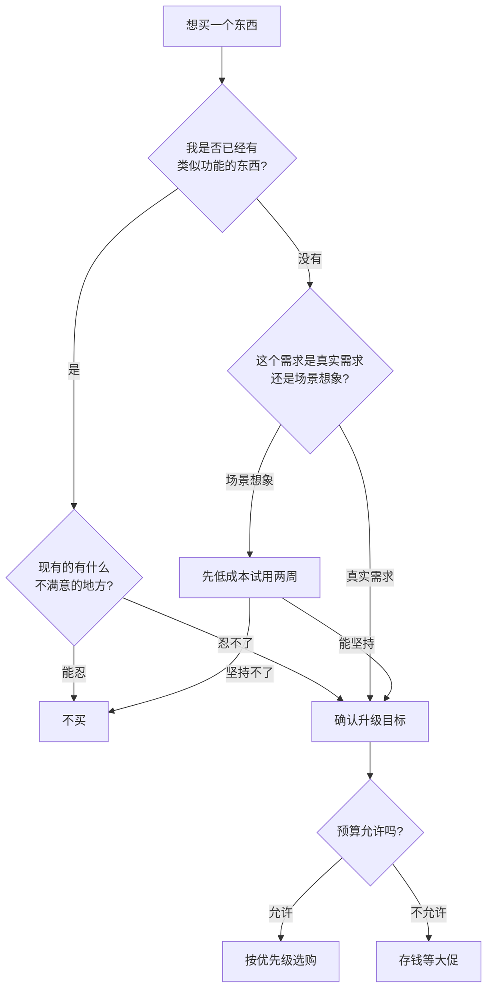

## 五、选购建议

前面四节分别推荐了收纳工具、清洁工具、家居好物和智能家居产品，但"知道有什么"和"会买对东西"之间隔着一条鸿沟。很多人面对琳琅满目的商品，要么冲动下单吃灰，要么纠结太久错过真正需要的东西，要么花了冤枉钱买到不适合自己的产品。

本节提供一套从思维框架到实操落地的完整选购体系——包括选购原则、决策流程、品类深度指南、渠道策略、预算分配、避坑清单和分阶段方案。目标是让你在有限预算内做出最优决策，让每一分钱都花在刀刃上。

### 5.1 选购的底层逻辑

在讨论具体产品之前，先建立几个底层认知。这些原则能帮你避免绝大多数消费陷阱。

#### 5.1.1 原则一：先整理，后购买

很多人的第一反应是"家里乱，买收纳盒"。但收纳工具的本质是管理已有物品，如果物品本身没有筛选和分类，再好的收纳盒也只是给杂物换个容器。

正确流程：

1. **断舍离**——清理掉不需要、重复、过期的物品。这是最关键的一步，很多人跳过这一步直接买收纳工具，结果是用更贵的容器装垃圾
2. **分类整理**——对保留物品按功能、使用频率、使用场景分类。比如厨房调料按"每天用/偶尔用/极少用"分三级
3. **测量空间**——用卷尺量好柜子、抽屉、架子的内部尺寸，拍照记录。线上购买的退换货，80%是因为尺寸不对
4. **选择工具**——根据分类结果和空间尺寸，选择合适的收纳工具类型和规格
5. **购买入库**——下单购买，到货后按规划好的位置放置

**真实案例**：小李卧室衣柜塞满了衣服，一口气买了10个收纳箱。结果花了一下午把不穿的衣服清理掉后（捐赠30件、丢弃15件），剩下的衣服只用了5个收纳箱就装好了。如果他先整理再购买，能省下一半的收纳箱钱和一个下午的退换货时间。

#### 5.1.2 原则二：高频用品值得投入，低频用品够用就好

这是性价比的黄金法则。核心逻辑是"单次使用成本"——把总价除以预计使用次数，才是真正有意义的比较方式。

| 使用频率 | 判定标准 | 投资策略 | 典型品类 |
|----------|----------|----------|----------|
| 超高频（每天多次） | 日均使用≥3次 | 买最好的，不心疼 | 牙刷、毛巾、拖鞋、手机充电器 |
| 高频（每天使用） | 每天至少1次 | 值得多花钱买品质 | 枕头、床品、菜刀、砧板、马桶 |
| 中频（每周几次） | 每周2-3次 | 中等价位，平衡品质和价格 | 吸尘器、咖啡机、瑜伽垫 |
| 低频（每月几次） | 每月≤4次 | 经济款即可 | 收纳箱、节日装饰、工具箱 |
| 极低频（一年几次） | 一年≤5次 | 最便宜的，能用就行 | 搬家用品、应急工具、节日灯饰 |

**计算示例**：一把30元的拖把用3个月（90天），单次使用成本 = 30 ÷ 90 = 0.33元/天。一把80元的拖把用2年（730天），单次使用成本 = 80 ÷ 730 = 0.11元/天。贵的那把反而每天便宜0.22元，两年下来总共省了 (0.33 × 730) - 80 = 160.9元。

#### 5.1.3 原则三：警惕"场景想象"式消费

"买了这个瑜伽垫我就能坚持锻炼"、"有了这个咖啡机我就能每天早起"、"买了这些书我就能看完"——这种把购买行为等同于行为改变的想法，是消费主义最常见的话术。

**自我检验法**：如果你没有某个习惯，先用最低成本坚持两周，确认能坚持后再升级装备。具体操作：

- 想买跑步机？先在小区跑两周，每天记录
- 想买咖啡机？先用挂耳咖啡喝两周，看是否真的每天喝
- 想买投影仪？先用手机+纸箱DIY一个简易投影，看是否真的每周看电影

**数据支撑**：据闲鱼2023年数据，跑步机、健身器材、烘焙工具是转卖率最高的家居品类前三名，平均闲置时间不到3个月。这意味着每10个买跑步机的人里，至少有6个在3个月内就放弃了。

#### 5.1.4 原则四：单一功能优于多功能

多功能产品听起来划算（"一个顶三个"），但实际使用中往往是每个功能都做不好。一个集吸尘、拖地、除螨于一体的设备，通常吸力不如专用吸尘器、拖地不如专用拖把、除螨不如专用除螨仪。

**例外情况**：当空间极度有限时（如出租屋、宿舍），多功能产品的"省空间"价值可以弥补功能上的妥协。但如果是自己的房子且空间充足，优先选单一功能的专业产品。

#### 5.1.5 原则五：可维修性决定长期成本

购买前想想：这个东西坏了能修吗？配件容易买到吗？

- **好维修**：戴森吸尘器（配件通用、官方维修点多）、宜家家具（配件可单独购买）、小米生态链产品（配件便宜）
- **难维修**：小众品牌智能设备（配件停产、无维修点）、一次性设计产品（一体成型、无法拆卸）、进口小家电（配件需海淘）

**经验值**：一个产品如果核心配件（滤芯、电池、刀头）无法单独更换，它的实际使用寿命就是这些配件的寿命，而不是产品的设计寿命。

### 5.2 购买决策流程图

面对一个想买的东西，用以下流程快速判断：

这个流程看起来简单，但能帮你过滤掉至少一半的冲动消费。关键节点是"先低成本试用两周"——这一步能帮你避免绝大多数场景想象式消费。

### 5.3 购买优先级排序

如果预算有限，建议按以下优先级逐步添置。排序逻辑：先解决影响日常体验最大的痛点，再做锦上添花的改善。

| 优先级 | 品类 | 核心原因 | 预算建议 | 省钱替代方案 |
|--------|------|----------|----------|-------------|
| ★★★★★ | 床品和枕头 | 每天使用8小时，直接影响睡眠质量和身体健康 | 总预算的20-30% | 无——睡眠用品不建议省钱 |
| ★★★★☆ | 基础收纳工具 | 让家变得整洁有序，减少找东西的时间浪费 | 根据整理结果按需购买 | 纸箱+牛皮纸袋临时过渡 |
| ★★★★☆ | 清洁工具 | 保持整洁的基础，好工具能节省大量时间和体力 | 200-500元起步 | 先买平板拖把+多功能清洁剂 |
| ★★★☆☆ | 照明改善 | 良好灯光对视力保护和空间氛围提升明显 | 100-300元/房间 | LED灯泡更换（十几元） |
| ★★★☆☆ | 厨房核心工具 | 提升烹饪体验，间接改善饮食健康 | 根据做饭频率定 | 先买一把好菜刀+一块好砧板 |
| ★★☆☆☆ | 智能家居 | 便利性提升，非刚需 | 逐步添置 | 先买智能插座（30元）体验 |
| ★☆☆☆☆ | 装饰美化 | 锦上添花，最后考虑 | 量力而行 | 绿植（10-30元/盆）性价比最高 |

**操作建议**：不必一次性买齐。先买优先级最高的1-2个品类，用一两周感受改善效果，再决定下一步添置什么。这种"小步快跑"的方式，能避免一次性大采购带来的后悔感。

### 5.4 具体品类的深度选购指南

#### 5.4.1 床品选购

床品是家居消费中最值得投入的品类——你每天有1/3的时间在睡觉，床品质量直接影响睡眠质量，而睡眠质量又影响第二天的精力、情绪和工作效率。

**面料选择对比**：

| 面料类型 | 触感 | 透气性 | 耐用性 | 适合季节 | 价格区间 | 选购要点 |
|----------|------|--------|--------|----------|----------|----------|
| 纯棉 | 柔软亲肤 | 良好 | 好 | 四季通用 | 100-500元 | 看支数和密度，不只看"100%纯棉" |
| 天丝/莱赛尔 | 丝滑凉爽 | 优秀 | 中等 | 夏季首选 | 200-600元 | 认准兰精天丝商标，仿品很多 |
| 磨毛 | 温暖厚实 | 一般 | 中等 | 冬季专用 | 150-400元 | 便宜的容易起球，选32支以上 |
| 亚麻 | 粗犷自然 | 极好 | 好 | 夏季 | 300-800元 | 新的偏硬，越洗越软 |
| 真丝 | 丝滑奢华 | 好 | 差 | 四季 | 500-3000元 | 19姆米以上才有质感，娇贵难护理 |

**支数和密度的真相**：

- **支数**（Thread Count, TC）：表示纱线的粗细，数字越高纱线越细、手感越柔滑。40支是入门标准，60支有明显提升感，80支以上接近丝滑
- **密度**：每平方英寸的经纬纱线总数，与支数配合决定面料品质
- **警惕虚标**：宣称"1000支"的廉价四件套基本都是虚标。真正的高支数面料成本很高，200元以下的"80支"大概率不是真80支
- **经验值**：60支×400根的面料密度是性价比甜蜜点——手感明显优于40支，价格又不像80支那么贵，一套在200-400元之间

**枕头选购的科学方法**：

枕头的高度选择不是"差不多就行"，而是直接影响颈椎健康的严肃问题。

| 睡姿 | 推荐高度 | 原因 | 推荐材质 |
|------|----------|------|----------|
| 仰睡为主 | 8-10cm（一拳高） | 维持颈椎自然弧度 | 记忆棉、乳胶 |
| 侧睡为主 | 12-15cm（一拳半高） | 填充肩颈间隙 | 乳胶、荞麦 |
| 仰侧交替 | 10-12cm（可调节） | 兼顾两种姿势 | 可调节高度的乳胶枕 |
| 俯卧（趴睡） | 5-7cm或不用枕头 | 避免颈椎过度后仰 | 超薄记忆棉 |

**材质对比**：

- **乳胶枕**：支撑性好、天然抗菌，但偏热、有橡胶味（通风一周可散）、不能暴晒。适合喜欢Q弹支撑感的人
- **记忆棉**：贴合度高、压力分散好，但透气一般、冬天偏硬。适合喜欢被"包裹"感的人
- **荞麦枕**：透气好、可调节高度，但翻身有声响、需要定期晾晒。适合怕热的人
- **羽绒枕**：蓬松柔软、轻盈，但支撑力不足、容易塌陷、价格高。适合仰睡且不需强支撑的人

**床品避坑清单**：

1. 不要只看"100%纯棉"标签——这是最基本的门槛，决定品质的是支数、密度和织法
2. 警惕"埃及棉"、"海岛棉"等营销术语——真正的长绒棉成本极高，百元级产品不可能是真品
3. 新买的床品必须先洗再用——生产过程中的甲醛、浮色、灰尘都需要清洗去除
4. 枕头建议每1-2年更换——使用超过2年的枕头，重量的1/3可能是螨虫尸体和皮屑

#### 5.4.2 收纳工具选购

**材质深度对比**：

| 材质 | 优点 | 缺点 | 适合场景 | 价格 | 使用寿命 |
|------|------|------|----------|------|----------|
| PP塑料 | 轻便、耐用、防水、易清洁 | 低温易脆、不耐晒 | 厨房、卫生间、衣柜 | 中等 | 3-5年 |
| 无纺布 | 便宜、轻便、可折叠 | 不防水、易塌、不耐用 | 临时收纳、换季衣物 | 低 | 0.5-1年 |
| 竹木 | 美观、环保、承重好 | 需防潮、怕虫蛀 | 客厅展示、干区收纳 | 较高 | 3-8年 |
| 金属 | 坚固、承重强、耐用 | 偏重、可能生锈 | 工具收纳、车库 | 中高 | 5-10年 |
| 牛皮纸 | 环保、可塑形、文艺感 | 不防水、承重差 | 桌面小物件、装饰性收纳 | 低 | 1-2年 |

**尺寸选购的核心方法**：

购买前必须做的一件事：用卷尺量好目标空间的内部尺寸，然后拍照记录。具体注意：

- **柜子深度**：收纳盒深度 = 柜子深度 - 2cm（留取放余量）
- **抽屉高度**：收纳盒高度 = 抽屉内部高度 - 1cm
- **横向排列**：算好能并排放几个，每个之间留0.5cm间隙方便抽取
- **纵向堆叠**：PP塑料箱可以叠放2-3层，无纺布和纸箱不建议叠放

**避坑清单**：

1. 不要买太多同尺寸收纳盒——不同物品需要不同大小，建议先列清单再买
2. 无纺布收纳盒用半年就塌——如果预算允许，优先选PP塑料
3. 带盖子的收纳盒不一定好——频繁取用的物品用开放式的更方便
4. 抽屉式收纳优于翻盖式——翻盖式需要上面有空间才能打开，抽屉式不需要

#### 5.4.3 清洁工具选购

**核心工具对比**：

| 工具类型 | 适合场景 | 价格区间 | 优点 | 缺点 |
|----------|----------|----------|------|------|
| 平板拖把 | 小户型硬地板日常清洁 | 30-80元 | 轻便、好收纳、拖布可替换 | 大面积费力 |
| 旋转拖把 | 中大户型硬地板 | 60-150元 | 不用手拧、省力 | 占空间、桶容易脏 |
| 蒸汽拖把 | 深度消毒、厨房油污 | 200-600元 | 高温杀菌、去油污强 | 偏重、需插电 |
| 无线吸尘器 | 全屋地面+缝隙+床褥 | 500-4000元 | 多场景、吸力强 | 续航有限、需定期清理滤芯 |
| 扫地机器人 | 日常地面维护 | 1000-5000元 | 全自动、省心 | 无法深度清洁、有死角 |
| 洗地机 | 吸拖一体、顽固污渍 | 1500-4000元 | 吸拖同步、效率高 | 偏重、需自清洁维护 |

**清洁剂精简方案**——不需要买十几瓶，三瓶基本搞定全屋：

1. **多功能清洁剂**（30-60元）：日常擦拭桌面、地板、玻璃
2. **厨房重油污清洁剂**（20-40元）：灶台、油烟机、锅底
3. **浴室除霉清洁剂**（20-40元）：瓷砖缝隙、玻璃水垢、马桶

**清洁工具的维护成本**：

很多人只看购买价格，忽略了后续维护成本：

| 工具 | 每年维护成本 | 维护内容 |
|------|-------------|----------|
| 平板拖把 | 60-120元 | 每2-3个月换一块拖布（15-30元/块） |
| 无线吸尘器 | 100-300元 | 滤芯每3-6个月更换（50-150元/个） |
| 扫地机器人 | 200-500元 | 边刷+滤芯+拖布（半年换一次） |
| 洗地机 | 150-400元 | 滚刷+滤芯+清洁液 |

购买时把"购买价格 + 第一年维护成本"作为总成本来比较，才是真正的性价比计算。

#### 5.4.4 智能家居选购

**入门三件套**（总投入100-200元，体验提升最明显）：

1. **智能灯泡/灯带**（30-80元）：手机调色温、亮度，定时开关，睡前自动暖光
2. **智能插座**（30-60元）：把传统电器变"智能"——定时开关台灯、热水器、风扇
3. **智能音箱**（50-200元）：语音控制以上设备，还可以当闹钟、播放音乐、查天气

**平台选择是最重要的决策**：

选错了平台，后期不同品牌设备无法联动，体验大打折扣。

| 平台 | 生态丰富度 | 价格 | 适合人群 | 优势 |
|------|-----------|------|----------|------|
| 米家 | 最丰富（500+品类） | 低-中 | 预算有限、想要丰富选择 | 品类最全、性价比高 |
| Apple HomeKit | 中等 | 高 | 苹果全家桶用户 | 隐私保护好、系统集成深 |
| 天猫精灵 | 较丰富 | 低 | 淘系购物用户 | 语音购物、内容丰富 |
| 华为HiLink | 中等 | 中-高 | 华为手机用户 | 鸿蒙联动、稳定 |

**原则**：优先选同一生态。如果你已经用米家的灯泡，后续买智能插座也买米家的，这样可以用一个APP统一控制，设置自动化场景（如"回家模式"一键开灯+开空调+播放音乐）。

**智能家居避坑**：

1. 不要为了"智能"而智能——一个开关能解决的事，没必要换成语音控制
2. 警惕需要"网关"才能用的产品——有些设备需要额外购买网关（100-200元），总成本比看起来高
3. 优先选支持"本地控制"的设备——纯云端控制的设备，断网就变废铁
4. Wi-Fi设备不宜过多——路由器连接设备有上限（一般15-30个），超过会导致网络不稳定

#### 5.4.5 照明改善

好的灯光是提升居住体验最低成本的方式之一——很多人家里只有一盏吸顶灯，色温6500K冷白光，长期在这种光线下生活容易视觉疲劳、影响情绪。

**色温选择指南**：

| 色温 | 感觉 | 适合场景 | 建议 |
|------|------|----------|------|
| 2700-3000K | 暖黄光，温馨放松 | 卧室、客厅、餐厅 | 睡前1小时切换到暖光助眠 |
| 4000K | 自然白光，清晰舒适 | 书房、工作区 | 日间工作的最佳色温 |
| 5000-6500K | 冷白光，明亮刺眼 | 厨房、卫生间（局部） | 不建议作为主灯长期使用 |

**最省钱的照明改善方案**（100元以内）：

1. 把卧室吸顶灯换成可调色温的LED灯泡（30-50元）
2. 书桌上加一盏可调亮度的台灯（50-80元）
3. 走廊装一个感应夜灯（15-30元）

#### 5.4.6 厨房核心工具

如果预算有限只买三样，优先买这三样——它们能覆盖90%的烹饪场景：

1. **一把好菜刀**（100-300元）：中式切片刀（如十八子作、拓牌），比套装刀实用得多。日常只需要一把主刀+一把水果刀
2. **一块好砧板**（80-200元）：推荐整竹砧板或抗菌PP砧板，避免用拼接竹砧板（胶水甲醛风险）
3. **一口好炒锅**（100-300元）：熟铁锅（如陈枝记、老饭骨）导热快、适合爆炒，养好锅不粘

### 5.5 购买渠道与时机策略

#### 5.5.1 渠道选择

| 渠道 | 优势 | 劣势 | 适合品类 | 注意事项 |
|------|------|------|----------|----------|
| 京东自营 | 物流快（当日/次日达）、售后好、正品保障 | 价格稍高 | 大件家电、电子产品、需要售后的产品 | 认准"自营"标识，第三方店铺品质参差 |
| 天猫旗舰店 | 品牌官方、活动多、品类全 | 需辨别授权店 | 品牌日用品、服饰 | 看店铺评分和开店年限，新店要谨慎 |
| 拼多多百亿补贴 | 价格最低、适合标准化产品 | 需辨别真假、售后弱 | 标准化小商品（衣架、垃圾袋等） | 选"百亿补贴"标签商品，有平台兜底 |
| 1688 | 工厂直供、价格最低 | 起批量大、售后弱、物流慢 | 收纳盒、衣架、清洁工具等小件 | 找"一件代发"的店铺，降低试错成本 |
| 线下宜家/无印/名创 | 可实物体验、即买即用 | 价格透明度低、选择有限 | 需要触摸体验的产品（枕头、毛巾） | 记下型号回家比价，线下可能更贵 |
| 闲鱼/转转 | 价格最低、能淘到好货 | 无售后、需鉴别 | 非贴身类二手物品 | 只买同城可面交的，现场验货 |

#### 5.5.2 最佳购买时间节点

**全年大促日历**：

| 时间 | 活动 | 适合买什么 | 折扣力度 |
|------|------|-----------|----------|
| 3月 | 女神节/春季家装 | 床品、收纳、小家电 | ★★★☆ |
| 6月（618） | 年中大促 | 大件家电、智能家居 | ★★★★★ |
| 9月 | 秋季家装节 | 换季家居品、收纳 | ★★★☆ |
| 11月（双11） | 全年最大促销 | 全品类，尤其大件 | ★★★★★ |
| 12月 | 年终清仓 | 上一年款式的尾货 | ★★★★ |

**日常比价工具**：

- **慢慢买**（manmanbuy.com）：查看京东/天猫/拼多多的历史价格曲线，一眼看出是否真降价
- **什么值得买**（smzdm.com）：社区推荐+历史低价，适合发现好价
- **比价插件**（如意淘、购物党）：浏览器插件，浏览商品时自动显示历史价格

**识别假促销的方法**：

1. 看历史价格——如果大促前一个月突然涨价30%，然后"降价30%"，实际没便宜
2. 算到手价——有些商品标价低但不包邮、不送赠品，算上运费和配件可能比别家贵
3. 对比多个平台——同一商品在不同平台的价格可能差20-50%

#### 5.5.3 特殊购买策略

**平替策略**：

很多高价产品有性价比极高的"平替"——功能接近、价格低50-80%：

| 高价产品 | 平替方案 | 价格差距 | 注意事项 |
|----------|----------|----------|----------|
| 戴森吸尘器（3000+） | 追觅/石头（800-1500） | 省50-70% | 吸力接近，续航可能略短 |
| 无印良品收纳（50-100/个） | 1688同款（5-15/个） | 省80-90% | 找同厂货源，品质几乎一样 |
| 品牌乳胶枕（500+） | 泰国工厂直供（100-200） | 省60-70% | 认准天然乳胶含量≥90% |
| 宜家储物柜（500+） | 本地铁艺/木工定制（300-400） | 省20-40% | 需要自己测量和沟通 |

**团购策略**：

- 小区业主群、公司同事群经常有团购，价格比零售低10-30%
- 微信群搜"家居团购"可以找到专门的家居团购群
- 注意：团购通常不支持7天无理由退货，下单前确认好

### 5.6 材质安全与环保

这是很多人忽略但极其重要的选购维度——家居产品的材质直接关系到你和家人的健康。

#### 5.6.1 甲醛

甲醛是家居产品中最常见的有害物质，主要来源：

| 产品类别 | 甲醛来源 | 安全标准 | 选购建议 |
|----------|----------|----------|----------|
| 板式家具 | 板材胶水 | E1级（≤0.124mg/m³）为合格 | 预算允许选E0或ENF级 |
| 窗帘/布艺 | 防皱处理的助剂 | — | 新窗帘先洗一遍再挂 |
| 床垫 | 粘合剂、面料处理 | — | 选独立袋装弹簧+乳胶，避免椰棕（胶水多） |
| 墙面涂料 | 涂料本身 | 选"十环认证"产品 | 水性漆优于油性漆 |

**新家具除醛方法**（按有效性排序）：

1. **通风**：最有效、零成本。新家具到货后开窗通风2-4周，温度越高甲醛释放越快（夏天比冬天除醛快3-5倍）
2. **活性炭**：辅助手段，每1-2周需要暴晒一次恢复吸附能力，否则会饱和
3. **空气净化器**：带活性炭滤芯的可以辅助去除，但不能替代通风
4. **绿植**：心理安慰大于实际效果——要达到有效除醛浓度，需要每平米放10盆以上

#### 5.6.2 材质安全等级

| 材质 | 安全等级 | 注意事项 |
|------|----------|----------|
| PP（聚丙烯） | 食品级安全 | 认准"PP5"标识，可微波加热 |
| PE（聚乙烯） | 食品级安全 | 保鲜膜选"PE"材质，避免PVC |
| 不锈钢 | 304/316食品级 | 201不锈钢可能重金属超标 |
| 硅胶 | 食品级安全 | 认准"食品级硅胶"标识 |
| 竹木 | 天然安全 | 拼接竹制品注意胶水甲醛 |
| 密胺（仿瓷） | 有条件安全 | 不可微波、不可装酸性食物 |

**购物清单小贴士**：厨房和餐具类产品，优先选标注"食品级"的产品；收纳和清洁类产品，选PP材质基本不会踩坑。

### 5.7 特殊人群的选购差异

不同生活状态的人，选购策略有显著差异。以下针对四种常见场景给出定制建议：

#### 5.7.1 租房族

核心原则：**可拆卸、可搬运、不破坏原有设施**。

- 收纳：选免打孔置物架、可折叠收纳箱、磁吸收纳条
- 清洁：无线手持吸尘器（方便搬走）、平板拖把（体积小）
- 照明：充电式台灯、LED灯带（粘贴安装，不破坏墙面）
- 智能家居：智能插座（即插即用，搬走直接带走）
- 避免：大型家具、需要打孔的置物架、嵌入式电器

#### 5.7.2 有幼儿家庭

核心原则：**安全第一，材质无毒，无小零件**。

- 收纳：选圆角设计、无尖锐边角的收纳柜；避免玻璃材质
- 清洁：蒸汽拖把（高温消毒，无需化学清洁剂）
- 床品：选A类婴幼儿标准（甲醛≤20mg/kg，比成人B类严格5倍）
- 厨房：刀具收纳要选带锁或高位放置的刀架
- 智能家居：智能插座带儿童安全门

#### 5.7.3 养宠家庭

核心原则：**防抓、防咬、易清洁、去毛能力强**。

- 清洁：无线吸尘器（必备，每天吸毛）、粘毛滚筒（出门前用）
- 收纳：选带盖的收纳箱（防宠物翻弄）、封闭式鞋柜
- 床品：选深色或宠物毛不明显的颜色；面料选耐磨的纯棉或天丝
- 智能家居：宠物喂食器、宠物摄像头（出差/加班时用）
- 避免：布艺沙发（粘毛且难清洁）、开放式书架（猫会推东西）

#### 5.7.4 过敏体质人群

核心原则：**防螨、低敏、可水洗、少灰尘**。

- 床品：选防螨面料（孔径<10微米）、可60°C高温水洗的材质
- 清洁：带HEPA滤网的吸尘器（过滤99.97%过敏原）、除螨仪
- 收纳：选封闭式收纳（减少灰尘积聚）、避免开放式架子
- 空气：空气净化器（带HEPA滤芯）是刚需，不是可选
- 避免：地毯、毛绒玩具、厚窗帘（都是过敏原聚集地）

### 5.8 验收与测试

产品到货后，别急着确认收货。用以下方法快速验收，发现问题及时退换。

#### 5.8.1 通用验收清单

1. **外观检查**：有无破损、划痕、色差、变形
2. **尺寸验证**：用卷尺量实际尺寸，与购买时的尺寸对比（误差超过2%可以申请退货）
3. **气味测试**：闻一下有无刺鼻气味。轻微塑料味正常（通风1-2天可散），刺鼻化学味不正常
4. **功能测试**：电动产品通电测试，机械产品操作测试
5. **配件清点**：对照说明书/订单，确认所有配件齐全

#### 5.8.2 品类专项测试

**床品测试**：

- 水洗测试：新床品先手洗一小块，观察是否严重掉色（轻微浮色正常，大面积掉色不正常）
- 手感测试：60支以上的面料应该有明显的丝滑感，如果摸起来粗糙，支数可能虚标

**收纳工具测试**：

- 承重测试：放入预计重量的物品，观察是否变形
- 抽拉测试：抽屉式收纳多次抽拉，确认顺滑不卡顿

**电动工具测试**：

- 噪音测试：在正常距离使用，噪音是否在可接受范围
- 续航测试：无线产品充满电后计时使用，与标称续航对比（偏差超过30%可投诉）

### 5.9 避免踩坑的实操清单

以下是最常见的家居消费陷阱，每一条都是大量真实案例总结出来的：

**冲动消费类**：

1. **不要一次性购买太多收纳工具**——先整理再买，否则尺寸不对、数量过多，退换又麻烦
2. **警惕"网红同款"**——社交媒体上推荐的产品，很多是广告或软文。购买前先搜索"产品名+踩坑/翻车"看看真实差评
3. **不要被"限量""最后XX件"催促下单**——这是经典的营销话术，真缺货不会用弹窗通知你

**价格陷阱类**：

4. **不要只看价格，要算单次使用成本**——详见5.1.2原则二的计算方法
5. **不要被"套装"迷惑**——很多商家把不需要的东西打包卖，看起来便宜，实际用不到的那部分就是浪费。算清单品价格再决定
6. **警惕"先涨后降"的假促销**——用慢慢买等工具查看历史价格，大促前突然涨价的大概率是假促销
7. **赠品不等于优惠**——赠品的成本已经算在售价里了，不如直接要折扣

**品质判断类**：

8. **差评比好评更有参考价值**——好评可以刷，但差评中反映的问题（尺寸不准、味道大、容易坏）往往更真实。重点看带图差评和追评
9. **不要被"德国技术""日本工艺"等标签迷惑**——很多只是在国内注册的商标，与德国/日本没有任何关系。看实际的产品参数和用户评价
10. **"销量第一"不代表质量好**——可能只是价格低或者刷单，要看好评率和差评内容

**售后保障类**：

11. **退货政策要看清**——大件家具、定制产品、贴身用品通常不支持无理由退货，下单前确认好
12. **不要忽略安装成本**——有些产品看似便宜，但需要额外购买配件或请人安装，总成本可能比买个贵的但自带安装服务的还高
13. **保修期≠使用寿命**——保修1年不代表只能用1年，但保修期内坏了可以免费修。购买时关注保修政策

**尺寸和颜色类**：

14. **颜色和尺寸要量好**——线上购买家居用品，实物色差很常见。尺寸方面，用卷尺量好并拍照记录，比单纯记忆数字靠谱得多
15. **显示器色差不可控**——同一款产品在不同手机上看颜色都不一样，以实物为准。实在介意色差的，去线下看实物再网购

### 5.10 分阶段采购方案

对于刚搬入新家或想系统改善居住环境的朋友，这里提供一套经过实践验证的分阶段采购方案。

#### 5.10.1 第一阶段：基础保障（第1-2周，预算500-1000元）

这一阶段的目标是让日常生活能正常运转，不追求品质，先解决"有没有"的问题。

| 物品 | 数量 | 预算 | 选购要点 |
|------|------|------|----------|
| 床品四件套 | 1套 | 200-400元 | 60支纯棉，先买一套够换洗 |
| 枕头 | 1个 | 80-200元 | 根据睡姿选高度，详见5.4.1 |
| 平板拖把+替换布 | 1套 | 30-60元 | 选平板款，轻便好收纳 |
| 多功能清洁剂 | 1瓶 | 30-50元 | 一瓶搞定大部分日常清洁 |
| 垃圾桶 | 2个 | 30-60元 | 厨房+卫生间各一个，带盖款 |
| 衣架 | 30-50个 | 30-60元 | 统一款式，省空间且美观 |
| 抹布/百洁布 | 1包 | 10-20元 | 多用途，厨房和卫生间分开用 |

**总预算**：约410-850元。这个阶段不追求品牌，买基本款即可。

#### 5.10.2 第二阶段：收纳整理（第3-4周，预算300-600元）

前两周已经用基础工具维持了日常清洁，现在开始系统整理收纳。

| 物品 | 数量 | 预算 | 选购要点 |
|------|------|------|----------|
| 衣柜收纳盒 | 3-5个 | 50-150元 | 先量好衣柜尺寸再买 |
| 抽屉分隔板 | 2-4组 | 30-60元 | 内衣、袜子、杂物分类 |
| 浴室置物架 | 1个 | 50-100元 | 免打孔款，承重够用 |
| 厨房调料架 | 1个 | 30-80元 | 选可调节层高的 |
| 门后挂钩 | 2-3个 | 20-40元 | 挂包、钥匙、外套 |
| 冰箱收纳盒 | 3-5个 | 30-60元 | 透明款，方便查看食物 |

**总预算**：约210-490元。这个阶段建议在1688购买，比零售便宜50-70%。

#### 5.10.3 第三阶段：体验升级（第2-3个月，预算500-1500元）

基础保障到位后，开始提升生活品质。

| 物品 | 预算 | 选购要点 |
|------|------|----------|
| 可调色温台灯 | 50-100元 | 4000K自然白光适合工作 |
| 卧室氛围灯/床头灯 | 30-80元 | 2700K暖光，睡前使用 |
| 好菜刀（中式切片刀） | 100-300元 | 一把主刀搞定90%的切菜需求 |
| 好砧板（整竹/抗菌PP） | 80-200元 | 避免拼接竹砧板 |
| 智能灯泡 | 30-80元 | 从卧室开始体验智能照明 |
| 智能插座 | 30-60元 | 定时开关热水器/台灯 |
| 智能音箱 | 50-200元 | 语音控制以上设备 |

**总预算**：约370-1020元。这个阶段618或双11买，折扣力度大。

#### 5.10.4 第四阶段：品质生活（第3-6个月，按需添置）

前三个阶段已经覆盖了基本需求，这个阶段根据个人需求选择性添置。

| 物品 | 预算 | 适合人群 |
|------|------|----------|
| 扫地机器人 | 1000-3000元 | 懒人、养宠家庭、大户型 |
| 洗地机 | 1500-3000元 | 有孩子/宠物、顽固污渍多 |
| 空气净化器 | 500-2000元 | 过敏体质、新装修、空气质量差地区 |
| 加湿器/除湿机 | 200-500元 | 北方干燥/南方潮湿 |
| 装饰画/绿植 | 100-500元 | 提升空间美感，丰俭由人 |
| 好枕头升级 | 200-500元 | 对睡眠有更高要求 |

**总预算**：弹性很大，按需添置即可。

#### 5.10.5 预算紧张时的极简方案

如果预算只有500元，按以下顺序买（按性价比从高到低）：

1. 一套好的床品四件套+枕头（300元）——每天用8小时，最值得投入
2. 一把平板拖把+一瓶多功能清洁剂（50元）——维持基本清洁
3. 一个可调色温LED灯泡（30元）——改善卧室灯光
4. 垃圾桶+衣架+基础收纳（120元）——基本生活需求

500元搞定基本生活品质，剩余的慢慢攒、慢慢添置。

### 5.11 常见误区深度解析

#### 误区一："贵的一定好"

价格高不等于适合你。一个2000元的乳胶枕如果高度不对你的睡姿，不如一个100元的记忆棉枕。选购的核心是"适合"，不是"贵"。

**破解方法**：购买前先明确自己的需求（睡眠姿势、空间尺寸、使用频率），然后在这个范围内选性价比最高的。价格只是筛选条件之一，不是唯一的。

#### 误区二："别人推荐的一定好用"

每个人的生活习惯、居住环境、身体条件不同。朋友觉得好用的吸尘器，可能对你家的地毯清洁效果一般。推荐可以参考，但最终要结合自己的实际情况判断。

**破解方法**：看推荐时，重点关注推荐者的使用场景是否与你相似（户型大小、地面材质、家庭成员构成），而不是盲目跟风。

#### 误区三："一步到位买最好的"

除非你非常确定自己的需求，否则不建议第一次就买最贵的。原因有二：一是你可能不确定自己的真实需求，用一段时间后才发现需要的是另一种功能；二是很多产品的中端和高端差距远没有价格差距那么大。

**破解方法**：先买中等价位的用3-6个月，明确了自己的真实需求后再升级。这样即使要换，旧的也不心疼。

#### 误区四："打折就要买"

打折不等于需要。一个你不需要的东西，打一折也是浪费。更可怕的是，打折制造的"紧迫感"会让人做出冲动决策——"这个价格不买就亏了"的想法本身就是消费陷阱。

**破解方法**：购物前问自己三个问题——我真的需要吗？我有地方放吗？我会经常用吗？三个都是"是"再下单。如果犹豫，加购物车等3天，还想买再买。

#### 误区五："看销量买准没错"

销量高可能只是因为价格低或者刷单严重，不代表质量好。很多销量10万+的产品，好评率只有90%，意味着有1万个差评——这些差评里反映的问题可能正是你最在意的。

**破解方法**：看好评率（98%以上才值得关注）和差评内容（差评反映的问题是否是你的痛点），而不是只看销量数字。

#### 误区六："国产品牌不如进口品牌"

在家居领域，国产品牌的品质已经非常接近甚至超过很多进口品牌，尤其是在收纳工具、清洁工具、小家电等领域。很多进口品牌其实是国内代工，你付的溢价是关税和品牌费，不是品质。

**破解方法**：看产品本身的技术参数和用户评价，而不是看品牌国籍。小米、追觅、石头等国产品牌在很多品类上的品质已经不输甚至超过国际品牌。

***

> 选购的本质不是"买好东西"，而是"为好生活做决策"。每一件进入你家的物品，都应该值得占据你生活中的一个位置。记住：最好的购物不是买到最贵的，而是买到最适合你的——在你需要的时候，用你能承受的价格，解决你真实的问题。
