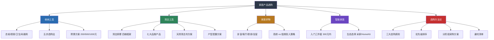

## 六、本节小结

产品推荐这一节从收纳工具、清洁工具、家居好物、智能家居到选购方法论，覆盖了家居生活中最常面对的消费决策场景。本节小结不是简单的重复，而是帮你把五节内容串联成一套可执行的决策框架——从"知道买什么"到"知道怎么买"再到"知道怎么用"。

### 6.1 五节内容核心要点回顾

#### 收纳工具：先断舍离，再选工具

收纳工具的核心逻辑是**先减少物品量，再匹配工具规格**。本节推荐了四大空间的收纳方案：

| 空间 | 核心工具 | 投入预算 | 优先级 |
|------|---------|---------|--------|
| 衣柜 | 统一衣架 + 抽屉收纳箱 + 分层隔板 | 100-400元 | 最高 |
| 厨房 | 冰箱收纳盒 + 磁力刀架 + 旋转调料架 | 50-300元 | 高 |
| 卫生间 | 免打孔置物架 + 镜柜分隔盒 + 台下抽拉架 | 90-260元 | 高 |
| 全屋通用 | 标签打印机 + 真空压缩袋 + 伸缩杆 | 40-180元 | 中 |

最关键的三个认知：
- **统一衣架**是性价比最高的收纳改善动作，100元换掉所有杂牌衣架，衣柜颜值和容量同时提升
- **标签化**是收纳系统长期维持的唯一方法，没有标签三个月后全家人都不知道盒子里装的是什么
- **伸缩杆**10块钱解决20种收纳问题，是收纳界的"万能胶"

#### 清洁工具：理解原理，按场景匹配

清洁工具推荐从物理化学原理出发，建立了"机械力 + 吸力 + 热力 + 化学反应"四维清洁框架。核心产品线：

| 品类 | 核心功能 | 推荐价位 | 定位 |
|------|---------|---------|------|
| 扫地机器人 | 日常自动维护 | 1800-6000元 | 高频自动化 |
| 无线吸尘器 | 全屋除尘 | 500-5500元 | 核心清洁力 |
| 洗地机 | 湿垃圾/油污深度清洁 | 1500-4000元 | 深度清洁补充 |
| 蒸汽拖把 | 高温杀菌消毒 | 200-800元 | 特定场景强化 |
| 天然清洁剂 | 小苏打+白醋+柠檬酸 | 20元以内 | 80%场景覆盖 |

最关键的三个认知：
- 扫地机器人是**日常维护工具**，不是深度清洁替代品，它能保持70-80%洁净度，剩余需要手动补充
- 小苏打 + 白醋 + 柠檬酸三种总成本不超过20元的天然清洁剂，可以解决家庭80%的清洁问题
- **84消毒液和洁厕灵绝对不能混用**，两者反应产生氯气，吸入可致呼吸道灼伤甚至死亡

#### 家居好物：高频用品值得投入

家居好物覆盖卧室、客厅、厨房、浴室四大场景，核心原则是**每天用的东西值得买好的**：

- **卧室**：乳胶枕（100-400元）和床品四件套（200-800元）是优先级最高的投资——每天使用8小时，直接影响睡眠质量
- **客厅**：落地灯（100-500元）营造氛围，香薰机（100-400元）改善空气质量
- **厨房**：铸铁锅（200-600元）一锅用十年，硅胶厨具（50-150元）保护不粘锅涂层
- **浴室**：智能马桶盖（1000-3000元）是"用过就回不去"的升级，恒温花洒（200-800元）消除忽冷忽热

#### 智能家居：从入门三件套开始

智能家居的入门门槛很低，**智能灯泡 + 智能插座 + 智能音箱**三件套总投入不超过300元，就能实现语音控制灯光、远程控制电器、定时自动化等基础功能。进阶方向是扫地机器人联动、智能门锁、智能窗帘电机。选购时优先选同一生态（米家 / HomeKit / 天猫精灵），避免设备间无法联动。

#### 选购建议：系统化决策方法

选购建议提供了完整的消费决策框架，核心要点：

- **三大原则**：先整理后购买、高频用品值得投入、警惕"场景想象"式消费
- **优先级排序**：床品 > 基础收纳 > 清洁工具 > 照明 > 厨房工具 > 智能家居 > 装饰美化
- **购买策略**：小步快跑、分阶段采购，每阶段完成后感受改善效果再决定下一步
- **避坑要点**：算单次使用成本、看差评比好评、警惕"网红同款"和"套装"陷阱

### 6.2 全节知识体系纵览

把五节内容整合成一张完整的知识图谱，可以看出产品推荐这一节构建了"认知 → 选型 → 采购 → 使用 → 维护"的完整闭环：

### 6.3 核心决策矩阵：一张表搞定全屋产品选购

如果只能记住一张表，就是下面这张——它把五节内容压缩成一个可直接执行的决策工具：

| 优先级 | 品类 | 推荐产品 | 预算 | 购买时机 | 选购关键词 |
|--------|------|---------|------|---------|-----------|
| ★★★★★ | 床品四件套+枕头 | 长绒棉60支以上 + 乳胶枕 | 300-1200元 | 搬入前 | 支数、睡姿匹配 |
| ★★★★★ | 统一衣架 | 植绒/薄型衣架统一规格 | 100-200元 | 整理衣柜时 | 材质分场景、统一外观 |
| ★★★★★ | 扫地机器人 | 石头S8/科沃斯T30/小米X20 | 1800-6000元 | 618/双11 | 避障、基站功能、噪音 |
| ★★★★☆ | 无线吸尘器 | 追觅V16/小米G10/戴森V15 | 500-5500元 | 618/双11 | AW吸力、HEPA等级、续航 |
| ★★★★☆ | 标签打印机 | 井井标记M2/兄弟PT-D210 | 130-250元 | 随时 | 标签带成本、连接方式 |
| ★★★★☆ | 冰箱收纳盒 | 星优/百露长方形带沥水板 | 50-150元 | 随时 | 沥水板、长方形、标注日期 |
| ★★★★☆ | 洗地机 | 追觅H12 Pro/添可芙万3.0 | 2000-3500元 | 618/双11 | 热水洗地、自清洁、烘干 |
| ★★★★☆ | 免打孔置物架 | 304不锈钢镂空沥水款 | 30-80元 | 随时 | 材质防锈、沥水设计 |
| ★★★☆☆ | 天然清洁剂 | 小苏打+白醋+柠檬酸 | 20元 | 随时 | pH原理、不混用 |
| ★★★☆☆ | 智能家居入门 | 智能灯泡+插座+音箱 | 200-300元 | 随时 | 同一生态、语音联动 |
| ★★★☆☆ | 恒温花洒 | 恒温阀芯款 | 200-800元 | 装修/改造时 | 阀芯材质、水压适配 |
| ★★☆☆☆ | 智能马桶盖 | TOTO/松下/智米 | 1000-3000元 | 618/双11 | 座圈尺寸、即热式 |
| ★★☆☆☆ | 真空压缩袋 | 双层封口拉链+电动泵 | 20-50元 | 换季时 | 羽绒勿长期压缩 |

### 6.4 不同预算的全屋配置方案

将五节推荐的产品按预算整合，给出三套全屋配置方案：

#### 经济方案（2000元以内）

适合租房、小户型、首次布置：

| 品类 | 产品 | 预算 |
|------|------|------|
| 睡眠 | 基础床品四件套 + 记忆棉枕 | 300-500元 |
| 收纳 | 统一衣架30个 + 冰箱收纳盒3个 + 伸缩杆2根 + 标签贴纸 | 105元 |
| 清洁 | 平板拖把 + 小苏打/白醋/柠檬酸 + 一瓶厨房去油剂 | 80元 |
| 厨房 | 沥水篮 + 硅胶厨具 + 厨房计时器 | 100元 |
| 浴室 | 免打孔置物架 + 速干浴巾 | 80-150元 |
| 智能 | 智能灯泡2个 + 智能插座2个 | 120元 |
| **合计** | | **约800-1050元** |

#### 品质方案（5000元以内）

适合自住房、三口之家：

| 品类 | 产品 | 预算 |
|------|------|------|
| 睡眠 | 长绒棉60支四件套 + 乳胶枕 | 500-1000元 |
| 收纳 | 经济方案全部 + 天马收纳箱4个 + 磁力刀架 + 浴室台下架 + 标签打印机 | 680元 |
| 清洁 | 扫地机器人（小米X20/追觅S20） + 洗地机基础款 + 除螨仪 | 4000-5500元 |
| 厨房 | 铸铁锅 + 旋转调料架 | 250-700元 |
| 浴室 | 恒温花洒 + 智能马桶盖 | 1200-3800元 |
| 智能 | 入门三件套 + 智能门锁 | 700-2300元 |
| **合计** | | **约7300-14000元** |

> 品质方案跨度较大，可以根据实际需求分2-3个阶段采购，不必一次性到位。

#### 进阶方案（15000元以内）

适合大户型、追求品质生活：

| 品类 | 产品 | 预算 |
|------|------|------|
| 睡眠 | 高品质床品 + 定制乳胶枕 | 1000-2000元 |
| 收纳 | 全屋收纳系统化 + 高端标签方案 | 800-1500元 |
| 清洁 | 扫地机器人旗舰（石头S8 MaxV） + 洗地机旗舰（追觅H20 Pro） + 戴森吸尘器 + 蒸汽拖把 | 10000-15000元 |
| 厨房 | 品牌铸铁锅 + 全套硅胶厨具 + 厨房收纳系统 | 800-1500元 |
| 浴室 | 恒温花洒 + 高端智能马桶盖 + 浴室收纳全套 | 3000-5000元 |
| 智能 | 全屋智能（灯光场景 + 窗帘电机 + 安防 + 音箱） | 2000-5000元 |
| **合计** | | **约17000-30000元** |

> 进阶方案适合分6-12个月逐步完成，每个子系统独立验收，避免一次性投入过大。

### 6.5 从产品到习惯：工具的正确使用心态

推荐了这么多产品，最后必须强调一个核心观点：**产品只是工具，真正重要的是使用这些工具的人。**

这一点怎么强调都不过分。现实中常见的失败模式是：

| 失败模式 | 表现 | 根本原因 | 纠正方法 |
|---------|------|---------|---------|
| 工具依赖症 | 买了扫地机器人就以为不用打扫了 | 把工具等同于结果 | 工具是效率倍增器，不是替代者 |
| 装备升级陷阱 | 不停换新款，觉得旧的不够好 | 用消费替代行动 | 先用好手上的，明确痛点再升级 |
| 收纳工具堆积 | 买了大量收纳盒却维持不了整洁 | 工具本身也需要管理 | 每季度清理一次，不用的果断淘汰 |
| 智能家居过度 | 全屋智能但日常只用开关 | 解决了不存在的问题 | 从真正高频的痛点开始智能化 |
| 跟风消费 | 看博主推荐就下单 | 缺乏自我需求评估 | 下单前问三个问题：需要吗？有地方放吗？会常用吗？ |

**最好的收纳工具是你养成的整理习惯。** 一个每天花5分钟物归原位的人，比一个买了全套高端收纳工具但从不整理的人，家居整洁度高出一个量级。

**最好的清洁工具是你建立的清洁节奏。** 扫地机器人每天自动运行 + 每周一次手动深度清洁 + 每月一次大扫除，这个节奏比任何单一高端工具都有效。

**最好的家居好物是你对生活的用心。** 一束窗台上的阳光、一盆用心照料的绿植、一张随手整理的沙发——这些不花钱的动作，往往比任何产品都更能提升居住幸福感。

### 6.6 本节与全章的关联

产品推荐是家居生活章节中"器"的层面——具体的工具和产品。但它不是孤立的：

- **基础理论**提供了"道"和"法"——环境心理学告诉你为什么整洁的空间让人舒适，收纳整理理论教你分类和布局的方法论，极简主义哲学帮你建立"少即是多"的价值观
- **具体方案**提供了"术"——收纳整理方案、家居清洁方案、家居布置方案等可直接执行的操作流程
- **产品推荐**提供了"器"——用什么工具来执行这些方案

道法术器四层贯通，才能真正把家居生活从"知道"变成"做到"。如果只买工具不学方法，工具会吃灰；如果只学方法不买工具，执行会受阻；如果只看理论不动手，知识永远停留在纸面上。

> 下一步行动建议：回顾前五节的推荐，结合自己的户型、预算和生活习惯，用第五节的分阶段采购方案制定一个属于自己的采购计划。记住——不必一次买齐，小步快跑，每一步都验证效果后再走下一步。

***
