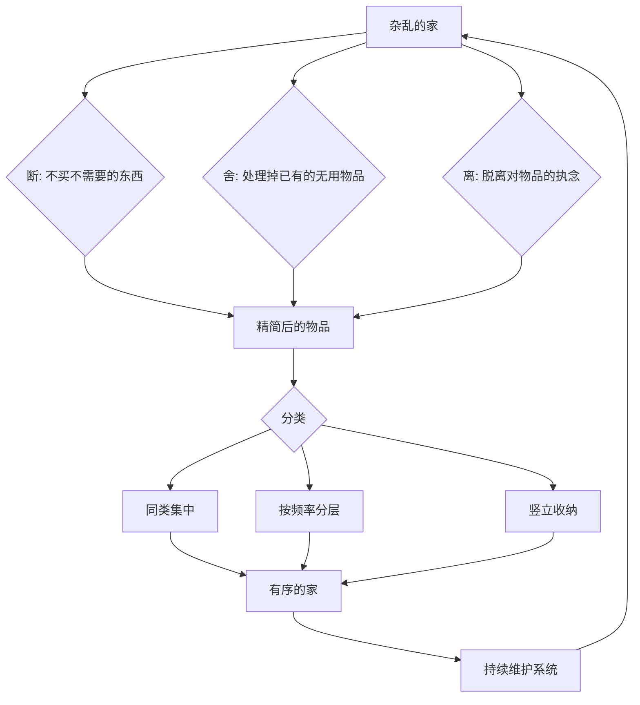
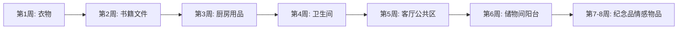
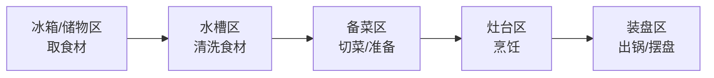
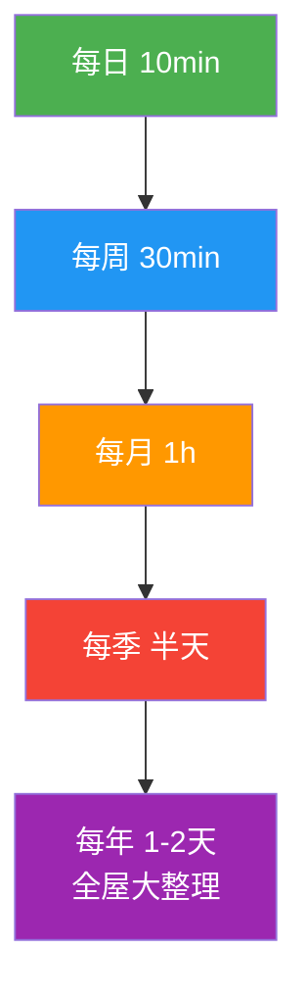

## 一、收纳整理方案

收纳整理不是简单的"把东西放整齐"，而是一套涉及认知心理学、行为经济学、空间设计学的系统工程。一个杂乱的居住环境每天消耗你的认知资源——普林斯顿大学神经科学研究所（2011）的实验表明，视觉上的杂乱会显著降低注意力和工作记忆能力。反之，有序的环境能降低皮质醇水平，提升决策质量和睡眠质量。

本节从**道**（理解杂乱的本质）、**法**（断舍离与收纳体系）、**术**（各房间具体方案）、**器**（工具与产品推荐）四个层次，构建一套从入门到精通的完整收纳体系。

### 1.1 道——理解杂乱的根源

#### 1.1.1 为什么我们会囤积物品

囤积行为有深层的心理和进化根源，理解这些才能从根本上改变习惯：

**进化本能**：在物资匮乏的远古环境中，囤积食物和工具是生存优势。这种"以备不时之需"的本能被编码在我们的基因中，即使在物资过剩的现代社会仍然自动运行。当你拿起一件旧T恤心想"说不定以后能穿"时，激活的就是这套古老的神经回路。

**沉没成本谬误**：行为经济学中的经典偏差。"这个包花了2000块，扔了太可惜"——但实际上，这件物品的沉没成本已经无法收回，继续存放反而占据你宝贵的居住空间和注意力资源。按照一线城市每平米3-5万元的房价计算，一个占用0.5平米的闲置物品柜，实际隐性成本高达1.5-2.5万元。

**情感投射**：物品承载记忆和情感——前男友送的礼物、毕业时的合影、孩子第一双鞋。丢弃这些物品让人感到在"丢弃记忆"。但真正的记忆储存在大脑中，而非物品上。

**身份认同**：囤积的书籍代表"我是爱读书的人"，囤积的运动装备代表"我是爱运动的人"。当物品数量超过实际使用能力时，这种身份认同就变成了一种自我欺骗。

**决策疲劳**：每件物品的"留还是扔"都是一次决策。当物品太多时，决策疲劳让人选择逃避——"以后再说吧"——于是杂物持续积累。

#### 1.1.2 杂乱的真实成本

大多数人低估了杂乱的代价。以下是可量化的成本清单：

| 成本类型 | 具体表现 | 估算代价 |
|---------|---------|---------|
| 时间成本 | 每天找东西平均浪费15-30分钟 | 每年91-182小时 |
| 金钱成本 | 找不到东西重复购买 | 每年数千元 |
| 空间成本 | 一线城市每平米3-5万元 | 物品占用空间的实际房价 |
| 心理成本 | 持续的焦虑感和失控感 | 皮质醇升高、睡眠质量下降 |
| 社交成本 | 不敢邀请朋友来家做客 | 社交机会的隐性损失 |
| 决策成本 | 面对大量物品的决策疲劳 | 影响其他领域的判断力 |

#### 1.1.3 收纳整理的底层逻辑

收纳整理的本质是**对生活做减法，对体验做加法**。核心公式：

生活品质 = 保留物品的总价值 / 物品总数量

当分母（物品数量）过大时，即使分子（物品价值）很高，生活品质也会下降。收纳的目标不是"把东西藏起来"，而是**只保留真正有价值的东西，并让它们各得其所**。

### 1.2 法——断舍离与收纳体系

#### 1.2.1 断舍离方法详解

**断舍离**来自日本山下英子的理念，核心不是"扔东西"，而是**通过物品审视自己与世界的关系**。

##### 断舍离的三重判断标准

对于每一件物品，依次问自己三个问题：

**第一问：这件物品我现在在用吗？**
关键词是"现在"，不是"以后可能会用"。超过一年没有被使用的物品，大概率不会再被使用。加州大学的一项追踪研究发现，被标记为"以后可能用到"的物品中，只有不到20%在一年内被真正使用。

**第二问：这件物品让我感到愉悦吗？**
区分"愉悦"和"不舍得扔"。真正的愉悦是物品本身带来的美好感受——一件称手的工具、一本反复翻阅的书、一幅让你微笑的画。而"扔了可惜"和"花了好多钱"不是愉悦，是沉没成本在作祟。

**第三问：如果现在没有这件物品，我会花钱买它吗？**
这是最有效的去执念方法。如果你不会花钱重新购买，说明它对你没有真正的价值。即使它当初花了很多钱，现在的持有成本（空间、注意力）也在持续产生负收益。

**判断矩阵**：

| 现在在用 | 让我愉悦 | 会花钱买 | 决策 |
|---------|---------|---------|------|
| ✓ | ✓ | ✓ | **保留**——这是你生活的核心物品 |
| ✓ | ✓ | ✗ | **保留**——功能性+情感价值兼具 |
| ✓ | ✗ | ✓ | **保留**——纯粹的功能性需求 |
| ✓ | ✗ | ✗ | **考虑替代**——功能在用但不称心，找更好的替代品 |
| ✗ | ✓ | ✓ | **保留**——高价值物品，可能处于使用间歇期 |
| ✗ | ✓ | ✗ | **设定观察期**——放入标记日期的箱子，3-6个月后复检 |
| ✗ | ✗ | ✓ | **深度审视**——真的需要但不在用？找原因 |
| ✗ | ✗ | ✗ | **果断处理**——没有保留理由 |

##### 物品的四种处理方式

**丢弃**：损坏的、过期的、无法使用的物品。包括但不限于：过期食品和药品、破损的衣物和鞋子、干涸的笔和颜料、过期的化妆品和护肤品、生锈的工具。不要有心理负担，这些物品已经完成了它们的使命。对于电子产品，务必按照电子废弃物规范处理（送到指定回收点），不要混入普通垃圾。

**捐赠**：完好但不再需要的物品。捐赠渠道包括：
- **旧衣回收箱**：小区内通常有，衣物会被分类处理（好的出口、旧的做再生纤维）
- **慈善机构**：如中华慈善总会、壹基金等，可官网查询接收清单
- **社区捐赠站**：街道办或居委会通常有接收点
- **闲鱼免费送**：选择"免费送"功能，同城自取，省去物流
- **飞蚂蚁等回收平台**：预约上门回收，操作最方便

**出售**：有价值的二手物品。根据品类选择最佳平台：
- **闲鱼**：综合类最大的二手平台，适合衣物、家具、数码等一切物品。定价建议：新品价的3-5折起步，根据成色和市场供需调整
- **转转**：手机和数码产品有官方质检，可信度更高
- **多抓鱼**：二手书籍，扫码估价，顺丰上门取件
- **爱回收**：电子产品回收，价格透明但偏低
- **得物（二手区）**：潮牌和运动鞋，有鉴定服务
- **线下二手店**：Vintage店、二手书店，适合高价值小件

**转赠**：送给朋友或家人。但注意三条原则：(1) 对方真正需要或喜欢，而不是你"觉得"对方需要；(2) 不要附加"我不要了才给你"的潜台词；(3) 如果对方婉拒，不要强塞——把不需要的东西强加给别人，只是转移了你的心理负担。

##### "一年法则"的分层应用

| 物品类别 | 观察周期 | 说明 |
|---------|---------|------|
| 日常衣物 | 1年 | 一整年没穿，大概率不会再穿 |
| 季节性衣物 | 2个完整使用周期 | 如冬衣以2个冬天为准 |
| 工具类 | 2年 | 修理工具、急救包等低频但关键 |
| 电子产品 | 1年 | 技术更新快，贬值严重 |
| 书籍 | 1年 | 读完且不会再翻的，可以处理 |
| 情感物品 | 限定空间而非时间 | 给一个固定箱子，装满就必须取舍 |
| "万一"物品 | 6个月观察期 | 放入标记日期的箱子，到期未用即处理 |

##### 处理"不确定"物品的五种方法

**"箱子封印"法**：将所有不确定物品放入不透明箱子，用胶带封口，标记日期和内容清单。设定3-6个月的观察期。如果观察期内没有拆封取任何东西，直接整箱处理掉（捐赠或出售）。这个方法的关键是**用胶带封口**——只要有一步"拆封"的动作摩擦，就能过滤掉90%的伪需求。

**"如果丢了会怎样"法**：想象这件物品突然消失了，你的生活会受到多大影响？如果答案是"可能有点不方便，但可以接受"，就可以处理掉。如果答案是"必须立刻去买一个新的"，那说明它真的重要。

**"朋友陪审团"法**：邀请一位品味好、生活态度务实的朋友，让他/她逐一审视你的不确定物品。旁观者不受情感干扰，判断往往更准确。注意选择那种会说真话的朋友，而不是"都留着吧"的老好人。

**"替代品测试"法**：问自己——"如果需要，我能用已有的其他物品替代吗？"或"花50块钱能买到吗？"如果替代方案存在且成本很低，就不值得为"万一"而保留。

**"数字化替代"法**：对于纸质文件、照片、书籍等可以数字化的物品，先扫描/拍照存档，然后处理实物。云存储空间远比物理空间便宜。

#### 1.2.2 六大收纳流派对比

不同收纳方法适合不同人群，了解主流流派的优劣，选择最适合自己的：

| 流派 | 核心理念 | 优点 | 缺点 | 适合人群 |
|------|---------|------|------|---------|
| **KonMari（近藤麻理惠）** | "怦然心动"判断法 | 感性+理性结合，改变思维模式 | 工作量大，需一次性完成 | 追求生活美学的人 |
| **断舍离（山下英子）** | 断绝不需要的，舍弃多余的 | 从根本上改变消费观 | 偏重"减"，收纳技术较少 | 囤积倾向严重的人 |
| **Swedish Death Cleaning（瑞典式整理）** | 为不给他人添麻烦而整理 | 视角独特，适合中老年 | 偏重理念，方法论少 | 40岁以上、有遗产顾虑的人 |
| **四象限法（使用频率）** | 按频率分层存放 | 简单直观，可执行性强 | 不考虑情感因素 | 理性务实的人 |
| **PARA法（Tiago Forte）** | Projects/Areas/Resources/Archive | 数字+物理统一管理 | 偏重文件管理 | 数字原住民、知识工作者 |
| **FlyLady系统** | 15分钟微任务+区域轮转 | 压力小，可持续 | 进度慢，需要长期坚持 | 不想一次性大整理的人 |

**推荐组合策略**：用KonMari的"怦然心动"做筛选决策，用四象限法做空间规划，用FlyLady的微任务做日常维护。

### 1.3 术——整理实操全流程

#### 1.3.1 整理前的准备

##### 心态准备

**接受渐进式整理**：不要期望一个周末搞定全屋。按照"一次一个区域，一个区域2-3小时"的节奏，全屋整理通常需要2-4个周末。关键是每次整理都要做到位——彻底筛选、科学收纳、贴好标签——而不是匆忙地把东西换个地方。

**设定决策时间限制**：每件物品的"留/扔"决策不超过30秒。超过30秒说明你在找理由说服自己留下，这类物品直接放入"不确定"箱子。

**邀请家人参与**：如果与家人同住，整理方案必须获得全家认同。可以先从自己的个人物品开始，用效果说服家人。整理公共区域时，每人负责自己的物品，公共物品共同决定。

##### 工具准备清单

**基础工具**（必备）：
- 大号垃圾袋 × 10——用于丢弃
- 中号收纳箱 × 5——临时存放待处理物品，建议用半透明的
- 标签贴纸 + 记号笔——标记每个箱子的内容和日期
- 清洁用品——抹布、多功能清洁剂、吸尘器，整理完一个区域就清洁一次
- 计时器——手机即可，每30分钟休息5分钟

**进阶工具**（提升效率）：
- 标签打印机——统一标签风格，推荐精臣、兄弟等品牌，100-200元
- 卷尺——精确测量柜体内部尺寸，购买收纳用品前必量
- 手机/相机——整理前后对比拍摄，也是激励
- 笔记本或备忘录——记录整理发现（"原来我有3把开瓶器"）
- 电子秤——处理衣物前称重，方便在二手平台估价

##### 全屋分区策略

按照**从易到难**的顺序整理，先积累经验和信心：

**为什么这个顺序？** 衣物最容易判断（穿/不穿），能快速出成果建立信心；纪念品和情感物品最难判断（涉及情感），放在最后是因为经过前面几轮训练，你的"取舍肌肉"已经足够强壮。

#### 1.3.2 各房间整理指南

##### 玄关整理——家的第一印象

玄关是进出家门的过渡空间，功能需求：换鞋、放包、挂钥匙、临时搁置快递。

**整理步骤**：
1. 把玄关所有物品搬到空地上，逐一筛选
2. 鞋子：只留当季常穿的3-5双，其余收入鞋柜深处或储物间
3. 设置**固定放置位**：钥匙挂钩（一进门伸手就够到）、包挂钩、快递临时区
4. 清洁鞋柜、地面，更换破损的鞋垫

**玄关收纳系统配置**：

| 收纳用品 | 功能 | 选购要点 |
|---------|------|---------|
| 翻斗鞋柜 | 收纳当季鞋子 | 深度≥17cm（平底鞋），30cm（运动鞋）；翻斗比开门省空间 |
| 入墙挂钩 | 挂包、钥匙、外套 | 承重≥5kg，高度120-150cm |
| 钥匙托盘/磁吸架 | 钥匙、钱包、零钱 | 放在入口处最顺手的位置 |
| 伞架 | 雨伞收纳 | 选择可拆洗的，底部有接水盘 |
| 全身镜 | 出门前检查仪容 | 不占地方可选贴墙镜 |
| 小型置物台 | 快递、信件临时存放 | 不要超过3天，定期清空 |

**玄关黄金法则**：玄关不是储物间。如果玄关堆满了东西，说明其他空间的收纳不够，要回到根本问题去解决。

##### 客厅整理——家庭生活中心

客厅承担社交、娱乐、休息多重功能，最容易变成"公共杂物堆放区"。

**整理步骤**：
1. 清空茶几、电视柜表面，只保留**每天使用**的物品
2. 遥控器、充电线用专用收纳盒归集，告别"沙发缝里找遥控器"
3. 杂志和书籍：超过1个月没翻的移到书架，超过3个月没碰的处理掉
4. 电线整理：电视、路由器、游戏机的线材用线槽或蛇形管统一管理
5. 沙发：只留2-4个靠垫，多余的收纳起来轮换

**客厅收纳系统配置**：

| 区域 | 收纳方案 | 要点 |
|------|---------|------|
| 茶几 | 带抽屉/下层置物架 | 抽屉放遥控器、纸巾，下层放常读书籍 |
| 电视柜 | 带门封闭式 | 门板遮挡杂乱的线材和设备，比开放式整洁 |
| 沙发旁 | 边几+收纳篮 | 放水杯、手机充电位、纸巾 |
| 墙面 | 搁板/置物架 | 展示少量装饰品+书籍，不要放满 |
| 角落 | 落地收纳柜 | 收纳玩具、游戏手柄、杂物 |

**客厅的"15分钟复位法"**：每天睡前花15分钟，把客厅恢复到"待客状态"——沙发靠垫拍松摆好、茶几清空归位、遥控器归位、地面无杂物。这个习惯能让你每天醒来都看到整洁的客厅。

##### 卧室整理——睡眠质量的守护者

卧室的核心功能是睡眠和休息，任何干扰睡眠的因素都应该被消除。

**整理步骤**：
1. **床头柜清零**：只保留手机（充电位）、水杯、台灯、当前在读的一本书。闹钟用手机代替，减少桌面物品
2. **衣柜大整理**：这是卧室整理的核心，详见下方"衣柜收纳系统"
3. **床下空间**：使用扁平收纳箱存放换季衣物、被子，不要随手塞入无序堆放
4. **床品管理**：每人备2-3套床单被套轮换，1-2周更换一次，换下的及时清洗

**衣柜收纳系统（深度版）**：

衣柜是收纳的最大难点之一。一个设计合理的衣柜应该做到**打开柜门就能找到任何一件衣服，不超过10秒**。

**分区设计**：

| 区域 | 收纳内容 | 收纳方式 |
|------|---------|---------|
| 悬挂区（上部） | 大衣、西装、连衣裙、易皱衣物 | 按类别→颜色排列 |
| 悬挂区（下部） | 衬衫、短外套 | 同上 |
| 折叠区（中层） | T恤、卫衣、毛衣 | KonMari折叠法竖立放置 |
| 抽屉区 | 内衣、袜子、配饰 | 分隔盒分类 |
| 顶层 | 换季衣物、行李箱、被子 | 真空压缩袋+收纳箱 |
| 底层 | 当季常穿鞋子 | 鞋盒或鞋架 |

**KonMari折叠法核心技巧**：
- 目标是让每件衣物**竖立**，像书本一样排列在抽屉里
- T恤：左右各向内折一次，再从下往上折三折，形成一个小方块
- 裤子：对折后从裤脚向上卷至腰部，形成一个竖立的卷
- 内衣：叠成小方块，竖放在分隔盒中
- 袜子：不要把两只袜子卷成球（会破坏弹力），而是对折后平放

**衣物颜色排列法**（从左到右）：深色→浅色→彩色。视觉上整齐，找衣服也更快。

##### 厨房整理——效率与安全

厨房是物品密度最高的空间，也是最容易产生过期食品和重复购买的空间。

**整理步骤**：
1. **食品大清查**：逐一检查冰箱、橱柜中的食品和调料，丢弃所有过期品。这是最有"收获感"的一步——大多数人会发现大量被遗忘的过期食材
2. **厨具筛选**：同类厨具只保留最好用的那一个。你不需要3把菜刀、4个开瓶器、5个量杯
3. **台面精简**：台面上只保留**每天使用**的电器（电热水壶、电饭煲），其余收入橱柜
4. **调料统一**：散装调料倒入统一的密封罐，贴上品名和购买日期
5. **冰箱整理**：使用透明收纳盒分区——冷藏区按类别（蔬菜/水果/饮品/剩菜），冷冻区按日期

**厨房收纳动线设计**：

厨房效率的关键是**动线合理**——烹饪流程中需要用到的物品，应该在手臂可及范围内。

每个环节需要的工具应存放在对应区域附近：
- **冰箱附近**：保鲜袋、保鲜膜、食品密封夹
- **水槽附近**：洗洁精、海绵、沥水篮、垃圾袋
- **备菜区附近**：刀具、砧板、量杯、碗碟（待用）
- **灶台附近**：锅铲、调料罐、油壶、锅垫
- **装盘附近**：碗碟（常用）、筷子、勺子

**厨房收纳用品推荐**：

| 用品 | 用途 | 选购要点 |
|------|------|---------|
| 可旋转调料架 | 台面调料收纳 | 360°旋转，取用方便 |
| 锅盖架 | 立式存放锅盖 | 释放橱柜空间 |
| 磁力刀架 | 墙面刀具收纳 | 比刀架更卫生，节省台面 |
| 下水槽置物架 | 水槽下方空间利用 | 可伸缩，避开管道 |
| 抽屉分隔盒 | 餐具、工具分类 | 可调节宽度 |
| 透明密封罐 | 干货、调料、杂粮 | 统一规格，叠放设计 |
| 冰箱收纳盒 | 冰箱分区 | 带沥水功能的更佳 |
| 挂杆+挂钩组合 | 墙面利用 | 挂锅铲、抹布、量勺 |

##### 卫生间整理——小空间大利用

卫生间通常面积小、湿度大、物品种类杂。整理的核心是**利用垂直空间+防潮**。

**整理步骤**：
1. 清理过期的洗护用品、化妆品、药品（化妆品开封后有保质期：粉类2年、液体1年、睫毛膏3-6个月）
2. 毛巾：每人2-3条浴巾+2-3条面巾轮换，多余的处理掉
3. 清洁用品：只保留1-2瓶在卫生间，备用的放在储物区
4. 清洁排水口，检查是否有异味或堵塞

**卫生间收纳方案**：

| 位置 | 收纳内容 | 方案 |
|------|---------|------|
| 镜柜内 | 化妆品、护肤品、药品、牙刷 | 小型分隔盒，按使用频率分层 |
| 淋浴区 | 洗发水、沐浴露、沐浴球 | 壁挂式置物架（转角架更省空间） |
| 洗手台下方 | 清洁用品、备用毛巾、卫生纸 | 抽拉式收纳篮，方便取放 |
| 马桶上方 | 备用卫生纸、香薰、装饰 | 置物架或嵌入式壁龛 |
| 门后 | 浴袍、换洗衣物 | 挂钩（门后不占视觉空间） |
| 墙面 | 吹风机、牙刷、剃须刀 | 磁吸/壁挂式专用架 |

**卫生间防潮要点**：
- 收纳用品选择不锈钢、塑料、亚克力材质，避免竹木（易发霉）
- 化妆品和护肤品不要放在淋浴区内，高温高湿会加速变质
- 毛巾架尽量安装在通风处，避免紧贴墙壁
- 使用除湿盒或小型除湿机控制湿度在50-60%

##### 书房/工作区整理——效率的空间

工作区的整理直接影响工作效率和创造力。

**整理步骤**：
1. **桌面清零**：只保留显示器/笔记本电脑、键盘鼠标、当前项目的文件、水杯。其他一切移到抽屉或架子上
2. **文件大清理**：(1)需要原件的重要证件→文件柜 (2)已过期的文件→碎纸机 (3)可能需要的文件→扫描后处理原件 (4)空白纸张→打印机旁备用
3. **电线管理**：显示器、充电器、台灯的线材用线槽固定在桌后，用理线带捆绑
4. **书架整理**：按类别排列（工作相关/小说/工具书/杂志），每季度清理一次

**桌面收纳方案**：
- **显示器增高架**：下方空间放键盘（不用时推进去）、文具收纳盒
- **桌面收纳盒**：放笔、便签、U盘、转接头等小件
- **文件架**：立式文件架放当前项目的资料，竖立摆放一目了然
- **集线器+线槽**：所有线缆归拢到桌面后方的线槽中
- **抽屉分隔**：文具、数据线、充电头各归其位

##### 储物间/阳台——"重灾区"的救赎

这两个区域通常是最后的"收纳黑洞"——所有不知道放哪里的东西最终都堆积在这里。

**整理原则**：
1. **清空重来**：把所有东西搬到空地上，分类后再放回
2. **按类别归箱**：工具类一箱、运动器材一箱、季节性物品一箱……每箱贴标签
3. **叠放有序**：重的在下、轻的在上，常用的在前、不常用的在后
4. **定期复检**：每6个月检查一次，处理掉半年内没有用过的物品

**阳台整理**：如果阳台兼具储物功能，用封闭式储物柜而非开放式架子。柜门一关，视觉整洁。洗衣区用脏衣篮+晾衣架形成独立动线，与储物区用帘子或隔断分开。

#### 1.3.3 收纳的五大原则

##### 原则一：分类集中

**同类物品集中存放于一处，不要分散在多个区域。** 所有充电线在一个盒子、所有工具在一个箱子、所有药品在一个药箱。这样做的好处是：(1)知道东西在哪里；(2)避免重复购买；(3)方便盘点库存。

例外：使用频率极高的物品可以"主存+辅存"——比如清洁用品主力放在储物间，卫生间和厨房各放一份常用的。

##### 原则二：竖立收纳

**能够竖立的物品尽量竖立放置，而非平躺堆叠。** 堆叠的物品只能看到最上面的一件，取下面的需要搬开上面的。竖立收纳则一眼可见、伸手可取。

适用于：衣物（KonMari折叠法）、文件、书籍、锅盖、砧板、托盘、烤盘。

##### 原则三：使用频率决定位置

**高频物品放在最容易取用的位置，低频物品放在需要弯腰或踩凳子的位置。**

| 层级 | 位置 | 存放内容 |
|------|------|---------|
| 黄金区域 | 与腰平齐，伸手即取 | 每天使用的物品 |
| 白银区域 | 胸部以上或膝盖以下 | 每周使用的物品 |
| 青铜区域 | 最高层或最底层 | 每月或更少使用的物品 |

##### 原则四：标签化管理

**所有不透明的收纳容器都必须贴标签。** 标签内容包括：物品类别、放入日期（方便判断是否需要复检）。这样做的好处：(1)家人也能轻松找到和归还物品；(2)减少"翻箱倒柜"的概率；(3)视觉上整齐统一。

标签方式推荐：标签打印机（最整齐）、记号笔+胶带（最方便）、可擦写标签（适合内容会变的箱子）。

##### 原则五：留出20-30%的余量

**收纳空间不要填满，留出弹性空间。** 填满的收纳空间意味着：(1)新买的物品无处可放，只能堆在外面；(2)取用物品困难（塞得太紧抽不出来）；(3)产生"已经满了"的心理压力。留出余量是保持长期整洁的关键——当你发现某处开始"塞不下"了，就是清理的信号。

### 1.4 器——工具与产品推荐

#### 1.4.1 收纳用品选购指南

选购收纳用品前的三条铁律：

1. **先量尺寸再买**：用卷尺精确测量柜体内部尺寸（宽×深×高），误差控制在±1cm。买回来放不进去是最常见的浪费
2. **先确定内容再选容器**：不是"买好看的收纳盒再想放什么"，而是"确定要收纳什么再选合适的容器"
3. **统一风格和颜色**：同一区域的收纳用品保持颜色和材质统一，视觉整洁度会大幅提升

**通用收纳用品推荐**：

| 品类 | 推荐产品/品牌 | 价格区间 | 适用场景 |
|------|-------------|---------|---------|
| 衣柜收纳盒 | 天马、百露 | 15-50元 | 衣物分类、换季存储 |
| 抽屉分隔盒 | 网格分隔、EVA分隔片 | 5-20元 | 内衣、袜子、文具、数据线 |
| 真空压缩袋 | 太力、收纳博士 | 10-30元 | 换季衣物、被子（节省70%空间） |
| 透明密封罐 | 乐扣乐扣、宜家 | 10-40元 | 厨房干货、调料、杂粮 |
| 壁挂式置物架 | 太空铝材质 | 20-80元 | 卫生间、厨房墙面利用 |
| 标签打印机 | 精臣、兄弟 | 80-300元 | 全屋标签统一 |
| 旋转收纳盘 | 懒角落、霜山 | 15-40元 | 调料瓶、化妆品、药品 |
| 文件收纳盒 | 得力、齐心 | 10-30元 | 证件、票据、说明书 |

#### 1.4.2 数字化收纳工具

物理空间的整理只是第一步，用数字工具管理物品信息，才能实现长期维护：

| 工具 | 功能 | 适合管理的内容 |
|------|------|--------------|
| **备忘录/笔记App** | 创建物品清单、存放位置记录 | 衣物清单、储物箱内容 |
| **手机拍照** | 记录收纳状态、购物前核查 | 衣柜内部、冰箱内部 |
| **扫描App（如扫描全能王）** | 文档数字化 | 证件、合同、说明书 |
| **衣物管理App（如小衣橱）** | 虚拟衣橱、搭配方案 | 全部衣物的照片和分类 |
| **家庭库存表（Excel/Notion）** | 耗材库存管理 | 食品、清洁用品、日用品的购买周期 |
| **二维码标签** | 扫码查看箱内物品清单 | 密封的储物箱（箱外贴码，扫码看详情） |

#### 1.4.3 不同户型的收纳策略

**小户型（60㎡以下）**：
- 核心策略：**向上发展**——利用墙面、门后、床下等垂直和隐藏空间
- 嵌入式家具是首选——床底带抽屉、沙发下带储物格、餐桌可折叠
- 一面墙的整面书柜/储物柜，从地面到天花板
- 门后挂钩、床头挂袋、冰箱侧面磁吸收纳
- 定期断舍离是生存必需——小户型没有"囤积"的空间余量

**中户型（60-120㎡）**：
- 核心策略：**功能分区**——每个空间有明确的收纳职责
- 玄关柜、餐边柜、电视柜形成"环形收纳带"
- 衣帽间或步入式衣柜（如有条件）
- 储物间/储物柜集中管理低频物品

**大户型（120㎡以上）**：
- 核心策略：**分散+集中结合**——就近收纳与集中仓储并行
- 每个房间有独立收纳系统，减少跨房间取物
- 独立储物间/杂物间用于存放低频物品
- 容易犯的错：空间大→不注意收纳→杂乱程度反而更严重

### 1.5 进阶——从整理到生活方式

#### 1.5.1 "一进一出"法则

保持整洁的最简单规则：**每买进一件新物品，就处理掉一件同类旧物品。** 买了一件新T恤，就淘汰一件旧T恤；买了一本新书，就处理一本读完的旧书。这个规则确保物品总量不会持续增长。

执行要点：
- 购物前先检查是否有同类物品——避免重复购买
- 新物品到手后，立刻选出一件旧物品处理——不要拖延
- 家庭成员共同遵守——一个人不遵守就会打破平衡

#### 1.5.2 日常维护系统

整理一次容易，维持整洁才是真正的挑战。以下是经过验证的维护习惯：

**每日习惯（共10分钟）**：
- **起床后**：床铺整理（2分钟）——拉平被子、枕头归位、床头柜归位
- **出门前**：玄关复位（1分钟）——钥匙挂钩、鞋子摆好
- **做饭后**：台面清洁（3分钟）——擦台面、归位调料、洗碗
- **睡前**：客厅复位（3分钟）——遥控器归位、茶几清空、靠垫摆好
- **睡前**：衣物归位（1分钟）——换下的衣服挂好或放入脏衣篮

**每周习惯（共30分钟）**：
- 周末花30分钟做一次"快速巡视"——检查各区域是否有物品错位
- 处理本周积累的快递包装、传单、不需要的小件
- 冰箱检查——清理即将过期的食材，规划本周菜单

**每月习惯（共1小时）**：
- 一个区域的深度整理（轮换进行）
- 检查消耗品库存——清洁用品、纸巾、洗护用品等
- 数字化整理——手机照片备份、云盘清理、邮箱归档

**每季习惯（半天）**：
- 换季衣物整理——清洗、收纳过季衣物，取出当季衣物
- 全屋断舍离复检——用"箱子封印法"处理"不确定"物品
- 收纳用品检查——破损的更换，不合适的调整

#### 1.5.3 常见误区与纠正

| 误区 | 为什么是错的 | 正确做法 |
|------|------------|---------|
| "整理=收纳" | 买再多收纳盒，不减少物品也只是"把乱藏起来" | 先筛选减量，再考虑收纳 |
| "一次整理完" | 全屋一次性整理太累，容易半途而废 | 分区域、分周末逐步推进 |
| "整理后就不会乱" | 不建立维护习惯，一周就会恢复原样 | 建立日常微习惯 |
| "所有东西都要留着" | "万一用到"的概率极低 | 用"一年法则"+观察期判断 |
| "买贵的收纳用品就行" | 收纳用品本身也占用空间 | 先量尺寸，先减物品，再选容器 |
| "扔了就是浪费" | 继续存放也在消耗空间和注意力 | 捐赠或出售，让物品到需要的人手中 |
| "收纳要追求完美" | 完美主义导致拖延和焦虑 | "足够好"就是最好，持续优化 |
| "别人的方案照搬" | 每家的生活习惯不同 | 理解原则后，根据自家情况定制 |

#### 1.5.4 家庭协作方案

收纳不是一个人的事。当全家人住在一起时，需要建立共识和协作机制：

**第一步：全家讨论会**（30分钟）
- 让每个家庭成员表达自己最不满的3个杂乱点
- 共同决定整理的优先级
- 明确每个人负责的区域和物品

**第二步：制定家庭收纳公约**
- **公共区域**：每人有责任在使用后恢复原状
- **个人区域**：各自管理，但不能影响公共空间
- **新物品引入**：大件物品需要讨论，小件物品遵守"一进一出"原则
- **孩子教育**：从3岁开始培养"玩具回家"的习惯——用图片标签帮助孩子识别物品存放位置

**第三步：定期复盘**
- 每月一次"家庭收纳日"——全家一起花1小时整理公共区域
- 讨论哪些方案好用、哪些需要调整
- 肯定进步，不要批评做得不够好的人

### 1.6 案例：小王的三居室收纳改造

**改造前**：
- 90㎡三居室，住了5年
- 玄关：鞋子从鞋柜溢出到地上，至少30双
- 客厅：茶几上堆满零食、遥控器、充电线、孩子的玩具
- 卧室：衣柜塞到关不上门，床下全是纸箱
- 厨房：台面摆满小家电，冰箱里有过期半年的食材

**改造过程**（共4个周末）：

**第一周末：衣物**——处理掉48件衣物（捐赠32件、丢弃16件），衣柜空间释放60%。采用KonMari折叠法重新整理，全部衣物竖立可见。

**第二周末：厨房+卫生间**——丢弃过期食品调料23件、过期洗护品8件。淘汰重复厨具6件。统一调料罐，冰箱用透明盒分区。

**第三周末：客厅+书房**——处理旧杂志书籍2箱，电线全部入线槽。客厅茶几只留遥控器盒和纸巾盒。

**第四周末：储物间+阳台**——这是最耗时的。处理掉积攒5年的"万一"物品3大箱。储物间按类别归箱、贴标签。

**改造后效果**：
- 全屋共处理物品**200+件**
- 物品查找时间从平均15分钟降到**1-2分钟**
- 每月重复购买减少，估算年节省**约3000元**
- "终于敢邀请朋友来家里了"——社交成本的隐性收益
- 家庭成员的维护习惯在1个月后基本形成

**维护阶段**：执行"每日10分钟+每周30分钟"的维护系统，3个月后回访，整洁度保持在90%以上。

---

收纳整理是一场与自己对话的过程。当你拿起一件物品问"这个要不要留"时，你其实在问自己"我想要什么样的生活"。断舍离的终极目标不是拥有一个空荡荡的家，而是**让身边的每一件物品都是你主动选择的，都为你的生活增添价值**。从今天开始，从一个抽屉、一个柜子开始，你会发现：整理物品的过程，也是整理人生的过程。
