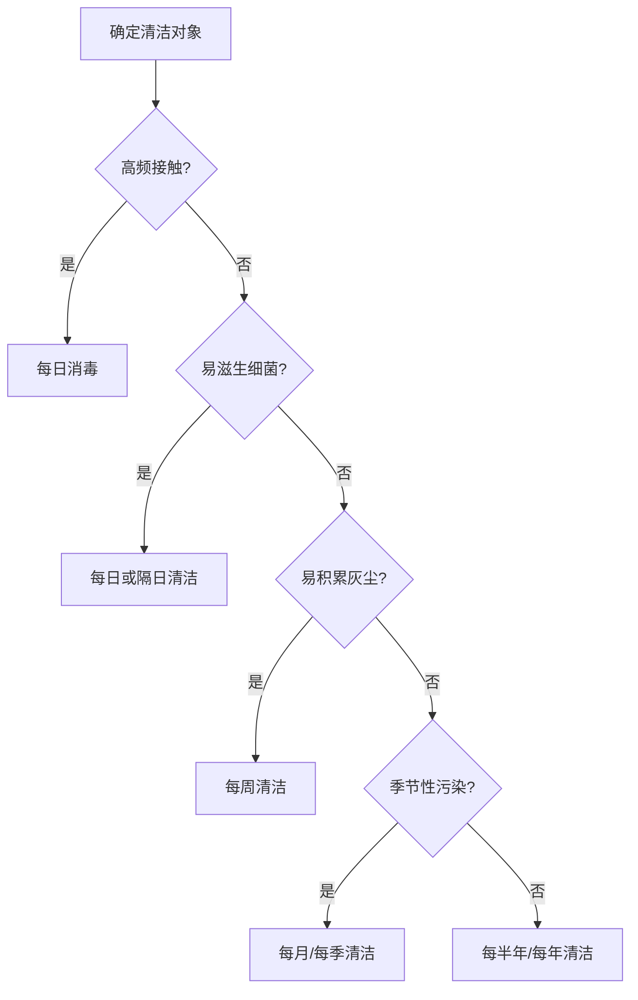
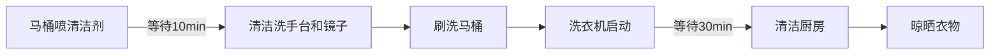
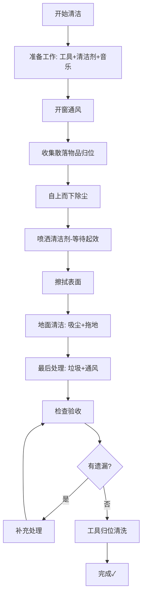
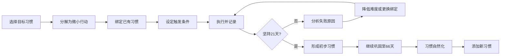

## 二、家居清洁方案

清洁不是简单的"打扫卫生"——它是维护居住环境健康、保护家人身体、提升生活品质的系统工程。一个清洁有序的家，能降低过敏原浓度60%以上（美国哮喘与过敏基金会数据），减少家庭成员呼吸道疾病发生率，并显著改善心理健康状态。本章从科学原理出发，建立完整的家居清洁知识体系，提供从日常维护到深度清洁的全套方案。

### 2.1 清洁的科学基础

#### 2.1.1 为什么清洁如此重要

清洁的价值不仅在于"看着干净"，更在于它对人体健康的直接影响：

**微生物层面**：家居环境中存在大量肉眼不可见的微生物。一张使用超过一周的床单上，细菌数量可达数亿级别；一个未清洁的厨房海绵，每平方厘米含菌量高达540亿。常见致病菌包括大肠杆菌、金黄色葡萄球菌、沙门氏菌等，它们在适宜温度和湿度下每20分钟分裂一次。

**过敏原层面**：尘螨是最常见的室内过敏原，一个使用两年以上的枕头，其重量的10%可能是尘螨及其排泄物。霉菌孢子、宠物皮屑、花粉等都会长期附着在家居表面，定期清洁是控制过敏原最直接的手段。

**化学污染物层面**：家具、装修材料持续释放甲醛、苯等挥发性有机化合物（VOCs），烹饪产生PM2.5和油烟颗粒。定期通风和表面清洁能有效降低室内污染物浓度。

**心理层面**：普林斯顿大学神经科学研究所发现，视觉上的杂乱会增加皮质醇（压力激素）水平，而整洁的环境有助于降低焦虑、提升专注力。清洁本身也是一种"可控的成就"，能带来即时的满足感。

#### 2.1.2 清洁的化学原理

理解清洁的化学原理，才能选对工具、用对方法：

**表面活性剂原理**：清洁剂的核心成分是表面活性剂，其分子一端亲水、一端亲油。亲油端包裹油污颗粒，亲水端溶于水，从而将油污从表面"拽"下来带入水中。这就是为什么单纯用水洗不掉油污——水和油互不相溶，需要表面活性剂作为"桥梁"。

**pH值与清洁场景的对应关系**：

| pH范围 | 酸碱性 | 典型产品 | 适用场景 | 不适用场景 |
|--------|--------|---------|---------|-----------|
| 1-3 | 强酸 | 盐酸洁厕剂 | 水垢、尿垢、铁锈 | 大理石、不锈钢、铝制品 |
| 4-6 | 弱酸 | 白醋、柠檬酸 | 水渍、轻度水垢、消毒 | 天然石材 |
| 7 | 中性 | 温和清洁剂 | 木地板、皮革、日常擦拭 | 重度油污 |
| 8-10 | 弱碱 | 小苏打、多功能清洁剂 | 轻度油污、异味中和 | 铝制品、丝绸 |
| 11-14 | 强碱 | 烤箱清洁剂、管道疏通剂 | 重度油污、有机物堵塞 | 皮肤、铝、漆面 |

**氧化还原反应**：漂白剂（次氯酸钠）通过强氧化作用破坏色素分子的化学键，实现漂白和杀菌。双氧水（过氧化氢）的杀菌原理类似，但副产物仅为水和氧气，更环保。需要注意：含氯漂白剂和含氨清洁剂**绝对不能混合**，会产生有毒的氯胺气体。

**酶解反应**：生物酶清洁剂利用蛋白酶、脂肪酶、淀粉酶等分解特定有机污渍。酶在40-60°C活性最高，超过70°C会失活。适合处理蛋白质类污渍（血渍、奶渍）和淀粉类污渍。

#### 2.1.3 清洁的微生物学基础

**细菌滋生条件**：温度20-40°C、湿度60%以上、有有机物营养来源。这三个条件在厨房和卫生间几乎全部满足，因此这两个区域是清洁的重中之重。

**病毒存活时间**：不同病毒在物体表面的存活时间差异很大。流感病毒在硬表面可存活24-48小时，诺如病毒可存活数天甚至两周。含75%酒精或含氯消毒剂能在30秒至数分钟内灭活大部分常见病毒。

**霉菌生长机制**：霉菌通过释放孢子繁殖，孢子无处不在，只要遇到潮湿表面（湿度>70%）就能萌发。卫生间角落、窗框、洗衣机橡胶圈是霉菌高发区。杀死霉菌需要用专用除霉剂，普通清洁剂只能清除表面霉斑，无法杀灭根部菌丝。

### 2.2 建立科学的清洁节奏

#### 2.2.1 清洁频率的科学依据

清洁频率应根据三个因素确定：使用频率、污染速度、健康影响。高频接触面（门把手、开关、手机屏幕）每天需要消毒；低频使用区域（储物间、客卧）可以降低频率。

#### 2.2.2 每日清洁任务（15-20分钟）

每日清洁的核心逻辑是"阻止污垢积累"——在污垢刚产生时清除，远比积累后深度清洁省力。这遵循"1:5:100法则"：及时清理花费1分钟的工作量，延迟一天变成5分钟，延迟一周变成100分钟。

**晨间清洁（5分钟）**：

| 任务 | 时间 | 要点 |
|------|------|------|
| 整理床铺 | 1分钟 | 不必叠成豆腐块，拉平被子、摆正枕头即可。掀开被子通风10分钟再整理效果更佳——让汗气蒸发，抑制螨虫 |
| 擦拭厨房台面 | 1分钟 | 做完早餐后立即擦拭。使用微纤维湿布，不要用洗洁精——清水微纤维布的去污能力被严重低估 |
| 快速检查卫生间 | 1分钟 | 用马桶刷快速刷一下马桶内壁（每天刷比一周刷一次轻松得多），擦拭洗手台水渍 |
| 整理客厅 | 2分钟 | 归位散落物品，遥控器、杂志等各归其位 |

**晚间清洁（10-15分钟）**：

| 任务 | 时间 | 要点 |
|------|------|------|
| 洗碗/清理水槽 | 5分钟 | 做饭后立即清洗。食物残渣干燥后附着力增加10倍。如果实在不想洗，至少泡在水里 |
| 擦拭灶台和台面 | 2分钟 | 趁油污还是温热时擦拭，比冷凝后容易10倍 |
| 快速扫地/吸尘 | 3分钟 | 重点区域：厨房、餐厅、玄关。用扫地机器人替代效果相同 |
| 整理+倒垃圾 | 2分钟 | 垃圾不要堆到满溢才倒——食物垃圾超过24小时开始产生异味和细菌 |

**高频接触面消毒（隔日一次，3分钟）**：
- 门把手、灯开关：用75%酒精湿巾擦拭
- 手机屏幕：专用屏幕清洁液+超细纤维布（手机表面细菌量是马桶盖的10倍）
- 遥控器、键盘：酒精湿巾擦拭缝隙
- 水龙头把手：擦拭后用干布擦亮

#### 2.2.3 每周清洁任务（1-2小时）

每周清洁补充每日清洁的遗漏，处理积累了一周的灰尘和污渍。

**推荐执行时间**：选择固定时间段形成习惯。周六上午精力最充沛时执行效果最佳，完成后整个周末都在干净环境中度过。避免安排在工作日晚上——疲惫状态下容易敷衍了事。

**每周清洁清单**：

| 区域 | 任务 | 预计时间 | 技巧 |
|------|------|---------|------|
| 全屋地面 | 吸尘+拖地 | 20分钟 | 先吸后拖。拖地用"之"字形路线，避免重复拖同一区域 |
| 卫生间 | 马桶、淋浴区、洗手台、镜子 | 20分钟 | 喷清洁剂后先去做其他事，回来再擦——利用等待时间 |
| 卧室 | 更换床单被套 | 10分钟 | 准备两套床品轮换，换洗无缝衔接 |
| 厨房 | 微波炉、冰箱表面、油烟机表面 | 20分钟 | 微波炉：放一碗柠檬水加热3分钟，蒸汽软化污渍后一擦即净 |
| 全屋灰尘 | 家具表面、电视屏幕、窗台 | 15分钟 | 用微纤维干布，从高处往低处擦 |
| 垃圾处理 | 清空所有垃圾桶+回收 | 5分钟 | 顺便检查冰箱里是否有过期食物 |

#### 2.2.4 每月清洁任务

月度清洁处理那些日常触及不到但会逐渐积累污垢的区域：

| 任务 | 预计时间 | 具体操作 |
|------|---------|---------|
| 清洁窗户 | 30分钟 | 内外面都擦。阴天清洁效果优于晴天——阳光使清洁剂过快蒸发留下水痕 |
| 冰箱内部 | 20分钟 | 取出所有食物，用小苏打水擦拭内壁，检查过期食物。门封条用旧牙刷清洁 |
| 清洗窗帘 | 30分钟 | 根据材质选择方式：棉麻可机洗，纱帘手洗，遮光帘用吸尘器+湿布 |
| 深度清洁厨房 | 30分钟 | 油烟机滤网拆卸浸泡、烤箱内壁、橱柜表面油渍 |
| 灯具和吊扇 | 15分钟 | 用微纤维布擦拭，吊扇用枕头套套住扇叶一拉即净 |
| 清洗垃圾桶 | 10分钟 | 用消毒液浸泡10分钟后刷洗，晾干后套新垃圾袋 |
| 空调滤网 | 15分钟 | 取出滤网用清水冲洗，晾干后装回。积灰的滤网会使能耗增加15-20% |

#### 2.2.5 每季度与每年清洁任务

**季度任务**（每3个月）：

| 任务 | 具体操作 |
|------|---------|
| 深度清洁沙发和地毯 | 布艺沙发用蒸汽清洁机或专业清洗剂，皮沙发用专用皮革护理剂。地毯深度吸尘+蒸汽清洁 |
| 床垫护理 | 吸尘器吸除螨虫和皮屑，撒小苏打静置30分钟后吸走（除湿除臭），翻转或旋转床垫 |
| 排水管道 | 倒入小苏打+白醋，起泡反应后用热水冲洗。预防堵塞比疏通容易100倍 |
| 洗衣机清洁 | 使用专用清洁剂或白醋+小苏打空转一个高温洗涤周期，擦拭橡胶密封圈 |
| 橱柜内部 | 清空、擦拭、检查食物保质期，重新整理 |

**年度任务**（每12个月）：

| 任务 | 具体操作 |
|------|---------|
| 空调专业保养 | 请专业人员清洗蒸发器、冷凝器，检查制冷剂。定期保养可延长使用寿命3-5年 |
| 热水器清洁 | 排空水箱，清除水垢。水垢层超过2mm会使能耗增加20%以上 |
| 家具保养 | 木质家具上蜡（蜂蜡或专用家具蜡），皮质家具涂护理油 |
| 墙面清洁和修补 | 用魔术擦或温和清洁剂擦拭墙面，修补钉孔和裂缝 |
| 窗帘更换或深度干洗 | 窗帘长期积累灰尘和过敏原，年度深度清洗很有必要 |
| 地板打蜡/养护 | 实木地板每年打蜡一次，瓷砖缝隙重新美缝（视磨损情况） |

### 2.3 清洁效率提升技巧

#### 2.3.1 核心原则：五条清洁铁律

**铁律一：自上而下**

清洁时严格从上往下进行。灰尘受重力影响向下飘落，如果先拖地再擦桌子，桌上的灰会落到刚拖好的地上。正确的顺序：

天花板/吊灯/吊扇 → 墙面/窗户/窗帘 → 家具台面 → 电器表面 → 地面

**铁律二：先干后湿**

先用干布、吸尘器或静电除尘掸去除干性灰尘，再用湿布擦拭。直接用湿布擦灰尘会形成泥浆状污渍，不仅更难清洁，还会在表面留下条纹。微纤维干布的静电效应能吸附99%的灰尘颗粒，而非仅仅移位。

**铁律三：给清洁剂足够的反应时间**

喷上清洁剂后不要急着擦——这是最常见的清洁错误。清洁剂中的活性成分需要时间渗透和分解污渍：

| 清洁剂类型 | 推荐作用时间 | 原理 |
|-----------|------------|------|
| 厨房去油清洁剂 | 5-10分钟 | 表面活性剂渗透油脂层需要时间 |
| 马桶清洁剂 | 10-15分钟 | 酸性成分溶解水垢和尿垢 |
| 浴室除霉剂 | 15-30分钟 | 氧化剂需要时间穿透霉菌根部 |
| 玻璃清洁剂 | 1-2分钟 | 挥发性溶剂作用快，等太久会蒸发 |
| 万能清洁喷雾 | 3-5分钟 | 通用配方的平衡作用时间 |

**铁律四：分区清洁，避免交叉污染**

厨房的抹布绝不用于卫生间，地面的拖把绝不用于台面。建议用颜色编码管理清洁布：

- 红色：卫生间专用（马桶、地面）
- 蓝色：厨房专用（台面、灶台）
- 绿色：通用家具表面
- 黄色：玻璃和镜面

**铁律五：边做边清**

做饭时同步清理是最高效率的清洁策略。利用烹饪等待时间做以下事情：

- 水烧开时：擦拭台面
- 炖煮时：洗切菜板和刀具
- 烤箱工作中：清洁油烟机表面
- 上菜等待时：整理调料架

这样饭后只需洗几个碗碟，从"畏难任务"变成"轻松收尾"。

#### 2.3.2 效率倍增技巧

**"一分钟法则"**

任何只需一分钟或更少的清洁任务，立即执行，不要积累。这个规则的本质是防止"小任务积压成大工程"：

- 擦拭溅出的水滴 → 防止水渍固化
- 归位用完的物品 → 防止杂乱堆积
- 冲洗用过的杯子 → 防止茶渍/咖啡渍附着
- 擦拭洗手台 → 防止水垢形成
- 刷一下马桶内壁 → 防止黄渍积累

**"番茄清洁法"**

借鉴番茄工作法，将清洁任务分割为25分钟的专注时段，中间休息5分钟。一个周末上午可以完成4个番茄时段（约2小时深度清洁），效率远高于漫无目的地"打扫"。

**"清洁篮"技巧**

准备一个便携清洁篮，装入常用清洁剂、抹布、刷子等。清洁时提着篮子在房间间移动，避免反复来回拿取工具。每次清洁节省5-10分钟的无效移动。

**"等待时间利用法"**

清洁中大量时间花在"等待"上（等清洁剂起效、等水烧开、等洗衣机运转）。利用这些等待时间做其他清洁任务：

#### 2.3.3 清洁流程图

将整个清洁过程系统化，避免遗漏：

### 2.4 各区域深度清洁方案

#### 2.4.1 厨房清洁——家庭卫生的核心战场

厨房是全家细菌密度最高的区域。砧板上的细菌密度可达马桶座圈的200倍，厨房海绵的含菌量更是惊人。因此厨房清洁是家居清洁的重中之重。

**每日清洁（5分钟）**：

| 任务 | 方法 | 注意事项 |
|------|------|---------|
| 灶台 | 趁热用微纤维布+清水擦拭 | 铸铁灶架冷却后取下单独清洗 |
| 台面 | 清水微纤维布擦拭 | 天然石材台面避免使用酸性清洁剂 |
| 水槽 | 用完后冲洗+擦干 | 不锈钢水槽用小苏打膏抛光 |
| 垃圾 | 当天厨余垃圾当天丢 | 夏天尤其重要，高温加速腐败 |

**每周清洁（20分钟）**：

| 任务 | 具体操作 |
|------|---------|
| 微波炉 | 放一碗水+2片柠檬，高火加热3分钟，蒸汽软化污渍后用湿布擦拭内壁 |
| 冰箱表面 | 万能清洁剂擦拭外部，检查温度是否正常（冷藏4°C，冷冻-18°C） |
| 橱柜表面 | 湿布擦拭柜门，特别注意把手处（手油积累区） |
| 油烟机表面 | 喷厨房清洁剂，等待5分钟后擦拭 |
| 地面 | 扫地+拖地，特别注意灶台下方（油滴聚集区） |

**每月深度清洁（40分钟）**：

**油烟机深度清洁**——这是厨房清洁中难度最高的任务：

1. 断电，拆卸油杯和滤网
2. 油杯浸泡在热水+小苏打+洗洁精的混合液中30分钟
3. 滤网用同样的溶液浸泡，旧牙刷刷洗网格缝隙
4. 油烟机内壁喷厨房清洁剂，等待10分钟
5. 用百洁布擦拭内壁，顽固油垢用刮刀辅助
6. 全部冲洗干净，晾干后装回

**烤箱清洁**：

1. 取出烤架，浸泡在热水+洗洁精中
2. 烤箱内壁均匀涂抹小苏打糊（小苏打+少量水调成糊状）
3. 关闭烤箱门，静置12小时（过夜效果最佳）
4. 用湿布擦除小苏打糊，顽固处喷白醋辅助溶解
5. 最后用清水擦拭2-3遍，去除残留

**冰箱深度清洁**：

1. 取出所有食物，检查并丢弃过期食品
2. 取出所有可拆卸搁架和抽屉
3. 搁架用温肥皂水清洗
4. 冰箱内壁用小苏打水溶液擦拭（2汤匙小苏打+1升温水）
5. 门封条用旧牙刷蘸小苏打水仔细刷洗——这里是霉菌重灾区
6. 擦干后装回搁架，放入新食物
7. 放入一盒开口的小苏打持续除臭（每3个月更换）

**厨房清洁的天然配方**：

| 配方 | 材料 | 用途 | 原理 |
|------|------|------|------|
| 去油膏 | 小苏打+洗洁精（3:1） | 重度油污 | 小苏打的研磨+洗洁精的乳化 |
| 除臭喷雾 | 白醋+水（1:1） | 异味区域 | 醋酸中和碱性臭味分子 |
| 砧板消毒 | 粗盐+柠檬 | 木质砧板 | 盐的研磨+柠檬酸杀菌 |
| 不锈钢抛光 | 橄榄油+干布 | 不锈钢表面 | 油脂填充微观划痕，恢复光泽 |
| 水垢清除 | 白醋浸泡 | 水龙头、烧水壶 | 醋酸溶解碳酸钙 |

#### 2.4.2 卫生间清洁——健康防线

卫生间湿度常年在60-90%，温度适宜，是细菌和霉菌的理想滋生地。大肠杆菌、霉菌、念珠菌等在卫生间中无处不在。

**每日清洁（3分钟）**：

- **马桶**：每天用马桶刷快速刷洗内壁（30秒），这比每周刷一次轻松得多。马桶刷使用后在马桶边缘沥干，不要直接放回底座——潮湿的底座是细菌温床
- **洗手台**：用完后用干布擦干水渍，防止水垢形成
- **淋浴区**：每次淋浴后用刮水器清理玻璃门和墙面水渍，这是防止水垢最有效的措施
- **通风**：淋浴后开排风扇至少30分钟，或开窗通风，将湿度降至60%以下

**每周清洁（20分钟）**：

**马桶深度清洁步骤**：

1. 在马桶内壁喷洒马桶清洁剂（从边缘开始，让清洁剂沿壁流下）
2. 等待10分钟
3. 用马桶刷刷洗内壁，特别注意水线以下区域
4. 冲水
5. 用消毒湿巾擦拭马桶外部：座圈（上下两面）、盖板、底座、水箱、按钮
6. 马桶周围地面用消毒液拖洗

**淋浴区清洁步骤**：

1. 喷浴室清洁剂在墙面、地面、玻璃门上
2. 等待5-10分钟
3. 用百洁布或海绵擦拭瓷砖表面
4. 用玻璃刮清理玻璃门
5. 用旧牙刷刷洗瓷砖缝隙和硅胶密封条
6. 花洒头用湿布擦拭

**每月深度清洁（30分钟）**：

- **花洒头除垢**：拆下花洒头，浸泡在白醋中2-4小时（严重水垢可过夜），用牙签清理出水孔，冲洗后装回
- **排气扇清洁**：断电，拆下盖板，用吸尘器吸除灰尘，盖板用肥皂水清洗
- **排水口清洁**：取出排水口盖，用镊子清除毛发和杂物，倒入小苏打+白醋冲洗
- **镜子防雾**：用少量洗洁精涂抹镜面后擦干，可在一段时间内防止洗澡时镜面起雾

**卫生间疑难问题处理**：

| 问题 | 原因 | 解决方案 |
|------|------|---------|
| 马桶黄渍 | 水垢+尿垢沉积 | 洁厕灵浸泡15分钟，顽固渍用pumice石轻磨 |
| 硅胶密封条发霉 | 霉菌深入硅胶内部 | 除霉啫喱涂抹静置过夜，严重时需重新打胶 |
| 淋浴玻璃水垢 | 水中矿物质沉积 | 白醋喷洒静置10分钟，刮水器清理 |
| 地砖缝隙发黑 | 霉菌+污垢嵌入 | 除霉剂+旧牙刷，或重新美缝 |
| 排水慢 | 毛发+皂垢堵塞 | 拆开清理毛发，定期用管道疏通剂预防 |
| 异味 | 地漏干涸/下水管问题 | 地漏注水保持水封，检查下水管S弯 |

#### 2.4.3 卧室清洁——睡眠质量的保障

人一生有1/3时间在卧室度过，卧室清洁直接影响睡眠质量和呼吸健康。

**每日维护**：
- 整理床铺（起床后掀开被子通风10-15分钟再整理）
- 开窗通风15-30分钟（即使冬天也要每天通风，换气量>30m³/小时）
- 睡衣挂好或放入洗衣篮，不要堆在床上

**每周清洁**：
- 更换床单、被套、枕套——这是卧室清洁最重要的频率指标。人体每晚排出约200ml汗液和大量皮屑，这些都是螨虫的"美食"
- 吸尘地面，床底是灰尘重灾区
- 擦拭床头柜、梳妆台等家具表面
- 清洁窗台

**每月深度清洁**：

**床垫护理**（很多人忽视但极其重要）：

1. 用吸尘器的缝隙吸头全面吸尘床垫表面和侧面
2. 有污渍处用专用床垫清洁剂或小苏打糊局部处理
3. 均匀撒一层小苏打，静置30-60分钟（吸附湿气和异味）
4. 用吸尘器彻底吸走小苏打
5. 翻转或旋转180°（均匀磨损）

**除螨方案对比**：

| 方法 | 有效性 | 适用场景 | 注意事项 |
|------|--------|---------|---------|
| 阳光暴晒 | ★★★★ | 夏季被褥 | 晒后拍打抖落螨虫尸体 |
| 除螨仪（UV+拍打） | ★★★★ | 床垫、沙发 | 需要定期使用，UV灯管有寿命 |
| 除螨喷雾 | ★★★ | 床品表面 | 化学成分，过敏体质慎用 |
| 防螨床品 | ★★★★ | 长期防护 | 防螨枕套+床垫罩是性价比最高的投资 |
| 高温水洗 | ★★★★★ | 可水洗床品 | 55°C以上热水可杀死螨虫 |
| 低温冷冻 | ★★★ | 不可水洗物品 | -20°C冷冻24小时，适合毛绒玩具 |

**卧室空气质量管理**：
- 卧室绿植推荐：虎尾兰（夜间释放氧气）、芦荟（净化甲醛）、吊兰（吸收一氧化碳）
- 竹炭包放置在衣柜和床头柜内（每1-2个月拿到阳光下暴晒恢复吸附力）
- 空气净化器选择HEPA滤网型，CADR值适合房间面积

#### 2.4.4 客厅清洁——待客与休闲的空间

客厅是家庭活动中心，人流量最大，灰尘积累最快。

**每日维护**：
- 沙发靠垫拍松归位
- 遥控器、书籍等归位
- 快速吸尘或扫地（玄关到客厅的路径灰尘最多）

**每周清洁**：
- 全面吸尘/拖地
- 擦拭茶几、电视柜等家具表面
- 电视屏幕用专用屏幕清洁液+超细纤维布（不要用酒精或玻璃清洁剂，会损伤屏幕涂层）
- 整理书架和装饰品

**每月深度清洁**：

**布艺沙发清洁**：

1. 拆下可洗的沙发套，按照洗涤标签清洗
2. 不可拆的用吸尘器缝隙吸头吸除缝隙中的碎屑和灰尘
3. 局部污渍用沙发清洁剂处理（先在不显眼处测试褪色）
4. 严重脏污考虑请专业上门清洗

**地毯清洁**：

| 地毯类型 | 日常维护 | 深度清洁 |
|---------|---------|---------|
| 机织地毯 | 每周吸尘2-3次 | 每季蒸汽清洁或干洗 |
| 手工地毯 | 每周吸尘（用低吸力） | 每年专业水洗 |
| 短绒地毯 | 每周吸尘 | 每季租用或购买地毯清洁机 |
| 化纤地毯 | 每周吸尘 | 可自行用清洁机处理 |

**电子设备清洁**：
- 电视屏幕：专用清洁液+超细纤维布，喷在布上而非屏幕上
- 音响：干布擦拭，不要用湿布
- 游戏手柄/遥控器：酒精棉签清洁按键缝隙
- 充电线和插头：干布擦拭

#### 2.4.5 其他区域

**玄关**：
- 每天：鞋柜通风，地垫吸尘
- 每周：擦拭鞋柜表面，清洁地垫
- 每月：鞋柜内部整理，放置除臭竹炭包

**阳台**：
- 每周：扫地，擦拭栏杆
- 每月：清洁晾衣架，整理花盆托盘积水（防蚊虫滋生）
- 每季：地面深度清洁，排水口疏通

**书房/工作区**：
- 每日：桌面整理，键盘鼠标擦拭
- 每周：显示器清洁，桌面吸尘
- 每月：书架除尘，线缆整理

### 2.5 清洁用品选购与管理

#### 2.5.1 必备清洁工具清单

| 工具 | 数量 | 用途 | 选购要点 |
|------|------|------|---------|
| 微纤维抹布 | 5-8条 | 全能擦拭 | 选择300GSM以上，颜色分区使用 |
| 海绵百洁布 | 若干 | 厨房重油污 | 绿色面粗糙去污，黄色面柔软不伤表面 |
| 平板拖把 | 1把 | 地面清洁 | 平板拖把比旋转拖把更高效，微纤维拖布可机洗 |
| 吸尘器 | 1台 | 全屋除尘 | 无线手持+立式是主流选择，关注吸力和噪音 |
| 马桶刷 | 1个 | 马桶清洁 | 硅胶马桶刷比传统尼龙刷更卫生、易干 |
| 刮水器 | 1把 | 玻璃/淋浴区 | T型橡胶条刮水效果最好 |
| 喷雾瓶 | 3-5个 | 装DIY清洁剂 | 标注内容物，避免混用 |
| 清洁手套 | 若干 | 手部保护 | 丁腈手套比乳胶更耐用、不过敏 |
| 旧牙刷 | 若干 | 缝隙清洁 | 清洁瓷砖缝隙、水龙头底座、键盘等 |
| 伸缩除尘掸 | 1把 | 高处除尘 | 可伸缩杆够到天花板和吊扇 |

#### 2.5.2 商业清洁产品选购指南

选购清洁产品时，关注以下指标：

**看成分而非广告**：
- 去油能力看"表面活性剂"种类和含量（非离子/阴离子表面活性剂效果好）
- 消毒能力看"有效成分"浓度（次氯酸钠有效氯含量≥5%才有效）
- 除垢能力看"酸"种类（柠檬酸温和安全，盐酸强力但腐蚀性大）

**推荐的基础清洁产品矩阵**：

| 场景 | 推荐产品类型 | 选购要点 |
|------|------------|---------|
| 厨房去油 | 碱性厨房清洁剂 | 选喷雾瓶装，方便使用 |
| 马桶清洁 | 酸性洁厕剂 | 弯嘴设计更方便清洁边缘 |
| 玻璃清洁 | 酒精基玻璃清洁剂 | 挥发快不留痕 |
| 多功能 | 中性万能清洁剂 | 日常擦拭首选 |
| 消毒 | 75%酒精/含氯消毒液 | 酒精适合小面积，含氯适合大面积 |
| 地板 | 中性地板清洁液 | 根据地板材质选择（实木/瓷砖/复合） |

#### 2.5.3 DIY清洁剂配方库

**配方一：万能清洁喷雾**（适合80%的日常清洁场景）

材料：
- 白醋 1杯（约240ml）
- 清水 1杯
- 柠檬皮若干（浸泡一周后取出）
- 精油 10滴（可选，茶树精油有额外抑菌效果）

用法：装入喷雾瓶，摇匀后使用。
注意：不要用于大理石、花岗岩等天然石材（酸性会腐蚀）。

**配方二：厨房重油清洁剂**

材料：
- 小苏打 2汤匙
- 温水 1杯
- 洗洁精 几滴

用法：混合后装入喷雾瓶，喷涂在油污处等待5分钟后擦拭。
进阶：严重油污用小苏打+洗洁精调成膏状涂抹，静置30分钟。

**配方三：玻璃清洁剂**

材料：
- 白醋 1杯
- 清水 1杯
- 玉米淀粉 1汤匙（秘密成分——吸附污渍且不留痕）

用法：摇匀后喷在玻璃上，用报纸或超细纤维布擦拭。

**配方四：马桶清洁炸弹**（DIY版洁厕灵）

材料：
- 小苏打 1杯
- 柠檬酸 1/2杯
- 茶树精油 20滴

制作：混合均匀后装入冰格模具压实，干燥24小时后取出。
用法：丢一颗入马桶，起泡反应清洁+消毒。

**配方五：除霉膏**

材料：
- 小苏打 1/2杯
- 双氧水（3%）适量
- 洗洁精 几滴

用法：调成膏状涂抹在霉斑处，覆盖保鲜膜静置2小时后刷洗。

**配方六：木质家具护理油**

材料：
- 橄榄油 1/4杯
- 白醋 1/4杯
- 精油 5滴（柠檬或薰衣草）

用法：混合后用软布蘸取擦拭木质家具表面。
注意：先在不显眼处测试。

#### 2.5.4 DIY vs 商业产品对比

| 维度 | DIY清洁剂 | 商业清洁剂 |
|------|----------|-----------|
| 成本 | 极低（材料费每月10-20元） | 中等（每月30-80元） |
| 安全性 | 高（成分透明） | 需要看成分表，部分含刺激性化学物 |
| 环保性 | 极高（可生物降解） | 参差不齐 |
| 效果 | 日常清洁足够 | 重度清洁效果更专业 |
| 便利性 | 需要自己调配 | 开瓶即用 |
| 保质期 | 较短（1-3个月） | 较长（1-3年） |

**建议策略**：日常清洁80%使用DIY配方，重度清洁（油烟机、烤箱、除霉）使用专业产品。

#### 2.5.5 清洁用品存储管理

- 清洁用品集中存放在一个固定的"清洁站"（水槽下方柜子是最常见的选择）
- 清洁工具使用后清洗干净、晾干再归位——潮湿的拖把和抹布是细菌培养皿
- 清洁剂避免阳光直射和高温存储
- 标注DIY清洁剂的制作日期，过期丢弃
- 清洁手套每3-6个月更换一次

### 2.6 清洁安全须知

#### 2.6.1 化学品安全

**绝对不能混合的清洁剂组合**：

| 混合物 | 产生的有害气体 | 后果 |
|--------|--------------|------|
| 含氯漂白剂 + 含氨清洁剂 | 氯胺气体 | 呼吸道灼伤，严重可致命 |
| 含氯漂白剂 + 酸性清洁剂 | 氯气 | 化学性肺炎，致死 |
| 双氧水 + 白醋 | 过氧乙酸 | 皮肤和呼吸道刺激 |
| 不同品牌洁厕灵 | 可能产生未知反应 | 不可预测 |

**安全操作规范**：
1. 使用任何化学清洁剂时保持通风
2. 佩戴清洁手套保护手部皮肤
3. 不要在密闭空间使用含氯产品
4. 清洁剂存放在儿童和宠物触及不到的地方
5. 不同清洁剂的抹布不混用，避免意外混合
6. 如不慎接触眼睛，立即用大量清水冲洗15分钟并就医

#### 2.6.2 物理安全

- 清洁高处时使用稳固的梯子，不要踩椅子
- 搬动重物（家具、电器）时弯膝用腿力，保护腰椎
- 使用蒸汽清洁机时注意高温蒸汽喷射方向
- 清洁电器前务必断电

#### 2.6.3 不同材质的清洁禁忌

| 材质 | 绝对禁止 | 推荐方法 |
|------|---------|---------|
| 天然大理石 | 酸性清洁剂（白醋、柠檬酸） | 中性清洁剂+软布 |
| 实木地板 | 大量水拖地、碱性清洁剂 | 微湿拖把+木地板专用清洁液 |
| 不锈钢 | 钢丝球（留下划痕） | 微纤维布+不锈钢清洁剂 |
| 皮革 | 酒精、丙酮 | 皮革专用清洁剂+护理油 |
| 铝制品 | 强碱清洁剂（会腐蚀） | 中性清洁剂 |
| 真丝 | 碱性洗涤剂 | 专用真丝洗涤液，冷水手洗 |
| 陶瓷釉面 | 钢丝球 | 海绵+中性清洁剂 |

### 2.7 疑难污渍处理大全

#### 2.7.1 常见顽固污渍处理方案

| 污渍类型 | 处理方法 | 原理 | 注意事项 |
|---------|---------|------|---------|
| 茶渍/咖啡渍 | 小苏打糊涂抹静置15分钟，或双氧水浸泡 | 碱性分解单宁酸 | 白色织物可用双氧水，彩色织物慎用 |
| 血渍（新鲜） | 冷水浸泡+加酶洗涤剂 | 蛋白酶分解血红蛋白 | 绝对不用热水！热水使蛋白质凝固 |
| 血渍（陈旧） | 双氧水涂抹起泡后冷水冲洗 | 氧化分解色素 | 可能需要多次处理 |
| 油渍 | 洗洁精原液涂抹静置10分钟后搓洗 | 表面活性剂乳化油脂 | 越早处理越容易 |
| 墨水渍 | 酒精棉球按压吸附（不要擦拭！） | 酒精溶解墨水颜料 | 擦拭会扩大污染面积 |
| 红酒渍 | 撒盐吸附→白醋→洗涤剂 | 盐吸附液体，醋酸分解色素 | 越快处理越好 |
| 口香糖 | 冰块冷冻硬化后刮除 | 低温使口香糖变脆 | 不要拉扯，会扩大受损面积 |
| 蜡烛蜡 | 电吹风加热融化后吸纸巾吸除 | 加热使蜡重新液化 | 之后用酒精去除残留油脂 |
| 铁锈 | 柠檬汁+盐，静置后刷洗 | 柠檬酸溶解氧化铁 | 不用于有色织物 |
| 霉斑 | 双氧水或专用除霉剂浸泡 | 氧化破坏霉菌细胞 | 彩色织物先测试褪色 |

#### 2.7.2 不同表面的深度清洁方案

**瓷砖缝隙发黄/发黑**：

方法一（轻度）：小苏打糊+旧牙刷
方法二（中度）：双氧水+小苏打，起泡后刷洗
方法三（重度）：专用瓷砖缝隙清洁剂
方法四（终极）：重新美缝（费用约15-30元/米，但效果持久）

**不锈钢水渍和指纹**：

日常：微纤维布+少量橄榄油擦拭（形成保护膜）
深度：小苏打膏单方向擦拭（顺着纹理方向）
顽固：专用不锈钢清洁剂

**木质家具划痕修复**：

浅划痕：核桃仁摩擦（核桃油填充划痕）
中划痕：同色蜡笔填充后抛光
深划痕：家具修补笔+清漆

**玻璃顽固水垢**：

白醋喷洒→覆盖厨房纸巾→再喷白醋保持湿润→等待30分钟→刮水器清理→干布擦亮

### 2.8 智能清洁设备

#### 2.8.1 扫地机器人

**选购关键指标**：

| 指标 | 入门级 | 中端 | 高端 |
|------|--------|------|------|
| 价格 | 1000-2000元 | 2000-4000元 | 4000元以上 |
| 导航方式 | 随机碰撞 | LDS激光导航 | LDS+视觉融合 |
| 吸力 | 2000-4000Pa | 4000-8000Pa | 8000Pa以上 |
| 自动集尘 | 无 | 部分有 | 标配 |
| 自动洗拖布 | 无 | 部分有 | 标配 |
| 适合人群 | 小户型、预算有限 | 中大户型 | 大户型、追求极致 |

**使用技巧**：
- 定期清理滚刷上的缠绕毛发（每周一次）
- 每月清洗一次滤网
- 设定每日定时清扫，保持地面始终干净
- 清扫前收起地面上的线缆和小物件

#### 2.8.2 洗地机

洗地机是吸尘器+拖把的结合体，适合硬质地面。核心优势是"吸拖一体"，一次操作完成两道工序。

**适用场景**：厨房油污地面、餐厅地面、宠物家庭（毛发+液体）

**不适用场景**：地毯、大量碎屑（不如吸尘器）

#### 2.8.3 蒸汽清洁机

利用100°C以上高温蒸汽清洁和消毒，无需化学清洁剂。

**最适合的场景**：
- 厨房重度油污
- 卫生间瓷砖缝隙
- 窗户轨道
- 布艺沙发消毒

### 2.9 清洁习惯的科学养成

#### 2.9.1 从"突击清洁"到"持续维护"

大多数人的问题不是"不会清洁"，而是"无法坚持清洁"。解决方法是将清洁融入日常生活节奏，而非作为独立的"大工程"。

**习惯堆叠法**：将新清洁习惯绑定到已有的日常习惯上：

| 已有习惯 | 绑定的清洁行为 |
|---------|--------------|
| 刷牙 | 等待2分钟时擦拭洗手台 |
| 烧水泡茶 | 等水烧开时整理厨房台面 |
| 上厕所后 | 快速刷一下马桶 |
| 看电视广告 | 起身整理客厅 |
| 洗完澡 | 用刮水器清理淋浴区 |
| 睡前刷手机 | 在床上整理5分钟卧室 |

#### 2.9.2 降低清洁的心理阻力

**"2分钟启动法"**：不想清洁时，告诉自己"只做2分钟"。启动后往往会继续做下去——这是行为心理学中的"蔡格尼克效应"（人们倾向于完成已经开始的任务）。

**清洁播放列表**：准备一个30-40分钟的音乐播放列表，只在清洁时播放。音乐节奏能提升清洁效率20-30%，且形成条件反射——听到音乐就进入"清洁模式"。

**清洁计时器**：为每个区域设定计时，增加紧迫感和游戏化体验。比"漫无目的地打扫"高效得多。

#### 2.9.3 家庭清洁分工

如果与家人同住，清洁不应该是某一个人的责任：

| 角色 | 适合的清洁任务 | 时间分配 |
|------|--------------|---------|
| 成年人 | 深度清洁、化学清洁剂使用、高处清洁 | 每周1-2小时 |
| 青少年 | 拖地、擦拭家具、整理自己房间 | 每周30-60分钟 |
| 儿童（6岁以上） | 归位玩具、擦桌子、叠衣服 | 每天10-15分钟 |

让孩子参与清洁不是"苦差事"，而是培养责任感和生活技能。研究表明，从小参与家务的孩子在成年后的职业成就和人际关系满意度更高。

#### 2.9.4 习惯养成流程图

### 2.10 常见清洁误区

#### 误区一：清洁剂越多越干净

**事实**：过量清洁剂会在表面形成残留膜，反而更容易吸附灰尘和污渍。正确做法是按照产品说明的推荐用量使用，最后用清水擦拭去除残留。

#### 误区二：报纸擦窗户最干净

**事实**：过去的报纸油墨确实有清洁效果，但现在的报纸油墨配方已改变，可能留下墨迹。超细纤维布+白醋水是更优选择。

#### 误区三：热水比冷水洗得干净

**事实**：取决于污渍类型。油脂类用热水效果好，但蛋白质类（血渍、奶渍）遇热会凝固，变得更难清除。要根据污渍性质选择水温。

#### 误区四：漂白剂是最好的消毒剂

**事实**：漂白剂的消毒效果确实好，但刺激性和腐蚀性强。75%酒精、双氧水、季铵盐类消毒剂在很多场景下是更安全的选择。

#### 误区五：空气清新剂=空气清洁

**事实**：空气清新剂只是用香味掩盖异味，不解决异味来源。真正的做法是找到异味源头（排水口、垃圾桶、霉菌）并消除它，然后通过通风换气改善空气质量。

#### 误区六：用拖把拖地就够了

**事实**：拖地前必须先吸尘或扫地。直接用湿拖把拖地，灰尘和毛发会被推来推去，无法真正清除。

#### 误区七：不锈钢越擦越亮

**事实**：用粗糙的百洁布或钢丝球擦拭不锈钢，会留下永久性划痕。应该用柔软的微纤维布，顺着不锈钢纹理方向擦拭。
