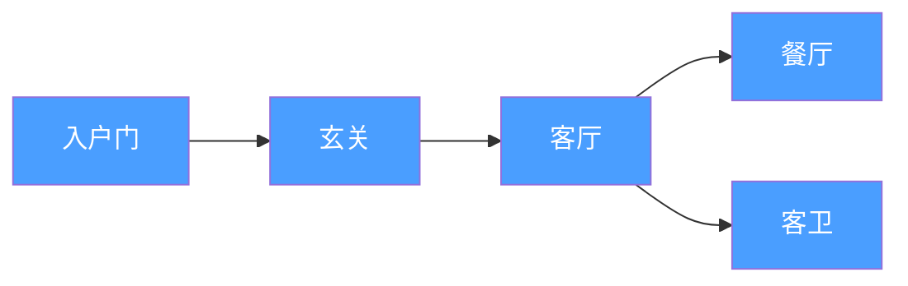
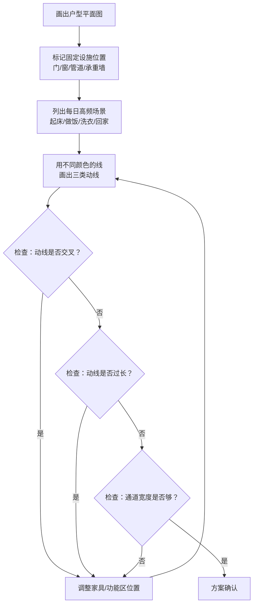
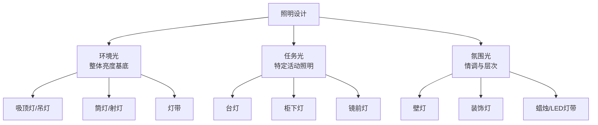

## 三、家居布置方案

家居布置不是摆家具、挂窗帘那么简单——它是空间、人、行为三者之间的系统工程。一个好的家居布置方案，能让90平米的房子住出120平米的舒适感，也能让200平米的豪宅变成动线混乱的迷宫。本章从动线设计、功能分区、家具布局、氛围营造四个维度，给出可落地的完整布置方案。

### 3.1 家居动线设计

动线是家居布置的骨架。在你决定任何一件家具放在哪里之前，首先要搞清楚人在空间中怎么走。环境心理学研究表明，当动线设计不合理时，人每天会多走30%-50%的无效步数，这不仅浪费时间，还会在潜意识中制造烦躁感。好的动线设计如同好的交通规划——让每个目的地之间的路径最短、最自然、互不干扰。

#### 3.1.1 三类核心动线

家居中存在三类性质完全不同的动线，它们的使用频率、使用者、优化目标各不相同：

**家务动线**：做家务时的移动路线，特点是高频重复、涉及大量物品搬运。

| 场景 | 动线路径 | 优化目标 |
|------|---------|---------|
| 做饭 | 冰箱（取食材）→ 水槽（清洗）→ 备餐区（切配）→ 灶台（烹饪）→ 装盘区 | 形成顺畅的"工作三角"，总距离控制在3.6-6.6米 |
| 洗衣 | 脏衣篓 → 洗衣机 → 晾衣架/烘干机 → 折叠台 → 衣柜 | 一条直线或L形完成，避免来回跑 |
| 清洁 | 清洁工具存放点 → 各房间 → 垃圾处理点 | 工具取用方便，垃圾出口在动线末端 |
| 餐后清理 | 餐桌 → 水槽（洗碗）→ 碗柜（收纳）→ 垃圾桶 | 三步内完成，不需要穿过其他功能区 |

厨房的"工作三角"（冰箱-水槽-灶台）是家务动线设计中最经典的概念，由20世纪40年代的建筑研究机构提出。三角形三边之和理想范围是3.6-6.6米：太短说明厨房过于拥挤，操作空间不足；太长则意味着做饭时需要频繁长距离移动，效率低下。

**生活动线**：日常生活中的移动路线，特点是自然流畅、覆盖从早到晚的完整周期。

以一个典型的上班族工作日为例，生活动线贯穿全天：

| 时间段 | 动线路径 | 设计要点 |
|--------|---------|---------|
| 7:00 起床 | 卧室 → 卫生间（洗漱）→ 厨房（早餐）→ 玄关（出门） | 卧室到卫生间不超过5步，玄关有放置钥匙、包的区域 |
| 12:00 午休 | 客厅/卧室（休息）→ 厨房（简餐） | 动线短，快速进入休息状态 |
| 18:30 回家 | 玄关（换鞋放包）→ 厨房（做饭）→ 餐厅（吃饭）→ 客厅（休息） | 玄关到厨房放菜路径短，脏鞋不经过公共区 |
| 21:00 洗漱 | 客厅 → 卫生间（洗澡）→ 卧室（睡觉） | 卫生间到卧室有干燥路径，不经过客厅湿区 |

生活动线优化的核心原则是**减少不必要的折返**。如果你每天从卧室到卫生间要经过客厅再折回卧室，这条动线就有问题——说明卧室和卫生间的距离太远，或者中间需要绕过障碍物。

**访客动线**：客人来访时的移动路线，特点是**不暴露私密区域**。

访客动线的最高原则是：客人从进门到落座，再到洗手间，全程不经过卧室、不看到卧室内部。这是户型选择和布置时的重要考量。

#### 3.1.2 动线设计的五条原则

**原则一：动线尽量短**

减少不必要的行走距离。这不是"差不多就行"，而是有具体数字参考：

- 厨房工作三角总长：3.6-6.6米（最佳4.5-5.5米）
- 洗衣动线总长：理想状态5米以内
- 起床出门动线：10步以内完成从起床到出门的全过程

**原则二：不同动线尽量不交叉**

动线交叉是家居生活中最大的隐形摩擦源。当家务动线和生活动线重叠时，一个人在做饭，另一个人要去客厅休息就必须穿过厨房——不仅不方便，还让做饭的人感到被"围观"。

具体操作建议：

- 厨房的工作区（水槽、灶台前）不应是通往其他房间的必经之路
- 卫生间的门不要正对客厅或餐厅
- 卧室门不要直接开在客厅的公共动线上

**原则三：常用物品放在动线附近**

这一条看似简单，但执行得好的家庭不超过20%。核心方法是"就近收纳"——物品的存放位置应该紧邻其使用位置，而不是按类别集中存放。

| 物品 | 错误做法 | 正确做法 |
|------|---------|---------|
| 剪刀、开瓶器 | 放在杂物抽屉（客厅） | 放在厨房操作台附近的抽屉 |
| 钥匙、钱包 | 随手放在茶几/餐桌 | 玄关固定位置（挂钩/托盘） |
| 常用药品 | 药箱放在储藏室深处 | 卫生间镜柜或客厅易取处 |
| 充电线/充电器 | 塞在抽屉里 | 床头、沙发旁、书桌旁各一套 |
| 雨伞 | 伞架在储藏间 | 玄关门口 |

**原则四：功能相关的区域相邻布置**

这是功能分区的基础——使用场景关联度高的区域应该物理相邻：

- 厨房和餐厅相邻（最好一墙之隔或开放式连通）
- 卧室和卫生间相邻（主卧带独立卫生间是最佳配置）
- 书房和卧室适当分离（工作和休息需要心理隔离）
- 洗衣区和卫生间相邻（共用上下水管道）

**原则五：预留足够的通行宽度**

人体工程学给出了明确的通行宽度标准：

- 单人通行：最低60cm，舒适宽度80cm
- 双人并行：最低120cm，舒适宽度140cm
- 轮椅通行：最低80cm，转弯处最低150cm
- 主通道：建议90-120cm
- 次通道：建议60-80cm

常见错误是家具摆放过满，导致通道窄于60cm。人在狭窄通道中行走时，皮质醇（压力激素）水平会轻微但持续地升高——这是环境心理学中"空间压迫感"的典型表现。

#### 3.1.3 动线设计的实操流程

**第1步**：画出你家的平面图。不需要专业软件，纸笔或手机上的画图App就行。关键是标注准确的尺寸——尤其是门的位置和开向、窗户位置、水管/下水位置、承重墙位置。这些东西装修时改不了，是动线设计的硬约束。

**第2步**：列出你家的高频生活场景。每个人的作息不同，高频场景也不同。一个居家办公的人，起床→书房的动线比起床→玄关重要得多。一个有幼儿的家庭，客厅→卫生间→厨房的环形动线使用频率极高。

**第3步**：在平面图上用不同颜色的笔画出每条动线。红色画家务动线，蓝色画生活动线，绿色画访客动线。画完之后一目了然——哪里交叉了，哪里绕远了，哪里堵了。

**第4步**：检查和优化。重点关注三个问题：动线是否交叉？动线是否过长？通道宽度是否够？发现问题后，通过调整家具位置、改变门的开向、增减隔断来优化。

### 3.2 家居功能分区

功能分区是家居布置的第二层骨架。如果说动线是"路"，那功能分区就是"区域划分"——哪些地方是公共的，哪些是私密的，哪些是干活的，哪些是休息的。

#### 3.2.1 四大分区原则

**原则一：公私分离**

公共区（客厅、餐厅、玄关）和私密区（卧室、书房、主卫）必须有明确的边界。这不是说要用墙完全隔开——开放式布局也可以有公私分区，关键是通过走廊、家具布局、地面高差等方式建立"心理边界"。

具体判断标准：从公共区到私密区，至少需要经过一道门或一个转折。如果站在客厅沙发上能直接看到卧室床铺，公私分区就是失败的。

**原则二：动静分离**

活动频繁的区域（客厅、厨房、餐厅、儿童房）和需要安静的区域（卧室、书房）应该尽可能远离。如果户型条件允许，两者之间最好隔着卫生间或储物间——这些"缓冲区"能有效吸收噪音。

实测数据：一面标准12cm砖墙的隔声量约45dB，一扇实木门约30dB，一个储物间满柜衣物的额外吸音量约5-8dB。在动静两区之间安排储物间，比空走廊安静得多。

**原则三：服务区集中**

厨房、卫生间、洗衣区、设备间等涉及上下水管道的区域应该集中布置。这不仅节省管道成本（集中排管比分散排管便宜30%-50%），还减少漏水风险——管道越短，漏点越少。

老房改造中常见问题：想把厨房移到阳台，但阳台没有下水管。改下水管的费用可能高达5000-10000元，且需要楼下邻居配合。在做功能分区调整前，先确认管道位置这个硬约束。

**原则四：考虑采光与朝向**

不同功能区对自然光的需求不同：

| 功能区 | 采光需求 | 最佳朝向 | 原因 |
|--------|---------|---------|------|
| 客厅 | 高 | 南/东南 | 活动时间长，需要充足自然光 |
| 卧室 | 中 | 南/东 | 东向早晨阳光自然唤醒，南向温暖 |
| 书房 | 高 | 北/东 | 北向光线均匀无直射，不刺眼 |
| 厨房 | 中 | 东/北 | 操作时需要明亮但避免西晒过热 |
| 卫生间 | 低 | 任意（有窗即可） | 通风比采光更重要 |

#### 3.2.2 小户型分区技巧（60㎡以下）

小户型分区的核心矛盾是：功能要分，空间不够。解决思路不是用墙硬隔，而是用"软分隔"制造功能区的心理边界。

**技巧一：家具分隔法**

书架、矮柜、沙发背靠背放置，是最自然的软隔断。与实体墙相比，家具隔断有三大优势：不遮挡光线、保留空间通透感、兼具收纳功能。

具体方案：

- **沙发背靠背分隔客厅和餐厅**：沙发背面与餐桌之间留出80-100cm通道
- **半高书架分隔书房和客厅**：高度120-150cm，坐下时看不到对面，站起来能看到，兼顾隐私和开放感
- **岛台/吧台分隔厨房和餐厅**：既作隔断又是操作台/餐桌，一物多用
- **矮柜分隔玄关和客厅**：高度80-100cm，上面放装饰品，下面收纳鞋子

**技巧二：地面材质/高差法**

不同区域使用不同的地面材料，或制造2-3cm的高差，能在视觉和触觉上明确分区：

- 客厅铺木地板，厨房铺瓷砖——两种材质的交界就是天然分界线
- 餐厅区域做一个2cm的木质地台，上面铺地毯，空间感立刻不同
- 玄关用花砖或深色石材，与室内木地板形成鲜明对比

**技巧三：灯光分区法**

用不同的照明方案定义不同区域，是成本最低、效果最好的分区方式：

- 客厅区：主灯（吊灯/吸顶灯）+ 筒灯
- 餐厅区：一盏餐桌吊灯（离桌面70-80cm）就能建立独立的"光域"
- 阅读角：一盏落地灯，在开放空间中圈出一个私密角落
- 玄关区：感应灯带，进门自动亮起，强化"进入"的心理感受

**技巧四：帘幕/屏风法**

帘子和屏风是灵活性最高的分隔方式——需要时拉上，不需要时收起，不占空间：

- 厨房用布帘或竹帘半遮挡，防止油烟扩散但保留视觉连通
- 卧室用纱帘与客厅分隔，白天拉开，晚上拉上
- 书房用卷帘或百叶，在需要专注时拉上，日常保持开放

#### 3.2.3 中大户型分区策略（60-120㎡）

中大户型的分区重点从"如何分"转变为"如何分得有层次"。

**环形动线布局**：客厅-餐厅-厨房形成一个环形动线，人在其中可以循环行走而不走回头路。这是中大户型最舒适的布局方式——从客厅起身去厨房拿饮料，不需要原路返回，可以绕回客厅。

**双厅设计**：如果有足够的面积，将客厅分为"社交厅"（靠近玄关，接待来客）和"家庭厅"（靠近卧室，家人日常使用）。社交厅保持整洁，家庭厅可以更随意。

**主卧套房化**：主卧+主卫+衣帽间形成独立套间。套房入口设一道门或走廊，与公共区域彻底隔离。主卧套间的面积建议不低于15㎡（卧室10㎡+卫生间4㎡+衣帽间5㎡），否则各功能区会显得局促。

#### 3.2.4 大户型分区策略（120㎡以上）

大户型的分区核心是**避免空间浪费和心理空洞**。

**中庭/过厅利用**：大户型中间往往有面积不小的过厅，不要浪费——设置一个阅读角、茶台或艺术品展示区，让过渡空间也成为功能区。

**双主卧思维**：为家庭成员的作息差异考虑，两个卧室可以分置在房子两端。一个早睡早起，一个晚睡晚起，互不干扰。

**服务动线隐藏**：大户型的家务动线更长，更需要独立的服务通道。保姆/家政动线应该与主人生活动线分开——有独立的服务入口、独立的厨房出入口、独立的洗衣区通道。

### 3.3 家具选择与摆放

家具是家居布置的实体载体。动线和分区是抽象的设计原则，最终要通过家具的位置和尺寸来落地。

#### 3.3.1 家具选择的尺寸法则

选择家具时最常见的错误是**凭感觉估尺寸**，买回来发现太大塞满房间，或太小显得空荡。以下是各主要家具的尺寸参考：

**沙发**：

| 客厅面积 | 推荐沙发尺寸 | 沙发类型 |
|----------|-------------|---------|
| 15㎡以下 | 2人位，长150-170cm | 小型双人沙发 |
| 15-25㎡ | 3人位，长200-230cm | 标准三人沙发 |
| 25-35㎡ | L型或3+1组合 | 转角沙发/组合沙发 |
| 35㎡以上 | U型或3+2+1组合 | 大型组合沙发 |

沙发布局的黄金法则：**沙发面积占客厅面积的25%-30%**。超过30%会显得拥挤，低于20%会显得空旷。

**餐桌**：

| 就餐人数 | 桌面尺寸 | 每人占桌面宽度 |
|----------|---------|---------------|
| 2人 | 80×60cm | 40cm |
| 4人 | 120×80cm 或 Φ100cm圆桌 | 40-50cm |
| 6人 | 160×90cm 或 Φ130cm圆桌 | 50-60cm |
| 8人 | 200×100cm 或 Φ150cm圆桌 | 50-60cm |

每人用餐所需的桌面宽度是45-60cm，深度是40cm。如果桌面太窄，手肘会碰到旁边的人；如果椅子之间间距小于5cm，起身坐下都需要别人让路。

**床**：

| 床型 | 尺寸 | 适用场景 |
|------|------|---------|
| 单人床 | 90×200cm 或 120×200cm | 儿童房、单人卧室 |
| 双人床标准 | 150×200cm | 主卧，面积10㎡以上 |
| 双人床加大 | 180×200cm | 主卧，面积14㎡以上 |
| 特大号 | 200×200cm | 主卧，面积18㎡以上 |

床两侧至少留60cm的通行空间，床尾到墙或家具至少留70cm。如果床两侧的通道低于50cm，每天起床都会觉得逼仄。

#### 3.3.2 家具摆放的核心原则

**原则一：先确定"主角家具"的位置**

每个房间有一件"主角家具"，其他家具围绕它布置：

- 客厅：沙发是主角，先确定沙发的位置和朝向
- 卧室：床是主角，先确定床的位置和朝向
- 餐厅：餐桌是主角，先确定餐桌的位置
- 书房：书桌是主角，先确定书桌面对的方向

确定主角家具后，其他家具的位置基本就"自动"确定了——茶几在沙发前面，电视柜在沙发对面，床头柜在床两侧。

**原则二：留出足够的"呼吸空间"**

家具之间的间距不是"塞得下就行"，而是要让人在其中感到舒适。以下是关键间距参考：

| 间距位置 | 最小值 | 舒适值 | 说明 |
|----------|--------|--------|------|
| 茶几与沙发之间 | 30cm | 40-50cm | 方便起身和行走 |
| 茶几与电视柜之间 | 通道60cm | 80-100cm | 至少一人通行宽度 |
| 餐桌与墙之间（有座椅侧） | 75cm | 90cm | 坐下后身后仍有通行空间 |
| 餐桌与墙之间（无座椅侧） | 50cm | 60cm | 靠墙摆放时的过道宽度 |
| 床尾与墙/柜之间 | 60cm | 80cm | 打开柜门后仍有通行空间 |
| 衣柜开门空间 | 门宽+30cm | 门宽+50cm | 平开门衣柜需要的前方空间 |

**原则三：家具不要"贴墙放"**

很多家庭习惯把所有家具紧贴墙壁摆放，认为这样中间空间最大。但事实上，大空间里家具适当离开墙壁（10-20cm），反而能制造更好的空间层次感。尤其在客厅：

- 沙发不要顶着墙——如果空间允许，沙发背后留10-15cm的间隙，或者靠墙放一排窄条柜（深度15-20cm），上面放台灯和装饰品
- 书架不要紧贴墙角——留出5-10cm，方便清洁和防潮
- 床头不要紧贴窗户——留出30-50cm，避免风直吹头部

小户型例外：面积实在有限时，家具贴墙是唯一选择，但可以通过镜面、浅色、通透材质来弥补空间感的不足。

**原则四：创造"聚焦点"**

每个房间需要一个视觉焦点——它引导视线、定义空间、制造记忆点。

- 客厅：壁炉、大幅装饰画、电视墙、落地窗景观
- 卧室：床头背景墙、窗户景观、一盏造型独特的吊灯
- 餐厅：一盏精心选择的餐桌吊灯
- 书房：一排整面墙的书架、窗外景观

没有聚焦点的房间会显得"平淡"——你走进去觉得什么都对，但什么都记不住。

### 3.4 照明设计

照明是家居氛围的第一要素，也是最容易被低估的要素。很多人花了大量预算在家具和装饰上，却只在天花板中间装一盏吸顶灯了事——这就像精心准备了一桌菜，却只开了一盏日光灯管。

#### 3.4.1 三层照明体系

专业的家居照明分三层，每一层承担不同的功能：

**第一层：环境光（Ambient Light）**

也叫"基础照明"，提供整体的均匀亮度。它是空间照明的基底，就像绘画的底色。

- 形式：吸顶灯、吊灯、嵌入式筒灯、灯带
- 亮度参考：客厅150-300lx，卧室100-150lx，厨房200-300lx
- 色温参考：居住空间2700-3000K（暖白光），工作空间3500-4000K（中性光）

**第二层：任务光（Task Light）**

为特定活动提供的聚焦照明。没有任务光，你做饭时背光切菜，看书时眼睛疲劳，化妆时颜色失真。

- 形式：台灯、落地灯、柜下灯带、镜前灯
- 亮度参考：阅读300-500lx，厨房操作台500lx，书桌500lx
- 关键要求：任务光应该从侧面或后方照射，避免手部阴影遮挡工作区

**第三层：氛围光（Accent Light）**

也叫"重点照明"，用于突出装饰物、营造情调、制造空间层次。

- 形式：射灯、壁灯、蜡烛、LED灯带、装饰灯
- 亮度参考：50-100lx，重点在于对比而非绝对亮度
- 用法：照射装饰画、绿植、书架、建筑细节

#### 3.4.2 色温选择指南

色温（单位：开尔文K）决定了光的"冷暖"。选错色温，再贵的灯具也白搭。

| 色温 | 感受 | 适用空间 | 不适用空间 |
|------|------|---------|-----------|
| 2200-2700K | 非常暖，烛光感 | 卧室床头、餐厅、氛围照明 | 书房、厨房操作台 |
| 3000K | 温暖舒适 | 客厅、卧室主灯、走廊 | — |
| 3500-4000K | 中性清爽 | 厨房、书房、卫生间 | 卧室 |
| 5000-6500K | 冷白日光 | 车库、储物间、工作台 | 所有居住空间（日常不建议） |

最常见的错误是全屋统一用6500K的冷白光灯管——它确实很亮，但会让人在家中感觉像在办公室里，无法放松。暖白光（2700-3000K）是居住空间的默认选择。

同一空间内建议使用相同色温的光源，或色温差距不超过500K。不同色温的光源混用会让空间看起来"脏"——视觉上不协调。

#### 3.4.3 各房间照明方案

**客厅照明方案**：

- 环境光：吸顶灯或嵌入式筒灯，色温3000K，可调光
- 任务光：沙发旁落地灯（阅读用），色温3000-3500K
- 氛围光：电视墙灯带（降低对比度保护眼睛），装饰柜射灯

关键细节：电视墙背后安装一条LED灯带（色温3000K，亮度可调），在夜间看电视时开启，能显著减少屏幕与环境的亮度对比，降低视觉疲劳。这个做法的成本不到100元，效果却非常好。

**卧室照明方案**：

- 环境光：吸顶灯或无主灯设计（分散式筒灯），色温2700-3000K，必须可调光
- 任务光：床头壁灯或台灯（看书用），色温2700-3000K，独立开关
- 氛围光：床底灯带（夜间起夜用，感应式），窗帘盒灯带

卧室照明的核心是**起夜不刺眼**。从睡梦中醒来，突然打开300lx的主灯，瞳孔来不及收缩，会非常不适。解决方案：床底安装暖色感应灯带（色温2200K，亮度30lx），脚落地自动亮起，亮度足够看清地面又不会驱走睡意。

**厨房照明方案**：

- 环境光：吸顶灯或嵌入式筒灯，色温3500-4000K
- 任务光：吊柜下方灯带（照亮操作台面），色温4000K
- 重点照明：如果厨房有中岛，上方吊灯

厨房最容易被忽视的照明死角是**操作台面**——头顶的主灯会被身体挡住，在台面上形成阴影，导致切菜时光线不足。吊柜下方安装LED灯带（每米成本约20-50元）就能彻底解决这个问题。

### 3.5 色彩搭配

色彩是家居氛围中感知最强的元素。研究表明，人进入一个空间后，对色彩的感知在0.1秒内完成——远快于对家具、材质、布局的判断。色彩选择的错误是最难忍受的，因为它存在于空间的每一个角落，无处可逃。

#### 3.5.1 60-30-10法则

这是室内设计中最经典的色彩配比法则：

- **60% 主色调**：墙面、天花板、大型家具（沙发、地毯、窗帘框架）
- **30% 辅助色**：窗帘、靠垫、小家具、地毯图案
- **10% 点缀色**：装饰品、花卉、画框、小物件

以一个现代简约风格的客厅为例：

| 比例 | 色彩 | 具体应用 |
|------|------|---------|
| 60% | 暖白色/奶油色 | 墙面、天花板、大面积地毯 |
| 30% | 浅灰色/米灰色 | 沙发、窗帘、电视柜 |
| 10% | 雾霾蓝/焦糖色 | 靠垫、装饰画、花瓶 |

60-30-10法则的关键在于**比例的严格执行**。很多人失败的原因是点缀色用多了——当10%的点缀色变成30%时，空间就显得杂乱。用色克制比用色大胆更难，但效果更好。

#### 3.5.2 不同空间的色彩策略

**卧室色彩**：

卧室的色彩应该促进放松和睡眠。研究显示，蓝色系环境能降低心率和血压，是最适合卧室的颜色。但这里说的"蓝色"不是大面积的纯蓝，而是**低饱和度的蓝灰色、雾蓝色、灰蓝色**。

- 推荐色系：灰蓝、灰绿、米白、暖灰、裸粉
- 避免色系：大红、亮橙、纯黄（刺激神经系统，不利于入睡）
- 天花板：建议纯白或比墙面浅一号的颜色，制造"上升感"

**客厅色彩**：

客厅是家的社交中心，色彩需要兼顾活力和舒适。中性色（白色、灰色、米色）是最安全的底色，在此基础上用软装的色彩来调节气氛。

- 推荐色系：暖白、浅灰、米色、灰蓝（北欧风）、灰绿（自然风）
- 墙面与家具的明暗关系：深色家具配浅色墙面，或浅色家具配深色一面墙（重点墙/电视墙）

**书房色彩**：

书房需要支持专注力。研究发现，绿色环境有助于保持注意力（因为人类进化中，绿色意味着安全的自然环境，大脑不需要额外警觉），蓝色有助于创造性思维。

- 推荐色系：灰绿、蓝灰、米白
- 避免：暖色调大面积使用（暖色让大脑活跃，不利于长时间集中注意力）

**厨房色彩**：

厨房需要清洁感和食欲感。白色、浅灰是底色首选，搭配少量暖色（原木色、暖黄）增加温馨感。

- 推荐：白色/浅灰橱柜 + 原木色台面 + 暖黄灯光
- 避免：深灰色全屋（做饭时已经够热了，深色空间更显压抑）

#### 3.5.3 色彩搭配的实操工具

不需要专业设计背景，以下工具可以帮你快速找到和谐的配色方案：

- **Adobe Color**（color.adobe.com）：输入一个颜色，自动生成5色和谐方案
- **Coolors**（coolors.co）：按空格键随机生成配色，看到喜欢的就锁定
- **Pinterest**：搜索"客厅配色方案""卧室色彩搭配"，保存喜欢的图片，然后提炼其中的颜色
- **小红书/好好住**：搜索你家的户型面积+风格，看实际案例的色彩搭配

最实用的方法是：先在网上找到一个你喜欢的家居空间照片，用手机取色功能提取3-5个主要颜色，然后按照60-30-10的比例分配到自己家中。这比凭空想象配色靠谱得多。

### 3.6 自然元素引入

室内引入自然元素不是装饰，是生存需求。环境心理学的"亲生物假说"（Biophilia Hypothesis）认为，人类天生对自然环境有亲近感——在有植物、自然光、天然材质的空间中，人的压力水平降低、创造力提升、恢复速度加快。

#### 3.6.1 室内绿植配置

不同位置适合不同大小和类型的植物。关键不只是"放什么"，更是"放在哪里"和"怎么维护"。

**大型植物（高度1m以上）——空间锚点**

大型植物是空间的视觉支柱，一棵就能改变一个角落的气质。

| 植物 | 光照需求 | 浇水频率 | 特点 | 适合位置 |
|------|---------|---------|------|---------|
| 龟背竹 | 中等散射光 | 7-10天 | 造型独特，生长较慢 | 客厅角落、书房 |
| 琴叶榕 | 明亮散射光 | 7-10天 | 株型优美，对环境敏感 | 客厅窗边 |
| 天堂鸟 | 充足散射光 | 5-7天 | 叶片大，热带感强 | 客厅、玄关 |
| 橡皮树 | 中等散射光 | 7-10天 | 叶片油亮，耐阴 | 客厅、走廊 |
| 散尾葵 | 明亮散射光 | 5-7天 | 造型优雅，净化空气 | 客厅、餐厅 |

大型植物最容易犯的错误是浇水过多。室内大型绿植最常见的死因是根部腐烂，而不是缺水。判断标准：将手指插入土壤2-3cm，如果还湿的就不要浇水。

**中型植物（30-100cm）——桌面/架上点缀**

| 植物 | 光照需求 | 浇水频率 | 适合位置 |
|------|---------|---------|---------|
| 虎皮兰 | 耐阴 | 10-14天 | 电视柜旁、卧室（夜间释放氧气） |
| 绿萝 | 耐阴 | 5-7天 | 书架顶部、冰箱上 |
| 金钱树 | 耐阴 | 10-14天 | 客厅边柜、办公室桌面 |
| 春羽 | 中等散射光 | 7-10天 | 餐桌旁、沙发旁 |
| 白掌 | 中等散射光 | 5-7天 | 卫生间（耐湿）、厨房 |

**小型植物（30cm以下）——精巧点缀**

多肉植物、空气凤梨、苔藓微景观、小型蕨类、水培植物（铜钱草、富贵竹）。适合放在窗台、书桌、餐桌中央、卫生间洗手台。

#### 3.6.2 天然材质运用

天然材质传递的不仅是视觉美感，更是触觉上的舒适。人的皮肤对天然材质（棉、麻、木、石）和人工材质（塑料、化纤、不锈钢）的反应是不同的——对天然材质的触觉评价普遍更积极。

| 材质 | 应用场景 | 触感特点 | 维护难度 |
|------|---------|---------|---------|
| 实木 | 地板、家具、台面 | 温润、有纹理变化 | 中（需防潮防刮） |
| 棉 | 床品、靠垫、窗帘 | 柔软、透气 | 低（可机洗） |
| 亚麻 | 窗帘、桌布、靠垫 | 质朴、有肌理感 | 中（易皱） |
| 石材 | 台面、地面、装饰 | 冰凉、光滑、沉稳 | 中（需密封保养） |
| 藤编 | 收纳篮、椅子、灯罩 | 轻巧、自然、透气 | 低（避免暴晒） |
| 陶瓷 | 花瓶、餐具、摆件 | 光滑、有分量感 | 低（注意防摔） |

实用建议：每个房间至少使用2-3种天然材质。客厅可以是木地板（木）+ 棉麻沙发（棉/麻）+ 藤编收纳篮（藤）+ 陶瓷花瓶（陶瓷）。材质的多样性让空间层次丰富。

#### 3.6.3 水元素

水元素在室内设计中的作用常被忽视。流水的声音能掩盖低频环境噪音（空调声、邻居走路声），同时对大脑有镇静作用。

- **小型桌面喷泉**：放在书房或客厅角落，流水声约30-40dB，白噪音效果极佳
- **鱼缸**：养鱼是已被证实的减压活动。一项2015年的研究发现，观看鱼缸中游动的鱼10分钟后，参与者的血压平均降低3-5mmHg。鱼缸也是天然的加湿器，冬季室内湿度偏低时很有帮助
- **水培植物**：铜钱草、绿萝水培，玻璃瓶中看到根系生长，既有水元素又有绿色植物的双重效果

### 3.7 香氛设计

嗅觉是唯一一种不需要经过丘脑中继、直接连接大脑边缘系统（情感和记忆中枢）的感觉。这意味着气味对情绪的影响比视觉、听觉更快、更直接。一闻到某种气味，情绪和记忆就被瞬间激活——这就是普鲁斯特效应。

家居香氛设计不是"让家里好闻"这么简单，而是利用嗅觉通道来调节每个空间的功能属性。

#### 3.7.1 空间与香气的对应关系

| 空间 | 推荐香型 | 心理效果 | 推荐精油 |
|------|---------|---------|---------|
| 客厅 | 清新花果香 | 欢迎感、舒适感 | 佛手柑、甜橙、依兰 |
| 卧室 | 草本花香 | 放松、安眠 | 薰衣草、洋甘菊、檀香 |
| 书房 | 清凉草本 | 提神、专注 | 薄荷、迷迭香、柠檬 |
| 卫生间 | 柑橘茶树 | 清洁、净化 | 柠檬、茶树、尤加利 |
| 玄关 | 温暖木质 | 归家感、安全感 | 雪松、乳香、香草 |

薰衣草的助眠效果有大量研究支撑：2012年发表在《循证补充与替代医学》上的研究发现，睡前30分钟使用薰衣草精油的受试者，入睡时间缩短20%，睡眠质量评分提高15%。

#### 3.7.2 香氛载体对比

| 载体 | 优点 | 缺点 | 适合场景 |
|------|------|------|---------|
| 超声波香薰机 | 浓度可调、安全、可定时 | 需要加水、定期清洁 | 卧室、书房 |
| 藤条香薰 | 零维护、持续散发、装饰性强 | 浓度固定、不可调节 | 客厅、卫生间 |
| 香薰蜡烛 | 氛围感最强、有仪式感 | 有明火（安全隐患）、需有人看管 | 客厅、餐厅（晚餐时） |
| 扩香石 | 安全、便携、可随身带 | 扩散范围小（1-2㎡） | 书桌、床头柜 |
| 干花/香包 | 自然、持久、成本低 | 香味较淡 | 衣柜、抽屉、玄关 |

安全提醒：使用香薰蜡烛时不要离开房间，远离窗帘和可燃物。有儿童和宠物的家庭优先选择超声波香薰机或藤条香薰，避免明火。

#### 3.7.3 香氛使用注意事项

- **不要混用多种香型**：一个空间同时使用两种以上香型会造成嗅觉混乱，效果适得其反。每个空间保持一种香型
- **浓度不是越高越好**：舒适的香氛浓度是"若有若无"，闻到时觉得舒服，注意不到时也不会觉得少了什么。过浓的香气会导致头痛
- **定时使用比全天使用更好**：睡前30分钟开启卧室香薰机、下班回家前10分钟开启客厅香薰（智能家居联动）、读书时开启书房香薰——有仪式感的定时使用比24小时持续散发效果好
- **根据季节调整**：夏天适合清新柑橘类（降温感），冬天适合温暖木质类（温暖感）

### 3.8 常见布置误区

即使掌握了以上所有原则，在实际操作中仍然有大量常见错误。以下是经过反复观察总结出的高频误区：

**误区一：先买家具再想布局**

很多人在还没搬进去、没有家具的时候，就先买了一套"好看"的沙发和餐桌。搬进去才发现沙发太大挡了通道，餐桌位置和动线冲突。

正确做法：先确定布局方案，再根据尺寸购买家具。用卷尺量好空间尺寸，用纸片按比例剪出家具的平面尺寸，在平面图上摆放实验，确认动线和间距都OK后再下单。

**误区二：过度装饰**

"这个花瓶好看，买！""这个挂画也不错，买！""这个地毯搭那个窗帘……"——最终家里堆满了各种"好看的东西"，但整体效果杂乱无章。

正确做法：每面墙只挂一个焦点装饰物，每个平面（茶几、书架、餐桌）上的物品控制在3件以内。留白本身就是设计的一部分。宁可少一件，也不要多一件。

**误区三：忽视垂直空间**

大多数人的布置只关注"地面这一层"——家具放在地上，装饰物放在桌上。墙面上方1/3的空间和天花板几乎是空白的。

正确做法：利用垂直空间增加收纳和装饰。高处的书架、墙面搁板、吊挂植物、悬挂式收纳袋，都能有效利用"空中面积"。

**误区四：照明只靠一盏主灯**

全屋只有一盏吸顶灯，所有功能区共享同一亮度同一色温——这是最普遍也最影响生活质量的照明误区。

正确做法：至少实现"每个功能区两个光源"——一个环境光（主灯/筒灯）+ 一个任务光或氛围光。预算有限时优先给卧室和客厅各加一盏台灯/落地灯。

**误区五：忽视空气质量和湿度**

人们花大量时间关注视觉效果，却忽视了最影响舒适度的空气因素。冬季北方室内湿度经常低于20%（舒适范围是40%-60%），导致皮肤干燥、鼻腔不适、静电频繁。

正确做法：在关注家居布置的同时，配备加湿器（冬季）、空气净化器（雾霾天）、排气扇（卫生间/厨房），并定期开窗通风。这些"看不见"的因素对居住体验的影响比多一件装饰品大得多。

### 3.9 不同户型的布置策略速查

| 户型 | 核心策略 | 关键技巧 |
|------|---------|---------|
| 开间/一室（20-40㎡） | 功能叠加，一物多用 | 沙发床、折叠餐桌、墙面收纳系统、帘子分区 |
| 小两居（40-60㎡） | 动线优化，减少通道浪费 | 客餐厅一体、厨房开放或半开放、床下收纳 |
| 标准两居（60-90㎡） | 公私分离，各得其所 | 独立玄关、干湿分离卫生间、阳台功能化 |
| 三居（90-120㎡） | 动静分离，环形动线 | 双厅设计、主卧套房化、独立书房 |
| 大平层（120㎡+） | 层次感，避免空洞 | 中庭利用、双主卧、服务动线独立、分区照明 |

### 3.10 本节要点回顾

家居布置是一个系统工程，核心逻辑可以用一句话概括：**先定动线骨架，再定功能分区，然后选择和摆放家具，最后用灯光、色彩、自然元素和香氛来营造氛围**。

几个关键数字值得记住：

- 厨房工作三角总长：3.6-6.6米
- 单人通行宽度：最低60cm，舒适80cm
- 沙发占客厅面积：25%-30%
- 床两侧通道：最低60cm
- 色彩配比：60-30-10
- 室内舒适湿度：40%-60%

布置家的过程，本质上是把"家"从一个物理空间变成一个有温度、有节奏、有呼吸感的生活场所。每一个细节——从动线到灯光，从色彩到香气——都在无声地影响你每天的心情和效率。值得花时间认真做。
