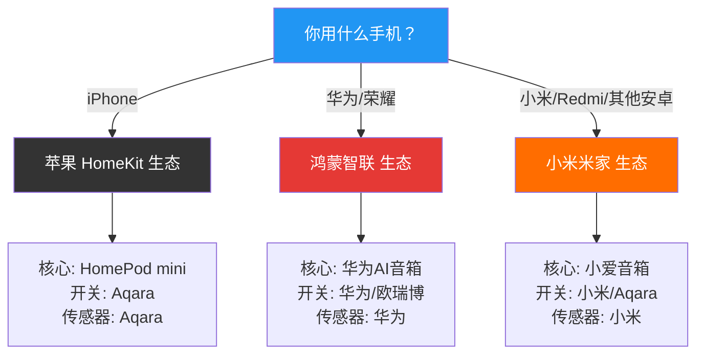
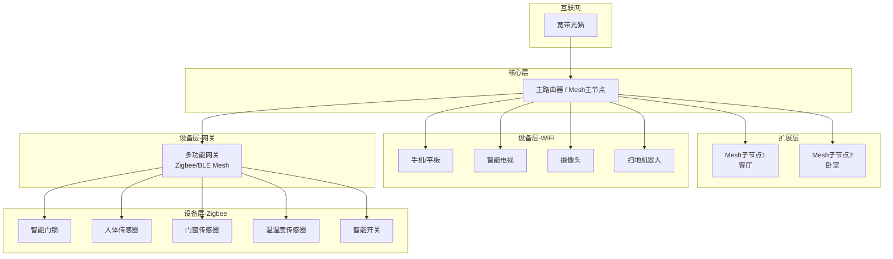
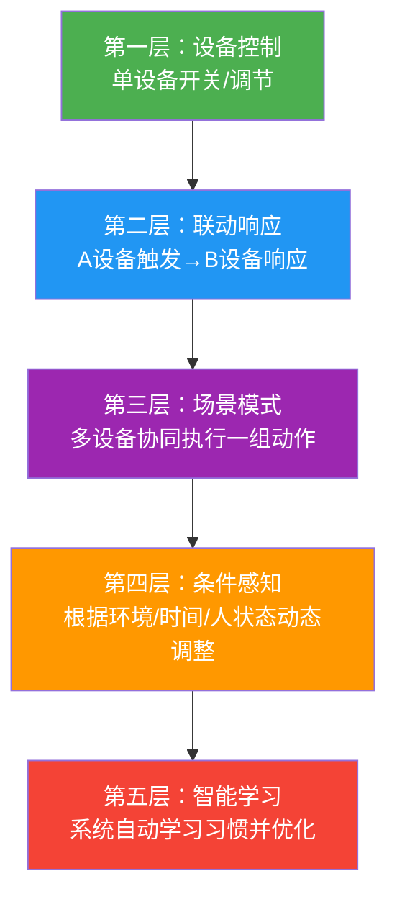
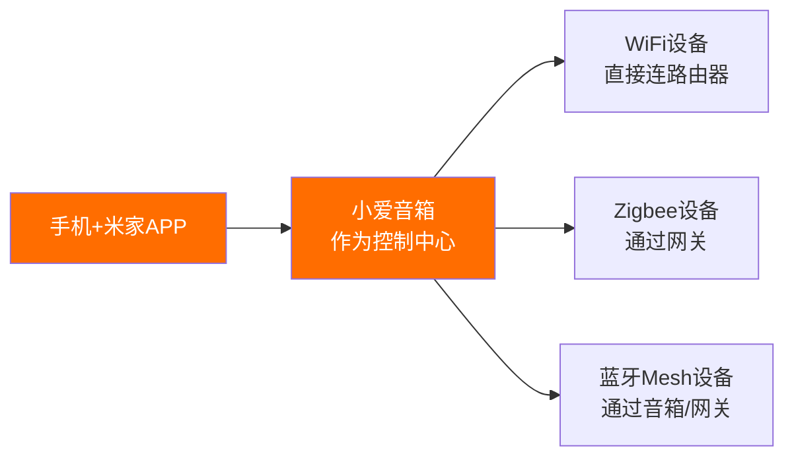
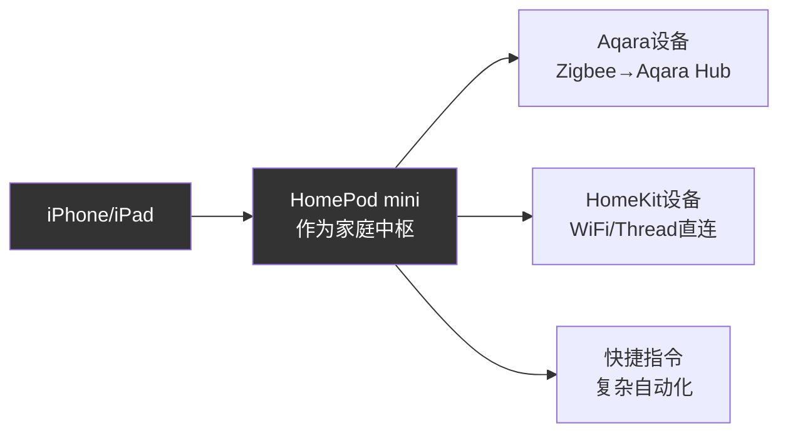
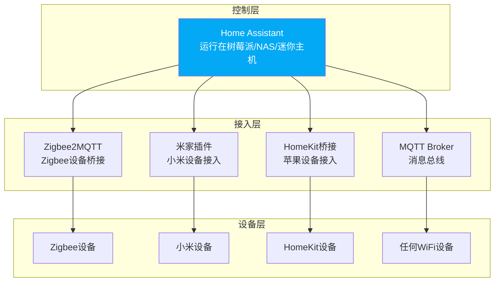
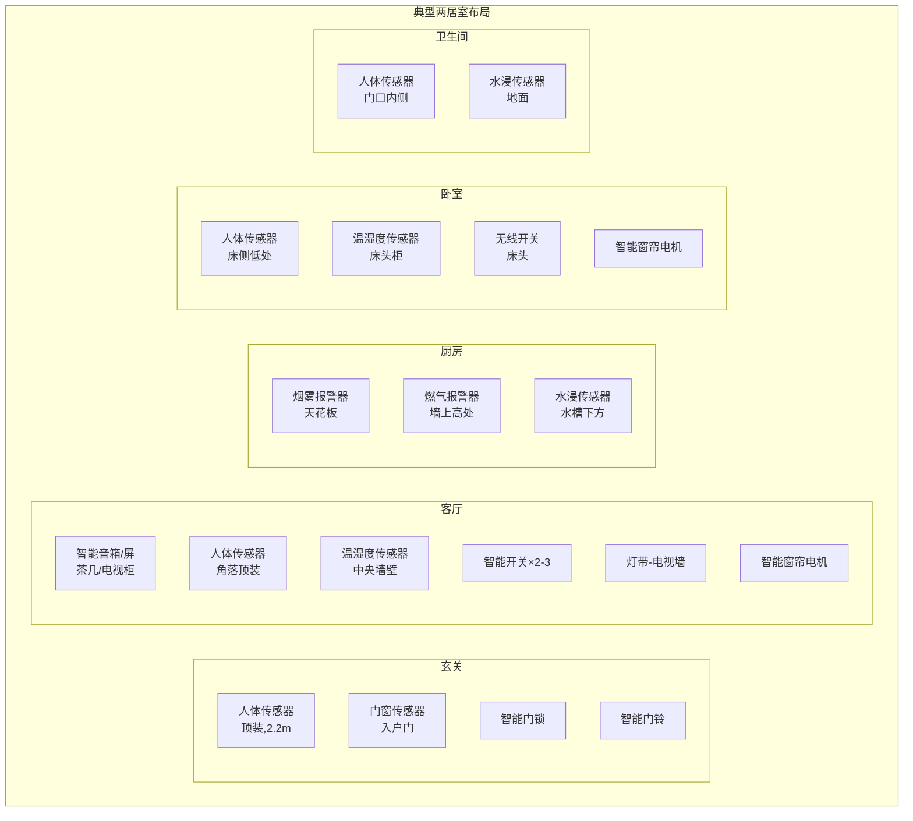

## 四、智能家居方案

智能家居不是"买一堆联网设备往家里一放"就完事了。没有经过系统规划的智能家居，大概率会变成"装了一堆设备，每个都要单独开APP，自动化设了等于没设"的尴尬局面。本节给出从零开始搭建智能家居的完整方案——从需求分析、网络架构、设备布局到自动化设计，每一步都有可执行的操作指南。

> 本节侧重**怎么搭建**，不重复具体产品参数（详见产品推荐节）和技术原理（详见智能家居技术节）。三节配合阅读效果最佳。

### 4.1 智能家居搭建方法论

#### 4.1.1 搭建三步法：需求→方案→实施

┌─────────────────────────────────────────────────────┐
│                  智能家居搭建流程                      │
│                                                       │
│  ┌──────────┐    ┌──────────┐    ┌──────────┐        │
│  │ 第一步   │───→│ 第二步   │───→│ 第三步   │        │
│  │ 需求分析 │    │ 方案设计 │    │ 分步实施 │        │
│  └──────────┘    └──────────┘    └──────────┘        │
│       │               │               │               │
│  · 列出生活痛点   · 选生态平台     · 买第一批设备    │
│  · 按优先级排序   · 设计网络架构   · 配置基础自动化  │
│  · 确定预算范围   · 规划设备布局   · 运行两周观察    │
│                   · 设计自动化逻辑 · 迭代优化        │
│                                       │               │
│                               ┌───────┴───────┐      │
│                               │  持续迭代循环  │      │
│                               │  新需求→扩展  │      │
│                               └───────────────┘      │
└─────────────────────────────────────────────────────┘

**第一步：需求分析——从痛点出发，不从设备出发**

很多人的做法是"看到什么智能设备打折就买什么"，这是最大的错误。正确做法是坐下来，花10分钟列出你在家里每天遇到的不便：

| 场景痛点 | 涉及空间 | 优先级评估 |
|---------|---------|-----------|
| 每天出门忘带钥匙，找锁匠开锁 | 玄关 | ★★★★★（直接影响生活） |
| 冬天睡前不想下床关灯 | 卧室 | ★★★★（高频痛点） |
| 每天手动拖地太累 | 全屋 | ★★★★（高频痛点） |
| 出门总担心忘关空调 | 全屋 | ★★★（中频+费电） |
| 快递到了人不在家 | 玄关 | ★★★（中频） |
| 夏天回家房间太热 | 客厅/卧室 | ★★★（中频） |
| 夜间起夜开灯太刺眼 | 走廊/卫生间 | ★★（低频但影响睡眠） |
| 担心家里漏水/漏气不知道 | 厨房/卫生间 | ★★（低频但后果严重） |

列出痛点后，按优先级排序。**前三个痛点就是你智能家居的起点**。

**第二步：方案设计——先定生态，再定设备**

确定痛点后，根据你已有的设备（手机品牌、已有家电）选择主生态：



> **为什么按手机选生态？** 智能家居80%的操作发生在手机上（设置自动化、远程控制、接收通知）。用同生态的手机，操作体验最顺畅，不需要额外装APP，系统级集成（如iOS的家庭APP、鸿蒙的超级终端）也是同生态才能用。

**如果选不了或者想跨生态？** 用 Home Assistant（后文4.6节详述），它是开源的智能家居中枢，可以同时接入几乎所有品牌的设备。

**第三步：分步实施——每次只加一个功能模块**

最忌讳一次性买齐所有设备。正确节奏：

1. **第一周**：只装核心设备（音箱+1-2个智能开关/灯泡），跑通语音控制
2. **第二周**：加传感器（人体+门窗），配置基础自动化（人来开灯/人走关灯）
3. **第三周**：加安防设备（门锁/摄像头/门铃），配置离家安防模式
4. **第四周**：加环境控制（空调伴侣/窗帘电机），配置场景联动
5. **之后**：根据实际使用体验，逐步补充其他设备

每个阶段跑通并稳定运行一周后再加新设备。这样出问题时能快速定位是哪个设备导致的。

#### 4.1.2 常见的搭建误区

**误区一：买设备不看协议，只看品牌**

设备之间能否联动，取决于它们是否能接入同一个控制平台。即使是同一个品牌，也可能存在不同协议的产品线。比如小米旗下有WiFi设备、Zigbee设备、蓝牙Mesh设备——它们都能被米家APP统一管理，但连接方式和稳定性差异很大。

关键规则：**确认你要买的设备能被你的主生态APP发现和控制**。买之前在米家APP/华为智慧生活APP/苹果家庭APP里搜索型号，能搜到就能用。

**误区二：自动化设太多，互相打架**

有些人一上来就设了30条自动化规则，结果"人来开灯"和"定时关灯"冲突，"开窗关空调"和"温度高开空调"矛盾。自动化设计要遵循**最小必要原则**——先只设3-5条最核心的规则，稳定运行后再逐步添加。

**误区三：忽略网络基础**

智能家居设备越多，对网络的依赖越重。一个50元的路由器带不动30个智能设备。网络是智能家居的地基，地基不牢，上面的设备再好也会"塌"（离线、延迟、自动化失效）。

### 4.2 网络架构规划：智能家居的基础设施

#### 4.2.1 网络拓扑设计

智能家居的网络架构不是"买个路由器插上就完"。设备多了之后，需要分层管理：



**核心要点**：

- **主路由器**：放在房屋中央位置（通常是客厅），负责连接所有WiFi设备和网关
- **Mesh子节点**：大户型（>80㎡或复式/别墅）需要，放在信号死角区域，保证全屋WiFi覆盖
- **多功能网关**：Zigbee/BLE Mesh设备的中转站，将非WiFi设备接入网络。小米的智能音箱（带蓝牙Mesh网关功能的型号）和Aqara多模网关都可以充当这个角色
- **Zigbee设备**：通过网关入网，功耗低、稳定性好，适合传感器和开关类设备

#### 4.2.2 网络配置清单

| 配置项 | 推荐设置 | 原因 |
|-------|---------|------|
| 2.4G/5G频段 | 分开命名（不要双频合一） | 智能设备多只支持2.4G，合一会导致连接不稳定 |
| 2.4G信道 | 选1/6/11中的一个 | 避免邻居WiFi干扰（这三个信道互不重叠） |
| DHCP地址池 | 预留足够IP（至少200个） | 30+智能设备需要大量IP地址 |
| 访客网络/IoT网络 | 启用，连入所有智能设备 | 与手机/电脑隔离，防止设备被入侵后横向渗透 |
| DNS | 路由器默认或114.114.114.114 | 避免使用公共DNS导致设备解析异常 |
| UPnP | 关闭 | 安全性考虑，智能家居设备不需要UPnP |
| WPA加密 | WPA3（或WPA2-PSK AES） | 拒绝WEP和WPA-TKIP，安全性太差 |

#### 4.2.3 设备数量与路由器承载力

| 智能设备数量 | 路由器建议 | 预算参考 |
|------------|-----------|---------|
| 10个以内 | 任何WiFi 6路由器均可 | 200-400元 |
| 10-30个 | WiFi 6路由器，带机量200+ | 300-600元 |
| 30-60个 | WiFi 6/7路由器，带机量500+，建议Mesh | 400-800元 |
| 60个以上 | WiFi 7 Mesh套装 + Zigbee设备分担压力 | 800-1500元 |

**核心经验**：设备数量超过30个时，优先将传感器、开关类设备换成Zigbee协议（通过网关入网），不要全用WiFi设备——WiFi设备太多会争抢信道，导致全网变慢。

### 4.3 分场景实施方案

#### 4.3.1 玄关方案

玄关是进出家的必经之地，核心需求：**开门即亮灯、出门自动安防、快递/访客管理**。

**设备清单**：

| 设备 | 功能 | 安装位置 |
|------|------|---------|
| 智能门锁 | 指纹/密码/NFC开锁，开锁事件触发回家场景 | 入户门 |
| 人体传感器 | 检测人进入玄关，自动开灯 | 玄关顶部（对准入口方向） |
| 智能开关 | 控制玄关灯，替代传统开关 | 原有开关位 |
| 门窗传感器（可选） | 检测入户门开关，辅助离家/回家判断 | 入户门框 |
| 智能门铃（可选） | 访客按铃推送到手机，支持视频通话 | 入户门外 |

**自动化逻辑**：

【回家场景】
触发条件：智能门锁被指纹/密码打开
  → 玄关灯自动亮起（亮度80%）
  → 如果时间在18:00之后，客厅灯也亮起
  → 空调开始制冷/制热（根据当前室温判断）
  → 关闭安防模式（摄像头从警戒切到普通监控）

【离家场景】
触发条件：智能门锁上锁 + 门窗传感器显示门关闭
  → 延迟30秒（确认不是开门取快递）
  → 关闭所有灯光
  → 关闭空调/电视等大功率电器
  → 开启安防模式（摄像头警戒、移动侦测通知）
  → 扫地机器人开始清扫

【访客场景】
触发条件：智能门铃被按下
  → 手机推送通知（含实时视频画面）
  → 可远程对讲
  → 可远程下发临时密码开锁（快递/保洁用）

**关键细节**：
- 人体传感器安装高度建议2.2米，倾斜朝下15°角，检测范围覆盖玄关入口
- 门窗传感器的磁铁端装在门上，感应端装在门框上，间距不超过15mm
- 回家场景的"延迟30秒"很关键——防止你只是开门拿个外卖就触发全屋模式

#### 4.3.2 客厅方案

客厅是家庭活动中心，核心需求：**场景照明、观影模式、会客模式、语音控制中心**。

**设备清单**：

| 设备 | 功能 | 安装位置 |
|------|------|---------|
| 智能音箱/智能屏 | 语音控制中枢+娱乐 | 茶几或电视柜 |
| 智能开关（2-3个） | 控制主灯、射灯、灯带 | 原有开关位 |
| 灯带 | 氛围照明（电视墙/沙发背景） | 电视墙背后、沙发底部 |
| 人体传感器 | 检测有人在客厅，维持灯光和空调 | 客厅一角（对准主要活动区域） |
| 温湿度传感器 | 监测温度，联动空调 | 客厅中央（远离空调出风口） |
| 智能摄像头（可选） | 离家时监控 | 客厅角落（不要对着窗户，逆光效果差） |
| 智能窗帘电机（可选） | 自动开合窗帘 | 窗帘轨道 |

**场景模式设计**：

【日常模式】
  灯光：主灯100%暖白光（4000K）
  窗帘：根据时间自动（8:00开，21:00关）

【观影模式】
  触发：语音"小爱同学，观影模式" / 手机一键触发
  → 主灯关闭
  → 电视墙灯带亮起（暖光2700K，亮度10%）
  → 沙发灯带亮起（暖光2700K，亮度5%）
  → 窗帘自动关闭
  → 电视打开（如果电视支持智能控制）

【会客模式】
  触发：语音"小爱同学，来客人了"
  → 所有灯光亮度100%
  → 色温调整到4000K中性白
  → 空调温度调低1°C（人多会热）

【阅读模式】
  触发：语音"小爱同学，阅读模式"
  → 主灯关闭
  → 落地灯/台灯亮起（色温5000K冷白光，亮度100%）

【离家模式】
  触发：语音"小爱同学，我出门了" / 手机离开WiFi范围
  → 全部灯光关闭
  → 空调关闭
  → 窗帘关闭
  → 安防模式开启

**关键细节**：
- 客厅灯带是性价比最高的氛围投资——100元的灯带能让客厅质感提升一个档次
- 温湿度传感器远离空调出风口（否则测的是空调出风温度，不是室温）
- 如果客厅面积>30㎡，建议放两个人体传感器，分别覆盖沙发区和电视区

#### 4.3.3 卧室方案

卧室的核心需求：**助眠照明、起床模拟、夜间起夜、睡前一键控制**。

**设备清单**：

| 设备 | 功能 | 安装位置 |
|------|------|---------|
| 智能开关 | 控制卧室主灯 | 原有开关位 |
| 智能灯带（可选） | 床头氛围灯 | 床头背后/床底 |
| 无线开关 | 床头随手控制全屋 | 床头柜/床头墙壁 |
| 人体传感器 | 起夜检测 | 床侧（对着地面，避免检测到床上翻身） |
| 温湿度传感器 | 联动空调保持舒适温度 | 床头柜附近 |
| 智能窗帘电机 | 自动开窗帘模拟日出 | 窗帘轨道 |

**核心自动化**：

【起床模拟】
  触发：设定时间（如6:30），仅工作日生效
  → 6:30 灯带从0%缓慢亮到30%（10分钟渐亮，模拟日出）
  → 6:40 窗帘缓慢打开
  → 6:45 主灯亮起（暖光60%）
  → 6:50 音箱播报天气和日程

【睡眠模式】
  触发：床头无线开关长按 / 语音"晚安"
  → 全屋灯光关闭（除走廊夜灯外）
  → 窗帘确认关闭
  → 空调切换到睡眠模式（每小时温度升高0.5°C，4小时后停止制冷/制热）
  → 安防模式开启
  → 音箱停止播放

【起夜模式】
  触发：人体传感器检测到人（时间在23:00-6:00之间）
  → 走廊/卫生间灯带亮起（暖光10%，不刺眼）
  → 3分钟无人后自动关闭

【睡前阅读】
  触发：语音"阅读模式"
  → 主灯关闭
  → 床头灯/灯带亮起（色温4000K，亮度50%）

**关键细节**：
- 卧室的人体传感器安装位置非常重要——要对着床边地面，而不是对着床。否则你在床上翻个身就触发起夜模式
- 如果用灯带做起床模拟，一定要选支持缓慢调光的产品（有些便宜灯泡调光是阶梯式的，不是渐变的，体验很差）
- 床头的无线开关是最被低估的设备——一个39元的开关，贴在床头，单击关灯、双击关全屋、长按触发睡眠模式，比下床按开关或喊语音方便得多

#### 4.3.4 厨房方案

厨房的核心需求：**安全监测（烟雾/燃气/漏水）、定时控制、便捷操作**。

| 设备 | 功能 | 安装位置 |
|------|------|---------|
| 烟雾报警器 | 检测烟雾，立即推送警报 | 天花板（离灶台1-2米，不要太近避免误报） |
| 燃气报警器 | 检测天然气/液化气泄漏 | 墙壁上方30cm处（天然气比空气轻，向上飘） |
| 水浸传感器 | 检测水槽/净水器漏水 | 水槽下方柜子底部（直接平放地上） |
| 智能插座 | 热水壶/电饭煲定时 | 厨房台面插座 |
| 人体传感器（可选） | 进厨房自动开灯 | 厨房门口 |
| 智能开关 | 控制厨房灯 | 原有开关位 |

**自动化逻辑**：

【安全警报】
  触发：烟雾报警器检测到烟雾
  → 手机立即推送通知（最高优先级，即使手机静音也要响）
  → 全屋音箱语音播报"厨房检测到烟雾，请注意安全"
  → 如果有智能燃气阀门，自动关闭燃气

  触发：水浸传感器检测到漏水
  → 手机立即推送通知
  → 音箱语音播报"厨房检测到漏水"

【便捷模式】
  触发：人体传感器检测到人进入厨房
  → 厨房灯自动亮起
  → 5分钟无人后自动关闭

**关键细节**：
- 厨房的烟雾报警器离灶台太近，炒菜时容易误报。建议距离灶台至少1.5米，或者在炒菜时手动暂停该传感器
- 燃气报警器安装位置取决于燃气类型：天然气（比空气轻）装在高处，液化石油气（比空气重）装在低处
- 水浸传感器是"装了可能永远用不上，但用上一次就值回所有钱"的设备——漏水导致的损失远超一个49元传感器的价格

#### 4.3.5 卫生间方案

| 设备 | 功能 | 安装位置 |
|------|------|---------|
| 人体传感器 | 进出自动开关灯和排风扇 | 卫生间门口内侧 |
| 智能开关 | 控制灯和排风扇 | 原有开关位 |
| 水浸传感器（可选） | 检测漏水 | 洗衣机下方/淋浴区低处 |
| 智能浴霸（可选） | 暖风+换气+照明+干燥 | 天花板（替换原有浴霸） |

**自动化逻辑**：

【卫生间灯光】
  触发：人体传感器检测到人 + 环境光暗于50lux
  → 灯自动亮起
  → 如果时间在23:00-6:00，亮度只开10%（暖光，不刺眼）
  → 5分钟无人后自动关闭

【排风扇】
  触发：人体传感器检测到人进入 + 浴霸湿度传感器>70%
  → 排风扇自动开启
  → 人离开后继续运行5分钟再关闭（排走湿气）

【洗衣服提醒】
  触发：水浸传感器检测到水（洗衣机下方）
  → 手机推送"洗衣机可能溢水"

#### 4.3.6 阳台方案

| 设备 | 功能 | 安装位置 |
|------|------|---------|
| 智能晾衣架 | 电动升降+照明+风干 | 阳台天花板 |
| 智能窗帘电机 | 阳台窗帘自动开合 | 窗帘轨道 |
| 人体传感器（可选） | 进阳台自动开灯 | 阳台门口 |

阳台的智能设备相对简单，核心是**智能晾衣架的电动升降**——手上拿着一堆衣服时，喊一声"小爱同学，降下晾衣架"比手动摇方便很多。

### 4.4 自动化设计方法论

#### 4.4.1 自动化的三种触发方式

| 触发方式 | 举例 | 适用场景 |
|---------|------|---------|
| 事件触发 | 门锁打开、传感器检测到人、按下按钮 | 即时响应型场景 |
| 条件满足 | 温度>28°C、光照<30lux、时间到达 | 环境感知型场景 |
| 手动触发 | 语音指令、手机APP点击、无线开关 | 主动控制型场景 |

最佳实践是**三种方式组合使用**：事件触发为主，条件满足为辅，手动触发作为覆盖手段。例如"人来开灯"是事件+条件（人来了且光线暗），但你也可以随时语音"关灯"手动覆盖。

#### 4.4.2 自动化设计的五层结构



| 层级 | 说明 | 实现难度 | 举例 |
|------|------|---------|------|
| 第一层 | 用APP/语音控制单个设备 | 入门 | "小爱同学，开灯" |
| 第二层 | 一个设备的状态变化触发另一个设备 | 入门 | 门锁开→玄关灯亮 |
| 第三层 | 一组设备按预设参数协同执行 | 进阶 | "离家模式"关闭所有灯+开安防+扫地机清扫 |
| 第四层 | 自动化规则根据环境条件动态调整 | 进阶 | 人来开灯，但光线充足时不开 |
| 第五层 | 系统根据使用习惯自动优化 | 高级（需Home Assistant等） | 系统发现你每天7:30起床，自动将起床场景调整到7:30 |

**大多数人只需要做到第三层就够了**，这已经能覆盖90%的日常需求。第四层是进阶用户的追求，第五层需要Home Assistant等开源平台支持。

#### 4.4.3 自动化设计模板

以下是可直接复制使用的自动化设计模板，每个都包含**触发条件、执行动作、边界条件**三要素：

**模板一：人来灯亮（最基础的自动化）**

```yaml
名称: 玄关-人来灯亮
触发条件:
  - 设备: 玄关人体传感器
    状态: 检测到人
执行条件:
  - 环境光照 < 50 lux   # 光线暗才开灯，白天不开
执行动作:
  - 设备: 玄关智能开关
    动作: 开灯
    参数: 色温4000K, 亮度80%
关闭条件:
  - 人体传感器持续3分钟未检测到人 → 关灯
```

**模板二：离家一键安防**

```yaml
名称: 全屋-离家模式
触发条件（满足任一）:
  - 语音: "小爱同学，我出门了"
  - 手动: 手机APP一键触发
  - 自动: 手机离开家庭WiFi范围 + 智能门锁上锁
执行动作:
  - 关闭所有灯光
  - 关闭空调
  - 关闭电视
  - 关闭窗帘
  - 摄像头切换到警戒模式
  - 扫地机器人开始清扫（如果电量>50%）
  - 推送通知到手机: "离家模式已启动"
```

**模板三：起床模拟**

```yaml
名称: 卧室-起床模拟（仅工作日）
触发条件:
  - 时间: 周一至周五 6:30
执行动作:
  - 6:30: 卧室灯带从0%渐亮到30%（耗时10分钟）
  - 6:40: 窗帘缓慢打开50%
  - 6:45: 主灯亮起（暖光3000K, 亮度60%）
  - 6:50: 音箱播报今日天气 + 日历日程
  - 7:00: 灯光调整到100%（适应正常亮度）
```

**模板四：睡眠模式**

```yaml
名称: 全屋-睡眠模式
触发条件:
  - 语音: "小爱同学，晚安"
  - 或: 床头无线开关长按
执行动作:
  - 全屋灯光关闭（除走廊夜灯10%亮度）
  - 窗帘确认关闭
  - 空调切换睡眠模式
  - 安防模式开启
  - 音箱停止播放
  - 推送通知: "睡眠模式已启动，晚安"
```

#### 4.4.4 自动化冲突排查表

当你设了多条自动化后，很可能出现冲突。排查方法如下：

| 现象 | 可能原因 | 解决方案 |
|------|---------|---------|
| 灯关了又自动开 | 睡眠模式关灯，但人体传感器又触发了开灯 | 给"人来开灯"加时间条件（排除睡眠时段） |
| 空调反复开关 | "温度高开空调"和"离家关空调"冲突 | 加前置条件：在家状态才响应温度规则 |
| 窗帘反复开关 | "日落关窗帘"和"观影模式关窗帘"后手动开了又被自动关 | 加入"手动操作后暂停自动2小时"的逻辑 |
| 灯光颜色/亮度不对 | 多条规则设了不同的灯光参数，最后执行的覆盖了前面的 | 统一灯光参数，或用场景模式替代多条独立规则 |

**排查黄金法则**：打开米家APP→自动化→查看执行日志。每条自动化的触发时间、执行结果都有记录，看到哪条规则在不该触发的时候触发了，就能定位问题。

### 4.5 三种搭建路径对比

根据技术能力和预算，智能家居有三种搭建路径：

#### 4.5.1 路径一：小米米家全家桶（推荐大多数人）



**优势**：
- 产品线最全，从灯泡到扫地机到门锁，几乎什么都有
- 性价比高，入门门槛低（370元就能搭建基础智能家居）
- 米家APP自动化编辑器够用，不需要编程
- 社区活跃，教程和方案分享多

**劣势**：
- 强依赖小米云端，网络断了就全瘫（中枢网关可缓解）
- 自动化能力有限，复杂条件判断实现困难
- 设备必须在米家生态内，跨品牌集成弱

**适合人群**：预算有限、不想折腾、追求性价比的用户

#### 4.5.2 路径二：苹果 HomeKit + Aqara（苹果用户首选）



**优势**：
- 本地化执行（HomeKit设备的自动化不依赖云端），断网也能用
- 隐私保护好（数据处理在设备端和HomePod端完成）
- iOS原生家庭APP集成，体验流畅
- Siri + 快捷指令可以实现较复杂的自动化

**劣势**：
- 设备选择少（远不如米家）
- 价格偏高（同类设备比米家贵30-50%）
- 自动化编辑器比米家简单，复杂场景需要靠快捷指令

**适合人群**：苹果全家桶用户、对隐私有高要求的用户

#### 4.5.3 路径三：Home Assistant 自建方案（极客首选）



**优势**：
- **真正的跨生态**：小米、苹果、华为、涂鸦、Zigbee、Z-Wave……几乎所有品牌的设备都能接入
- **完全本地化**：不依赖任何厂商云端，断网完全可用
- **自动化能力无限**：支持YAML编写复杂逻辑、Python脚本、条件嵌套、模板变量
- **数据所有权**：所有数据存在自己设备上，隐私完全可控
- **社区生态**：2000+集成插件，几乎任何设备都能找到接入方案

**劣势**：
- 学习曲线陡峭，需要一定的Linux/网络知识
- 需要额外硬件（树莓派4/迷你主机/NAS，200-500元）
- 设备接入需要手动配置，不如米家APP"扫码即连"方便
- 出问题需要自己排查，没有客服

**适合人群**：有技术基础、追求极致控制、跨品牌设备多的用户

**Home Assistant 快速上手**：

```bash
# 最简安装方式：在树莓派或迷你主机上用Docker安装
# 1. 准备一台设备（树莓派4 4GB/旧笔记本/迷你主机）

# 2. 安装Docker（如果没有的话）
curl -fsSL https://get.docker.com | sh

# 3. 创建Home Assistant容器
docker run -d \
  --name homeassistant \
  --privileged \
  --restart=unless-stopped \
  -e TZ=Asia/Shanghai \
  -v /opt/homeassistant:/config \
  -v /run/dbus:/run/dbus:ro \
  --network=host \
  ghcr.io/home-assistant/home-assistant:stable

# 4. 浏览器访问 http://设备IP:8123 完成初始化
# 5. 安装HACS（Home Assistant社区商店）获取更多集成
```

**Home Assistant 核心自动化示例**（YAML配置）：

```yaml
# automations.yaml

# 示例1：日落自动开灯（根据实际日落时间，而非固定时间）
- alias: "日落自动开客厅灯"
  trigger:
    - platform: sun
      event: sunset
      offset: "-00:15:00"  # 日落前15分钟
  condition:
    - condition: state
      entity_id: group.family
      state: "home"  # 只有在家时才触发
  action:
    - service: light.turn_on
      target:
        entity_id: light.living_room
      data:
        brightness_pct: 80
        color_temp_kelvin: 3000

# 示例2：温度联动空调（带滞后区间避免频繁开关）
- alias: "智能空调温控"
  trigger:
    - platform: state
      entity_id: sensor.living_room_temperature
  condition:
    - condition: state
      entity_id: group.family
      state: "home"
  action:
    - choose:
        # 温度>28°C且空调没开 → 开制冷
        - conditions:
            - condition: template
              value_template: "{{ states('sensor.living_room_temperature') | float > 28 }}"
            - condition: state
              entity_id: climate.living_room_ac
              state: "off"
          sequence:
            - service: climate.turn_on
              target:
                entity_id: climate.living_room_ac
              data:
                temperature: 26
                hvac_mode: cool
        # 温度<24°C → 关空调（滞后区间24-28不操作，避免频繁开关）
        - conditions:
            - condition: template
              value_template: "{{ states('sensor.living_room_temperature') | float < 24 }}"
          sequence:
            - service: climate.turn_off
              target:
                entity_id: climate.living_room_ac
```

**三种路径对比总结**：

| 维度 | 小米米家 | HomeKit+Aqara | Home Assistant |
|------|---------|---------------|----------------|
| 入门难度 | ★☆☆☆☆ | ★★☆☆☆ | ★★★★☆ |
| 设备选择 | ★★★★★ | ★★★☆☆ | ★★★★★ |
| 自动化能力 | ★★★☆☆ | ★★★☆☆ | ★★★★★ |
| 隐私安全 | ★★★☆☆ | ★★★★★ | ★★★★★ |
| 断网可用性 | ★★☆☆☆ | ★★★★☆ | ★★★★★ |
| 成本 | ★★★★★（最低） | ★★★☆☆ | ★★★★☆ |
| 维护难度 | ★☆☆☆☆ | ★★☆☆☆ | ★★★★☆ |

### 4.6 Matter标准与未来迁移

#### 4.6.1 Matter是什么

Matter是2022年推出的智能家居统一标准，由苹果、谷歌、亚马逊、三星和众多设备厂商共同制定。它的目标是**让不同品牌的设备能互相通信**——你买了A品牌的灯、B品牌的开关、C品牌的传感器，它们可以通过Matter协议直接联动，不需要依赖任何单一厂商的云端。

**Matter解决了什么问题**：

| 痛点 | 之前 | Matter之后 |
|------|------|-----------|
| 买设备要选生态 | 必须选米家/苹果/华为 | 任何Matter设备互通 |
| 设备依赖厂商云端 | 厂商服务器挂了全瘫 | 本地化通信，不依赖云端 |
| 自动化跨品牌难 | 米家设备只能联动米家设备 | 不同品牌设备可在同一场景联动 |
| 换平台要换设备 | 从苹果换安卓，HomeKit设备变废物 | Matter设备在哪都能用 |

#### 4.6.2 当前Matter的局限

Matter标准虽然愿景美好，但2024-2025年仍处于早期阶段：

- **设备数量少**：市面上支持Matter的设备占比还很低
- **功能削减**：很多设备接入Matter后功能比原生APP少（比如智能灯泡接入Matter后只能调亮度，不能调色）
- **各平台支持不一**：苹果对Matter支持最好，小米逐步跟进，部分平台还在适配中
- **Thread设备需要边界路由器**：Thread设备需要HomePod mini、Apple TV、Nest Hub等作为边界路由器才能工作

#### 4.6.3 迁移建议

**现在应该怎么买？**

1. **优先选支持Matter的设备**（如果有同等性价比的选择）
2. **不要为了Matter牺牲功能和性价比**——Matter设备目前普遍比同功能的米家设备贵
3. **Zigbee设备仍然值得买**——Zigbee成熟稳定，即使未来Matter普及了，通过Home Assistant桥接也能接入
4. **路由器选支持Thread的**——很多WiFi 6/7路由器已经内置Thread边界路由器功能

### 4.7 设备布局与安装实操

#### 4.7.1 传感器布置热力图



#### 4.7.2 安装高度与角度参考

| 设备 | 安装高度 | 角度/方向 | 注意事项 |
|------|---------|----------|---------|
| 人体传感器（走廊/玄关） | 2.0-2.2m | 向下倾斜15°，正对人行方向 | 不要对着窗户/暖气，避免误触发 |
| 人体传感器（卧室） | 1.2-1.5m | 对着床边地面 | 不要对着床，否则翻身就触发 |
| 门窗传感器 | 门框/窗框中间位置 | 磁铁端和感应端间距<15mm | 关门后两部分要对齐 |
| 温湿度传感器 | 1.2-1.5m（墙壁） | 远离空调出风口和阳光直射 | 高度与人坐姿头部平齐最准确 |
| 烟雾报警器 | 天花板中央或距墙50cm | 水平安装 | 距灶台>1.5m，避免油烟误报 |
| 燃气报警器（天然气） | 距天花板30cm | 墙壁安装 | 天然气比空气轻，往上飘 |
| 燃气报警器（液化气） | 距地面30cm | 墙壁安装 | 液化气比空气重，往下沉 |
| 水浸传感器 | 地面 | 平放 | 确保感应触点朝下贴地 |
| 智能摄像头 | 2.0-2.5m | 俯角30-45° | 不要逆光（不要对着窗户） |

#### 4.7.3 常见安装问题处理

**问题一：没有零线怎么装智能开关？**

老房子（2010年以前建的）墙壁开关底盒里通常只有一根火线和灯线，没有零线。解决方案：

- **方案A**：买单火版智能开关（如小米智能开关单火版）。它通过微弱电流取电，不需要零线。缺点是可能与部分LED灯出现"鬼火"现象（关灯后微亮闪烁）
- **方案B**：用智能灯泡替代智能开关。灯泡直接替换传统灯泡，不需要改线。缺点是物理开关关灯后智能功能失效
- **方案C**：拉一根零线到开关底盒（需要请电工，费用约100-200元/个底盒）。这是最彻底的解决方案，新装修强烈建议预留零线

**问题二：智能门锁不兼容怎么办？**

购买前必须测量：
- 门厚（一般4-6cm，太厚或太薄可能不兼容）
- 导向片尺寸（240mm或280mm，量现有锁体的导向片）
- 锁体类型（6068标准锁体最常见）
- 是否有天地钩（门框上下有锁舌的）

把这些数据和门的照片发给客服确认后再下单。如果实在不兼容，有些品牌支持定制锁体。

**问题三：Zigbee设备离网关太远信号不到？**

Zigbee设备之间可以互相中继信号（形成Mesh网络）。解决方法：
- 在信号弱的区域加一个Zigbee插座或开关——它们通常自带中继功能
- 确保Zigbee网关放在房屋中央位置
- 避免金属物体（铁门、铁柜）遮挡信号

### 4.8 系统维护与长期运营

#### 4.8.1 日常维护清单

| 频率 | 检查项 | 操作 |
|------|--------|------|
| 每周 | 设备在线状态 | 打开米家APP查看是否有离线设备 |
| 每月 | 固件更新 | 检查并更新设备固件（修复安全漏洞和bug） |
| 每月 | 摄像头存储 | 检查TF卡空间，清理不需要的录像 |
| 每季度 | 电池设备 | 检查传感器/门锁电池电量 |
| 每季度 | 自动化日志 | 查看自动化执行记录，排查异常触发 |
| 每半年 | 清理设备 | 传感器擦拭灰尘（影响检测灵敏度） |
| 每年 | 密码更换 | 更换WiFi密码和智能门锁密码 |

#### 4.8.2 设备离线排查流程

设备离线
  │
  ├── 是WiFi设备？
  │     ├── 手机能连WiFi吗？→ 不能 → 路由器问题，重启路由器
  │     └── 手机能连 → 设备问题
  │           ├── 靠近设备，重启设备电源
  │           ├── 检查设备是否在WiFi覆盖范围
  │           └── 以上都不行 → 删除设备重新配网
  │
  ├── 是Zigbee设备？
  │     ├── 网关在线吗？→ 不在线 → 解决网关问题
  │     └── 网关在线 → 设备问题
  │           ├── 检查设备电池是否耗尽
  │           ├── 设备是否离网关太远（>10m或隔了两堵墙）
  │           └── 靠近网关后重置设备重新配对
  │
  └── 是蓝牙Mesh设备？
        ├── 附近的蓝牙网关/音箱在线吗？
        └── 蓝牙Mesh设备距离最近的网关<10m？

#### 4.8.3 家庭成员培训

智能家居装好后，**最关键的一环是让家里其他人也会用**。否则你出差一周，家里的智能设备就变成了"摆设"甚至"麻烦"。

培训清单：

| 对象 | 重点培训内容 | 技巧 |
|------|------------|------|
| 老人 | 语音控制（最简单）、物理开关（最可靠） | 选带物理按键的设备，即使不语音也能用 |
| 孩子 | 语音指令、不要乱按设备 | 设备命名用孩子能理解的词，如"开星星灯" |
| 伴侣 | 核心场景触发（离家/回家/睡眠）、无线开关位置 | 把场景触发方式贴在冰箱上提醒 |
| 保姆/保洁 | 临时密码使用、哪些设备不要动 | 用智能门锁的临时密码功能，限定时段有效 |

**关键原则**：智能家居不应该让生活变得更复杂。如果家里有人觉得"按开关比喊语音更方便"，就让他们按开关——智能开关的存在就是为了兼容所有人的使用习惯。

### 4.9 安全与隐私防护

#### 4.9.1 网络安全加固

| 措施 | 操作步骤 | 重要度 |
|------|---------|-------|
| WiFi密码 | 至少12位，包含大小写+数字+特殊符号 | ★★★★★ |
| 独立IoT网络 | 路由器创建访客网络，所有智能设备接入该网络 | ★★★★☆ |
| 关闭WPS | 路由器设置中关闭WPS功能（容易被暴力破解） | ★★★★☆ |
| 定期更新固件 | 路由器和智能设备都要定期更新 | ★★★★☆ |
| 关闭UPnP | 路由器设置中关闭UPnP | ★★★☆☆ |
| 设备密码 | 每个设备使用不同的管理密码 | ★★★☆☆ |
| 双重认证 | 米家/华为等APP开启双重认证 | ★★★★☆ |

#### 4.9.2 隐私保护实践

**摄像头隐私**：
- 不要将摄像头对着卧室、卫生间等私密空间
- 优先使用本地TF卡存储，不用云存储（减少数据泄露面）
- 不用时开启物理隐私遮蔽（很多摄像头自带镜头盖）
- 定期查看摄像头的访问日志，排查异常登录

**智能音箱隐私**：
- 带物理静音键的音箱，不用时按静音键关闭麦克风
- 定期删除语音记录（小爱同学APP→设置→隐私→语音历史）
- 不要在音箱附近讨论敏感信息（密码、财务等）

**门锁安全**：
- 设置一个强密码（不要用生日、123456这种）
- 每个家庭成员使用独立指纹，不要共用
- 定期清理不再使用的临时密码和访客密码
- 搬家/换租客后必须重置所有密码和指纹

### 4.10 本节小结

搭建智能家居的核心逻辑可以用一句话概括：**从痛点出发，选好生态，分步实施，持续优化**。

具体操作路径：

1. **先花10分钟列出你的生活痛点**，按优先级排序
2. **根据手机品牌选择主生态**（小米/苹果/华为）
3. **先搞定网络基础**（WiFi 6路由器 + 2.4G/5G频段分开）
4. **按空间分步部署**：玄关→客厅→卧室→厨房→卫生间→阳台
5. **每个空间只装最必要的设备**，稳定运行一周后再扩展
6. **先做3-5条核心自动化**（回家/离家/睡眠/起床/起夜），稳定后再加
7. **定期维护**：检查设备在线、更新固件、检查电池
8. **培训家人**：让每个人都能用，智能家居才真正有价值

最后提醒：智能家居的最佳状态是"你感觉不到它的存在"——灯该亮的时候亮，该暗的时候暗，空调该开的时候开，该关的时候关。没有刻意的操控，只有恰到好处的服务。如果某个设备或自动化规则让你觉得"还不如手动方便"，果断删掉它——智能家居的目标是让生活更简单，不是更复杂。

***
