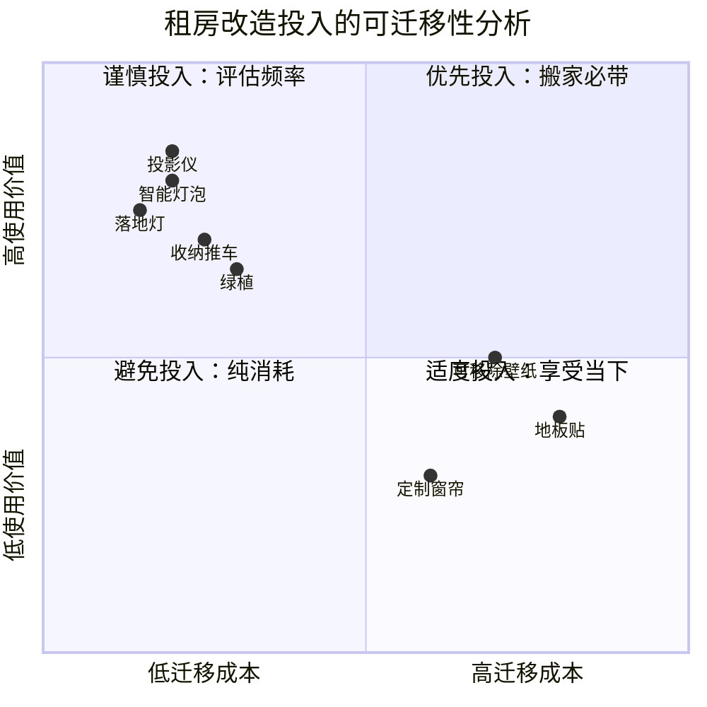

## 五、租房改造方案

租房≠将就。数据显示，中国城市租房人口已超过2亿，平均租住周期为2.3年。这意味着大多数人有将近三分之一的人生在出租屋中度过。然而，大量租客陷入一个认知陷阱：「房子不是自己的，不值得投入」。环境心理学的研究一再证实——你所处的空间直接影响情绪状态、睡眠质量、工作效率和社交意愿。一项发表在《Journal of Environmental Psychology》上的研究指出，居住者对空间的「控制感」是预测生活满意度的核心变量之一。租房改造的本质，不是装修别人的房子，而是在有限条件下夺回对生活空间的控制权。

### 5.1 租房改造的核心原则

#### 5.1.1 零损伤原则：保护性改造

零损伤是租房改造的第一铁律，但「零损伤」不等于「零投入」。关键在于理解「可逆性」——任何改动都能在退租时恢复原状，且恢复成本低于改造成本。

| 损伤等级 | 具体行为 | 后果 | 正确做法 |
|---------|---------|------|---------|
| 禁止级 | 打承重墙、改水电管线 | 违法+巨额赔偿 | 绝对不碰 |
| 高风险级 | 钻孔安装、刷漆改色 | 押金扣除+恢复费用 | 用免打孔替代 |
| 中风险级 | 贴墙纸（非可移除型）| 撕除留残胶 | 选可移除壁纸 |
| 低风险级 | 免打孔挂钩、地毯覆盖 | 基本无痕迹 | 放心使用 |

**与房东的沟通策略**：在入住前拍照记录原始状态（每个房间至少5张），与房东确认哪些改造是被允许的。部分房东对「改善性改造」持开放态度——例如更换更好的灯具、安装净水器等。将沟通结果通过微信文字确认，留作凭证。

#### 5.1.2 可迁移原则：搬家友好设计

租房改造的第二个核心原则是「可迁移」——每一件投入都应该能带走或至少不会浪费。

**可迁移性评估矩阵**：

**决策公式**：单次改造投入 ÷ 预期使用月数 ≤ 月均50元为合理范围。例如一个200元的收纳推车使用18个月，月均11元，值得投入；一套800元的地板贴只能用于当前房子，月均成本取决于租期长短。

#### 5.1.3 渐进式改造：分阶段投入

不建议一次性投入大量资金改造出租屋。采用「三阶段渐进法」：

**第一阶段（入住第1周）——基础舒适**：解决影响日常生活的硬伤——照明不足、收纳缺失、卫生死角。预算控制在500元以内。

**第二阶段（入住第1个月）——品质提升**：根据实际生活习惯调整——优化动线、增加氛围照明、改善厨房和卫生间体验。预算500-1500元。

**第三阶段（入住第2-3个月）——个性化表达**：装饰墙面、添置绿植、打造个人风格。预算500-1000元。

总投入建议控制在2000-3000元（一年期租约），月均170-250元，低于一杯咖啡的日均价。

### 5.2 空间改造实操指南

#### 5.2.1 墙面改造

出租屋的墙面通常是最让人崩溃的部分——发黄、有污渍、颜色过时、甚至发霉。墙面改造是投入产出比最高的改造项目。

**方案一：可移除壁纸（推荐指数：★★★★★）**

自粘式可移除壁纸是租房墙面改造的首选方案。选择时注意以下参数：

- **材质**：PVC材质最耐用，无纺布材质最透气（防霉），纯纸质最环保但不耐擦洗
- **宽度**：60cm宽幅最适合单人操作，45cm窄幅需要更多拼接
- **背胶**：选择「残胶可清除」型，避免「强粘型」——后者撕除时可能带掉墙皮
- **价格区间**：20-80元/平方米，建议选30-50元档位，低于20元的材质和背胶质量堪忧

**施工步骤**（以电视背景墙为例）：

1. 墙面清洁：用湿布擦除灰尘，确保完全干燥
2. 测量裁剪：量好尺寸，每边多留3-5cm余量
3. 对花裁剪：有花纹的壁纸要提前对好花型再裁剪
4. 撕底粘贴：从上往下撕开底纸，用刮板从中间向两边赶气泡
5. 接缝处理：两片壁纸重叠1-2mm，用美工刀沿直尺裁切，撕掉多余部分
6. 边角收口：用吹风机热风档吹软壁纸，使其贴合边角

**方案二：装饰画与照片墙（推荐指数：★★★★☆）**

免打孔挂画系统已经非常成熟，承重可达5-10kg，足以满足大多数装饰画需求。

| 挂画方式 | 承重能力 | 墙面损伤 | 适用墙面 | 价格 |
|---------|---------|---------|---------|------|
| 无痕钉 | 2-5kg | 极小钉孔 | 混凝土/砖墙 | 2-5元/个 |
| 3M无痕挂钩 | 1-7kg | 零损伤 | 光滑墙面 | 8-15元/组 |
| 蓝丁胶 | 0.5-1kg | 零损伤 | 所有墙面 | 10-20元/包 |
| 魔力扣 | 3-7kg | 零损伤 | 光滑/乳胶漆 | 12-25元/组 |
| 磁吸贴 | 1-3kg | 需粘贴底座 | 所有墙面 | 15-30元/套 |

**照片墙布局方案**：

- 九宫格法：3×3排列，间距统一5cm，适合正方形区域
- 走廊画廊法：沿走廊中线等距排列，适合长走廊
- 散点法：围绕中心点不规则排列，适合沙发背景墙，需要先在地上摆好再上墙
- 搁板法：安装免打孔搁板，在搁板上自由摆放相框，灵活性最高

**方案三：洞洞板（推荐指数：★★★★☆）**

洞洞板是小空间的收纳神器，兼具实用和装饰功能。

- **尺寸选择**：40×60cm适合玄关和书桌旁，60×80cm适合厨房和工作区
- **材质选择**：金属材质承重强（可达15kg），木质材质颜值高（承重约8kg），塑料材质轻便（承重约3kg）
- **安装方式**：免打孔洞洞板使用强力胶+螺丝膨胀管，承重约5-8kg；磁吸式适合贴在冰箱侧面
- **配件搭配**：S钩挂钥匙/耳机，小搁板放绿植/摆件，收纳盒放工具/文具

#### 5.2.2 地面改造

地面是出租屋第二大痛点。老旧地砖、破损地板、不搭配的颜色，都会严重影响空间美感。

**方案一：地毯覆盖（推荐指数：★★★★★）**

地毯是最安全的地面改造方案，零风险、可带走、增加舒适度。

- **客厅地毯**：尺寸建议不小于沙发宽度的2/3，前脚必须落在地毯上。材质推荐混纺（耐磨+易清洁），价格200-500元/块
- **卧室地毯**：床边毯放在床两侧，宽度比床宽多30-50cm，起床时脚踩在柔软地毯上而非冰冷地板
- **玄关地毯**：选择PVC材质或硅藻土地垫，易清洁、速干，尺寸与门宽一致
- **清洁维护**：每周用吸尘器清理一次，每3-6个月深度清洗一次，宠物家庭需要更频繁

**方案二：地板贴/地板革（推荐指数：★★★☆☆）**

地板贴能彻底改变地面视觉效果，但施工难度和风险相对较高。

- **自粘地板贴**：适合小面积（阳台、玄关），30-60元/平方米，搬家时可撕除但可能留残胶
- **锁扣式PVC地板**：免胶安装，可以整块带走，但对地面平整度要求高，80-150元/平方米
- **地板革卷材**：大面积铺设最经济，15-40元/平方米，但边缘容易翘起

**注意事项**：地板贴对原始地面的平整度和清洁度要求很高。如果原始地板有明显凹凸、翘边或潮湿，地板贴会很快起泡脱落。建议先用水平尺检查，高差超过3mm的区域需要先处理。

#### 5.2.3 照明改造

照明是改造成本最低、效果最显著的项目。大多数出租屋只有一盏惨白的吸顶灯，这种单一光源让空间毫无层次感。

**基础照明升级**：

- **智能灯泡（最推荐）**：直接替换原有灯泡，支持色温调节（2700K暖黄-6500K冷白）和亮度调节。搬家时换回原灯泡即可。推荐品牌：Yeelight、米家，价格30-80元/个
- **灯罩更换**：如果吸顶灯的灯罩发黄或过时，可以单独更换灯罩（多数吸顶灯灯罩是通用卡扣），30-60元
- **色温选择**：卧室用2700-3000K暖光（促进褪黑素分泌），书房用4000K中性光（保持专注），客厅用3000-4000K（温馨但不昏暗）

**氛围照明搭建**：

一套好的氛围照明至少包含三个层次：

1. **基础层**：吸顶灯/主灯（提供整体照明，亮度可调）
2. **功能层**：台灯/落地灯（提供局部照明，满足阅读、工作需求）
3. **氛围层**：灯带/氛围灯（提供情绪照明，营造空间层次）

**免打孔灯具推荐清单**：

| 灯具类型 | 安装方式 | 适用场景 | 价格区间 | 推荐品牌 |
|---------|---------|---------|---------|---------|
| LED灯带 | 3M背胶粘贴 | 柜底/床底/天花板边缘 | 15-60元/米 | 米家、Govee |
| 磁吸感应灯 | 磁吸/粘贴 | 衣柜内/走廊/玄关 | 20-50元/个 | 几光、倍思 |
| 夹子灯 | 夹持 | 书桌/床头/搁板 | 30-80元/个 | 宜家TERTIAL |
| 落地灯 | 直接放置 | 沙发旁/床头/角落 | 100-400元 | 宜家、良亮 |
| 台灯 | 直接放置 | 书桌/床头柜 | 80-300元 | 明基、松下 |
| 投影氛围灯 | 直接放置 | 卧室/客厅 | 50-200元 | 各品牌 |

#### 5.2.4 收纳改造

出租屋的收纳系统通常严重不足——衣柜内部格局不合理、厨房台面不够用、卫生间缺少储物空间。改造的核心思路是「向上借空间」和「向缝隙要空间」。

**玄关收纳**：

- 免打孔鞋架：选择可叠加的款式，根据鞋子数量灵活增减层数，20-60元/个
- 门后挂钩：挂包、钥匙、外套，5-20元/个
- 入门收纳推车：放快递、雨伞、口罩等出门物品，50-150元

**厨房收纳**：

- 磁吸刀架：替代传统刀座，节省台面空间，30-80元
- 水槽沥水架：利用水槽上方空间，放碗碟和洗洁精，40-100元
- 冰箱侧面磁吸收纳架：放保鲜膜、厨房纸巾、调味料，20-50元
- 橱柜分层置物架：将一层橱柜空间分为两层，15-40元/个
- 抽屉分隔盒：将杂乱的抽屉变成有序的分区，10-30元/个
- 免打孔挂杆+S钩：挂在灶台旁，挂锅铲、勺子、抹布，20-50元

**卫生间收纳**：

- 免打孔浴室置物架（三角形）：放在淋浴区墙角，放洗发水沐浴露，20-60元
- 马桶上方置物架：利用马桶上方空间，放毛巾和清洁用品，50-150元
- 镜柜收纳盒：利用镜柜内部空间，放化妆品和药品，10-30元
- 吸盘式牙刷架：挂牙刷和牙膏，保持台面清爽，10-25元

**卧室收纳**：

- 床底收纳箱：选择带滑轮的扁平款，换季衣物和被子的绝佳收纳地，30-80元/个
- 衣柜收纳格：将衣柜大空间分割成小区域，折叠衣物分类存放，20-50元
- 门后挂袋：利用门后空间收纳小物件，15-40元
- 床头挂袋：替代床头柜功能，放手机、遥控器、书籍，15-35元

#### 5.2.5 厨房改造

厨房是出租屋最容易被忽视但最值得改造的区域——你每天至少在这里花1-2小时。

**台面改造**：

- 不锈钢操作台面贴：覆盖老旧、发黄的台面，防水防油易清洁，30-80元/卷
- 灶台缝隙条：填补灶台与墙面之间的缝隙，防止油污积累，10-20元/条
- 防油贴纸：贴在灶台旁墙面，替代传统防油挡板，油污一擦即净，10-30元/张

**水槽升级**：

- 水龙头起泡器：替换原有起泡器，节水30%+水压更稳定，15-40元
- 折叠沥水篮：不用时折叠收纳，使用时展开在水槽上方，20-50元
- 下水道过滤网：防止菜渣堵塞管道，5元/包（100只）

**收纳与效率**：

- 旋转调料架：放在橱柜角落，旋转取用，告别翻找，20-60元
- 砧板架：免打孔壁挂式，晾干砧板防止发霉，15-40元
- 锅盖架：免打孔壁挂式，解决锅盖无处安放的难题，15-35元
- 垃圾袋收纳盒：粘贴在橱柜门内侧，随时抽取垃圾袋，5-15元

#### 5.2.6 卫生间深度改造

卫生间是面积最小但改造需求最密集的空间。

**干湿分离**：

如果原卫生间没有干湿分离，可以用免安装方案解决：
- 免打孔浴帘杆+浴帘：50-120元，最经济的干湿分离方案
- 挡水条（自粘式硅胶）：贴在地面分隔干湿区，20-50元
- 硅藻土地垫：放在淋浴区出口，吸水速干，30-80元

**卫生死角消除**：

- 马桶缝隙架：利用马桶与墙壁之间的缝隙空间，30-80元
- 防霉硅胶条：贴在洗手台与墙壁接缝处，防止发霉变黑，10-20元
- 下水道除臭器：硅胶密封型，阻隔下水道臭气上涌，10-25元
- 免打孔马桶刷架：落地式或壁挂式，保持马桶刷干燥不积水，20-50元

**沐浴体验升级**：

- 增压花洒：替换原有花洒，水压不足的老小区尤其推荐，50-200元
- 花洒支架（吸盘式）：可调节高度，适应不同身高，20-50元
- 恒温混水阀：解决水温忽冷忽热的问题（需确认接口兼容），100-300元

#### 5.2.7 窗户与窗帘改造

窗户处理直接影响采光、隐私和隔音，是提升居住体验的关键一环。

**窗帘更换**：

出租屋的窗帘通常是质量低劣的化纤布，遮光性差且有异味。更换窗帘是最值得的投入之一：

- **免打孔窗帘杆**：伸缩杆卡在窗框内，承重约3-5kg，适合宽度1.5m以内的窗户，20-50元
- **免打孔轨道**：3M背胶粘贴在天花板或窗框上方，承重更强，适合宽度超过1.5m的窗户，30-80元
- **窗帘选择**：卧室首选全遮光窗帘（遮光率99%），客厅选半遮光或纱帘，卫生间选防水百叶帘
- **窗帘杆位置**：尽量贴近天花板安装，视觉上拉高层高；窗帘宽度比窗户每边宽15-20cm

**隔音处理**：

如果窗户隔音差（老小区常见问题），可以用以下方案改善：
- 密封条：贴在窗框缝隙处，阻隔噪音和灰尘，10-30元/卷
- 隔音窗帘：比普通窗帘厚3-5倍，可降低噪音5-10分贝，100-400元
- 隔音膜：贴在玻璃上，降低高频噪音，50-150元/平方米

**隐私处理**：

- 磨砂玻璃贴膜：透光不透人，适合卫生间和卧室，10-30元/平方米
- 静电吸附窗花：无需胶水，可反复撕贴，适合喜欢变换风格的人，10-25元/张
- 百叶帘（免打孔）：调节光线角度灵活，适合书房和客厅，30-100元

### 5.3 租房智能化方案

智能家居是租房改造中性价比最高的投入之一——大部分智能设备搬家时直接带走，且安装简单到不需要任何工具。

#### 5.3.1 租房智能设备入门

**最低成本智能方案（200元以内）**：

1. 智能灯泡×2（卧室+客厅）：60-120元
2. 智能插座×2（控制台灯/风扇/加湿器）：40-80元

这两样东西就能实现：语音/手机控制灯光开关、定时开关电器、远程控制不在家时的设备。

**进阶智能方案（500-1000元）**：

1. 智能音箱（作为控制中枢）：100-300元
2. 智能灯泡×4（覆盖主要房间）：120-240元
3. 智能插座×3（热水器定时、路由器定时等）：60-120元
4. 人体传感器×1（走廊/玄关自动灯）：50-80元
5. 门窗传感器×1（开门联动灯光）：30-60元

**注意事项**：
- 选择同一生态系统的设备（米家/HomeKit/涂鸦），避免多APP控制
- 智能设备依赖WiFi稳定性，路由器性能不能太差
- 搬家时智能设备的配置需要重新设置，建议提前截图保存自动化规则

#### 5.3.2 租房安防方案

租房的安全隐患通常高于自有住房——你不知道之前有哪些人有钥匙，门锁的安全性也无法保证。

- **智能门锁**：替换原有门锁（保留原锁芯，搬家时换回），支持指纹/密码/临时密码，200-800元。部分房东允许更换，需提前沟通
- **门窗报警器**：粘贴式安装，异常开启时手机推送警报，20-50元/个
- **室内摄像头**：用于监控宠物或记录异常情况，注意隐私合规，100-300元
- **烟雾报警器**：粘贴式安装，尤其是厨房和卧室，20-50元/个

### 5.4 租房收纳的系统化策略

#### 5.4.1 物品精简：租房者的断舍离

租房者比房主更需要断舍离，因为每次搬家都是物品的「期末考试」。

**四象限决策法**：

| | 高情感价值 | 低情感价值 |
|---|---|---|
| **高使用频率** | 优先携带（A类） | 优先携带（A类） |
| **低使用频率** | 拍照留念后处理（C类） | 果断处理（D类） |

- **A类物品**：每天/每周使用的——衣物、厨具、电子设备、洗护用品。搬家时随身携带。
- **B类物品**：每月/每季使用的——换季衣物、运动装备、节日装饰。用统一收纳箱打包，贴好标签。
- **C类物品**：情感价值高但很少使用——旧照片、纪念品、收藏品。拍照数字化，实物存放在父母家或租用迷你仓。
- **D类物品**：半年以上没碰过且无情感价值——果断卖掉、送人或捐赠。

**「一进一出」铁律**：每购入一件新物品，必须处理掉一件同类旧物品。这条规则能有效控制物品总量。

#### 5.4.2 搬家友好收纳系统

**统一收纳箱体系**：

选择同一品牌、同一尺寸的收纳箱（建议40L和60L两个规格），好处是：
- 搬家时装车码放整齐，空间利用率最高
- 新家可以直接叠放使用，不需要重新整理
- 标签系统统一，找东西效率高

**标签系统**：

每个收纳箱外侧贴标签，标注：
- 编号（如01、02、03）
- 内容类别（如「厨房-餐具」「卧室-换季衣物」）
- 优先级（搬家时的开箱顺序：P1立即需要→P2一周内需要→P3可以先放着）

**真空压缩袋**：
- 夏季压缩冬被/羽绒服，可节省70%体积
- 选择电动抽气泵款（手动款费力且容易漏气）
- 价格：20-50元/套（含5-10个袋子+抽气泵）

### 5.5 租房改造的法律与权益

#### 5.5.1 租赁合同中的改造条款

在签署租赁合同前，务必关注以下条款：

- **改造许可范围**：明确哪些改造是被允许的，哪些是禁止的
- **恢复原状义务**：退租时是否需要恢复原状，恢复到什么程度
- **押金扣除标准**：因改造造成的损坏如何定价赔偿
- **改造成果归属**：如果你安装了一个更好的花洒，退租时能否拆走

**建议**：入住前拍摄详细的房屋现状视频（包括每个墙面、地面、门窗、水电设施），与房东共同确认并签字。这份「入住清单」是退租时避免押金纠纷的关键证据。

#### 5.5.2 退租恢复检查清单

退租前1-2周开始执行以下恢复流程：

1. **墙面**：撕除壁纸/挂钩，检查是否有残胶或钉孔，残胶用吹风机+除胶剂清除
2. **地面**：卷走地毯，清洁地板，地板贴撕除后用除胶剂清洁
3. **灯具**：换回原有灯泡和灯罩，智能灯泡取走
4. **收纳**：拆除所有免打孔置物架，清洁安装面
5. **窗帘**：换回原有窗帘，取走窗帘杆/轨道
6. **厨房/卫生间**：拆走所有后加的置物架和花洒，换回原装配件
7. **整体清洁**：全屋深度清洁一次

**时间估算**：一间30平方米的单间公寓，完整恢复需要3-5小时。两居室需要6-8小时。预留充足时间，避免退租当天手忙脚乱。

### 5.6 常见误区与纠正

#### 误区一：「租房不值得投入」

**现实**：按月均200元投入计算，一年2400元换来每天的舒适居住体验，相当于每天6.6元。这个投入换来的是更好的睡眠、更高的工作效率和更愉悦的心情——远比每天一杯奶茶划算。

**纠正方法**：用「日均成本」而非「总价」来评估改造投入。

#### 误区二：「越便宜越好」

**现实**：极低价的产品往往意味着更差的材质和更短的使用寿命。一块15元/平方米的地板贴可能3个月就翘边，而40元/平方米的能用2年。算下来后者的日均成本反而更低。

**纠正方法**：关注「使用周期内的日均成本」而非「一次性购入价格」。

#### 误区三：「先不弄，等搬家后再好好布置」

**现实**：大多数人「等搬家」等了2-3年，期间一直忍受着不舒适的居住环境。生命中每一天都是不可逆的，不值得为一个不确定的「以后」牺牲确定的「现在」。

**纠正方法**：从一个最小改造开始——今天就去买一个智能灯泡。

#### 误区四：「照搬网红方案」

**现实**：网上看到的租房改造美图通常是精心策划的营销内容，涉及的软装总价可能超过5000元，且很多产品在实际使用中并不实用。网红方案的展示面积通常在60-90平方米，与大多数租房者20-40平方米的单间完全不同。

**纠正方法**：先解决功能需求（照明、收纳、清洁），再考虑美观需求（装饰、氛围、风格）。功能改造的优先级永远高于装饰改造。

#### 误区五：「所有墙面都要改造」

**现实**：租房改造的「二八法则」——改造20%的关键墙面（电视背景墙、床头墙面），就能获得80%的视觉提升效果。全屋贴壁纸不仅成本高，搬家时恢复也更麻烦。

**纠正方法**：聚焦1-2面重点墙，其余墙面用装饰画或搁板点缀即可。

### 5.7 预算方案与真实案例

#### 5.7.1 三档预算方案

**经济方案（1000元以内）——解决刚需**：

| 项目 | 具体产品 | 预算 |
|------|---------|------|
| 照明 | 智能灯泡×2 | 80元 |
| 收纳 | 免打孔置物架×3+收纳箱×4 | 250元 |
| 卫生间 | 浴室置物架+花洒 | 150元 |
| 厨房 | 挂杆+收纳架+防油贴 | 100元 |
| 窗帘 | 遮光窗帘+免打孔杆 | 120元 |
| 地面 | 地毯（客厅+床边） | 200元 |
| 杂项 | 挂钩/密封条/滤网等 | 100元 |
| **合计** | | **1000元** |

**品质方案（2000-3000元）——舒适居住**：

在经济方案基础上增加：
- 智能音箱（150元）
- 落地灯+氛围灯带（250元）
- 可移除壁纸（300元）
- 硅藻土地垫+浴帘（100元）
- 增压花洒（150元）
- 床头挂袋+门后挂钩（50元）
- 智能插座×3（90元）
- 厨房旋转调料架+沥水架（80元）
- 桌面收纳盒+笔筒（30元）

**进阶方案（3000-5000元）——品质生活**：

在品质方案基础上增加：
- 智能门锁（500元）
- 投影仪或大尺寸显示器（1000-2000元）
- 空气净化器（500-800元）
- 人体传感器+门窗传感器（150元）
- 高品质地毯（300-500元）
- 绿植+花盆（200元）

#### 5.7.2 真实改造案例

**案例一：北京朝阳区25平方米单间**

原始状态：老旧一居室，墙面发黄，灯光昏暗，收纳几乎为零，窗帘透光严重影响睡眠。

改造投入：
- 智能灯泡×3：90元
- 可移除壁纸（电视墙5平方米）：200元
- 全遮光窗帘+免打孔轨道：150元
- 免打孔置物架×4+洞洞板×1：280元
- 床底收纳箱×2+衣柜收纳格×3：160元
- LED灯带（床底+柜底）：60元
- 地毯（1.6m×2.3m）：180元
- 浴室置物架+花洒+地垫：180元
- 厨房挂杆+收纳架+防油贴：90元
- 杂项（挂钩、密封条等）：60元
- **总计：1450元，月均120元（12个月租约）**

改造效果：睡眠质量提升（全遮光窗帘），做饭效率提升（厨房收纳），视觉空间扩大（壁纸+灯光），搬家耗时4小时恢复原状，押金全额退回。

**案例二：上海浦东40平方米一室一厅**

原始状态：装修约10年，整体尚可但缺乏生活氛围，厨房收纳严重不足，卫生间干湿不分离。

改造投入：
- 全屋智能灯泡×5+智能插座×4：320元
- 客厅氛围灯带+卧室落地灯：300元
- 可移除壁纸×2面墙：500元
- 厨房全面收纳改造：350元
- 卫生间干湿分离（浴帘+挡水条+地垫）：200元
- 窗帘更换×3扇窗：400元
- 客厅地毯+卧室地毯：350元
- 智能音箱+人体传感器：250元
- 装饰画×5+搁板×2：300元
- 绿植×5+花盆：200元
- **总计：3170元，月均264元（12个月租约）**

改造效果：整体氛围质的飞跃，朋友来访时以为换了新房子。厨房收纳效率提升60%。搬家时全部改造在8小时内恢复，押金无扣。

### 5.8 改造效果评估

改造完成后，用以下标准自测改造是否成功：

- [ ] 每个房间的照明显色指数（CRI）≥80，无频闪
- [ ] 常用物品能在30秒内找到
- [ ] 卧室关闭所有光源后几乎完全黑暗
- [ ] 厨房操作台面有至少60cm的空闲区域
- [ ] 卫生间地面在洗澡后5分钟内基本干燥
- [ ] 进门后钥匙、包、外套各有固定存放位置
- [ ] 每件改造物品都能在30分钟内拆卸打包
- [ ] 整体改造投入的月均成本低于个人月收入的3%

如果以上8项全部达标，说明你的租房改造是成功的——它既提升了生活品质，又没有过度投入，且搬家时不会成为负担。
