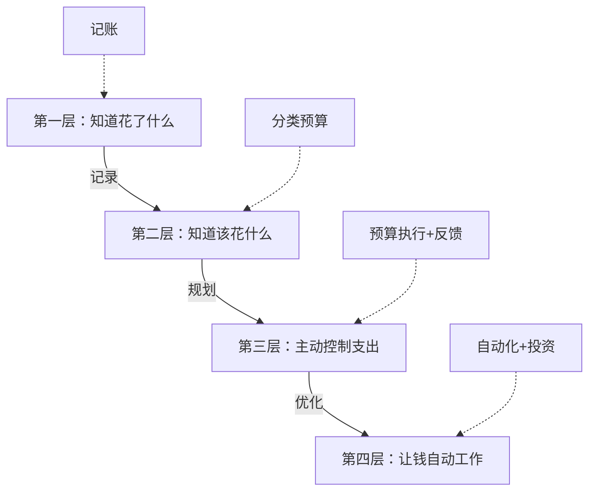
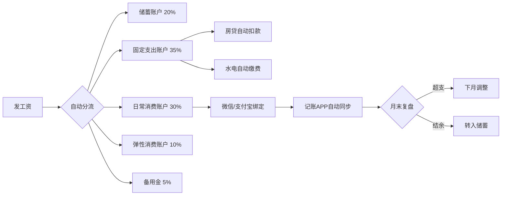
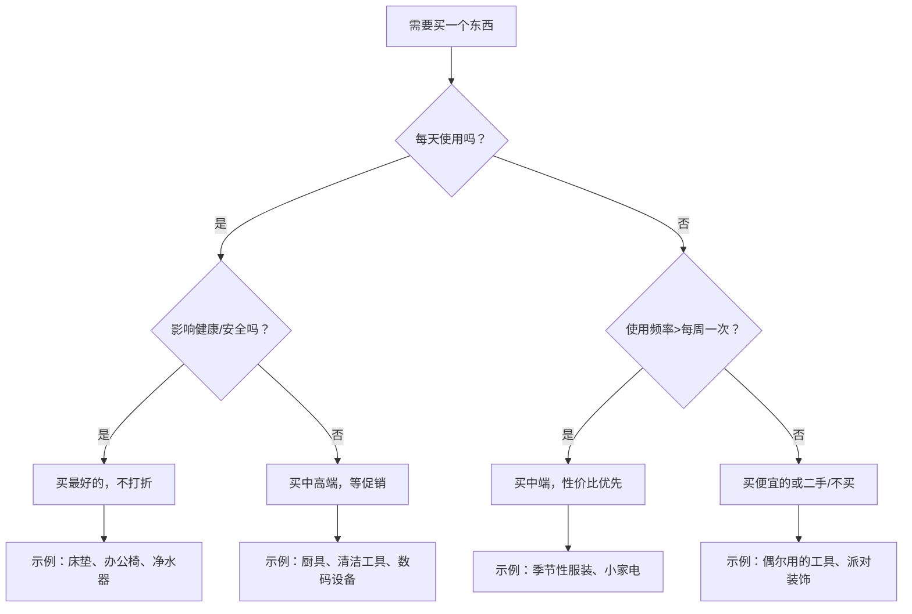

## 六、家庭预算管理

家庭预算管理不是"记账"那么简单，它是一套从**收入认知→支出分类→预算编制→执行监控→复盘优化**的完整财务系统。根据中国人民银行2024年发布的《城镇居民家庭资产负债调查》，中国家庭平均负债率已达56.5%，其中房贷占大头。没有预算管理的家庭，往往陷入"月光→焦虑→冲动消费→更大焦虑"的恶性循环。本节将从底层原理出发，手把手构建一套可落地、可坚持、可进阶的家庭预算体系。

### 6.1 预算管理的底层原理

#### 6.1.1 为什么大多数人坚持不了记账？

行为经济学家丹·艾瑞里在《怪诞行为学》中揭示了一个核心矛盾：人类对"即时满足"的偏好远远强于"远期收益"。记账本身不产生即时快感，反而暴露消费中的不适，导致大多数人坚持不了两周就放弃。

这背后有三个心理机制：

| 心理机制 | 表现 | 应对策略 |
|---------|------|---------|
| **现状偏见** | "我一直这样花钱，没必要改" | 用数据说话：算出一年的总支出，很多人会震惊 |
| **沉没成本谬误** | "已经花了这么多了，继续花吧" | 设定每个类别的硬上限，花完即停 |
| **心理账户效应** | 奖金当"意外之财"随意挥霍 | 所有收入统一管理，不区分"工资"和"奖金" |

理解这些心理机制，才能设计出**反人性但有效**的预算系统——不是靠意志力硬撑，而是用机制约束行为。

#### 6.1.2 预算管理的四个层次

- **第一层（记账）**：知道钱花在哪里了，这是基础中的基础
- **第二层（分类预算）**：给每个支出类别设定额度，有了"该花多少"的标准
- **第三层（主动控制）**：在消费前先检查预算余额，形成"花钱前先想一想"的习惯
- **第四层（自动化）**：工资到账自动分流到不同账户，投资定投自动执行，预算系统运行在"自动驾驶"模式

大多数人卡在第一层，少数人到了第二层。本节的目标是帮你建立第四层的系统。

### 6.2 收入全景评估

在讨论"怎么花"之前，先要搞清楚"有多少可以花"。

#### 6.2.1 家庭收入分类

| 收入类型 | 示例 | 稳定性 | 预算处理方式 |
|---------|------|--------|------------|
| **固定收入** | 工资、公积金、固定租金 | 高 | 预算编制的主要依据 |
| **浮动收入** | 年终奖、项目奖金、兼职 | 中 | 按70%估算，多出部分进储蓄 |
| **被动收入** | 理财收益、股息、版税 | 低 | 单独记账，不纳入日常预算 |
| **一次性收入** | 偶然所得、退税、退款 | 极低 | 全额进储蓄，不纳入预算 |

**关键原则**：用最保守的收入数字做预算。如果你的月薪在8000-12000之间浮动，按8000做预算。这样即使收入降到最低，预算也不会崩溃。

#### 6.2.2 可支配收入计算

可支配收入 = 税后收入 - 强制储蓄 - 固定支出

以一个典型的二线城市双职工家庭为例：

家庭月收入（税后）：     18,000 元
- 强制储蓄（20%）：      3,600 元
- 房贷：                 5,000 元
- 车贷：                 2,000 元
- 物业费：                 350 元
- 水电燃气：               300 元
- 通信网络：               200 元
= 可支配收入：           6,550 元

这6550元才是你真正可以"自由安排"的钱——包括食品、交通、娱乐、衣物、人情往来等所有弹性支出。很多人的误区是把月入18000当成"可以花18000"，最终必然超支。

### 6.3 预算编制方法论

#### 6.3.1 五种主流预算方法对比

| 方法 | 原理 | 优点 | 缺点 | 适合人群 |
|------|------|------|------|---------|
| **50/30/20法则** | 50%必需/30%弹性/20%储蓄 | 简单易行，入门友好 | 比例固定，不够灵活 | 刚开始预算管理的新手 |
| **零基预算法** | 每一分钱都要有去处，收入-支出=0 | 精确控制每分钱 | 耗时较长，需要高度自律 | 收入不固定或想精细管理的人 |
| **信封法** | 现金分装到物理/虚拟信封 | 视觉化强，花完即停 | 不适合电子支付时代 | 消费冲动控制力弱的人 |
| **反向预算法** | 先储蓄，剩下的才是消费 | 储蓄优先，保证积累 | 可能压缩生活品质 | 有明确储蓄目标的人 |
| **60%解决方案** | 60%固定开支，40%自由分配 | 比50/30/20更灵活 | 固定/弹性边界模糊 | 收入较高、固定支出少的人 |

**推荐方案**：新手从50/30/20入手，3个月后切换到零基预算法。零基预算虽然更耗时，但精确度最高，是唯一能真正回答"我的钱去哪了"的方法。

#### 6.3.2 零基预算法实操

零基预算的核心公式：

收入 - 支出 - 储蓄 - 还债 = 0

每月初，把所有收入分配到以下桶中，直到全部分配完毕：

**第一步：列出所有支出类别**

固定支出桶：
├── 房贷/房租：_____元
├── 车贷：_____元
├── 物业费：_____元
├── 水电燃气：_____元（取近6个月平均值）
├── 通信费：_____元
├── 保险：_____元
└── 固定支出合计：_____元

弹性支出桶：
├── 食品（含食材+外食）：_____元
├── 交通（公交/地铁/油费）：_____元
├── 日用品：_____元
├── 服装鞋帽：_____元
├── 医疗健康：_____元
├── 教育培训：_____元
├── 娱乐休闲：_____元
├── 人情往来：_____元
├── 其他弹性：_____元
└── 弹性支出合计：_____元

储蓄与投资桶：
├── 应急基金：_____元
├── 短期目标（旅行/家电）：_____元
├── 长期投资（基金定投）：_____元
├── 养老金补充：_____元
└── 储蓄投资合计：_____元

还债桶：
├── 信用卡分期：_____元
├── 消费贷：_____元
└── 还债合计：_____元

总计：收入 = 固定支出 + 弹性支出 + 储蓄投资 + 还债 = 0 ✓

**第二步：给每个类别设置上限**

不要用"大约"，要用具体数字。参考近3个月的实际支出数据，取平均值后下调10%作为初始上限。

**第三步：建立"预算调整"机制**

每月末复盘时，允许在类别之间调剂——餐饮超支200元，就从娱乐预算中扣除200元。但**总预算不能超**。

#### 6.3.3 信封法的数字化改造

传统信封法用现金分装，但在移动支付时代已不实用。以下是数字化信封方案：

**方案一：多账户法**

在银行开设多个子账户（现在很多银行支持），每个账户对应一个预算类别：

工资卡（总入口）
├── 储蓄账户（自动转入，发工资当天执行）
├── 固定支出账户（房贷自动扣款绑定此卡）
├── 日常消费账户（绑定微信/支付宝）
├── 弹性消费账户（绑定另一张卡）
└── 备用金账户（应急用，平时不动）

**方案二：APP信封法**

使用支持预算分类的记账APP（详见6.5节），在APP中创建虚拟信封。每次记账时自动从对应信封扣减余额，信封归零后该类别自动锁死。

### 6.4 支出分类与优化策略

#### 6.4.1 居住支出（建议占比：25-35%）

居住支出是家庭最大的单一开支，也是优化空间最大的领域。

**房贷优化**：
- 如果公积金贷款额度没用完，优先使用公积金贷款（利率约3.1% vs 商贷4.2%以上）
- 等额本息 vs 等额本金：等额本金总利息更少，但前期月供压力大。收入稳定增长的家庭选等额本金
- 提前还贷时机：如果你的投资收益率低于房贷利率，提前还贷是合理的
- 转贷机会：当LPR下降后，存量房贷利率可以协商调整

**租房优化**：
- 租金超过收入30%时应考虑换房或合租
- 签长约（2年以上）通常可以谈到更低的租金
- 避开中介费：直接找房东（闲鱼、豆瓣小组、小区公告栏）
- 租金谈判筹码：一次性付半年/年租、主动承担小维修

**水电燃气优化**：

| 项目 | 常见浪费 | 优化方案 | 月均节省 |
|------|---------|---------|---------|
| 电费 | 待机耗电、老旧电器 | 拔插头/用智能插座、阶梯电价意识 | 30-80元 |
| 水费 | 长流水洗菜、旧马桶 | 改装节水器、一水多用 | 15-30元 |
| 燃气 | 大火烧水、不盖锅盖 | 用高压锅、匹配锅底炉头大小 | 10-25元 |
| 冬季取暖 | 空调制热效率低 | 电热毯+暖风机局部供暖替代全屋制暖 | 100-200元 |

#### 6.4.2 食品支出（建议占比：15-25%）

食品支出是第二大开支，也是最容易超支的类别。

**食材采购优化**：

1. **周计划法**：每周日规划下一周7天的菜谱，根据菜谱列购物清单。这一步能让食材浪费减少40%以上
2. **季节性采购**：当季蔬菜水果价格通常比反季便宜50-70%。例如冬天的白萝卜0.5元/斤，夏天要2元/斤
3. **批发 vs 零售**：肉类在批发市场买（整块分割冷冻），比超市散装便宜30-40%
4. **社区团购**：美团优选、多多买菜等社区团购平台，生鲜价格通常比超市低20-30%

**外食控制**：
- 设定每月外食次数上限（建议4-6次）
- 外食预算单独设立，不与食材预算混用
- 利用信用卡/美团优惠券，每次外食节省15-30%
- 工作日午餐带饭，每天比外卖省15-25元，一个月省300-500元

**食品浪费成本**：

根据中国科学院2023年发布的数据，中国城市家庭平均每年浪费食物约16%，折合人民币约3000-5000元。解决食品浪费就是最直接的"省钱"：

减少食品浪费四步法：
1. 买之前：检查冰箱和储物柜，避免重复购买
2. 买的时候：遵循"先进先出"原则，新买的放后面
3. 存的时候：标注购买日期和保质期，冷冻分装
4. 吃的时候：剩菜改造（剩饭→炒饭、剩菜→馅料）

#### 6.4.3 交通出行（建议占比：5-10%）

| 出行方式 | 月均成本 | 适合场景 |
|---------|---------|---------|
| 公交地铁 | 200-400元 | 通勤距离<15km，有直达线路 |
| 电动车 | 50-100元（电费） | 通勤距离<10km，充电方便 |
| 自行车 | 0元（后续） | 通勤距离<5km |
| 自驾（油车） | 1500-2500元 | 通勤距离远、需接送家人 |
| 自驾（电车） | 300-600元 | 有家充桩，通勤距离任意 |
| 拼车/顺风车 | 500-800元 | 通勤路线固定，有同行人 |

**购车的隐性成本**（很多人忽略）：
购车后每月固定支出：
保险（分摊）：    400-800元
停车费：         300-800元（小区+公司）
保养维修（分摊）：100-300元
折旧（分摊）：    800-2000元（第一年最猛）
洗车美容：       50-100元
违章罚款（分摊）：50-100元
──────────────────────────
隐性固定成本：    1700-4100元/月（不含油费/电费）

如果每月交通预算不足3000元，购车反而会让交通支出翻3-5倍。在有完善公共交通的城市，不买车可能是一年内最大的"理财收益"。

#### 6.4.4 日用品与消耗品（建议占比：5-8%）

日用品的"省钱陷阱"是囤货——看到打折就买，结果过期了、用不完、占空间。

**正确的囤货策略**：

只囤以下条件全部满足的物品：
✓ 保质期>6个月
✓ 消耗速度明确（能算出多长时间用完）
✓ 打折力度>30%（否则不值得占资金和空间）
✓ 存储空间足够

**DIY清洁用品配方**（年省300-500元）：

- **万能清洁剂**：白醋+水（1:1），适用于台面、玻璃、水龙头
- **下水道疏通**：小苏打半杯+白醋半杯，等15分钟后冲热水
- **除霉剂**：白醋原液喷洒，静置1小时后擦拭
- **空气清新**：柠檬皮+白醋浸泡两周，过滤后装入喷瓶

#### 6.4.5 人情往来（建议占比：3-8%）

人情支出是中国家庭特有的"隐性大支出"，很多人不好意思记录或控制，但它往往是弹性支出超支的主因。

**建立人情预算制度**：

1. **年度总预算法**：年初统计全年预计的红白事（婚宴、满月、生日、节日），设置年度总预算
2. **单次上限**：根据亲疏关系设定不同档位
   - 直系亲属：1000-2000元
   - 亲密朋友：500-1000元
   - 普通朋友/同事：200-500元
   - 点头之交：100-200元
3. **婉拒不必要的人情**：关系淡薄的邀请，可以婉言谢绝或只随份子不出席

### 6.5 工具推荐与数字化管理

#### 6.5.1 记账APP选型

| APP | 核心功能 | 费用 | 适合人群 |
|-----|---------|------|---------|
| **随手记** | 多账本、预算管理、报表丰富 | 基础免费，高级版12元/月 | 想要完整功能的用户 |
| **钱迹** | 极简记账、无广告、本地存储 | 一次性买断18元 | 讨厌广告、注重隐私的用户 |
| **MoneyThings** | 精美界面、智能分类 | 免费+内购 | iOS用户，颜值党 |
| **挖财** | 理财+记账一体 | 免费 | 想兼顾理财和记账的用户 |
| **腾讯自选股+微信记账** | 微信生态整合 | 免费 | 深度微信用户 |

**选型建议**：不要花太多时间在选APP上。选一个能自动导入微信/支付宝账单的APP，手动录入的坚持成本太高。

#### 6.5.2 预算管理的数字化工作流

**自动化设置清单**：

工资到账当天自动执行：
□ 转账至储蓄账户：___元（建议设为工资的20%）
□ 转账至固定支出账户：___元
□ 转账至日常消费账户：___元
□ 基金定投扣款：___元
□ 房贷/房租扣款：___元

设置方法：
- 银行APP→自动转账→设置触发日期和金额
- 支付宝→基金定投→设置扣款日期
- 微信→生活缴费→开通自动缴费

### 6.6 应急基金管理

#### 6.6.1 为什么必须有应急基金？

应急基金是家庭财务的"安全气囊"。没有它，任何突发支出（失业、疾病、意外维修）都会逼你借债或变卖资产。

**应急基金的目标金额**：

应急基金 = 月均必要支出 × N个月

N的取值：
- 单收入家庭：N = 6-9
- 双收入家庭：N = 3-6
- 自由职业/收入不稳定：N = 9-12
- 有慢性病家庭成员：N = 6-12

以月必要支出6000元的双收入家庭为例，应急基金目标为18000-36000元。

#### 6.6.2 应急基金怎么存？

大多数人的错误：把应急基金存在活期账户（年化0.2%），或者根本不存。

**正确做法**：阶梯存款法

假设目标应急基金：30,000元

阶梯1（即时可用）：5,000元 → 货币基金（年化2%左右，T+0可取）
阶梯2（3个月可用）：10,000元 → 3个月定期/短期理财
阶梯3（6个月可用）：15,000元 → 6个月定期/大额存单

每月存入：先填满阶梯1 → 再填阶梯2 → 最后阶梯3

**应急基金的使用规则**：
- 只用于真正的紧急情况：失业、重大疾病、房屋重大维修
- **不用于**：促销打折、旅行、"借一下马上还"
- 使用后必须在3个月内补回

### 6.7 债务管理与预算整合

#### 6.7.1 债务的分类

| 债务类型 | 利率范围 | 紧急程度 | 处理策略 |
|---------|---------|---------|---------|
| 信用卡循环 | 15-18% | **最紧急** | 立即全额还清或转分期 |
| 网贷/消费贷 | 8-24% | 高 | 集中火力优先偿还 |
| 车贷 | 4-8% | 中 | 按期还款，不提前还（利率低的话） |
| 房贷 | 3-5% | 低 | 按期还款，利率下降时考虑转贷 |
| 亲友借款 | 0% | 看关系 | 按约定还款，维护关系 |

#### 6.7.2 债务偿还策略

**雪崩法（推荐）**：先还利率最高的债务

步骤：
1. 列出所有债务的利率
2. 除最低还款额外，所有可动用资金集中还利率最高的那笔
3. 利率最高的还完后，资金转入第二高的
4. 重复直到全部还清

示例：
信用卡欠款 20,000元（利率18%）→ 优先还
消费贷 15,000元（利率12%）→ 第二还
车贷 80,000元（利率5%）→ 最后还

**雪球法**：先还余额最小的债务（适合需要正反馈激励的人）

两种方法的区别不在于数学最优，而在于心理驱动力。如果你能坚持，选雪崩法省利息更多；如果你需要"小胜利"来维持动力，选雪球法。

### 6.8 家居投资决策框架

#### 6.8.1 "买贵还是买便宜"决策树

很多预算问题的本质是：这个东西到底该花多少钱？

#### 6.8.2 家居物品的成本效益分析

不是所有"省钱"都是真的省——买便宜的坏了再买，可能比直接买贵的更花钱。

**单次使用成本公式**：

单次使用成本 = 购买价格 ÷ 预计使用次数

示例：吸尘器
- 便宜款：400元，寿命2年（每天用）→ 400÷730 = 0.55元/次
- 中端款：1200元，寿命5年 → 1200÷1825 = 0.66元/次
- 高端款：3000元，寿命8年 → 3000÷2920 = 1.03元/次

但高端款省时间（吸力强，一次搞定）、省心（不坏）、对健康更好（过滤精度高）
→ 综合成本可能反而最低

**值得投资的家居物品清单**：

| 类别 | 物品 | 建议投入 | 投资理由 |
|------|------|---------|---------|
| 睡眠 | 床垫 | 3000-8000元 | 影响每天1/3的时间质量 |
| 睡眠 | 枕头 | 200-600元 | 直接影响颈椎和睡眠 |
| 工作 | 办公椅 | 1500-4000元 | 久坐者的脊椎保险 |
| 工作 | 显示器 | 1500-3000元 | 眼睛保护，每天面对8小时 |
| 健康 | 净水器 | 1000-3000元 | 饮用水安全，长期健康 |
| 健康 | 空气净化器 | 1500-4000元 | 呼吸健康，尤其北方城市 |
| 厨房 | 一把好刀 | 300-800元 | 做饭效率和安全性 |
| 厨房 | 一口好锅 | 300-800元 | 烹饪效果和耐用性 |
| 清洁 | 无线吸尘器 | 1000-2500元 | 大幅降低清洁时间和痛苦 |

**不值得投资的物品**：
- 面包机/酸奶机/榨汁机（使用频率远低于预期，大多数人闲置率>80%）
- 扫地机器人（清洁力不如吸尘器，维护成本高，适合辅助不能替代）
- 投影仪（除非真的不看电视，否则使用率极低）
- 各种"网红"厨房小家电（三明治机、华夫饼机、空气炸锅——先问自己：你真的会用吗？）

### 6.9 季节性预算管理

家庭支出不是均匀的，节假日、换季、开学等时点会造成支出高峰。提前规划才能避免"节日后吃土"。

#### 6.9.1 年度支出日历

月份    高峰支出项                      建议预留
────────────────────────────────────────────────
1月     春节（年货、红包、聚餐）          5000-15000元
2月     春节余波、开学季                  2000-5000元
3月     换季衣物、春游                    1000-3000元
4月     清明出行                          500-1000元
5月     五一出行、婚宴高峰                2000-5000元
6月     618购物节（理性！）               1000-3000元
7月     暑假活动、儿童培训                3000-8000元
8月     暑假收尾、开学准备                2000-5000元
9月     中秋、婚宴高峰                    2000-5000元
10月    国庆出行                          3000-8000元
11月    双十一（理性！）                  1000-3000元
12月    年末体检、保险续费                2000-5000元
────────────────────────────────────────────────
年度峰值支出总计：约25,000-73,000元
月均摊薄：约2,000-6,000元（需提前按月存储）

**应对策略**：设立"季节性支出基金"，每月存入年度峰值总额的1/12。例如春节预计花8000元，那从2月开始每月存700元到一个专门账户，到次年1月刚好够用。

### 6.10 预算复盘与持续优化

#### 6.10.1 月度复盘流程

每月最后一天或次月第一天，花15-30分钟做以下复盘：

月度预算复盘清单：

1. 总收支对比
   - 本月总收入：_____元
   - 本月总支出：_____元
   - 结余/超支：_____元

2. 各类别对比（预算 vs 实际）
   - 固定支出：预算_____ vs 实际_____ → 差异_____
   - 食品：预算_____ vs 实际_____ → 差异_____
   - 交通：预算_____ vs 实际_____ → 差异_____
   - 娱乐：预算_____ vs 实际_____ → 差异_____
   - 人情：预算_____ vs 实际_____ → 差异_____
   - 其他：预算_____ vs 实际_____ → 差异_____

3. 异常分析
   - 本月最大一笔非必要支出是什么？_____元，是否值得？
   - 有哪些"不知道怎么就花了"的钱？
   - 下月有哪些已知的大额支出？

4. 下月调整
   - 哪些类别需要增加/减少预算？
   - 有什么消费习惯需要改变？

#### 6.10.2 年度财务健康检查

每年年底做一次全面的财务体检：

- **资产负债表**：列出所有资产（存款、投资、房产、车辆净值）和所有负债（房贷余额、车贷余额、信用卡欠款），计算净资产
- **储蓄率**：全年储蓄总额 ÷ 全年总收入。目标≥20%
- **应急基金覆盖率**：应急基金 ÷ 月均必要支出。目标≥3个月
- **负债收入比**：月还款总额 ÷ 月收入。红线是50%，健康值<30%
- **保险覆盖率**：是否覆盖了重大风险（重疾、意外、身故）

### 6.11 常见误区与纠正

#### 误区一："我收入太低，没资格做预算"

**纠正**：收入越低，越需要预算。月入5000元的人比月入50000元的人更不能承受一次意外支出。预算不是"有钱人的游戏"，它是"不让钱消失的工具"。

#### 误区二："记账太麻烦了，坚持不了"

**纠正**：不要追求100%精确的记账。能做到以下"80分"就够了：
- 大额支出（>100元）每一笔都记
- 小额支出按天汇总记一个总数
- 月底花10分钟对一次账
- 用自动导入功能代替手动录入

#### 误区三："省小钱没用，应该去赚大钱"

**纠正**：这是一个虚假的二选一。省钱和赚钱不矛盾。而且，每天省20元（少点一次外卖），一年就是7300元。7300元在年化8%的基金里，10年后变成约15.8万元。小钱的复利效应是巨大的。

#### 误区四："预算就是少花钱、降低生活质量"

**纠正**：预算不是限制花钱，是**把钱花在更值得的地方**。当你的娱乐预算固定为每月1000元时，你会更慎重地选择——看一场好电影，而不是刷三部烂片。预算提升了花钱的质量，而不是降低了生活品质。

#### 误区五："夫妻AA制管钱最好"

**纠正**：完全AA制在长期关系中容易产生疏离感。推荐"联合+个人"模式：
- 设立共同账户：双方按收入比例存入，用于家庭共同开支（房贷、食品、孩子教育等）
- 保留个人账户：各自自由支配，互不干涉
- 定期（每季度）坐下来一起审视家庭总账

#### 误区六："大促必囤货"

**纠正**：大促的"便宜"很多时候是幻觉。很多商家先涨价再打折，实际折扣很小。而且囤货占用资金和空间。建议：
- 提前1个月把想买的东西加入购物车，记录当前价格
- 大促当天对比，真正降价才买
- 只买已经在计划内的物品，不因为"便宜"而买计划外的

### 6.12 进阶：从预算管理到财富增长

当你的预算系统稳定运行6个月以上，可以开始考虑更高阶的策略。

#### 6.12.1 资产配置入门

在应急基金充足（≥6个月）且无高息负债的前提下，可以将储蓄的一部分投入投资：

新手资产配置建议（月投2000元为例）：

稳健层（60%，1200元）：
- 货币基金：400元（流动性）
- 债券基金：800元（稳定收益）

增长层（30%，600元）：
- 沪深300指数基金：300元
- 中证500指数基金：300元

探索层（10%，200元）：
- 了解其他投资品种，小额试水

**核心原则**：不懂的东西不投。在你没有花50小时以上学习某个投资品种之前，不要把钱投进去。

#### 6.12.2 财务独立的计算

财务独立（Financial Independence）的核心公式：

财务独立目标 = 年支出 × 25

示例：
年支出12万 → 财务独立目标 = 300万
年支出20万 → 财务独立目标 = 500万

原理：300万按年化4%提取 = 12万/年，刚好覆盖年支出
这就是著名的"4%法则"（来自Trinity Study）

预算管理的终极目标，不是让你一辈子省钱，而是让你清楚地知道"自由"的数字是多少，然后有计划地去实现它。

---

**本节小结**：

家庭预算管理是一个从"知道花了什么"到"让钱自动工作"的渐进过程。核心要素包括：保守估算收入、用零基预算法精确分配每一分钱、按居住/食品/交通/日用品/人情五大类别优化支出、建立3-6个月的应急基金、通过自动化减少执行成本、每月复盘持续优化。记住，预算的目的不是省钱，而是**让每一分钱都花在你真正认为值得的地方**。
