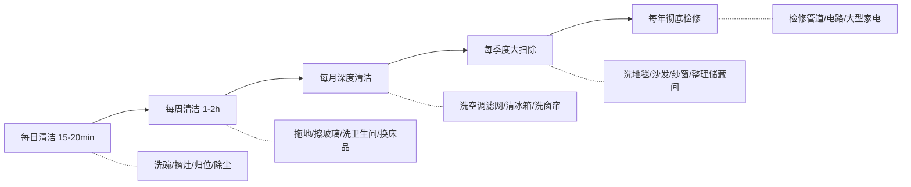
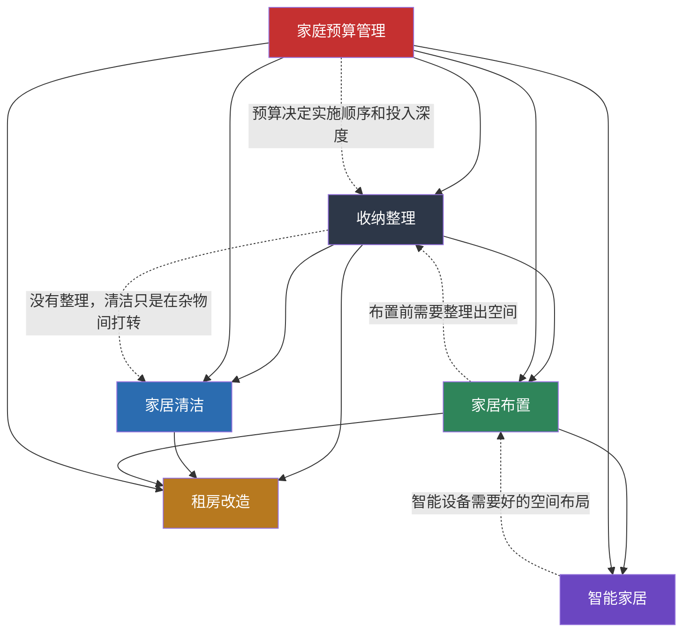

## 七、本节小结

"具体方案"是家居生活章节中"术"的层面——把基础理论中环境心理学、极简主义、收纳整理理论、家居美学、智能家居技术和生活品质理论这六大理论支柱，转化为可以直接动手执行的操作流程。本节共涵盖六大方案：收纳整理、家居清洁、家居布置、智能家居、租房改造和家庭预算管理。

本小结的目标不是简单重复各方案的要点，而是帮你把六套方案串联成一个可执行的整体系统，让你理解各方案之间的逻辑关系，并提供一套"拿来就用"的行动框架。

### 7.1 六大方案核心要点回顾

#### 收纳整理：先减少，再归位

收纳整理方案是整个具体方案体系的起点。它的核心逻辑用一句话概括：**先做减法（断舍离），再做加法（归位系统）**。任何跳过"减"直接"收"的行为，都是在用收纳工具制造新的杂乱。

方案从"道"的层面解释了囤积的心理根源——损失厌恶、沉没成本谬误、情感依附——然后在"法"的层面给出断舍离的具体判断标准，在"术"的层面提供了完整的四步整理流程：

| 步骤 | 操作 | 关键原则 |
|------|------|---------|
| 第一步：全部取出 | 把该类别物品全部摊开 | 不看不知道一买吓一跳 |
| 第二步：逐一筛选 | 用"需要/喜欢/适合"三标准判断 | 一年没用过的默认淘汰 |
| 第三步：分类归位 | 按使用频率+使用场景定位 | 高频物品放在黄金区域（腰部到视线高度） |
| 第四步：建立维持 | 设定"一进一出"规则 | 没有维持系统，整理3个月后打回原形 |

方案还覆盖了六大收纳流派（KonMari、Swedish Death Cleaning、Container Store、无印良品、宜家、DIY极简），每种流派的适用人群和核心理念都有详细对比，方便读者选择适合自己的方法论。

#### 家居清洁：科学节奏 + 高效工具

清洁方案的核心创新在于引入了**清洁的化学原理**——表面活性剂的亲水端/疏水端机制、pH值对应的清洁对象、氧化还原反应的杀菌原理——让你理解"为什么这样清洁"而不是机械地"照做"。

方案建立了一套分层清洁节奏：

五条清洁铁律是整套方案的骨架：从上到下、从里到外、从干到湿、先清后消、定期轮换。每条铁律背后都有科学依据——比如"从上到下"是因为灰尘受重力影响向下沉降，如果先拖地再擦架子，架子上的灰尘会落到刚拖过的地面上。

方案还提供了四大区域（厨房、卫生间、卧室、客厅）的深度清洁方案，每个区域都包含：常见污染类型、对应的清洁剂选择（含DIY配方）、工具推荐、操作步骤和注意事项。

#### 家居布置：动线 + 分区 + 美学

布置方案的核心是**用空间关系思维取代物品堆砌思维**。它不是"买什么好看的家具"，而是"怎么让空间为生活服务"。

三个核心设计维度：

| 维度 | 核心问题 | 方法论 |
|------|---------|--------|
| 动线设计 | 在家走来走去顺不顺畅？ | 三类动线（家务/生活/访客）识别 + 五条动线原则 |
| 功能分区 | 每个区域的用途清晰吗？ | 四大分区原则 + 按户型分策略（60㎡以下/60-120㎡/120㎡以上） |
| 美学层次 | 眼睛住得舒服吗？ | 60-30-10色彩法则 + 三层照明体系 + 自然元素引入 |

方案特别强调了照明设计的重要性——大多数人家里只有一个主灯，导致空间扁平、缺乏氛围。三层照明体系（基础照明 + 氛围照明 + 功能照明）是提升空间品质感最快、成本最低的方式。一盏150元的落地灯带来的改变，可能比花5000元换一套沙发还大。

#### 智能家居：需求驱动，分步实施

智能家居方案从一开始就纠正了一个常见误区：**不要为了"智能"而智能，要从真实需求出发**。

方案提供了完整的搭建方法论：需求评估→方案设计→分步实施→持续优化。核心是"需求→方案→实施"三步法，每一步都有具体的检查清单。

方案覆盖了六大空间（玄关、客厅、卧室、厨房、卫生间、阳台）的智能化方案，每个空间都给出了：核心需求分析、推荐设备清单、预算估算、自动化场景设计。比如卧室方案不仅包括智能灯光和窗帘，还涉及睡眠监测、晨起唤醒、空气质量监测等与睡眠质量直接相关的自动化场景。

三种搭建路径的对比让读者可以根据自己的技术能力和预算做出选择：

| 路径 | 代表方案 | 投入成本 | 技术门槛 | 适合人群 |
|------|---------|---------|---------|---------|
| 入门路径 | 小米米家全家桶 | 2000-5000元 | ★☆☆☆☆ | 大多数人 |
| 品质路径 | 苹果HomeKit + Aqara | 3000-8000元 | ★★☆☆☆ | 苹果用户 |
| 极客路径 | Home Assistant自建 | 1000-5000元（不含时间） | ★★★★☆ | 技术爱好者 |

#### 租房改造：可逆、低成本、高回报

租房改造方案解决的是"房子不是我的，但生活是我的"这个核心矛盾。方案围绕三个原则展开：

- **可逆原则**：所有改造必须能在退租时完全恢复原状
- **投入产出比优先**：每一分钱花在改变最大的地方
- **个性化适配**：根据租期长短决定投入深度

方案给出了具体的低成本改造方案清单：免钉挂钩替代打孔、自粘墙纸改变墙面、磁吸灯带不用布线、可移动家具跟随搬家。重点投入三个方向：遮光窗帘（200元以内，睡眠质量直接翻倍）、氛围灯光（100元以内，空间情绪彻底改变）、绿植（50元以内，生命感和新鲜感）。

#### 家庭预算管理：聪明花钱，不花冤枉钱

预算管理方案的核心理念是：**提升家居品质不等于花更多钱，而等于把钱花对地方**。

方案提供了完整的预算规划框架，按优先级排序：

| 优先级 | 投入方向 | 每日使用时长 | 理由 |
|--------|---------|-------------|------|
| ★★★★★ | 床垫枕头 | 7-8小时 | 每小时成本最低的品质投资 |
| ★★★★★ | 办公椅 | 6-8小时 | 久坐人群的脊椎保护 |
| ★★★★☆ | 厨房核心工具 | 1-2小时 | 好锅好刀提升烹饪意愿 |
| ★★★★☆ | 照明系统 | 全天 | 影响全天情绪和效率 |
| ★★★☆☆ | 收纳系统 | 全天 | 间接提升所有空间使用效率 |
| ★★☆☆☆ | 装饰品 | 不定 | 锦上添花，非必需 |

"单次使用成本"是最实用的决策工具：一个300元用5年（1825天）的铸铁锅，单次使用成本0.16元；一个50元用半年（180天）的不粘锅，单次使用成本0.28元。看似便宜的东西，长期算下来反而更贵。

### 7.2 六大方案的内在逻辑关系

六套方案不是孤立的，它们之间存在清晰的依赖和协同关系：

**关键依赖链**：

1. **收纳整理是一切的起点**——不先做断舍离，后面的清洁只是在杂物间打转，布置只是在摆设空壳，智能家居只是在堆砌设备。
2. **家居清洁是维护层面**——整理解决的是"物品在哪里"，清洁解决的是"空间是否卫生"。两者互补：一个干净但杂乱的家让人焦虑，一个整洁但肮脏的家让人恶心。
3. **家居布置是空间层面**——它建立在整理和清洁的基础上，解决的是"空间是否舒适、美观、高效"。
4. **智能家居是效率层面**——它用技术手段自动化重复性操作，降低维护成本。但前提是你已经有清晰的空间布局，否则智能设备只是在制造新的混乱。
5. **租房改造是场景适配**——它把前四种方案的核心技巧应用到"非自有住房"这个特殊约束下，做减法、做可逆改造。
6. **家庭预算管理贯穿始终**——它决定每个方案的实施顺序、投入深度和资源分配。

**正确的实施顺序**：收纳整理 → 家居清洁 → 家居布置 → 智能家居（可选）→ 持续用预算管理优化投入。

### 7.3 核心方法论速查表

从六大方案中提炼出最具实操价值的方法论，方便日常查阅：

| 方法 | 来源方案 | 适用场景 | 核心步骤 | 记忆口诀 |
|------|---------|---------|---------|---------|
| 四步整理法 | 收纳整理 | 任何空间的整理 | 取出→筛选→归位→维持 | "一取二筛三归四维" |
| 一年法则 | 收纳整理 | 物品去留判断 | 一年没用过就考虑处理 | "一年不见面，该说再见" |
| 一进一出 | 收纳整理 | 防止物品反弹 | 买进一件必须淘汰一件 | "进一出一，总量不变" |
| 五条清洁铁律 | 家居清洁 | 任何清洁任务 | 从上到下/从里到外/从干到湿/先清后消/定期轮换 | "上下里外干湿清消轮" |
| 15分钟法则 | 家居清洁 | 日常维护 | 每天花15分钟做基础清洁 | "每天一刻钟，整洁在其中" |
| 三类动线 | 家居布置 | 空间规划 | 识别家务/生活/访客动线 | "三线合一，家才顺畅" |
| 60-30-10法则 | 家居布置 | 色彩搭配 | 主色60%+辅色30%+点缀10% | "六三一，不出错" |
| 三层照明 | 家居布置 | 照明设计 | 基础照明+氛围照明+功能照明 | "基础打底，氛围加分，功能补位" |
| 三步法 | 智能家居 | 智能化搭建 | 需求评估→方案设计→分步实施 | "先需后方案，小步快跑" |
| 可逆改造 | 租房改造 | 租房空间改善 | 所有改造可完全恢复 | "改了能还原，才敢动手" |
| 单次使用成本 | 预算管理 | 采购决策 | 价格÷使用次数=真实成本 | "看总价不如看单价" |

### 7.4 一张表搞定全屋改善

如果只能记住一张表，就是下面这张——它把六套方案压缩成一个可直接执行的优先级清单：

| 优先级 | 改善动作 | 所属方案 | 投入成本 | 见效时间 | 持续效果 |
|--------|---------|---------|---------|---------|---------|
| ★★★★★ | 全屋断舍离（一轮） | 收纳整理 | 0元（时间和精力） | 立即 | 需要维持 |
| ★★★★★ | 建立15分钟日常清洁习惯 | 家居清洁 | 0元 | 3-7天形成习惯 | 持续 |
| ★★★★★ | 换掉杂牌衣架，统一规格 | 收纳整理 | 100-200元 | 立即 | 长期 |
| ★★★★★ | 升级床品（遮光窗帘+好枕头） | 家居布置 | 200-600元 | 当晚 | 3-5年 |
| ★★★★☆ | 安装三层照明（加氛围灯） | 家居布置 | 100-500元 | 立即 | 长期 |
| ★★★★☆ | 建立分层清洁节奏（日/周/月/季） | 家居清洁 | 0元 | 2-4周形成 | 持续 |
| ★★★★☆ | 厨房收纳系统化（调味架+收纳盒） | 收纳整理 | 50-300元 | 立即 | 长期 |
| ★★★☆☆ | 智能灯泡+智能插座入门 | 智能家居 | 100-300元 | 立即 | 长期 |
| ★★★☆☆ | 卫生间收纳优化（免打孔置物架） | 收纳整理 | 30-100元 | 立即 | 长期 |
| ★★☆☆☆ | 租房：更换窗帘+添加绿植 | 租房改造 | 100-300元 | 立即 | 1-2年 |
| ★★☆☆☆ | 扫地机器人 | 智能家居 | 1800-6000元 | 立即 | 3-5年 |
| ★☆☆☆☆ | 全屋智能自动化场景 | 智能家居 | 2000-5000元 | 1-2周配置 | 长期 |

这张表的核心原则：**零成本的动作排最前面**。断舍离和清洁习惯不花一分钱，但带来的改变是最大的。大多数人的家居困境不是缺钱，而是缺少行动。

### 7.5 六大方案的协同效应

单独执行任何一套方案都能带来改善，但组合执行会产生**协同效应**——1+1>2的效果。

**协同组合一：收纳整理 + 家居清洁**

整理解决了"东西在哪里"的问题，清洁解决了"空间是否卫生"的问题。两者结合后，你会发现：整理过的地方更容易清洁（没有杂物遮挡，一把拖把拖到底），而清洁的频率也会提升（整洁的空间让人更有动力去维护）。

**协同组合二：家居布置 + 智能家居**

好的空间布局是智能家居发挥作用的前提。比如，灯光场景设计需要先理解三层照明体系，才能选择正确的智能灯泡类型和安装位置。反过来，智能家居也能强化布置效果——智能窗帘配合晨起场景，自动拉开窗帘让阳光进来，比手动操作更有"仪式感"。

**协同组合三：收纳整理 + 家庭预算管理**

断舍离的过程本身就是一次消费审计——你会发现哪些东西是冲动购买后闲置的，哪些东西买的太便宜反而浪费。这种反思会直接改善你的消费决策：下次购物前会多问一句"我真的需要吗？家里有地方放吗？"

**协同组合四：全部方案 + 租房改造**

租房改造把前五种方案的核心技巧"降维"应用——不做大动干戈的改造，只做可逆、低成本、高回报的调整。租房客不需要全屋智能家居，一个智能灯泡+一个智能插座就够了；不需要全屋收纳系统，一个衣柜收纳改造就能显著提升生活质量。

### 7.6 常见实施陷阱与纠正

即使知道了所有方案，执行过程中仍会掉入一些陷阱。以下是最常见的六种：

| 陷阱 | 表现 | 根本原因 | 纠正方法 |
|------|------|---------|---------|
| 一次性大改造 | 花一整个周末全屋整理，累到再也不想动 | 试图一步到位，违背渐进原则 | 分区域分批次，每次只处理一个类别 |
| 只整理不维持 | 整理完两周后恢复原样 | 没有建立维持系统 | 整理的同时建立"归位习惯"和"一进一出"规则 |
| 装备先行 | 先花3000元买收纳工具，结果工具本身成了新的杂物 | 用消费替代行动 | 先用现有材料（纸箱、鞋盒）整理，确认需求后再购买专业工具 |
| 清洁焦虑 | 觉得必须每天打扫2小时才干净 | 完美主义导致的拖延 | 15分钟法则——做15分钟比不做15小时好 |
| 智能家居过度 | 装了全屋智能，日常只用开关 | 解决了不存在的问题 | 从真正的高频痛点开始，而非从设备清单开始 |
| 忽视预算规划 | 东买西买，月底发现超支严重 | 没有提前规划优先级 | 用"单次使用成本"框架评估每笔支出 |

这六种陷阱有一个共同的根源：**试图用"做了什么"（行动量）来衡量进步，而不是用"生活改善了多少"（实际效果）来衡量**。家居生活提升的衡量标准不是"你扔了多少东西""你买了什么工具""你装了多少智能设备"，而是"你每天回到家的感受是否更好了"。

### 7.7 不同人群的实施建议

六套方案对不同人群的优先级和侧重点不同：

#### 租房族

| 优先级 | 动作 | 预算上限 |
|--------|------|---------|
| 1 | 断舍离（扔掉搬家后不再需要的东西） | 0元 |
| 2 | 遮光窗帘+氛围灯光 | 200-400元 |
| 3 | 衣柜收纳（统一衣架+收纳箱） | 100-300元 |
| 4 | 免打孔置物架（厨房+卫生间） | 60-160元 |
| 5 | 智能灯泡+智能插座（搬家可带走） | 100-300元 |

核心原则：所有投入必须**可搬走、可复原**。不要买定制家具，不要打孔，不要做任何不可逆的改造。

#### 新婚/新居

| 优先级 | 动作 | 预算上限 |
|--------|------|---------|
| 1 | 全屋收纳系统规划（入住前完成最佳） | 500-2000元 |
| 2 | 三层照明设计 | 300-1500元 |
| 3 | 床品+枕头（直接影响婚姻生活品质） | 500-1500元 |
| 4 | 智能家居入门（灯光+窗帘+音箱） | 500-2000元 |
| 5 | 清洁工具配置（扫地机器人+洗地机） | 2000-6000元 |

核心原则：新居是最好的改造窗口——没有旧物包袱，可以从零开始建立好的系统。

#### 有娃家庭

| 优先级 | 动作 | 预算上限 |
|--------|------|---------|
| 1 | 儿童物品收纳（玩具分类+绘本架） | 200-500元 |
| 2 | 安全改造（插座保护+家具固定+防撞角） | 50-200元 |
| 3 | 清洁频率提升（地面卫生对爬行期婴儿关键） | 0元（习惯改变） |
| 4 | 易清洁材质替换（布艺→皮质/科技布） | 500-3000元 |
| 5 | 空气净化+湿度控制 | 500-2000元 |

核心原则：有娃家庭的收纳重点是**物品周转速度**——玩具、衣物、辅食工具的更新频率远高于无孩家庭，需要建立高效的"进-用-出"循环。

#### 独居青年

| 优先级 | 动作 | 预算上限 |
|--------|------|---------|
| 1 | 断舍离（独居最容易囤积） | 0元 |
| 2 | 15分钟清洁习惯 | 0元 |
| 3 | 一盏好落地灯（独居最大的氛围改变） | 100-300元 |
| 4 | 一套好厨具（提升做饭意愿，改善饮食） | 200-600元 |
| 5 | 智能音箱+智能灯泡（语音控制减少孤独感） | 200-400元 |

核心原则：独居最大的挑战不是空间管理，而是**自我管理**——没有室友或家人的外部约束，容易陷入"凑合过"的状态。好的家居环境是给自己的一份尊重。

### 7.8 从方案到习惯：长期维持的关键

所有方案最终都指向一个核心问题：**如何让改变持续下去？**

家居生活提升最大的失败模式不是"不知道怎么做"，而是"做了但坚持不下来"。心理学研究表明，一个新习惯的形成需要21-66天（平均66天），而家居习惯的特殊性在于它的反馈周期长——你今天整理了衣柜，明天它可能又乱了，这种负反馈很容易让人放弃。

维持家居改善的四个核心机制：

**机制一：降低启动成本**

把"整理"拆成足够小的动作。不要想"今天整理整个卧室"，而是"今天整理床头柜的第一个抽屉"。5分钟能完成的任务比2小时的任务更容易开始。

**机制二：绑定已有习惯**

把新的家居习惯绑定到已有的日常习惯上。比如：
- 吃完饭 → 立刻洗碗（绑定到"吃饭"这个已有习惯）
- 起床后 → 整理床铺（绑定到"起床"）
- 睡觉前 → 5分钟归位（绑定到"睡觉"）
- 洗完澡 → 擦一遍卫生间台面（绑定到"洗澡"）

**机制三：可视化进步**

每月用自评清单打分（参考本章小结的自我评估清单），看到分数从4分涨到8分的过程本身就是动力。也可以拍照记录——每月拍一张客厅的照片，三个月后对比，改变是肉眼可见的。

**机制四：允许不完美**

不要追求"永远整洁的家"——那是不存在的。真实的生活一定有杂乱的时刻，关键是**恢复速度**。一个好系统不是"永远不乱"，而是"乱了能在15分钟内恢复"。

***

> **实践练习**：
>
> 1. **诊断当前状态**：用下面的清单评估你家在六大方案维度上的得分（每项1-5分），找到最薄弱的环节作为起点。
>
> | 维度 | 评估问题 | 得分 |
> |------|---------|------|
> | 收纳整理 | 每件常用物品是否都有固定位置？ | __/5 |
> | 家居清洁 | 是否有固定的清洁节奏（不只是偶尔大扫除）？ | __/5 |
> | 家居布置 | 灯光是否有层次感？动线是否顺畅？ | __/5 |
> | 智能家居 | 是否用上了至少一个智能设备？ | __/5 |
> | 租房改造 | 如果是租房，是否做过可逆改善？ | __/5 |
> | 预算管理 | 是否知道每月家居用品的花费？ | __/5 |
>
> 2. **制定一个7天行动计划**：从得分最低的维度开始，选择表7.4中对应的一个★★★★★动作，今天就开始执行。
>
> 3. **记录你的"家居日记"**：连续7天，每天花2分钟记录"今天为家居做了什么"和"回到家的感受变化"。一周后回顾，你会看到行动和感受之间的直接关联。
>
> 4. **制定一份季度家居预算**：用"单次使用成本"框架，列出你最想改善的3个项目，计算它们的真实性价比，决定下季度的投入方向。
>
> 5. **找一个家居改善搭子**：和家人或室友一起执行，互相监督。独居的话，可以在社交媒体上加入"断舍离"或"家居改造"社群，用外部社交压力驱动坚持。
