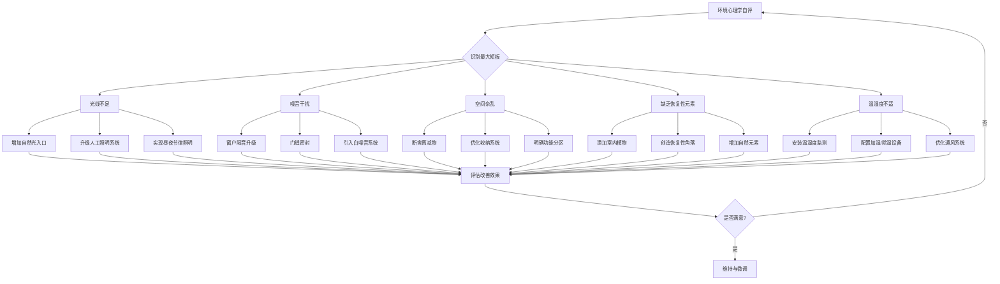

## 一、环境心理学

环境心理学（Environmental Psychology）研究人与物理环境之间的双向关系——环境如何塑造人的行为、情绪和认知，人又如何选择、改造和回应环境。这门学科诞生于20世纪60年代的社会动荡期，当时心理学家意识到，实验室里得出的结论无法解释真实环境中的行为差异，于是开始走出实验室，研究真实世界中的建筑、城市和居住空间对人的影响。

在家居生活领域，环境心理学的价值在于：它把"我觉得这个房间不舒服"这种模糊感受，转化为可测量、可操控、可优化的系统性知识。掌握这些知识，你就不再是凭直觉装修，而是有科学依据地设计自己的生活空间。

### 1.1 环境心理学的理论基础

环境心理学并非单一理论，而是由多个互补的理论框架共同构成。理解这些理论，是后续一切实践的前提。

#### 1.1.1 刺激-反应理论（S-R Theory）

最基础的理论模型。环境中的各种物理刺激——光线、颜色、声音、温度、气味、材质触感——通过感官系统传入大脑，引发一系列生理和心理反应。这些反应分为两类：

- **先天反应**：进化过程中形成的本能反应。例如，人类天生对黑暗产生警觉（黑暗中捕食者的威胁），对开阔高处产生轻度恐惧（坠落风险），对蛇形图案快速识别（毒蛇威胁）。这些反应不受文化影响，是所有人类共有的。
- **后天习得反应**：通过个人经历形成的条件反射。例如，某种香水的气味可能唤起对某个人的记忆，某个特定的墙纸图案可能触发童年的怀旧情绪。这类反应因人而异，高度个人化。

在家居设计中，刺激-反应理论的应用原则是：**主动选择你希望引发的反应，然后选择对应的环境刺激**。想要放松，就选择低饱和度的冷色调、柔和的间接照明、21°C左右的温度；想要激发活力，就引入明亮的暖光、适度的红色元素、轻快的背景音乐。

#### 1.1.2 场所依恋理论（Place Attachment Theory）

人会对特定空间产生情感依恋，这种依恋由两个维度构成：

- **功能依恋**：基于空间的实用价值。比如厨房操作台的高度恰好适合你的身高，你习惯了这个台面，换一个高度不同的会感到不便。
- **情感依恋**：基于空间承载的记忆和意义。老房子里的某面墙上挂着的照片、阳台上那盆养了五年的绿萝、客厅角落里孩子画的第一幅画——这些赋予空间超越物理属性的情感价值。

家是最典型的产生强烈依恋的场所。研究表明，拥有强烈家的依恋感的人，其心理健康水平、生活满意度和社会归属感都显著更高。这也解释了为什么搬家——即使是搬到更好的房子——也会让人在短期内感到焦虑和失落。

**实践启示**：在装修或搬家时，有意识地保留一些能承载情感依恋的物品（旧家具、照片墙、熟悉的装饰品），它们是帮助你在新空间中快速建立归属感的"心理锚点"。

#### 1.1.3 环境压力理论（Environmental Stress Theory）

环境中的负面因素——噪音、拥挤、空气污染、极端温度、杂乱——构成环境压力源。短期环境压力会触发应激反应（心率加快、皮质醇升高、注意力集中），这是正常的适应机制。但如果环境压力长期持续且个体无法控制，就会导致：

- 慢性压力和焦虑
- 免疫功能下降
- 睡眠质量恶化
- 认知功能衰退（注意力、记忆力、决策能力下降）
- 社交退缩和攻击性增加

关键发现：**环境压力的破坏力不仅取决于压力源的强度，更取决于个体对环境的控制感**。能够控制噪音的人比无法控制噪音的人受到的影响小得多——即使两组人经历的噪音分贝完全相同。这一发现由Glass和Singer在1972年的经典实验中证实，对家居设计有深远意义：**让居住者感觉自己能控制环境，和实际改善环境同样重要**。

#### 1.1.4 控制感理论（Perceived Control Theory）

这是环境心理学中被低估但极其重要的理论。控制感理论认为，人对环境的心理反应不仅取决于环境的客观条件，还取决于人感觉自己能在多大程度上控制这个环境。

经典实验：两组受试者暴露在相同强度的噪音中。第一组被告知"你可以随时按下按钮停止噪音"（即使他们从未按下），第二组被告知"你无法控制噪音"。结果第一组的认知测试成绩显著优于第二组，且压力激素水平更低。

**家居设计启示**：
- 给每个家庭成员提供对自己私人空间的完全控制权（灯光明暗、温度高低、音乐选择）
- 在公共空间中提供可调节选项（调光开关、可移动隔断、多模式照明）
- 让所有家庭成员参与家居设计决策，而不是由一人独断
- 智能家居的核心价值不仅是自动化，更是赋予居住者更精细的环境控制能力

#### 1.1.5 可供性理论（Affordance Theory）

由生态心理学家詹姆斯·吉布森（James Gibson）提出，指环境中的物体和空间"提供"给使用者的行为可能性。可供性不是物体的固有属性，而是物体与使用者之间的关系——同一把椅子，对成人"提供"了坐的功能，对幼儿"提供"了攀爬的功能。

在家居设计中，可供性理论的核心应用是：**设计应让正确的行为自然而然地发生，而不是依赖提醒和规则**。

- 如果你想让家人多在客厅聚在一起聊天，就需要创造一个"提供"面对面交流的家具布局（沙发围合而非全部面向电视）
- 如果你想让孩子养成阅读习惯，就让书架出现在客厅的核心位置而不是藏在书房里
- 如果你想减少厨房台面的杂物堆积，就提供充足的、易于使用的收纳空间

#### 1.1.6 环境偏好理论（Preference Theory）

由卡普兰夫妇（Rachel & Stephen Kaplan）提出，认为人们对环境的偏好基于四个维度：

| 维度 | 含义 | 过少时的体验 | 过多时的体验 | 家居应用 |
|------|------|-------------|-------------|---------|
| 复杂性（Complexity） | 环境元素的多样性 | 枯燥无聊 | 混乱焦虑 | 通过艺术品、植物、纹理变化增加适度丰富性 |
| 可理解性（Legibility） | 空间的有序和可读性 | 迷失困惑 | 枯燥乏味 | 清晰的功能分区、一致的设计语言、明确的动线 |
| 神秘性（Mystery） | 环境暗示有更多信息待探索 | 一览无余、无趣 | 不安全感、恐惧 | 半遮半掩的景深设计、曲线路径、部分遮挡的景观 |
| 一致性（Coherence） | 元素之间的逻辑关联 | 混乱无序 | 单调重复 | 统一的色调体系、材质呼应、风格协调 |

理想的家居环境在四个维度上都处于适中水平——有足够的变化让人感兴趣，有足够的秩序让人安心，有适度的探索空间，有整体的和谐感。

### 1.2 感官环境要素

人类通过五感接收环境信息，每个感官通道都会影响心理状态和行为。以下逐一分析家居环境中最重要的感官要素。

#### 1.2.1 光线

光是影响人体最深刻的环境因素，没有之一。光线通过视网膜上的特殊感光细胞（内在光敏视网膜神经节细胞，ipRGC）将信号传递到视交叉上核（SCN）——大脑的"主时钟"，调节褪黑素和皮质醇的分泌节律，控制整个昼夜节律系统。

**光线对身心的具体影响**：

| 影响维度 | 充足自然光的效果 | 长期光线不足的后果 |
|---------|----------------|-----------------|
| 情绪 | 刺激血清素合成，改善情绪 | 季节性情感障碍（SAD）、抑郁倾向 |
| 睡眠 | 白天光照促进夜间褪黑素正常分泌 | 昼夜节律紊乱、入睡困难、睡眠浅 |
| 认知 | 提升注意力和工作效率（15-40%提升） | 反应迟钝、判断力下降 |
| 生理 | 促进维生素D合成、调节免疫 | 维生素D缺乏、骨质疏松风险增加 |
| 社交 | 增加积极社交行为 | 社交退缩、孤立倾向 |

**关键数据**：
- Heschong Mahone Group对2100名学生的对照研究发现，自然光最充足的教室中的学生，数学成绩比光线最差的教室中的学生高26%，阅读成绩高20%
- 罗杰·乌尔里希（Roger Ulrich）1984年在《Science》发表的经典研究：能看到自然景色的术后患者，住院时间更短、止痛药用量更少、护士评价更积极
- 色温4600K以上的蓝光在夜间会抑制褪黑素分泌长达90分钟，这意味着睡前2小时使用冷白灯光或电子屏幕会显著影响入睡

**家居光线设计的分层体系**：

┌─────────────────────────────────────────────┐
│  第四层：装饰光                              │
│  灯带、壁灯、艺术品射灯                      │
│  功能：营造氛围、创造视觉焦点                │
├─────────────────────────────────────────────┤
│  第三层：氛围光                              │
│  落地灯、台灯、蜡烛                          │
│  功能：放松、社交、过渡到休息状态            │
├─────────────────────────────────────────────┤
│  第二层：任务光                              │
│  台灯、厨柜下灯、阅读灯                      │
│  功能：工作、阅读、烹饪等精细活动            │
├─────────────────────────────────────────────┤
│  第一层：环境光                              │
│  吊灯、吸顶灯、天窗                          │
│  功能：基础照明，确保安全和基本能见度        │
└─────────────────────────────────────────────┘

**各房间照度与色温参考**：

| 房间 | 建议照度(lux) | 建议色温(K) | 特殊要求 |
|------|-------------|------------|---------|
| 客厅（日常） | 150-300 | 3000-4000 | 可调光，支持多种场景 |
| 客厅（阅读） | 300-500 | 4000 | 需要独立任务灯 |
| 餐厅 | 200-300 | 2700-3000 | 暖色调促进食欲和亲密感 |
| 厨房（操作区） | 500-750 | 4000-5000 | 高显色指数(Ra>90)确保辨色准确 |
| 卧室（日常） | 100-150 | 2700 | 暖色、低强度、可调光 |
| 卧室（睡前） | <50 | 2200-2700 | 严禁蓝光，建议用盐灯或蜡烛 |
| 书房/工作区 | 300-500 | 4000-5000 | 均匀无眩光，配合自然光 |
| 卫生间（洗漱） | 300-500 | 4000 | 高显色指数确保化妆/剃须准确 |
| 卫生间（夜间） | <10 | 2000-2200 | 夜灯模式，不干扰褪黑素 |

**进阶：昼夜节律照明（Circadian Lighting）**：

最新的照明科学建议模拟自然光的昼夜变化——早晨使用高色温（5000-6500K）的明亮光线唤醒身体，下午逐渐过渡到中性色温（4000K），傍晚切换到暖色温（2700K），睡前使用极低强度的暖光（2200K以下）。部分智能照明系统（如Philips Hue、Yeelight）已支持"节律模式"，可根据地理位置和季节自动调整。

#### 1.2.2 色彩

色彩通过两条路径影响心理：一是生理路径——不同波长的光直接作用于神经系统（如蓝色降低心率、红色升高血压）；二是心理路径——基于个人经历和文化背景形成的色彩联想。

**各色彩的心理效应与家居应用**：

**蓝色系**——冷静与专注。蓝色是全球最受欢迎的颜色（跨文化调查中约40%的人首选蓝色）。淡蓝色降低心率和血压，有助于放松和集中注意力。卧室使用淡蓝色调的受试者平均睡眠时间更长。但过深的蓝色（如海军蓝大面积使用）可能引发忧郁感，特别是在光线不足的空间中。适合：卧室、书房、卫生间。不适合：餐厅（抑制食欲）。

**绿色系**——恢复与平衡。绿色处于可见光谱的中间位置，人眼处理绿色时所需调节最少，因此绿色最能缓解视觉疲劳。在有绿色植物的环境中，人的压力水平（皮质醇浓度）降低12-15%。绿色也与创造力正相关——研究发现在绿色环境中完成创意任务的表现更好。适合：书房、客厅、任何需要放松的空间。几乎是"万能色"。

**红色系**——能量与激情。红色提高心率（约5-10bpm）、升高血压、增强食欲。餐厅中使用红色元素能增加用餐量约15%。但大面积红色会增加焦虑感和攻击性——监狱和审讯室的实验表明，暴露在红色环境中的被试攻击性评分更高。家居使用原则：**小面积点缀，绝不大面积使用**。适合：餐厅点缀、入口玄关。不适合：卧室、书房、儿童房。

**黄色系**——乐观与活力。黄色与阳光和快乐相关联，能刺激多巴胺分泌。淡黄色让空间感觉温暖、开放。但饱和度过高的黄色（如明黄、柠檬黄）会导致视觉疲劳和烦躁——婴儿在黄色房间中哭泣的频率更高。适合：玄关、厨房（小面积）。不适合：卧室、大面积墙面。

**中性色系（白、灰、米、棕）**——安全感与包容性。中性色是家居设计的"底色"，提供视觉休息和心理安全感。纯白色让空间显大但可能显得冰冷空旷；暖白色（偏米、偏黄）则更温馨。灰色是极佳的背景色，但全灰色调会让空间显得沉闷压抑。木色和大地色系提供温暖和踏实感，是几乎所有风格的安全选择。

**色彩搭配的实操法则**：

| 法则 | 内容 | 示例 |
|------|------|------|
| 60-30-10法则 | 主色60%、辅色30%、点缀色10% | 米白墙(60%)+灰蓝沙发(30%)+姜黄靠垫(10%) |
| 同色系法则 | 使用同一颜色的不同深浅 | 浅蓝墙+中蓝窗帘+深蓝地毯 |
| 互补色法则 | 使用色轮上对立的颜色（高对比） | 蓝色墙面+橙色装饰品 |
| 类似色法则 | 使用色轮上相邻的颜色（低对比） | 蓝色+蓝绿色+绿色 |
| 自然取色法 | 从自然界中提取配色方案 | 森林系（深绿+棕+米白）、海洋系（蓝+白+沙色） |

**容易被忽视的要点**：同一种颜色在不同光线下看起来完全不同。选定墙漆颜色后，务必在目标墙面上涂刷至少60cm×60cm的样板，在白天自然光、傍晚暖光、夜间灯光三种条件下分别观察，再做最终决定。

#### 1.2.3 声音

环境噪音是城市居住中最普遍的环境压力源。世界卫生组织（WHO）的数据显示，长期暴露在55分贝以上的环境噪音中，心血管疾病风险增加约10-15%；夜间噪音超过40分贝就会干扰深度睡眠。

**噪音的分级影响**：

| 分贝水平 | 典型来源 | 对人的影响 |
|---------|---------|-----------|
| 20-30 dB | 树叶沙沙声、耳语 | 安静舒适，睡眠理想环境 |
| 40-50 dB | 正常对话、空调运行 | 可接受的日常背景噪音 |
| 55-65 dB | 交通噪音、吸尘器 | 开始产生压力反应，注意力分散 |
| 70-85 dB | 吵闹餐厅、工厂噪音 | 明显不适，长期暴露损害听力 |
| 85+ dB | 电锯、摇滚演唱会 | 听力损伤，必须使用防护 |

**白噪音的科学原理与使用**：白噪音包含20-20000Hz范围内所有频率的声波，且能量均匀分布。它的助眠原理不是"催眠"，而是**掩蔽效应**——白噪音填满了听觉频谱中的"空隙"，使环境中突然出现的不规律噪音（汽车经过、关门声、邻居说话）不会产生显著的声压变化，大脑因此不会被"惊醒"。

白噪音的有效性有明确的科学证据：一项对新生儿ICU的研究发现，白噪音组的婴儿在5分钟内入睡的比例为80%，而对照组仅为25%。

**常见误区**：白噪音不是越响越好。使用白噪音机助眠时，音量应控制在50分贝以下（大约是安静图书馆的水平），放置位置距离头部至少1米，避免在最大音量下长时间使用（可能对婴儿听力造成潜在风险）。

**替代方案**：
- 粉红噪音（Pink Noise）：高频衰减，听起来更柔和自然，类似雨声、瀑布声。近期研究显示，粉红噪音在促进深度睡眠方面可能优于白噪音
- 自然声音（雨声、溪流、鸟鸣）：兼具掩蔽效果和恢复性体验
- 棕噪音（Brown Noise）：更低沉，类似远处雷声，适合对高频敏感的人

**家居隔音的优先级排序**（按投入产出比）：

1. **窗户升级**（效果最大）：单层玻璃窗的隔音量约20-25dB，双层中空玻璃约30-35dB，三层夹胶玻璃可达40-45dB。这是性价比最高的隔音投资。
2. **门缝密封**：门底部的缝隙是声音传播的主要通道。安装自动升降门底密封条（约50-100元）可降低5-10dB的噪音传入。
3. **软质材料吸音**：地毯、厚窗帘、布艺沙发、靠垫等软质材料能吸收室内回声，减少声音在室内的反射。大面积硬质地面（瓷砖、木地板）的房间回声时间长，会让人觉得"空旷"和"吵"。
4. **墙面处理**：隔音墙板（如聚酯纤维吸音板）可降低相邻房间的噪音传播。但需注意，轻质隔墙的隔音性能远不如承重砖墙。
5. **声源管理**：将洗衣机、洗碗机等噪音设备远离卧室和书房，使用时选择白天时段。

#### 1.2.4 温度与湿度

人体热舒适度的核心参数是"操作温度"（Operative Temperature），它综合了空气温度和平均辐射温度（墙壁、地板、天花板的表面温度）。人感到最舒适的操作温度约为20-22°C（冬季）和23-26°C（夏季），相对湿度40-60%。

**温度对认知和行为的影响**：

Seppänen等人（2006）对大量研究的元分析发现：
- 温度在21-22°C时，工作绩效最高
- 温度每升高1°C（在25°C以上），工作效率下降约2%
- 温度低于18°C时，精细动作的准确性下降，错误率增加
- 热应激（温度>30°C）会导致攻击性增加——这一发现解释了为什么夏季暴力犯罪率高于冬季

**湿度的健康影响**：
- 湿度低于30%：皮肤干燥、鼻腔黏膜干裂（降低对病原体的防御能力）、静电频繁
- 湿度40-60%：最舒适区间，呼吸道黏膜保持良好状态，病毒存活率最低
- 湿度高于70%：霉菌快速繁殖（黑曲霉在湿度>75%时48小时内即可生长）、尘螨数量激增、体感温度升高（闷热感）
- 湿度高于80%：建筑结构受损风险显著增加

**季节性温湿度管理策略**：

| 季节 | 温度目标 | 湿度目标 | 核心策略 |
|------|---------|---------|---------|
| 冬季 | 20-22°C | 40-50% | 暖气+加湿器，注意暖气片上方空气干燥 |
| 春季 | 自然温度 | 50-60% | 通风除湿，关注回南天（南方） |
| 夏季 | 24-26°C | 50-60% | 空调+除湿，避免室内外温差过大(>8°C) |
| 秋季 | 20-22°C | 40-55% | 自然通风为主，秋燥时适度加湿 |

**智能温控的价值**：研究表明，人对"温度变化的控制感"比"绝对温度值"更能影响满意度。安装智能温控器（如Nest、米家温控器）让用户可以通过手机随时调节温度，即使实际温度变化不大，主观舒适感也会显著提升——这再次印证了控制感理论的核心观点。

#### 1.2.5 气味

嗅觉是最"原始"的感觉——嗅觉神经直接连接到大脑的边缘系统（杏仁核和海马体），不经过丘脑中转。这意味着气味对情绪和记忆的影响比视觉、听觉更快、更直接、更强烈。普鲁斯特在《追忆似水年华》中描写的"玛德琳蛋糕蘸茶"引发童年记忆涌回的场景，有坚实的神经科学基础。

**气味对心理状态的影响**：

| 气味类型 | 代表气味 | 心理效果 | 适用场景 |
|---------|---------|---------|---------|
| 薰衣草 | 薰衣草精油 | 降低心率、缓解焦虑、促进入睡 | 卧室、浴室 |
| 柑橘类 | 橙子、柠檬、佛手柑 | 提升情绪、增加活力、减轻疲劳 | 玄关、厨房、工作区 |
| 薄荷 | 薄荷精油 | 提高注意力和警觉性 | 书房、工作区 |
| 雪松/松木 | 天然木材气味 | 安定放松、增强安全感 | 客厅、卧室 |
| 咖啡 | 烘焙咖啡豆 | 提升警觉性、唤起愉悦联想 | 厨房、餐厅 |
| 茉莉 | 茉莉花香 | 舒缓镇静、改善睡眠质量 | 卧室 |
| 玫瑰 | 玫瑰精油 | 降低焦虑、提升幸福感 | 客厅、浴室 |

**家居气味管理的层次**：
1. **消除异味源头**（优先级最高）：定期清理冰箱、排水口、垃圾桶，检查是否有霉变。任何香薰都无法真正"覆盖"异味，只是让空气变得更复杂。
2. **自然通风**：每天至少开窗通风15-30分钟（PM2.5达标时），保持空气新鲜是最基本也最有效的"气味管理"。
3. **天然材质散发的气味**：实木家具、棉麻织物、天然石材本身带有淡淡的自然气味，这些气味有助于营造放松的居住氛围。
4. **有控制的香氛释放**：使用天然精油扩香器（超声波雾化或加热型），避免合成香精。每个房间可以设计不同的"气味标识"——卧室是薰衣草，书房是薄荷，客厅是雪松——形成空间气味记忆，帮助大脑快速进入对应的心理状态。

**需要警惕的问题**：市面上很多空气清新剂和合成香薰含有邻苯二甲酸酯等内分泌干扰物，长期使用可能影响健康。选择香氛产品时，优先选择纯天然精油，避免含有"fragrance"（香精）这一笼统标注的产品。

#### 1.2.6 触觉与材质

触觉是最早发展的感觉（胎儿在子宫中即开始感知触觉），也是最容易被家居设计忽视的感觉。不同材质传递不同的心理信息：

- **木材**：温暖、自然、安全。触摸天然木材能降低皮质醇水平。日本的研究发现，与金属或塑料表面相比，触摸木质表面时大脑的前额叶活动模式更接近放松状态。
- **石材**：稳定、永恒、清凉。大理石和花岗岩传递高端感和耐久性，但在冬季会显得冰冷。
- **织物**：柔软、温馨、亲切。不同织物的触感差异很大——亚麻透气粗糙、天鹅绒顺滑温暖、棉布柔软亲肤。
- **金属**：现代、理性、冰冷。金属材质在视觉和触觉上都传递"冷"的信号，在需要温馨感的空间中应适度使用。
- **玻璃**：通透、轻盈、精致。玻璃材质增加空间的通透感和光感，但大面积使用可能让空间显得冷漠。

**家居材质搭配建议**：在任何一个空间中，至少使用3种不同触感的材质（如木地板+布艺沙发+金属灯具），既有对比变化又不至于杂乱。卧室和休息区增加软质材质的比例，厨房和工作区可以增加硬质材质的比例。

### 1.3 空间与社会心理

家居空间不仅是物理容器，更是社会关系的舞台。空间的布局和设计深刻影响家庭成员之间的互动模式、情感连接和个人心理健康。

#### 1.3.1 私密性与社交性的平衡

社会学家欧文·戈夫曼（Erving Goffman）的"拟剧理论"（Dramaturgical Theory）认为，人在社交中扮演不同角色——面对外人是"前台"表演，回到家中进入"后台"放松。如果家中缺少"后台"空间（私密区域），人就无法卸下社交面具，长期处于"表演"状态，心理能量持续消耗。

**家居空间的社交梯度**：

完全公共 ←──────────────────────────────────→ 完全私密

  入口/玄关  客厅  餐厅  厨房  走廊  书房  卫生间  卧室  衣帽间
    │         │     │     │     │     │      │      │      │
    ▼         ▼     ▼     ▼     ▼     ▼      ▼      ▼      ▼
  迎接外人  社交  共享  协作  过渡  个人   个人   私密   最私密

理想的设计应该让这个梯度清晰可感知——从门口到卧室，空间的"私密度"逐渐递增。如果一进门就能看到卧室内部（户型限制），至少要用帘幕、屏风或家具布局创造视觉过渡。

**过渡空间的心理功能**：玄关和走廊不仅是交通通道，更是心理状态的切换区域。玄关是"室外"到"室内"的过渡——换鞋、放包、挂外套这些仪式性动作帮助大脑从"外部世界模式"切换到"家庭模式"。如果缺少玄关（很多小户型如此），可以在入口处设置一个简易的鞋架和挂钩，创造一个微型的"仪式空间"。

#### 1.3.2 领域感与个人空间

**领域感（Territoriality）** 是指个体对特定空间的占有感和控制感。在家中，每个人都有自己的"领地"——可能是书桌的一角、沙发上的固定座位、卧室里的某个区域。当领地被侵犯时，人会感到不安和愤怒，即使侵犯者是亲密的家人。

人类学家爱德华·霍尔（Edward T. Hall）在《隐藏的维度》（The Hidden Dimension，1966）中提出了个人空间的四个距离圈：

| 距离圈 | 范围 | 适用关系 | 家居场景 |
|--------|------|---------|---------|
| 亲密距离 | 0-45cm | 情侣、亲子 | 拥抱、亲密交谈 |
| 个人距离 | 45-120cm | 家人、好友 | 日常家庭互动 |
| 社交距离 | 120-360cm | 陌生客人 | 接待访客 |
| 公共距离 | >360cm | 公共场合 | 大客厅中的对角距离 |

**在家居设计中尊重领域感的具体方法**：
- 为每个家庭成员（包括儿童）划定至少一个专属的收纳区域和私人角落
- 在共享空间中，使用地毯、灯光、家具布局来界定不同的"领地"
- 夫妻/情侣同住时，即使空间有限，也要确保每人有独立的存放私人物品的空间
- 为来访的客人设计临时的"个人空间"（如客卧中的专用毛巾、拖鞋、放置私人物品的台面）

#### 1.3.3 家庭互动模式与空间布局

空间布局直接影响家庭成员之间的互动频率和质量。密歇根大学的一项研究发现，在开放式厨房中做饭的父母与孩子的对话量是在封闭式厨房中的3倍。

**促进互动的空间设计**：
- 开放式或半开放式厨房，让做饭的人能与客厅的家人交流
- 餐厅与客厅相连，避免用餐时与家庭活动分离
- 客厅家具布局采用"面对面"或"L形"而非"全部面向电视"的排列
- 阳台或庭院设置为家庭共同活动空间（如户外用餐、园艺）

**保护独处的空间设计**：
- 书房或工作区有门可关
- 卧室门的有效隔音（STC 35以上）
- 即使是开放式空间，也通过书架、屏风、植物创造视觉上的"私人角落"
- 为需要安静的家庭成员（如学习中的孩子、远程办公的大人）设置"请勿打扰"的视觉信号系统

### 1.4 恢复性环境

恢复性环境（Restorative Environment）是指能够帮助人从心理疲劳和注意力耗竭中恢复的环境。这一概念由卡普兰夫妇在"注意力恢复理论"（Attention Restoration Theory, ART）中系统阐述。

**注意力分为两种**：
- **定向注意力**（Directed Attention）：需要意志力维持的注意力，如工作、学习、驾驶。长时间使用会疲劳。
- **非自愿注意力**（Involuntary Attention）：被自然吸引的注意力，如看流水、观察云彩。这种注意力不需要意志力，不会疲劳。

恢复性环境的作用机制是：通过提供丰富的"非自愿注意力"刺激（自然元素），让"定向注意力"得到休息和恢复。这就是为什么在大自然中散步1小时后，你会觉得头脑清醒、精力恢复——不是因为运动本身，而是因为自然环境让你疲劳的定向注意力得到了休息。

**恢复性环境的四个特征**（FARC模型）：

| 特征 | 英文 | 含义 | 家居应用 |
|------|------|------|---------|
| 远离 | Being Away | 与日常环境和事务的心理距离 | 阅读角、冥想空间、阳台花园 |
| 广度 | Extent | 环境足够丰富，能让人沉浸 | 连续的视觉景观、多层次的空间体验 |
| 魅力 | Fascination | 元素自发吸引注意力，不需意志力 | 水族箱、植物生长、壁炉火焰、窗外风景 |
| 兼容性 | Compatibility | 环境与当前活动需求匹配 | 安静的阅读空间、不受打扰的工作区 |

**在家中创造恢复性体验的实用方法**：

1. **引入活的自然元素**：室内植物是最简单、最有效的恢复性元素。不需要很多——即使是书桌上的一盆小型绿植，也能提供微恢复体验。研究表明，注视植物3-5分钟即可产生可测量的压力缓解效果。推荐品种：绿萝（极好养）、虎皮兰（夜间释放氧气）、琴叶榕（视觉存在感强）。

2. **水元素**：小型桌面水景、鱼缸中的鱼的游动，都能提供持续的、低强度的"魅力"刺激。水声也具有天然的掩蔽和放松效果。

3. **窗外的自然景观**：如果窗外有树木、天空或任何自然元素，确保窗户不被家具遮挡。即使是城市中的一小片天空，也比完全封闭的墙面更具恢复性。Ulrich的研究正是基于"窗外是否有自然景色"这一简单变量。

4. **模拟自然的替代方案**：对于完全无法接触自然的室内空间，高清自然景观视频（4K自然纪录片、壁炉视频）、自然声音录音、大面积的植物摄影打印品，都能提供有限但真实的恢复效果。但它们的效果不如真实自然元素。

5. **火元素**：壁炉火焰（或仿真电子壁炉）是极其强大的恢复性刺激。人类对火焰的注意力已有数十万年的进化基础。研究表明，注视火焰能降低血压并促进社交放松。

### 1.5 常见误区

以下是家居环境设计中最常见的心理学误区：

**误区一："极简风格一定让人放松"**
真相：极简风格提供高可理解性但低复杂性。对于某些人（特别是创意工作者），过度极简的环境会导致感官剥夺感和无聊。最佳环境在复杂性和可理解性之间取得平衡——并非越少越好，而是"恰到好处的丰富"。

**误区二："开放式布局一定更好"**
真相：开放式布局确实促进了社交互动，但牺牲了私密性和声学隔离。远程办公时代，家庭成员可能同时需要在家中进行不兼容的活动（开会vs学习vs休息）。灵活的空间分隔（可移动隔断、拉门、书架隔断）比完全开放或完全封闭都更优。

**误区三："只要用对了颜色就能改变情绪"**
真相：色彩的心理效应受到光线条件、空间大小、材质纹理、文化背景和个人经历的共同影响。没有"万能"的色彩公式。一个在杂志上看起来令人放松的蓝色卧室，在光线不足的北向房间中可能显得阴冷压抑。

**误区四："白噪音适合所有人"**
真相：部分人（特别是听觉敏感者和某些自闭症谱系人士）对持续的背景噪音感到不适。白噪音的使用应基于个人体验，而非盲目跟从。粉红噪音或自然声音可能是更好的替代。

**误区五："香薰越多越好"**
真相：嗅觉适应（olfactory adaptation）意味着人会在15-20分钟内对持续存在的气味"失嗅"。过多的香薰不仅浪费，还可能引发头痛或过敏。少量、间歇、自然的气味管理优于持续的强香氛。

**误区六："智能家居=更好的居住体验"**
真相：智能家居的核心价值是增强控制感和自动化重复任务。但如果设置过于复杂、经常出故障、或者需要不断用手机操作，反而会增加认知负担和挫败感。技术应该是"隐形"的——好的智能家居让你忘记它的存在。

### 1.6 中国文化语境下的环境心理学

上述理论主要基于西方研究，但在中国的家居环境中，有独特的文化因素需要考虑。

**风水的科学解读**：传统风水中很多原则与现代环境心理学的发现不谋而合，只是用了不同的语言体系：

| 传统风水原则 | 环境心理学对应 | 科学依据 |
|-------------|--------------|---------|
| "明厅暗房" | 客厅明亮、卧室昏暗 | 与昼夜节律照明原理一致 |
| "藏风聚气" | 避免穿堂风，保持适度通风 | 减少温度骤变带来的不适 |
| "背后有靠" | 座椅/床头靠墙 | 提供安全感，减少背后威胁的本能警觉 |
| "入户见喜" | 入口处设置积极视觉元素 | 首因效应，正面的第一印象提升归家愉悦感 |
| "水主财" | 室内水景/鱼缸 | 水元素的恢复性效果和放松作用 |
| "前低后高" | 前方开阔、后方有依托 | 基于人类对开阔视野（发现威胁）和背后保护的需求 |

不必全盘接受或全盘否定传统风水——用环境心理学的框架去理解和筛选，保留其中有科学支撑的部分，去除迷信成分，是一种务实的态度。

**中国家庭特有的空间需求**：
- **三代同堂**：需要在有限空间中满足老年人（安静、安全、无障碍）、中年人（工作空间、社交空间）和儿童（安全、探索空间）的差异化需求
- **饮食文化**：中餐烹饪产生的油烟远大于西餐，厨房的通风排烟设计比西方标准更重要
- **待客文化**：中国家庭的"客厅"承担着更重的社交展示功能，需要在"展示性"和"舒适性"之间找到平衡
- **学习环境**：中国家庭普遍重视子女学习，为孩子创造一个安静、光线充足、干扰少的学习空间是刚需

### 1.7 环境心理学自评清单

用以下清单评估你当前的居住环境，每项1-5分（1=非常差，5=非常好）：

**光线（总分25）**
- [ ] 白天室内是否有充足的自然光？
- [ ] 工作/学习区域是否有足够的任务照明？
- [ ] 卧室灯光是否在睡前能切换到暖色低亮度模式？
- [ ] 是否避免了直射眩光（电脑屏幕反光、灯光直射眼睛）？
- [ ] 不同房间是否有独立的灯光控制？

**声音（总分20）**
- [ ] 室内背景噪音是否在可接受范围内（<45dB）？
- [ ] 卧室是否有效隔绝了室外噪音？
- [ ] 是否有安静的角落供专注工作或休息？
- [ ] 家电噪音是否得到有效管理？

**温度与空气（总分20）**
- [ ] 室内温度是否维持在20-26°C的舒适范围？
- [ ] 室内湿度是否在40-60%之间？
- [ ] 室内空气是否清新、无异味？
- [ ] 是否定期通风换气？

**空间与秩序（总分20）**
- [ ] 空间中是否有适度的视觉丰富性（不至于单调或杂乱）？
- [ ] 每个家庭成员是否都有自己的私人空间/角落？
- [ ] 是否有清晰的功能分区（休息区、工作区、社交区）？
- [ ] 视线范围内是否有令人愉悦的元素（植物、艺术品、窗外景观）？

**色彩与材质（总分15）**
- [ ] 主色调是否与空间功能匹配（卧室偏安静、客厅偏温暖）？
- [ ] 是否有色彩层次变化（而非单调统一）？
- [ ] 是否使用了多种触感材质增加感官丰富性？

**总分评价**：
- 80-100分：优秀，你的居住环境在心理学层面已相当完善
- 60-79分：良好，有明确的优化空间
- 40-59分：一般，建议根据薄弱环节优先改善
- 40分以下：较差，居住环境可能正在对你的身心健康产生负面影响

### 1.8 从理论到行动：系统改善路线图

**改善的优先级原则**：
1. **先解决压力源**（噪音、异味、极端温度），再增加正面元素（植物、艺术品）。消除负面影响的收益远大于增加正面元素。
2. **先解决高频空间**（卧室、工作区），再优化低频空间（客房、储藏室）。你每天在卧室度过8小时，在工作区度过8小时，改善这两个空间的回报率最高。
3. **先低成本后高成本**：整理收纳（几乎零成本）、调整灯光色温（换灯泡，几十元）、添加植物（几十元）→ 窗户隔音升级（几千元）→ 照明系统改造（几千到万元）。
4. **先个人后共享**：如果你与家人同住，先改善自己的私密空间（卧室、工作区），因为控制感理论表明，对个人空间的控制对心理健康的影响最大。

### 1.9 延伸阅读与核心文献

以下文献是环境心理学领域的奠基之作和重要综述，适合希望深入了解的读者：

- **《隐藏的维度》**（The Hidden Dimension）—— 爱德华·霍尔（Edward T. Hall），1966。个人空间和领域感的经典之作。
- **《场所与空间心理学》**（Handbook of Environmental Psychology）—— Daniel Stokols & Irwin Altman主编。环境心理学的权威教材。
- **《康复花园》**（Restorative Gardens）—— Nancy Gerlach-Spriggs等。恢复性环境在医疗和居住空间中的应用。
- **Ulrich, R.S. (1984)** "View through a window may influence recovery from surgery." *Science*, 224(4647), 420-421. 环境心理学被引用最多的论文之一。
- **Kaplan, R. & Kaplan, S. (1989)** *The Experience of Nature: A Psychological Perspective*. 注意力恢复理论的奠基之作。
- **Glass, D.C. & Singer, J.E. (1972)** *Urban Stress*. 环境压力与控制感的经典研究。

***

环境心理学不是装修指南的"装饰性知识"，而是理解人与空间关系的基础框架。当你理解了光线如何影响昼夜节律、声音如何影响压力水平、空间布局如何影响家庭互动、色彩如何影响情绪状态，你就获得了一套系统性的工具——用它来审视和改造自己的居住环境，每次改变都有科学依据，每个决策都指向更好的生活品质。
