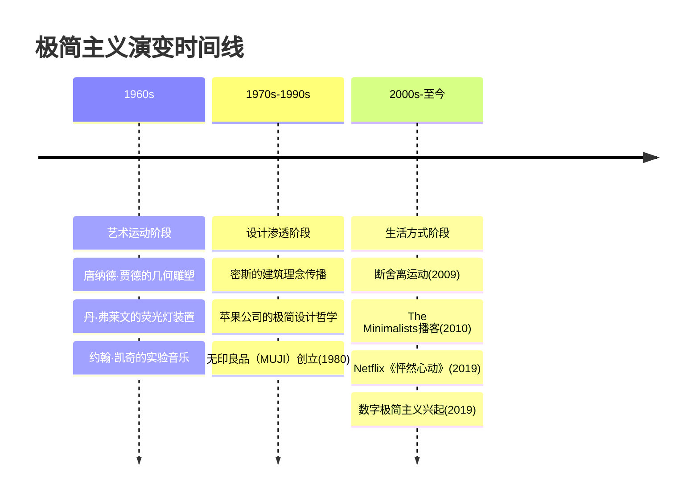
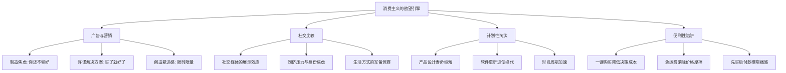
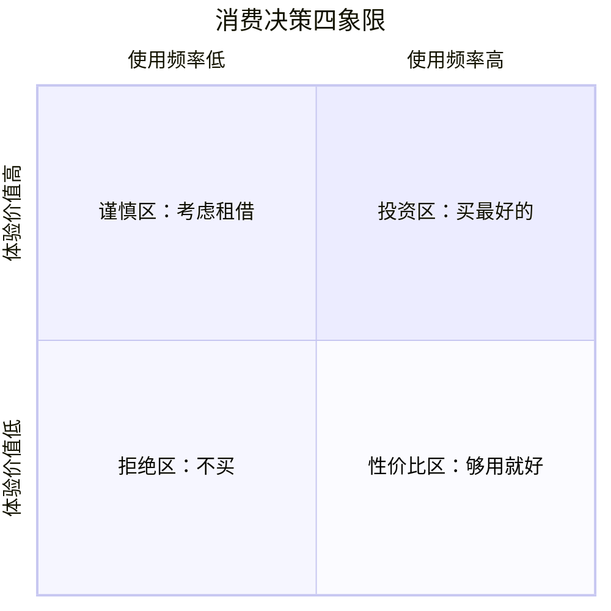

## 二、极简主义哲学

极简主义不是一种生活风格的表面装饰，而是一套完整的哲学体系——它回答的是"什么是值得拥有的"这个根本问题。在消费主义渗透到日常每一个缝隙的当代社会，极简主义提供了一种清醒的替代方案：不是拥有更多，而是拥有更好的；不是填充空间，而是留白空间；不是追求多样性，而是追求深度。

本节将从思想根源、心理机制、实践方法、家居应用四个层面，系统拆解极简主义的完整知识体系。

### 2.1 极简主义的思想谱系

#### 2.1.1 哲学根源：从东方到西方

极简主义并非20世纪的发明，它的思想根源可以追溯到数千年前的多种哲学传统：

**东方哲学根源**

老子在《道德经》第十二章写道："五色令人目盲，五音令人耳聋，五味令人口爽，驰骋畋猎令人心发狂，难得之货令人行妨。"这可能是人类历史上最早的"反消费主义"宣言。老子主张的"少则得，多则惑"，直接对应了极简主义的核心命题。

佛教的"无执"（Non-attachment）思想是另一个重要根源。佛教认为，痛苦的根源不在于缺乏，而在于执着——对物质的执着、对感官享受的执着、对"自我"的执着。极简主义对物质执念的放下，与佛教的这一洞见深度契合。

日本禅宗将这些思想具体化为生活方式。茶道大师千利休（Sen no Rikyū，1522-1591）确立的"侘寂"（Wabi-Sabi）美学，主张在不完美、不完整、不恒久中发现美——一只带有裂纹的茶碗，一间只有四张半榻榻米的茶室，就是对极简主义最早的实践表达。

**西方哲学根源**

古希腊斯多葛学派（Stoicism）的创始人芝诺（Zeno of Citium）主张："与自然一致地生活"，强调美德是唯一的善，外在的物质既非善也非恶。马可·奥勒留在《沉思录》中反复写道，亚历山大大帝和他的马夫死后归于同样的尘土——物质的拥有不过是暂时的。

亨利·戴维·梭罗（Henry David Thoreau）在1845年搬到瓦尔登湖畔的小屋，用两年的极简生活写成了《瓦尔登湖》。他的名言——"一个人的富有程度，与他能够放手的东西数量成正比"——成为了极简主义运动的精神标语。

路德维希·密斯·凡德罗（Ludwig Mies van der Rohe）将"Less is more"从建筑原则提升为生活哲学。他的巴塞罗那馆（1929年）用最少的材料和线条创造出了极致的空间体验，证明了"少"不是匮乏，而是精炼。

#### 2.1.2 从艺术运动到生活哲学的演变

极简主义的发展经历了三个阶段：

**第一阶段：艺术运动（1960-1970年代）**

极简主义（Minimalism）作为艺术运动起源于1960年代的纽约。唐纳德·贾德（Donald Judd）的"特定对象"（Specific Objects）论文（1965年）被视为极简主义的宣言。贾德主张艺术作品应该既非绘画也非雕塑，而是纯粹的三维形式，拒绝隐喻和象征，只呈现材料和形式本身。

这一时期的极简主义艺术家还包括：丹·弗莱文（Dan Flavin）用商用荧光灯管创作光装置；卡尔·安德烈（Carl Andre）用耐火砖铺设地板级雕塑；弗兰克·斯特拉（Frank Stellas）的名言"你看到的是什么就是什么"（What you see is what you see）定义了极简主义对多义性的拒绝。

音乐领域的极简主义由史蒂夫·赖希（Steve Reich）和菲利普·格拉斯（Philip Glass）代表。赖希的"相位偏移"技法——用微小的时间错位从简单旋律中产生复杂效果——揭示了一个深刻原理：少不等于简单，少可以产生丰富。

**第二阶段：设计渗透（1980-2000年代）**

1980年，良品计画（Mujirushi Ryōhin，即无印良品MUJI）在日本成立。它的品牌理念"有理由的便宜"（有理由の安さ）将极简主义从美术馆带入了日常生活。无印良品的设计总监原研哉（Kenya Hara）在《设计中的设计》一书中阐述了"空"（Emptiness）的概念——设计的最高境界不是填满，而是留出空间让人与物产生对话。

1997年回归苹果的史蒂夫·乔布斯（Steve Jobs），将极简主义推向了消费电子领域。iPod的白色耳机、iPhone的单按钮设计、苹果零售店的留白空间——乔布斯对极简的执着不仅定义了一个品牌的审美，更重塑了整个科技行业对"好设计"的理解。

**第三阶段：生活方式运动（2010年代至今）**

2009年，山下英子出版《断舍离》，提出"断绝不需要的东西、舍弃多余的废物、脱离对物品的执念"。2010年，约书亚·菲尔茨·米尔本（Joshua Fields Millburn）和瑞安·尼科迪默斯（Ryan Nicodemus）创建"The Minimalists"，通过博客、播客和纪录片将极简主义生活方式传播到英语世界。2019年，近藤麻理惠的Netflix节目《Tidying Up with Marie Kondo》让"怦然心动"成为全球流行语。

同时，卡尔·纽波特（Cal Newport）2019年出版的《数字极简主义》（Digital Minimalism）将极简主义的逻辑扩展到了数字领域——不是拒绝技术，而是有意识地选择哪些数字工具值得你的注意力。

### 2.2 极简主义的心理学基础

极简主义不仅是一种哲学主张，它背后有坚实的心理学研究支撑。理解这些心理机制，是将极简主义从"道理我都懂"转化为"我真的能做到"的关键。

#### 2.2.1 享乐适应（Hedonic Adaptation）

心理学中最被反复验证的发现之一是**享乐适应**：人对任何固定的刺激水平都会逐渐适应，回到基准幸福水平。这意味着新买的包、新换的车、新搬的大房子带来的快乐都是暂时的——心理学家称之为"快乐跑步机"（Hedonic Treadmill）。

菲利普·布里克曼（Philip Brickman）和唐纳德·坎贝尔（Donald Campbell）在1971年首次提出这一概念。后续研究表明，享乐适应的速度比大多数人想象的要快得多：一项关于彩票中奖者的研究发现，中奖一年后，他们的幸福感与未中奖的对照组没有显著差异。

**对家居极简的启示**：不断购买新物品来"提升幸福感"是一条死路。每次购买带来的快乐都会在数周到数月内消退，而物品本身却留在你的空间里持续占据资源。极简主义的策略是：减少对物质刺激的依赖，转向更持久的幸福来源（关系、体验、成长）。

#### 2.2.2 禀赋效应（Endowment Effect）

行为经济学家理查德·塞勒（Richard Thaler）发现，人们对已经拥有的物品会赋予更高的价值——这就是禀赋效应。在经典实验中，被随机分到一个杯子的大学生，愿意以远高于市场价的价格出售它，而没有杯子的大学生只愿意以市场价购买。

禀赋效应解释了为什么"断舍离"如此困难——你高估了手中物品的价值，即使你已经很久没有使用它。丹尼尔·卡尼曼（Daniel Kahneman）在《思考，快与慢》中将这归因于"系统1"（直觉思维）的非理性偏好。

**应对策略**：

| 策略 | 具体操作 | 心理原理 |
|------|---------|---------|
| 假装从未拥有 | 问自己"如果我现在没有这件东西，我会花钱买它吗？" | 绕过禀赋效应，重置参考点 |
| 借出测试 | 把不确定要不要的物品打包寄存在别处30天 | 时间距离削弱情感依附 |
| 照片留念 | 给有情感价值但不再需要的物品拍照后处理 | 保留记忆载体，释放物理空间 |
| 捐赠代替丢弃 | 知道物品会去到一个"好人家" | 减少损失感，增加利他愉悦 |

#### 2.2.3 选择过载（Choice Overload）

心理学家巴里·施瓦茨（Barry Schwartz）在《选择的悖论》（The Paradox of Choice，2004）中论证：更多的选择并不等于更多的自由或幸福，反而会导致决策疲劳、后悔倾向和满意度下降。

希娜·艾扬格（Sheena Iyengar）和马克·莱珀（Mark Lepper）的"果酱实验"是这一领域的经典：当超市展示台上有24种果酱时，只有3%的顾客最终购买；当减少到6种时，购买率飙升到30%。更多选择吸引了更多注意，却导致了更少的行动。

**对家居极简的启示**：衣柜里200件衣服带来的不是穿着自由，而是每天早上面对选择的焦虑。极简主义者发现，当衣橱精简到30-40件核心单品后，穿搭决策时间从平均15分钟降到2分钟，而且每天对自己的穿着都更满意。

#### 2.2.4 注意力恢复理论（Attention Restoration Theory）

环境心理学家雷切尔·卡普兰（Rachel Kaplan）和斯蒂芬·卡普兰（Stephen Kaplan）提出的注意力恢复理论（ART）认为，人类的"定向注意力"（directed attention）是有限的认知资源，会在持续使用后耗竭。恢复这种注意力需要"非自主注意力"（involuntary attention）的介入——自然环境和简洁有序的空间最容易引发非自主注意力。

杂乱的空间持续消耗你的定向注意力——你的大脑被迫不断地处理无关刺激。普林斯顿大学的一项神经科学研究（McMains & Kastner, 2011）通过fMRI证实：在视觉杂乱的环境中，大脑视觉皮层的活动模式发生了变化，表明杂乱确实在与你的核心任务争夺认知资源。

#### 2.2.5 自我决定理论（Self-Determination Theory）

爱德华·德西（Edward Deci）和理查德·瑞安（Richard Ryan）提出的自我决定理论认为，人类有三种基本心理需求：**自主性**（Autonomy）、**胜任感**（Competence）、**归属感**（Relatedness）。当这三种需求得到满足时，人会体验到深层的幸福和内在动力。

极简主义通过以下方式满足这三种需求：

- **自主性**：有意识地选择拥有什么，而不是被广告和社交压力驱使，恢复了对生活的掌控感
- **胜任感**：成功管理更少但更精的物品，建立秩序感和效能感
- **归属感**：将节省的时间和精力投入真正的人际关系，而非物质追求

#### 2.2.6 物质主义与幸福感的反向关系

蒂姆·卡瑟（Tim Kasser）在《物质主义的高代价》（The High Price of Materialism，2002）中综合了大量研究，发现**物质主义价值观与幸福感之间存在稳定的负相关关系**——越重视物质拥有的人，幸福感越低、焦虑和抑郁水平越高、人际关系质量越差。

这一发现被后续的跨文化研究反复验证。2014年发表在《人格与社会心理学杂志》上的一项元分析涵盖了超过20万人的数据，结论一致：物质主义倾向越强，生活满意度越低。

这不是说"钱不重要"，而是说**将物质拥有视为人生目标的人，比将物质视为工具的人更不幸福**。极简主义所做的，正是帮助人完成这种从"目标"到"工具"的认知转换。

### 2.3 极简主义的核心原则

#### 2.3.1 意识性（Intentionality）

极简主义的核心不是"少"，而是"有意识"。每一件拥有的物品、每一项参与的活动、每一段维持的关系，都应该是经过深思熟虑的选择，而非无意识的积累。

"自动驾驶"模式（autopilot）是消费社会的默认状态：看到打折就买、看到推荐就加购物车、别人有什么自己也想要。极简主义要求你从自动驾驶切换到手动模式——每次消费决策前暂停，问三个问题：

1. **需求检验**：我是因为需要它，还是因为想要它？这个"想要"是从哪里来的——是真实的内在需求，还是外部刺激（广告、社交比较、限时促销）制造的？
2. **价值检验**：它会为我的生活带来真实的、持续的价值，还是只有短暂的新鲜感？
3. **替代检验**：我现有的物品中有没有可以满足同样需求的？如果买了它，我会处理掉什么？

#### 2.3.2 品质优于数量（Quality Over Quantity）

极简主义主张用更少但更好的物品替代大量的廉价物品。这不是推崇奢侈，而是推崇"每次使用成本"的最优解。

**成本分析框架**：

每次使用成本 = 购买价格 ÷ 预期使用次数

例1：一双150元的运动鞋，穿3个月（约90次）= 1.67元/次
例2：一双600元的运动鞋，穿2年（约600次）= 1.00元/次

高价高品质物品的每次使用成本往往更低，而且使用体验更好、维护成本更少、对环境的负担更小。极简主义的消费逻辑不是"买最贵的"，而是"在使用频率最高的物品上投资品质"。

**投资优先级矩阵**：

| 使用频率 | 对体验的影响 | 投资策略 | 典型物品 |
|---------|------------|---------|---------|
| 每天使用 | 高 | 最高品质 | 床垫、枕头、办公椅、常用厨具 |
| 每天使用 | 中 | 中高品质 | 日常衣物、洗护用品 |
| 每周使用 | 高 | 中高品质 | 运动装备、工具 |
| 每周使用 | 中 | 性价比优先 | 清洁用品、偶尔穿的衣物 |
| 偶尔使用 | 任何 | 租借或基础款 | 正装、专业工具、特定场合用品 |

#### 2.3.3 功能性与美学的统一

极简主义追求功能性和美学的统一——每一件物品不仅要实用，还应该在视觉上令人愉悦。这不是奢侈的追求，而是效率的追求：当一件物品同时满足功能和审美需求时，你不需要额外的装饰品来"美化空间"。

日本设计大师深泽直人（Naoto Fukasawa）提出了"Without Thought"（无意识设计）的理念：好的设计应该自然到让人察觉不到它的存在——你的手自然地就放在了伞柄的凹槽上，你的脚自然地就找到了拖鞋的位置。这种设计将功能融入直觉，减少了使用物品所需的认知努力。

迪特·拉姆斯（Dieter Rams），博朗（Braun）的传奇设计师，提出了"好设计的十项原则"，其中有三项与极简主义直接相关：

1. **好的设计是尽可能少的设计**（Good design is as little design as possible）
2. **好的设计使产品有用**（Good design makes a product useful）
3. **好的设计是持久的**（Good design is long-lasting）

#### 2.3.4 经验优于物质（Experiences Over Things）

康奈尔大学心理学教授托马斯·吉洛维奇（Thomas Gilovich）进行了长达20年的系列研究，系统比较了物质消费和体验消费对幸福感的影响。他的核心发现包括：

- **体验带来的快乐更持久**：人们对体验性消费的满意度衰减速度远低于物质消费。买了新车的人三个月后就不再觉得它特别了，但回想一次旅行的人在数年后仍然觉得温暖。
- **体验不容易被比较所削弱**：人们很少因为别人的度假比自己的更好而感到沮丧（"他的巴厘岛之旅比我的多"这种比较几乎不存在），但很容易因为别人的车比自己的好而焦虑。
- **体验更有可能成为自我的一部分**："我去过北极"比"我有一块名表"更深刻地定义了一个人。
- **等待体验的过程本身就是快乐的**：期待一次旅行带来的正面情绪比期待一次购物更强烈、更持久。

**对家居极简的启示**：将原本花在购买家居装饰品和升级家电上的预算，重新分配到体验性消费——一次周末旅行、一堂陶艺课、一次与朋友的聚餐。极简主义不是减少消费，而是重新分配消费的方向。

#### 2.3.5 给予与分享

极简主义不是自私的收缩，而是慷慨的释放。当我们减少对物质的执念，反而会发现自己更愿意给予——因为你不再把物品视为不可失去的"资产"，而是可以流动的"资源"。

社会心理学研究表明，给予行为会激活大脑的奖赏回路，产生"温暖光辉效应"（warm glow effect）。伊丽莎白·邓恩（Elizabeth Dunn）等人2008年在《科学》杂志上发表的研究发现，无论收入高低，把钱花在别人身上的人比把钱花在自己身上的人报告了更高的幸福感。

### 2.4 极简主义与消费主义的对抗

#### 2.4.1 消费主义的运作机制

消费主义不是一种自然状态，而是被系统性地制造出来的意识形态。理解它的运作机制，是抵抗它的前提。

**欲望制造的四个引擎**：

**引擎一：广告与营销**

全球广告支出在2023年达到约7400亿美元。这些钱的目标只有一个：让你觉得你现在拥有的不够好，而某个产品可以解决你的问题。广告的心理学技巧包括：制造不安全感（"你的皮肤正在老化"）、创造社会认同（"百万用户的选择"）、利用损失厌恶（"错过就不再有"）。

**引擎二：社交比较**

社交媒体将社交比较从面对面的小范围扩展到了全球尺度。研究发现，频繁使用Instagram的用户报告了更高的物质主义倾向和更低的身体满意度——因为你看到的不是朋友的真实生活，而是精心策展的"高光时刻"。

**引擎三：计划性淘汰**

1924年的"菲比斯托"（Phoebus Cartel）是计划性淘汰的经典案例：全球主要灯泡制造商合谋将灯泡寿命从2500小时缩短到1000小时，以增加更换频率。今天的电子产品延续了这一逻辑——电池不可更换、软件更新变慢旧设备、维修成本高于更换成本。

**引擎四：便利性陷阱**

一键购买、免运费、先买后付——电商平台系统性地降低了购买的"摩擦力"。亚马逊的"一键下单"专利（1999年获得）让购买决策从"需要思考一下"变成了"手指一滑就完成了"。当购买变得如此容易时，冲动消费就成为了默认行为。

#### 2.4.2 财富与幸福感的非线性关系

诺贝尔经济学奖得主丹尼尔·卡尼曼和安格斯·迪顿（Angus Deaton）2010年的研究发现，在美国，当年收入超过约75,000美元（2010年美元）后，更多的收入不再显著提升日常情绪幸福感（emotional well-being），虽然生活满意度评估（life evaluation）仍在上升。

2023年马修·基林斯沃思（Matthew Killingsworth）的研究对这一结论做了修正，发现高收入者的满意度增长确实会延续，但增长速度显著放缓——呈现出典型的边际效用递减曲线。关键点在于：**基本需求满足后的每一块钱，带来的幸福感增量都在减少**。

**消费-幸福曲线的四个区间**：

| 区间 | 收入水平 | 消费策略 | 幸福感影响 |
|------|---------|---------|----------|
| 生存区 | 无法满足基本需求 | 必须增加收入和消费 | 消费↑ = 幸福↑↑ |
| 舒适区 | 基本需求满足，有少量余裕 | 投资品质和体验 | 消费质量↑ = 幸福↑ |
| 边际区 | 需求完全满足，追求升级 | 需要极简主义指引 | 消费↑ ≠ 幸福↑ |
| 过载区 | 过多物品造成负担 | 极简主义是最佳策略 | 消费↓ = 幸福↑ |

极简主义在"边际区"和"过载区"的效果最为显著。对于"生存区"的人，核心任务是增加收入，而非减少消费。

#### 2.4.3 有意识消费的框架

极简主义不是否定消费，而是将消费从无意识的本能反应提升为有意识的价值判断。以下是一个实用的消费决策框架：

**四象限消费评估法**：

- **投资区（高频+高体验）**：每天使用且显著影响生活质量的物品——床垫、办公椅、常用工具。这类物品值得购买你能负担得起的最好品质。
- **性价比区（高频+低体验）**：每天使用但对体验影响不大的物品——基础文具、日常消耗品。选择质量可靠、价格合理的产品即可。
- **谨慎区（低频+高体验）**：偶尔使用但体验价值高的物品——旅行装备、特定场合的服装。优先考虑租借或二手。
- **拒绝区（低频+低体验）**：既不常用也不带来显著快乐的物品。坚决不买。

### 2.5 极简主义对家居生活的具体影响

#### 2.5.1 物理空间的解放

美国洛杉矶的一项调查显示，75%的家庭无法将车停进车库，因为车库被杂物堆满。全国协会（NAPO）的数据表明，美国人平均每人拥有约300,000件物品。每件物品都需要空间存放、时间维护、精力管理。

减少物品后的空间效应是指数级的：

| 减少物品比例 | 物理效果 | 心理效果 | 时间效果 |
|------------|---------|---------|---------|
| 减少10% | 台面变得整洁 | 轻微的放松感 | 清洁时间减少5% |
| 减少25% | 柜子有了空余 | 选择焦虑开始减轻 | 整理时间减少20% |
| 减少50% | 空间感显著增加 | 强烈的自由感和掌控感 | 维护时间减少40% |
| 减少75% | 空间翻倍般的感觉 | 深层的平静和清明 | 几乎不需要"整理" |

#### 2.5.2 决策疲劳的消除

美国总统奥巴马曾在采访中说："我只穿灰色或蓝色的西装，因为我有太多其他重大决策要做。"他的衣橱选择是典型的极简策略——通过减少低价值决策的数量，保护高质量的认知资源。

在家居环境中，决策疲劳体现在：今天穿什么、用哪个杯子喝水、拿哪条毛巾、在哪个包里找钥匙。每一件物品的管理——它的存放位置、维护周期、替换决策——都消耗了一小片注意力。这些碎片化的消耗累积起来，构成了巨大的认知税。

#### 2.5.3 清洁与维护成本的下降

每件物品都需要维护：

- **衣物**：洗涤、晾晒、折叠、换季存放、修补、搭配
- **厨房用品**：清洗、归位、检查保质期、更换
- **装饰品**：擦拭灰尘、防潮防晒、避免碰碎
- **电子产品**：充电、更新、备份、处理旧设备
- **文件资料**：分类、归档、定期清理、防止丢失

物品数量翻倍，维护时间不翻倍——而是呈超线性增长，因为物品越多，系统复杂度越高，你还需要维护物品之间的关系（这件配那件、这个放在那个旁边）。

#### 2.5.4 心理负担的减轻

心理学中的"蔡格尼克效应"（Zeigarnik Effect）表明，未完成的任务会持续占据心理带宽。杂乱的空间本质上是一个巨大的"未完成任务清单"——每件没有归位的物品、每件不确定要不要扔的东西、每件需要维修的物品，都在你的潜意识中占着一个"待处理"的位置。

加州大学洛杉矶分校的"家庭生活研究"（Everyday Life in a Consumer Society）跟踪了32个中产家庭，发现：对家庭物品感到压力的女性，其皮质醇（压力荷尔蒙）水平显著高于对家庭物品感到满意的女性。杂乱不是审美问题，是健康问题。

#### 2.5.5 财务状况的改善

极简主义的财务效应不仅在于"少买东西省钱"，更在于消费模式的根本转变：

- **减少冲动消费**：有意识消费框架让冲动购买率下降50-70%
- **降低维护成本**：更少的物品意味着更少的维修、更换、保险、存储费用
- **提升投资品质**：将节省的钱投资于高使用率的优质物品，降低长期替换成本
- **释放时间价值**：减少物品管理的时间可以用于创造收入或提升技能
- **降低搬迁成本**：更少的物品意味着搬家费用和时间显著减少

一对践行极简主义的夫妇报告，他们在实践的第一年就节省了约30%的可支配收入——不是通过削减生活品质，而是通过消除无意识消费。

### 2.6 极简主义与相关理念的辨析

极简主义常与其他生活哲学混淆。以下是系统辨析：

| 理念 | 核心主张 | 与极简主义的关系 | 关键区别 |
|------|---------|----------------|---------|
| 断舍离 | 断绝不需要的，舍弃多余的，脱离执念 | 高度重叠，可视为极简主义的日本实践 | 断舍离更强调"脱离执念"的修行维度 |
| KonMari | 只保留怦然心动的物品 | 重叠但方法不同 | 以情感为筛选标准，极简以功能/价值为标准 |
| 瑞典死亡清理 | 在生前有序处理遗物 | 互补 | 关注点是身后事，而非日常极简 |
| 消费极简 | 减少购买 | 极简主义的子集 | 仅涉及消费端，不涉及已有物品的管理 |
| 数字极简 | 有意识地选择数字工具 | 极简主义在数字领域的延伸 | 专注于注意力管理而非物理物品 |
| 必要主义 | "少但精"（Less but better） | 极简主义的精英化版本 | 格雷格·麦吉沃恩提出，更关注职业选择 |
| 低物欲 | 降低对物质的欲望 | 极简主义的心理前提 | 低物欲是状态，极简主义是行动体系 |
| 零废弃 | 减少垃圾产生 | 环保目标重叠 | 零废弃关注环境，极简关注个人自由 |

**极简主义 vs. 断舍离的实操区别**：

断舍离的筛选标准是"怦然心动"——你拿起一件物品，感受它是否给你带来正面情感。极简主义的筛选标准更结构化——你评估一件物品的功能价值、使用频率、替代可能性、维护成本。两者可以结合使用：用断舍离做第一轮情感筛选（快速淘汰明显的"不心动"物品），用极简主义框架做第二轮理性分析（对犹豫不决的物品做成本-收益判断）。

### 2.7 极简主义的实践体系

#### 2.7.1 第一阶段：价值观澄清（1-2周）

在开始扔东西之前，先完成内在工作。这一步被大多数人跳过，但它是极简主义实践成败的关键——没有清晰的价值观，你就不知道什么值得留下。

**价值观澄清练习**：

1. **写悼词**：想象你希望在葬礼上听到什么样的评价。这些评价中隐含的品质，就是你真正重视的东西。
2. **时间审计**：记录一周的时间使用情况，然后对比"我想把时间花在哪里"和"我实际把时间花在哪里"的差距。
3. **100样东西练习**：列出你最重要的100样东西（包括物品、关系、活动、习惯）。这个练习迫使你做出选择，暴露你的真实优先级。
4. **理想一天描述**：用文字详细描述你理想中的一天——在哪里醒来、周围有什么物品、做什么事、和谁在一起。这个描述就是你的极简生活蓝图。

#### 2.7.2 第二阶段：全面审视与筛选（1-3个月）

有了清晰的价值观之后，开始对物品进行系统性筛选。

**按类别筛选（非按房间）**：这是近藤麻理惠最核心的建议。按房间筛选的问题是——你在卧室觉得不要的杯子，可能在厨房还有一模一样的。按类别筛选让你看到全貌。

**推荐类别顺序**（从易到难）：

1. **衣物**：最容易开始，数量多但情感依附相对低
2. **书籍**：纸质书的极简需要克服"读书人"的身份认同
3. **文件**：大部分可以数字化，少数必须保留原件
4. **小物件**：杂物、赠品、旅行纪念品
5. **情感物品**：最难的部分，放在最后处理

**每件物品的四问筛选法**：

1. **使用频率**：过去12个月我用过它吗？（如果答案是"没有"，它大概率可以处理）
2. **功能替代**：我现有的其他物品能否替代它的功能？
3. **维护成本**：它需要多少时间/精力/金钱来维护？这个成本值得吗？
4. **情感价值**：它承载的记忆和情感，是否可以由照片或日记来替代？

#### 2.7.3 第三阶段：建立消费防火墙（持续）

筛选是"治已病"，消费防火墙是"治未病"。

**消费防火墙的五道防线**：

| 防线 | 具体规则 | 效果 |
|------|---------|------|
| 购物冷静期 | 非必需品等待72小时再决定 | 过滤80%冲动消费 |
| 一进一出规则 | 每买一件新物品，必须处理掉一件旧物品 | 控制物品总量不增长 |
| 欲望清单 | 把想要的东西记在清单上，一个月后还在想的才买 | 分离"想要"和"需要" |
| 信息断食 | 取消促销邮件、退出折扣群、卸载购物App | 消除欲望的外部触发源 |
| 体验预算 | 每月固定一笔"体验基金"，只能用于体验性消费 | 重建消费方向 |

#### 2.7.4 第四阶段：系统化管理（持续）

极简不是一次性的行为，而是持续运转的系统。

**物品管理系统**：
- 每件物品有且只有一个"家"（固定存放位置）
- 使用后立即归位（不积压"待整理"物品）
- 季度审查（每3个月快速扫描一次所有物品）
- 年度大清理（每年至少一次深度清理）

**空间管理原则**：
- "七分满"原则：任何收纳空间只使用70%容量，留30%余量
- "可见即存在"原则：物品如果看不见就等于不存在——优先使用开放架、透明容器
- "动线优先"原则：常用物品放在使用动线的最近位置

#### 2.7.5 第五阶段：深化与扩展

当物理空间的极简达到一定程度后，可以将极简主义的逻辑扩展到其他领域：

**时间极简**：减少无效社交、退出不感兴趣的微信群、拒绝不重要的应酬。用"hell yes or no"法则做决策——如果一件事不是让你发自内心地说"太好了！"，那就是"不"。

**数字极简**：清理手机App（只保留每天使用的）、整理电脑桌面和文件夹、退订不必要的邮件列表、设置固定的社交媒体时间窗口。

**财务极简**：简化银行账户（只保留必要的几张卡）、自动化账单支付、建立简单的预算系统（如50/30/20法则：50%必需品、30%个人选择、20%储蓄和投资）。

**关系极简**：将精力集中在最重要的5-15段关系上，减少表面社交。不是"断绝"不重要的关系，而是为最重要的关系腾出更多时间和精力。

**信息极简**：选择2-3个高质量信息源深度阅读，而非泛泛浏览几十个信息源。退订大部分新闻推送——真正重要的新闻你会从身边人口中听到。

### 2.8 家庭极简的特殊策略

#### 2.8.1 与伴侣一起实践

极简主义在家庭中最大的挑战是：你只能控制自己，不能替别人做决定。

**原则**：
- **以身作则**：先清理自己的物品，用行动而非言语说服
- **不批评不对抗**：伴侣的物品是伴侣的领域，不越界
- **找共同点**：找到双方都认同的改善点（如"我们都觉得客厅太乱了"），从这里开始
- **协商公共空间**：公共空间（客厅、厨房、玄关）可以协商规则；私人物品（各自的衣柜、书桌）各管各的
- **庆祝成果**：当空间改善后，一起感受更好的居住体验，强化正面循环

#### 2.8.2 带孩子一起实践

孩子不是极简主义的障碍，而是极简主义的天然盟友——孩子们真正在乎的是时间、注意力和参与感，而非物品数量。

**策略**：
- **玩具轮换制**：将玩具分成3-4组，每次只拿出一组，每2-4周轮换一次。较少的玩具带来更深度的游戏。
- **体验型生日礼物**：用"一起做什么"替代"买什么"——一次游乐园之旅、一堂手工课、一场露营
- **参与决策**：让孩子自己决定哪些玩具留、哪些捐出去。"你已经长大了，这些玩具可以带给更小的小朋友快乐"
- **限定容器法**：给孩子的物品一个固定大小的容器——"你的玩具只能放在这一个箱子里"

#### 2.8.3 租房者的极简主义

租房者的特殊挑战：空间不属于自己，装修受限，搬家频繁。

**策略**：
- **投资可移动的品质**：好的床品、厨具、衣物——这些跟着你走的东西值得投资
- **克制对临时空间的投入**：不要为出租屋购买大量装饰品和固定家具
- **轻量化**：每件物品的"搬家成本"（体积×重量×搬运难度）应该是你考虑的因素之一
- **数字替代**：电子书替代纸质书，流媒体替代DVD，云笔记替代纸质笔记本

### 2.9 世界各地的极简主义文化

极简主义不是一个单一的文化现象，它在全球各地以不同的面貌出现，根植于各自的文化土壤。

#### 2.9.1 日本：侘寂与断舍离

日本的极简主义传统最为深厚。"侘寂"（Wabi-Sabi）是一套完整的审美体系，核心是在不完美、不完整、不恒久中发现深刻的美。

- **侘**（Wabi）：朴素、谦逊、与自然和谐——一件手作的粗陶碗比精美的瓷器更有侘寂之美
- **寂**（Sabi）：时间的痕迹、岁月的美感——木头上的包浆、铜器上的铜绿、纸张的泛黄

山下英子的"断舍离"将这种审美传统转化为了现代人的整理方法论。"断"是断绝不需要的东西进入，"舍"是舍弃家中多余的废物，"离"是脱离对物品的执念。日本的4.5畳茶室（约7.3平方米）是这种哲学的物理表达——在最小的空间里实现最高的精神体验。

#### 2.9.2 北欧：Hygge与Lagom

北欧的极简主义不是冷峻的，而是温暖的。

- **丹麦的Hygge**（发音近似"hoo-gah"）：核心是舒适、温馨、在场感。Hygge的家居风格——蜡烛、毛毯、自然材质、柔和灯光——看似"极简"但重点不是"少"，而是"对"。每一个元素都是为了促进身心的放松和亲密关系的深化。
- **瑞典的Lagom**（发音近似"lah-gom"）：意为"不多不少，刚刚好"。Lagom比极简主义更温和——它不追求极致的少，而是追求适度的平衡。在家居中，Lagom体现为功能齐全但不冗余、整洁但有生活气息、美观但不过度装饰。

#### 2.9.3 中国：禅意生活与当代实践

中国传统文化中蕴含着丰富的极简思想资源。禅宗的"少欲知足"、道家的"见素抱朴"、儒家的"一箪食一瓢饮"，都指向简朴生活的价值。

当代中国的极简主义实践者面临独特的文化挑战：**面子文化**和**囤积传统**。中国传统文化中，物品的多少有时被用来衡量一个人的能力和成就；老一辈的节俭习惯则容易演变为"舍不得扔"的囤积行为。中国的极简主义实践需要在尊重长辈习惯的前提下，温和地引入"够用就好"的理念。

#### 2.9.4 美国：微型房屋运动与The Minimalists

美国的极简主义运动有两个代表方向：

- **微型房屋运动（Tiny House Movement）**：选择住在面积不到400平方英尺（约37平方米）的微型房屋中。这一运动不仅是住房选择，更是对美国"越大越好"文化价值观的直接挑战。微型房屋的建造成本通常在30,000-60,000美元之间，远低于美国平均房价，让房主从房贷压力中解放出来。
- **The Minimalists**：约书亚·菲尔茨·米尔本和瑞安·尼科迪默斯通过播客、书籍、Netflix纪录片（《极简主义：记录生命中的重要事物》，2016年；《少即是多》，2021年）将极简主义从亚文化推向主流。

### 2.10 极简主义的常见误区与失败模式

#### 2.10.1 五大常见误区

**误区一：极简主义就是扔掉所有东西**

极简主义不是"空无一物"，而是"只留下重要的"。一个音乐家的极简生活可能包含一把昂贵的吉他；一个画家的极简生活可能包含大量的画材。物品的数量不是衡量标准，物品与你核心价值观的匹配度才是。

**误区二：极简主义是一种苦行**

极简主义不是压抑欲望，而是澄清价值观。真正的极简主义者不是"什么都不要"，而是"什么都想要但只选择最好的"。从"被迫放弃"到"主动选择"，这之间有本质的心理区别。

**误区三：极简主义只适合有钱人**

这个误解的逻辑是"有钱人才能买少买好"。但极简主义对不同收入水平的人有不同的价值：低收入者通过减少不必要的支出缓解财务压力；中等收入者通过优化消费结构提升生活品质；高收入者通过摆脱"更多"的追求获得内心自由。实际上，研究表明低收入群体中践行极简主义的幸福感提升幅度更大。

**误区四：极简主义要求所有人的生活方式一样**

极简主义是一种理念框架，而非一套具体的规则。有人的极简衣橱是10件，有人是50件，两者都是正确的极简。关键是这个数量是经过有意识思考后的选择，而不是无意识积累的结果。

**误区五：极简主义是一次性事件**

极简不是一次大清理然后一劳永逸。消费社会的压力是持续的，物品的流入是持续的，你的需求和价值观也在变化。极简主义是一种持续的实践——像冥想一样，你不是"完成了"，而是在持续练习。

#### 2.10.2 四种典型失败模式

| 失败模式 | 表现 | 根因 | 纠正方法 |
|---------|------|------|---------|
| 报复性反弹 | 大清理后3-6个月内物品数量回到原水平 | 未建立消费防火墙，只治标不治本 | 先建立有意识消费习惯，再做清理 |
| 极端化 | 扔掉所有东西后生活不便，然后放弃 | 一步到位，缺乏渐进过程 | 从小范围开始，用3-6个月逐步推进 |
| 孤军奋战 | 家人不配合，产生冲突 | 强迫他人接受自己的理念 | 只管自己的物品，用行动影响而非言语说服 |
| 虚荣化 | 为了"极简主义"标签而极简，拍照发社交媒体展示 | 动机从内在转向外在 | 回归第一步——价值观澄清，问自己"我为什么要做这件事" |

### 2.11 极简主义的进阶思考

#### 2.11.1 极简主义的边界

极简主义不是万能的，它有自己的适用边界和潜在风险：

**文化多样性风险**：在全球化语境下，极简主义有时被简化为一种"北欧白墙+原木家具"的审美标准，抹杀了其他文化的丰富表达。一个挂满唐卡的藏式客厅可能物品很多，但如果每一件都是精心选择、承载意义的，它完全符合极简主义的精神。

**特权盲区**：极简主义作为一种"选择"，预设了"有得选"的前提。对于许多人来说，"拥有更少"不是哲学选择，而是经济现实。将极简主义浪漫化为"自由"，可能无意中忽视了贫困者的物质匮乏是结构性不公而非个人选择。

**过度简化风险**：将"少"本身当作目的，可能导致实际生活品质的下降——为了追求"极简"而丢掉备用零件、应急物资、专业工具，最终在真正需要时手足无措。

#### 2.11.2 从极简到"足够"

荷兰作家托马斯·奥姆斯特德（Thomas Oppong）提出："极简主义的终点不是'少'，而是'足够'（Enough）。"这个"足够"因人而异、因时而异，它是你与物质之间的动态平衡点。

找到你的"足够"的标志：
- 你不再经常想着"我还需要买什么"
- 你对家中的每一件物品都感到满意
- 整理和清洁不再是你焦虑的来源
- 你的消费决策时间很短（因为有清晰的标准）
- 你有足够的时间和精力投入到真正关心的事情上

#### 2.11.3 极简主义与可持续发展

极简主义是个人层面最有效的环境行动之一。

联合国环境规划署的数据显示，全球家庭消费占温室气体排放的约60%。减少消费不仅减少了物品生产阶段的碳排放，还减少了运输、包装、废弃处理各环节的环境负担。

具体数据：
- 一件普通棉质T恤的全生命周期碳排放约为2.1公斤CO₂当量
- 全球每年约有9200万吨纺织废料被送往垃圾填埋场
- 美国人平均每年丢弃约37公斤的衣物
- 电子产品中包含的稀有金属开采造成了严重的生态破坏

极简主义的环保效应不需要你成为环保活动家——你只是"买了更少的东西"，环境就自然受益了。这可能是最"懒人友好"的环保行动。

### 2.12 本节小结

极简主义的核心不在于"少"这个数量概念，而在于"有意识"这个质量概念。它是一种帮助你从消费主义的自动驾驶模式中醒来的哲学工具——让你重新掌控自己的空间、时间、注意力和金钱。

从思想根源上看，极简主义融合了东方禅宗的"无执"、西方斯多葛的"美德即善"、现代心理学的"选择过载"理论——它不是一种潮流，而是一种有深厚根基的生活智慧。

从实践路径上看，极简主义遵循价值观澄清→物品筛选→消费防火墙→系统化管理→多维度扩展的五阶段模型。每个阶段都有具体的方法论和工具支撑，不是"想明白了就能做到"，而是需要系统的行动和持续的练习。

最终目标不是成为一个"拥有最少物品的人"，而是成为一个**对生活中的每一件事物都感到满意和有意义的人**。极简不是目的，而是手段——它为你腾出空间，让你去容纳真正重要的东西。
