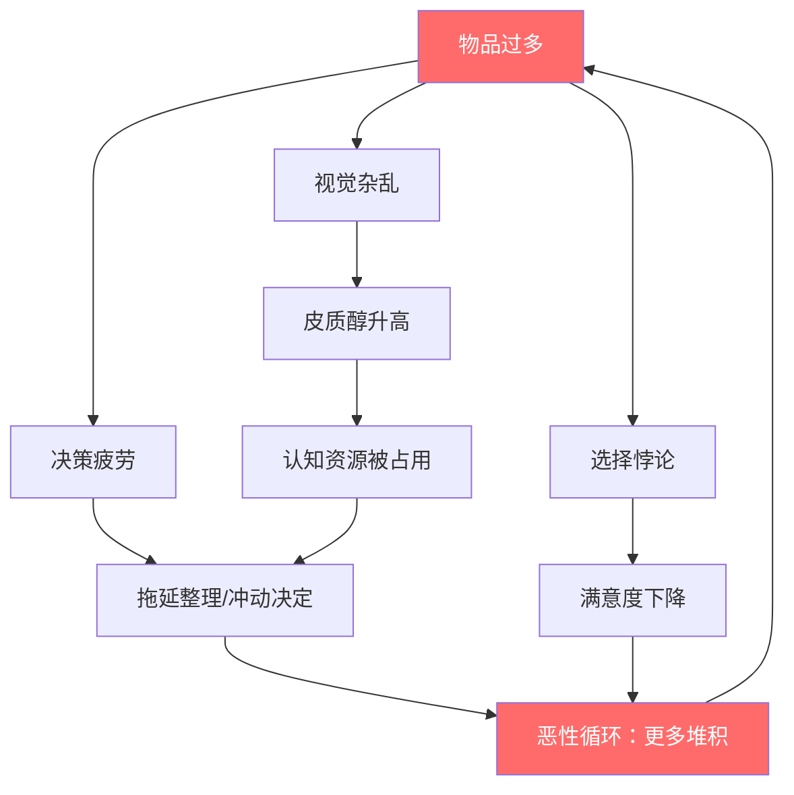
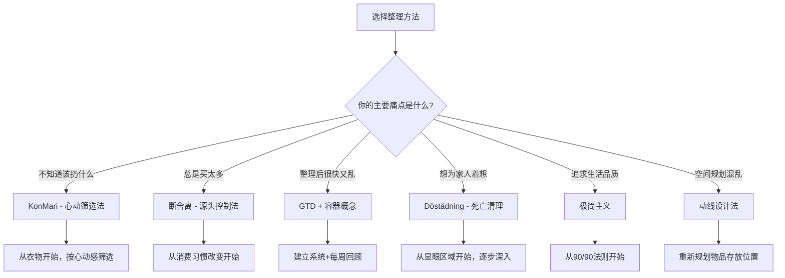

## 三、收纳整理理论

收纳整理不仅是把东西塞进柜子的技术活，更是一门融合了心理学、行为科学、空间设计和生活哲学的系统学科。本章从理论源头出发，系统梳理全球主流的整理哲学流派，深入解析其背后的科学原理，并提供可落地的实操框架，帮助你从"知道该怎么整理"跨越到"真正能整理好并维持住"。

### 3.1 整理学的科学基础

在学习具体方法之前，先理解"为什么整理这么难"——这不是意志力问题，而是有坚实的认知科学和心理学解释。

#### 3.1.1 决策疲劳（Decision Fatigue）

心理学家Roy Baumeister的研究表明，人的决策能力是一种有限资源。每次做决定（穿什么、吃什么、用什么）都会消耗认知能量。当环境中物品过多时，你每天面对的决策数量远超负荷：

| 场景 | 物品数量 | 每日隐性决策次数 |
|------|----------|------------------|
| 精简衣柜（30件） | 30 | 3-5次 |
| 普通衣柜（100件） | 100 | 15-25次 |
| 混乱衣柜（200+件） | 200+ | 30-50次 |

当决策资源耗尽后，人会倾向于两种行为：要么不做决定（继续拖延整理），要么做出糟糕的决定（冲动消费、随意丢弃）。**好的收纳系统本质上是一个决策预设机制**——提前为每类物品规划好位置，把日常决策从"这个放哪里"变成"放回原位"。

#### 3.1.2 选择悖论（The Paradox of Choice）

心理学家Barry Schwartz在《选择的悖论》中揭示：选择越多，满意度越低。应用于家居场景：

- **物品过多导致使用率下降**：面对塞满的衣柜，你反而觉得"没有衣服穿"——因为过多选项让每次选择都变成负担
- **过度囤积源于"以防万一"心态**：保留80%几乎不用的物品，"万一以后需要呢"的恐惧驱动物理层面的囤积
- **减少选择反而提升幸福度**：拥有3件真正喜欢的杯子，比拥有15件凑合的杯子带来更高的使用满足感

这一理论直接支撑了KonMari和断舍离的核心主张——减少物品数量不是损失，而是认知层面的解放。

#### 3.1.3 环境心理学（Environmental Psychology）

环境心理学研究表明，物理环境对人的心理状态有直接影响：

**视觉杂乱与压力的关系**：UCLA的一项持续性研究（Center on Everyday Lives and Families, 2012）跟踪了32个家庭，发现物品密集的家庭中，女性的皮质醇（压力激素）水平显著高于物品整洁的家庭。男性则更少受到直接影响——但这不代表他们不受影响，只是压力反应模式不同。

**空间秩序与自控力**：Princeton大学神经科学研究所的实验发现，在杂乱环境中，视觉皮层需要处理更多干扰信息，导致注意力分散和自控力下降。相反，整洁的环境能让大脑进入"低功耗待机模式"，节省认知资源用于更重要的事。

**"破窗效应"在家居中的体现**：犯罪学中的破窗理论同样适用于家居——一个区域的混乱会迅速蔓延。厨房台面放了一件不该放的东西，很快就会有第二件、第三件，直到台面完全被占满。反之，保持关键表面的整洁能形成正向的心理暗示。

#### 3.1.4 宜家效应与禀赋效应

**宜家效应（IKEA Effect）**：行为经济学家Dan Ariely发现，人们对自己参与组装/创造的物品会赋予过高价值。这意味着你DIY的、花时间整理的、亲手挑选的物品，在丢弃时会产生不成比例的心理阻力。

**禀赋效应（Endowment Effect）**：人们对已拥有的物品，会高估其价值。实验表明，同一个杯子，拥有者愿意卖出的价格是购买者愿意支付价格的两倍以上。这就是为什么"扔东西"感觉像在"亏钱"——你的大脑在用拥有者视角估值。

**应对策略**：在做取舍决定时，想象自己正在商店里，问"我现在愿意花多少钱买这件东西"，而不是"这件东西值多少钱"。视角转换能有效抵消禀赋效应的影响。



### 3.2 主流整理哲学流派

#### 3.2.1 近藤麻理惠的KonMari方法

近藤麻理惠（Marie Kondo）是日本著名的整理咨询师，5岁开始痴迷于家居杂志和收纳技巧，15岁正式开始研究整理方法论，19岁在东京大学就读期间创办整理咨询公司。她的著作《怦然心动的人生整理魔法》（The Life-Changing Magic of Tidying Up）被翻译成40多种语言，全球销量超过1300万册，Netflix节目《Tidying Up with Marie Kondo》让她成为全球家喻户晓的整理大师。

##### 3.2.1.1 核心理念：怦然心动（Spark Joy）

KonMari方法的核心理念是：**只保留让你"怦然心动"（Spark Joy）的物品**。与传统的"扔掉不需要的"不同，KonMari方法从积极的角度出发——选择留下让自己感到快乐和有意义的物品。

这种方法的心理学基础是**情感筛选**。当我们拿起一件物品并问自己"它让我怦然心动吗？"时，我们不仅在评估物品的功能价值，还在评估它与我们的情感联系。这种筛选方式比"需要还是不需要"更加直观和有效，因为它激活的是感性决策通道——对于大多数人来说，感性比理性更容易做出果断判断。

**"怦然心动"的正确操作方式**：

1. **双手握住物品**，感受身体的反应。近藤麻理惠认为身体会给出诚实的信号——感到愉悦、温暖、甚至心跳加速，就是心动
2. **将物品举到胸前**，感受重量和质感
3. **不要从"该扔什么"开始**，而是从"要留下什么"开始——先把同类物品全部集中，逐一感受
4. **对说"谢谢"**：对于要丢弃的物品，近藤建议说一句"谢谢你的陪伴"，这并非矫情，而是一种心理上的仪式化告别，降低丢弃时的内疚感

##### 3.2.1.2 六大原则

**原则一：一次性完成整理（Commit Yourself to Tidying Up）**

KonMari方法强调一次性完成整理，而非逐渐进行。这不是说要在一天内完成，而是要在一个集中的时间段内（如一个周末或一周内持续进行）完成全部整理。一次性的整理能够让你看到整体效果，建立信心和动力。零散的整理往往是"收了又乱、乱了又收"的根源——因为没有建立全局视野。

**原则二：想象理想的生活（Imagine Your Ideal Lifestyle）**

在开始整理之前，先想象你理想中的家居生活是什么样的：早上起床后的第一件事是什么？回到家后的第一个动作是什么？周末在家做什么？这个想象将成为你整理的指导原则——你选择保留的每一件物品，都应该支持你理想的生活方式。

具体操作：花10-15分钟写下你理想生活场景的5个画面，然后问自己"为了实现这些画面，我需要哪些物品？"

**原则三：先丢弃，再收纳（Finish Discarding First）**

在考虑如何收纳之前，先完成物品的筛选和丢弃。这是KonMari方法与传统收纳方法的根本区别。如果你先买收纳工具，可能会不自觉地保留更多物品来填满它们——你不是在整理，只是在重新包装混乱。

**原则四：按类别整理，而非按房间（Tidy by Category, Not by Location）**

传统的整理方式是按房间进行，但这样可能导致同类物品分散在不同房间（衣物在卧室、客厅沙发上、玄关衣帽架上），无法全面了解自己拥有的数量。KonMari方法建议按类别整理，把同一类物品从全屋各处集中到一起，一次性审视全部数量。

**原则五：遵循正确的顺序（Follow the Right Order）**

整理的顺序至关重要：**衣物 → 书籍 → 文件 → 小物品（Komono）→ 纪念品**。

这个顺序遵循一个精妙的递进逻辑——从**情感依附最低**到**情感依附最高**。衣物相对容易判断是否心动，通过练习积累判断力后，再处理更具情感重量的书籍、文件，最后面对纪念品。如果一开始就处理纪念品，很容易陷入情感漩涡而放弃整个整理过程。

**原则六：为每件物品指定位置（Give Everything a Home）**

每一件保留的物品都应该有固定的存放位置。这是维持整洁的关键——当每件物品都有"家"时，使用后归位就变得自然而然。找不到东西的根本原因是"没有固定位置"，而不是记忆力差。

##### 3.2.1.3 KonMari折叠法详解

近藤麻理惠的KonMari折叠法是她的标志性技巧之一。核心原理是将衣物折叠成小方块，**竖立**放入抽屉，而非传统的堆叠。

**与传统叠放的对比**：

| 维度 | 传统叠放（堆叠） | KonMari折叠（竖立） |
|------|------------------|---------------------|
| 可见性 | 只能看到最上面一件 | 一眼看到所有衣物 |
| 取用便利性 | 取下面的会弄乱上面的 | 任意取用不影响其他 |
| 空间利用率 | 约60-70% | 约85-95% |
| 折痕情况 | 底层衣物折痕严重 | 均匀受力，折痕少 |
| 寻找时间 | 需要翻找，平均30秒 | 目视定位，平均5秒 |

**具体步骤（以T恤为例）**：

1. 将T恤正面朝下平铺在平整表面上
2. 将左侧（含袖子）向中线折叠，袖子沿着折叠线向下折
3. 将右侧（含袖子）向中线折叠，形成一个长方形
4. 从领口端向下折叠约三分之一
5. 再折叠一次，形成一个可以竖立的小方块（约拳头大小）
6. 将小方块竖立放入抽屉

**关键技巧**：最终折叠的宽度应该等于抽屉深度的2/3到3/4，高度等于抽屉高度的2/3。这样取放时有手指操作的余量，不会把衣物弄散。

**不同衣物的折叠要点**：

- **T恤和薄上衣**：标准KonMari折叠，小方块竖立放置
- **牛仔裤和厚裤子**：先对折（前片对后片），再从裤脚向上折叠成三等分，竖立放置。注意将裆部对齐折叠线
- **连衣裙**：根据材质处理——棉质连衣裙可折叠成长方形竖立放置；真丝、雪纺等易皱材质建议使用弧形衣架悬挂
- **厚毛衣和外套**：强烈建议悬挂，折叠会产生不可逆的折痕和变形。使用带弧度的木质或毛毡衣架，避免铁丝衣架导致的肩部凸起
- **内衣**：文胸不建议折叠（会破坏罩杯形状），叠放时罩杯对罩杯，前面的背扣放入后面的罩杯内。内裤折叠成小三角或小方块竖立
- **袜子**：绝对不要卷成球——长期卷曲会破坏袜口弹性。正确做法是将两只袜子脚趾对脚跟重叠，对折一次即可

##### 3.2.1.4 KonMari方法的争议与反思

**争议一："怦然心动"标准过于主观**

"怦然心动"是一种情感判断，可能不够客观。有些人对每件物品都有感情，导致无法做出取舍。另外，对于工具类物品（螺丝刀、保险单），"怦然心动"的标准似乎不太适用。

**回应**：近藤麻理惠后来补充说，"怦然心动"不一定是心跳加速的感觉，也可以是"平静的舒适感"和"它在正确的位置上"的安定感。对于工具类物品，核心判断是"它在我的生活中是否发挥作用"——一把好用的螺丝刀同样能让人感到"怦然心动"，那是一种对功能性的满足感。

**争议二：按类别整理可能耗时过长**

将所有同类物品集中在一起（如将全屋的衣服全部堆在床上），可能会让人感到压倒性的冲击。

**回应**：这正是KonMari方法的巧妙之处——当你看到自己拥有的衣物总量时，那种"震惊感"本身就是最有效的催化剂。很多人看到堆积如山的衣物后，取舍的决心反而更坚定了。但确实需要合理安排时间，一个两居室的衣物整理大约需要4-6小时。

**争议三：不适合有孩子的家庭**

有孩子的家庭物品更多更杂，很多物品无法由一个人做决定，且孩子的需求变化快。

**回应**：近藤麻理惠后来调整了建议，承认有孩子的家庭可以分阶段进行，但仍然建议遵循按类别整理的原则。对于孩子的物品，可以按"孩子自己的物品由孩子决定（在适龄范围内）"和"家庭共用物品由主要照顾者决定"来划分权限。

#### 3.2.2 山下英子的断舍离

"断舍离"是由日本杂物管理咨询师山下英子于2000年前后提出的生活哲学。"断舍离"三个字取自瑜伽修行中的"断行·舍行·离行"概念，其核心是通过判断**物品与自己的关系**来进行取舍，从而实现生活环境和内心世界的双重整理。

山下英子在2001年出版了第一本断舍离著作，随后在日本及亚洲地区引发了广泛共鸣。她的方法论之所以在东亚文化圈尤其受欢迎，是因为它直接回应了东方文化中"惜物""不浪费"的深层心理——它不是鼓励你"扔东西"，而是帮助你"认清关系"。

##### 3.2.2.1 三个层次

**断（Dan）——断绝不需要的东西进入**

"断"是源头控制，即减少不必要的物品进入家中。这是三个层次中最主动的一步，它发生在消费环节：

- **购物前执行"72小时冷静期"**：非必需品列入愿望清单，等待72小时。研究显示，约60%的冲动购买欲望会在24小时内消退，72小时后消退率超过80%
- **拒绝免费赠品和不需要的礼物**：免费的物品并非"零成本"——它们会占据你的空间、消耗你的注意力、增加你的整理负担。接受一个免费马克杯的隐性成本是：擦拭空间（15cm²）+ 心智负担（又多了一件东西）+ 最终丢弃时的内疚
- **识别"消费触发器"**：记录下每次产生购买冲动的情境——是无聊时刷手机？是心情低落时的"安慰式消费"？还是"满减凑单"？识别触发器是切断冲动链条的第一步
- **建立"需求清单"制度**：每月初列出本月实际需要购买的物品清单，只在清单内购买

**舍（Sha）——舍弃多余的物品**

"舍"是清理现有的多余物品。判断标准不是"这个东西有没有用"，而是**"我需不需要这个东西"**。这个看似细微的差别是断舍离的精髓：

- "这个东西有用吗？"→ 几乎所有东西都有用，所以什么都舍不得扔
- "我需要这个东西吗？"→ 以我为中心判断，大部分东西其实并不需要

"舍"的具体操作需要区分三类物品：
1. **明显该扔的**：坏掉的、过期的、不完整的——果断处理
2. **犹豫不决的**：放入"待定箱"，标记日期，3个月后仍没拿出来就处理
3. **确实需要但已过时的**：拍照留念后处理实物，或送给真正需要的人

**离（Ri）——脱离对物品的执念**

"离"是最高层次，指从心理上摆脱对物品的过度依附。不再通过拥有物品来获得安全感和价值感，而是从物品的束缚中解脱出来。这是一种持续的心智状态，而非一次性的行为。

达到"离"的标志是：
- 不再因为"别人有所以我也要有"而购买
- 不再因为"扔掉可惜"而保留
- 不再因为物品多而感到满足，反而因为物品精简而感到轻松
- 能够平静地处理别人赠送的礼物（保留感激之情，不需要保留实物）

##### 3.2.2.2 断舍离的判断标准

山下英子提出了一个简单而深刻的判断标准：**不是看物品有没有用，而是看自己需不需要**。

对于每一件物品，依次问自己三个问题：

1. **这件物品我现在在用吗？**（注意关键词是"现在"，不是"以后可能会用"。"以后可能会用"是一个永远不会兑现的承诺。）
2. **这件物品让我感到愉悦吗？**（不是"扔了可惜"——"可惜"不是愉悦，而是一种基于沉没成本的损失厌恶。）
3. **如果现在没有这件物品，我会花钱买它吗？**（这是最锋利的一把刀——如果你不会花钱再买一件，说明它对你没有真正的价值。）

如果三个问题的答案都是"否"，那么这件物品应该被处理掉。

**进阶工具——"一年法则"**：如果一件物品超过一年没有被使用，那么你很可能不需要它。操作方式是：将这些物品放入一个标记日期的箱子，放在不易看到的地方（如储藏室最深处）。如果再过一年仍然没有打开这个箱子，就可以放心处理掉了。这个方法特别适合对"以防万一"心态严重的人——它给了一段缓冲期，降低了"万一以后需要"的焦虑。

##### 3.2.2.3 断舍离的心理学意义

断舍离不仅是一种整理方法，更是一种心理治疗过程。它的心理机制可以从多个角度理解：

**认知行为疗法（CBT）的视角**：断舍离的"问三个问题"本质上是一种认知重构技术——把"物品有价值所以我应该保留"这个自动化思维，替换为"我是否需要这件物品"的理性评估。通过反复练习这种思维切换，大脑会形成新的认知模式。

**正念（Mindfulness）的视角**：断舍离要求你在面对每件物品时保持"当下觉知"——不是被过去的情感或未来的恐惧驱动，而是基于当下的真实需求做决定。这与正念冥想中"观察但不评判"的训练方法高度一致。

**依附理论（Attachment Theory）的视角**：心理学家发现，对物品的过度依附往往与人际关系中的不安全依附风格相关。对物品的囤积可能是对情感不安全感的补偿——通过"拥有"来获得控制感。断舍离通过逐步减少物品依赖，间接帮助人们建立更安全的内在依附模式。

**断舍离带来的具体心理改变**：

- **重新审视自我**：通过审视物品与自己的关系，我们能够更清楚地了解自己的真实需求、价值观和生活方式。你拥有的物品是一面镜子——如果你家里堆满了打折囤货，说明你可能在追求"占便宜"带来的安全感
- **放下过去**：很多人保留旧物是因为对过去的依附——前任的礼物、大学的课本、旅行的纪念品。断舍离帮助我们接受"过去已经过去"的事实，将注意力集中在当下和未来
- **减少焦虑**：过多的物品会产生持续的、低强度的心理负担（心理学上称为"认知负荷"）。断舍离通过减少物品来减少这种隐形负担，让人感到轻松和自由
- **增强控制感**：在充满不确定性的世界中，整理自己的物品是一种完全可控的行为。这种控制感会扩散到生活的其他领域——整理好房间的人，往往也会开始整理自己的财务、健康和人际关系

##### 3.2.2.4 断舍离与消费习惯的转变

断舍离的深层价值在于它从根本上改变你与物品的关系——从消费模式的源头发生转变：

| 旧模式 | 新模式 | 转变关键 |
|--------|--------|----------|
| 以物为中心（这个东西有没有用？） | 以人为中心（我需不需要？） | 主体从"物"转向"人" |
| 追求"拥有"的满足感 | 追求"体验"的丰富性 | 从囤积转向体验 |
| 被动接受（广告驱动、促销诱惑） | 主动选择（基于真实需求） | 从消费者变为主人 |
| 追求数量（越多越好） | 追求品质（每一件都精挑细选） | 质量大于数量 |
| "万一以后用到" | "现在没有就不会买" | 活在当下 |

这种转变不是一蹴而就的。山下英子建议把它看作一个渐进过程：先通过"舍"体验到减物的轻松感，再通过"断"建立新的消费习惯，最终自然达到"离"的心理状态。

#### 3.2.3 瑞典式死亡清理（Döstädning）

"死亡清理"（Döstädning，dö = 死亡，städning = 清理）是瑞典的一种传统实践，由瑞典作家Margareta Magnusson在2018年出版的《The Gentle Art of Swedish Death Cleaning》中介绍给英语世界。这本书引发了全球范围的讨论，因为它触及了一个大多数人刻意回避的话题：**如何在生前整理好自己的物品，不让亲人承受清理遗物的痛苦**。

##### 3.2.3.1 核心理念

Döstädning的核心理念既实际又温情：**趁你还活着、还有能力做决定的时候，清理掉那些你离世后不会有人想要的东西**。这不是一种消极的"等待死亡"，而是一种积极的、为亲人着想的行为。

与KonMari和断舍离相比，Döstädning有几个显著不同：

| 维度 | KonMari | 断舍离 | Döstädning |
|------|---------|--------|------------|
| 核心判断标准 | 怦然心动 | 我是否需要 | 离世后谁会想要 |
| 时间视角 | 当下感受 | 当下需求 | 跨越生死的长远视角 |
| 主要动机 | 个人幸福感 | 自由与轻松 | 为亲人减轻负担 |
| 适合人群 | 所有人 | 所有人 | 中老年人，但所有人适用 |
| 情感难度 | 中等 | 中等 | 较高（直面死亡话题） |

##### 3.2.3.2 操作原则

**从容易的开始，从显眼的地方开始**：不要从阁楼上尘封的箱子开始——那些是最难处理的。先从客厅、厨房等日常可见的空间入手，积累经验后再处理隐蔽区域。

**建立"给谁"清单**：在整理过程中，为特定物品指定"离世后送给谁"——写在纸上或用标签标注。这不仅能减少"万一以后有用"的犹豫，还能确保你珍惜的物品去到正确的人手中。

**处理秘密物品**：Magnusson特别提到了一个实际问题——每个人都有不想被别人发现的物品（私人日记、尴尬的收藏品、不想让家人知道的购买记录）。趁自己还活着，亲自处理掉这些东西，比让亲人替你尴尬好得多。

**不要把清理变成负担转嫁**：送给别人的东西要确认对方真的想要。"这些东西给孩子们吧"很可能只是把清理的责任转嫁给了下一代——问问他们是否真的需要。

**日历标记法**：对于暂时保留的物品，在日历上标注一个日期——如果到那天还没用过，就处理掉。这个方法比"一年法则"更灵活，因为不同物品的使用周期不同。

##### 3.2.3.3 对年轻人的启示

虽然Döstädning面向中老年人，但其核心原则对所有年龄段都有价值：

- **养成"不制造负担"的习惯**：从年轻时就开始有意识地控制物品数量，不让未来为自己或他人制造清理难题
- **数字遗产意识**：你的数字账户（社交账号、邮箱、云端文件、加密货币）在你离世后如何处理？提前做好规划，包括密码管理、遗嘱数字资产清单等
- **感恩式处理**：Döstädning教会我们用感恩的心态看待物品的"生命周期"——物品陪伴了我们一段时间，当它不再被需要时，让它去到能发挥作用的地方（捐赠、赠送、回收）

#### 3.2.4 极简主义（Minimalism）运动

极简主义不仅仅是"东西少"，它是一种有意识的生活哲学——通过减少不必要的事物，为真正重要的事情腾出空间。

##### 3.2.4.1 主要流派与代表人物

**Joshua Becker的"实用极简主义"**：Becker是Becoming Minimalist博客的创始人，他的理念最适合普通家庭。他的核心主张是：极简主义不是拥有尽可能少的东西，而是只保留对有意义的生活至关重要的东西。他强调极简主义的目标不是拥有更少，而是活得更好。

**The Minimalists（Joshua Millburn和Ryan Nicodemus）**：两人从高薪却空虚的白领生活转变为极简主义布道者。他们的方法论更强调"关系"——与物品的关系、与人的关系、与自我的关系。他们的纪录片《Minimalism: A Documentary About the Important Things》在Netflix上线后影响了大量观众。

**日本极简主义代表**：除了近藤麻理惠和山下英子外，还有Sasaki Fumio（《我决定简单的生活》作者），他将个人物品减少到极致——家里的客厅只有一张桌子和一台音响。他的极端实践证明了"人真正需要的物品远比想象的少"。

##### 3.2.4.2 极简主义的核心框架

极简主义可以概括为一个简单的公式：

> **极简主义 = 自觉选择（Intentional Choice）- 不必要的（The Non-essential）**

这个公式的关键在于"自觉选择"——极简主义不是被动地匮乏，而是主动地选择。以下是它的具体应用维度：

**物质极简**：只保留真正使用和喜爱的物品。一个实用的检验标准是"90/90法则"——如果你在过去90天内没有使用过某件物品，且预计未来90天内也不会使用，那它很可能可以被处理掉。

**信息极简**：减少信息输入源。取消不看的订阅、退出不活跃的群聊、减少社交媒体使用时间。一个健康的标准是：你的信息源应该在你主动需要时提供价值，而不是被动地消耗你的注意力。

**承诺极简**：学会说"不"。每个"是"都是对其他事情的"不"。只承诺那些与你的核心价值观一致的事务。

**关系极简**：这个维度最具争议——它不是建议你减少朋友数量，而是建议你将更多精力投入到最重要的几段关系中。社会学研究（Robin Dunbar）表明，人能维持的有意义社交关系上限约为150人，其中亲密关系约5人，核心支持圈约15人。

##### 3.2.4.3 极简主义的实践阶梯

极简主义不是一步到位的，以下是一个渐进式的实践路径：

```mermaid
graph LR
    A[第1周: 明显垃圾清理] --> B[第2-3周: 重复物品合并]
    B --> C[第1月: 一年未用物品处理]
    C --> D[第2-3月: "也许"物品决定]
    D --> E[第4-6月: 情感物品整理]
    E --> F[第6月+: 持续优化与维护]
    style A fill:#4ecdc4,color:#fff
    style F fill:#ff6b6b,color:#fff
```

### 3.3 系统性整理方法论

#### 3.3.1 GTD（Getting Things Done）在家居整理中的应用

David Allen的GTD方法原本是个人效率管理系统，但其核心框架完全可以应用于家居整理。GTD的核心是**清空大脑**——把所有需要决定的事情从大脑中移出来，放入一个可靠的外部系统。

**GTD应用于整理的五步法**：

**收集（Capture）**：将全屋所有"未归位"的物品集中到一个中央区域（如客厅地板）。这一步可能会让你震惊于物品的数量——但这正是目的。同时，用纸笔记录下"这个家需要整理的区域"清单。

**处理（Process）**：对每一件物品逐一做出决定——这是最耗时也最关键的一步。GTD提供了一个精确的决策流程：

对每件物品问：
├── 这件物品需要行动吗？
│   ├── 是 → 能在2分钟内完成吗？
│   │   ├── 是 → 立即处理（如：把钥匙挂到挂钩上）
│   │   └── 否 → 延迟处理（放入"待处理区"）
│   └── 否 → 
│       ├── 有参考价值 → 存档（放入参考区）
│       ├── 以后可能需要 → 设定期限回顾（放入"也许/某天"区）
│       └── 不需要 → 丢弃/捐赠/转卖

**组织（Organize）**：为每类物品分配明确的存放区域。GTD强调的是**情境分类法**——按照物品的使用场景而非物理属性来组织。例如，与其按"电子产品"归类，不如按"在厨房使用"和"在书桌使用"来分。

**回顾（Review）**：每周花10-15分钟进行一次"家居回顾"——检查各区域的整洁度，确认是否有物品需要归位、是否有新物品需要决定去留。这是防止"再次混乱"的关键环节。

**执行（Engage）**：按照整理好的系统执行日常生活。GTD的核心信念是：当系统足够可靠时，你不需要时刻想着"整理"——它会自动运转。

#### 3.3.2 Julie Morgenstern的S.H.E.D方法

Julie Morgenstern是美国顶级整理顾问，服务过众多企业高管和名人。她的S.H.E.D方法与纯理论不同，它非常注重**可执行性**和**心理安全感**：

- **S（Sort）分类**：将物品按类别分组。但Morgenstern的分类方式不是传统的"衣物/书籍/电子产品"，而是按**功能区域**和**使用频率**双重维度分类
- **H（Heave）丢弃**：处理掉不需要的物品。Morgenstern特别强调"不要在丢弃环节停留太久"——给自己设一个计时器，每个物品最多10秒钟做决定。如果10秒内无法决定，先放入"待定区"
- **E（Embrace）拥抱**：保留真正重要的物品，并用心欣赏它们。Morgenstern认为整理不应该是"苦行"，而是"重新发现你真正珍视的东西"
- **D（Determine）决定**：为每件保留的物品指定存放位置。Morgenstern提出了一个实用原则——"使用频率决定存放位置"：每天使用的放在触手可及处，每周使用的放在柜子中间层，每月使用的放在柜子高处或低处，季节性的放在储藏区

#### 3.3.3 Dana K. White的"容器概念"（Container Concept）

Dana K. White在她的书《Decluttering at the Speed of Life》中提出了一个极具操作性的概念：**每一个收纳空间都应该被视为一个容器，容器的容量是固定的**。

这个概念的革命性在于它彻底简化了取舍标准——你不需要问"怦然心动吗"，不需要问"一年内用过吗"，只需要问一个简单的问题：**"如果保留这件东西，那我需要拿走哪件东西？"**

**容器概念的操作规则**：

1. **先选最重要的**：面对一个书架，先把最喜欢的书放上去，最后放不进去的自然就是要处理的
2. **不扩大容器**：抵制"买更大的柜子"的冲动——更大的柜子只会让你保留更多不需要的东西
3. **一处进一处出**：每买进一件新物品，就必须处理掉一件旧物品。这是最简单也最有效的物品总量控制机制
4. **从"我想留多少"出发**：不从"我应该扔多少"出发，而是从"这个抽屉/柜子/架子能舒适地容纳多少"出发

#### 3.3.4 帕累托法则（20/80法则）在整理中的应用

经济学中的帕累托法则也适用于家居整理：**我们80%的时间只使用20%的物品**。这意味着大量的物品实际上很少被使用，却占据了宝贵的存储空间。

**如何用20/80法则优化收纳**：

**识别高频使用的20%**：观察自己一周内的物品使用模式。真正高频使用的物品数量通常远少于你的想象——大概就是手机、钥匙、钱包、水杯、常用外套等二三十件东西。

**黄金位置分配**：将高频使用的20%放在**黄金区域**——即不用弯腰、不用踮脚、不用打开柜门就能拿到的位置（如玄关挂钩、床头柜、厨房台面）。

**重新评估剩余80%**：对于确实需要保留但不常用的80%物品，存放在二级区域（柜子高层、储藏室）。对于超过一年未使用的物品，认真考虑是否真的需要保留。

**实践数据**：一项对100个家庭的跟踪调查显示，普通家庭中：
- 每天使用的物品约占全部物品的8-12%
- 每周使用的物品约占20-25%
- 每月使用的物品约占15-20%
- 超过一年未使用的物品约占40-50%

这意味着，一个拥有500件物品的家庭，可能有200-250件物品一年内从未被触碰过。

### 3.4 空间规划与动线理论

收纳不仅是"往哪放"的问题，更是"空间怎么设计"的问题。好的空间规划能让物品自然归位，差的空间规划则让整理变成反复的对抗。

#### 3.4.1 动线设计（Traffic Flow Design）

动线是指人在空间中的移动路径。好的收纳设计应该**让物品靠近使用地点**，减少不必要的移动。

**核心原则：就近原则**

每个区域存放的物品应该与该区域的功能直接相关：
- **玄关**：钥匙、钱包、口罩、雨伞、购物袋——出门前最后一站、进门第一站
- **厨房**：烹饪工具、调料、碗碟——按"取→洗→切→炒→盛"的操作动线排列
- **卧室**：衣物、书籍、助眠物品——按"起床→穿衣→出门"的动线排列
- **卫生间**：洗漱用品、护肤用品、清洁用品——按使用顺序从左到右或从上到下排列
- **客厅**：遥控器、零食、纸巾、充电线——围绕沙发这个核心使用区

**动线设计的常见错误**：

1. **物品存放地与使用地分离**：外套挂在卧室衣柜里，但脱外套的动作发生在玄关——导致外套永远搭在沙发上
2. **操作路径被打断**：厨房水槽和碗柜之间隔着冰箱，每次洗完碗要走两步才能放好——久而久之碗就堆在水槽边
3. **高频物品放在深处**：每天都用的电饭煲放在橱柜最里面，每次都要蹲下伸手去拿——最终干脆放在台面上不收了

#### 3.4.2 垂直空间利用

大多数人只使用了水平空间（桌面、地面、台面），忽略了垂直空间的巨大潜力。一面墙的收纳容量远超你的想象。

**垂直空间分区**：

| 高度区间 | 名称 | 适合存放 | 取用频率 |
|----------|------|----------|----------|
| 0-40cm | 低频区 | 重物、不常用物品、换季物品 | 每月/每季 |
| 40-120cm | 黄金区 | 高频使用物品、每天/每周物品 | 每天/每周 |
| 120-180cm | 中频区 | 每周/每月使用物品 | 每周/每月 |
| 180cm以上 | 低频区 | 轻量不常用物品、行李箱等 | 每季/每年 |

**垂直收纳工具推荐**：

- **墙面挂钩/洞洞板**：适用于玄关、厨房、工具间。可灵活调整布局，不占地面空间
- **层板/置物架**：适用于衣柜、书架、储物间。增加柜内可用层数
- **磁吸收纳条**：适用于厨房刀具、工具间金属工具。取用方便，不占用抽屉空间
- **门后收纳架**：适用于卫生间、卧室门后。利用常被忽略的门背空间

#### 3.4.3 收纳容器的选择原则

错误的收纳容器比没有容器更糟糕——它们会制造"我已经整理好了"的假象，实际上只是把混乱装进了盒子里。

**选择容器的四个标准**：

1. **透明或半透明**：能看到内部物品，减少"翻找"的时间。不透明容器只适合视觉上不想看到的物品（如内衣、杂物）
2. **尺寸匹配**：容器应该刚好适合存放空间，不要"大盒装小物"——浪费空间，也不要"小盒塞大物"——物品变形
3. **可叠放**：选择方正、有叠放设计的容器，最大化利用垂直空间
4. **易取放**：如果是频繁使用的物品，选择前开式或抽拉式容器，而非需要搬下来才能打开的上开式

### 3.5 数字收纳整理

在信息时代，"收纳整理"的范畴早已超越了物理空间。数字世界的混乱同样会消耗认知资源、降低效率、增加焦虑。

#### 3.5.1 数字文件整理

**文件夹结构设计原则**：

根目录/
├── 工作/          # 按职能划分
│   ├── 项目A/     # 按项目细分
│   ├── 项目B/
│   └── 归档/      # 已完成项目的存放区
├── 个人/          # 按生活领域划分
│   ├── 财务/
│   ├── 健康/
│   └── 兴趣/
├── 资源/          # 参考资料、模板、教程
└── 临时/          # 暂存区，定期清理（建议每周一次）

**文件命名规范**：统一的命名规则是数字整理的基石。推荐格式：

`[日期]-[项目]-[描述]-[版本]`

例如：`2026-06-24-ai-guides-收纳整理理论-v3.md`

关键规则：
- 日期统一使用ISO格式（YYYY-MM-DD），保证按名称排序即按时间排序
- 避免使用空格（用连字符或下划线替代）
- 文件名中不包含特殊字符（`/ \ : * ? " < > |`）
- 版本号使用`v1, v2, v3`而非`最终版, 最终最终版, 真的最终版`

#### 3.5.2 数字信息流管理

**邮件管理——"四D法则"**：
- **Delete（删除）**：垃圾邮件、过时信息——不要犹豫
- **Do（执行）**：能在2分钟内回复的邮件，立即处理
- **Delegate（委托）**：需要他人处理的，转发后归档
- **Defer（延迟）**：需要较长时间处理的，标记为待办并设定期限

**订阅清理**：打开你的邮箱，统计收到的邮件中有多少是你真正阅读的。大多数人会发现70%以上的订阅邮件从未打开过。执行一次彻底的退订操作，然后为保留的订阅创建筛选规则，自动归类到专门的标签/文件夹中。

**照片整理**：数字照片是最大的数字囤积区。一项研究显示，普通手机用户每年拍摄约2000张照片，但真正有价值的不到10%。建议：
- 每月花30分钟做一次照片筛选，删除重复/模糊/无意义的照片
- 为值得保留的照片添加标签或放入分类相册
- 使用云存储自动备份，但定期清理云端的冗余文件

### 3.6 常见误区与纠正方法

#### 误区一：买收纳工具 = 整理

**症状**：花大量时间和金钱购买各种收纳盒、收纳架、标签机，但家里的混乱并没有真正改善。

**纠正**：收纳工具是整理的**最后一步**，不是第一步。正确的顺序是：评估 → 筛选（丢弃/捐赠）→ 规划位置 → 选择合适的收纳工具。在筛选完成之前购买收纳工具，等于给混乱穿上了整齐的外衣——表面整洁，内部依然混乱。

#### 误区二：按房间整理

**症状**：花了一整个下午整理卧室，结果第二天又乱了。因为从客厅、厨房散落回来的衣物和物品又把卧室填满了。

**纠正**：按**类别**整理，而非按房间整理。把全屋的衣物（不管在哪个房间）集中到一起，一次性处理。这样才能建立对物品总量的全局认知，避免"盲人摸象"式的局部整理。

#### 误区三：一步到位

**症状**：制定了一个雄心勃勃的计划——"这个周末把全屋整理完"，结果第一天就累得放弃，之后再也不想整理。

**纠正**：整理是一个渐进过程。如果你没有KonMari式的集中整理条件（如独居、有足够的时间），可以采用"每天15分钟"的微习惯策略：
- 第1周：每天清理一个抽屉或一个架子
- 第2周：从最容易的类别开始（如过期食品、坏掉的工具）
- 第3周：处理重复物品（3把剪刀只保留1把）
- 第4周：处理"一年未用"物品
- 持续：保持"一处进一处出"的日常习惯

#### 误区四：囤积"以防万一"

**症状**：保留了大量"万一以后用到"的物品——备用数据线、多出来的塑料袋、不知道什么设备的充电器。

**纠正**："以防万一"是整理的最大敌人。理性分析：
- 保留一件"也许用到"的物品，每年的空间成本约为50-200元（按房屋租金换算每平米成本）
- 真的需要时重新购买的成本，通常低于长期保存的成本
- 建立"信任外部供给"的心态——21世纪的城市生活，几乎任何日用品都可以在几小时内获得

#### 误区五：只整理不维护

**症状**：精心整理后的家在两周内恢复原样。反复整理、反复混乱，陷入"西西弗斯式"的循环。

**纠正**：整理是**系统工程**，不只是**清洁行为**。如果整理后不建立维护机制，混乱只是时间问题。维护机制包括：
- **每日5分钟归位**：睡前花5分钟将当天弄乱的物品归位
- **每周15分钟检查**：周末花15分钟巡视全屋，发现混乱的萌芽并及时处理
- **一处进一处出规则**：每买进一件新物品，就必须处理掉一件旧物品
- **"即时归位"习惯**：物品用完后立即放回原位，而非"先放这里，等会再收"

#### 误区六：为"未来的自己"保留

**症状**：保留着大学时的课本（"以后可能会复习"）、前公司的文件（"以后也许用到"）、瘦了以后能穿的衣服（"减肥了就穿"）。

**纠正**：心理学研究表明，"未来的自己"在大脑中几乎被当作另一个人来处理。你为"未来的自己"做的假设（会复习、会用到、会瘦）的准确率极低。尊重"现在的自己"的实际需求，而不是为一个假设的"未来自己"囤积。

### 3.7 方法论对比与选择指南

面对这么多整理方法，如何选择最适合自己的？以下是一个系统化的决策框架：



**不同生活场景的推荐组合**：

| 场景 | 推荐组合 | 理由 |
|------|----------|------|
| 刚搬新家 | 极简主义 + 动线设计 | 从零开始建立秩序的黄金时机 |
| 租房独居 | KonMari + 容器概念 | 空间有限，需要精确控制物品量 |
| 三口之家 | 断舍离 + GTD系统 | 多人共用需要系统化管理 |
| 换季大扫除 | 20/80法则 + 一年法则 | 快速识别低频物品 |
| 老年人整理 | Döstädning + 断舍离 | 温和而有意义的减物过程 |
| 搬家前清理 | 容器概念 + GTD处理流 | 效率优先，快速决策 |

### 3.8 整理的心理学进阶

#### 3.8.1 囤积障碍（Hoarding Disorder）

需要区分"东西多"和"囤积障碍"。囤积障碍在2013年被正式纳入DSM-5（精神疾病诊断与统计手册），是一种独立的精神健康诊断。

**囤积障碍的核心特征**：
- **持续性的丢弃困难**：不是"不想扔"，而是"扔不掉"——扔东西会引发真实的、强烈的焦虑和痛苦
- **物品堆积到影响生活功能**：无法正常使用厨房、卧室、浴室等生活空间
- **物品堆积导致安全隐患**：通道被阻塞、火灾风险增加、卫生状况恶化
- **严重的心理痛苦**：因囤积行为本身感到羞耻、孤立、抑郁

**自我评估参考**：如果以下描述中符合3条以上，建议寻求专业帮助：
- 丢弃物品时会感到极度焦虑或恐慌
- 家中至少有一个房间因物品堆积而无法正常使用
- 明知物品过多仍然无法停止购买或获取
- 因为家中的状况而避免邀请他人来访
- 家人或朋友对你的物品数量表示担忧

**专业帮助途径**：认知行为疗法（CBT）是目前治疗囤积障碍最有效的方法。国内部分心理咨询机构提供专门的囤积行为干预服务。

#### 3.8.2 "整理悲伤"与"解脱喜悦"

整理过程会引发真实的情绪波动，这是正常的——你不需要为此感到羞耻或困惑。

**常见的"整理悲伤"来源**：
- 处理前任相关物品时的回忆涌现
- 看到曾经高价购买但几乎没用过的物品时的后悔
- 孩子长大后婴儿用品的不舍
- 已故亲人遗物的处理困难

**应对策略**：
- **允许悲伤存在**：不要强迫自己"快点决定"。给情绪留出空间，喝杯茶，哭一场，然后继续
- **拍照留念**：对于有情感价值但不需要保留实物的物品，拍一张照片保存。照片占据的空间是0，但回忆完整保留
- **象征性保留**：如果一整箱物品都有情感价值，从中选择最有代表性的一两件保留，其余拍照后处理
- **仪式感处理**：对已故亲人的遗物，可以举办一个小型的"告别仪式"——和家人一起回忆、讲述物品背后的故事，然后共同决定去留

**"解脱喜悦"的体验**：大多数人在完成一轮整理后会报告一种强烈的轻松感和成就感。这种积极体验是维持整理习惯的最佳动力——让大脑记住"整理后的感觉真好"，它会自动推动你重复这个行为。

### 3.9 建立个人收纳系统

理解了理论之后，以下是构建个人收纳系统的完整流程：

**第一步：审计（Audit）——花1-2小时完成全屋物品清点**

| 区域 | 物品大致数量 | 混乱程度（1-10） | 最需要处理的问题 |
|------|-------------|-------------------|------------------|
| 玄关 | | | |
| 客厅 | | | |
| 厨房 | | | |
| 卧室 | | | |
| 卫生间 | | | |
| 储藏区 | | | |

**第二步：制定整理计划**

根据审计结果，按以下优先级排序：
1. 日常使用频率最高的区域（通常是厨房、卧室、卫生间）
2. 影响最大的区域（通常是玄关、客厅——第一印象区域）
3. 情感难度最低的区域（通常从工具、厨房用品开始，最后处理纪念品）

**第三步：执行整理（每区域预计2-4小时）**

每个区域的执行流程：
1. 将该区域所有物品取出，集中放在一处
2. 按"保留 / 丢弃 / 待定"三堆分类
3. 为"保留"堆中的物品规划存放位置（黄金区→中频区→低频区）
4. 将"待定"物品放入标记日期的箱子，设3个月后的日历提醒
5. 当天处理掉"丢弃"堆（不要放在门口"明天再扔"）

**第四步：建立维护系统**

- **每日**：睡前5分钟归位
- **每周**：15分钟全屋巡视
- **每月**：检查"待定箱"，处理到期物品
- **每季**：换季衣物整理 + 半年未用物品审查
- **每年**：全屋大整理（可参考Döstädning视角）

**第五步：持续优化**

收纳系统不是一成不变的——生活方式在变化，物品需求在变化，家庭成员在变化。每半年回顾一次系统，根据实际情况调整。关键是保持"一处进一处出"的总量控制机制不变。

---

**本章小结**

收纳整理理论的根源是**对人与物品关系的深层理解**。无论是KonMari的"怦然心动"、断舍离的"以人为中心"、Döstädning的"不给亲人添负担"，还是极简主义的"为重要之事腾出空间"，它们的共同指向是一致的：**物品为人服务，而非人为物品服务**。

选择哪一种方法论并不重要——重要的是**开始行动**。从今天起，打开一个抽屉，拿起一件物品，问自己："你还在为我的生活服务吗？"如果答案是否定的，就微笑着说一声"谢谢"，然后让它离开。
