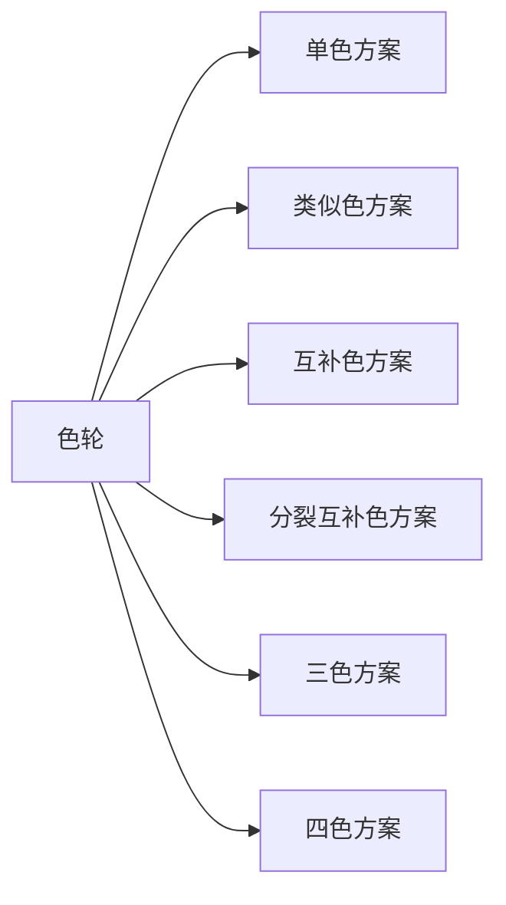
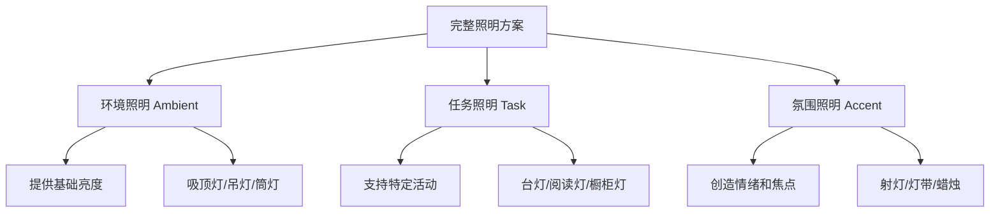

## 四、家居美学

### 4.1 家居美学的核心哲学

家居美学不是"把房子弄好看"这么简单。它是一门融合环境心理学、色彩科学、人体工程学和空间设计学的综合性实践学科。其核心目标是：**通过有意识地组织居住环境中的视觉元素，创造既美观又实用、既能放松身心又能激发活力的生活空间。**

#### 4.1.1 为什么家居美学如此重要

人一生中约有 60%-70% 的时间在家中度过。居住环境的视觉品质直接影响三个层面：

| 层面 | 影响机制 | 具体表现 |
|------|----------|----------|
| 心理层面 | 环境通过视觉皮层影响情绪中枢 | 杂乱空间→焦虑感上升；有序空间→心率降低、皮质醇下降 |
| 生理层面 | 色温、光照影响昼夜节律 | 暖光促进褪黑素分泌→助眠；冷光抑制褪黑素→提神 |
| 社交层面 | 空间布局影响人际互动模式 | 开放式布局促进交流；私密角落提供独处空间 |

环境心理学家 Roger Ulrich 的经典实验表明：术后患者如果能看到自然景色的窗户，康复速度比面对砖墙的患者快 30%，止痛药使用量减少 25%。这不是玄学，而是环境对人的生理性作用。

#### 4.1.2 道法术器四层框架

家居美学的学习和实践可以分为四个层次：

- **道——审美意识**：培养对美的感知力，理解什么是"好"的空间。这需要大量观看优秀案例、了解设计史、建立自己的审美判断体系。
- **法——设计原则**：掌握色彩、比例、对比、统一、节奏等形式美法则。这些原则是通用的，不因风格而改变。
- **术——具体技法**：学会配色方案、照明布局、材质搭配、软装陈设等具体操作方法。
- **器——工具产品**：熟悉色卡、3D 建模软件、灯光模拟工具、家居电商平台等实际工具。

大多数人的问题出在"跳过道法，直奔术器"——看了一堆网红图片就开始买买买，结果东拼西凑毫无章法。正确路径是：先建立审美意识和设计原则（本章重点），再掌握具体技法，最后用工具落地。

### 4.2 色彩理论在家居中的应用

色彩是家居美学中感知最强的元素，人类视觉信息中约 80% 与色彩相关。一个空间给人的第一印象，6 秒内就由色彩基调决定。

#### 4.2.1 色彩基础

**色轮（Color Wheel）** 是色彩理论的核心工具，由 12 种基本颜色组成：

- **原色**：红、黄、蓝（颜料/减色模型中的三原色，无法由其他颜色混合得到）
- **间色**：橙、绿、紫（各由两种原色等量混合：红+黄=橙，黄+蓝=绿，蓝+红=紫）
- **复色**：由相邻的原色和间色混合得到，如红橙、黄橙、黄绿、蓝绿、蓝紫、红紫

**色彩的三个属性**：

| 属性 | 定义 | 家居应用 |
|------|------|----------|
| 色相（Hue） | 颜色的名称，如红、蓝、绿 | 决定空间的"性格"——暖色系热情活跃，冷色系冷静沉稳 |
| 明度（Value） | 颜色的明暗程度，从黑到白 | 高明度→空间显大显轻；低明度→空间显小显重 |
| 饱和度（Saturation） | 颜色的纯度和鲜艳程度 | 高饱和→刺激兴奋；低饱和→柔和舒适 |

**色温的心理效应**：

色彩分冷暖，这是家居配色中最重要的维度。暖色系（红、橙、黄）让人感觉温暖、亲切、食欲增加；冷色系（蓝、绿、紫）让人感觉凉爽、宁静、专注。中性色（白、灰、黑、米色）是家居中最安全也最常用的底色。

实际操作建议：朝北的房间日照不足，使用暖色调（奶油色、浅橘、暖灰）补偿视觉冷感；朝南的房间阳光充足，可用冷色调（浅蓝、薄荷绿、冷灰）平衡过强的热量感知。

#### 4.2.2 六种经典配色方案

**1. 单色方案（Monochromatic）**

使用同一色相的不同明度和饱和度变化。例如：深蓝墙面 + 中蓝沙发 + 浅蓝靠垫 + 白色天花板。

- 优点：高度统一、不易出错、空间显整洁
- 风险：可能显得单调，需要通过材质和纹理变化增加层次
- 适用场景：卧室、书房等需要安静氛围的空间

**2. 类似色方案（Analogous）**

使用色轮上相邻的 2-3 种颜色。例如：蓝色 + 蓝绿色 + 绿色，或黄色 + 黄橙色 + 橙色。

- 优点：和谐自然、过渡柔和、视觉舒适
- 风险：缺乏对比和焦点，需要用明度/饱和度变化创造层次
- 适用场景：客厅、餐厅等需要温馨和谐氛围的空间

**3. 互补色方案（Complementary）**

使用色轮上正对面的两种颜色。经典组合：蓝+橙、红+绿、黄+紫。

- 优点：对比强烈、视觉冲击力强、能创造鲜明焦点
- 风险：比例失衡会显得刺眼，必须遵守"一主一辅"原则
- 适用场景：需要活力和个性的空间，如客厅、儿童房

**4. 分裂互补色方案（Split-Complementary）**

选择一种颜色，不用其互补色，而用互补色两侧的颜色。例如：蓝色 + 黄橙色 + 红橙色。

- 优点：保留对比效果但更柔和，容错率更高
- 适用场景：任何空间，是介于和谐与对比之间的最佳平衡方案

**5. 三色方案（Triadic）**

使用色轮上等距的三种颜色（间隔 120°）。例如：红+黄+蓝、橙+绿+紫。

- 优点：丰富多彩、充满活力
- 风险：三色等量使用会显得花哨，必须确定主次
- 适用场景：儿童空间、创意工作室

**6. 四色方案（矩形/正方形）**

使用两对互补色。这是最复杂的方案，需要极强的色彩控制力。

- 建议初学者避免使用，容易失控
- 高手可以通过控制各色比例（70-20-7-3）创造惊艳效果

#### 4.2.3 "60-30-10 法则"详解

这是室内设计中最经典、最实用的色彩分配法则，几乎适用于所有风格：

| 比例 | 元素 | 作用 | 选色建议 |
|------|------|------|----------|
| 60% 主色调 | 墙面、天花板、大型家具、地毯 | 营造空间的整体基调 | 通常为中性色（白、灰、米、浅驼）或低饱和色 |
| 30% 辅助色 | 窗帘、靠垫、单人椅、床品 | 丰富视觉层次，与主色调形成和谐搭配 | 可以是主色调的类似色或互补色 |
| 10% 点缀色 | 装饰品、艺术品、花瓶、书籍 | 创造视觉焦点和惊喜感 | 通常是最鲜艳、最大胆的颜色 |

**实操案例**：一个北欧风格的客厅——60% 白色墙面+浅木色地板（主色），30% 灰色沙发+浅蓝窗帘（辅助色），10% 姜黄色抱枕+绿植（点缀色）。

**常见错误**：把 60% 的主色做成鲜艳色。比如整面墙刷成大红色——第一天觉得有个性，第三天就开始视觉疲劳。主色调应该是"退后"的背景，让家具和装饰品"上前"。

#### 4.2.4 色彩与空间感知

色彩不仅是审美问题，更是空间感知的物理工具：

- **让小空间显大**：浅色系（白、浅灰、奶油色）+ 冷色调（浅蓝、薄荷绿）+ 墙地同色系减少视觉切割
- **让大空间显温馨**：暖色调 + 低明度 + 深色墙面（不要四面全深，一面深色焦点墙即可）
- **让低矮天花板显高**：天花板用比墙面浅的颜色，或者干脆全白；竖条纹壁纸拉高视觉
- **让狭长空间显宽**：短边墙用深色拉近，长边墙用浅色推远

#### 4.2.5 不同空间的色彩建议

| 空间 | 推荐色调 | 原因 | 避免 |
|------|----------|------|------|
| 卧室 | 蓝色、淡紫、暖灰、米白 | 促进放松和睡眠 | 高饱和红/橙（刺激神经系统） |
| 客厅 | 中性色为主，辅助色灵活 | 接待功能需要包容性 | 全黑全白（极端色调限制家具选择） |
| 厨房 | 白色、浅灰、淡黄、浅木色 | 提升食欲和清洁感 | 深蓝/深绿（抑制食欲） |
| 书房 | 浅绿、浅蓝、灰色 | 提升专注力 | 高饱和暖色（分散注意力） |
| 儿童房 | 柔和的多彩色 | 激发想象力但不过度刺激 | 纯黑/纯白（缺乏刺激） |
| 卫生间 | 白色、浅灰、淡蓝 | 传达清洁和宁静感 | 深色地砖（水垢明显） |

### 4.3 家居风格系统

家居风格是色彩、材质、家具形态和空间布局的综合表达。了解各风格的核心基因，才能真正"活用"而不是"照搬"。

#### 4.3.1 现代简约风格（Modern Minimalism）

**历史渊源**：起源于 20 世纪初的包豪斯运动（Bauhaus），核心理念是"形式服从功能"（Form follows function）。代表人物：密斯·凡·德·罗、勒·柯布西耶。

**设计基因**：

| 维度 | 特征 |
|------|------|
| 线条 | 水平和垂直直线为主，极少曲线 |
| 色彩 | 黑、白、灰为骨架，辅以单一亮色点缀 |
| 材质 | 玻璃、金属、混凝土、皮革——工业感材质 |
| 家具 | 几何造型、无多余装饰、强调结构本身的美感 |
| 收纳 | "藏"的艺术——一切杂物入柜，表面尽可能空 |

**适合人群**：追求效率和秩序、不喜欢视觉噪音、"少即是多"信仰者。

**注意事项**：纯现代简约容易显得"冷"。加入木质元素（原木茶几、木地板）和织物（羊毛毯、亚麻靠垫）是必要的"升温"手段。

#### 4.3.2 北欧风格（Scandinavian）

**设计基因**：

| 维度 | 特征 |
|------|------|
| 核心理念 | "Hygge"（丹麦语，意为舒适惬意的幸福感） |
| 色彩 | 白色为基调（占 60-70%），搭配灰色、米色、淡蓝/淡粉 |
| 材质 | 浅色木材（白橡木、白蜡木、松木）、棉麻、羊毛、皮革 |
| 光线 | 极度重视自然光——窗帘轻薄或不装窗帘；人工光用暖色调 |
| 家具 | 造型简洁但线条柔和，有圆角和曲线，不像现代简约那么"硬" |
| 装饰 | 绿植、蜡烛、编织物、极简艺术画 |

**为什么北欧风格全球流行**：它解决了现代简约"太冷"和传统风格"太重"之间的矛盾。简洁但不冰冷，温暖但不繁琐，是大多数人的"安全牌"。

**常见误区**：北欧风格 ≠ 全白。纯白色空间像医院病房，必须用木质、纺织品和少量色彩打破单调。

#### 4.3.3 日式风格（Japanese / 和风）

**设计基因**：

| 维度 | 特征 |
|------|------|
| 核心理念 | "侘寂"（Wabi-sabi）——在不完美和无常中发现美 |
| 色彩 | 原木色、白、米、灰——极度克制的自然色系 |
| 材质 | 木材、竹、纸（障子纸）、棉麻、陶土 |
| 空间 | "间"（Ma）——留白即内容，空间本身就是设计元素 |
| 家具 | 低矮——贴近地面，强调人与大地的连接 |
| 元素 | 榻榻米、障子门、枯山水、花道 |

**关键区别——日式 vs 北欧**：两者都追求简洁和自然，但气质不同。北欧更"暖"、更"社交"；日式更"静"、更"内省"。北欧的空间是"邀请你坐下喝杯热可可"，日式的空间是"请在这里安静地喝茶"。

#### 4.3.4 工业风格（Industrial）

**历史渊源**：源于 20 世纪 60-70 年代纽约 SoHo 区，艺术家将废弃工厂改造为工作室和住宅，无意中开创了一种美学流派。

**设计基因**：

| 维度 | 特征 |
|------|------|
| 结构 | 暴露的砖墙、管道、横梁、通风管道——"建筑骨架即装饰" |
| 色彩 | 灰、黑、铁锈色、砖红、深棕——沉稳粗犷 |
| 材质 | 金属（铁、钢）、混凝土、旧木材、皮革 |
| 家具 | 铁艺框架、做旧木质桌面、铆钉细节 |
| 灯具 | 爱迪生灯泡、金属吊灯、射灯轨道 |

**适用条件**：挑高空间（3m 以上）效果最佳；层高不足 2.8m 的普通公寓做工业风容易显得压抑。可以通过"轻工业风"——保留部分元素（铁艺家具、裸砖贴片）但不做全屋处理——来适配普通住宅。

#### 4.3.5 中式风格（Chinese Style）

中式风格分为两大流派，不能混为一谈：

| 维度 | 传统中式 | 新中式 |
|------|----------|--------|
| 核心 | 明清家具美学，对称、厚重、礼制 | 传统元素的现代演绎，简洁、留白、意境 |
| 色彩 | 深红、深棕、金色、黑色 | 以灰、白、原木为主，点缀朱红/靛蓝 |
| 材质 | 红木、紫檀、花梨、丝绸、陶瓷 | 原木、棉麻、黄铜、水磨石 |
| 家具 | 明式圈椅、罗汉床、博古架 | 传统造型的简化版，更轻盈更实用 |
| 适合人群 | 传统文化爱好者、中式大宅 | 喜欢东方意境但不想太"重"的年轻群体 |

**新中式是当前的主流趋势**。它保留了中式美学的精髓（对称、留白、意境），但用更简洁的方式表达，避免了传统中式"像博物馆"的问题。

#### 4.3.6 混搭风格（Eclectic）

混搭是最高级也最危险的风格——做好了叫"有品味"，做砸了叫"大杂烩"。

**混搭的核心法则——"70-20-10 统一原则"**：

- **70% 统一元素**：确定一个主风格和统一的色彩基调（比如都是低饱和色系）
- **20% 辅助风格**：引入第二种风格的关键元素作为丰富
- **10% 意外元素**：一个不按常理出牌的装饰品，创造惊喜

**混搭的安全组合**：

- 北欧 + 日式（共享简洁和自然基因）
- 现代简约 + 工业（共享冷硬和功能基因）
- 新中式 + 日式（共享东方意境和留白基因）

**混搭的危险组合**：

- 传统中式 + 洛可可（两者都追求繁复装饰，冲突而非互补）
- 工业风 + 田园风（一个粗犷一个柔美，除非控制力极强）

#### 4.3.7 其他值得关注的风格

| 风格 | 核心特征 | 关键词 |
|------|----------|--------|
| 法式轻奢 | 石膏线条、丝绒材质、金铜色金属件、对称布局 | 优雅、精致、不过度 |
| 美式风格 | 实木家具、壁炉、布艺沙发、开放式厨房 | 舒适、实用、家庭感 |
| 侘寂风 | 手工质感、不规则形态、自然老化、极度留白 | 残缺、无常、静谧 |
| 赛博朋克 | 霓虹灯、深色基底、科技感材质、大胆撞色 | 未来、暗黑、酷 |

### 4.4 照明设计——家居美学的"灵魂"

如果只能改变家居中的一样东西来提升美感，答案是照明。同样的家具和墙面，在暖色灯光和冷色荧光灯下，观感可以天差地别。

#### 4.4.1 三种照明层次

专业的照明设计必须包含三个层次，缺一不可：

**环境照明（Ambient Lighting）**：空间的"底光"，确保基本可见度。

- 常见形式：吸顶灯、吊灯、嵌入式筒灯、灯槽
- 亮度标准：客厅 150-300 lux，卧室 100-150 lux，厨房 300-500 lux
- 核心要求：均匀、无死角、不刺眼

**任务照明（Task Lighting）**：为特定活动提供集中的光照。

- 常见形式：台灯、落地阅读灯、橱柜下灯带、镜前灯
- 亮度标准：阅读/工作 500-750 lux，厨房操作台 500 lux
- 核心要求：光束集中、不产生阴影干扰、色温匹配活动性质

**氛围照明（Accent Lighting）**：空间的"情绪调节器"。

- 常见形式：射灯（照画/照植物）、灯带（柜底/天花凹槽）、蜡烛、壁灯
- 亮度标准：通常比环境光低，起装饰作用
- 核心要求：创造层次感、突出重点、营造特定情绪

#### 4.4.2 色温选择指南

色温（单位：开尔文 K）是照明设计中最被低估的变量：

| 色温 | 感受 | 适用空间 | 注意事项 |
|------|------|----------|----------|
| 2200-2700K | 极暖，类似烛光 | 卧室、餐厅、壁炉旁 | 不适合需要精细辨色的活动 |
| 2700-3000K | 暖白，类似白炽灯 | 客厅、卧室、酒店大堂 | 最通用的家居色温 |
| 3500-4000K | 中性白 | 厨房、卫生间、办公室 | 兼顾舒适和清晰 |
| 5000-6500K | 日光白/冷白 | 医院、工作室（需要高显色） | 家居中慎用，会让人感觉"像医院" |

**关键原则**：同一个开放空间中，所有灯具的色温差不超过 500K。混用 2700K 和 4000K 的灯，空间会显得"脏"和不协调。

#### 4.4.3 各空间照明方案

**客厅**：
- 环境：吸顶灯或吊灯（2700-3000K）+ 天花灯槽
- 任务：沙发旁落地阅读灯
- 氛围：电视背景墙灯带、射灯照画/照绿植
- 进阶：调光器——看电视时调暗 50%，聚会时全亮

**卧室**：
- 环境：吸顶灯（2700K）或间接灯槽
- 任务：床头壁灯或台灯（可独立开关）
- 氛围：床底灯带（夜起照明）
- 避免：正对床的强光源

**厨房**：
- 环境：嵌入式筒灯（3500-4000K），间距 80-120cm
- 任务：橱柜下方灯带（操作台照明，500 lux 以上）
- 关键：操作台不能有身体投影挡住光线——灯装在操作台正上方或前方

**卫生间**：
- 镜前灯：两侧垂直灯带优于顶部灯（顶部灯会在眼窝和下巴产生阴影）
- 色温：3500-4000K（太暖看不清妆容细节，太冷像太平间）

#### 4.4.4 智能照明系统

智能照明不是"用手机关灯"这么简单。其真正的价值在于**场景化控制**：

- **起床场景**：灯光从 0% 渐亮到 60%，色温从 2200K 过渡到 4000K，模拟日出
- **工作场景**：桌面灯 5000K + 100%，其余区域 4000K + 30%
- **晚餐场景**：餐厅吊灯 2700K + 60%，其余区域 2700K + 20%
- **电影场景**：电视墙灯带 2200K + 10%，其余全灭

入门方案：小米 Yeelight / 宜家 TRÅDFRI 系列，单灯 50-150 元，网关 200 元左右。进阶方案：Philips Hue 生态，单灯 200-400 元，色彩和稳定性更优。

### 4.5 材质与质感——触觉维度的美学

大多数家居指南只谈"看"，忽略了"摸"。但人对空间的感知是多感官的——手摸到实木桌面的温润，和摸到贴皮桌面的滑腻，大脑给出的"品质信号"完全不同。

#### 4.5.1 常用材质特性对照

| 材质 | 触感 | 视觉感受 | 心理联想 | 价格区间 | 维护难度 |
|------|------|----------|----------|----------|----------|
| 实木 | 温润、有纹理感 | 温暖、自然 | 亲切、质朴 | 中-高 | 中（需防潮防裂） |
| 金属（铁/钢） | 冰冷、光滑 | 冷硬、现代 | 精确、工业 | 低-中 | 低（需防锈） |
| 玻璃 | 冰冷、光滑 | 通透、轻盈 | 现代、洁净 | 低-中 | 中（需常擦） |
| 大理石 | 冰冷、光滑 | 高级、大气 | 奢华、永恒 | 高 | 中（需防渗色） |
| 棉麻织物 | 柔软、有纹理 | 自然、舒适 | 放松、温馨 | 低-中 | 中（需定期清洗） |
| 皮革 | 柔韧、有温度 | 质感、高级 | 品味、成熟 | 中-高 | 高（需保养） |
| 丝绒 | 顺滑、有光泽 | 优雅、丰富 | 奢华、复古 | 中 | 高（易留痕） |
| 水泥/微水泥 | 粗糙/细腻可控 | 灰调、现代 | 工业、素朴 | 中 | 低 |

#### 4.5.2 材质搭配的四条原则

**原则一：3-5 种材质组合**

一个空间中使用 3-5 种材质是最佳平衡。少于 3 种显得单调，多于 5 种显得杂乱。

**原则二：软硬平衡**

每个视线范围内应该同时有"硬"材质和"软"材质。硬沙发旁边放软地毯；玻璃茶几上放编织收纳篮；水泥墙面前摆布艺沙发。

**原则三：哑光为主，亮面点缀**

大面积使用哑光/磨砂材质（减少反光疲劳），小面积用亮面材质提亮（金属边框、玻璃器皿、丝绒靠垫）。

**原则四：材质的"温度"要一致**

同冷同暖。冰冷的大理石台面搭配温暖的藤编椅，反而比搭配金属椅更有层次——因为"自然材质"是它们的共同基因。

### 4.6 比例、尺度与空间构图

#### 4.6.1 黄金比例（1:1.618）

黄金比例在家居中的应用：

- **墙面分割**：装饰画挂墙面上方 1/3 处（约 0.618 高度处），而不是正中央
- **家具比例**：茶几长度约为沙发长度的 2/3（接近黄金比的近似值）
- **装饰品组合**：高低不同的花瓶组合，高度比接近 1:1.618 最和谐

但不要过度迷信精确数值。黄金比例的本质是"不对称的平衡"——人的视觉系统对略不对称的构图比完全对称更感兴趣。

#### 4.6.2 人体工程学关键尺寸

| 家具 | 关键尺寸 | 原理 |
|------|----------|------|
| 餐椅座高 | 43-45cm | 脚平放地面，大腿与地面平行 |
| 餐桌高 | 72-76cm | 前臂自然下垂可放桌面 |
| 沙发座深 | 50-60cm | 背部能靠到靠背，膝盖不悬空 |
| 沙发座高 | 38-45cm | 起身不费力 |
| 床面高 | 45-55cm（含床垫） | 坐在床边时膝盖自然弯曲 90° |
| 书桌高 | 72-76cm | 标准工作高度，配合可调椅使用 |
| 电视距离 | 屏幕对角线 × 1.5-2.5 | 距离太近伤眼，太远看不清细节 |

#### 4.6.3 家具与空间的比例法则

**"留白法则"**：家具占地面积不超过房间面积的 60%。也就是说，一个 20㎡ 的客厅，所有家具的占地投影面积应控制在 12㎡ 以内。剩下的 8㎡ 是动线和留白空间。

**"视觉重量"平衡**：不要把所有"重"（大件、深色、实体）的家具放在同一侧。深色大书柜放在北墙，南墙就用浅色落地灯或绿植来平衡。

**"错落有致"法则**：同一条视线上，物品的高度应该有变化。一排书架上，不要所有格子都塞满等高的书——穿插花瓶、相框、小雕塑，创造高低起伏的天际线。

### 4.7 绿植与自然元素——把自然请进家

#### 4.7.1 为什么自然元素如此重要

环境心理学中的"亲生物设计"（Biophilic Design）理论认为：人类有与生俱来的亲近自然的倾向。在室内引入自然元素，可以降低压力荷尔蒙水平 15%-25%，提高工作效率 8%-15%（来源：Terrapin Bright Green 研究报告）。

#### 4.7.2 室内绿植选择指南

| 植物 | 光照需求 | 养护难度 | 美学特点 | 最佳位置 |
|------|----------|----------|----------|----------|
| 龟背竹 | 散射光 | 低 | 大叶热带感，空间填充力强 | 客厅角落、沙发旁 |
| 琴叶榕 | 明亮散射光 | 中 | 挺拔优雅，现代感强 | 客厅、玄关 |
| 橡皮树 | 散射光 | 低 | 叶片厚实有光泽，质感高级 | 客厅、书房 |
| 绿萝 | 弱光-散射光 | 极低 | 攀援/垂吊，灵活百搭 | 书架、冰箱顶、浴室 |
| 虎皮兰 | 弱光-强光 | 极低 | 线条感强，夜间释放氧气 | 卧室、书房 |
| 多肉植物 | 强散射光 | 低 | 小巧精致，品种丰富 | 窗台、书桌 |
| 吊兰 | 散射光 | 低 | 垂吊飘逸，净化空气 | 高处悬挂 |
| 常春藤 | 弱光-散射光 | 低 | 攀援能力强，覆盖性好 | 书架、墙面 |

**新手起步建议**：先养 2-3 盆"杀不死"的植物（绿萝、虎皮兰、吊兰），积累信心后再挑战进阶品种。

#### 4.7.3 绿植的陈列美学

- **高低组合**：地面大盆（龟背竹）+ 桌面中盆（多肉组合）+ 悬挂小盆（空气凤梨），形成三个层次
- **奇数法则**：同一平面摆放 3 盆或 5 盆比 2 盆或 4 盆更自然——因为自然界中不存在完美的对称
- **叶形对比**：大叶（龟背竹）搭配细叶（文竹），阔叶（琴叶榕）搭配针叶（尤加利），避免所有植物都是同一种叶形

#### 4.7.4 其他自然元素

- **水元素**：桌面小型流水装置——流水声有白噪音效果，助眠减压
- **天然石材**：原石摆件、鹅卵石托盘——增加空间的"地气"
- **木质元素**：原木切片做托盘、枯枝做装饰——带入森林气息
- **干花/永生花**：比鲜花持久，比假花真实，适合没时间养花的人

### 4.8 软装与陈设——最后的"点睛"

硬装是骨架，软装是灵魂。同一个空间，换一套窗帘、靠垫和挂画，气质可以完全不同。

#### 4.8.1 软装的核心元素

| 元素 | 功能 | 选购要点 |
|------|------|----------|
| 窗帘 | 控光+隐私+空间分割+视觉重量 | 宁大勿小——宽度 = 窗宽 × 1.5-2 倍，落地款显层高 |
| 地毯 | 定义区域+脚感舒适+吸音 | 大于家具组合面积，前腿至少踩上地毯 15cm |
| 靠垫 | 色彩点缀+舒适度+季节更换 | 尺寸混搭（45×45 + 30×50 + 30×30），数量奇数 |
| 挂画 | 创造焦点+表达个性 | 画中心线在视线高度（离地 145-155cm），组合画间距 5-8cm |
| 花瓶/器皿 | 点缀+立体装饰 | 不插花时也是独立的艺术品 |

#### 4.8.2 "三角构图法"陈设

桌面或台面上的装饰品摆放，使用三角构图最稳定也最美观：

1. 选一件最高的物品（花瓶/台灯）放在一侧
2. 选一件中等高度的物品（书籍/烛台）放在另一侧
3. 选一件最矮的物品（小盆栽/装饰碗）放在两者之间偏前方

三者连线形成一个三角形，从正面看有明确的高度层次和前后深度。

#### 4.8.3 "减法"的艺术

家居美学的终极修炼不是"加"，而是"减"。每一个放在外面的物品都在消耗注意力资源。定期审视家中的装饰品：

- 这件东西是否仍然让我感到愉悦？
- 它是否与整体空间风格协调？
- 移除它后空间是否更舒适？

如果三个问题中有两个答案是否定的，就该收起来或送走。少而精，永远好过多而杂。

### 4.9 常见误区与纠正

| 误区 | 问题 | 纠正方案 |
|------|------|----------|
| 全屋只用一盏主灯 | 空间缺乏层次，灯光平淡 | 增加任务灯和氛围灯，至少 3 个光源点 |
| 家具全靠墙摆放 | 空间中间"空洞"，缺乏亲密感 | 沙发可以离墙 10-20cm，或用书架/矮柜做空间分割 |
| 窗帘只装到窗户下沿 | 视觉上压低层高 | 窗帘从天花板垂到地面，显高效果立竿见影 |
| 所有装饰品高度相同 | 视觉平淡，没有节奏感 | 制造高低落差，用三角构图法 |
| 盲目追随网红风格 | 与自己的生活习惯冲突 | 先想清楚"我怎么住"，再想"怎么好看" |
| 装饰画挂得太高 | 像在"参观美术馆"而非"住在家里" | 画的中心线对齐视线（离地 145-155cm） |
| 买太多小装饰品 | "碎片化"视觉，显得杂乱 | 用少量大件装饰品替代大量小件 |
| 只看效果图不量尺寸 | 买回来的家具不是太大就是太小 | 用纸箱/报纸按 1:1 摆放在现场感受尺寸 |

### 4.10 不同预算的美学提升方案

家居美学不是有钱人的专利。在不同预算下，都有性价比最高的改善策略：

**预算 500 元以内——"低成本高回报"改动**：

- 更换靠垫套（200 元/4 个）—— 客厅色彩焕然一新
- 添加 2-3 盆绿植 + 简约花盆（150 元）—— 空间立刻有生命力
- 整理收纳 + 断舍离（0 元，只花时间）—— 最被低估的"改造"

**预算 2000 元以内——"质变级"改动**：

- 更换全屋窗帘（800-1500 元）—— 对空间气质影响最大的单项投资
- 添加 2-3 盏氛围灯（300-500 元）—— 一个灯带 + 一个落地灯就能改变客厅气质
- 一幅有品质的装饰画（200-400 元）—— 比十幅廉价打印画更有力量

**预算 5000 元以内——"系统级"改善**：

- 一面焦点墙的改造（墙漆/壁纸/文化砖，1000-2000 元）
- 一块好地毯（1000-2000 元）—— 脚感和视觉双重提升
- 智能照明系统入门（1000-1500 元）—— 场景化灯光是质的飞跃

**核心理念**：先改"最常看"和"最大面积"的元素——墙面、灯光、窗帘。这三个改好，80% 的效果就出来了。不要把预算分散在各种小装饰品上。

### 4.11 季节性微调——让家"活"起来

家不应该是一成不变的。随着季节变化做小幅度调整，既保持新鲜感，又不需要大动干戈：

| 季节 | 色调调整 | 材质调整 | 具体操作 |
|------|----------|----------|----------|
| 春季 | 加入嫩绿、浅粉 | 换上轻薄棉麻 | 换浅色靠垫套，摆放鲜花 |
| 夏季 | 加入白色、浅蓝 | 减少厚重织物 | 收起毛毯，换亚麻窗帘 |
| 秋季 | 加入姜黄、赤陶 | 增加温暖织物 | 铺上针织毯，摆放干花 |
| 冬季 | 加入酒红、深绿 | 增加厚实触感 | 多放靠垫和毛毯，点蜡烛 |

每次调整花费不超过 200-300 元，但能让空间始终有"季节的呼吸感"。

***
