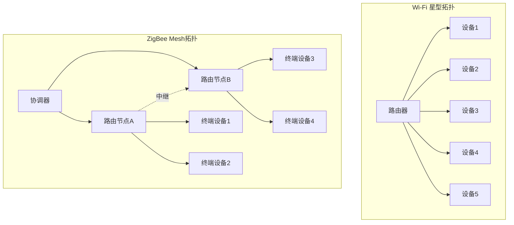
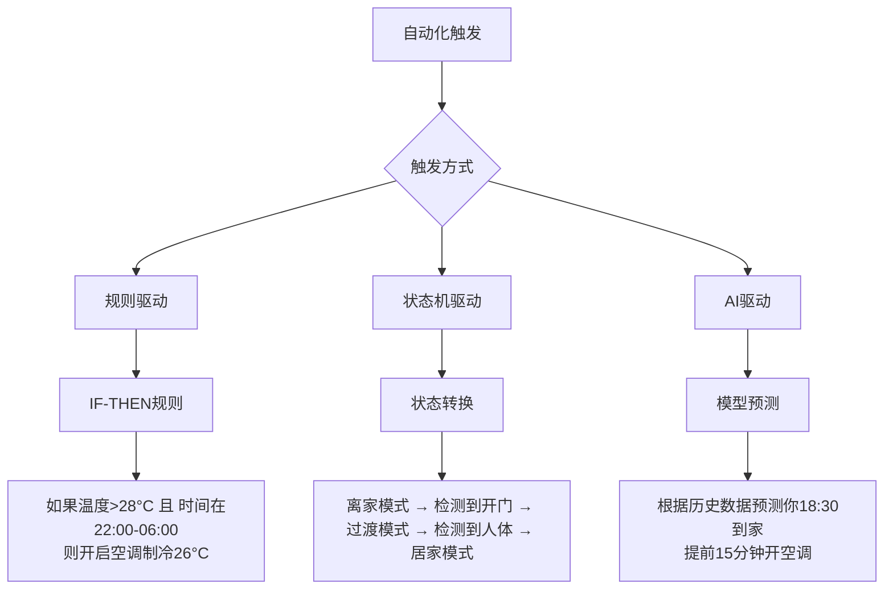
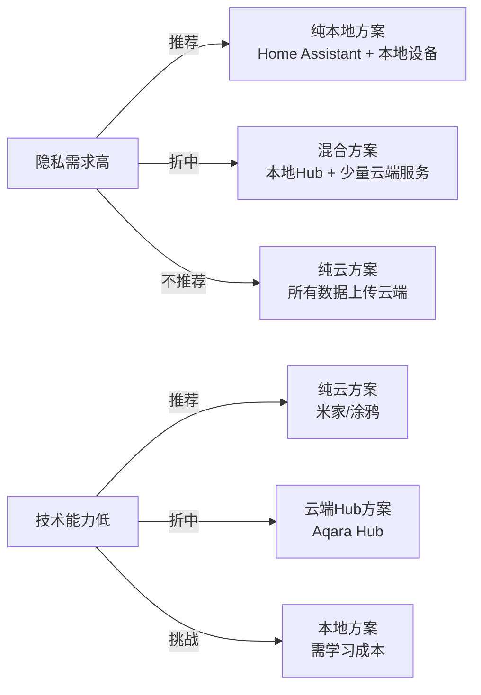
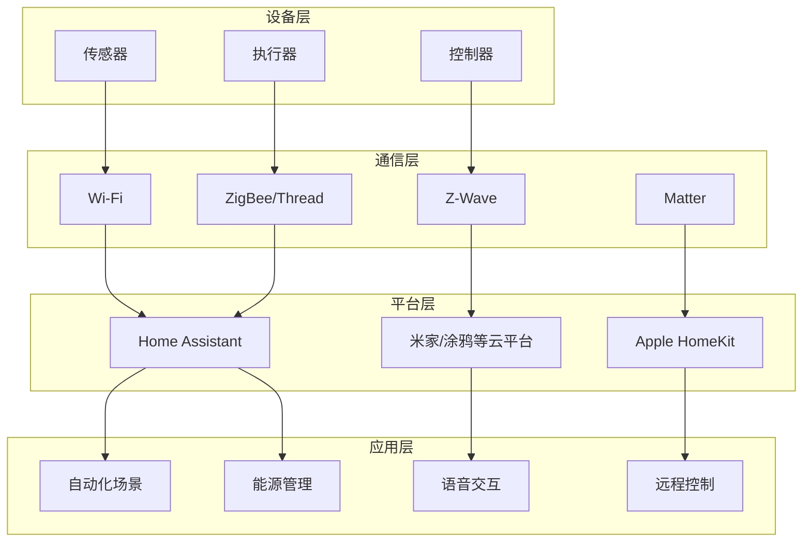

## 五、智能家居技术

智能家居不是把几个灯泡换成手机能控制的就完事了。它本质上是一套**家庭物联网系统**——传感器采集数据、网关处理逻辑、执行器完成动作，三者形成闭环。理解这个闭环中的每一个技术环节，才能在选购、部署、排障时做出正确判断，而不是被营销话术牵着走。

本章聚焦**技术原理和底层逻辑**，不涉及具体产品推荐（见产品推荐篇）和落地方案设计（见具体方案篇）。读完本章，你将具备独立评估任何智能家居产品或方案的技术能力。

### 5.1 智能家居的技术演进

智能家居并非一夜之间出现，它经历了四次范式跃迁，每次跃迁都伴随着核心通信技术和计算模式的变革。

| 阶段 | 时间 | 核心技术 | 控制方式 | 典型代表 | 局限性 |
|------|------|---------|---------|---------|--------|
| 电子化 | 1970s-1990s | 有线总线（X10、RS-485） | 物理开关、定时器 | X10电力载波系统 | 布线复杂、扩展性差、单向控制 |
| 网络化 | 2000s | Wi-Fi普及、ZigBee/Z-Wave出现 | 手机APP远程控制 | 早期SmartThings、Nest恒温器 | 协议碎片化、设备间互不通信 |
| 智能化 | 2010s | 云服务+传感器+语音助手 | 语音控制、简单自动化 | Alexa、Google Home、小米AIoT | 强依赖云端、隐私担忧、延迟高 |
| AI原生 | 2020s+ | Matter/Thread+边缘AI+大模型 | 场景感知、主动服务 | Home Assistant、Apple Intelligence | 标准仍在完善、生态割裂 |

每一次跃迁解决的都是上一阶段的核心痛点：X10解决了"不能远程控制"，Wi-Fi解决了"布线限制"，Matter解决了"协议碎片化"。但每次解决旧问题的同时也引入新问题——这就是为什么智能家居发展了50年，至今仍然没有一个"终极方案"。

理解这段历史的价值在于：当你看到某个品牌宣称"革命性创新"时，你能判断它到底是在解决真实的底层问题，还是在换一层包装卖旧技术。

### 5.2 通信协议深度解析

通信协议是智能家居的神经系统。选错协议，轻则设备响应慢、经常掉线，重则整个系统需要推倒重来。这不是玄学，是物理层的硬约束。

#### 5.2.1 协议全景对比

| 协议 | 频段 | 理论速率 | 有效距离 | 功耗 | 网络拓扑 | 单网络设备上限 | 典型延迟 | 适用场景 |
|------|------|---------|---------|------|---------|--------------|---------|---------|
| Wi-Fi 6 | 2.4/5GHz | 9.6Gbps | 30-70m | 高（50-200mA） | 星型 | 取决于路由器 | 1-10ms | 摄像头、音箱、电视等高带宽设备 |
| BLE 5.3 | 2.4GHz | 2Mbps | 30-50m | 极低（5-15mA） | 星型/网状 | 无限（广播模式） | 6-15ms | 传感器、手环、近场控制 |
| ZigBee 3.0 | 2.4GHz | 250Kbps | 10-30m | 低（10-30mA） | 网状 | 65,000 | 15-30ms | 灯具、开关、传感器 |
| Z-Wave LR | 868/908MHz | 100Kbps | 30-100m | 低（10-20mA） | 网状 | 4,000 | 20-40ms | 门锁、恒温器、传感器 |
| Thread | 2.4GHz | 250Kbps | 10-30m | 低（10-30mA） | 网状 | 250 | 15-30ms | Matter设备的底层承载 |
| Matter | 基于底层协议 | 取决于底层 | 取决于底层 | 取决于底层 | 取决于底层 | 取决于底层 | 取决于底层 | 跨生态统一应用层协议 |
| KNX | 双绞线/电力线/RF | 9.6Kbps | 有线无限制 | 不适用 | 总线/星型/树型 | 65,535 | <10ms | 全屋有线方案、商业建筑 |

**关键认知纠偏**：

**Matter 不是一个无线协议**。这是最常见的误解。Matter是运行在Wi-Fi、Thread、以太网之上的**应用层标准**（类似HTTP之于TCP/IP）。它解决的是"小米的灯泡能不能被苹果的HomePod控制"这个应用层互操作问题，而不是"信号怎么传"这个物理层问题。理解这一点，你就不会在看到"Matter over Thread"和"Matter over Wi-Fi"时感到困惑——Matter管"说什么语言"，Thread/Wi-Fi管"用什么通道传话"。

**ZigBee和Z-Wave不是过时技术**。虽然Matter是趋势，但截至2025年，全球已有超过5亿ZigBee设备在运行。ZigBee的mesh自组网能力成熟稳定，Z-Wave的sub-GHz频段干扰少、穿墙强。在Matter生态完全成熟之前（预计2027-2028年），这些协议仍然是可靠的选择。

**Wi-Fi设备的"瓶颈"不在速率，在连接数**。普通家用路由器通常只能稳定支持30-50个同时连接的IoT设备。当设备数量超过这个阈值，会出现随机掉线、响应迟缓等问题。解决方案是使用企业级AP（如Ubiquiti、TP-Link Omada系列），单AP可稳定支持200+设备，或者将IoT设备隔离到独立的2.4GHz VLAN。

#### 5.2.2 协议选择决策树

你的设备需要什么？
│
├── 高带宽（视频/音频流） → Wi-Fi
│   └── 摄像头、音箱、电视、投影仪
│
├── 低功耗+电池供电 → BLE 或 ZigBee 或 Z-Wave
│   ├── 只需要单向广播（温度上报） → BLE
│   ├── 需要mesh组网（大面积覆盖） → ZigBee
│   └── 需要穿墙+少干扰 → Z-Wave（sub-GHz）
│
├── 跨生态互操作 → Matter
│   └── Matter over Thread（推荐）或 Matter over Wi-Fi
│
└── 全屋有线+极高可靠性 → KNX
    └── 别墅/大平层，预算充足，追求稳定性

#### 5.2.3 Mesh网络：为什么ZigBee比Wi-Fi更适合大量IoT设备

ZigBee和Thread都采用mesh（网状）拓扑，这是它们相对于Wi-Fi星型拓扑的核心优势。

Mesh网络的核心优势：

- **自愈能力**：某条路径断开，数据自动选择其他路径。ZigBee协议内置了AODV（按需距离矢量路由）算法，能在毫秒级完成路由重建。
- **扩展性**：每个路由节点（通常是插电设备，如智能插座）都能充当信号中继器，网络覆盖范围随设备增加而扩大。一个典型的三居室部署15-20个ZigBee设备后，信号覆盖基本无死角。
- **低功耗**：终端设备（如传感器）只在有数据时才唤醒通信，电池寿命可达2-5年。ZigBee终端设备的电池消耗比同等功能的Wi-Fi设备低10-100倍。

**Mesh网络的注意事项**：

ZigBee终端设备（End Device）不转发数据，只有路由节点（Router）才能做中继。所以在规划网络时，确保每个房间至少有一个插电的ZigBee路由设备（智能插座、智能灯泡等），而不是只放电池供电的传感器。

### 5.3 传感器技术：智能家居的感知层

传感器是智能家居的"五官"。没有传感器，智能家居就只是一个遥控器集合。传感器的选型直接决定了自动化场景的上限。

#### 5.3.1 核心传感器技术参数对比

| 传感器类型 | 核心参数 | 检测原理 | 精度/范围 | 响应时间 | 典型功耗 | 电池寿命 | 价格区间（元） |
|-----------|---------|---------|----------|---------|---------|---------|-------------|
| 人体存在传感器 | 检测距离、角度 | PIR红外/mmWave毫米波 | PIR:5-8m/120° mmWave:6m/120° | PIR:1-2s mmWave:<0.5s | PIR:10μA mmWave:50mA | PIR:2年 mmWave:需供电 | 30-200 |
| 温湿度传感器 | 精度、采样频率 | 电容式/电阻式 | ±0.3°C/±2%RH | 1-10s | 10-50μA | 2-3年 | 20-80 |
| 光照传感器 | 量程、精度 | 光敏二极管/光电二极管 | 0-100,000lux/±5% | <1s | 5-20μA | 2-3年 | 15-50 |
| 门窗传感器 | 检测方式、间距 | 干簧管/霍尔效应 | 开合检测/间距<20mm | <0.5s | 5-15μA | 2-3年 | 15-40 |
| 烟雾传感器 | 检测类型、灵敏度 | 光电式/离子式 | 按浓度阈值报警 | 10-30s | 10-50μA（待机） | 3-5年 | 30-150 |
| 水浸传感器 | 检测灵敏度 | 电极式/光电式 | 浸水深度>1mm | <1s | 5-20μA | 2-3年 | 20-60 |
| 空气质量传感器 | 检测参数 | 激光散射/电化学 | PM2.5/TVOC/CO2 | 10-60s | 50-200mA | 需持续供电 | 80-300 |

#### 5.3.2 人体传感器的技术选型：PIR vs mmWave

这是2023-2025年智能家居领域最重要的技术迭代之一。传统PIR（被动红外）传感器正在被mmWave（毫米波）传感器取代，但两者并非简单的"好与坏"关系。

**PIR传感器的工作原理**：检测人体发出的红外辐射变化。人移动时，热辐射在传感器探测区域内产生明暗变化，触发报警。

核心局限：
- **只能检测移动**：你坐在沙发上看书不动，PIR认为房间里没人，灯就灭了。这是用户投诉最多的问题。
- **受温度影响**：夏天室内外温差小，PIR灵敏度下降。
- **无法测距**：只知道"有人"，不知道"人在哪、多远"。

**mmWave传感器的工作原理**：发射毫米波（60GHz频段），通过分析反射波的多普勒频移来检测人体，包括微小的呼吸和心跳运动。

核心优势：
- **静止检测**：能检测到静坐、睡眠中的人体，不会误关灯。
- **测距测速**：能精确知道人体距离和移动速度，可定义"有人进入2米范围"这样的精细规则。
- **多目标跟踪**：同时追踪房间内多个人体的位置和运动状态。

核心局限：
- **功耗高**：持续供电，不适合电池方案。
- **成本高**：单个传感器80-200元，是PIR的3-5倍。
- **穿墙问题**：毫米波可能穿透薄墙误检测隔壁房间的人。需要调节灵敏度和检测区域。

**选型建议**：

| 场景 | 推荐方案 | 原因 |
|------|---------|------|
| 走廊、卫生间（短暂使用） | PIR | 人在移动，PIR够用且省电 |
| 客厅、书房（长时间停留） | mmWave | 需要检测静坐状态 |
| 卧室（睡眠检测） | mmWave | 需要检测呼吸/翻身 |
| 户外/阳台 | PIR | mmWave在户外受干扰大 |
| 大面积覆盖（>20m²） | 多个PIR+1个mmWave | 成本和覆盖的平衡 |

#### 5.3.3 传感器部署的关键原则

传感器不是买了随便一放就行的。部署位置和角度直接决定检测效果。

**人体传感器部署要点**：

- **PIR传感器**：安装高度2.0-2.4米，探测方向与人体移动方向**垂直**（不要对着人走来的方向，要对着人横向经过的方向），避免正对窗户（阳光干扰）、空调出风口（温度变化干扰）、暖气片。
- **mmWave传感器**：安装高度2.0-2.5米，微微朝下倾斜15-30°，覆盖主要活动区域。通过APP调节检测区域边界，排除隔壁房间或走廊的误触发。

**温湿度传感器部署要点**：

- 远离热源（冰箱侧面、路由器、电视背后）至少50cm
- 避免阳光直射
- 避免空调/风扇直吹
- 卧室建议放在床头柜高度（0.5-1m），而非天花板（热空气上升，温度偏高1-3°C）

### 5.4 自动化引擎：让设备"思考"

自动化是智能家居的灵魂。没有自动化的智能家居只是"手机遥控器"。理解自动化引擎的工作原理，你才能设计出真正省心的场景，而不是制造更多需要手动触发的"伪自动化"。

#### 5.4.1 自动化的三种范式

**规则驱动**（Rule-based）：最基础也最可靠。IF条件A且条件B，则执行动作C。所有主流平台（Home Assistant、米家、HomeKit）都支持。

优势：确定性强，你知道触发条件和结果，调试简单。
劣势：条件组合爆炸。当场景复杂时，规则数量指数增长，维护成本极高。

实际例子：一个"回家模式"可能需要的规则：
- 如果门锁打开 → 开玄关灯
- 如果门锁打开且时间在18:00-22:00 → 开客厅灯
- 如果门锁打开且温度>28°C → 开空调
- 如果门锁打开且温度<18°C → 开暖气
- 如果门锁打开且PM2.5>75 → 开空气净化器

5个规则已经是简化版了。真实的回家模式可能涉及20+条规则。

**状态机驱动**（State Machine）：将家庭视为一个有限状态机，每个"模式"是一个状态（居家、离家、睡眠、起床、工作等），状态之间的转换由事件触发。

优势：逻辑清晰，一次定义"睡眠模式"的所有行为，不用写20条分散的规则。
劣势：状态之间切换时的过渡逻辑容易出错（比如从"睡眠"突然切换到"离家"，灯光怎么处理？）。

**AI驱动**：通过机器学习模型预测用户行为，自动调整设备状态。这是2024-2025年的热点方向。

优势：无需手动定义规则，系统自主学习。
劣势：黑箱决策，可能出现误判（比如预测你要出门，结果你只是去阳台收衣服）。当前阶段AI驱动的自动化准确率约85-92%，对灯光这种可接受错误的场景够用，对门锁、安防等关键场景仍需人工确认。

#### 5.4.2 自动化设计的"金字塔原则"

一个好的自动化系统应该遵循金字塔结构：

            ┌─────────────┐
            │   AI预测层   │  ← 5%场景：天气预报联动、行为预测
            │  (可选/增强)  │
            ├─────────────┤
            │   状态模式层  │  ← 20%场景：离家/居家/睡眠等大模式
            │  (推荐配置)   │
            ├─────────────┤
            │   事件规则层  │  ← 75%场景：传感器触发→设备响应
            │  (必须配置)   │
            └─────────────┘

**底层（75%）**：基于传感器事件的简单IF-THEN规则。这是最稳定、最可靠的部分。例子：人体传感器检测到人 → 开灯；离开2分钟 → 关灯。

**中层（20%）**：基于时间/状态的模式切换。通过一个"离家"按钮或手机定位触发整个家进入离家模式：关闭所有灯光、空调调到节能温度、开启安防布防、关闭窗帘。

**顶层（5%）**：AI增强。可选配置，用于优化能源消耗、预测需求等。比如根据天气预报自动调整空调提前制冷时间，或根据你的日历自动准备"会议模式"。

**为什么这个比例很重要**：很多新手犯的错误是上来就搞AI、搞复杂联动，结果基础的传感器规则都没配好，导致系统不稳定。把80%的精力放在底层规则上，它们才是日常使用中真正被触发的自动化。

#### 5.4.3 条件触发的常见陷阱

**陷阱1：时间窗口遗漏**

规则：每天18:00开客厅灯
问题：18:05手动关了灯，18:30灯又被自动开了（如果你写了18:00-23:00持续检查的规则）

正确做法：使用"触发器+条件"分离模式。触发器只在特定时间点触发一次，条件检查当前状态是否需要执行。

**陷阱2：传感器抖动**

人体传感器在边缘区域可能出现反复触发/失触发的"抖动"。解决方案：
- 设置**去抖动时间**（debounce），即触发后短时间内不重复触发
- 使用**延时确认**：持续检测到人3秒以上才认为"有人"，瞬间的信号忽略

**陷阱3：自动化冲突**

两条自动化规则同时操作同一个设备：
- 规则A：检测到人 → 开灯（亮度100%）
- 规则B：时间22:00后 → 灯亮度调为30%

22:05有人走过，规则A触发开灯100%，规则B立刻调到30%。用户体验是灯闪了一下变暗。

解决方案：定义明确的**优先级**，或合并为一条规则（22:00后检测到人 → 开灯30%）。

### 5.5 中枢架构：云端 vs 本地 vs 边缘

智能家居系统的"大脑"放在哪里，直接决定了响应速度、隐私安全和离线可用性。

#### 5.5.1 三种架构对比

| 维度 | 纯云方案 | 本地Hub方案 | 纯本地方案 |
|------|---------|------------|-----------|
| 典型代表 | 米家APP直连、涂鸦智能 | SmartThings Hub、Aqara Hub | Home Assistant、Hubitat |
| 指令路径 | 手机→云端→设备 | 手机→Hub→设备 | 控制面板→设备 |
| 典型延迟 | 200-800ms | 50-200ms | 10-50ms |
| 离线可用性 | 不可用 | 部分可用 | 完全可用 |
| 隐私风险 | 高（数据上传云端） | 中（数据在Hub，不上传） | 低（数据不出局域网） |
| 功能更新 | 云端自动更新 | Hub固件更新 | 用户手动更新 |
| 开放性 | 低（厂商锁定） | 中（有限API） | 高（完全开放） |
| 技术门槛 | 低 | 中 | 高 |
| 月均成本 | 0-50元（云存储等） | 0元 | 0元（硬件一次投入） |

#### 5.5.2 Home Assistant：本地化的标杆

Home Assistant（HA）是目前最成熟的开源智能家居平台，全球活跃安装量超过100万。它值得单独讨论，因为理解HA的技术架构，就理解了"本地化智能家居"的完整技术栈。

**技术架构**：

┌──────────────────────────────────────────────┐
│              前端 (Lovelace UI)               │
├──────────────────────────────────────────────┤
│         自动化引擎 (Automations/Scripts)       │
├──────────┬───────────┬───────────────────────┤
│ 集成层   │  设备抽象层 │    事件总线 (Event Bus) │
│(Integrations)│(Entity)│                       │
├──────────┴───────────┴───────────────────────┤
│              操作系统 (HassOS/Linux)          │
├──────────────────────────────────────────────┤
│     硬件 (树莓派4/5、x86小主机、虚拟机)        │
└──────────────────────────────────────────────┘

**核心概念**：

- **Entity（实体）**：HA中每个设备、传感器、开关都被抽象为一个Entity。每个Entity有状态（on/off/25°C等）和属性（亮度、色温等）。
- **Integration（集成）**：连接不同品牌/协议设备的桥梁。HA有3000+个官方集成，覆盖几乎所有主流品牌。集成负责将不同协议的数据统一为Entity。
- **Automation（自动化）**：基于触发器（Trigger）→条件（Condition）→动作（Action）的三段式结构。
- **Event Bus（事件总线）**：所有状态变化都作为事件广播，任何组件都能监听。这是HA架构的核心——松耦合的事件驱动设计。

**硬件选择建议**：

| 硬件方案 | 价格 | 性能 | 适合场景 | 功耗 |
|---------|------|------|---------|------|
| 树莓派4B (4GB) | 400-600元 | 中 | 入门（<50设备） | 5W |
| 树莓派5 (8GB) | 600-900元 | 中高 | 中等规模（50-150设备） | 8W |
| Intel N100小主机 | 800-1500元 | 高 | 大规模（150+设备）+AI推理 | 15-25W |
| 旧笔记本/台式机 | 0元 | 取决于配置 | 临时方案/实验 | 30-60W |
| NAS上运行Docker | 已有硬件 | 取决于NAS | 已有NAS的用户 | 共享NAS功耗 |

**树莓派方案的注意事项**：

树莓派使用microSD卡作为系统盘，而HA会频繁写入数据库（设备状态日志）。SD卡的写入寿命有限（约10-50TBW），高强度使用1-2年后可能损坏。建议：
- 使用**工业级高耐久SD卡**（如三星PRO Endurance、SanDisk MAX Endurance）
- 或者将数据库迁移到**外部USB SSD**，SD卡只保留系统

### 5.6 网络架构：智能家居的底层基础设施

网络是智能家居的"地基"。地基不稳，上面建什么都是白搭。智能家居对家庭网络的要求与普通上网完全不同。

#### 5.6.1 IoT设备的网络特点

IoT设备与手机、电脑的网络行为差异巨大：

| 特征 | 普通设备（手机/电脑） | IoT设备 |
|------|-------------------|---------|
| 连接数 | 1-3个 | 30-100+个 |
| 数据量 | 大（视频/网页） | 小（状态上报，几KB/次） |
| 通信模式 | 请求-响应 | 持续心跳+事件上报 |
| 安全性 | 较高（自动更新） | 低（固件可能永不更新） |
| DNS需求 | 正常 | 部分会大量查询DNS或硬编码IP |

#### 5.6.2 IoT VLAN隔离：为什么要做、怎么做

将IoT设备放在独立的VLAN（虚拟局域网）中，是安全和稳定性的最佳实践。

**为什么必须隔离**：

1. **安全风险**：IoT设备固件安全质量参差不齐。一个被入侵的智能灯泡可能成为攻击整个家庭网络的跳板。2016年的Mirai僵尸网络就是通过入侵IoT设备发起DDoS攻击的典型案例。
2. **广播风暴**：大量IoT设备的心跳包和mDNS广播可能造成网络拥塞，影响手机和电脑的正常网络体验。
3. **隐私保护**：部分IoT设备会向厂商服务器发送大量数据（包括你的Wi-Fi SSID、MAC地址、使用习惯等），隔离后可以精确控制哪些设备能访问外网。

**基本架构**：

互联网
  │
  │ (WAN)
  │
路由器/Firewall
  │
  ├── VLAN 1: 主网络（手机、电脑、NAS）— 192.168.1.0/24
  │     └── 可访问所有VLAN
  │
  ├── VLAN 20: IoT设备（智能灯、传感器、摄像头）— 192.168.20.0/24
  │     └── 只能访问Home Assistant服务器 + 必要的云端服务
  │
  └── VLAN 30: 访客网络 — 192.168.30.0/24
        └── 只能访问互联网，不能访问内网

**防火墙规则要点**：

- IoT VLAN → 主网络：只允许访问Home Assistant服务器的IP和端口（8123）
- IoT VLAN → 互联网：根据设备需要开放（部分设备如米家需要访问小米云端）
- IoT VLAN → IoT VLAN：允许（ZigBee设备间的mesh通信可能需要）
- 主网络 → IoT VLAN：允许（方便管理和调试）
- 访客网络 → IoT VLAN：禁止

**所需设备**：

实现VLAN隔离需要支持802.1Q VLAN的路由器和AP。推荐方案：
- 软路由（OpenWrt/OPNsense）+ 企业级AP（Ubiquiti/TP-Link Omada）
- 或支持VLAN的Mesh路由系统（如Ubiquiti UniFi Dream Router）

#### 5.6.3 DNS和mDNS的坑

很多智能家居设备使用mDNS（多播DNS）进行设备发现，比如HomeKit设备的`_hap._tcp.local`发现、Chromecast的`_googlecast._tcp.local`发现。

**常见问题**：mDNS使用多播地址224.0.0.251，TTL=1，默认不跨VLAN传播。如果你把Home Assistant放在主网络VLAN，IoT设备放在IoT VLAN，HA可能无法自动发现IoT设备。

**解决方案**：
- 在路由器上配置mDNS反射器（Avahi/mdns-reflector），让mDNS包跨VLAN传递
- 或者在HA中手动配置设备IP，不依赖自动发现

### 5.7 安全与隐私：被忽视的核心议题

智能家居设备深入家庭最私密的空间——卧室、浴室、客厅。安全和隐私不是可选项，而是必须认真对待的硬需求。

#### 5.7.1 威胁模型分析

| 威胁类型 | 具体场景 | 风险等级 | 影响范围 |
|---------|---------|---------|---------|
| 设备劫持 | 入侵摄像头窥视家庭 | 严重 | 隐私泄露 |
| 数据窃听 | 截获传感器数据推断生活习惯 | 高 | 隐私泄露 |
| 僵尸网络 | 设备被招募为DDoS攻击节点 | 中 | 网络性能 |
| 未授权访问 | 他人控制你的智能门锁 | 严重 | 人身安全 |
| 云端数据泄露 | 厂商服务器被入侵 | 高 | 全量数据 |
| 固件后门 | 设备固件内置后门 | 中 | 持续性风险 |

#### 5.7.2 安全加固清单

**网络层**：
- [ ] IoT设备隔离到独立VLAN
- [ ] 关闭IoT设备不需要的外网访问
- [ ] 使用DNS-over-HTTPS，防止DNS查询被监听
- [ ] 定期检查路由器连接设备列表，发现未知设备

**设备层**：
- [ ] 修改所有设备的默认密码（即使是"建议使用APP设置"的设备，也检查是否有默认Web管理页面）
- [ ] 关闭设备不需要的功能（如摄像头的UPnP、DDNS）
- [ ] 开启固件自动更新（如果支持）
- [ ] 对于不更新固件的设备，设为最高风险等级，优先考虑替换

**平台层**：
- [ ] Home Assistant：启用HTTPS、使用强密码、开启双因素认证
- [ ] 云端平台：使用独立邮箱注册、强密码、双因素认证
- [ ] 定期审计平台的第三方集成权限

**隐私层**：
- [ ] 审查每个设备的数据收集政策
- [ ] 不需要语音功能时物理关闭麦克风（不仅仅是软件静音）
- [ ] 摄像头加装物理遮挡盖（不用时遮住）
- [ ] 定期清理云端存储的视频/音频记录

#### 5.7.3 本地化 vs 云端的隐私权衡

没有"完美"的方案。纯本地方案隐私最好但技术门槛最高，纯云方案最省心但隐私风险最大。关键是**了解权衡，做出知情选择**。

### 5.8 语音交互技术

语音是智能家居最自然的交互方式，但也是技术挑战最大的。

#### 5.8.1 语音交互的完整流程

用户说话 → 麦克风阵列拾音 → 噪声消除(AEC/BF) → 唤醒词检测(KWS)
    → 语音识别(ASR) → 自然语言理解(NLU) → 意图解析 → 设备控制 → 语音反馈(TTS)

每个环节的技术选型都影响最终体验：

- **麦克风阵列**：2-8个麦克风组成阵列，通过波束成形（Beamforming）技术增强目标方向的声音、抑制环境噪声。4麦阵列是主流，可在3-5米距离内准确拾音。
- **唤醒词检测**：本地运行的小型神经网络，负责检测"小爱同学""Alexa"等唤醒词。误唤醒率（没人说话时误触发）和漏唤醒率（说了唤醒词没反应）是两个关键指标。
- **ASR（语音识别）**：将语音转为文字。云端ASR准确率>97%，本地ASR约92-95%（但离线可用）。
- **NLU（自然语言理解）**：理解用户意图。"把灯调暗一点"→意图：调光，设备：灯，动作：降低亮度。中文NLU的难点在于省略和指代——"太亮了"省略了主语"灯"，"开那个"需要上下文理解"那个"是什么。

#### 5.8.2 语音控制的局限性

语音不是万能的，它有明确的适用边界：

**适合语音控制的场景**：
- 手被占用时（做饭、抱着东西）
- 临时性的一次性操作（"开灯""关空调"）
- 信息查询（"今天天气怎么样"）

**不适合语音控制的场景**：
- 精确数值调节（"调到亮度67%"——你说不清、它听不准）
- 复杂的多步骤操作（"把客厅灯调到暖色40%亮度，卧室灯关掉，空调调到26度"——太长太容易出错）
- 需要隐私的场景（深夜不想说话打扰家人）
- 高频重复操作（每天进门都喊一声"我回来了"，几天就烦了）

**核心结论**：语音是智能家居的**补充**交互方式，不是主要方式。真正好的自动化应该"无感"——不需要你发出任何指令，系统根据传感器数据自动完成操作。如果你每天需要喊10次以上语音指令，说明你的自动化设计有问题。

### 5.9 能源管理：智能家居的绿色价值

智能家居除了便利性，还有一个被严重低估的价值——**能源优化**。

#### 5.9.1 智能家居的节能量化

根据国际能源署（IEA）和多项学术研究的数据：

| 应用 | 节能幅度 | 机制 | 年节省估算（三居室） |
|------|---------|------|-------------------|
| 智能恒温器 | 10-23%供暖/制冷 | 根据人员存在和偏好自动调温 | 500-1500元 |
| 智能照明 | 20-50%照明用电 | 自动关灯+调光+日光利用 | 100-300元 |
| 智能插座/用电监测 | 5-15%总用电 | 消除待机功耗+识别高耗电设备 | 200-500元 |
| 智能窗帘 | 5-12%制冷负荷 | 夏季自动遮阳、冬季利用日照 | 200-600元 |
| 综合能源管理 | 15-30%总能耗 | 多系统联动优化 | 1000-3000元/年 |

以一个年电费4000元的三居室家庭为例，部署智能能源管理后每年可节省约1000-3000元。如果计入设备投入（约2000-5000元），2-3年可回本，此后持续产生净收益。

#### 5.9.2 能源优化的关键自动化策略

**策略1：人员感知+温度联动**

触发：所有人体传感器30分钟无人 → 
动作：空调切换到节能模式（夏天调高2°C/冬天调低2°C）

触发：任意人体传感器检测到人 →
动作：空调恢复舒适温度

这个简单的规则通常能节省15-20%的空调能耗。30分钟的延迟是为了避免短暂离开（如去卫生间）就触发温度变化。

**策略2：电价分时联动**

如果你所在地区实行峰谷电价（峰时电价可能是谷时的2-3倍），可以将高耗电任务安排在谷电时段：
- 谷电时段（通常22:00-08:00）自动启动洗衣机、洗碗机、充电桩
- 峰电时段减少大功率设备的使用

**策略3：日光利用**

触发：光照传感器检测到室内光照>300lux →
动作：关闭该区域人工照明

触发：光照传感器检测到室内光照<200lux 且 时间在日出后到日落前 →
动作：打开电动窗帘至最大采光位置

### 5.10 智能家居的常见技术误区

#### 误区1：买了一堆设备就是智能家居了

设备堆砌 ≠ 智能家居。如果你买了20个智能设备，每个都需要单独打开APP操作，你只是把20个遥控器变成了20个APP——更麻烦了。

**正解**：先设计自动化场景，再根据场景需求选择设备。自动化是目的，设备是手段。

#### 误区2：追求"全屋智能"一步到位

"全屋智能"是营销概念，不是技术概念。没有哪个家庭真的需要100个设备同时在线。

**正解**：从最痛的痛点开始，一个场景一个场景地扩展。第一个场景的投入产出比，决定了你是否值得继续投入。

#### 误区3：只看品牌不看协议

"我家全是小米的"——这不是选择生态的理由。如果小米的某款传感器精度不够、某款灯泡不支持色温调节，硬凑只会降低体验。

**正解**：以需求为中心选择设备，以协议兼容性为约束。同一生态内选择是"加分项"而非"必选项"。Matter标准的普及将进一步降低这个约束。

#### 误区4：忽视网络基础设施

买了几千块的智能设备，却用着运营商送的光猫兼任路由器，Wi-Fi信号穿过两堵墙后只剩一格。

**正解**：网络是智能家居的基础设施，基础设施投入应该优先于设备投入。一个稳定的家庭网络（企业级AP + 合理的布线）比多买10个传感器更有价值。

#### 误区5：认为本地方案一定比云端好

本地方案确实隐私更好、延迟更低，但也有局限：你需要自己维护系统（备份、更新、排障），遇到问题没有客服可找。

**正解**：根据你的技术能力和时间精力选择方案。如果你不愿意花时间折腾，一个靠谱的云方案（如Apple HomeKit）可能比一个维护不善的本地方案体验更好。

#### 误区6：忽略设备的物理安全

智能门锁的密码被别人看到、摄像头对着卧室床铺、智能音箱放在浴室里……

**正解**：物理安全是数字安全的前提。摄像头不要对着卧室和浴室；智能音箱在敏感时段物理静音；门锁的密码定期更换，不在他人面前输入。

### 5.11 智能家居的前沿趋势

#### 5.11.1 Matter标准的全面落地

Matter由Apple、Google、Amazon、Samsung等联合推出，目标是"一个设备，所有平台控制"。2022年发布1.0版本，2024年已更新到1.4版本，支持的设备类型从最初的灯泡、插座扩展到了摄像头、扫地机器人、冰箱、洗衣机等。

Matter的关键技术特性：
- **多管理员**：同一个Matter设备可以同时被Apple Home、Google Home、Amazon Alexa控制，不需要选择"阵营"
- **本地优先**：Matter设备默认在局域网内通信，云端是可选增强
- **桥接器**：通过Matter桥接器，旧的ZigBee/Z-Wave设备也能被Matter平台控制

**现实挑战**：Matter标准仍在快速迭代中，不同厂商的实现存在差异（"Matter兼容"不等于"Matter完美"）。建议在2026-2027年关注Matter 2.0的发布，届时设备兼容性和功能覆盖将达到生产可用水平。

#### 5.11.2 大模型与智能家居的融合

2024-2025年，大语言模型（LLM）开始与智能家居深度融合：

- **自然语言自动化**：用自然语言描述场景，AI自动生成自动化规则。"每天日落前半小时关窗帘，日落后开客厅灯"→AI自动解析为触发器、条件、动作。
- **上下文理解**：理解模糊指令。"我要睡觉了"→AI综合当前时间、你的习惯、设备状态，自动执行完整的睡眠模式。
- **异常推理**：不是简单的"烟雾浓度>阈值"报警，而是"烟雾浓度升高 + 灶具开启 + 时间在做饭时段"→判断为正常烹饪，不报警。

#### 5.11.3 健康监测的家居化

智能家居正在成为家庭健康监测的载体：

- **智能床垫**：通过压力传感器和微动检测，监测心率、呼吸率、翻身次数、睡眠分期（深睡/浅睡/REM），精度已接近医疗级设备（误差<10%）。
- **智能马桶**：通过尿液分析传感器，检测尿糖、尿蛋白、pH值等指标，实现糖尿病和肾病的日常筛查。
- **环境健康联动**：CO2浓度过高自动开新风、湿度低于30%自动开加湿器、PM2.5超标自动关窗开净化器——这些已经是可以立即实现的成熟方案。

### 5.12 技术选型决策框架

在面对海量的智能家居产品和技术方案时，一个清晰的决策框架能帮你避免冲动消费和选择焦虑。

#### 5.12.1 选型五维评估法

对任何智能家居设备或方案，从五个维度评估：

| 维度 | 权重 | 评估问题 |
|------|------|---------|
| 实用性 | 30% | 它解决了什么实际问题？不用它会怎样？ |
| 可靠性 | 25% | 离线能用吗？掉线了怎么办？有无物理备份方案？ |
| 兼容性 | 20% | 能和现有设备联动吗？支持什么协议？ |
| 隐私性 | 15% | 数据存在哪里？上传了什么？能关闭云端吗？ |
| 可维护性 | 10% | 固件更新频率？电池多久换一次？坏了怎么修？ |

**关键原则**：实用性权重最高。一个"很酷但没用"的设备（如智能冰箱的触屏），不如一个"不起眼但天天用"的设备（如智能门锁）。

#### 5.12.2 投入产出的量化思考

智能家居是一项投资，和任何投资一样需要考虑投入产出比。

**推荐的投入优先级**（按投入产出比排序）：

| 优先级 | 设备 | 典型投入 | 核心价值 | 回报周期 |
|--------|------|---------|---------|---------|
| 1 | 智能门锁 | 800-2000元 | 便利+安全 | 立即 |
| 2 | 智能照明 | 500-1500元 | 便利+氛围+节能 | 1-3月 |
| 3 | 扫地机器人 | 1500-4000元 | 节省时间（每天30-60分钟） | 1-3月 |
| 4 | 智能温控 | 500-2000元 | 舒适+节能 | 3-6月 |
| 5 | 智能安防 | 1000-3000元 | 安全感 | 即时 |
| 6 | 智能窗帘 | 800-2000元 | 便利+节能 | 6-12月 |
| 7 | 全屋传感器 | 500-2000元 | 数据驱动的自动化基础 | 3-6月 |

**注意**：以上是单品类投入。一个三居室的"基础智能配置"（门锁+照明+扫地机+基础传感器）总投入约3000-8000元，即可获得显著的生活质量提升。不需要一步到位投入数万元。

### 5.13 小结

智能家居的技术栈可以总结为四层架构：

**记住三个核心原则**：

1. **自动化优先于设备**：先想清楚要实现什么场景，再选设备。设备是手段，自动化是目的。
2. **本地优先于云端**：在技术能力允许的范围内，尽量选择本地化方案。隐私、速度、可靠性都更优。
3. **渐进优先于一步到位**：从一个痛点开始，一个场景一个场景地扩展。智能家居是一场持续优化的旅程，不是一次性消费。

理解了这些技术原理，你就具备了独立评估任何智能家居产品或方案的能力，不会再被花哨的营销话术所迷惑。
