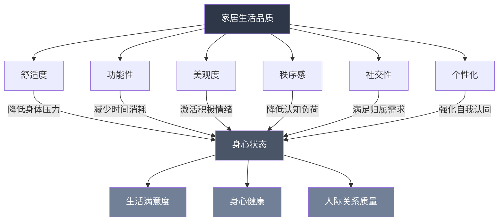
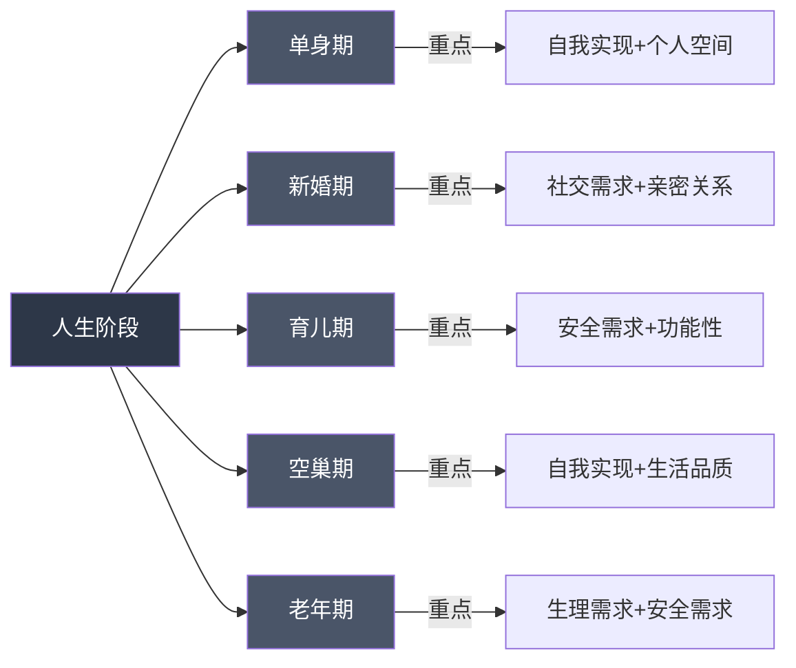
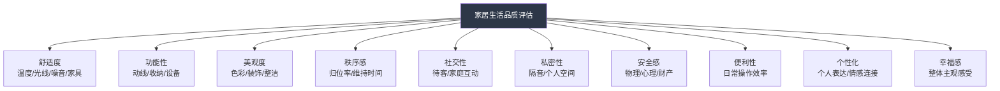

## 六、家居生活品质理论

家居生活品质不是"装修好不好"这么简单的事情。它是一个涉及环境心理学、行为科学、美学、人体工程学、社会学等多学科交叉的综合概念。理解家居生活品质的理论框架，能够帮助我们从"凭感觉"升级为"有依据"地改善居住环境——不再盲目跟风，而是知道每个改变背后的逻辑和预期效果。

本章将从理论基础出发，建立完整的家居生活品质评估体系，并提供可落地的改善路径。

### 6.1 生活品质的多维定义

#### 6.1.1 从世界卫生组织的定义说起

世界卫生组织（WHO）将生活品质定义为："个体在其所处的文化和价值体系背景下，对与其目标、期望、标准和关注点相关的生活状态的感知。"这个定义有三个关键点：

- **主观性**：生活品质是个人感知，不是客观指标的堆砌。一个住在豪宅里的人可能觉得生活品质很低，而一个住在小公寓里的人可能觉得非常满足。
- **文化背景**：不同文化对"好生活"的定义不同。北欧人重视"hygge"（温馨感），日本人追求"侘寂"（不完美之美），中国人讲究"安居乐业"。
- **多维度**：生活品质不是单一指标，而是多个维度的综合。

#### 6.1.2 家居生活品质的六个核心维度

在家居语境下，生活品质可以拆解为六个相互关联的维度：

| 维度 | 定义 | 核心指标 | 底层逻辑 |
|------|------|----------|----------|
| **舒适度** | 物理环境对身体的友好程度 | 温度、湿度、光线、噪音、家具人体工程学 | 降低身体压力，减少疲劳累积 |
| **功能性** | 空间和物品满足生活需求的效率 | 动线长度、取物步数、设备完好率 | 减少无意义的时间和精力消耗 |
| **美观度** | 视觉环境带来的愉悦感受 | 色彩和谐度、空间比例、材质质感 | 激活积极情绪，降低焦虑感 |
| **秩序感** | 环境的可控和可预测程度 | 物品归位率、整洁维持时间、找物成功率 | 降低认知负荷，释放心理带宽 |
| **社交性** | 空间对人际互动的支持程度 | 待客舒适度、家庭共处质量、隐私平衡 | 满足归属感和连接需求 |
| **个性化** | 环境与居住者身份认同的契合度 | 个人表达程度、情感连接强度 | 强化自我认同，提供心理安全感 |

这六个维度不是独立的，它们之间存在复杂的相互作用。例如，秩序感的提升往往会同时提高功能性和美观度；而过度追求美观度可能会牺牲功能性。

#### 6.1.3 环境心理学的三大理论支撑

家居生活品质不是玄学，有扎实的环境心理学研究支撑：

**压力恢复理论（Stress Recovery Theory）**——Roger Ulrich，1983年

Ulrich的经典实验发现，观看自然景观的患者比观看砖墙的患者恢复更快、止痛药用量更少。这个理论的家居启示是：自然元素（植物、自然光线、水声、木质材料）能够激活副交感神经系统，降低皮质醇水平。这就是为什么很多人在有绿植的房间里感觉更放松，不是心理作用，而是有生理机制在支撑。

**注意力恢复理论（Attention Restoration Theory）**——Rachel & Stephen Kaplan，1989年

Kaplan夫妇区分了两种注意力：定向注意力（需要意志力维持，如工作学习）和非自愿注意力（被自然环境自然吸引）。长时间使用定向注意力会导致"注意力疲劳"，表现为烦躁、易怒、注意力涣散。自然环境提供"柔和的吸引力"（soft fascination），让定向注意力得到休息。家居启示：家里需要一个"注意力恢复区"——一个没有屏幕、没有待办事项提醒、只有自然元素的空间。

**场所依恋理论（Place Attachment Theory）**——环境心理学的核心概念

人会对特定空间产生情感依恋，这种依恋分为两个维度：场所依赖（功能性的——这个空间能满足我的需求）和场所认同（情感性的——这个空间代表了我是谁）。家居启示：一个让你产生"场所依恋"的家，比一个纯功能性的房子更能带来幸福感。这就是为什么很多人对"家"有特殊的情感，即使那个地方在物理条件上并不完美。

### 6.2 马斯洛需求层次在家居中的应用

#### 6.2.1 经典五层次的家居映射

马斯洛的需求层次理论为我们提供了一个从基础到高级的家居需求框架。但需要注意的是，这个框架不是严格的线性关系——你不需要完全满足底层需求才能追求高层需求，而是说底层需求的满足会为高层需求的追求提供更稳固的基础。

**第一层：生理需求——居住的底线**

| 需求 | 具体表现 | 常见问题 | 改善方向 |
|------|----------|----------|----------|
| 温度 | 室内温度18-26℃（因季节和个人而异） | 冬冷夏热，空调直吹 | 合理布局暖通设备，避免气流直吹 |
| 空气 | CO₂<1000ppm，PM2.5<35μg/m³ | 通风不足，甲醛超标 | 新风系统/空气净化器，定期开窗 |
| 光线 | 自然光充足，人工照明无频闪 | 阴暗潮湿，灯光刺眼 | 增大采光面，选择高显色指数灯具 |
| 噪音 | 白天<45dB，夜间<30dB | 隔音差，邻居噪音 | 隔音窗、密封条、白噪音机 |
| 睡眠 | 床垫支撑性好，卧室遮光率>95% | 床垫不合适，光线干扰 | 人体工程学床垫，遮光窗帘 |
| 水质 | 饮用水符合标准，水温水压稳定 | 水垢多，水压不稳 | 前置过滤器+末端净水 |

**第二层：安全需求——安心的基础**

安全需求不仅是物理安全，还包括心理安全感：

- **物理安全**：防滑地面、稳固家具（防倾倒）、电器安全（漏电保护）、防火措施（烟雾报警器、灭火器）
- **健康安全**：低甲醛材料、防霉防潮、害虫防治、饮用水安全
- **财产安全**：门锁安全（建议C级锁芯）、窗户防护、贵重物品保管
- **心理安全**：隐私保护（隔音、窗帘）、稳定的居住权（租房合同保障）、可预测的环境（物品固定位置）

**第三层：社交需求——连接的空间**

家是社交的舞台，需要支持不同层次的社交：

- **深度社交**：客厅沙发区——面对面交流的最佳布局，沙发呈L型或U型，距离1.2-1.5米
- **家庭共处**：开放式厨房+餐厅——做饭时也能聊天，研究表明开放式厨房家庭的亲子互动时间平均多出23%
- **亲密关系**：卧室——需要良好的隔音和舒适的氛围
- **社交边界**：玄关——提供从公共到私密的过渡，避免客人一进门就看到全屋

**第四层：尊重需求——品味的表达**

这一层的核心是"被看见"和"被认可"：

- **待客之道**：整洁有序的客厅、干净的卫生间、充足的待客用品
- **个人品味**：书架上的藏书、墙上的艺术品、旅行纪念品——这些都在无声地讲述你是谁
- **生活仪式感**：专门的茶具、好看的餐具、鲜花——这些"不必要"的东西恰恰是生活品质的体现
- **成就感**：亲手打造的空间、DIY的装饰品、精心照料的植物

**第五层：自我实现——成长的空间**

最高层次的家居需求是支持个人成长和自我实现：

- **专注空间**：安静的书房或工作区，支持深度工作
- **创意空间**：画室、音乐角、手工台——支持兴趣爱好的发展
- **冥想空间**：一个可以独处、反思、放空的角落
- **学习空间**：良好的照明、舒适的座椅、充足的收纳——支持终身学习

#### 6.2.2 需求层次的动态平衡

需要注意的是，需求层次不是静态的。在不同的人生阶段，需求的重心会发生变化：

- **单身期**：可能更注重自我实现和个人空间
- **新婚期**：社交需求和亲密关系需求上升
- **育儿期**：安全需求和功能性需求成为重点
- **空巢期**：重新关注自我实现和生活品质
- **老年期**：生理需求和安全需求再次成为核心

### 6.3 PERMA幸福模型的家居应用

积极心理学之父Martin Seligman提出的PERMA幸福模型，比马斯洛理论更精确地描述了"什么让人幸福"。这个模型可以非常有效地指导家居设计。

#### 6.3.1 PERMA五要素与家居的对应

| 要素 | 含义 | 家居应用 | 具体做法 |
|------|------|----------|----------|
| **P - Positive Emotion** | 积极情绪 | 创造能激发愉悦感的环境 | 暖色调灯光、喜欢的艺术品、香薰、鲜花 |
| **E - Engagement** | 投入/心流 | 创造能进入心流状态的空间 | 安静的书房、无干扰的工作区、合适的工具 |
| **R - Relationships** | 人际关系 | 支持社交和亲密关系的空间 | 舒适的客厅、温馨的餐厅、私密的卧室 |
| **M - Meaning** | 意义感 | 让空间承载个人价值观和故事 | 有纪念意义的物品、展示个人成就的空间 |
| **A - Achievement** | 成就感 | 支持目标达成和技能提升的环境 | 学习角、健身区、工具齐全的工作台 |

#### 6.3.2 PERMA视角下的家居诊断

用PERMA模型诊断家居问题，可以更精准地找到改善方向：

**诊断问题清单**：

1. **P（积极情绪）**：走进家门的第一刻，你感到的是愉悦还是压力？家里有没有让你看了就开心的东西？
2. **E（投入/心流）**：在家里你能专注做自己喜欢的事情吗？有没有被干扰？有没有合适的工具和空间？
3. **R（人际关系）**：家里的布局是否促进了家人之间的互动？有没有可以一起做饭、聊天、看电影的空间？
4. **M（意义感）**：你的家有没有讲述你的故事？有没有让你想起重要时刻的物品？
5. **A（成就感）**：你的家有没有支持你学习新技能、达成目标的空间和条件？

如果某个要素得分很低，就说明这是你的家居生活品质的短板，值得优先改善。

### 6.4 全球家居生活哲学

不同文化对"好生活"有不同的理解，这些哲学可以为我们的家居设计提供灵感。

#### 6.4.1 北欧Hygge——舒适与温馨

Hygge（发音类似"胡嘎"）是丹麦的生活哲学，强调舒适、温馨和享受当下。丹麦连续多年被评为全球最幸福的国家之一，Hygge被认为是关键因素。

**Hygge的家居要素**：

- **烛光**：丹麦人是全球最大的蜡烛消费国，人均年消耗约6公斤。烛光的温暖、柔和、微微摇曳的特性，能够激活副交感神经系统，让人放松
- **毛毯和靠垫**：柔软的触感提供安全感和舒适感
- **温暖的色调**：米色、灰色、木色——这些自然色调让人联想到安全和温暖
- **手工和自然材质**：木材、羊毛、陶瓷——手工制品的不完美反而增加温暖感
- **共享美食**：专门的餐桌文化，强调一起做饭、一起吃饭的过程

**Hygge的实操清单**：

1. 在客厅和卧室各放2-3个不同大小的靠垫
2. 准备一条手感好的毛毯，放在沙发扶手上
3. 买几根无香型大豆蜡蜡烛，傍晚时分点燃
4. 把主灯换成暖色调（2700K-3000K），加一盏落地灯
5. 在茶几上放一个木质托盘，放热饮和小零食
6. 每周至少一次和家人一起做饭、一起吃饭

#### 6.4.2 日本Wabi-Sabi——不完美之美

侘寂（Wabi-Sabi）是日本美学的核心，接受不完美、无常和不完整。在家居中，它体现为：

- **自然材质的老化**：木头的纹理、陶器的裂纹、亚麻的褶皱——这些都是时间的印记，不是需要修复的缺陷
- **留白**：空间不必填满，留白本身就是一种美
- **朴素之美**：不需要昂贵的装饰品，一根枯枝、一块石头、一个粗陶碗，就可以是美的
- **季节感**：随季节更换家居元素——春天的樱花枝、夏天的竹帘、秋天的红叶、冬天的松枝

**Wabi-Sabi的实操清单**：

1. 选择有质感的天然材质（亚麻、棉、木、陶），而非光滑的人造材料
2. 允许物品"变旧"——一个用了十年的木质砧板，比全新的更美
3. 减少物品数量，每件物品都值得被看见
4. 在窗台放一个简单的花瓶，随季节更换花枝
5. 接受家里的"不完美"——一面有裂纹的老墙，一个修补过的碗

#### 6.4.3 Lagom——瑞典的"刚刚好"

Lagom（发音"拉贡"）是瑞典的生活哲学，意思是"不多不少，刚刚好"。它介于极简主义和奢华之间，追求平衡：

- **适度消费**：不买不需要的东西，但也不刻意苦行
- **功能与美的平衡**：每件物品既要实用，也要好看
- **可持续**：选择耐用、环保的产品，减少浪费
- **平等**：家居设计考虑所有家庭成员的需求，不为某一个人过度牺牲

#### 6.4.4 中国传统的"安居"智慧

中国传统文化中对居住品质有深刻的理解：

- **风水的核心是环境心理学**：所谓"藏风聚气"，本质上是选择通风良好、采光充足、背山面水的环境；"明厅暗房"对应的是公共空间需要明亮通透、私密空间需要柔和安静
- **"室雅何须大，花香不在多"**：强调品质而非数量，小空间也可以有高品质
- **"天人合一"**：人与环境的和谐，体现在现代设计中就是室内与室外的连接、自然元素的引入
- **"四时有序"**：随季节调整生活方式和家居布置，春生夏长秋收冬藏

### 6.5 家居生活品质评估体系

#### 6.5.1 十维评估模型

基于前述理论，建立一个十维评估模型，每个维度1-10分：

#### 6.5.2 评估问卷（详细版）

对每个维度，用以下问题进行评估。每题1-5分，取平均分作为该维度得分。

**维度一：舒适度（物理环境）**

1. 家里的温度是否让你感到舒适？（1=经常太冷或太热，5=始终适宜）
2. 家里的光线是否合适？（1=经常太暗或太刺眼，5=自然光和人工光都恰到好处）
3. 家里的噪音水平如何？（1=经常被噪音困扰，5=非常安静）
4. 你的床/沙发/椅子是否舒适？（1=经常腰酸背痛，5=使用后感觉放松）
5. 家里的空气质量如何？（1=经常闷或有异味，5=清新舒适）

**维度二：功能性（效率与便利）**

1. 你在家里的动线是否顺畅？（1=经常绕路或撞到东西，5=所有动线都顺畅高效）
2. 你的收纳系统是否好用？（1=经常找不到东西，5=所有物品都有固定位置且易取用）
3. 家里的设备是否完好且易用？（1=经常有设备故障或难用，5=所有设备都正常且顺手）
4. 做家务是否方便？（1=家务流程繁琐低效，5=家务流程顺畅高效）
5. 日常起居（做饭、洗漱、穿衣）是否高效？（1=经常手忙脚乱，5=流程顺畅）

**维度三：美观度（视觉愉悦）**

1. 你对家里的整体视觉效果满意吗？（1=很不满意，5=非常满意）
2. 家里的色彩搭配是否和谐？（1=杂乱无章，5=和谐统一有层次）
3. 家里的物品摆放是否美观？（1=随意堆放，5=有设计感的陈列）
4. 家里的整洁程度如何？（1=经常杂乱，5=始终保持整洁）
5. 家里有没有让你看了就开心的东西？（1=完全没有，5=有很多）

**维度四：秩序感（可控与可预测）**

1. 每件物品是否都有固定的"家"？（1=很多物品没有固定位置，5=所有物品都有固定位置）
2. 用完物品后，你是否会放回原位？（1=经常忘记，5=已经形成习惯）
3. 你能在30秒内找到需要的物品吗？（1=经常找不到，5=几乎总能立刻找到）
4. 家里的整洁能维持多久？（1=刚整理完就乱，5=能持续保持整洁）
5. 你对家里的物品数量有控制吗？（1=物品越来越多无法控制，5=定期清理保持适度）

**维度五：社交性（人际连接）**

1. 你愿意邀请朋友来家里做客吗？（1=很不愿意，5=很乐意）
2. 家里的客厅是否适合聊天和互动？（1=布局不适合交流，5=非常舒适适合交流）
3. 家人是否有足够的共处空间和时间？（1=各自待在房间，5=经常一起在公共区域活动）
4. 家里是否有适合聚餐的空间？（1=没有正式的用餐区，5=有舒适的用餐空间）
5. 家里的社交和私密空间是否平衡？（1=完全开放或完全封闭，5=两者平衡良好）

**维度六：私密性（个人空间）**

1. 你是否有属于自己的私人空间？（1=完全没有，5=有专属的私人空间）
2. 你在自己的空间里能不被打扰吗？（1=经常被打扰，5=几乎不被打扰）
3. 家里的隔音是否足够？（1=能听到邻居/家人的所有声音，5=隔音良好）
4. 你能在家里找到独处的时间和空间吗？（1=很难，5=很容易）
5. 你的个人物品是否得到尊重？（1=经常被家人移动或使用，5=完全被尊重）

**维度七：安全感**

1. 你对家里的门窗安全有信心吗？（1=经常担心，5=完全放心）
2. 家里的电器使用是否安全？（1=有安全隐患，5=完全安全）
3. 家里是否有防滑、防撞等安全措施？（1=几乎没有，5=全面到位）
4. 你在家里的空气质量是否有信心？（1=担心甲醛等污染，5=完全放心）
5. 你在家里是否有心理安全感？（1=经常感到焦虑，5=完全放松）

**维度八：便利性**

1. 日常购物是否方便？（1=需要长途跋涉，5=步行范围内有超市/便利店）
2. 快递和外卖是否方便送达？（1=经常找不到地址或无法送达，5=非常方便）
3. 周边的医疗、教育、交通是否便利？（1=非常不便，5=非常便利）
4. 家里的智能化程度如何？（1=完全手动，5=高度智能化）
5. 维修和物业服务是否及时？（1=经常拖延，5=响应迅速）

**维度九：个性化**

1. 你的家是否有你独特的风格？（1=和别人家没有区别，5=非常有个人特色）
2. 家里是否有对你有特殊意义的物品？（1=完全没有，5=有很多）
3. 你的家是否反映了你的生活方式？（1=完全没有，5=完美体现）
4. 你是否享受在家里的时光？（1=不太享受，5=非常享受）
5. 朋友来你家时，是否能感受到你的个性？（1=感受不到，5=能明显感受到）

**维度十：整体幸福感**

1. 你每天回家时的感受是什么？（1=不想回家，5=迫不及待想回家）
2. 你在家里是否感到放松？（1=经常感到压力，5=完全放松）
3. 你的家是否支持你做喜欢的事情？（1=完全不支持，5=完全支持）
4. 你对家的整体满意度如何？（1=很不满意，5=非常满意）
5. 如果可以重新选择，你还会选择住在这里吗？（1=绝对不会，5=一定会）

#### 6.5.3 评分解读与行动指南

**计算方法**：每个维度5题，取平均分。然后计算10个维度的总平均分。

| 总平均分 | 等级 | 解读 | 行动建议 |
|----------|------|------|----------|
| 1.0-3.0 | 🔴 需要大幅改善 | 居住环境存在严重问题 | 优先解决生理需求和安全需求层面的问题 |
| 3.1-5.0 | 🟠 有明显短板 | 基本需求满足但品质不足 | 找到最低分的2-3个维度重点改善 |
| 5.1-7.0 | 🟡 中等水平 | 大部分维度合格但有提升空间 | 针对性优化，不必全面推翻重来 |
| 7.1-8.5 | 🟢 良好水平 | 生活品质较好 | 微调细节，提升个性化和美学层面 |
| 8.6-10.0 | 🌟 优秀水平 | 高品质家居生活 | 保持并持续优化，享受成果 |

**关键发现**：

- **最低分维度**是你的首要改善目标——木桶效应在家居品质中同样适用
- **最高分和最低分的差距**反映了你的生活品质的"不均衡度"——差距越大，说明某些维度被严重忽视
- **舒适度和安全感**得分低于5分时，应优先处理——这是基础需求
- **个性化和幸福感**得分低但基础维度得分高时，说明你的家"功能完善但缺乏灵魂"

### 6.6 从理论到实践：品质提升路径

#### 6.6.1 分阶段改善策略

不要试图一次性解决所有问题。按照优先级分阶段进行：

**第一阶段：基础保障（1-2周）**

目标：解决影响健康和安全的问题

- 检查并修复所有安全隐患（漏电、漏水、门锁、防滑）
- 确保基本的舒适度（温度、光线、空气质量）
- 建立基本的收纳系统（物品有固定位置）

**第二阶段：功能优化（2-4周）**

目标：提升日常生活的效率和便利性

- 优化动线（减少不必要的移动和弯腰）
- 完善收纳（垂直空间利用、标签系统、定期清理）
- 升级关键设备（好用的厨具、舒适的床品、高效的清洁工具）

**第三阶段：美学提升（4-8周）**

目标：让家变得好看且有个人风格

- 确定一个你喜欢的风格方向（不一定要命名，收集喜欢的图片即可）
- 统一色调（建议一个主色调+两个辅助色+一个点缀色）
- 增添有个人意义的装饰品（旅行纪念品、家人照片、手工作品）

**第四阶段：品质深化（持续进行）**

目标：从"住得好"到"住得有品质"

- 引入自然元素（植物、自然光线、天然材质）
- 创造仪式感（专门的茶具、好看的餐具、鲜花）
- 建立维护习惯（每日10分钟整理、每周一次深度清洁、每季一次断舍离）

#### 6.6.2 不同预算的改善方案

**零预算方案**：

- 重新排列家具——改变布局不需要花钱，但能带来全新的感受
- 清理不需要的物品——空间感的提升是最直接的品质改善
- 调整灯光——把主灯关掉，只开台灯和落地灯，氛围立刻不同
- 整理收纳——把同类物品放在一起，用鞋盒做分隔
- 引入自然元素——从外面捡一些树枝、石头，或者分栽已有的植物

**低预算方案（500元以内）**：

- 更换床品——一套舒适的四件套（200-300元）能显著提升睡眠体验
- 添加绿植——几盆好养的绿植（100-200元）如绿萝、虎皮兰
- 升级灯光——换几个暖色灯泡（50-100元），加一盏小夜灯
- 添加香薰——无火香薰或香薰蜡烛（50-100元）
- 更换窗帘——遮光窗帘（100-200元）能显著改善睡眠

**中等预算方案（500-5000元）**：

- 升级核心家具——一把好椅子（人体工程学椅）、一张好床垫
- 完善收纳系统——定制收纳盒、抽屉分隔、墙面收纳
- 改善隔音——隔音窗帘、密封条、门底密封条
- 升级卫浴——好的花洒、浴室收纳、防滑垫
- 智能化设备——智能灯泡、智能插座、扫地机器人

#### 6.6.3 常见误区与纠正

| 误区 | 问题所在 | 正确做法 |
|------|----------|----------|
| "买贵的就是好的" | 价格不等于品质，适合才是关键 | 先明确需求，再选择性价比最优的方案 |
| "装修越豪华越好" | 过度装修可能牺牲功能性和舒适性 | 功能优先，美学其次，避免过度装饰 |
| "跟风网红设计" | 别人的风格不一定适合你的生活方式 | 从自己的生活习惯出发，选择适合的风格 |
| "一次装好就不用管了" | 家居环境需要持续维护和调整 | 建立日常维护习惯，定期评估和调整 |
| "东西越多越好" | 过多物品增加维护成本和认知负荷 | 控制物品数量，每件物品都要值得被拥有 |
| "收纳就是把东西藏起来" | 看不见不代表整理好了 | 建立可视化、易取用的收纳系统 |
| "功能和美观不可兼得" | 这是一个错误的二元对立 | 好的设计应该同时兼顾功能和美观 |
| "只有大房子才能住得好" | 空间大小不等于生活品质 | 小空间更需要精心设计，品质来自细节 |

### 6.7 进阶：生活品质的长期维护

#### 6.7.1 建立"家居维护节奏"

家居生活品质不是一次性工程，而是需要持续维护的系统。建议建立以下节奏：

**每日（10分钟）**：

- 起床后整理床铺
- 用完物品放回原位
- 晚餐后清洁厨房
- 睡前10分钟快速巡视整理

**每周（1-2小时）**：

- 深度清洁一个区域（轮流进行）
- 检查并补充消耗品（纸巾、清洁剂等）
- 处理一周积累的杂物
- 给植物浇水、修剪

**每月（半天）**：

- 全屋深度清洁
- 检查设备运行状态
- 清理冰箱和储物柜
- 评估收纳系统是否需要调整

**每季（1天）**：

- 季节性断舍离
- 更换季节性家居元素（床品、窗帘、装饰）
- 检查安全设备（烟雾报警器、灭火器）
- 评估家居生活品质得分，制定改善计划

#### 6.7.2 生活品质的"复利效应"

家居生活品质的提升有复利效应——每一个小改善都会累积，最终产生显著的变化。研究表明：

- 整洁有序的环境能减少约20%的注意力分散
- 良好的睡眠环境能提升约30%的睡眠质量
- 舒适的工作空间能提升约15%的工作效率
- 有美感的环境能降低约25%的压力激素水平

这些改善是累积的。当你同时优化了舒适度、秩序感和美观度，效果不是简单的1+1+1=3，而是可能产生1×1.2×1.15×1.25≈1.7倍的生活品质提升。

#### 6.7.3 家庭成员的共同参与

家居生活品质不是一个人的事。要让所有家庭成员都参与进来：

- **共同制定规则**：每个人都能接受的整理规则，而不是一个人制定其他人执行
- **分工明确**：根据每个人的特长和时间分配家务
- **尊重差异**：每个人对"整洁"的标准不同，找到大家都能接受的平衡点
- **正向激励**：表扬做得好的地方，而不是只批评做得不好的地方
- **定期沟通**：每月一次"家庭会议"，讨论家居改善计划

### 6.8 总结

家居生活品质是一个多维度、动态发展的概念。它不仅仅是"房子大不大、装修好不好"的问题，而是涉及到我们的身体健康、心理状态、人际关系、个人发展等方方面面。

理解这些理论框架的目的，不是让你成为一个理论家，而是让你在做家居决策时有依据、有方向。当你知道为什么要这样做，你就不会盲目跟风，也不会被营销话术所左右。

记住这几个核心原则：

1. **需求导向**：从自己的真实需求出发，而不是从"别人家"出发
2. **层次递进**：先解决基础需求（舒适、安全），再追求高级需求（美观、个性化）
3. **动态调整**：随着人生阶段的变化，家居需求也会变化，定期评估和调整
4. **持续维护**：生活品质不是一次性工程，需要日常的维护和持续的优化
5. **全员参与**：家居生活品质是全家人的事，需要共同参与和维护

从今天开始，用评估问卷给你的家打个分，找到最需要改善的维度，然后用本章提供的方法开始行动。不需要一步到位，每天进步一点点，你的家居生活品质就会持续提升。
