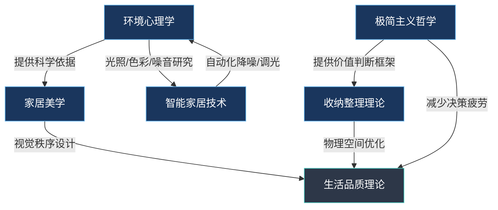
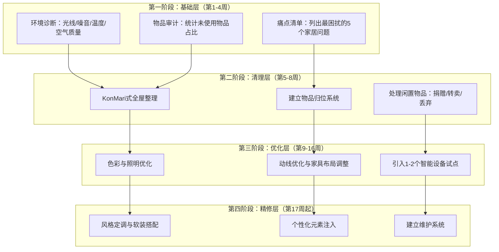
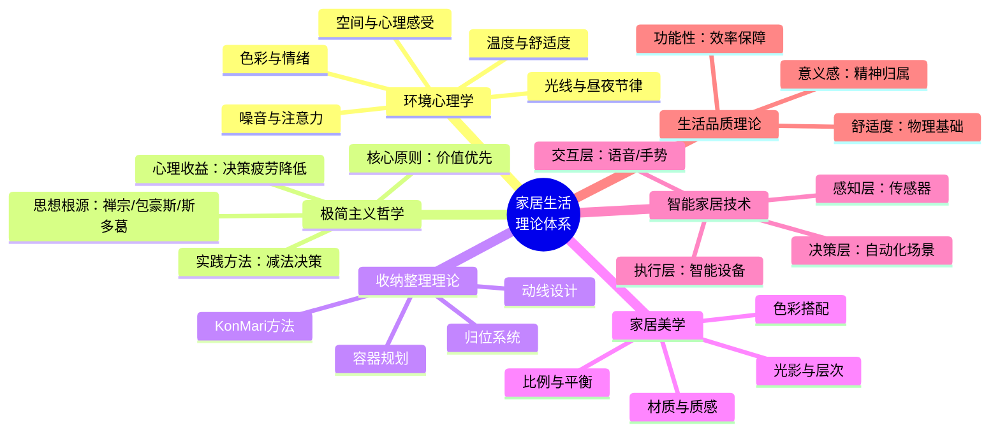

## 七、本节小结

前面六节分别从环境心理学、极简主义哲学、收纳整理理论、家居美学、智能家居技术和家居生活品质理论六个维度，构建了家居生活的完整理论体系。本节将这六个维度串联为一张统一的知识地图，提炼核心洞察，建立理论之间的关联，并为后续的实操章节铺设方法论基础。

### 7.1 六大理论的核心命题速览

在深入交叉分析之前，先用一张表格回顾每个理论的核心主张和关键洞察：

| 理论领域 | 核心命题 | 关键洞察 | 实践指向 |
|---------|---------|---------|---------|
| 环境心理学 | 环境塑造行为，行为改造环境 | 光线、色彩、噪音、温度等物理因素对情绪和认知有可测量的影响 | 用科学数据指导空间设计，而非凭感觉 |
| 极简主义哲学 | 少即是多，减法即加法 | 物品的过度堆积会消耗注意力和决策能量 | 建立"拥有标准"，主动选择而非被动接受 |
| 收纳整理理论 | 整理是心理过程，不只是物理过程 | 物品的混乱映射内心的混乱；整理的本质是与过去和解 | 按类别而非按房间整理，建立可持续的归位系统 |
| 家居美学 | 美感是功能性的一部分 | 审美愉悦降低压力荷尔蒙、提升幸福感 | 用色彩、材质、比例三要素构建视觉秩序 |
| 智能家居技术 | 技术是工具，不是目的 | 自动化的价值在于消除重复性决策，释放注意力 | 从高频痛点切入，渐进式引入智能设备 |
| 生活品质理论 | 品质=舒适+功能+意义 | 物理环境只是基础层，心理归属感才是核心层 | 从"住得舒服"到"住得有意义"的渐进升级 |

### 7.2 理论之间的交叉关联

这六个理论并非独立存在，它们在多个节点上深度交织。理解这些关联，才能在实践中做到"一招多效"。

**关联一：环境心理学 × 家居美学**

环境心理学为家居美学提供了科学基础。比如：

- 色彩对情绪的影响（蓝色降低心率、黄色提升警觉性）不是"品味问题"，而是神经科学可验证的事实
- 空间比例（层高与家具高度的关系）影响人的压迫感或开阔感，这源于进化心理学中对空间安全性的本能评估
- 自然元素（木材纹理、植物、水声）能降低皮质醇水平，这是亲生物设计（Biophilic Design）的核心证据

美学决策如果脱离环境心理学，就变成了纯粹的主观偏好。两者结合，才能做出"既好看又有益健康"的设计选择。

**关联二：极简主义 × 收纳整理**

极简主义回答"留什么"，收纳整理回答"怎么放"。这两个理论的结合点在于：

- KonMari方法中"怦然心动"的判断标准，本质上是极简主义"价值优先"原则的具体化
- 极简主义减少了需要收纳的物品总量，让收纳系统更易维护
- 收纳整理过程中对物品的审视，反过来强化了极简主义的消费观——当你经历过一次彻底的整理，你会更谨慎地决定下一次购买

**关联三：智能家居 × 环境心理学**

智能家居技术是环境心理学原理的自动化执行器：

- 环境心理学发现色温影响昼夜节律 → 智能照明系统可以自动调节色温（清晨偏冷白5000K，夜晚偏暖黄2700K）
- 环境心理学证实噪音干扰注意力 → 智能降噪系统和白噪音设备可以主动管理声环境
- 环境心理学证明温度影响睡眠质量 → 智能温控系统可以在入睡后自动降温到18-20°C

**关联四：生活品质理论 × 全部理论**

生活品质理论是整个理论体系的"汇合点"。它不产生新的实践方法，而是提供了一个评估框架——用"舒适度、功能性、意义感"三个维度来衡量所有家居决策的效果。

### 7.3 六条核心洞察的深度提炼

#### 洞察一：居住环境是"隐形的行为设计"

环境心理学告诉我们，环境不是"背景"，而是"行为的触发器"。一个随手放杂物的台面，会不断触发"把东西放上去"的行为；一个灯光昏暗的客厅，会让人本能地选择沙发而非书桌。

这意味着：**改变环境比改变习惯更有效**。不要试图用意志力对抗环境的暗示，而应该改造环境来引导你想要的行为。想多读书？在沙发旁放一盏好灯和一个书架。想减少零食？不把零食放在视线范围内。

这个洞察在行为设计学（Behavior Design）中被称为"情境设计"（Context Design），BJ Fogg教授在斯坦福大学的研究反复验证了这一原则。

#### 洞察二：物品的心理成本远超其购买价格

极简主义哲学和收纳整理理论共同揭示了一个被严重低估的事实：**每件物品都有持续的心理成本**。

这个成本包括：

- **注意力成本**：视觉杂乱会消耗认知资源。普林斯顿大学神经科学研究所（2011）发现，视觉场中的杂物越多，注意力集中能力越低
- **决策成本**：物品越多，选择越多，决策疲劳越严重。Barry Schwartz在《选择的悖论》中证明，超过一定数量的选择会降低满意度
- **维护成本**：每件物品都需要清洁、存放、管理。100件物品比30件物品多出3倍以上的维护负担
- **情绪成本**：未使用的物品（"总有一天会用到"的囤积物）持续产生内疚和焦虑

这意味着，一件标价99元的物品，如果它在你家闲置半年，它的实际成本远不止99元——你还支付了注意力、决策能量、空间和情绪的隐性费用。

#### 洞察三：美感不是奢侈品，而是基础设施

家居美学常被误解为"有钱人的附加选项"。但环境心理学的研究表明，审美体验直接激活大脑的奖赏回路（伏隔核和眶额皮质），释放多巴胺，产生愉悦感。这不是"锦上添花"，而是生理层面的刚需。

一个令人愉悦的居住环境能够：

- 降低日常压力水平（皮质醇浓度下降12%-15%，参考Earthmann等人2010年研究）
- 提升睡眠质量（视觉秩序感有助于入睡时的心理放松）
- 增强创造力（有序但不刻板的环境最有利于创造性思维）
- 提升社交意愿（人们更愿意邀请朋友到一个自己感到自豪的家中做客）

更关键的是，美学投入的性价比极高——一面墙的颜色改变，成本不到200元，效果可以持续数年。

#### 洞察四：整理的终极目标不是整洁，而是清晰

收纳整理理论的核心不是"把东西放整齐"，而是通过整理过程获得对自我认知的清晰度。近藤麻理惠在《怦然心动的人生整理魔法》中反复强调：整理是一次与所有物品的对话，通过这个对话，你真正了解自己需要什么、重视什么、可以放下什么。

这个洞察的心理学依据是"具身认知"（Embodied Cognition）——物理环境的状态会反向影响心理状态。一个混乱的物理空间会加剧心理混乱；一个有序的空间则有助于思维清晰。

#### 洞察五：智能家居的正确使用方式是"隐形化"

智能家居技术最常见的错误是"为了智能而智能"——安装一堆需要手机操控的设备，反而增加了操作步骤。真正的智能是"无感智能"（Calm Computing），由Mark Weiser在施乐帕克研究中心提出。

无感智能的判断标准很简单：**一个好的智能设备，应该让你完全忘记它的存在**。它在后台自动运行，不打扰你，不增加学习成本，不制造新的故障点。如果你需要用手机App操作一个灯泡开关，那还不如直接按墙上的物理开关。

#### 洞察六：生活品质的天花板是"意义感"

家居生活品质理论指出，舒适度和功能性只是基础层。在满足基本需求之后，决定生活品质上限的是"意义感"——这个家是否承载了你的故事、价值观和情感连接。

一张外婆留下的旧椅子，从极简主义角度看应该丢弃，从收纳角度讲占空间，从美学角度看可能与现代风格不搭。但它承载的记忆和情感连接，是任何新家具都无法替代的。这就是为什么生活品质理论必须与其他理论配合使用——它提供了一个"反调节"机制，防止其他理论走向极端。

### 7.4 理论到实践的转化框架

理解了理论之后，最关键的问题是：如何把这些知识转化为行动？

**第一步：自我诊断**

对照六大理论，找到自己当前最大的短板。以下是一个快速诊断清单：

- **环境心理学维度**：家中的光线是否充足？色温是否合适？噪音是否可控？空气流通是否良好？如果这些问题都答不上来，说明你还没有关注过环境的物理参数
- **极简主义维度**：家中是否有很多超过一年没有使用的物品？你是否经常觉得"东西太多放不下"？购物决策是冲动驱动还是需求驱动？
- **收纳整理维度**：你能否在30秒内找到任何一件常用物品？物品是否有固定的"家"？整理是否需要专门腾出半天时间？
- **家居美学维度**：你是否愿意邀请朋友来家里做客？你对自己的居住空间是否有自豪感？家中的颜色搭配是否有意识地选择过？
- **智能家居维度**：你是否还在手动重复执行某些日常操作（开关灯、调节温度、开关窗帘）？这些操作每天花费的总时间是否超过10分钟？
- **生活品质维度**：回到家中，你的第一感受是放松还是烦躁？你的家是否反映了你的个人风格和价值观？

**第二步：优先级排序**

不要试图同时优化所有维度。根据"木桶效应"，先补最短的那块板。一般来说：

1. 如果居住环境的物理舒适度有问题（太热、太冷、太吵、太暗），先解决环境心理学相关的问题——这是一切的基础
2. 如果物品堆积严重、经常找不到东西，先做一次彻底的KonMari式整理
3. 基础舒适度和整洁度解决之后，再考虑美学提升和智能化升级
4. 最后，注入个人意义和情感连接

**第三步：小范围实验**

从一个房间、一个区域、一个习惯开始。不要全屋改造，那会让你陷入完美主义的瘫痪。具体建议：

- 本周只做一件事：清理一个抽屉、换一盏灯、调整一个家具的位置
- 记录改变前后的感受对比（简单的情绪打分1-10即可）
- 两周后评估：这个改变是否真的提升了你的生活品质？如果没有，分析原因并调整

**第四步：建立系统而非依赖一次性行动**

理论告诉我们，家居生活品质的提升不是一次性工程，而是持续的系统运转：

- **每日系统**：5分钟归位整理（所有物品回归原位）
- **每周系统**：15分钟快速巡检（补充消耗品、处理积压物品）
- **每季系统**：1小时深度审视（淘汰过季物品、调整空间布局）
- **每年系统**：半天全面整理（KonMari式全屋整理，重新评估所有物品）

### 7.5 常见误区与纠正

在学习家居生活理论的过程中，有几个高频误区值得警惕：

**误区一：极简主义 = 什么都扔**

纠正：极简主义的核心是"有意识地选择"，不是"无差别地丢弃"。一个热爱烹饪的人拥有30种调料和15种锅具，这不是囤积，这是专业。极简主义要求你扔掉的是"不怦然心动"的物品，不是所有物品。判断标准不是数量，而是这件物品是否服务于你真正重视的事物。

**误区二：智能家居 = 买一堆智能设备**

纠正：智能家居的核心是"系统化"，不是"设备堆砌"。10个独立的智能设备需要10个App来控制，这不是智能，这是反智能。真正的智能家居需要统一的中控平台（如Home Assistant），让设备之间可以联动、自动执行场景，而不是各自为战。

**误区三：收纳 = 买收纳盒**

纠正：收纳的第一步是减少物品，第二步是规划动线和位置，第三步才是选择收纳工具。如果你买了20个收纳盒来装不需要的物品，那只是把混乱装进了盒子里，本质问题没有解决。

**误区四：家居美学 = 模仿社交媒体**

纠正：社交媒体上的家居照片往往经过精心拍摄和后期处理，而且是静态的——不展示日常生活的痕迹。真正的家居美学应该服务于你的实际生活，而不是成为一个需要维护的"展品"。一个有生活气息、有个人风格、整洁有序的家，比一个"网红风格"但需要每天花1小时维护的样板间更有价值。

**误区五：理论学完就能做好**

纠正：家居生活的理论学习只是起点，真正的提升来自于反复的实践和反馈。就像学习游泳不能只看书一样，家居生活的改善需要动手去试、去感受、去调整。理论告诉你"为什么"和"怎么做"，但"做到"需要时间。

### 7.6 从理论到行动的路线图

将本节六个理论整合为一张可执行的行动路线图：

### 7.7 延伸阅读推荐

以下书籍按主题分类，覆盖本节六个理论领域，从入门到进阶：

**环境心理学与空间设计**

- 《A Pattern Language》——Christopher Alexander（建筑模式语言的奠基之作，提出253个空间设计模式）
- 《The Architecture of Happiness》——Alain de Botton（用哲学视角解读建筑与情感的关系）
- 《亲生命性》——E.O. Wilson（亲生物设计的理论基础，解释人类为何需要自然元素）

**极简主义与整理**

- 《怦然心动的人生整理魔法》——近藤麻理惠（KonMari方法的原始文本，全球畅销书）
- 《断舍离》——山下英子（从东方哲学角度阐述"放下"的智慧）
- 《Essentialism: The Disciplined Pursuit of Less》——Greg McKeown（极简主义在工作和生活中的系统应用）
- 《Goodbye, Things》——Fumio Sasaki（一个普通日本男性的极简主义实践日记）

**家居美学与实用设计**

- 《小家，越住越大》——逯薇（针对中国小户型的实用设计指南，图文并茂）
- 《The Interior Design Handbook》——Frida Ramstedt（瑞典室内设计师的系统性设计方法论）
- 《色彩艺术》——约翰内斯·伊顿（色彩理论的经典之作，适用于家居配色决策）

**生活哲学与品质**

- 《Hygge：丹麦幸福学》——迈克·维金（北欧幸福哲学，强调舒适、温暖、陪伴的生活方式）
- 《选择的悖论》——巴里·施瓦茨（解释为什么更多选择不等于更多幸福，为极简主义提供心理学支持）
- 《Atomic Habits》——James Clear（习惯养成的科学方法，适用于建立家居维护系统）

**技术与生活**

- 《Calm Computing》——Mark Weiser & John Seely Brown（无感智能的理论源头论文）
- 《The Home Edit》——Clea Shearer & Joanna Teplin（整理系统与美学结合的实操指南）

### 7.8 本节总结：一张图看懂家居生活理论体系

这六个理论不是并列的六个选项，而是构建美好家居生活的六根支柱。环境心理学告诉你"空间如何影响你"，极简主义告诉你"该拥有什么"，收纳整理告诉你"如何管理所拥有的"，家居美学告诉你"如何让空间更美好"，智能家居告诉你"如何让空间更聪明"，生活品质理论告诉你"最终目标是什么"。

在接下来的实操章节中，我们将把这些理论一一落地，转化为具体的空间改造方案、收纳系统设计、色彩搭配指南和智能设备选型建议。

理论是地图，实践是旅行。现在，地图已经画好了，是时候出发了。

***

> **本节小结**：家居生活的六大理论（环境心理学、极简主义哲学、收纳整理理论、家居美学、智能家居技术、生活品质理论）构成了一个相互关联的知识体系。核心洞察是：(1) 环境是行为的触发器，改环境比改习惯更有效；(2) 物品的心理成本远超购买价格；(3) 美感是基础设施而非奢侈品；(4) 整理的终极目标是认知清晰；(5) 智能家居的最高境界是无感运行；(6) 生活品质的天花板是意义感。实践路径：从诊断到清理、从优化到精修，循序渐进，系统运转。
