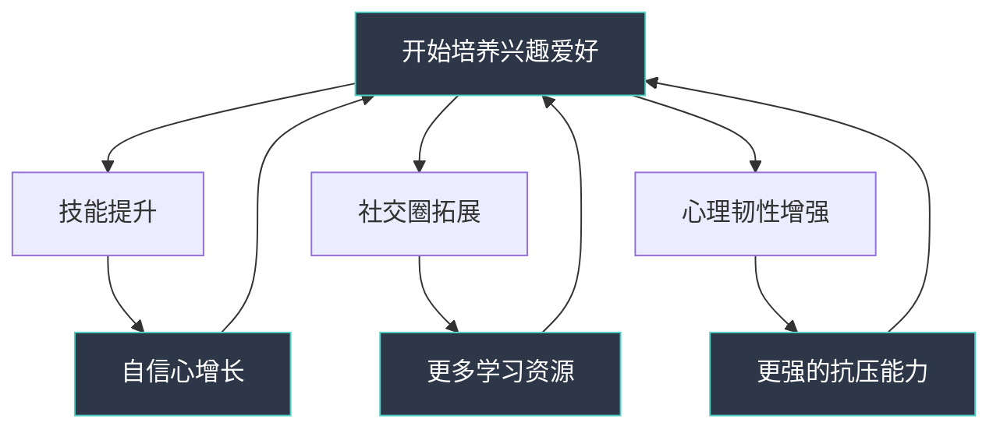
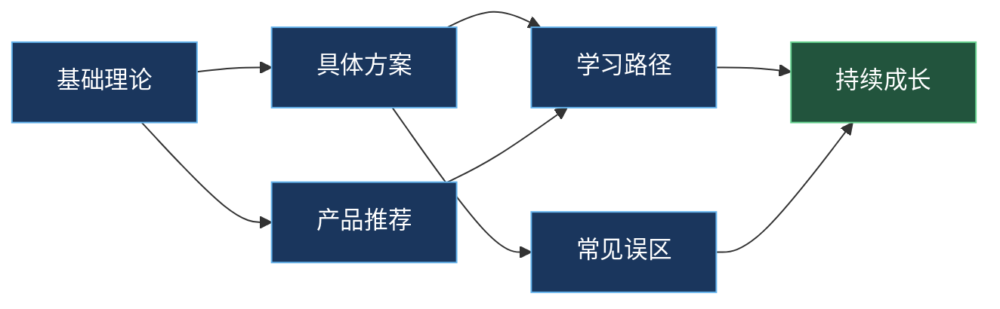
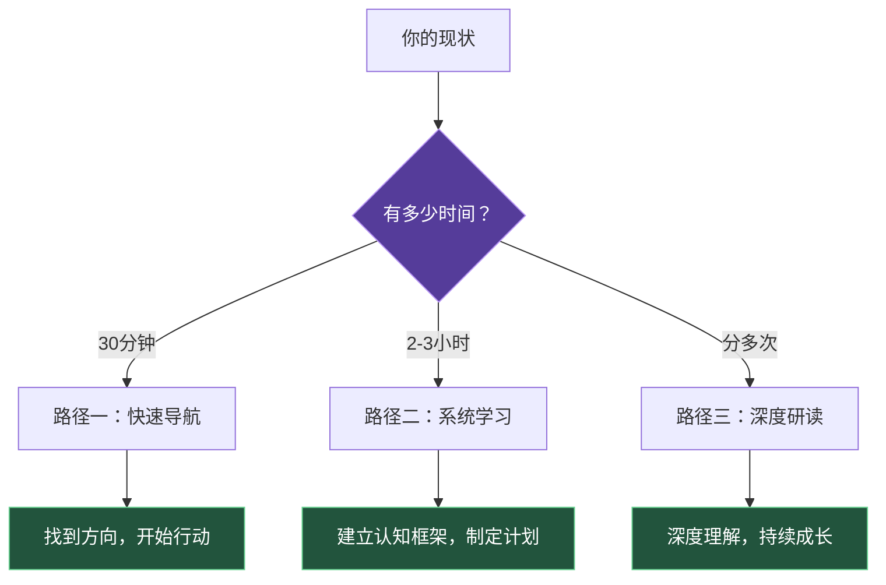

# 第十九章 兴趣爱好：发现生活的无限可能

## 一个关于"空心人"的故事

张伟，32岁，互联网公司产品经理，年薪40万。每天早上9点到公司，晚上10点回家，周末补觉。他有一套不错的房子、一辆代步车、一个看起来体面的生活。但每当夜深人静，或者节假日无所事事的时候，一种难以名状的空虚感就会涌上来——"我的生活，除了工作，还剩下什么？"

这不是张伟一个人的困境。中国青年报的一项调查显示，76.3%的受访者认为自己的生活"除了工作就是刷手机"，68.5%的人表示"想培养一个爱好但不知道从何开始"，而曾经尝试过但最终放弃的人高达82.1%。

问题不在于我们没有时间，而在于我们缺乏一套系统的方法来发现、选择和持续培养兴趣爱好。本章就是这套方法的完整指南。

## 为什么这一章值得你认真阅读

### 兴趣爱好不是"锦上添花"，而是"雪中送炭"

很多人把兴趣爱好视为奢侈品——"等我有钱有闲了再说"。但科学研究告诉我们，兴趣爱好是刚需，不是加分项：

**心理健康层面**：哈佛大学一项持续75年的成人发展研究（Grant Study）发现，拥有深度兴趣爱好的人，其患抑郁症的风险比缺乏爱好的人低32%，主观幸福感高出41%。发表在《柳叶刀·精神病学》上的大规模研究（样本量超过120万人）证实，运动型爱好的人心理健康问题的发生率比不运动的人低22.3%。

**职业发展层面**：世界经济论坛《2025未来就业报告》指出，在AI时代，创造力、批判性思维和跨领域整合能力将成为最核心的职业竞争力。而兴趣爱好正是培养这些能力的最佳训练场——你在摄影中学到的构图思维，可以直接提升你的PPT设计能力；你在乐队协作中培养的沟通能力，比任何管理培训课都管用。

**社交层面**：社会学家马克·格兰诺维特的"弱关系理论"揭示了一个反直觉的真相——对你职业发展帮助最大的，往往不是你的亲密好友，而是那些"认识但不太熟"的人。而兴趣爱好社群恰恰是积累这类弱关系的最佳场所。你在一个读书会认识的人，可能恰好在你想要转行的领域有着丰富的资源。

**身体健康层面**：《英国医学杂志》发表的大规模纵向研究发现，拥有业余爱好的老年人，全因死亡风险比没有爱好的老年人低约30%。这个数据甚至比很多药物干预的效果都要显著。

### 兴趣爱好的"复利效应"

兴趣爱好有一个被严重低估的特性：复利效应。当你持续投入6个月以上，技能提升、社交圈拓展、心理韧性增强这三者会形成正向循环，带来指数级的生活质量提升。这就像投资——前三个月你可能觉得"没什么变化"，但半年后回头看，你会发现自己的生活已经悄然改变了。

## 本章知识地图

本章共分为四大板块，覆盖从理论认知到落地实操的完整链路。下面这张知识地图展示了各板块之间的关系和阅读顺序：

### 板块一：基础理论（道）

在动手之前，先建立正确的认知框架。这个板块回答三个核心问题：

- **为什么需要兴趣爱好？** 从心理健康、社交价值、个人成长、生活质量、身体健康五个维度，用科学研究和数据告诉你兴趣爱好的真实价值。你将了解"心流"状态的神经科学机制，理解为什么沉浸在热爱的活动中能让你"满血复活"。
- **爱好有哪些类型？** 建立一套完整的爱好分类体系——按活动性质（创造型、体验型、运动型、智力型、社交型）、按投入程度（轻度、中度、重度）、按发展路径（速成型、渐进型、终身型）——帮你快速定位适合自己的方向。
- **如何科学地培养技能？** 刻意练习理论、学习曲线与高原期、元认知策略、社会学习理论——这些来自认知心理学和神经科学的方法论，将帮助你用最少的时间获得最大的进步。
- **兴趣与职业的关系**：什么情况下可以将兴趣变成职业？什么情况下应该保持距离？如何利用兴趣爱好反哺职业发展？
- **不同人生阶段的策略**：20岁、35岁、55岁，不同年龄段适合不同的兴趣选择策略。这个板块给出针对性的建议。
- **心理学视角**：自我决定理论、兴趣发展的四阶段模型、人格特质与兴趣的关系——理解这些，你就能预测和管理自己在兴趣培养过程中的心理变化。

### 板块二：具体方案（法+术）

理论之后是实操。这个板块为四个热门领域提供从零基础到入门水平的完整路径：

| 领域 | 核心内容 | 入门门槛 | 达到"有趣"的时间 |
|------|---------|---------|----------------|
| 摄影 | 构图、光线、后期、风格探索 | 极低（手机即可） | 2-4周 |
| 音乐 | 乐器选择、乐理基础、练习方法 | 中等（需购买乐器） | 4-8周 |
| 运动 | 运动类型选择、训练计划、损伤预防 | 低-中等 | 1-4周 |
| 手工创作 | 方向选择、工具入门、作品创作 | 低-中等 | 2-6周 |

每个方案都包含三个阶段：入门期（快速上手）、进阶期（系统提升）、创作期（形成风格），并配有每周练习任务和阶段性检验标准。

### 板块三：产品推荐（器）

"工欲善其事，必先利其器"。这个板块为每个领域推荐适合初学者的入门装备：

- **设备推荐**：从"能用就行"到"一步到位"三个档次，标注具体价格区间和选购要点
- **学习资源**：精选的书籍、在线课程、YouTube频道、播客、App
- **社区推荐**：线上论坛、线下俱乐部、社交媒体群组
- **避坑指南**：初学者最常犯的"装备焦虑"——买太多、买太贵、买错方向

### 板块四：学习路径与常见误区

最后两个板块是贯穿全章的参考指南：

**学习路径**：以时间轴的形式，展示从"决定开始"到"形成稳定爱好"的完整过程。包含每月里程碑、能力检验标准、以及"高原期"的应对策略。这不是一个死板的计划，而是一个可调整的框架——你可以根据自己的进度灵活调整。

**常见误区**：列出了人们在培养兴趣爱好时最容易犯的12个错误，比如"追求完美导致迟迟不开始""同时开始太多爱好""只学不练""缺乏反馈机制""忽视休息和恢复"等。每个误区都配有具体的纠正方法和真实案例。

## 这一章适合谁

**适合阅读的情况**：

- 你感到生活单调，每天除了工作就是刷手机，想找点"有营养"的事情做
- 你曾经有过兴趣爱好，但因为各种原因放下了，想重新拾起来
- 你想培养一个新爱好，但面对众多选择感到迷茫
- 你尝试过几次但总是半途而废，想知道问题出在哪里
- 你希望通过兴趣爱好认识新朋友，拓展社交圈
- 你正在职业转型期，想探索兴趣变现的可能性
- 你即将退休或已经退休，想找一个能长期陪伴的爱好

**可能不太适合的情况**：

- 你已经在某个爱好上深耕多年，需要的是进阶专业指导而非入门指南
- 你只是随便看看，没有真正想改变现状的意愿

## 阅读建议：三种路径任你选

根据你的情况和可用时间，选择最适合的阅读路径：

### 路径一：快速导航（30分钟）

如果你时间紧迫，只想快速找到答案：

1. 读完本节概览（就是你正在读的这个文件）
2. 直接跳到"具体方案"板块中你最感兴趣的领域
3. 翻阅对应的"产品推荐"，选定入门装备
4. 开始行动，遇到问题再回来查阅其他章节

### 路径二：系统学习（2-3小时）

如果你想建立完整的认知框架：

1. 通读"基础理论"板块，建立科学的认知体系
2. 选择1-2个感兴趣的领域，精读对应的"具体方案"
3. 浏览"产品推荐"，根据预算选择合适的装备
4. 阅读"学习路径"，制定个人培养计划
5. 快速过一遍"常见误区"，提前避开雷区

### 路径三：深度研读（分多次，共4-5小时）

如果你想彻底理解兴趣培养的底层逻辑：

1. 按顺序完整阅读所有板块
2. 在阅读"基础理论"时，结合自身经历做反思笔记
3. 在阅读"具体方案"时，同步开始实践
4. 在阅读"常见误区"时，对照检查自己过去放弃的原因
5. 阅读完成后，制定一份6个月的兴趣培养计划

## 开始之前：一个重要的心态准备

在翻开下一节之前，我希望你记住一个核心原则：**兴趣爱好的目的是"享受过程"，而不是"达到目标"。**

这听起来像一句废话，但它恰恰是大多数人半途而废的根本原因。当你把"学会弹一首完整的曲子"当作目标时，练习过程就变成了"不得不完成的任务"，枯燥和挫败感会迅速消磨你的热情。但当你把"享受手指触碰琴弦的感觉"当作目标时，每一次练习都是一次愉悦的体验，进步反而会自然发生。

心理学家米哈里·契克森米哈赖在研究"最优体验"时发现了一个悖论：**最快乐的人不是那些追求快乐的人，而是那些全身心投入某项活动的人。** 快乐是投入的副产品，而不是目标本身。

所以，不要给自己太大压力，不要和别人比较，不要急于看到结果。只需要找到一件让你感到好奇和兴奋的事情，然后一头扎进去。剩下的，交给时间。

让我们开始吧。
