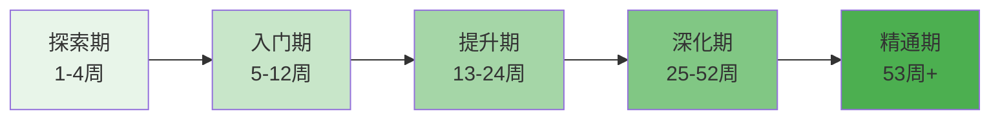

# 第十九章 兴趣爱好：学习路径

学习路径不是一张死板的时间表，而是一份经过验证的"成长地图"。它告诉你：在什么阶段该做什么事、达到什么标准才算合格、遇到瓶颈该怎么突破。本节提供从零基础到深度精通的完整路径规划，覆盖摄影、音乐、运动、手工、数字创作、写作、烹饪七大领域，并给出多爱好并行的组合策略。

## 一、学习路径的底层逻辑

在展开具体路径之前，先理解技能习得的底层规律。这些规律决定了路径为什么这样设计，也让你在偏离路径时知道如何自我调整。

### 1.1 技能习得的四阶段模型

任何技能的掌握都遵循"无意识无能力→有意识无能力→有意识有能力→无意识有能力"四个阶段，心理学中称为"能力四阶段模型"（Conscious Competence Model）。

| 阶段 | 状态 | 典型表现 | 学习策略 |
|------|------|----------|----------|
| 第一阶段：无知 | 不知道自己不会 | "这有什么难的？" | 广泛接触，建立认知 |
| 第二阶段：觉知 | 知道自己不会 | "原来这么复杂" | 系统学习基础，接受笨拙 |
| 第三阶段：刻意 | 知道自己会了 | "我能做好，但需要专注" | 刻意练习，形成肌肉记忆 |
| 第四阶段：自动化 | 不知道自己会了 | "随手就能做好" | 在复杂场景中应用，追求精进 |

理解这个模型的关键意义在于：**第二阶段是放弃率最高的阶段**。大多数人在这个阶段感到"我怎么这么笨"然后退出，但这是每个人必经的正常过程。学习路径的核心设计目标，就是帮助你安全地穿越第二阶段的"挫败谷"。

### 1.2 刻意练习的五个要素

本节所有路径都基于刻意练习理论设计。每个阶段的练习安排都包含以下五个要素：

- **明确目标**：每次练习有具体指标，如"今天练会C到G的和弦转换，做到0.5秒内完成"
- **专注投入**：练习时间不在于长，在于高质量。30分钟的专注练习胜过2小时心不在焉的重复
- **即时反馈**：通过录音、录像、同伴互评、教练指导获取反馈。没有反馈的练习是盲练
- **略超能力**：练习内容略高于当前水平。如果练习中感觉"轻松惬意"，说明太简单了
- **系统结构**：练习有计划、有重点，针对薄弱环节专项突破，而非随意重复已会的内容

### 1.3 学习路径的时间框架

所有路径统一使用五阶段时间框架，每个阶段有明确的核心任务和评估标准：

| 阶段 | 时间跨度 | 核心任务 | 每日投入 | 评估标准 |
|------|----------|----------|----------|----------|
| 探索期 | 第1-4周 | 广泛尝试，发现兴趣 | 15-30分钟 | 找到1-3个真正感兴趣的活动 |
| 入门期 | 第5-12周 | 建立基础技能 | 30-60分钟 | 能独立完成基础作品/动作 |
| 提升期 | 第13-24周 | 刻意练习核心技能 | 45-90分钟 | 掌握中级技法，有作品产出 |
| 深化期 | 第25-52周 | 形成个人风格 | 60-120分钟 | 有系列作品，参与社群交流 |
| 精通期 | 第53周+ | 持续精进与输出 | 灵活安排 | 能教学指导，作品被认可 |

**重要提醒**：时间框架是参考值，不是硬性指标。每个人的起点、天赋、可用时间不同，实际进度会有差异。关键是阶段完整、标准达到，而非严格卡时间。

***

## 二、摄影学习路径

摄影是门槛最低、见效最快的爱好之一——一部手机就能开始，当天就能出作品。但"会按快门"和"能拍出好照片"之间的距离，需要系统学习才能跨越。

### 2.1 探索期（第1-4周）：用手机建立视觉意识

这个阶段不急着买设备，用手机就能完成所有训练。核心目标是培养"摄影眼"——学会观察光线、构图和瞬间。

**第1周：构图基础**

每天花20分钟拍摄，专注于以下三种基础构图：

- **三分法则**：将画面分成3×3的九宫格，把主体放在四个交叉点上。手机相机设置中打开"网格线"辅助构图。每天拍5张，只练这一种构图
- **引导线**：利用道路、栏杆、河流等线条引导视线到主体。拍摄时蹲下或站高，改变角度找到最强的引导线
- **对称构图**：找水面倒影、建筑中轴线、走廊等对称元素。对称的关键是精确——差一点就不是对称而是歪斜

**练习任务**：每天拍5张照片，一周35张。周末从中选出最好的5张，分析好在哪里。下载Snapseed（免费），只学裁剪功能——好的裁剪能让普通照片提升一个档次。

**第2周：光线感知**

光线是摄影的灵魂。这一周的练习只有一个主题：同一个场景，不同光线下的表现。

- **顺光**（光从你背后照向主体）：色彩鲜艳，但缺乏立体感
- **侧光**（光从侧面照来）：明暗对比强烈，质感和立体感最好
- **逆光**（光从主体背后照来）：轮廓光效果，适合拍剪影和氛围感
- **散射光**（阴天或阴影中）：光线柔和，适合拍人像和静物

**练习任务**：选一个固定场景（窗边的花、街角的椅子），在早上、中午、傍晚、阴天各拍一张。对比四张照片，感受光线对画面的影响。学习Snapseed的亮度、对比度、高光、阴影调节。

**第3周：色彩与情绪**

色彩直接影响照片的情绪表达。暖色调（红、橙、黄）给人温暖、活力的感觉；冷色调（蓝、青、紫）给人冷静、忧郁的感觉。

- 学习互补色搭配（红-绿、蓝-橙、黄-紫），拍出视觉冲击力强的照片
- 尝试同色系拍摄：在一个场景中只找同一色系的元素
- 尝试极简色彩：画面中只有1-2种颜色

**第4周：主题练习与第一次"作品集"**

选择一个你感兴趣的主题（如"城市几何"、"光影故事"、"微小世界"），用一周时间拍摄15-20张照片。从中精选5张，进行后期处理，组成你的第一组"主题作品"。

**里程碑验证**：能拍出构图合理、光线得当、有主题感的照片。能在35张照片中选出5张好的——选片能力本身就是摄影的重要技能。

### 2.2 入门期（第5-12周）：从手机到相机的跨越

如果经过探索期你确认了对摄影的热情，这个阶段可以考虑购入第一台相机。但不强求——很多优秀摄影师始终用手机创作。

**设备决策矩阵**：

| 需求 | 推荐方案 | 预算 | 说明 |
|------|----------|------|------|
| 纯兴趣记录 | 继续用手机 | 0元 | 手机摄影完全可以走很远 |
| 想学手动控制 | 入门微单（如索尼A6400、富士X-T30） | 3000-5000元 | 轻便、画质好、镜头可换 |
| 预算有限 | 二手单反（如佳能80D、尼康D7200） | 1500-2500元 | 性价比高，但较重 |
| 不确定是否坚持 | 先租一台用两周 | 200-400元 | 先体验再决定，避免闲置 |

**第5-6周：认识相机的"语言"**

相机的核心是三个参数的组合——光圈、快门、ISO，它们共同决定照片的亮度和效果。

- **光圈（F值）**：控制进光量和景深。F1.8进光多、背景虚化强（适合人像）；F11进光少、前后都清晰（适合风景）
- **快门速度**：控制曝光时间和运动表现。1/1000秒冻结动作（适合运动）；1秒记录光轨（适合夜景）
- **ISO（感光度）**：控制传感器对光的敏感程度。ISO 100画质最佳；ISO 6400在暗处能拍但噪点多

三者的关系：光圈每开大一档，进光量翻倍；快门每慢一倍，进光量翻倍；ISO每翻一倍，感光度翻倍。要保持相同亮度，一个参数变了，另一个要相应调整。

**练习方法**：用A档（光圈优先）拍一周，感受不同光圈的效果。再用S档（快门优先）拍一周，感受不同快门的效果。最后尝试M档（全手动），在光线稳定的室内练习调参。

**第7-8周：对焦与测光**

- 学习单点对焦vs区域对焦的使用场景：静态主体用单点对焦（精确），运动主体用连续对焦（追焦）
- 学习评价测光、点测光、中央重点测光的区别
- 练习"先对焦再构图"的技巧：对焦锁定后移动相机重新构图

**第9-10周：场景实战**

每周专注一个场景，掌握该场景的核心技法：

- **人像**：大光圈虚化背景，关注眼神光，避免"大黑脸"（逆光时用反光板或闪光灯补光）
- **风景**：小光圈保证景深，使用三脚架，关注前景-中景-远景的层次
- **街拍**：快速反应，预设参数（光圈F8、ISO自动、快门1/250秒），抓拍决定性瞬间
- **静物/美食**：利用自然光（窗边），注意背景简洁，尝试45度俯拍和平拍两种角度

**第11-12周：后期处理入门**

学习Lightroom（桌面版或手机版）的核心功能：

- 基本调整：曝光、对比度、高光、阴影、白色色阶、黑色色阶
- 色彩调整：白平衡、饱和度、自然饱和度（HSL面板做精细色彩控制）
- 细节处理：锐化、降噪
- 局部调整：渐变滤镜、径向滤镜、画笔工具
- 导出设置：网络分享用sRGB色彩空间、长边2048像素；打印用Adobe RGB、原始分辨率

**里程碑验证**：能用M档在不同场景下正确曝光，后期处理能让照片质量提升一个档次。有20张以上的满意照片。

### 2.3 提升期（第13-24周）：从"会拍"到"拍好"

这个阶段的核心是从"技术正确"转向"表达有力"。技术是手段，表达才是目的。

**第13-16周：光线进阶**

- 学习黄金时段（日出后和日落前各1小时）拍摄：光线温暖柔和，阴影长长的，是最佳拍摄时间
- 蓝调时刻（日出前和日落后各20-30分钟）：天空呈深蓝色，适合城市夜景
- 人造光入门：了解闪光灯的基本用法（直闪、跳闪、离机闪），学会用一张白纸当简易柔光罩
- 学习光比控制：明暗比3:1适合人像，1:1适合证件照，8:1以上适合戏剧性效果

**第17-20周：构图进阶**

- 黄金螺旋（斐波那契螺旋）：比三分法更精细的引导线，适合曲线元素丰富的场景
- 框架构图：利用门框、窗户、树枝等元素"框住"主体，增加纵深感
- 负空间构图：大面积留白中放一个小主体，营造孤独感、宁静感
- 打破规则：学会规则之后，有意识地打破它——把主体正中央、故意歪斜、裁掉头部——关键是知道你在打破什么规则，以及为什么

**第21-24周：主题创作与风格探索**

研究10位不同风格的摄影师（如Ansel Adams的风光、Steve McCurry的人文、Fan Ho的光影），分析他们的共同特征。选择2-3位你最喜欢的，模仿他们的风格拍摄一组作品。模仿不是抄袭——它是学习的捷径。通过模仿，你理解为什么这样拍有效，然后逐渐加入自己的理解和偏好。

**里程碑验证**：能完成一组有主题、有风格的系列作品（至少8张）。能清晰地说出自己的照片"好在哪里"——技术层面和表达层面。

### 2.4 深化期（第25-52周）：从"拍好"到"有态度"

- 每月完成一个主题项目（如"30天街头陌生人"、"同一棵树的四季"）
- 参加摄影社群的互评活动，学习接受和给出建设性批评
- 尝试参加摄影比赛或投稿
- 学习更高级的后期技法：蒙版合成、HDR、全景拼接
- 如果专注人像，学习引导模特的沟通技巧

### 2.5 精通期（第53周+）：输出倒逼输入

- 开设摄影社交媒体账号，定期发布作品
- 在社群中担任点评角色，通过教学深化理解
- 策划个人摄影展或制作摄影集
- 尝试商业摄影或自由职业方向

***

## 三、音乐学习路径

音乐学习的最大挑战是"入门期的枯燥"——手指痛、节奏乱、音不准。学习路径的设计重点就是让这个阶段尽可能短，尽快让你弹出第一首完整的曲子，获得正反馈。

### 3.1 吉他学习路径

吉他是最受欢迎的自学乐器之一，因为它入门快、携带方便、适合弹唱。

**选琴指南**：

| 类型 | 适合人群 | 预算 | 特点 |
|------|----------|------|------|
| 尼龙弦古典吉他 | 指弹入门、手指敏感者 | 500-1000元 | 弦软好按，声音温暖 |
| 钢弦民谣吉他 | 弹唱、流行歌曲 | 500-1500元 | 声音明亮，最常见 |
| 电吉他 | 摇滚、金属、蓝调 | 1500-3000元（含音箱） | 弦最软好按，需额外设备 |

初学者推荐从民谣吉他入手。品牌方面，雅马哈F310/F600、卡马D1C都是经过市场验证的入门琴，价格在500-800元之间，做工和音色完全够用。不要买200元以下的"烧火棍"——弦距太高、音准不准，会直接劝退。

**探索期（第1-4周）：弹出第一个音到第一首歌**

第1周的核心任务：让手指适应琴弦。

- 第1天：了解吉他各部位名称（琴头、琴颈、琴身、品丝、琴桥），学会调音（推荐App：GuitarTuna）
- 第2-3天：右手拨弦练习——大拇指负责第4/5/6弦，食指第3弦，中指第2弦，无名指第1弦。空弦拨弦，每根弦拨10次，确保声音干净不闷
- 第4-5天：左手按弦——食指按第1品，中指按第2品，无名指按第3品。按弦要点：指尖按弦、靠近品丝（不是按在品丝上）、按到弦贴紧品丝为止
- 第6-7天：练习C大调音阶前5个音（C-D-E-F-G），在第1弦和第2弦上

**关键提醒**：第1周手指会痛，这是正常的。尼龙弦比钢弦好按一些。每天练习15-20分钟即可，不要硬撑到手指破皮。大约2-3周后指尖会长出茧子，疼痛感消失。

第2-4周：和弦与第一首歌。

- 第2周：学习Em和弦（最简单的和弦，只需两根手指），练习按住→拨弦→松开→再按的循环，目标是每个和弦都能发出清晰的6个音
- 第3周：学习Am和弦，练习Em到Am的和弦转换。转换要点：手指同时抬起、同时落下，不要一个一个移动。每天练习转换50次
- 第4周：学习C和弦，用Em-Am-C三个和弦尝试弹唱《小星星》或《生日快乐》。节奏型：下-下-下-下（最简单的四拍一下）

**里程碑验证**：能用三个和弦弹唱一首简单的歌，即使节奏不稳、转换慢也没关系。

**入门期（第5-12周）：构建和弦库与节奏感**

- 第5-6周：学习G、D和弦，掌握C-G-Am-Em-F（其中F用简化版小横按）这五个万能和弦。每天练习和弦转换组合，目标是任意两个和弦之间0.5秒内完成转换
- 第7-8周：学习基本扫弦节奏型——下下上上下上（4/4拍最常用节奏），配合之前学的和弦练习
- 第9-10周：选一首你最喜欢的、和弦简单的歌（推荐：《晴天》《平凡之路》《成都》），完整学习弹唱。先练和弦转换部分（不唱），再配合节奏型（不唱），最后加上唱
- 第11-12周：学习更多节奏型（切音、闷音、拍弦），丰富伴奏表现力

**提升期（第13-24周）：从弹唱到指弹**

- 第13-16周：学习基础乐理——大调音阶构成、和弦级数（I-IV-V-vi）、调式概念。理解了乐理，新歌学起来快10倍
- 第17-20周：开始指弹入门——学习右手分解和弦（p-i-m-a指法），练习经典指弹曲《Romance》或《天空之城》简化版
- 第21-24周：尝试即兴伴奏——听到一首歌能快速判断和弦走向，自己编配伴奏

**推荐学习资源**：
- 书籍：《吉他自学三月通》（刘传）适合系统学习
- App：GuitarTuna（调音）、Ultimate Guitar（谱库）、Yousician（互动教学）
- YouTube频道：JustinGuitar（英文，最系统的免费课程）、大树音乐屋（中文）

### 3.2 钢琴/键盘学习路径

钢琴的优势是音域宽广、表现力强，且键盘布局直观——音高从左到右递增，比吉他更容易理解乐理。

**选琴建议**：不建议初学者直接买真钢琴（价格高、占空间、需调律）。88键配重键盘是最佳起步选择，推荐雅马哈P-45/P-145（2000-3000元）或罗兰FP-10（2000元左右）。61键电子琴也能起步，但半年后会不够用。

**探索期（第1-4周）**

- 第1周：认识键盘布局——找到所有C音（白键中每组最左边的键）、学习正确的坐姿（手肘与键盘同高）和手型（手指自然弯曲，像握一个鸡蛋）
- 第2周：右手C大调音阶（C-D-E-F-G-A-B-C），用1-2-3-1-2-3-4-5指法。慢速弹，保证每个音清晰均匀
- 第3周：左手C大调音阶，指法与右手镜像。然后尝试双手同向弹奏——先极慢速，一个音一个音对齐
- 第4周：学习C和弦（C-E-G）和G和弦（G-B-D），右手弹和弦、左手弹根音。尝试简单的双手配合

**入门期（第5-12周）**

- 第5-6周：学习Am、F和弦，练习和弦连接。学习简单的左手伴奏模式——八度根音+五度（如C-G、D-A）
- 第7-8周：学习第一首完整曲子（推荐《欢乐颂》或《River Flows in You》简化版）。分手练习→慢速合手→逐步提速
- 第9-12周：每周学一首新曲，积累曲目。开始学习踏板的使用（延音踏板）。接触不同音乐风格

**提升期（第13-24周）**

- 学习音阶与琶音的系统练习（所有大调、关系小调）
- 学习即兴伴奏——流行歌的万能和弦走向（I-V-vi-IV）能配上百首歌
- 尝试不同风格：古典（巴赫小步舞曲）、流行（周杰伦简单曲目）、爵士（基础布鲁斯）
- 学习读谱能力——五线谱是钢琴的"母语"，越早学会越受益

**推荐资源**：
- App：Simply Piano（游戏化教学）、Flowkey（跟随学习）
- 书籍：《成人钢琴自学教程》（李重光）
- YouTube：Piano Genius、Cindy Free Piano（中文）

### 3.3 尤克里里学习路径（额外推荐）

尤克里里是比吉他更简单的弦乐器，只有4根尼龙弦，按弦轻松，2周就能弹唱第一首歌。适合：
- 手指力量较弱的初学者
- 想要快速获得成就感的人
- 预算有限（200-500元就能买一把不错的琴）
- 旅行携带需求

学习路径比吉他缩短约40%，因为和弦更简单（多数只需1-2根手指），节奏型也更容易上手。

***

## 四、运动学习路径

运动爱好与其他爱好的最大区别是：它直接改变你的身体。这意味着学习路径必须考虑体能基础、伤病预防和渐进超负荷原则。

### 4.1 跑步学习路径

跑步是最容易开始的运动——一双鞋、一条路就够了。但"能跑"和"跑得好"之间有巨大的差距，盲目跑步是膝伤的高发原因。

**探索期（第1-4周）：从走到跑**

这个阶段的核心不是"跑多快"，而是"建立习惯"。很多初学者一上来就猛跑，第二天浑身酸痛，然后就再也不跑了。

| 周次 | 训练内容 | 时长 | 频率 | 心率区间 |
|------|----------|------|------|----------|
| 第1周 | 快走 | 30分钟 | 隔天 | 最大心率的50-60% |
| 第2周 | 快走3分钟+慢跑1分钟，循环6次 | 24分钟 | 隔天 | 最大心率的60-70% |
| 第3周 | 快走2分钟+慢跑2分钟，循环6次 | 24分钟 | 隔天 | 最大心率的60-70% |
| 第4周 | 快走1分钟+慢跑3分钟，循环5次 | 20分钟 | 隔天 | 最大心率的65-75% |

**最大心率简易计算**：220 - 你的年龄。例如28岁，最大心率约192，60%心率约115。

**装备**：入门跑鞋推荐亚瑟士GEL-CONTEND、美津浓WAVE RIDER（300-500元），不要穿板鞋或帆布鞋跑步。运动衣裤选速干材质即可。

**入门期（第5-12周）：连续跑30分钟到5公里**

- 第5-6周：连续慢跑15-20分钟，配速不重要，能不停下来就是胜利
- 第7-8周：连续慢跑25-30分钟，约3公里
- 第9-10周：连续跑30-35分钟，约4公里
- 第11-12周：完成第一个5公里，用时不限

**跑步常见错误**：
- 步幅过大：步幅大反而效率低且伤膝盖，小步快频更高效
- 落地太重：前脚掌或中脚掌着地，减少冲击力
- 呼吸混乱：两步一吸两步一呼（中低强度）或三步一吸两步一呼（高强度）
- 不做热身：跑前5分钟动态热身（高抬腿、弓步走、腿部摆动），跑后5分钟静态拉伸

**提升期（第13-24周）：从5公里到10公里**

- 学习间歇训练：快跑400米+慢跑400米，重复6-8组，提升速度
- 学习节奏跑：以比赛配速跑20-30分钟，训练比赛节奏
- 逐渐增加周跑量（每周增幅不超过10%）
- 尝试第一次10公里

**推荐资源**：
- App：Keep（训练计划）、Nike Run Club（语音指导跑步）
- 书籍：《跑步，该怎么跑》（尼可拉斯·罗曼诺夫）——纠正跑姿的经典

### 4.2 力量训练路径

力量训练是最被低估的运动形式。它不仅塑形，还提升基础代谢、保护关节、预防骨质疏松、改善体态。

**探索期（第1-4周）：学会基础动作模式**

人体有六个基本动作模式：推、拉、蹲、铰链（弯腰）、单腿、核心。这个阶段的目标是学会这六个动作的正确形式。

- **深蹲（蹲）**：双脚与肩同宽，脚尖微外展，臀部向后坐，膝盖跟随脚尖方向。蹲到大腿与地面平行或更低。初学者可以先用椅子辅助——蹲到碰到椅子就站起来
- **俯卧撑（推）**：手比肩略宽，身体成一条直线。做不到标准俯卧撑？从墙壁俯卧撑→桌面俯卧撑→跪姿俯卧撑→标准俯卧撑逐步进阶
- **划船（拉）**：用弹力带或哑铃，弯腰45度，肘部向后拉。感受肩胛骨夹紧
- **硬拉（铰链）**：膝盖微弯，臀部向后推，上身前倾，保持背部挺直。初学者先用壶铃或哑铃练习
- **弓步蹲（单腿）**：一脚前一脚后，后膝接近地面，前膝不超过脚尖
- **平板支撑（核心）**：手肘撑地，身体成一条直线。初学者目标30秒，逐渐增加到2分钟

**入门期（第5-12周）：建立训练计划**

采用全身训练模式，每周3次（如周一、周三、周五），每次40-50分钟：

| 动作 | 组数×次数 | 备注 |
|------|-----------|------|
| 深蹲 | 3×10 | 徒手或持壶铃 |
| 俯卧撑 | 3×8-12 | 根据能力选择变式 |
| 哑铃划船 | 3×10（每侧） | 左右各做 |
| 罗马尼亚硬拉 | 3×10 | 持哑铃 |
| 弓步蹲 | 3×8（每侧） | 前后交替 |
| 平板支撑 | 3×30秒 | 逐渐延长 |

**提升期（第13-24周）**：增加训练分化（上肢/下肢分开训练），学习使用杠铃，逐渐增加负重。每2-4周增加一点重量或次数，这就是"渐进超负荷"。

**推荐资源**：
- App：Keep（有完整训练计划）、Strong（记录训练数据）
- YouTube：Jeff Nippard（科学训练）、叔贵（中文，讲解清晰）

### 4.3 瑜伽学习路径

瑜伽不只是"拉伸"——它是身体力量、柔韧性、平衡感和呼吸控制的综合训练。

**探索期（第1-4周）：10个基础体式**

学习并能完成以下体式，每个保持5个呼吸：

山式（Tadasana）、下犬式（Downward Dog）、战士一式（Warrior I）、战士二式（Warrior II）、三角式（Triangle）、树式（Tree）、猫牛式（Cat-Cow）、婴儿式（Child's）、桥式（Bridge）、仰卧扭转（Supine Twist）

每周3次，每次20-30分钟。推荐跟练App：每日瑜伽（中文）、Down Dog（英文，可自定义难度和时长）。

**入门期（第5-12周）**：学习拜日式A和拜日式B（各12个动作的流动序列），能完整流畅地完成。开始理解"呼吸带动动作"的原则——每个动作配合一次吸气或呼气。

**提升期（第13-24周）**：尝试不同流派——哈他瑜伽（慢速精准）、流瑜伽（Vinyasa，动作流畅）、阴瑜伽（长时间保持，深度拉伸）。选择适合自己的方向深入。

***

## 五、手工创作学习路径

手工创作的独特价值在于：它是少数能同时调动双手、大脑和审美的活动，且最终产出实实在在的物品——这种"从无到有"的满足感是其他爱好难以替代的。

### 5.1 木工学习路径

**探索期（第1-4周）：认识工具与安全**

木工的安全风险高于多数爱好，这个阶段必须建立安全意识。

第1周：认识基本手动工具——手锯、锤子、螺丝刀、凿子、刨子、卷尺、铅笔、直角尺。了解每个工具的用途和安全操作规范。最重要的一条：**永远不要用手去接掉落的工具**。

第2周：学习测量和标记——"量两次，切一次"是木工的金科玉律。练习用卷尺测量、用铅笔标记、用直角尺画直角。

第3周：学习切割和打磨——用手锯沿直线切割木料，用砂纸（从80目到240目逐步细磨）打磨表面。

第4周：完成第一件作品——切菜板。只需一块木板、锯子、砂纸和食用级木蜡油。这个项目涉及测量、切割、打磨、上油的完整流程，且每天都能用到。

**入门期（第5-12周）**：学习基础榫卯（直榫、搭榫），了解常见木材特性（松木软好加工、橡木硬纹理美、胡桃木色深高级），完成3-5件基础作品（小凳子、书架、收纳盒）。

**装备投入**：入门工具套装300-500元（含手锯、锤子、凿子套装、卷尺等），木材按项目购买。不建议一开始就买电动工具——先用手动工具建立手感和理解。

**推荐资源**：YouTube频道"木工爱好者之家"、书籍《木工基础》（邱永年）

### 5.2 编织学习路径（钩针）

钩针编织是入门门槛最低的手工之一——只需一根钩针和一团毛线。

**探索期（第1-4周）**

- 第1周：学习锁针（链针）和短针——这是所有钩针技法的基础。用粗毛线（5mm以上）和对应的粗钩针，更容易看清针目
- 第2周：学习长针和中长针，练习方形织片
- 第3周：学习环形起针和圆形织片
- 第4周：完成第一个作品——杯垫或小方巾

**入门期（第5-12周）**：学习换色、加减针、拼接花片，完成围巾、帽子、小包包等实用作品。学会看简单的文字图解。

**推荐资源**：App"编织人生"、B站搜索"钩针入门"

***

## 六、数字创作学习路径

### 6.1 数字绘画/插画

数字绘画的优势是"无限撤销"和"零材料成本"——一块数位板就能开始。

**设备选择**：

| 阶段 | 推荐设备 | 预算 |
|------|----------|------|
| 初学 | 入门数位板（Wacom Intuos S或高漫GM220） | 200-500元 |
| 进阶 | 数位屏（Wacom One或XP-Pen Artist 12） | 1500-3000元 |
| 专业 | iPad + Apple Pencil + Procreate | 3000-5000元 |

**软件**：Procreate（iPad，买断制68元）、Clip Studio Paint（全平台，月费制）、Krita（电脑，免费开源）

**学习路径**：

- 第1-4周：线条练习——画直线、曲线、圆、椭圆。每天30分钟，填满一张A4纸的线条练习。学习软件基本操作（图层、画笔、橡皮、撤销）
- 第5-12周：学习人体结构基础（火柴人→方块人→肌肉结构），每天画30分钟速写（30秒-2分钟一张的快速人体速写）
- 第13-24周：学习色彩理论和光影关系，临摹喜欢的插画作品
- 第25周+：开始原创作品，建立个人风格

### 6.2 编程作为爱好

编程是极少数能"创造工具"的爱好——你写的程序可以解决实际问题、自动化重复任务、甚至创造产品。

**学习路径**（以Python为例）：

- 第1-4周：学习基础语法（变量、条件、循环、函数），用Codecademy或菜鸟教程在线练习
- 第5-12周：完成3个小项目（如猜数字游戏、待办清单、文件整理脚本），学习使用Git管理代码
- 第13-24周：选择方向深入——Web开发、数据分析、自动化脚本、小游戏开发
- 第25周+：参与开源项目，建立GitHub作品集

**推荐资源**：
- 入门：《Python编程：从入门到实践》（Eric Matthes）
- 练习平台：LeetCode（算法）、Codewars（编程挑战）、Kaggle（数据科学）

***

## 七、写作学习路径

写作是成本最低但回报最高的爱好——只需要纸笔或一个文本编辑器。它训练思维的清晰度、表达的精准度，且成果可以直接分享。

### 7.1 探索期（第1-4周）：建立写作习惯

- 每天写200字，主题不限。可以是日记、读后感、观察笔记、随想
- 关键原则：**先完成，再完美**。不要反复修改第一句话，从头写到尾
- 推荐工具：Obsidian（本地Markdown笔记）、Notion、或最简单的备忘录

### 7.2 入门期（第5-12周）：学习写作结构

- 学习"总-分-总"结构、SCQA框架（情境-冲突-问题-答案）、金字塔原理
- 每周写一篇800-1500字的完整文章（观点文、书评、经验分享）
- 大量阅读——读你喜欢的作者，分析他们为什么写得好

### 7.3 提升期（第13-24周）：精进表达

- 学习"展示而非讲述"（Show, don't tell）——用具体场景代替抽象描述
- 练习不同的文体：故事、评论、教程、散文
- 开设写作账号（公众号、知乎、简书），获得读者反馈
- 参加写作社群的互评活动

### 7.4 推荐资源

- 书籍：《写作这回事》（斯蒂芬·金）、《风格感觉》（史蒂芬·平克）、《金字塔原理》（芭芭拉·明托）
- 社群：豆瓣写作小组、知乎写作话题

***

## 八、烹饪学习路径

烹饪是实用性最强的爱好——你每天都要吃饭，学好烹饪直接提升生活质量，还能省钱、社交、取悦家人。

### 8.1 探索期（第1-4周）：掌握基础烹饪技法

第1周：学会煮饭（电饭煲）、煮面、煮蛋——能"喂饱自己"是第一目标。

第2周：学习基本刀工——切丝、切片、切丁、滚刀块。每天用一个便宜的蔬菜（土豆、胡萝卜）练习。刀工不追求速度，追求均匀——大小均匀才能同时熟。

第3周：学习"炒"——先热锅再倒油，油热后下菜，大火快炒。从最简单的蒜蓉炒青菜开始。

第4周：学习"炖/煮"——番茄蛋汤、土豆炖排骨。理解"大火烧开、小火慢炖"的原理。

### 8.2 入门期（第5-12周）：菜系基础

- 每周学做2-3道新菜，优先学你最爱吃的
- 学习调味的基本逻辑：咸（盐/酱油）、甜（糖）、酸（醋/柠檬）、辣（辣椒）、鲜（味精/蚝油）、香（葱姜蒜/香料）
- 掌握5种基础酱汁：蒜蓉酱、糖醋汁、红烧汁、咖喱酱、油醋汁
- 学会读菜谱并理解关键步骤的"为什么"

### 8.3 提升期（第13-24周）：深化理解

- 深入学习一个菜系（中式、日式、意式、东南亚，选你最喜欢的）
- 学习食材搭配原理——什么和什么是经典搭配，为什么
- 尝试自己改良菜谱——换一种调味、换一种烹饪方式
- 学习摆盘和拍照——做的好看也是一种技能

**推荐资源**：
- App：下厨房（最全的中文菜谱平台）
- YouTube：美食作家王刚（专业技法）、曼食慢语（家庭料理）
- 书籍：《盐、油、酸、热》（Samin Nosrat）——理解烹饪四大元素

***

## 九、多爱好并行的组合策略

很多人不只对一件事感兴趣，但时间和精力有限。如何合理组合多个爱好？

### 9.1 爱好组合的黄金法则

**动静搭配**：一个动态爱好（运动）+ 一个静态爱好（绘画/音乐/写作）。动态爱好消耗体力但恢复精力，静态爱好消耗脑力但培养专注，两者互补。

**输出输入搭配**：一个"输出型"爱好（写作、绘画、烹饪）+ 一个"输入型"爱好（阅读、听音乐、看电影）。输出需要创造力，输入提供素材和灵感。

**社交独处搭配**：一个适合群体的爱好（团队运动、合唱）+ 一个享受独处的爱好（绘画、写作、木工）。满足不同的社交需求。

### 9.2 时间分配方案

| 可用时间 | 建议爱好数量 | 分配方式 |
|----------|-------------|----------|
| 每周3-5小时 | 1-2个 | 全部投入，深度优先 |
| 每周5-10小时 | 2-3个 | 主次分明，70%主爱好+30%副爱好 |
| 每周10-15小时 | 3-4个 | 2个重点+1-2个轻松爱好 |
| 每周15小时以上 | 3-5个 | 灵活安排，注意避免疲劳 |

### 9.3 防止"兴趣疲劳"的策略

- **轮换制**：每周专注一个爱好，下周换另一个，保持新鲜感
- **季节制**：春夏偏户外（跑步、摄影），秋冬偏室内（乐器、手工、烹饪）
- **项目制**：为每个爱好设定一个具体项目（如"拍一组秋天的照片"、"学会弹《天空之城>"），项目完成后切换
- **允许休息**：任何一个爱好连续练习超过2个月，允许自己休息1-2周。休息不是放弃，是充电

***

## 十、学习进度跟踪与瓶颈突破

### 10.1 建立个人进度追踪系统

推荐使用以下方法组合：

- **作品集**：定期整理作品（照片、音频、视频、实物），这是最直观的进步证明。每3个月对比一次，你会惊讶于自己的成长
- **练习日志**：用笔记本或App记录每天的练习内容、时长、感受和问题。格式简单：日期+练习内容+收获+待改进。不需要长篇大论，几句话就行
- **里程碑清单**：为每个爱好列出5-10个里程碑（如"完成第一个5公里"、"学会F和弦"、"做出第一个榫卯"），达成后打勾
- **定期回顾**：每月花30分钟回顾这个月的练习日志和作品，问自己三个问题：进步了什么？卡在哪里？下个月重点是什么？

### 10.2 瓶颈期的应对策略

每个学习者都会遇到瓶颈——感觉自己怎么练都没有进步。这是正常的，但需要正确应对。

**瓶颈的三种类型与对策**：

| 类型 | 表现 | 原因 | 对策 |
|------|------|------|------|
| 技术瓶颈 | 某个动作/技巧始终做不好 | 基础不牢或发力方式错误 | 回到基础动作重新练习，找教练或视频对比纠正 |
| 理解瓶颈 | 知道怎么做但不知道为什么 | 知其然不知其所以然 | 学习相关理论，理解原理后再练习 |
| 动力瓶颈 | 提不起兴趣，不想练习 | 长期重复导致倦怠 | 换个方向/风格、参加社群活动、降低练习强度 |

**通用瓶颈突破法**：

1. **分解法**：把困难动作分解成更小的子动作，逐个突破。比如吉他F和弦难，先练食指横按，再加其他手指
2. **对比法**：录下自己的动作，对比高手的视频，找到差距
3. **慢练法**：把速度降到正常的一半甚至更慢，确保每个细节都正确，再逐步提速
4. **换境法**：换个环境练习——去不同的地方拍照、用不同的乐器弹同一首曲子、在不同的厨房做饭
5. **教人法**：把你会的教给别人。教学过程中你会发现自己的理解漏洞

### 10.3 保持动力的心理策略

- **记录起点**：在开始之前拍一张照片、录一段音频、写一段文字。一个月后回看，你会发现自己进步了多少
- **设置小里程碑**：不要只盯着"精通"的大目标，把大目标分解成每2-4周一个的小里程碑。每达成一个，给自己一个小奖励
- **加入社群**：一个人走得快，一群人走得远。加入相关的线上社群（豆瓣小组、微信群、Discord、Reddit），看别人的作品、分享自己的进步
- **允许"烂作品"**：不是每次练习都要出精品。允许自己做出糟糕的作品，这是学习的正常部分。完美主义者最容易在"达不到预期"时放弃
- **关联身份**：不要说"我在学摄影"，说"我是摄影爱好者"。身份认同比行为驱动更有持久力——你会因为"我是摄影爱好者"而坚持拍摄，而不需要每次都说服自己"我应该去练习"

***

## 本节小结

学习路径的核心不是时间表，而是"正确的方法 × 持续的投入 × 适时的调整"。具体要点：

**路径设计原则**：基于刻意练习的五要素（明确目标、专注投入、即时反馈、略超能力、系统结构），遵循四阶段能力模型，让学习者安全穿越"挫败谷"。

**阶段核心任务**：探索期广泛尝试找兴趣，入门期建立基础技能，提升期刻意练习核心技法，深化期形成个人风格，精通期通过输出倒逼输入。

**每个领域的路径特色**：摄影从手机建立视觉意识起步，音乐以"快速弹出第一首歌"驱动正反馈，运动强调渐进超负荷和伤病预防，手工从安全意识和工具认知开始，数字创作利用"零成本试错"的优势快速迭代。

**多爱好并行**：遵循动静搭配、输出输入搭配、社交独处搭配的黄金法则，合理分配时间精力。

**进度追踪与瓶颈突破**：建立作品集+练习日志+里程碑清单的追踪体系，遇到瓶颈时用分解法、对比法、慢练法、换境法、教人法突破。

记住，学习路径是地图，不是铁轨。你可以根据自己的节奏调整速度，可以探索路径之外的风景，但不要停下脚步。持续练习，享受过程，成长自然会发生。

在下一节中，我们将揭示培养兴趣爱好时常犯的错误，帮助你避免踩坑，保持持续的热情。
