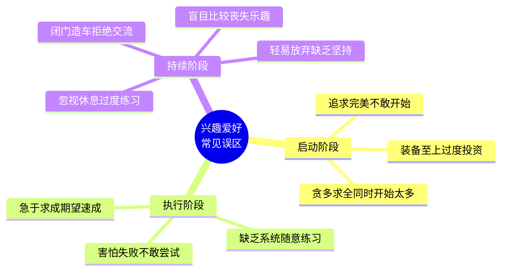
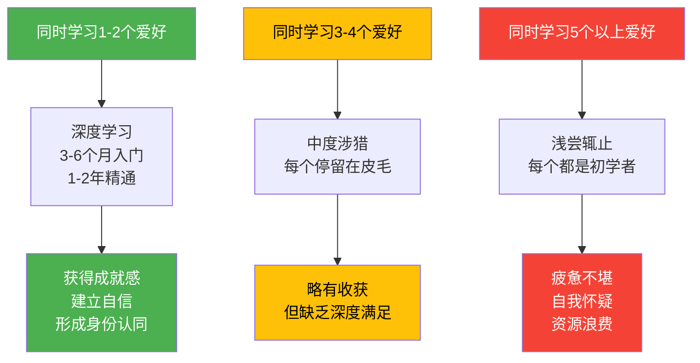
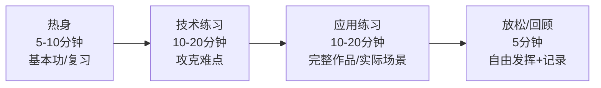
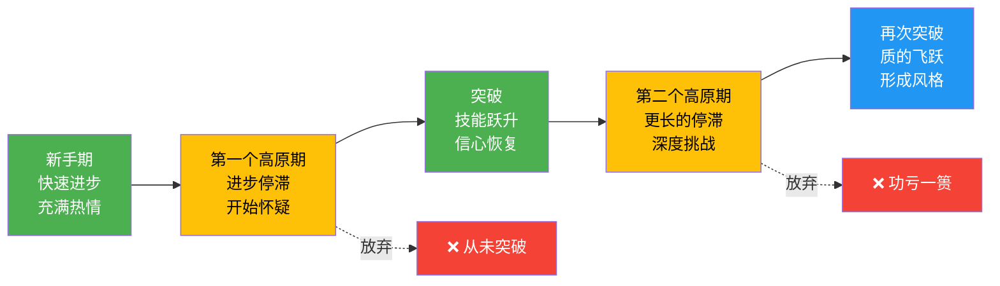
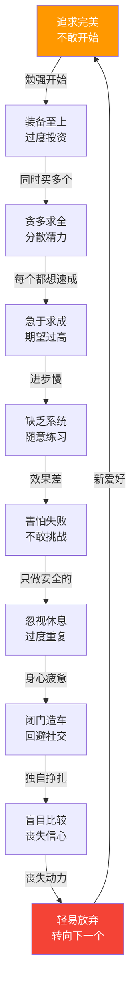

# 第十九章 兴趣爱好：常见误区

## 为什么误区如此普遍

在培养兴趣爱好的过程中，几乎每个人都会踩坑。这些坑并非个人缺陷，而是人类认知偏差和行为模式的自然产物。理解误区背后的认知机制，是避免它们的第一步。

认知心理学家丹尼尔·卡尼曼在《思考，快与慢》中提出了"系统1"和"系统2"两种思维模式。系统1是快速、自动、情绪化的直觉思维，系统2是缓慢、刻意、理性的分析思维。多数误区的产生，正是因为我们依赖系统1做判断——"装备越贵越好"是直觉，"练得越多越快"也是直觉——而没有激活系统2进行理性分析。

以下内容从认知机制、典型表现、危害分析、纠正方法四个维度，逐个拆解培养爱好时最常犯的十大误区。每个误区都配有真实案例、可操作的纠正方案，以及"自检清单"帮助你判断自己是否正在陷入该陷阱。

---

## 误区一：追求完美，迟迟不敢开始

### 认知机制

这是所有误区中最普遍的一个，其心理学根源是**完美主义倾向**与**损失厌恶**的叠加效应。

完美主义者在潜意识中建立了"要么做到最好，要么不做"的二元逻辑。他们害怕产出不完美的作品会损害自我形象，因此用"准备"来无限期推迟行动。行为经济学家丹尼尔·卡尼曼的研究表明，人类对损失的敏感度是获得的2倍——对完美主义者来说，"做得不好"被大脑编码为一种"损失"，因此他们宁可不开始，也不愿承受"做得不好"的风险。

心理学家保罗·休伊特和戈登·弗莱特将完美主义分为三种类型：

| 类型 | 核心特征 | 在爱好中的表现 |
|------|----------|---------------|
| 自我导向型 | 对自己要求极高 | "我必须一上手就做得很好" |
| 社会期望型 | 认为别人对自己要求高 | "别人会笑话我的初学者作品" |
| 他人导向型 | 对别人要求高 | "这个老师教得不够好，我学不了" |

多数人陷入的是前两种类型的组合。社会期望型尤其隐蔽——你以为是别人在评判你，其实大多数人在忙于关注自己，根本没空评价你。

### 典型表现

- 花三个月研究各种相机参数和评测，却一张照片都没拍
- 收藏了200个绘画教程视频，但从没打开过画板
- 在网上对比了所有吉他品牌，却连吉他都没摸过
- 反复修改第一次要做的手工项目方案，从纸模型改到3D建模，最终什么都没做出来
- 总说"等忙完这阵子就开始"，但永远有下一个"这阵子"

**真实案例：** 小王想学摄影，花了半年时间在各种论坛研究相机。他从入门单反看到全画幅无反，从副厂镜头看到原厂红圈，研究了构图法则、光线理论、后期流程，收藏了几百篇教程。半年后，他的第一张照片还是用手机拍的——因为相机还没买。而他的同事小李，同期已经用手机拍了上千张照片，办了一次小型影展，甚至开始接婚礼跟拍的活。

### 危害分析

这种误区的核心危害不是"浪费时间研究"——研究本身有价值——而是**用"准备的忙碌感"替代"行动的焦虑感"**。你以为自己在为爱好做准备，实际上你在逃避进入初学者状态的心理不适。更深层的危害是，长时间的"准备"会建立越来越高的期望门槛——研究得越多，对"第一次"的期望越高，最终越不敢开始。

### 纠正方法

**1. 最小启动法**

将"开始"定义为一个不可能失败的小动作：

| 爱好 | 最小启动动作 | 时间投入 |
|------|-------------|---------|
| 摄影 | 用手机拍3张照片 | 5分钟 |
| 吉他 | 学会一个和弦的按法 | 10分钟 |
| 绘画 | 在纸上画一个苹果 | 15分钟 |
| 编程 | 写出"Hello World" | 10分钟 |
| 烹饪 | 做一个煎蛋 | 10分钟 |
| 跑步 | 出门跑500米 | 5分钟 |
| 写作 | 写100字的日记 | 5分钟 |
| 摄影后期 | 用手机App调一张照片的亮度 | 3分钟 |

关键原则：这个动作必须小到你没有任何借口不做。如果5分钟太长，那就1分钟——拿起吉他，拨一下弦，完成。

**2. 设定"垃圾版本"目标**

刻意要求自己产出"糟糕的第一版"。这不是自嘲，而是一种认知策略——当你主动允许自己做得不好时，完美主义的压力就消失了。

具体做法：告诉自己"今天的目标就是做出一个垃圾版本"。画家伊丽莎白·吉尔伯特在《创造力》一书中建议："把你的作品称为'实验'而不是'作品'，把失败称为'数据'而不是'灾难'。"

**3. 2分钟规则**

如果一件事的启动时间不超过2分钟，立刻做。这是大卫·艾伦在《搞定》中提出的核心原则之一。应用于爱好：拿起画笔、打开笔记本、走出家门——这些动作都在2分钟以内。一旦开始，惯性会推动你继续。

**4. 公开承诺**

在社交媒体上宣布"我今天开始学吉他"，或者告诉一个朋友。公开承诺会产生社会压力，让"不开始"的心理成本高于"开始做得不好"的心理成本。

### 自检清单

- [ ] 你是否在"研究阶段"停留超过一个月，却没有实际动手？
- [ ] 你是否收藏/购买了大量教程但从未开始学习？
- [ ] 你是否经常用"等我准备好了就开始"来推迟行动？
- [ ] 你是否害怕别人看到你的初学者作品？

如果以上有2项以上符合，你可能正在陷入这个误区。

---

## 误区二：装备至上，过度投资

### 认知机制

这个误区的心理学根源是**控制错觉**和**可得性偏差**。

控制错觉让人误以为购买更好的装备可以掌控学习结果——"如果我有最好的相机，就能拍出好照片"。但技能的提升主要取决于练习和经验，装备只是辅助工具。可得性偏差则让人过度关注装备这个"可见因素"，而忽视练习这个"不可见因素"——装备可以一次性购买并展示，而练习需要日复一日的投入，没有"完成"的标志。

此外，购买装备本身会带来**多巴胺奖励**。神经科学研究表明，购物行为（尤其是购买与目标相关的物品）会激活大脑的奖赏回路，产生"已经有所进展"的错觉。这就是为什么很多人买了装备后反而动力下降——大脑已经获得了"奖励"，行动的驱动力反而减弱了。心理学家称之为**"目标替代"**（goal substitution）：购买装备这个子目标替代了学习技能这个主目标。

### 典型表现

- 还没学会做菜就买了全套德系厨具和铸铁锅
- 还没学会基本构图就买了两万块的全画幅相机和三个镜头
- 还没坚持跑步一个月就买了专业跑鞋、运动手表、压缩衣
- 还没学会和弦就买了五把不同风格的吉他
- 花在选装备上的时间比实际练习的时间还多

**真实案例：** 小陈想学咖啡，先花8000元买了半自动咖啡机、电动磨豆机、各种手冲壶和滤杯，又花了3000元买了不同产区的精品豆。结果他连基本的萃取原理都没搞清楚，做出来的咖啡还不如速溶好喝。设备放在厨房吃灰，每次看到都有一种"我花了钱但什么都没学到"的挫败感。而他的朋友小张，用一个法压壶和超市买的咖啡豆起步，三个月后已经能稳定出品好喝的咖啡，半年后才升级设备。

### 投资与回报的正确关系

装备投资的回报曲线不是线性的，而是边际递减的：

初学者投入80%的装备预算，只能获得20%的技能提升。而将同样的预算用于课程、工作坊、书籍，回报率要高得多。

### 纠正方法

**1. 入门装备清单原则**

对于每种爱好，只需购买"最小可行装备"：

| 爱好 | 入门装备 | 预算参考 | 升级时机 |
|------|---------|---------|---------|
| 摄影 | 手机或二手入门单反 | 0-3000元 | 拍了5000张以上且能指出设备限制 |
| 吉他 | 入门面单吉他 | 500-1500元 | 能完整弹唱10首以上 |
| 绘画 | 铅笔+素描本 | 50-100元 | 画满3本素描本 |
| 跑步 | 普通运动鞋 | 200-400元 | 周跑量稳定30km以上 |
| 烹饪 | 基础锅具+刀具 | 200-500元 | 能稳定做20道以上家常菜 |
| 编程 | 电脑（已有） | 0元 | 完成3个以上完整项目 |
| 健身 | 瑜伽垫+弹力带 | 100-200元 | 训练3个月以上且动作标准 |
| 钓鱼 | 入门手竿套装 | 100-300元 | 连续出钓20次以上 |

**2. 租借和试用优先**

很多装备可以先租借或借用：相机可以找朋友借、健身房提供试用课程、乐器行提供试弹服务。先体验再决定是否购买。

**3. 设定"技能解锁装备"规则**

将装备升级与技能里程碑绑定：只有达到某个水平才能购买下一级装备。这样装备升级成为一种奖励，而不是焦虑的来源。

**4. 二手市场策略**

入门装备优先考虑二手。闲鱼、转转等平台上有大量几乎全新的入门装备——这些都是"装备至上"误区受害者留下的。以30%-50%的价格获得同样的入门体验，即使放弃也不会太心疼。

### 自检清单

- [ ] 你是否在开始学习前就购买了超过500元的装备？
- [ ] 你是否花更多时间研究装备而非实际练习？
- [ ] 你是否拥有超过当前水平需要的装备？
- [ ] 你是否觉得"有了好装备就能学得更好"？

---

## 误区三：贪多求全，同时开始太多爱好

### 认知机制

这个误区的根源是**新奇偏好**（novelty bias）和**错失恐惧**（FOMO）的共同作用。

人类大脑天生对新奇事物有更强的反应——新奇刺激会触发多巴胺释放，产生兴奋感。这就是为什么开始一项新爱好总比坚持一项旧爱好更令人兴奋。社交媒体进一步放大了这种效应：每天刷到别人弹吉他、画画、健身、烹饪的内容，每一样都看起来很有趣，让人觉得"我也想学"。

更深层的原因是**身份焦虑**——在"斜杠青年"文化的影响下，很多人觉得只有一个爱好太"单薄"，需要多个爱好来构建一个"有趣的人设"。这种心态将爱好从"享受"变成了"收集"。

注意力研究提供了关键数据：斯坦福大学的克利福德·纳斯研究发现，频繁切换任务的人在每个任务上的表现都更差。应用于爱好领域，同时学习3个以上爱好，每个爱好分到的有效练习时间会大幅减少，且每次切换都需要"重新进入状态"的时间成本。

### 典型表现

- 手机上同时安装了吉他学习App、绘画教程App、编程练习App、健身App，每个都用了几次就放下了
- 一个月内买了吉他、画板、跑鞋，现在全部闲置
- 社交媒体关注了十几个不同领域的博主，每个都"想学"
- 每个爱好都停留在入门阶段，无法深入

**真实案例：** 小赵在一年内尝试了摄影、吉他、烘焙、攀岩、书法、插花、编程、滑板、冥想、日语共10项爱好。每样都花了1-3周，总投入超过200小时，但没有任何一项达到"独立完成一个作品"的水平。年底回顾时，他感到的不是"我尝试了很多"的丰富感，而是"我什么都没学会"的空虚感。

### 爱好数量与深度的关系

### 纠正方法

**1. 三阶段筛选法**

将爱好的选择分为三个阶段：

| 阶段 | 时间 | 目标 | 行动 |
|------|------|------|------|
| 探索期 | 2-4周 | 快速体验3-5个候选爱好 | 每个花3-5小时初步体验 |
| 聚焦期 | 1-3个月 | 选择1-2个重点投入 | 每周至少投入5小时 |
| 深耕期 | 3个月以上 | 深入学习选定的爱好 | 形成稳定的练习习惯 |

**2. "一进一出"规则**

如果你想开始一个新爱好，必须先结束或暂停一个已有的爱好。这迫使你做出取舍，避免无限扩张。

**3. 未来清单机制**

将想尝试但当前无法投入的爱好列入"未来清单"，设定"解锁时间"。比如："等吉他练到能弹唱3首歌后，开始尝试水彩画"。这样既不会遗忘兴趣，也不会分散当前的精力。

**4. 爱好分层策略**

不必所有爱好都追求精通。可以将爱好分为三个层次：

- **核心爱好**（1-2个）：深度投入，追求精通
- **辅助爱好**（1-2个）：中度投入，作为调剂
- **体验爱好**（不限）：偶尔体验，不追求水平

这种分层让你既有深度又有广度，避免了"什么都想精通"的压力。

### 自检清单

- [ ] 你是否同时在进行3个以上的爱好？
- [ ] 每个爱好每周投入时间是否不足3小时？
- [ ] 你是否有多个爱好停留在入门阶段超过3个月？
- [ ] 你是否因为看到别人做什么就想学什么？

---

## 误区四：急于求成，期望速成

### 认知机制

这个误区的根源是**即时满足偏好**和**错误的参照系**。

行为经济学家赫尔曼·艾宾浩斯的遗忘曲线和安德斯·埃里克森的刻意练习理论共同揭示了一个事实：技能习得需要大量的、分布式的练习。但现代生活充满了即时反馈——发一条朋友圈立刻收到点赞，点外卖30分钟送到，刷短视频每几秒就有一次快感——这些即时满足重新校准了我们的"等待阈值"，让我们对需要长期积累的活动失去耐心。

此外，社交媒体上的"速成叙事"严重扭曲了人们对技能习得时间线的认知。你看到别人"三个月学会吉他弹唱"，但你没看到他之前学过五年钢琴，或者他每天练习4小时。这种**幸存者偏差**和**信息不对称**让你误以为速成是常态。

心理学家K·安德斯·埃里克森提出的"一万小时法则"虽有争议，但其核心观点是扎实的：**刻意练习的积累量**是决定技能水平的关键因素。具体时间因人而异，但任何技能的掌握都需要数百到数千小时的有效练习。

### 各技能水平所需时间参考

| 水平 | 定义 | 典型时间投入 | 说明 |
|------|------|-------------|------|
| 入门 | 了解基本概念和方法 | 20-50小时 | 能在指导下完成基本操作 |
| 初级 | 能独立完成基本任务 | 50-200小时 | 质量不稳定，需要反复练习 |
| 中级 | 能独立完成复杂任务 | 200-1000小时 | 有自己的风格和方法 |
| 高级 | 能创新和解决新问题 | 1000-5000小时 | 可以教授他人 |
| 精通 | 领域内公认的专业水平 | 5000小时以上 | 能推动领域发展 |

注意：这些数字是基于"刻意练习"的小时数，不是"随便练练"的小时数。30分钟的专注刻意练习，效果可能好于2小时的心不在焉练习。

### 典型表现

- 学了一个月吉他，还不能弹完整歌曲就想放弃
- 看了几个编程教程，就觉得自己应该能做出完整App
- 练了两周素描，画不出写实人像就觉得"没天赋"
- 跑步一个月，配速没有明显提升就失去动力
- 看到别人"三个月速成"的帖子，觉得自己也应该做到

**真实案例：** 小美学日语，看了"三个月过N2"的经验贴后信心满满。第一个月学了五十音和基础语法，感觉进展顺利。第二个月遇到动词变形和敬语系统，开始感到吃力。第三个月模拟考试只得了40分，远没达到N2的及格线。她觉得"自己不是学语言的料"，放弃了日语。但事实是，"三个月过N2"的人要么有中文母语优势加上每天8小时的高强度学习，要么之前有日语环境的积累。普通上班族每天1-2小时的学习，达到N2水平通常需要1-2年。

### 纠正方法

**1. 建立现实的时间线**

在开始任何爱好之前，先了解达到不同水平通常需要多长时间。具体做法：

- 搜索"XX爱好 学习时间 新手到入门"等关键词
- 在社群中询问真实的学习经历
- 阅读多个人的学习记录，取中位数而非极端值
- 根据自己每周能投入的时间，计算达到各阶段的大致时间

**2. 设定过程目标而非结果目标**

将"三个月学会弹唱"（结果目标）改为"每天练习30分钟"（过程目标）。过程目标完全可控，而结果目标受多种因素影响。每天完成30分钟练习本身就是一种成就，不论你"学会了"多少。

**3. 建立进步追踪系统**

用可见的方式记录自己的进步：

- **照片/录音对比**：每月记录一次，对比3个月前后的作品
- **技能清单**：列出该爱好的各项子技能，逐一打勾
- **练习日志**：记录每天练了什么、遇到了什么问题、有什么收获
- **里程碑庆祝**：每达到一个小里程碑，给自己一个小奖励

**4. 重新框架"慢"**

把"学得慢"重新定义为"学得扎实"。快速学会的东西往往遗忘得也快，而慢慢积累的技能会成为长期能力。引用老子的智慧："少则得，多则惑。"

### 自检清单

- [ ] 你是否期望在一个月内看到明显进步？
- [ ] 你是否经常拿自己和"速成"案例比较？
- [ ] 你是否因为进步不够快而想放弃？
- [ ] 你是否没有记录过自己的成长轨迹？

---

## 误区五：缺乏系统，随意练习

### 认知机制

这个误区的根源是**对"自由"的误解**和**认知负荷理论**。

很多人认为爱好的魅力在于"自由"——想练就练，想怎么练就怎么练。这种理解本身没错，但忽略了**学习效率**的问题。心理学家乔治·米勒的"7±2"法则告诉我们，工作记忆容量有限，如果没有结构化的学习路径，大脑很难高效地组织和存储新信息。

安德斯·埃里克森的"刻意练习"理论是纠正这个误区的核心框架。刻意练习有四个要素：

1. **明确的特定目标**：不是"练吉他"，而是"练习C和弦到Am和弦的转换，速度达到每分钟60拍"
2. **专注的投入**：全神贯注，不分心
3. **即时的反馈**：知道自己哪里做对了，哪里做错了
4. **走出舒适区**：练习略高于当前水平的内容

随意练习缺少了第1、3、4要素，因此效率远低于刻意练习。

### 典型表现

- 练习吉他时随便弹弹熟悉的曲子，从不练习基本功
- 摄影时随手拍拍，从不分析构图和光线
- 练习绘画时只画自己擅长的题材，从不挑战新的技法
- 健身时做同样的训练，从不调整计划
- 每次练习都从头开始，没有针对性地解决问题

**真实案例：** 小刘和小杨同时开始学吉他。小刘每天随意弹1小时，弹的都是自己已经会的曲子。小杨每天专注练习30分钟，按照系统的练习计划：10分钟基本功（爬格子、和弦转换）、10分钟新曲子的困难段落、10分钟完整演奏。三个月后，小杨已经能弹唱5首完整的歌，而小刘只能弹2首，且和弦转换还不够流畅。

### 系统练习框架

一个有效的练习系统包含以下结构：

**热身阶段**：用已经掌握的内容进入状态。比如吉他可以弹几遍已会的和弦进行，绘画可以画几笔简单的线条练习，跑步可以先慢跑5分钟。

**技术练习**：这是最关键的部分，专注于攻克当前的薄弱环节。识别自己的短板——是和弦转换不流畅？是线条不够稳？是配速上不去？——然后针对性地反复练习。

**应用练习**：将技术练习中学到的东西应用到实际场景中。弹一首完整的歌、画一幅完整的画、跑一段完整的距离。这一步将孤立的技术点连接成完整的技能。

**放松/回顾**：轻松地做一些自己喜欢的事情，同时回顾今天的练习：哪里进步了？哪里还有问题？明天要练什么？

### 纠正方法

**1. 制定简单可行的练习计划**

不需要复杂到精确到分钟，但需要基本结构：

每周练习计划示例（吉他）：
周一：基本功30分钟（爬格子+和弦转换）
周三：新曲学习30分钟（分段练习困难部分）
周五：完整演奏30分钟（弹完整首歌曲）
周日：自由练习（弹喜欢的歌或尝试即兴）

**2. 使用"问题清单"**

每次练习后记录遇到的问题，下次练习优先解决这些问题。避免每次都从头开始，而是针对性地突破瓶颈。

**3. 定期评估和调整**

每月进行一次自我评估：这一个月进步了什么？哪些问题还没解决？下个月的重点是什么？根据评估调整练习计划。

**4. 利用结构化学习资源**

使用有系统课程结构的教材或平台，而非零散的教程。一本好的教材会按照由浅入深的逻辑组织内容，避免你"东一榔头西一棒子"。

### 自检清单

- [ ] 你的练习是否有固定的结构和时间安排？
- [ ] 你是否每次练习都知道今天要练什么？
- [ ] 你是否经常练习已经会的内容，回避困难部分？
- [ ] 你是否有记录练习内容和问题的习惯？

---

## 误区六：害怕失败，不敢尝试

### 认知机制

这个误区的根源是**固定型思维**（fixed mindset）和**自我妨碍**（self-handicapping）。

斯坦福大学心理学家卡罗尔·德韦克在《终身成长》中详细阐述了两种思维模式：

| 维度 | 固定型思维 | 成长型思维 |
|------|----------|-----------|
| 对能力的看法 | 天生的，不可改变 | 可以通过努力提升 |
| 对挑战的态度 | 回避，害怕暴露不足 | 迎接，视为成长机会 |
| 对失败的解读 | "我不行"的证明 | 需要改进的反馈 |
| 对努力的看法 | 努力说明天赋不够 | 努力是进步的必经之路 |
| 对批评的态度 | 防御、否认或沮丧 | 虚心接受、从中学习 |
| 典型内心独白 | "我就是没有音乐天赋" | "我需要更多练习" |

固定型思维者在爱好中的典型行为模式是**自我妨碍**——故意不全力以赴，以便在失败时有借口："我不是没能力，只是没认真练。"这种策略保护了自尊心，但牺牲了成长机会。

更隐蔽的表现是**只做安全的事情**：只弹已经会的曲子，只画已经擅长的题材，只在熟悉的场景拍照。这种"舒适区依赖"让你永远不会失败，也永远不会进步。

### 典型表现

- 不敢在别人面前弹吉他，怕弹错
- 只画简单的卡通画，不敢尝试写实风格
- 只在光线好的时候拍照，不敢尝试复杂光线
- 从不参加比赛、展览或分享活动
- 遇到困难就说"我可能不适合这个"
- 宁可重复已会的内容，也不愿尝试新的技巧

**真实案例：** 小周学了两年吉他，但只在自己房间里弹。他从不在朋友面前表演，从不录视频，从不尝试新风格。他的理由是"等我弹得更好再说"。两年后，他能弹的曲子还是那几首，技巧也没有明显提升——因为他一直在"安全区"内重复。而同期开始学吉他的小吴，虽然经常弹错、经常出丑，但每次尝试新东西都会带来突破，两年后已经能在一个小型咖啡馆做驻场演出。

### 纠正方法

**1. 建立"成长型思维"的自我对话**

将内心的固定型思维对话替换为成长型思维：

| 固定型思维 | 成长型思维 |
|-----------|-----------|
| "我没有天赋" | "我需要更多练习" |
| "我做不到" | "我暂时还做不到" |
| "这太难了" | "这需要更多时间和方法" |
| "别人比我强" | "别人比我练得更多" |
| "失败了说明我不行" | "失败了说明我找到了改进方向" |

**2. 设定"挑战区"练习**

每次练习中安排10-20%的时间在"挑战区"——略高于当前水平的内容。这不是让你做完全超出能力范围的事情，而是做"踮踮脚能够到"的事情。

**3. 创建安全的试错环境**

- 在一个不会被打扰的空间练习
- 从"不会评判你的人"面前开始展示（比如同样在学的朋友）
- 使用录制品而非现场表演作为分享方式——录错了可以重来
- 加入"新手友好"的社群，那里的文化鼓励尝试而非评判

**4. 建立"失败日志"**

记录每次"失败"的经历和从中学到的东西。当你回顾时会发现，大多数"失败"并没有你想象的那么严重，而且每次失败都带来了有价值的学习。

### 自检清单

- [ ] 你是否只练习已经会的内容，回避新的挑战？
- [ ] 你是否从不在他人面前展示你的爱好？
- [ ] 你是否经常对自己说"我没有天赋"或"我不适合"？
- [ ] 你是否害怕犯错而不敢尝试新方法？

---

## 误区七：忽视休息，过度练习

### 认知机制

这个误区的根源是**努力的道德化**——将"努力"等同于"好"，将"休息"等同于"懒惰"。

这种观念在东亚文化中尤其根深蒂固。"吃得苦中苦，方为人上人""勤能补拙""笨鸟先飞"——这些格言强化了一种信念：只要足够努力，就一定能成功。推论是：如果没有成功，一定是因为不够努力。

但神经科学的研究完全反驳了这种线性思维。大脑在休息时会进行**记忆巩固**——将短期记忆转化为长期记忆的过程。这个过程主要发生在深度睡眠和清醒休息时。如果你连续练习6小时而不休息，后面的2-3小时的效果可能远不如前面，因为大脑已经无法有效地处理和存储新信息。

更严重的是，过度练习会导致**运动损伤**（乐器演奏、体育运动）、**创意枯竭**（绘画、写作）、**兴趣消退**（任何爱好）。当爱好变成"苦差事"时，它的本质就被扭曲了。

### 过度练习的信号

身体和心理会发出警告信号，告诉你需要休息：

| 类型 | 警告信号 |
|------|---------|
| 身体 | 手指疼痛/麻木、肩膀僵硬、头痛、眼睛疲劳、睡眠变差 |
| 心理 | 焦躁易怒、注意力涣散、对练习感到厌烦、拖延 |
| 技能 | 反而退步、频繁犯同样的错误、感觉"怎么练都不进步" |
| 情感 | 对爱好失去热情、感到内疚但不想练习、想到练习就压力大 |

### 纠正方法

**1. 设定练习时间上限**

根据爱好的类型和个人情况，设定合理的每日/每周练习时间上限：

| 爱好类型 | 建议单次时长 | 建议每日上限 | 说明 |
|----------|-------------|-------------|------|
| 乐器类 | 30-45分钟 | 2小时 | 超过2小时需分段，中间休息 |
| 运动类 | 30-60分钟 | 1.5小时 | 需配合热身和拉伸 |
| 创作类 | 45-90分钟 | 3小时 | 需要灵感休息，不宜强撑 |
| 手工类 | 30-60分钟 | 2小时 | 注意手部和眼睛的休息 |
| 学习类 | 25-50分钟 | 2小时 | 使用番茄钟，每25分钟休息5分钟 |

**2. 番茄工作法**

使用番茄工作法管理练习时间：25分钟专注练习 + 5分钟休息，每4个番茄钟后休息15-30分钟。这种方法既有足够的专注时间，又有规律的休息。

**3. 主动休息策略**

休息不是"什么都不做"，而是做不同的事情：

- **身体休息**：拉伸、散步、闭眼放松
- **心理休息**：听音乐、冥想、与人聊天
- **交叉练习**：从一项爱好切换到另一项（使用不同的技能和身体部位）

**4. 规划"空白日"**

每周至少安排1-2天完全不练习。这不是偷懒，而是给大脑时间进行记忆巩固和创意发酵。很多"顿悟"时刻都发生在休息日——你在散步时突然理解了一个之前想不通的技法，在洗澡时想到了一个作品的灵感。

### 自检清单

- [ ] 你是否每天练习超过2小时且很少休息？
- [ ] 你是否感到身体疼痛但仍在坚持练习？
- [ ] 你是否觉得休息是"浪费时间"？
- [ ] 你是否对爱好感到厌烦但仍在强迫自己练习？

---

## 误区八：闭门造车，拒绝交流

### 认知机制

这个误区的根源是**社交焦虑**和**个人主义学习观**的叠加。

阿尔伯特·班杜拉的社会学习理论指出，人类70%以上的学习来自观察和模仿。在爱好领域，这意味着看别人怎么做、听别人怎么想、获得别人的反馈，是极其重要的学习方式。完全独自学习，等于放弃了这个最强大的学习渠道。

此外，社群提供的**社会支持**和**问责机制**对维持长期动力至关重要。研究表明，有社交支持的健身者坚持率比独自健身者高65%。这不是因为人类软弱需要陪伴，而是因为社交连接满足了人类的基本心理需求——归属感和被认可。

### 典型表现

- 从不加入任何同好社群
- 学了两年摄影，从未让别人看过自己的作品
- 遇到技术问题时只靠自己摸索，从不提问
- 不参加任何线下活动、工作坊或比赛
- 觉得"真正的高手都是自己练出来的"

**真实案例：** 小林自学Python两年，从不参与开源社区，从不在论坛提问，从不看别人的代码。他的代码风格混乱、架构设计不合理，但他自己完全意识不到——因为他没有参照系。后来他加入了一个编程社群，在Code Review中才发现了十几个长期存在的坏习惯。他说："如果早一年加入社群，我能少走至少半年的弯路。"

### 纠正方法

**1. 选择合适的社群**

不是所有社群都适合你。选择社群的标准：

| 维度 | 好的社群 | 不好的社群 |
|------|---------|-----------|
| 氛围 | 鼓励新手、友善反馈 | 排斥新手、冷嘲热讽 |
| 活跃度 | 定期有活动和讨论 | 死气沉沉或过于喧闹 |
| 水平 | 有比你高的也有比你低的 | 都远高于或远低于你 |
| 内容 | 分享有价值的经验和资源 | 只有灌水和闲聊 |

**2. 循序渐进地参与**

如果你有社交焦虑，可以从最不暴露自己的方式开始：

- **第一步**：潜水观察，阅读别人的作品和讨论
- **第二步**：点赞和简单评论，参与互动
- **第三步**：分享自己的作品或提出问题
- **第四步**：参加线下活动或工作坊
- **第五步**：教授新手或分享自己的经验

**3. 建立反馈机制**

定期获取他人的反馈是提升技能的最快方式之一。具体方法：

- 找一个水平略高于你的"练习伙伴"互相反馈
- 在社群中定期分享作品，主动请求建设性批评
- 参加工作坊或课程，获得专业老师的指导
- 录制自己的练习视频，发到社群中请人点评

**4. 从消费者转变为贡献者**

不要只做社群的消费者（看别人的内容），也要做贡献者（分享自己的经验）。分享的过程本身就是一种深度学习——"教是最好的学"。即使你是初学者，你的学习经历对更初的新手也有价值。

### 自检清单

- [ ] 你是否完全没有参与任何同好社群？
- [ ] 你是否从未让别人看过你的作品？
- [ ] 你是否遇到问题时从不向他人求助？
- [ ] 你是否对分享和展示感到恐惧？

---

## 误区九：盲目比较，丧失乐趣

### 认知机制

这个误区的根源是**社会比较理论**（费斯廷格，1954）和**自我决定理论**中的"外在动机替代"。

人类天生会与他人比较，这是进化形成的生存本能——了解自己在群体中的位置有助于获取资源和地位。但在爱好领域，不受控制的社会比较会摧毁内在动机。

自我决定理论将动机分为内在动机（因为有趣、满足而做）和外在动机（为了获得认可、超越他人而做）。当你不断与他人比较时，动机从内在转向外在——你不再因为"弹吉他很有趣"而练习，而是因为"我要比小王弹得好"而练习。一旦比较结果不利，动机就会崩塌。

社交媒体加剧了这个问题。你看到的是别人精心挑选的"高光时刻"，而不是他们练习时的枯燥和挫折。这种**选择性呈现**让你误以为别人的学习过程一帆风顺，而只有自己在挣扎。

### 典型表现

- 看到别人三个月学会弹唱就觉得自己"太笨了"
- 在社群中看到别人的作品后感到自卑和沮丧
- 因为别人进步比自己快而想要放弃
- 将爱好变成了"竞赛"，失去了乐趣
- 发布作品后反复查看点赞数和评论

### 纠正方法

**1. 纵向比较替代横向比较**

唯一的公平比较对象是过去的自己。建立"成长档案"：

- 每月录制一段练习视频或拍摄作品
- 每季度回顾一次，对比3个月前后的进步
- 用具体数据衡量进步（能弹的曲子数量、跑步配速、能画的题材等）

**2. 理解"冰山效应"**

你看到的别人的成果只是冰山一角。水面之下是大量的练习、失败、挫折和坚持。当你看到一个"天才"时，问自己：他/她在这之前练了多久？投入了多少时间？有什么我不知道的背景？

**3. 将"比较"转化为"学习"**

将"他比我强"的嫉妒转化为"他为什么比我强，我能从他身上学到什么"的好奇。具体的转化方法：

- 不说"他画得比我好"
- 改问"他的构图/用色/线条有什么值得我学习的？"

**4. 回归初心**

定期问自己：我开始这项爱好的初衷是什么？如果答案是"因为有趣"，那么只要你在过程中感到有趣，你就已经成功了——无论你的水平如何。

### 自检清单

- [ ] 你是否经常拿自己和他人比较并感到沮丧？
- [ ] 你是否因为别人进步更快而想放弃？
- [ ] 你是否过度关注作品获得的点赞和评价？
- [ ] 你是否忘记了当初为什么开始这项爱好？

---

## 误区十：轻易放弃，缺乏坚持

### 认知机制

这个误区的根源是**归因偏差**和**高原期效应**。

心理学家马丁·塞利格曼的"习得性无助"理论解释了为什么人们会在遇到困难时放弃：当一个人反复经历"无论怎么努力都无法改变结果"的情境时，他会形成"我的行为无法影响结果"的信念，从而放弃尝试。在爱好领域，这种习得性无助表现为"我没有天赋，怎么练都没用"。

**高原期**（plateau）是技能学习中一个被广泛证实的现象。学习曲线不是平滑上升的，而是阶梯形的——快速进步、停滞、突破、再快速进步、再停滞。很多学习者在进入第一个高原期时就放弃了，误以为自己到达了"天赋上限"。

### 典型表现

- 遇到第一个瓶颈就想换一个爱好"试试"
- 觉得"别人有天赋，我没有"
- 坚持了两个月没有明显进步就放弃
- 反复在多个爱好之间跳来跳去，每个都只学了一点
- 把"我不喜欢了"当作放弃的借口，其实是"我遇到困难了"

**真实案例：** 小孙学钢琴，前两个月进步飞快，能弹简单的曲子了。第三个月进入高原期——手指独立性练习枯燥无味，进度明显放缓。他觉得自己"没有音乐天赋"，放弃了钢琴。但他不知道的是，第三个月恰好是手指肌肉记忆形成的关键期——如果再坚持一个月，他会迎来一次明显的突破。两年后他重新开始学钢琴，又一次在第三个月放弃了。

### 纠正方法

**1. 了解学习曲线的形状**

在开始任何爱好之前，了解它的典型学习曲线和常见高原期。这样当高原期来临时，你会知道"这是正常的"而不是"我不行"。

**2. 设定最低坚持期**

承诺在做出"放弃"决定之前至少坚持一个完整的周期：

- 爱好类：至少坚持3个月
- 运动类：至少坚持2个月（形成身体适应）
- 学习类：至少完成一个完整的课程/教材

**3. 高原期策略**

当进入高原期时，尝试以下策略而非放弃：

- **改变练习方式**：如果一直练基础，试试应用；如果一直在弹歌曲，回头练基本功
- **寻求外部帮助**：找老师、参加工作坊、请社群高手指点
- **微调目标**：将大目标分解为更小的、可实现的子目标
- **回顾进步**：看看自己从开始到现在进步了多少，提醒自己能力是可以提升的
- **适当休息**：有时候几天的休息能带来意想不到的突破

**4. 建立"退出决策框架"**

不是说绝对不能放弃，而是放弃需要经过理性分析：

退出决策清单：
1. 我是否已经坚持了最低周期？（是/否）
2. 我是否尝试过改变练习方式？（是/否）
3. 我是否寻求过外部帮助？（是/否）
4. 我放弃的真正原因是什么？（困难/不感兴趣/时间不够）
5. 如果解决了上述原因，我还会想放弃吗？（是/否）

只有在完成了以上分析后，"放弃"才是一个经过深思熟虑的决定，而不是一时冲动。

### 自检清单

- [ ] 你是否在过去一年内放弃过2个以上的爱好？
- [ ] 你是否把困难归因于"没有天赋"？
- [ ] 你是否在每次遇到瓶颈时都想换一个爱好？
- [ ] 你是否没有区分"真的不感兴趣"和"遇到困难想逃避"？

---

## 十大误区的系统性分析

这10个误区并非孤立存在，它们往往互相强化，形成恶性循环：

打破这个循环的关键切入点有三个：

1. **打破"不敢开始"**（误区一）：用最小启动法降低行动门槛
2. **建立系统性练习**（误区五）：用刻意练习框架提高效率
3. **建立社交支持**（误区八）：通过社群获得反馈和动力

只要在这三个点上做出改变，其他误区的影响力会自然减弱。

---

## 误区诊断与自愈指南

### 快速诊断

根据以下症状快速判断你当前最需要解决的误区：

| 症状 | 最可能的误区 | 紧急程度 |
|------|------------|---------|
| 想了很久但从未开始 | 误区一：追求完美 | ⭐⭐⭐⭐⭐ |
| 买了很多装备但很少用 | 误区二：装备至上 | ⭐⭐⭐ |
| 同时进行3个以上爱好 | 误区三：贪多求全 | ⭐⭐⭐⭐ |
| 期望快速见效 | 误区四：急于求成 | ⭐⭐⭐ |
| 练习没有方向 | 误区五：缺乏系统 | ⭐⭐⭐⭐ |
| 只做会的回避新的 | 误区六：害怕失败 | ⭐⭐⭐ |
| 感到疲惫和厌烦 | 误区七：过度练习 | ⭐⭐⭐⭐ |
| 从不与人交流 | 误区八：闭门造车 | ⭐⭐⭐ |
| 总拿自己和别人比 | 误区九：盲目比较 | ⭐⭐⭐ |
| 反复放弃又重新开始 | 误区十：轻易放弃 | ⭐⭐⭐⭐ |

### 三步自愈流程

**第一步：识别**

完成以上自检清单，找出你当前最严重的2-3个误区。不要试图一次性解决所有问题——聚焦是最有效的策略。

**第二步：制定纠正计划**

针对每个识别出的误区，选择一个纠正方法（只选一个），制定为期2周的执行计划。计划要具体到每天做什么：

示例：纠正"缺乏系统"误区
第1-2周执行计划：
- 周一：制定本周练习计划（10分钟）
- 每次练习前：明确今天的具体目标（2分钟）
- 每次练习后：记录今天练了什么、收获了什么、明天要练什么（5分钟）
- 周日：回顾本周练习情况，调整下周计划（15分钟）

**第三步：建立支持系统**

找一个"习惯伙伴"——可以是朋友、社群成员或家人——每周分享你的执行情况。研究表明，有问责机制的计划执行率比独自执行高3倍。

---

## 本节小结

十大误区的根源可以归纳为五个核心心理模式：

| 心理模式 | 对应误区 | 核心纠正策略 |
|----------|---------|-------------|
| 完美主义 | 误区一、六 | 接受不完美，允许犯错 |
| 外在归因 | 误区二、九 | 聚焦内在成长，回归初心 |
| 即时满足 | 误区三、四 | 建立现实预期，享受过程 |
| 认知偏差 | 误区五、十 | 系统学习，理性分析 |
| 行为失衡 | 误区七、八 | 适度练习，社交连接 |

最终，记住爱好的本质：**它是你送给自己的礼物，不是你必须完成的任务**。如果某项爱好让你持续感到痛苦和焦虑，要么是方法出了问题（调整方法），要么是这个爱好不适合你（换一个），两者都是完全正常且正确的选择。最重要的是找到那些能让你在过程中就感到快乐的事情，然后投入其中，享受其中。

培养爱好是一场终身旅程，不是一次考试。没有标准答案，没有截止日期，没有排名。有的只是你和你热爱的事情之间的对话——这种对话本身就是生命中最美好的部分。
