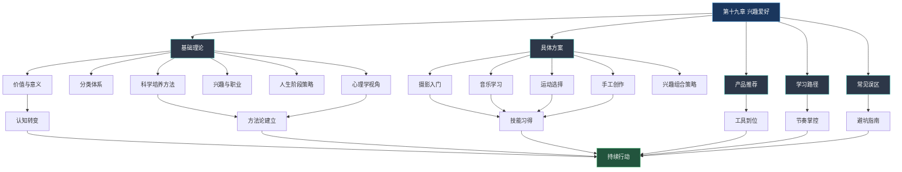

# 第十九章 兴趣爱好：本章小结

## 全章回顾：从认知到行动的完整链路

本章围绕"如何发现、选择并持续培养兴趣爱好"这一核心命题，构建了从理论认知到落地实操的完整知识体系。我们从四个层面——道（为什么需要爱好）、法（如何选择和培养）、术（具体领域怎么练）、器（用什么工具和资源）——层层递进，为你提供了一套可执行的系统方案。

下面这张图展示了本章的知识架构和各板块之间的逻辑关系：



## 一、道：认知层——为什么你需要一个爱好

本章开篇用一个"空心人"的故事切入：张伟，32岁，年薪40万，生活体面，却在夜深人静时感到难以名状的空虚。这个故事之所以引起共鸣，是因为它折射了一个普遍困境——当生活只剩下工作和刷手机，人会逐渐丧失对生活的热情和意义感。

### 兴趣爱好的四维价值模型

我们在基础理论部分用大量科学研究论证了兴趣爱好的核心价值，这些价值可以归纳为四个维度：

| 维度 | 核心机制 | 关键数据 |
|------|---------|---------|
| **心理健康** | 心流体验→多巴胺/血清素/内啡肽释放→皮质醇降低 | 深度爱好者抑郁风险低32%（哈佛75年追踪研究） |
| **社交连接** | 弱关系积累→跨阶层社交→信息与机会获取 | 兴趣社群中的弱关系往往带来最意想不到的职业机会 |
| **个人成长** | 跨界思维→元学习能力→自我效能感提升 | 乔布斯旁听书法课→苹果电脑字体设计 |
| **生活质量** | 意义感建构→身份多元化→压力缓冲 | 拥有爱好的老年人全因死亡风险低约30%（BMJ研究） |

这四个维度不是孤立的，而是形成正向循环。技能提升带来自信心增长，自信心推动更多尝试，更多尝试拓展社交圈，社交圈带来更多学习资源和心理支持——这就是本章反复强调的**"复利效应"**。关键节点是坚持6个月以上，当技能、社交、心理三者形成正向飞轮后，爱好的回报会呈指数级增长。

### 兴趣发展的科学规律

理解以下三个核心理论框架，能帮助你在兴趣培养过程中保持正确预期：

**自我决定理论（SDT）**告诉我们，持久兴趣的产生需要三种心理需求同时被满足——自主感（我自愿做）、胜任感（我能做好）、归属感（我和他人有连接）。这就是为什么"别人推荐的爱好"往往坚持不下来，而"自己发现的爱好"更容易持久——前者缺乏自主感，后者三种需求都更容易被满足。

**兴趣发展四阶段模型**揭示了从"看到觉得有意思"到"成为身份一部分"的完整演变路径：触发性情境兴趣（外部刺激）→维持性情境兴趣（外部支持）→萌发的个人兴趣（主动追求）→成熟的个人兴趣（内在驱动）。大多数人卡在第二阶段——社群支持撤掉后就放弃了。突破的关键是从外部驱动转向内部驱动，具体方法是记录自己的成长、感受进步带来的成就感、让爱好与自我身份绑定。

**学习曲线与高原期**是技能培养的客观规律。初始阶段的"新手红利"让人兴奋，但3-6个月后必然进入高原期——看似停滞，实则大脑正在进行"突触修剪"，淘汰无效神经连接，强化有效连接，为下一次飞跃积蓄力量。理解这一点，就不会在高原期误判为"没天赋"而放弃。

## 二、法：策略层——如何选择和培养爱好

### 选择爱好的四条原则

| 原则 | 含义 | 实操建议 |
|------|------|---------|
| **跟随内心** | 选择真正让你快乐的活动 | 回忆过去让你忘记时间的事情，那就是线索 |
| **考虑现实** | 结合时间、精力、场地、经济条件 | 每周能投入<3小时就别选需要大量练习的乐器 |
| **广泛尝试** | 探索期多尝试，找到真正适合自己的 | 前4周每周试1-2个，用"心流体验"作为筛选标准 |
| **深度发展** | 找到喜欢的爱好后专注深入 | 选定后给至少3个月的专注期，不要频繁切换 |

### 爱好的分类体系帮助你快速定位

本章建立了多维度的爱好分类框架，帮你从不同角度找到适合自己的方向：

- **按活动性质**：创造型（摄影、音乐、手工）、体验型（旅行、美食）、运动型（跑步、游泳）、智力型（棋类、编程）、社交型（团队运动、桌游）
- **按投入程度**：轻度（每天15-30分钟，如阅读）、中度（每天30-60分钟，如乐器）、重度（每天1小时以上，如专业摄影）
- **按发展路径**：速成型（2-4周可入门，如手机摄影）、渐进型（3-6个月见成效，如乐器）、终身型（持续精进，如书法、围棋）

### 技能培养的五要素

刻意练习理论提供了技能提升的科学框架。结合本章的实操经验，提炼出五个核心要素：

1. **明确目标**：每次练习有具体可衡量的目标。不是"练吉他"，而是"用正确指法流畅弹奏《小星星》前8小节"。
2. **专注投入**：30分钟高质量专注练习 > 2小时心不在焉的练习。关掉手机通知，设置番茄钟。
3. **即时反馈**：录音录像回看、教练指导、社群互评。没有反馈的练习如同蒙眼开车。
4. **适度挑战**：在"最近发展区"练习——略高于当前能力，太简单无聊，太难挫败。
5. **系统结构**：有计划地针对薄弱环节训练，而非随机练习。

### 兴趣组合策略

不建议只培养一个爱好，但也不建议贪多。最佳策略是构建2-3个爱好的互补组合：

- **室内+室外**：天气好时外出摄影，天气不好时在家画画
- **动+静**：跑步锻炼身体，阅读滋养精神
- **社交+独处**：羽毛球满足社交需求，写作满足独处需求
- **快+慢**：HIIT训练释放能量，瑜伽恢复平静

时间分配建议：工作日1项轻度爱好（30-60分钟），周末1-2项中度爱好（2-4小时）。

## 三、术：实操层——四大领域的具体路径

本章为四个热门领域提供了从零基础到入门水平的完整路径，每个领域都包含三个阶段：

### 各领域入门路径总览

| 领域 | 入门阶段 | 进阶阶段 | 创作阶段 | 达到"有趣"的时间 |
|------|---------|---------|---------|----------------|
| **摄影** | 手机摄影4周（构图→光线→色彩→主题） | 相机摄影8周（曝光三要素→场景→后期） | 风格探索12周+ | 2-4周 |
| **音乐** | 吉他/钢琴4周（基本和弦→简单曲目） | 技能构建8周（更多和弦→弹唱/演奏） | 曲目积累12周+ | 4-8周 |
| **运动** | 跑步4周（快走→交替→连续跑15分钟） | 提升耐力8周（连续30分钟→5公里） | 提升速度12周+ | 1-4周 |
| **手工** | 木工/编织4周（工具→基础技法→首件作品） | 基础技法8周（榫卯/花样→多件作品） | 创作阶段12周+ | 2-6周 |

每个领域的详细学习计划（精确到每周该做什么）见"学习路径"板块，装备和资源推荐见"产品推荐"板块。

### 通用的学习节奏

不论选择哪个领域，都遵循相同的时间框架：

- **探索期（第1-4周）**：每天15-30分钟了解+周末实际体验，目标是找到"让我忘记时间"的活动
- **入门期（第5-12周）**：每天30-60分钟专注练习，目标是建立基础技能
- **提升期（第13-24周）**：每天45-60分钟刻意练习，目标是突破入门水平
- **风格期（第25-52周）**：每天60分钟练习+创作，目标是找到个人风格
- **深度期（第53周以后）**：持续精进，教学相长，形成个人品牌

## 四、器：工具层——装备、资源与社区

### 装备选择的三个原则

1. **先用基础装备入门**：初学者的瓶颈是技能而非装备。手机可以摄影，几百元的合板吉他可以学琴，一双跑鞋可以跑步。
2. **确定坚持后再升级**：至少坚持3个月，确认这是你真正想深入的爱好后，再投入更好的装备。
3. **将省下的钱用于学习**：一门好的入门课程比一台昂贵的设备更有价值。

### 学习资源的利用策略

- **书籍**：建立系统认知，适合理论学习阶段
- **视频教程**：直观演示，适合技能学习阶段
- **在线课程**：结构化学习路径，适合需要引导的初学者
- **社群/论坛**：获得反馈和动力，贯穿整个学习过程
- **App工具**：辅助练习和记录，如节拍器、调音器、修图软件

### 社群的价值

加入兴趣社群不仅仅是为了社交，更是为了获得三样东西：**反馈**（别人看到你的盲点）、**动力**（看到别人进步激励自己）、**资源**（工具推荐、学习资料、活动信息）。线上社群（豆瓣小组、B站、小红书）适合碎片化交流，线下社群（俱乐部、工作坊）适合深度互动和实际指导。

## 五、避坑指南：10个误区的底层逻辑

本章详细剖析了培养兴趣爱好时最常见的10个误区。表面上看这些误区各不相同，但追根溯源，它们的底层心理机制可以归为三类：

### 完美主义陷阱（误区1、2、6）

**表现**：追求完美起步（准备太久不敢开始）、装备至上（用购买代替练习）、害怕失败（只在舒适区内活动）。

**根源**：固定型思维——认为能力是天生的，做不好说明"我不行"。

**破解**：切换为成长型思维——能力是可以通过练习提升的，做不好说明"我还需要练习"。接受"初学者"身份，允许自己做得不好。记住：完成比完美重要，行动比准备有效。

### 即时满足陷阱（误区3、4、5）

**表现**：贪多求全（同时开始太多爱好）、急于求成（期望速成）、随意练习（缺乏系统性）。

**根源**：习惯了短视频、社交媒体带来的即时反馈，对需要长期积累的技能缺乏耐心。

**破解**：理解学习曲线的客观规律——高原期不是失败信号，而是突破前的积蓄。设定现实期望：入门水平需要3-6个月，中级水平需要1-2年。用"过程目标"替代"结果目标"——不是"3个月学会弹唱"，而是"每天练习30分钟"。

### 孤军奋战陷阱（误区7、8、9、10）

**表现**：过度练习（忽视休息恢复）、闭门造车（拒绝交流）、盲目比较（丧失乐趣）、轻易放弃（缺乏坚持）。

**根源**：将兴趣培养视为纯粹的个人事务，忽视了社交支持和科学节奏的重要性。

**破解**：找到同伴——加入社群、寻找练习搭档、参加线下活动。科学安排——设定练习时间上限、定期休息、记录成长。调整参照系——只和过去的自己比，不和别人比。

### 误区纠正速查表

| 误区 | 一句话纠正 | 关键行动 |
|------|----------|---------|
| 追求完美 | 最好的开始是现在，最差的开始是"等我准备好" | 今天就做15分钟 |
| 装备至上 | 最好的装备是你经常使用的装备 | 先用基础装备3个月 |
| 贪多求全 | 深入1个 > 浅尝10个 | 选1-2个，给3个月专注期 |
| 急于求成 | 慢就是快，稳扎稳打 | 记录每周小进步 |
| 随意练习 | 自由与结构不矛盾 | 制定每周简单计划 |
| 害怕失败 | 失败是反馈，不是否定 | 每周尝试1件有点紧张的事 |
| 过度练习 | 休息是学习的一部分 | 设定每日练习上限 |
| 闭门造车 | 社交学习效率更高 | 加入1个社群 |
| 盲目比较 | 唯一的参照是过去的自己 | 每月对比自己的作品 |
| 轻易放弃 | 坚持比天赋重要 | 至少坚持3个月再决定 |

## 六、行动框架：从今天开始的三步计划

### 第一步：今天（5分钟）

不需要任何准备，只需要回答三个问题：

1. **过去什么事情让你忘记过时间？** ——这是兴趣的线索
2. **你每周能稳定投入多少时间？** ——这决定了选择范围
3. **你更喜欢独处还是社交？** ——这影响爱好的类型

根据这三个问题的答案，从以下矩阵中选择1-2个方向：

| | 喜欢独处 | 喜欢社交 |
|---|---------|---------|
| **时间少（<3h/周）** | 阅读、写作、手机摄影 | 桌游、读书会 |
| **时间中等（3-7h/周）** | 乐器、绘画、编程 | 羽毛球、跑步团 |
| **时间充裕（>7h/周）** | 木工、书法、专业摄影 | 乐队、篮球队、登山 |

### 第二步：本周（2小时）

1. 花30分钟在B站/YouTube搜索该爱好的入门视频，建立基本认知
2. 花1小时进行第一次实际体验（去拍照、去弹琴、去跑步、去做手工）
3. 花30分钟记录体验感受，评估"心流指数"——做这件事时你是否感到时间飞逝？

### 第三步：本月（建立习惯）

1. 确定1-2个想深入发展的爱好
2. 制定简单的每周计划（比如"每周二四六晚上8点练琴30分钟"）
3. 加入1个相关社群（线上或线下）
4. 购买最基础的入门装备（如果需要的话）
5. 月底回顾：对比月初的自己，看看有什么变化

## 七、长期视角：爱好的复利曲线

最后，用一张图展示兴趣爱好的"复利曲线"——这可能是本章最重要的一张图：

```mermaid
graph LR
    subgraph 前3个月：探索期
        A[兴奋感高] --> B[新鲜感消退]
        B --> C[开始觉得枯燥]
    end
    subgraph 第3-6个月：高原期
        C --> D[进步缓慢]
        D --> E[最容易放弃的阶段]
    end
    subgraph 第6-12个月：突破期
        E --> F[技能飞跃]
        F --> G[社交圈建立]
        G --> H[自信心增强]
    end
    subgraph 1年以后：复利期
        H --> I[技能·社交·心理形成飞轮]
        I --> J[指数级回报]
    end
    style E fill:#c53030,stroke:#fc8181,color:#fff
    style J fill:#22543d,stroke:#68d391,color:#fff
```

大多数人倒在第3-6个月的高原期。如果你能坚持到第6个月，你就已经超越了82%的尝试者。而一旦进入复利期，爱好会从"需要坚持"变成"自然发生"——你不再需要意志力来推动自己，因为热爱本身已经成为了动力。

## 结语

兴趣爱好的本质不是"学一项技能"，而是"为生活注入意义"。在这个AI快速发展的时代，技能可以被替代，但热爱不能。你通过兴趣爱好建立的审美能力、创造力、社交连接、心理韧性，是任何技术都无法取代的人类核心能力。

正如心理学家契克森米哈赖在研究"最优体验"时发现的悖论：**最快乐的人不是追求快乐的人，而是全身心投入某项活动的人。** 快乐是投入的副产品，不是目标本身。

不要等到"有时间"再开始——"有时间"永远不会到来。不要等到"准备好"再开始——最好的准备就是开始。选一件让你好奇的事，今天就花15分钟去了解它。剩下的，交给时间和复利。
