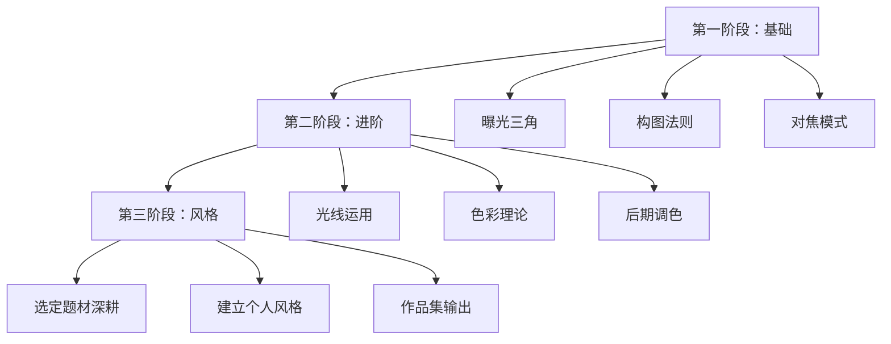

## 一、摄影入门装备推荐

摄影入门的第一道门槛往往不是技术，而是选择装备。市面上相机、镜头、配件品牌型号繁多，新手很容易在参数海洋中迷失方向，要么被忽悠买了用不上的高端器材，要么买了不适合自己拍摄题材的设备。本节从底层原理讲起，帮你建立「什么才是好装备」的判断框架，然后按预算和拍摄需求给出具体推荐，最后覆盖配件、后期工具和学习资源，让你从零开始搭建完整的摄影工作流。

### 1.1 摄影器材基础认知：在选装备之前先搞懂这些

#### 1.1.1 传感器与画幅：照片质量的物理基础

相机的核心是传感器（Sensor），它决定了画质的上限。传感器越大，单个像素的受光面积越大，动态范围和高感表现越好。理解画幅是选择相机的前提。

常见画幅从大到小：

| 画幅类型 | 传感器尺寸（约） | 典型机型 | 特点 |
|---------|----------------|---------|------|
| 中画幅 | 44×33mm | 富士GFX系列、哈苏X2D | 画质天花板，价格高，体积大 |
| 全画幅（35mm） | 36×24mm | 索尼A7系列、佳能R系列、尼康Z系列 | 专业标准，虚化强，高感好 |
| APS-C | 23.5×15.6mm | 富士X系列、索尼A6x00系列、尼康Z50/Zfc | 体积与画质平衡，性价比高 |
| M4/3（微四三） | 17.3×13mm | 奥林巴斯OM-D、松下G系列 | 最小巧的可换镜头系统 |
| 1英寸 | 13.2×8.8mm | 索尼RX100系列、佳能G7X | 便携机天花板 |
| 手机传感器 | 约7×5mm~9.7×7.3mm | iPhone、小米Ultra、华为Pura | 算法弥补硬件局限 |

**焦距换算系数（等效焦距）**：APS-C的裁切系数约1.5×（索尼/尼康）或1.6×（佳能），意味着APS-C上的35mm镜头等效全画幅约52.5mm。选镜头时要注意等效焦距，而非物理焦距。

#### 1.1.2 光圈、快门、ISO：曝光三角

这是摄影的物理基础，理解它才能明白镜头参数的含义：

- **光圈（f值）**：f值越小，光圈越大，进光量越多，景深越浅（背景越虚）。f/1.8的50mm镜头比f/4的套头虚化能力强得多。
- **快门速度**：控制运动模糊。拍人像通常1/125s以上，拍运动1/500s以上，拍星空需要15-30s长曝光。
- **ISO感光度**：越高越亮但噪点越多。现代全画幅ISO 6400可用，APS-C约ISO 3200，手机超过ISO 800就明显涂抹。

#### 1.1.3 相机类型：单反 vs 微单 vs 便携机 vs 手机

| 维度 | 单反（DSLR） | 微单（无反） | 便携机 | 手机 |
|------|------------|------------|-------|------|
| 取景方式 | 光学取景器 | 电子取景器/屏幕 | 屏幕 | 屏幕 |
| 体积重量 | 大而重 | 中等 | 小巧 | 随身 |
| 可换镜头 | 是 | 是 | 否 | 否（外挂镜头有限） |
| 视频能力 | 一般 | 强 | 中等 | 强（计算摄影） |
| 2024-2025市场趋势 | 各家已停产新品 | 主流方向 | 细分市场 | 日常主力 |
| 适合人群 | 二手捡漏 | 认真学摄影 | 旅行轻量化 | 记录生活 |

**核心建议**：2024年以后，微单是唯一值得投入的新系统。单反已停产新品（佳能、尼康均已停止开发单反镜头），二手单反虽然便宜但未来配件和维修会越来越难。如果预算在3000元以下，手机+配件的方案反而比买低端相机更实用。

### 1.2 手机摄影装备方案（预算：200-3000元）

手机是大多数人最常用的相机。2024-2025年的旗舰手机在光线充足时画质已接近入门微单，加上计算摄影（多帧合成、AI降噪、HDR）的加持，在社交媒体分享场景中完全够用。

#### 1.2.1 手机选择指南

选手机拍照片，核心关注三个指标：主摄传感器大小、长焦能力、RAW格式支持。

**2024-2025年影像旗舰推荐**：

| 手机 | 主摄特点 | 优势场景 | 参考价格 |
|------|---------|---------|---------|
| iPhone 16 Pro / Pro Max | 4800万像素，Apple ProRAW | 色彩准确，视频强，生态好 | 7999-13999元 |
| 华为Pura 70 Ultra | 1英寸传感器，伸缩镜头 | 长焦夜景，可变光圈 | 7999-9999元 |
| 小米15 Ultra | 1英寸主摄，徕卡调色 | 全焦段覆盖，性价比 | 5999-6999元 |
| 三星S25 Ultra | 2亿像素主摄，5倍长焦 | 变焦范围大，AI功能强 | 9999-12999元 |
| vivo X200 Pro | 蔡司T*镀膜，APO长焦 | 人像虚化，长焦夜景 | 4999-5999元 |
| OPPO Find X8 Ultra | 哈苏调色，双潜望长焦 | 色彩风格化，全场景 | 5999-6999元 |

**中端手机影像方案**（预算2000-4000元）：
- 小米14 / Redmi K80 Pro：主摄素质优秀，性价比极高
- realme GT7 Pro：潜望长焦下放到中端价位
- iPhone 15 / 16标准版：主摄够用，生态优势明显

**关键指标解读**：
- **传感器尺寸**：1英寸 > 1/1.3英寸 > 1/1.56英寸，越大越好
- **光圈大小**：f/1.4 > f/1.8 > f/2.0，越大进光越多
- **长焦倍率**：3倍光学起步算「有长焦」，5倍及以上更好
- **RAW格式**：ProRAW/RAW+格式让后期空间翻倍，必须支持

#### 1.2.2 手机摄影配件

**手机三脚架**：
- 入门首选：思锐（Sirui）手机三脚架T-005X，铝合金材质，承重2kg，折叠后25cm，适合旅行。参考价150元。
- 进阶选择：Peak Design Mobile Tripod，磁吸设计，极简便携。参考价350元。
- 自拍场景：八爪鱼三脚架（如Joby GorillaPod），可缠绕栏杆树枝，灵活性强。参考价100-200元。

**手机外接镜头**：
- 推荐品牌：思锐（Sirui）、Ulanzi、Moment
- 常用焦段：广角（0.6×）拍建筑风景、微距（10×-20×）拍花卉昆虫、鱼眼拍创意构图
- 价格区间：单镜头100-300元，套装200-500元
- **注意**：外接镜头画质损耗明显，仅建议在手机原生焦段覆盖不足时使用

**手机稳定器**：
- DJI OM 7 / Osmo Mobile SE：磁吸设计，跟随流畅，DJI Mimo App功能丰富。参考价600-1000元。
- 智云Smooth 5 / Q4：性价比高，补光灯内置。参考价400-800元。
- **使用场景**：拍视频vlog、延时摄影、运动跟拍。纯拍照不需要稳定器。

**手机闪光灯/补光**：
- Ulanzi补光灯（小型LED面板）：色温可调，USB充电，拍人像补光利器。参考价50-150元。
- 手机环形灯：适合自拍和直播，光线均匀。参考价30-80元。

#### 1.2.3 手机修图App推荐

**免费首选**：
- **Snapseed**（Google出品）：局部调整、曲线、修复工具一应俱全，手势操作直观，是手机修图的标杆。完全免费无广告。
- **Lightroom Mobile**（Adobe）：基础功能免费，专业级调色工具，支持预设同步。高级功能需订阅（约35元/月）。

**滤镜风格**：
- **VSCO**：胶片模拟滤镜质量最高，ACG、C系列胶片风格经典。免费滤镜有限，全滤镜包约138元/年。
- **Focos**：模拟大光圈虚化，散景光斑可调，后期改变焦点。免费版够用。
- **ProCam / Halide**：第三方相机App，支持RAW拍摄、手动参数控制。Halide约248元/年。

**专业后期**：
- **泼辣修图（Polarr）**：国产专业修图App，局部调整、LUT支持、人像美化一体。约128元/年。
- **Enlight Photofox**：双重曝光、图层混合、创意合成。适合艺术风格创作。

**手机修图工作流建议**：
1. 拍摄时尽量用RAW格式（ProRAW等），保留最大后期空间
2. 先在Snapseed或Lightroom做基础调整（曝光、白平衡、裁剪）
3. 再用VSCO加风格滤镜（强度建议50-70%，避免过度）
4. 最后用Snapseed的局部工具微调细节（提亮面部、压暗天空）

### 1.3 相机摄影入门装备（预算：3000-20000元）

#### 1.3.1 入门微单推荐（按预算分级）

**3000-5000元档（入门体验）**：

| 机型 | 画幅 | 亮点 | 不足 | 参考价（机身） |
|------|------|------|------|--------------|
| 索尼A6100 | APS-C | 对焦快、眼部追焦好 | 塑料感、续航一般 | 3500-4000元 |
| 尼康Z30 | APS-C | 轻便、翻转屏、视频好 | 无取景器 | 3500-4000元 |
| 佳能R50 | APS-C | 操作简单、直出好看 | 镜头群少、电池小 | 4000-4500元 |
| 富士X-T30 II | APS-C | 复古外观、胶片模拟 | 对焦略慢、发热 | 4500-5000元 |

**5000-10000元档（认真学摄影）**：

| 机型 | 画幅 | 亮点 | 不足 | 参考价（机身） |
|------|------|------|------|--------------|
| 索尼A6700 | APS-C | AI对焦、4K120p、机身防抖 | 价格偏高 | 7000-8000元 |
| 富士X-T5 | APS-C | 4000万像素、复古操控、胶片模拟 | 翻转屏缺失 | 8000-9000元 |
| 尼康Z5 | 全画幅 | 最便宜全画幅新机、双卡槽 | 对焦一般、视频弱 | 6000-7000元 |
| 佳能R7 | APS-C | 高速连拍、机身防抖、操控好 | 镜头群不完善 | 6500-7500元 |
| 佳能R8 | 全画幅 | 轻便全幅、对焦好 | 单卡槽、无机身防抖 | 8000-9000元 |
| 索尼A7C II | 全画幅 | 小巧全幅、AI对焦 | 小取景器、单卡槽 | 10000-11000元 |

**10000-20000元档（一步到位）**：

| 机型 | 画幅 | 亮点 | 不足 | 参考价（机身） |
|------|------|------|------|--------------|
| 索尼A7 IV | 全画幅 | 均衡全能、3300万像素 | 体积偏大 | 12000-13000元 |
| 尼康Z6 III | 全画幅 | 部分堆栈传感器、强大视频 | 新品溢价 | 15000-16000元 |
| 佳能R6 Mark III | 全画幅 | 高速对焦、40fps连拍 | 像素偏低（2400万） | 15000-16000元 |
| 富士X-H2S | APS-C | 40fps连拍、6K视频 | 体积大、APS-C画幅 | 10000-11000元 |

#### 1.3.2 镜头选择指南

镜头比机身更重要——好镜头搭配中端机身的出片效果，往往超过差镜头配旗舰机身。

**镜头参数解读**：

- **焦距**：数字越小视野越广（16mm超广角），越大望得越远（200mm长焦）
- **光圈**：f/1.4、f/1.8为大光圈（虚化好，暗光强）；f/4-f/5.6为小光圈（轻便，景深大）
- **防抖（OIS/VR/IS）**：镜头光学防抖，长焦必备
- **最近对焦距离**：影响近摄能力，非微距镜头通常0.3-0.5m

**变焦 vs 定焦**：

| 维度 | 变焦镜头 | 定焦镜头 |
|------|---------|---------|
| 焦段灵活 | 一镜多用 | 需要走动或换镜头 |
| 光圈 | 通常f/2.8-f/5.6 | 常见f/1.4-f/1.8 |
| 画质 | 现代变焦已很好 | 同价位定焦略胜 |
| 体积重量 | 较大 | 通常更小更轻 |
| 价格 | 恒定f/2.8变焦贵 | 大光圈定焦反而便宜 |
| 适合场景 | 不确定拍什么、旅行 | 人像、街拍、弱光 |

**入门镜头推荐（按拍摄题材）**：

**万能挂机镜头**：
- 套机镜头（18-55mm / 16-50mm）：随相机购买，零额外成本，画质够入门
- 恒定光圈变焦：适马Sigma 18-50mm f/2.8 DC DN（APS-C），约3000元，轻便大光圈
- 全幅标准变焦：索尼FE 28-60mm f/4-5.6，最轻便的全画幅套头

**人像镜头**：
- APS-C：适马56mm f/1.4 DC DN，约2500元，等效84mm人像黄金焦段，虚化出色
- 全画幅：索尼FE 85mm f/1.8，约3500元，经典人像焦段
- 预算友好：各品牌50mm f/1.8（永诺、铭匠等国产也有不错的），800-1500元

**风光/建筑镜头**：
- 超广角变焦：腾龙11-20mm f/2.8（APS-C），约3500元
- 全画幅超广：索尼FE 16-35mm f/4 G，约8000元

**街拍镜头**：
- 等效35mm视角：富士23mm f/2、索尼FE 35mm f/1.8
- 等效50mm视角：富士35mm f/2、索尼FE 50mm f/1.8

**微距镜头**：
- 老蛙Laowa 65mm f/2.8 2× Ultra Macro（APS-C），约2500元，2倍放大倍率
- 索尼FE 90mm f/2.8 Macro G，约5500元，兼顾人像

#### 1.3.3 二手器材购买指南

二手是高性价比入门的重要途径，但有风险，需要掌握鉴别方法。

**适合买二手的器材**：
- 机身：上市2-3年以上的机型，降价明显（如索尼A7III二手约5000-6000元，新机时15000元）
- 镜头：光学结构简单，二手品质稳定（定焦镜头尤其适合二手）
- 三脚架、闪光灯等配件：结构耐用，二手几乎无差异

**不建议买二手的器材**：
- 电池：损耗不可逆，安全隐患
- 存储卡：写入寿命无法判断
- 快门数超5万的机身（专业机身快门寿命约15-50万次，入门机身约5-10万次）

**二手鉴别要点**：
1. **快门次数**：用相机拍一张照片，上传到 `shuttercount.info` 查询。入门机身建议不超过3万次。
2. **传感器检查**：拍纯白照片（小光圈+长曝光），在电脑上放大查看是否有坏点、热噪点。
3. **镜头检查**：对着强光看镜片内部是否有霉丝、灰尘、划痕。轻微灰尘正常，霉丝不能接受。
4. **对焦测试**：拍一排文字或尺子，检查是否跑焦。连续拍10张看一致性。
5. **外观磨损**：手柄橡胶是否起皮、底部螺丝是否有拧动痕迹（可能拆修过）。

**推荐购买渠道**：
- 闲鱼：最大二手平台，但需谨慎验机，建议同城面交
- 蜂鸟二手：摄影器材专业二手平台，有一定保障
- 转转验机：平台验机有质保，但价格略高
- 相机之家/色影无忌二手区：摄影社区卖家，相对靠谱
- 日本二手店（Map Camera、Kitamura Camera）：品相分级严格，海淘需注意电压和保修

### 1.4 特殊拍摄设备

#### 1.4.1 运动相机

适合极限运动、Vlog、骑行等场景，特点防抖强、防水、小巧。

| 型号 | 分辨率 | 防抖 | 防水 | 参考价 |
|------|--------|------|------|-------|
| GoPro HERO13 Black | 5.3K60 | HyperSmooth 6.0 | 10米裸机 | 3298元 |
| 大疆Action 5 Pro | 4K120 | RockSteady 3.0+ | 20米裸机 | 2799元 |
| Insta360 Ace Pro 2 | 4K120 | FlowState | 12米裸机 | 2698元 |
| Insta360 X4 | 8K30全景 | FlowState | 10米裸机 | 3998元 |

**运动相机选购建议**：
- 单视角运动拍摄：GoPro或大疆Action，选品牌偏好即可
- 全景创意拍摄：Insta360 X4，后期可以自由选择视角
- 骑行/摩托车：GoPro + 头盔支架，或Insta360 X系列 + 自拍杆（自拍杆自动消除）

#### 1.4.2 无人机航拍

航拍提供完全不同的视角，是风光摄影和视频创作的利器。

| 型号 | 传感器 | 续航 | 避障 | 适合人群 | 参考价 |
|------|--------|------|------|---------|-------|
| DJI Mini 4 Pro | 1/1.3英寸 | 34分钟 | 全向 | 入门首选（<249g免注册） | 4788元 |
| DJI Air 3 | 1/1.3英寸双摄 | 46分钟 | 全向 | 旅行航拍 | 6988元 |
| DJI Mavic 3 Pro | 4/3英寸哈苏 | 43分钟 | 全向 | 专业创作 | 13888元 |
| DJI Avata 2 | 1/1.3英寸 | 23分钟 | 前后下 | FPV沉浸飞行 | 5988元 |

**无人机法规须知**：
- 250g以上需在民航局实名登记（UOM App）
- 禁飞区：机场周边、军事管理区、政府机关上空（DJI Fly App会自动提示）
- 飞行高度限120米，需保持目视范围内
- 建议购买无人机保险（DJI Care随心换，炸机可换新）

#### 1.4.3 胶片相机（复古玩法）

胶片摄影在2020年代重新流行，带来独特的拍摄体验和色彩质感。

**入门胶片机推荐**：
- **傻瓜胶片机**：Olympus mju-II（二手约800-1500元），28mm f/2.8定焦，防水机身，拍完即出
- **手动单反**：尼康FM2（二手约1500-2500元），纯机械快门，无需电池，学习摄影原理的最佳工具
- **自动单反**：佳能EOS 5（二手约300-500元），兼容佳能EF镜头，自动对焦
- **中画幅入门**：Pentax 67（二手约3000-5000元），6×7画幅，震撼的虚化和细节

**胶片成本估算**：
- 一卷36张彩色负片（柯达Gold 200）：约40-60元
- 冲洗+扫描一卷：约25-50元（街拍店/淘宝）
- 折算每张成本：约2-3元，比数码贵但让人更珍惜每次快门

**胶片选择入门**：
- 彩色负片：柯达Gold 200（暖色调）、富士C200（偏冷清新）
- 黑白片：伊尔福HP5+ 400（宽容度高，适合入门练习）
- 彩色反转片（幻灯片）：柯达Ektachrome E100，色彩惊艳但曝光要求精确

### 1.5 摄影配件详解

#### 1.5.1 存储卡

存储卡是数据安全的底线，廉价劣质卡可能导致数据丢失，是最不值得省钱的配件。

**存储卡类型**：
- **SD卡**：最通用，大部分相机使用
- **CFexpress Type A**：索尼高端机型使用，速度最快
- **CFexpress Type B**：佳能/尼康高端机型使用
- **microSD**：运动相机、无人机使用，需转接SD卡套

**速度等级解读**：

| 标识 | 最低写入速度 | 适用场景 |
|------|------------|---------|
| Class 10 / U1 | 10MB/s | 普通拍照 |
| U3 / V30 | 30MB/s | 4K30视频、连拍 |
| V60 | 60MB/s | 4K60视频、高速连拍 |
| V90 | 90MB/s | 8K视频、专业高速连拍 |

**推荐品牌**：
- 闪迪（SanDisk）Extreme Pro系列：性能稳定，兼容性好，首选
- 索尼TOUGH系列：坚固耐用，防弯折防尘防水
- 雷克沙（Lexar）Professional系列：性价比高

**容量建议**：日常拍照128GB足够，视频拍摄建议256GB起步，重要拍摄建议备两张卡。

#### 1.5.2 三脚架

三脚架是长曝光、风光、自拍、延时摄影的必备工具。

**选购要素**：
- **材质**：铝合金（重但便宜）vs 碳纤维（轻但贵），同性能碳纤维贵2-3倍
- **承重**：至少是你最重镜头+机身的1.5倍
- **收纳长度**：旅行建议40cm以内，能装进摄影包侧袋
- **最大高度**：不弯腰取景的高度（减去云台高度约10-15cm）
- **云台类型**：球形云台（通用灵活）vs 三维云台（精确调平）vs 液压云台（视频平滑）

**推荐**：
- 入门旅行：思锐T-025X碳纤维（约800元，0.9kg，收纳38cm）
- 中端全能：百诺（Benro）IF28C（约1500元，碳纤维，反折设计）
- 高端轻量：马小路（Marsace）MT-2542（约2500元，专业碳纤维）
- 视频专用：任意带液压阻尼云台的三脚架（如思锐A-1205+VH-10云台套装约2000元）

#### 1.5.3 滤镜

滤镜是镜头前方安装的光学玻璃/树脂片，用于控制光线特性。

**常用滤镜类型**：

| 滤镜 | 作用 | 适用场景 | 价格区间 |
|------|------|---------|---------|
| UV/保护镜 | 保护镜头前镜片 | 日常使用 | 50-300元 |
| CPL偏振镜 | 消除反光、增强色彩饱和度 | 风光（天空更蓝、水面消除反光） | 100-500元 |
| ND减光镜 | 降低进光量 | 长曝光（丝绸般水流、云彩拖尾） | 100-800元 |
| GND渐变灰 | 上暗下亮，平衡曝光 | 日出日落（天空与地面光比大） | 150-600元 |

**滤镜尺寸**：按镜头口径购买（镜头前端标识如Ø67mm表示需要67mm口径滤镜）。建议买最大口径的方片滤镜系统（如NiSi入门套装），通过转接环适配不同镜头。

**新手滤镜优先级**：CPL > ND64/ND1000 > 保护镜（UV镜画质影响微乎其微，更多是心理安慰，好的保护镜如B+W、耐司确实能防尘防指纹）

#### 1.5.4 闪光灯

闪光灯不只是暗光补光工具，更是控制光线的利器。

**内置闪光灯 vs 外接闪光灯**：
- 机顶内置闪光灯：功率小（GN约12），方向固定，拍出来扁平，仅应急
- 外接闪光灯：功率大（GN约30-60），可旋转角度做跳闪，光线自然得多

**入门外接闪光灯推荐**：
- 神牛（Godox）V1：圆形灯头，光线柔和，锂电池续航强。约1200元。
- 神牛TT685 II：各品牌卡口版本，性价比之王。约700元。
- 神牛V860 III：中端旗舰，回电快，续航好。约1000元。

**闪光灯使用技巧**：
- **跳闪**：将灯头朝天花板或侧墙打光，利用反射面获得柔和的漫射光，避免直射的「闪光灯脸」
- **离机闪**：用引闪器（如神牛X2T，约300元）将闪光灯放在侧面/背后，打出立体光影
- **柔光罩**：灯头加柔光罩或柔光伞，让光线更均匀自然

#### 1.5.5 相机包

**类型选择**：
- **双肩背包**：容量大，适合长途旅行和多镜头携带（推荐乐摄宝ProTactic系列、国家地理地球探索者系列）
- **斜挎包/单肩包**：快速取机，适合街拍和日常（推荐Peak Design Everyday Sling、白金汉Billingham Hadley）
- **内胆包**：放进普通书包里，灵活性最强（推荐Tenba BYOB系列）
- **拉杆箱**：大量器材长途飞行（推荐乐摄宝Rolling系列）

**选购建议**：先确定需要携带的最大器材量（机身+几支镜头+配件），再选包。背负系统（肩带宽度、背板透气性）比外观更重要。

### 1.6 摄影学习资源

#### 1.6.1 系统学习路径

摄影学习的合理顺序：

#### 1.6.2 书籍推荐

**入门必读**：
- 《纽约摄影学院教材》（上下册）：最经典的摄影入门教材，从器材到构图到暗房全面覆盖。语言稍显老旧但知识体系扎实。
- 《一本摄影书》（赵嘉）：国内作者，语言通俗易懂，配图丰富，适合纯小白。
- 《摄影笔记》（宁思潇潇）：网络风格，轻松好读，适合不喜欢看大部头的读者。

**进阶提升**：
- 《摄影的艺术》（Bruce Barnbaum）：深入讲解摄影美学和创意，不是教你参数而是教你「看」。
- 《光线与曝光》（Bryan Peterson）：理解光线是摄影的核心，这本书帮你建立光线思维。
- 《Understanding Exposure》（Bryan Peterson英文原版）：曝光三要素讲得最好的一本书。
- 《The Photographer's Eye》（Michael Freeman）：构图思维的圣经级读物。

**后期方向**：
- 《Photoshop+Lightroom风光摄影后期》（Thomas看看世界）：国内后期教学标杆
- 《Scott Kelby数码摄影手册》系列：步骤式教学，照着做就行
- 《Adobe Photoshop Lightroom Classic CC 经典教程》：Adobe官方教材

#### 1.6.3 在线学习平台

**免费资源**：
- **B站**：搜索"摄影入门"、"构图"、"光线"，推荐UP主：影视飓风（器材评测+创意）、老暂（深度技术讲解）、Thomas看看世界（后期教程）
- **YouTube**：Peter McKinnon（创意vlog风格）、Tony Northrup（器材深度评测）、Mango Street（人像教程）
- **图虫/500px**：看优秀作品学构图和色彩，模仿是最好的学习方式

**付费课程**：
- **网易云课堂/腾讯课堂**：系统化摄影课程，价格约100-500元，选评价高的
- **Skillshare**：英文课程质量高，有免费试用期
- **MasterClass**：Annie Leibovitz教授摄影大师课，偏艺术和理念

#### 1.6.4 摄影社区

- **图虫**：国内最大摄影社区，定期举办比赛，适合展示和交流
- **500px**：国际社区，作品整体质量高，适合对标学习
- **Instagram**：全球最大图片社交平台，关注优秀摄影师获取灵感
- **Flickr**：老牌摄影社区，EXIF信息完整，适合研究别人拍摄参数
- **小红书**：搜索摄影相关笔记，有很多实拍分享和器材评测

### 1.7 摄影器材维护与保养

器材是长期投资，正确维护能延长寿命、保持画质。

#### 1.7.1 日常维护

**镜头清洁**：
1. 先用气吹吹掉表面灰尘（不要直接用布擦，灰尘颗粒会划伤镀膜）
2. 用镜头笔的碳粉头轻轻擦拭指纹和油污
3. 顽固污渍用镜头布蘸少量镜头清洁液，从中心向外螺旋擦拭
4. **绝对不要**：用衣服、纸巾、酒精擦拭镜头

**机身维护**：
- 用完后用微湿布擦拭机身表面汗渍（汗液腐蚀性很强）
- 接口和电池仓保持干燥
- 存储卡插拔时确认相机已关机

#### 1.7.2 传感器清洁

传感器落灰是可换镜头相机的常见问题，表现为照片上的固定黑点（小光圈下最明显）。

**自行清洁方法**：
1. 先检查：拍一张纯白照片（小光圈如f/16，白色墙壁或天空），电脑上放大检查
2. 轻度灰尘：机身自带的传感器清洁功能（菜单中找到「清洁传感器」）
3. 中度灰尘：用专用传感器清洁棒（如VSGO APS-C/全画幅清洁套装，约50元），配合清洁液轻轻擦拭
4. 重度污染：送品牌售后清洁（通常免费或100元以内）

**注意**：传感器是精密部件，手抖或用力过猛可能损坏。如果不确定，送售后是最安全的选择。

#### 1.7.3 存放环境

- **防潮**：潮湿环境（南方梅雨季）是镜头长霉的最大风险。入门方案：防潮箱+吸湿卡（约200元），进阶方案：电子防潮柜（约500-1500元）
- **温度**：避免极端温度。冬天从室外进入温暖室内时，让相机在摄影包中慢慢回温，避免结露
- **长期不用**：取出电池，存放在干燥环境，每隔3个月拿出来开机拍几张保持电路活性

### 1.8 摄影装备购买决策框架

在实际购买前，用这个框架做决策可以避免冲动消费：

**第一步：明确拍摄题材**
- 拍人像为主 → 优先投资大光圈定焦镜头（50mm/85mm f/1.8）
- 拍风光为主 → 优先投资超广角镜头和三脚架
- 拍视频为主 → 优先投资带机身防抖的相机和稳定器
- 随手记录 → 手机 + 配件是最合理方案

**第二步：确定预算上限**
- 预算 < 3000元：手机方案（手机+三脚架+外接镜头+修图App）
- 预算 3000-8000元：入门微单套机（含套头）+ 存储卡 + 相机包
- 预算 8000-15000元：中端机身 + 一支好定焦镜头 + 基础配件
- 预算 15000-30000元：全画幅机身 + 变焦+定焦镜头组合 + 全套配件
- 预算 > 30000元：高端机身 + 多镜头系统 + 专业配件

**第三步：优先级排序**
永远按「镜头 > 机身 > 配件」的顺序分配预算。一支好镜头能用十年，机身三年一换。宁可买中端机身+好镜头，也不要买旗舰机身+套头。

**第四步：先租后买**
不确定某款器材是否适合自己？先在闲鱼/蜂鸟租借平台租用1-3天试拍。租金通常为设备价格的1-2%/天，比买错后悔要划算得多。

### 1.9 常见误区与纠正

| 误区 | 事实 | 建议 |
|------|------|------|
| 像素越高画质越好 | 传感器尺寸比像素数重要得多。5000万像素手机不如2400万像素全画幅 | 关注传感器尺寸和单像素大小 |
| 全画幅一定比APS-C好 | 在光线充足时差距很小，APS-C轻便便宜，更适合入门 | 根据预算和题材选择，不要盲目追求全画幅 |
| 相机拍的一定比手机好 | 在社交媒体分享尺寸下，手机计算摄影已非常强大 | 需要大光圈虚化、长焦、大幅面输出时相机才有明显优势 |
| 买了好器材就能拍好照片 | 摄影是用光的艺术，技术和审美比器材重要得多 | 先学构图和光线，再考虑升级器材 |
| 越贵的镜头越好 | 需要匹配拍摄场景。拍风光不需要f/1.4，拍人像不需要超广角 | 按题材选镜头，不按价格选 |
| 后期是作弊 | 后期是摄影创作的一部分，RAW文件就是「数字底片」 | 学习基础后期，这是完整工作流的一环 |
| UV镜保护镜头天经地义 | 廉价UV镜会降低画质（增加眩光、降低对比度） | 用好的保护镜（B+W、耐司）或干脆不装 |

### 1.10 不同拍摄题材的装备速查表

| 题材 | 核心装备 | 预算门槛 | 备注 |
|------|---------|---------|------|
| 人像 | 50-85mm大光圈定焦 | 3000元（机身+镜头） | 虚化是人像的核心诉求 |
| 风光 | 超广角+三脚架+CPL滤镜 | 5000元 | 晨昏拍摄，三脚架不可或缺 |
| 街拍 | 28-35mm定焦，轻便机身 | 3000元 | 不引人注目最重要 |
| 微距 | 微距镜头+环形闪光灯 | 4000元 | 三脚架可选但强烈建议 |
| 运动/动物 | 长焦镜头（70-200mm+）| 8000元 | 对焦速度和连拍是关键 |
| 星空 | 超广角大光圈+三脚架 | 6000元 | 需要高感好的机身 |
| 美食 | 微距或50mm定焦+柔光 | 3000元 | 自然光窗边拍最好看 |
| 旅行记录 | 轻便变焦+手机备机 | 4000元 | 轻量化比画质更重要 |

***

> 摄影装备的本质是工具，不是目的。最好的器材是你愿意每天带出门的那一台。在预算范围内选择最轻便、最顺手的方案，然后把更多时间花在拍摄和学习上——这才是从入门到精通的正确路径。
