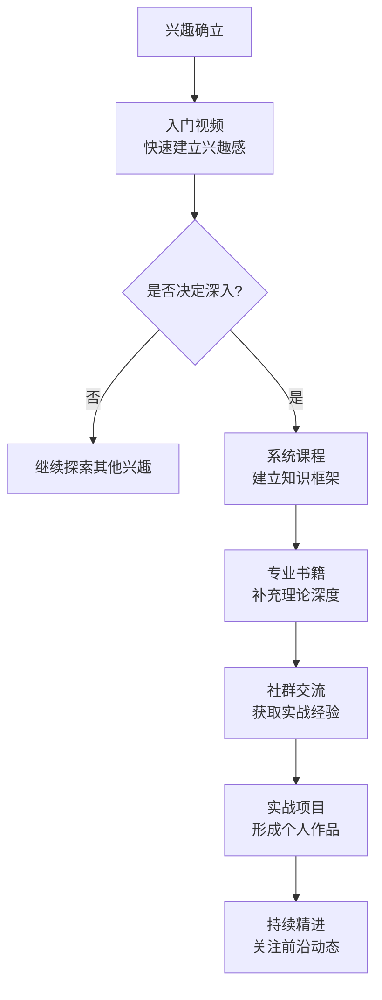

## 五、通用学习资源推荐

无论你选择什么兴趣爱好，都需要一套通用的学习资源获取能力。本章不是简单的平台罗列，而是一套完整的**资源发现→质量鉴别→高效利用**方法论。掌握这套方法后，你在任何新领域都能快速找到高质量的学习路径。

### 5.1 学习资源的分类体系

在深入推荐之前，先建立一个清晰的资源分类框架。不同类型的资源适合不同学习阶段，混用会导致效率低下。

| 资源类型 | 适合阶段 | 优势 | 劣势 | 典型代表 |
|---------|---------|------|------|---------|
| 入门视频 | 起步期 | 直观、零门槛 | 深度有限 | B站免费教程 |
| 系统课程 | 基础期 | 结构化、有体系 | 费用较高 | 网易云课堂、Coursera |
| 专业书籍 | 进阶期 | 深度强、可反复查阅 | 需要阅读能力 | 豆瓣高分书目 |
| 社群交流 | 全阶段 | 实时反馈、信息前沿 | 信息噪音大 | 微信群、Reddit |
| 实战项目 | 巩固期 | 学以致用 | 需要前期基础 | GitHub、开源社区 |
| AI辅助工具 | 全阶段 | 即时答疑、个性化 | 需要验证准确性 | ChatGPT、Kimi |



**关键原则：先广度后深度。** 起步阶段不要一上来就买系统课程，先用免费资源确认兴趣方向，再投入时间和金钱。很多人花了几千元买课程，学了三天就放弃了——这就是没有遵循"先试后买"原则的代价。

### 5.2 视频学习平台深度评测

#### 5.2.1 B站（bilibili.com）

B站是中国最大学习视频平台，但**质量差异极大**，需要掌握筛选技巧。

**高效搜索方法：**

- **关键词组合**：`[爱好名称] 入门 教程 系统` — 加"系统"二字可以过滤掉碎片化内容
- **筛选条件**：按播放量排序，但不要只看最高播放的。播放量高可能是因为标题党，要结合弹幕和评论判断
- **UP主筛选**：找到一个优质UP主后，查看他的合集功能，通常会有系统化的系列教程
- **弹幕利用**：开启弹幕可以看到其他学习者的疑问和补充，这本身就是一种社群学习

**B站优质学习UP主识别标准：**

1. 更新频率稳定（至少周更），说明创作者有持续投入
2. 评论区有实质讨论，而非全是"沙发""好看"
3. 有完整合集，不是东一榔头西一棒子
4. 视频时长适中（教学类15-45分钟为佳，太短讲不透，太长容易走神）

**B站的局限性：**

- 免费内容通常只覆盖入门到中级，高级内容创作者没有动力免费分享
- 缺乏互动反馈，你看完视频不会有人纠正你的错误
- 内容可能过时，尤其是技术类和工具类内容

#### 5.2.2 网易云课堂（study.163.com）

网易云课堂的特点是**系统化付费课程**，价格通常在100-500元区间。

**选课策略：**

- 先看课程大纲是否完整，好的课程大纲本身就是一份学习路线图
- 查看学员评价，重点看差评说了什么（好评可能是刷的，差评通常更真实）
- 试听免费章节，判断讲师的表达风格是否适合你
- 关注课程更新时间，超过2年未更新的课程谨慎购买

**性价比优化：**

- 大促期间（双11、618）通常有5-7折优惠
- 有些课程可以先买基础部分（便宜），觉得好再买进阶部分
- 关注讲师的公众号或社群，经常有限时优惠

#### 5.2.3 腾讯课堂（ke.qq.com）

与网易云课堂定位类似，但有一些差异：

- **优势**：依托腾讯生态，直播互动功能更强；部分课程有QQ群答疑
- **劣势**：课程审核相对宽松，质量下限更低
- **适合场景**：需要实时互动和社群答疑的学习者

#### 5.2.4 国际平台（Coursera、edX、Udemy）

| 平台 | 定位 | 价格 | 语言 | 适合领域 |
|------|------|------|------|---------|
| Coursera | 学术级课程 | 单课300-500元/月，专项课程更贵 | 英文为主（有中文字幕） | 摄影理论、音乐理论、设计原理 |
| edX | 名校公开课 | 审计免费，证书付费 | 英文 | 学术性更强的领域 |
| Udemy | 实战技能课 | 常年打折，实付50-100元/课 | 英文 | 编程、设计、音乐制作 |
| Skillshare | 创意类课程 | 约70元/月（年付更便宜） | 英文 | 插画、摄影、手工、设计 |
| MasterClass | 名师大师课 | 约1200元/年 | 英文 | 烹饪、写作、音乐表演 |

**国际平台的真正价值不在于课程本身，而在于思维方式。** 西方教育体系更强调"为什么"而非"怎么做"，适合想要理解底层原理的学习者。例如学摄影，国内教程教你"光圈调到f/2.8"，国外课程会教你"光圈与景深的物理关系"。

**语言障碍的解决方案：**

- 浏览器安装沉浸式翻译插件（如"沉浸式翻译"），实时双语字幕
- Coursera部分热门课程已有官方中文字幕
- 用AI工具（ChatGPT、Kimi）辅助理解专业术语

#### 5.2.5 YouTube

YouTube是全球最大的视频平台，对于很多兴趣爱好（尤其是手工、音乐、摄影），英文YouTube的内容质量远超国内平台。

**访问与使用技巧：**

- 需要科学上网工具
- 开启自动翻译字幕（设置→字幕→自动翻译→中文）
- 搜索时用英文关键词，结果质量更高
- 订阅频道后开启通知，避免错过更新

**各领域推荐频道类型：**

- **手工/DIY**：搜索"DIY tutorial"，大量木工、皮具、编织内容
- **摄影**：搜索"photography for beginners"，Peter McKinnon、Mango Street等
- **音乐**：搜索"instrument tutorial"，各类乐器教程极其丰富
- **绘画**：搜索"drawing tutorial"，Proko、Draw with Jazza等

### 5.3 书籍资源的系统化利用

#### 5.3.1 选书方法论

选书是一项被严重低估的能力。一本好书胜过十套课程，一本烂书浪费你的时间还可能误导你。

**四步选书法：**

1. **豆瓣评分筛选**：7.5分以上才考虑，8.0分以上重点关注。但要注意评价人数，50人评价的8.5分不如5000人评价的8.0分可靠
2. **目录检查**：在电商平台或出版社网站查看完整目录，目录结构是否清晰、覆盖是否全面，直接反映作者的专业水平
3. **试读前言和第一章**：前言体现写作动机和目标读者，第一章体现写作功力。如果前言全是"本书旨在帮助广大读者"这种套话，质量堪忧
4. **版本选择**：优先选择最新版或经典版。技术类内容看出版日期（3年以上的谨慎），艺术理论类看是否为经典著作

#### 5.3.2 书籍获取渠道

| 渠道 | 适合场景 | 成本 | 优势 |
|------|---------|------|------|
| 微信读书 | 理论类、畅销类 | 月费19元（年费更便宜） | 海量正版电子书，笔记功能好 |
| 豆瓣读书 | 选书参考 | 免费 | 评分和书评是最佳选书依据 |
| 得到App | 精华解读 | 年费365元 | 高效获取书籍核心观点 |
| Z-Library | 学术类、外文类 | 免费 | 外文原版书籍资源丰富 |
| 京东/当当 | 实体书 | 按本计价 | 大促时折扣力度大，适合需要反复翻阅的工具书 |
| 图书馆 | 短期参考 | 免费 | 适合不确定是否值得购买的书籍 |

**电子书 vs 实体书的选择：**

- **理论类、叙事类**：电子书足够，微信读书性价比极高
- **工具书、图册类**：实体书更好，翻阅体验和图片质量远超电子版
- **需要反复查阅的**：实体书放书架上随时取用，电子书搜索更方便

#### 5.3.3 高效阅读方法

有了好书不会读等于没有。以下是经过验证的高效阅读法：

**主题阅读法（适合入门阶段）：**

1. 同时找3-5本同领域书籍
2. 先快速翻阅每本书的目录，建立领域全景图
3. 找到各书共同覆盖的核心章节，优先精读这些
4. 每本书的独特内容作为补充阅读

**SQ3R阅读法（适合深度学习）：**

1. **Survey（浏览）**：快速翻阅全书，看标题、图表、总结
2. **Question（提问）**：把章节标题改成问题
3. **Read（阅读）**：带着问题阅读，寻找答案
4. **Recite（复述）**：合上书用自己的话复述要点
5. **Review（复习）**：隔天再回顾笔记

**读书笔记模板：**

```markdown
## 《书名》读书笔记

### 基本信息
- 作者：
- 出版年份：
- 豆瓣评分：
- 阅读日期：

### 核心观点（3-5个）
1. 
2. 
3. 

### 对我最有用的3个知识点
1. 
2. 
3. 

### 行动清单
- [ ] 
- [ ] 

### 原文金句
> 

### 评分：⭐⭐⭐⭐（满分5星）
```

### 5.4 社群与社区资源

#### 5.4.1 为什么社群学习如此重要

一个人学习最大的问题是**缺乏反馈和坚持动力**。社群解决三个核心问题：

1. **信息筛选**：社群成员会自然形成信息过滤机制，有价值的内容会被反复分享
2. **即时反馈**：发一张作品到群里，几分钟内就能收到评价和建议
3. **坚持动力**：看到别人在进步，你不好意思停下来

#### 5.4.2 线下社群获取方法

| 平台 | 使用方法 | 适合场景 |
|------|---------|---------|
| 大众点评 | 搜索"[兴趣]体验课"或"[兴趣]工作室" | 手工、烘焙、花艺等需要场地的爱好 |
| 活动行 | 搜索相关兴趣关键词，筛选同城活动 | 摄影外拍、读书会、技术沙龙 |
| 豆瓣同城 | 关注所在城市的兴趣小组 | 文艺类、学术类兴趣 |
| 小红书 | 搜索"[城市]+[兴趣]+约" | 各类兴趣约伴 |
| 本地生活群 | 美团、抖音本地生活 | 运动类、体验类 |

**线下社群参与技巧：**

- 第一次去不要带任何装备，先观察和了解
- 主动加3-5个人的微信，后续才能融入圈子
- 不要第一次就展示"我会很多"，谦虚学习更容易被接纳
- 固定参加2-3次后再决定是否长期加入

#### 5.4.3 线上社群获取与运营

**微信/QQ群搜索技巧：**

- 搜索关键词不要只用爱好名称，加上"交流""学习""新手"等限定词
- 先搜索公众号，很多优质社群入口在公众号菜单栏里
- 知识星球（原小密圈）是付费社群的主要平台，质量通常高于免费群

**Reddit（需科学上网）：**

Reddit是全球最大的兴趣社区，几乎每个爱好都有专属子版块（subreddit）。

- r/photography — 摄影
- r/DIY — 手工DIY
- r/musicproduction — 音乐制作
- r/learnart — 绘画学习
- r/cooking — 烹饪

**使用方法：** 注册账号→搜索兴趣关键词→加入subreddit→看置顶帖（通常有新手指南）→参与讨论。

**Discord：**

很多兴趣爱好在Discord上有活跃的中文或英文社区。搜索方法：在Google搜索 `[兴趣爱好] discord server`。

#### 5.4.4 小红书的正确使用方式

小红书不只是种草平台，它已经成为**中国最大的兴趣学习社区之一**。

**把小红书当学习工具的技巧：**

- 搜索"[兴趣]教程"或"[兴趣]干货"，筛选长文笔记
- 关注垂直领域的创作者（粉丝1-10万的中小博主，内容通常比大V更实用）
- 建立收藏夹分类管理：入门教程 / 工具推荐 / 作品灵感 / 进阶技巧
- 参与评论区互动，很多创作者会回复具体问题

### 5.5 AI辅助学习工具

2024年以来，AI工具已经成为学习任何兴趣爱人的**必备辅助**。它不是替代传统学习，而是大幅提升学习效率。

#### 5.5.1 AI在兴趣学习中的应用场景

| 场景 | 使用方法 | 注意事项 |
|------|---------|---------|
| 概念解释 | "用通俗的语言解释光圈优先模式" | 回答可能过于简化，需要交叉验证 |
| 学习路径规划 | "帮我制定一个3个月的吉他学习计划" | 生成的计划需要根据实际情况调整 |
| 错误诊断 | "我拍的照片总是模糊，可能是什么原因" | 列出所有可能原因后逐一排查 |
| 作品评价 | "请评价这首曲子的节奏感" | AI的审美判断不一定准确，仅作参考 |
| 资源推荐 | "推荐几本入门级的水彩画教材" | 书名和作者可能不存在，务必核实 |
| 术语翻译 | "英文摄影术语 bokeh 是什么意思" | 这类用法很可靠 |

#### 5.5.2 推荐的AI工具

**通用大语言模型：**

- **ChatGPT**（需科学上网）：综合能力最强，英文内容尤其出色
- **Kimi（月之暗面）**：国产，支持超长文本，适合上传文档让AI分析
- **豆包（字节跳动）**：免费，中文理解能力强
- **通义千问（阿里）**：免费，多模态能力强

**使用技巧：**

- 提问要具体，不要问"怎么学摄影"，要问"我是一个零基础的摄影爱好者，预算3000元，主要拍人像，请推荐相机和3个月的学习计划"
- 追问比首次提问更重要，AI的第一轮回答通常比较泛，追问才能挖出深度内容
- 对AI的回答保持怀疑态度，尤其是涉及具体数据、书名、人名时，务必核实

#### 5.5.3 AI无法替代的部分

以下场景不要依赖AI，必须靠真人和实践：

- **动手类技能**：AI无法告诉你面团揉到什么程度算"光滑"，这需要手感
- **审美判断**：AI的审美基于训练数据的平均值，不代表专业水准
- **最新信息**：AI的训练数据有截止日期，最新器材评测、课程优惠等需要实时搜索
- **情感支持**：学习受挫时，社群里的一句"我当初也这样"比AI的鼓励更有温度

### 5.6 学习资源的筛选与评估框架

面对海量资源，你需要一套系统化的筛选方法，避免在"找资源"上浪费太多时间。

#### 5.6.1 资源质量评估五维度

对任何学习资源，从以下五个维度打分（1-5分）：

| 维度 | 评估标准 | 权重 |
|------|---------|------|
| 系统性 | 是否有完整的知识体系，而非零散知识点 | 25% |
| 时效性 | 内容是否过时（技术类3年为限，艺术类可放宽） | 20% |
| 实操性 | 是否有可执行的练习和作业 | 25% |
| 反馈机制 | 是否有途径获得纠正和指导 | 20% |
| 口碑 | 其他学习者的评价如何 | 10% |

**评分公式：** 总分 = Σ(维度得分 × 权重)。总分3.5以上的资源值得投入时间。

#### 5.6.2 免费 vs 付费的决策框架

是否应该付费？

├── 你是否确认了这个兴趣方向？
│   ├── 否 → 先用免费资源试水
│   └── 是 ↓
│
├── 免费资源是否能满足当前需求？
│   ├── 是 → 继续用免费的，等到不够再付费
│   └── 否 ↓
│
├── 付费内容是否有免费试听？
│   ├── 有 → 试听后再决定
│   └── 无 ↓
│
├── 是否有退款政策？
│   ├── 有 → 购买，不满意退款
│   └── 无 → 找替代方案或谨慎购买

**经验法则：** 入门阶段80%的资源可以是免费的，进阶阶段50%免费50%付费，精通阶段付费比例可以更高——因为高质量的专业内容很少免费。

### 5.7 学习资源管理的个人知识库

资源找到不等于资源用好。你需要一个个人知识库来管理所有学习资源。

#### 5.7.1 推荐工具

| 工具 | 适合场景 | 成本 | 特点 |
|------|---------|------|------|
| Notion | 全能型笔记 | 免费基础版 | 数据库功能强大，适合资源管理 |
| Obsidian | 深度笔记 | 免费 | 本地存储，双链笔记，适合构建知识网络 |
| 微信收藏 | 轻量级 | 免费 | 随手收藏，但不好分类管理 |
| Raindrop.io | 书签管理 | 免费基础版 | 专注网页收藏，分类和搜索功能好 |
| Flomo | 碎片记录 | 免费基础版 | 极简，适合记录灵感和快速想法 |

#### 5.7.2 资源管理模板（Notion示例）

建立一个资源数据库，包含以下字段：

- **资源名称**：标题
- **类型**：视频/书籍/课程/社群/工具
- **领域**：所属兴趣爱好
- **阶段**：入门/进阶/精通
- **状态**：待学习/学习中/已完成/已放弃
- **评分**：1-5星
- **链接**：URL或购买地址
- **笔记**：核心收获和评价

**每周花15分钟维护这个数据库**，清理过时资源，更新学习状态。这个习惯的价值在于：当你想捡起一个搁置的兴趣时，能立刻知道上次学到哪里了。

### 5.8 常见误区与纠正

#### 误区一：囤积资源等于学习

**症状：** 收藏了100个B站视频、下载了50本电子书、加了20个微信群，但一个都没看完。

**纠正：** 设定规则——同时进行的学习资源不超过3个。看完一个再开下一个。收藏不等于学习，囤积带来的是虚假的安全感。

#### 误区二：只看不练

**症状：** 看了20个小时的吉他教程，但每天练琴时间不到10分钟。

**纠正：** 学习时间的黄金比例是**输入:输出 = 3:7**。看30分钟视频，就要花70分钟动手练习。知识只有通过实践才能内化为技能。

#### 误区三：追求最贵的课程

**症状：** 认为花钱越多学到的越好，动辄报几千元的训练营。

**纠正：** 价格和质量没有必然关系。免费的B站教程+一本50元的经典教材，可能比3000元的训练营效果更好。关键是你投入了多少时间和精力，而不是花了多少钱。

#### 误区四：频繁切换学习资源

**症状：** 这个教程看了两天觉得不好，换另一个；另一个看了三天又换。

**纠正：** 在开始学习前花1-2小时做好资源调研，选定后至少坚持完成一个完整的学习周期（通常2-4周）。频繁切换是最浪费时间的行为——你永远在"第一章"打转。

#### 误区五：忽视母语资源的局限性

**症状：** 只看中文内容，从未接触过英文资源。

**纠正：** 很多领域的最佳资源是英文的。语言障碍可以通过翻译工具缓解，但如果完全不接触英文资源，你会错过大量高质量内容。至少学会用YouTube和Reddit。

### 5.9 按学习阶段的资源组合推荐

#### 入门阶段（第1-4周）

**目标：** 建立兴趣，了解基础概念，确定是否值得深入。

| 资源 | 用途 | 时间投入 |
|------|------|---------|
| B站入门教程（2-3个） | 建立直觉和兴趣 | 每天30分钟 |
| 小红书干货笔记 | 了解这个领域的"坑"和"诀窍" | 每天15分钟 |
| AI对话（Kimi/豆包） | 随时提问，解惑 | 按需使用 |
| 1个社群（微信群或Discord） | 感受社区氛围 | 每天10分钟浏览 |

**总时间：** 每天约1小时，持续4周。

#### 基础阶段（第5-12周）

**目标：** 建立系统知识框架，掌握基本技能。

| 资源 | 用途 | 时间投入 |
|------|------|---------|
| 1套系统课程（B站合集或付费课程） | 系统学习 | 每天30-60分钟 |
| 1本入门书籍 | 补充理论深度 | 每周阅读2-3章 |
| 社群活跃参与 | 交流和获取反馈 | 每天15分钟 |
| 每周1次实战练习 | 学以致用 | 每次1-2小时 |

**总时间：** 每天1-2小时。

#### 进阶阶段（第13周起）

**目标：** 深入专业领域，形成个人风格。

| 资源 | 用途 | 时间投入 |
|------|------|---------|
| 专业书籍（2-3本经典） | 深度理论 | 持续阅读 |
| 进阶课程或工作坊 | 专业技能提升 | 按课程安排 |
| 英文资源（YouTube、Reddit） | 接触前沿和国际视角 | 每周2-3小时 |
| 个人项目或作品集 | 整合所学，形成成果 | 持续进行 |
| 导师或高级社群 | 获取针对性指导 | 按需 |

**总时间：** 因人而异，但每周至少投入5小时。

### 5.10 资源推荐速查表

以下按场景汇总推荐，方便快速查找：

**想要免费入门？** → B站 + 小红书 + AI工具（Kimi/豆包）

**想要系统学习？** → 网易云课堂/Coursera + 经典教材 + 微信读书

**想要深度理论？** → 专业书籍 + 英文YouTube + Reddit社群

**想要实战练习？** → 线下工作室体验课 + 社群约伴 + 个人项目

**想要持续精进？** → 付费进阶课程 + 导师指导 + Discord/知识星球高级社群

**英语不好怎么办？** → 沉浸式翻译插件 + Kimi辅助翻译 + 先从中文资源入手

**预算有限怎么办？** → B站（免费）+ 微信读书（19元/月）+ 图书馆（免费）+ AI工具（免费版）

**时间有限怎么办？** → 得到听书（每天15分钟精华解读）+ Flomo碎片记录 + 周末集中练习

***

**本章小结：** 学习资源本身不是目的，利用资源产生能力才是。不要在"找资源"上花太多时间——选定一个方向，用本章的方法找到3-5个高质量资源，然后开始学习。记住：**最好的资源是你真正在用的那个。**
