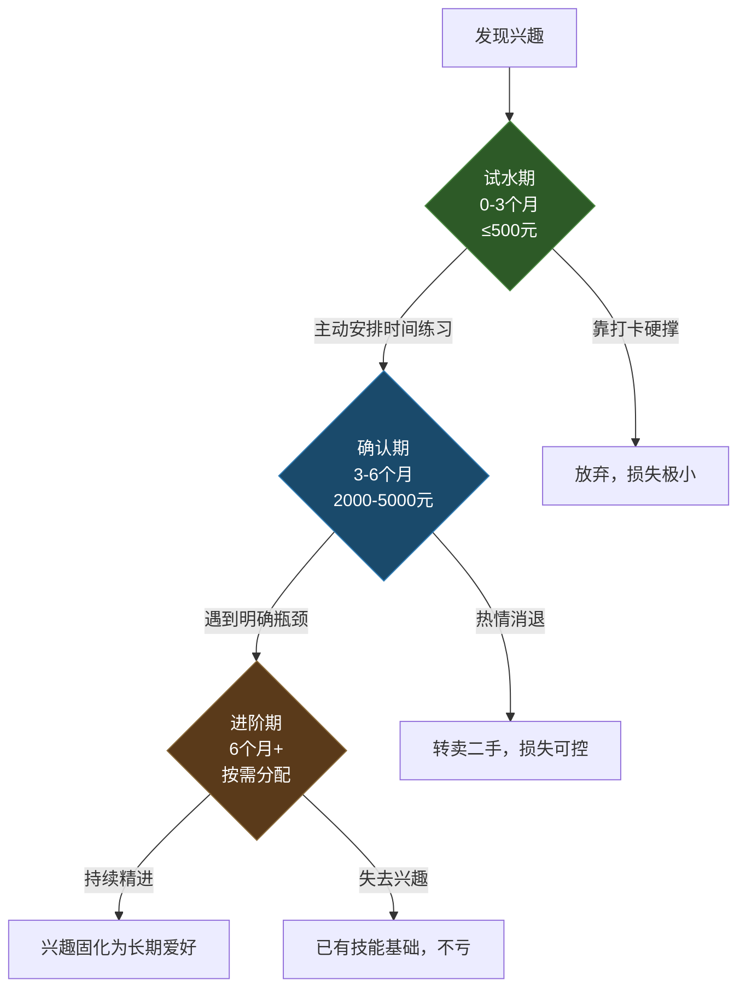
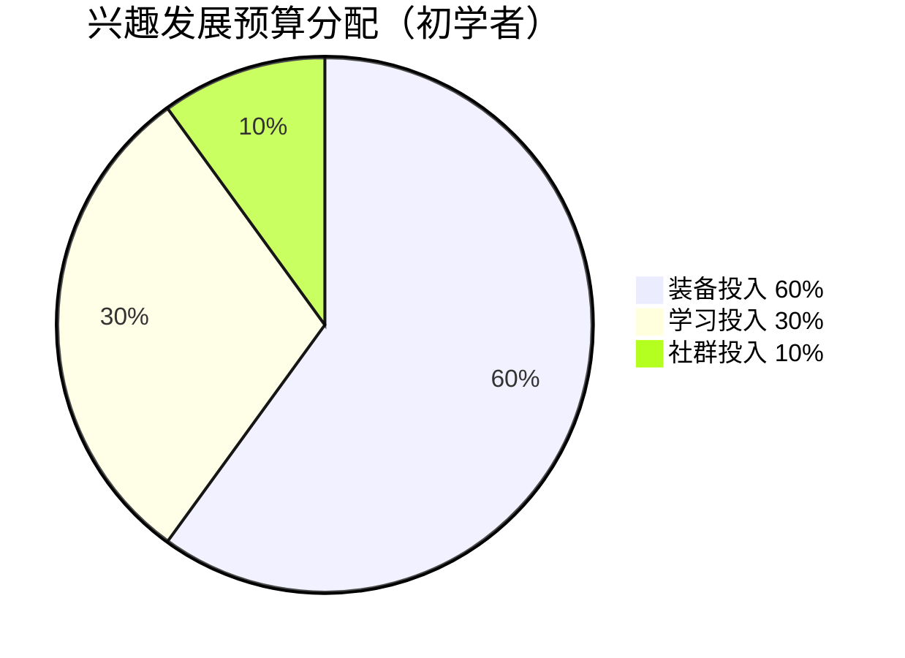
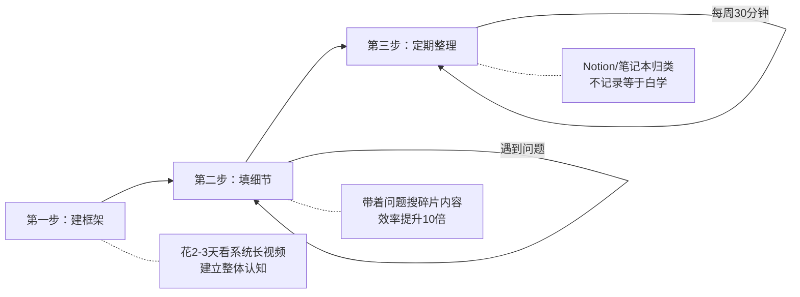

## 本节小结

本节围绕摄影、音乐、运动、手工创作四大领域，为你梳理了从入门装备到学习资源的完整推荐清单。这一小节的目的不是重复前面的具体型号和价格——那些信息你随时可以翻回去查阅——而是把这些碎片化的推荐整合成一套**可执行的决策框架**，帮你在有限预算内做出最优选择，同时避开绝大多数新手会踩的坑。

### 回顾：四大领域各讲了什么

在进入总结之前，快速回顾每个领域的核心要点，确保你没有遗漏关键信息：

**摄影入门装备**：从传感器与画幅的物理原理出发，理解了"好画质"的硬件基础；按入门、进阶、专业三档给出了具体机身和镜头推荐；覆盖了存储卡、三脚架、滤镜、灯光等配件体系；以及Lightroom、Capture One等后期工具和B站、YouTube等学习资源。核心结论：机身够用就行，镜头才是画质的关键变量，后期技术比器材升级的边际收益高得多。

**音乐学习装备**：按吉他、钢琴/键盘、尤克里里、口琴、架子鼓等乐器逐一拆解，每个品类都给出了入门、中端、进阶三档推荐，附带调音器、节拍器、琴弦、琴包等配件清单。核心结论：乐器的手感和音色直接影响练习意愿，入门阶段选"手感好、音色正"的中端产品比选"功能多、品牌大"的旗舰产品更明智。

**运动装备**：覆盖了跑步、瑜伽、游泳、球类四大运动方向，从跑鞋的缓震技术到瑜伽垫的材质选择，从泳镜的防雾原理到球拍的平衡点参数。核心结论：运动装备中最不能省钱的是直接接触身体且影响安全的品类（跑鞋、泳镜），其余可以先用平价替代。

**手工创作装备**：涵盖木工、编织、烘焙、模型制作四个方向，从基础手动工具到进阶电动工具，从原材料采购渠道到工作台搭建方案。核心结论：手工领域的装备投入曲线是"前低后高"——入门工具便宜但原材料消耗持续，要把持续成本纳入预算。

**通用学习资源**：系统梳理了B站、网易云课堂、Coursera、YouTube等在线平台，以及线下工作坊、社群、图书馆等实体资源。核心结论：免费资源够用但碎片化，需要先建框架再填细节的学习策略。

### 核心原则：三阶段投资法

兴趣培养最忌一上来就"全副武装"。大量初学者的失败经历表明，过早投入重金购买顶级装备，反而会因为"沉没成本焦虑"而加速放弃——花了八千块买相机，拍了两周觉得没意思，扔了可惜，继续又没动力，最后相机在柜子里吃灰三年。

正确的做法是分三阶段递进，每个阶段有明确的目标、预算边界和判断指标：

#### 第一阶段：试水期（0-3个月）

- **预算上限**：500元以内
- **目标**：验证兴趣是否真实、能否坚持
- **策略**：借用、租用或购买最基础的入门装备，不求品质只求能用
- **实操建议**：想学吉他？先借朋友的琴练两周，或者花200元买把最便宜的合板琴。想跑步？随便穿双运动鞋先跑一个月试试膝盖反应。想摄影？用手机拍三个月，先学会构图和光线再考虑相机。想做手工？买一套30元的入门材料包，完成一个完整作品再说。
- **关键判断指标**：如果你在试水期能**主动安排时间**去练习，而不是靠"打卡"和"自律"硬撑，说明这个兴趣值得进入下一阶段。具体来说，如果你会主动在下班后、周末、甚至午休时间想到"我想去练一会儿"，这就是真实的内在驱动力。如果你每次都需要心理建设才能开始，那说明这个兴趣可能不适合你，至少不适合现阶段的你。

试水期还有一个隐藏价值：**建立基本体感**。用手机拍三个月照片，你会对"好照片需要什么"有直觉认知，这时候再去选相机，你的判断力远超刚入门时看参数表的自己。用合板琴练两个月吉他，你会知道"弦距太高按着痛"是什么感受，选琴时就不会被销售忽悠。试水期花的不是"浪费的钱"，而是"获取判断力的投资"。

#### 第二阶段：确认期（3-6个月）

- **预算上限**：2000-5000元
- **目标**：正式入门，建立基本技能体系
- **策略**：购入该领域的"核心装备"，品质中等偏上，够用五年不落伍
- **核心装备的判断标准**：直接影响学习体验、使用频率最高、没有它就无法有效练习
- **案例分析**：

| 领域 | 核心装备（优先买） | 非核心（暂缓买） | 判断逻辑 |
|------|-------------------|------------------|----------|
| 跑步 | 跑鞋 | 运动服 | 差跑鞋伤膝盖，差衣服只是不舒服 |
| 吉他 | 琴本身 | 效果器 | 好琴音色激励练习，效果器是锦上添花 |
| 摄影 | 机身+一支好镜头 | 三脚架、滤镜 | 好镜头画质提升立竿见影 |
| 瑜伽 | 瑜伽垫 | 瑜伽砖、伸展带 | 垫子每天用，辅助工具偶尔用 |
| 木工 | 基础手动工具套装 | 电动工具 | 手动工具建立手感，电动工具提效率 |

确认期的关键心态转变是：从"我试试看"变成"我正式开始学了"。这个心理转变会直接影响你对待练习的态度——不再是随便玩玩，而是有意识地安排练习时间、设定阶段性目标、记录进步轨迹。

#### 第三阶段：进阶期（6个月以上）

- **预算**：按需分配，上不封顶
- **目标**：针对性补强短板，突破瓶颈，提升整体体验
- **策略**：根据实际使用中暴露的具体需求逐件购入辅助装备，每买一件都要能明确回答"它解决了我练习中遇到的什么具体问题"
- **警惕信号**：如果你说不出某件装备解决的具体问题，只是"看别人都有"或"感觉应该买"，那就是冲动消费，先放购物车冷静一周

进阶期最容易犯的错误是**装备焦虑**——觉得"如果我有更好的设备，水平就能更上一层楼"。事实是，绝大多数人的瓶颈在技术而非装备。一个用入门镜头的优秀摄影师，拍出来的东西远好于用顶级镜头的新手。在进阶期，把80%的精力放在技术提升上，20%放在装备升级上，才是正确的比例。

### 装备购买的五个常见误区

#### 误区一：只看品牌不看需求

很多人一听"入门"就盯着大牌旗舰。实际上，索尼A6400和佳能R50对于纯新手来说差别微乎其微——你根本还没能力分辨它们的画质差异。选你摸着舒服、界面顺眼、握持手感好的就行。品牌忠诚度是进阶玩家的事，新手阶段完全不需要考虑。

更深层的问题是：品牌营销会制造一种"身份认同"——用佳能的人觉得自己是"佳能党"，用索尼的人觉得自己是"索尼党"。这种身份认同会让你在选购时失去客观判断力，明明某款竞品更适合你，但因为"品牌忠诚"而拒绝考虑。记住：你是来学摄影的，不是来加入品牌粉丝团的。

#### 误区二：被"一步到位"洗脑

"一步到位"是消费主义最成功的营销话术之一。真相是：你根本不知道"到哪一步"才算到位，因为你还没入门，不知道自己真正需要什么。一个练了三个月吉他的人，无法判断自己需要什么样的琴颈形状和弦距设置。等你练了半年，积累了足够的体感，自然知道自己需要升级什么。那时候你的选择会比现在盲目购买精准十倍。

"一步到位"还有一个隐藏陷阱：**过高的期望值**。花了大价钱买了顶级设备，你会不自觉地期望它"配得上"你的投入，一旦使用体验没有想象中那么惊艳，失望感会被放大。而用入门设备起步，每一点进步都会带来超出预期的满足感——"没想到这么便宜的琴也能弹出好听的声音"。

#### 误区三：忽视二手市场

闲鱼、转转等平台上有大量九成新的入门装备。很多人买了"一步到位"的设备后发现不适合自己，低价转手。这是你用五到七折价格买到优质装备的绝佳机会。买二手时注意三点：要求卖家提供实物拍摄的细节图（不是官网图）、当面交易时当面验货、线上交易一定走平台担保不要私下转账。

特别是相机和乐器，二手市场非常成熟，因为这些品类的用户群体本身就爱折腾装备。摄影器材的二手保值率很高——一台用了两年的索尼A7M4，二手价大约是新品的70%-75%。吉他的二手保值率也不错，特别是知名品牌如雅马哈、马丁、泰勒。**买二手的最大好处不是省钱，而是降低试错成本**——如果发现不适合自己，再转手的亏损很小。

二手购买的验货清单：
- **相机**：检查快门次数（用ExifTool查看）、传感器有无坏点（拍纯白照片检查）、镜头有无霉丝（对着光看）
- **吉他**：检查琴颈是否平直（从琴头方向看弦距）、品丝有无严重磨损、音孔内有无开裂
- **运动手表**：检查表带磨损程度、传感器精度（对比新机数据）、电池续航
- **电动工具**：检查电机有无异响、碳刷磨损程度、安全锁是否正常

#### 误区四：只买装备不投学习

花5000元买相机，却不愿意花200元买一门系统课程——这是最常见的错误。装备是工具，知识才是能力。一本好书、一门好课带来的提升，远大于从A6400升级到A7M4。很多时候你觉得"装备不够好"，其实真正的问题是"技术不够好"。把升级装备的钱拿出三分之一投资学习，回报率会高得多。

这里有一个简单的计算：假设你花3000元买了一台相机，又花300元买了一门后期课程。如果你用这台相机+课程学了6个月，拍出了满意的照片，那你的"每张满意照片的成本"远低于花8000元买顶级机身但没学过任何课程的人。**装备的性价比要用"产出/投入"来衡量，而不是用"参数/价格"来衡量**。

#### 误区五：跟风购买

小红书上博主推荐的装备，未必适合你。博主的需求是出片效率和商业拍摄，你的需求是记录生活和培养兴趣，两者完全不同。而且很多推荐是商业合作，博主自己未必真的在用。参考可以，但一定要结合自己的实际使用场景做判断。最简单的验证方法：去B站搜"XX装备 真实使用体验"，看普通用户的长期反馈，比看开箱视频靠谱得多。

识别软广告的几个信号：
- 视频/文章中反复强调某个品牌名，且措辞像广告语
- 只说优点不说缺点，或者缺点一笔带过
- 没有使用场景的具体描述，只有参数罗列
- 评论区大量"已下单""种草了"但缺少技术讨论
- 发布时间集中在产品上市后一周内

### 预算分配建议

如果你每月有500元的"兴趣发展预算"，建议按以下比例分配：

- **装备投入 60%（约300元）**：用于核心装备的渐进式购入，可以攒几个月一次性购买。不要每个月买一件小配件，而是集中火力在最需要的装备上。
- **学习投入 30%（约150元）**：用于课程、书籍、参加工作坊或一对一辅导。这笔钱的回报率远高于同金额的装备投入。
- **社群投入 10%（约50元）**：用于线下活动、聚会、比赛报名、社群会员费。社群的价值不在于社交本身，而在于**看到同水平的人在进步**——这会给你持续的动力。

这个比例不是固定的，会随着你水平的提升而变化：

| 阶段 | 装备 | 学习 | 社群 | 说明 |
|------|------|------|------|------|
| 初学者（0-6月） | 50% | 40% | 10% | 前期知识缺口最大，学习投入要加重 |
| 进阶者（6-24月） | 60% | 25% | 15% | 已有基础，装备升级边际收益高 |
| 资深者（2年+） | 70% | 15% | 15% | 清楚需求，装备投入精准高效 |

### 四大领域的装备优先级速查表

当你手握预算时，不要把钱平均分配，而是按优先级集中投入。以下是四大领域的装备优先级排序：

| 领域 | 第一优先（核心装备） | 第二优先（体验提升） | 第三优先（锦上添花） |
|------|---------------------|---------------------|---------------------|
| 摄影 | 机身+标准镜头 | 系统课程或好书 | 三脚架、滤镜、灯光 |
| 音乐 | 乐器本身 | 节拍器/调音器 | 录音设备、效果器 |
| 运动 | 专项运动鞋 | 运动服装 | 智能手表、记录设备 |
| 手工 | 该领域基础工具套装 | 优质原材料 | 进阶电动工具 |

很多人反着来——买了三脚架、滤镜、相机包，却舍不得换掉套机镜头，这就是典型的优先级错位。正确的做法是：先确保第一优先的装备到位且品质过关，再考虑第二优先，最后才是第三优先。

### 免费资源的正确使用姿势

本节推荐了大量免费资源——B站、YouTube、小红书等，但免费资源有一个致命问题：**信息碎片化**。你可能看了100个短视频，学会了20个零散技巧，但依然不知道"从零到一"的系统路径是什么。这就像拼拼图只拿到了碎片，没有盒盖上的完整图案做参考，永远拼不出全貌。

解决方法分三步走：

**第一步：先看系统课程建立框架**——哪怕是免费的长视频系列（B站搜索"XX系统教程"或"XX零基础到入门"），花两三天集中看完，建立对这个领域的整体认知框架。知道这条路有多少个阶段、每个阶段要学什么、大概要花多久。这一步的价值是让你从"不知道自己不知道什么"变成"知道自己不知道什么"——后者是高效学习的前提。

**第二步：再用碎片内容填充细节**——有了框架之后，你的学习就从"漫无目的刷视频"变成"带着问题找答案"。比如你知道了摄影要学曝光三角，遇到不懂的就针对性搜索"光圈怎么调""快门速度怎么选"，效率会高出十倍。碎片内容的最佳使用方式是"遇到具体问题时当工具书查阅"，而不是"没事时随便刷刷"。

**第三步：定期回顾整理笔记**——用Notion、飞书文档或哪怕一个笔记本，把学到的技巧按主题归类整理。人的短期记忆容量有限，不记录等于白学。每周花30分钟回顾本周学到的东西，比多看十个视频更有价值。推荐的笔记结构：

📁 兴趣学习笔记
├── 📁 摄影
│   ├── 曝光三角笔记.md
│   ├── 构图技巧.md
│   ├── 后期调色心得.md
│   └── 拍摄日志.md（记录每次拍摄的参数和反思）
├── 📁 吉他
│   ├── 和弦转换练习记录.md
│   ├── 指法技巧.md
│   └── 练习计划.md
└── 📁 通用
    ├── 好资源收藏.md
    └── 装备购买记录.md（含价格、购买渠道、使用感受）

### 六个领域的生命周期成本估算

很多人只算装备的"购入价"，忽略了持续成本。以下是四大领域第一年的完整花费估算（按每月500元预算、中等投入强度计算）：

| 领域 | 装备购入 | 持续耗材 | 学习投入 | 社群/活动 | 第一年总计 |
|------|---------|---------|---------|----------|-----------|
| 摄影 | 3000-5000元 | 存储卡/打印约200元 | 300-800元 | 外拍活动约200元 | 3700-6200元 |
| 吉他 | 800-2000元 | 琴弦/变调夹约150元 | 200-500元 | 演出活动约100元 | 1250-2750元 |
| 跑步 | 500-1000元 | 跑鞋更换约600元 | 免费为主 | 报名费约300元 | 1400-1900元 |
| 瑜伽 | 200-500元 | 无明显耗材 | 100-500元 | 约200元 | 500-1200元 |
| 木工 | 500-1500元 | 木材约600-1200元 | 100-300元 | 约100元 | 1300-3100元 |
| 编织 | 100-300元 | 毛线约500-800元 | 50-200元 | 约50元 | 700-1350元 |

从这个表可以看出：**装备便宜的领域，持续耗材可能不便宜**（木工的木材、编织的毛线），而**装备贵的领域，持续成本反而可控**（摄影买完相机后主要花存储卡和打印的钱）。做预算规划时，一定要把持续成本纳入考量。

### 知道什么时候该坚持，什么时候该放弃

本节的主旨是帮你找到并培养兴趣爱好，但同样重要的是：**学会识别"不适合自己"的信号，及时止损**。

以下情况说明这个兴趣可能不适合你：

1. **持续三个月以上，每次开始都需要心理建设**。偶尔的倦怠是正常的（任何技能学习都有瓶颈期），但如果你从第一天开始就需要"逼自己"，那不是瓶颈期，是方向问题。
2. **练习过程中感受不到任何"心流"体验**。心流（Flow）是指全神贯注于一件事、忘记时间流逝的状态。如果你练了三个月，一次心流都没体验过，说明这个活动可能无法进入你的"心流通道"。
3. **装备已经到位、学习资源充足，但你依然找各种借口逃避练习**。这不是"懒"，是你的潜意识在告诉你：这不是你真正想做的事。

放弃一个不适合的兴趣不是失败，而是**信息收集的成功**——你现在更清楚自己不喜欢什么了。用同样的预算和精力去尝试下一个方向，成功率会更高。

### 知识回顾：自检清单

读完本节全部内容后，用以下清单检验自己的掌握程度。如果任何一项回答"不确定"，建议翻回对应章节重新阅读：

- [ ] 能解释"三阶段投资法"的三个阶段、预算边界和判断指标
- [ ] 知道自己感兴趣的领域，其核心装备是什么、优先级如何排序
- [ ] 能说出至少三个常见的装备购买误区及其背后的逻辑
- [ ] 了解二手市场的验货要点（针对自己感兴趣的品类）
- [ ] 知道免费资源的"框架→细节→整理"三步使用法
- [ ] 对第一年的完整花费有大致估算，包括持续成本
- [ ] 能区分"正常的瓶颈期"和"不适合自己的信号"

### 下一步行动清单

读完本节，建议你今天就做三件事，不要拖到"明天"：

1. **确定你最想尝试的1到2个兴趣**——贪多嚼不烂，专注才能出成果。选的标准不是"哪个最有用"而是"哪个你想到就兴奋"。如果你在两个兴趣之间犹豫，选那个**入门成本更低**的，先用最小代价验证兴趣。
2. **按三阶段投资法制定你的预算计划**——写下来：你愿意为此每月投入多少时间和多少钱，试水期打算用什么装备。把计划写在纸上或手机备忘录里，模糊的想法和明确的计划之间隔着一道巨大的执行力鸿沟。
3. **购买或借入第一阶段装备，本周就开始**——行动力比完美计划重要一万倍。哪怕只是用手机开始拍第一张照片、用借来的琴弹第一个和弦、穿上运动鞋出门跑第一个一公里。

在下一节中，我们将为你提供详细的学习路径规划，帮助你从零开始，有条不紊地推进兴趣爱好的发展，避免走弯路。

***
