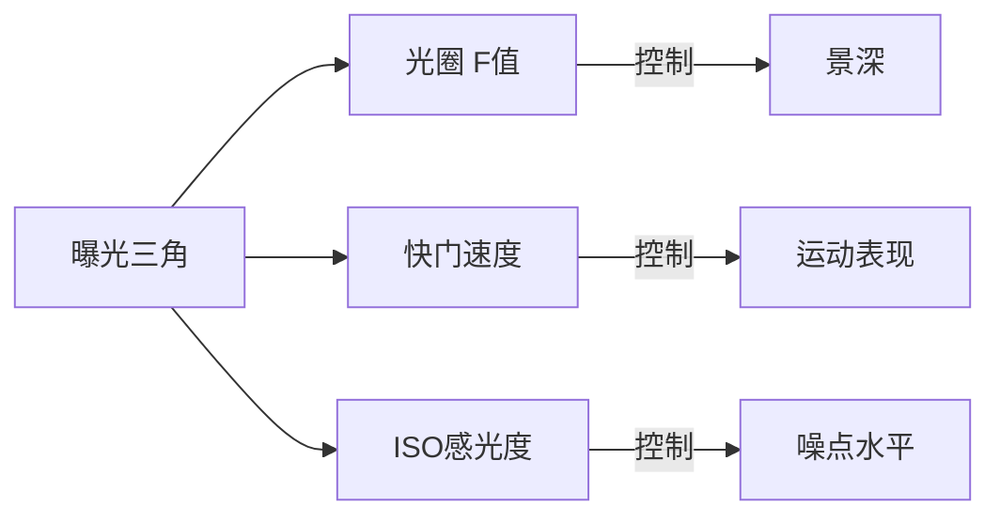
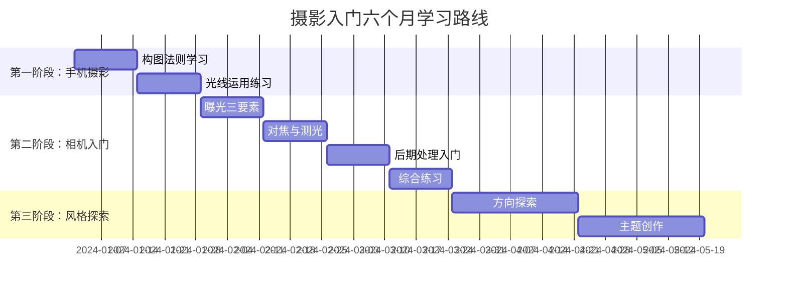

## 一、摄影入门方案

摄影是现代人最容易上手、回报最高的兴趣爱好之一。它不需要天生的乐感或运动神经，不需要昂贵的入门设备，只需要一双愿意观察世界的眼睛。在智能手机已经普及的今天，每个人口袋里都揣着一台功能强大的相机——摄影的入门门槛已经降到了人类历史的最低点。

但"容易入门"不等于"浅薄"。摄影的深度足以让你钻研一辈子：光学物理、色彩科学、视觉心理学、人文叙事、后期数字暗房……它是一门真正的"越学越深"的技艺。本方案将带你从零开始，用六个月时间建立起扎实的摄影基础，并找到属于自己的视觉语言。

### 1.1 为什么值得学习摄影

#### 1.1.1 摄影改变你看世界的方式

学习摄影最深刻的变化不在于你拍出了多好的照片，而在于你开始"看见"以前忽略的东西。光线如何穿过树叶在地面投下斑驳的光影，雨水如何在玻璃上画出抽象的纹理，老人脸上的皱纹如何讲述一生的故事——这些一直存在，但摄影训练了你的眼睛去捕捉它们。

神经科学研究表明，人类大脑处理视觉信息时会进行大量"压缩"——我们只关注与当前任务相关的视觉信息，其余的被大脑自动忽略。摄影训练的本质是一种"主动观察"的练习，它迫使你放慢速度，认真审视眼前的每一个画面元素。

#### 1.1.2 摄影作为爱好的独特优势

| 优势维度 | 具体说明 |
|---------|---------|
| **零门槛入门** | 一部手机即可开始，无需任何前置技能或天赋 |
| **即时反馈** | 拍完立刻看到结果，学习循环极短，成就感来得快 |
| **社交属性强** | 作品天然适合分享，容易找到同好社群 |
| **与其他爱好兼容** | 旅行、美食、运动、绘画、手工……几乎所有爱好都能与摄影结合 |
| **副业潜力** | 技术成熟后可承接人像、产品、活动等商业拍摄 |
| **终身成长** | 从技术到艺术，从器材到哲学，学习曲线几乎没有天花板 |
| **记录生活** | 为家人、为自己留下珍贵的视觉记忆 |

#### 1.1.3 摄影与其他视觉艺术的关系

摄影和绘画共享构图、色彩、光影等基础语言，但媒介特性截然不同。绘画是"加法"——在空白画布上逐笔添加；摄影是"减法"——在纷繁现实中选择框取什么、排除什么。理解这个区别，你就理解了摄影的核心思维方式：**选择与取舍**。

与视频相比，摄影是静态的、凝练的。一张好照片需要在一个画面里完成所有叙事，这对构图和时机的要求更高。但正因为这种"压缩"，优秀的摄影作品往往具有比视频更强的视觉冲击力和想象空间。

### 1.2 第一阶段：手机摄影入门（第1-4周）

**阶段目标**：掌握基本的构图法则和光线运用，能够拍出清晰、构图合理的照片。培养"主动观察"的习惯。

这个阶段不要急着买相机。手机是最好的练习工具——它随身携带、操作简单、即时分享。先用手机把构图和光线练扎实，再考虑升级设备。

#### 1.2.1 构图基础：六种核心法则

构图是摄影的骨架。一张构图糟糕的照片，即使用十万块的相机拍的，也不会好看。一张构图精妙的照片，即使用手机拍的，也能打动人心。

**法则一：三分法则（Rule of Thirds）**

将画面用两条水平线和两条垂直线分成3×3的九宫格。将主体放在这四条线的交叉点上，或者沿着线条放置。这是最基础、最实用、适用范围最广的构图法则。

为什么三分法则有效？因为人眼在观看画面时，自然倾向于先关注偏离中心的位置。把主体放在正中央会让画面显得呆板（除非你刻意追求对称感），而放在三分点上则能创造视觉张力。

实操要点：
- 大多数手机相机都内置了九宫格辅助线，在设置中打开它
- 拍人像时，把人物的眼睛放在上三分之一线上
- 拍风景时，把地平线放在上三分之一或下三分之一线上（天空好看就多留天空，地面好看就多留地面）
- 不要永远把地平线放在画面正中央

**法则二：引导线（Leading Lines）**

利用场景中的线条——道路、河流、栏杆、桥梁、建筑边缘、电线——引导观众的视线从画面的某个位置移动到主体上。引导线是画面的"视觉路径"，它让观众的眼睛按照你设计的方向移动。

常见的引导线类型：
- **汇聚线**：铁轨、公路向远方汇聚，创造纵深感和透视效果
- **曲线**：蜿蜒的小路、河流，创造优雅的视觉流动感
- **对角线**：楼梯、斜坡，增加画面的动感和能量
- **隐含线**：人物的视线方向也是一种"引导线"——观众会自然地看向人物注视的方向

**法则三：对称与平衡**

对称构图利用水面倒影、建筑立面、镜面等创造完美对称，带来庄重、宁静的视觉感受。但对称不等于"把所有东西放在正中央"——你需要找到真正的对称轴。

平衡则更灵活：画面不需要对称，但视觉重量要均衡。如果左边有一个大面积的暗色区域，右边可以用一个小面积的亮色区域来平衡。就像跷跷板一样，重量×距离要大致相等。

**法则四：留白（Negative Space）**

留白是画面中主体之外的空间。初学者最常见的错误就是把画面塞得太满——恨不得把所有看到的东西都塞进画面里。实际上，适当的留白能够：
- 突出主体，让主体更醒目
- 营造意境，给观众想象空间
- 创造呼吸感，让画面不压抑
- 强调孤独、渺小、宁静等情绪

练习方法：拍一张照片后，问自己"能不能再裁掉一些？"如果能，说明你的画面还有多余的元素。

**法则五：框架构图（Framing）**

利用场景中的天然框架——门框、窗户、树枝、拱门、隧道——来框住主体。框架构图能够：
- 增加画面的层次感（前景-中景-背景）
- 自然地将观众视线引向主体
- 为画面增添故事感和窥探感

注意：框架不必是完整的四边围合，甚至只在画面上方有一些树枝垂下来，也能起到框架的效果。

**法则六：简化与减法**

这是构图的最高原则，也是贯穿所有法则的核心思想：**画面中的每一个元素都应该为照片的主题服务，不为主题服务的元素就应该被排除。**

实操方法：
- 移动你的脚步：换个角度、走近几步、蹲下或举高，用位置变化来改变画面内容
- 改变焦距：拉近裁掉干扰元素，或拉远纳入更多环境
- 等待时机：行人走开、车辆通过，等到画面"干净"的瞬间再按快门

#### 1.2.2 光线运用：摄影的灵魂

"摄影"（Photography）这个词来自希腊语，字面意思就是"用光书写"。光线是摄影最核心的元素，没有之一。

**理解光的方向**：

| 光线方向 | 效果 | 适用场景 |
|---------|------|---------|
| **顺光**（光从你背后照向主体） | 画面清晰、色彩饱和，但可能缺乏立体感 | 风景记录、建筑拍摄 |
| **侧光**（光从侧面照向主体） | 强烈的明暗对比，突出纹理和立体感 | 人像、建筑、风光 |
| **逆光**（光从主体背后照向你） | 剪影效果、光晕、轮廓光，戏剧性强 | 剪影人像、日落、树叶 |
| **顶光**（正午阳光从头顶直射） | 眼窝和鼻下产生浓重阴影，通常不理想 | 避免拍摄人像，可拍建筑 |
| **散射光**（阴天或多云） | 光线均匀柔和，无强烈阴影 | 人像、微距、产品拍摄 |

**黄金时段（Golden Hour）**：

日出后一小时和日落前一小时，阳光穿过更厚的大气层，短波蓝光被散射掉，剩下温暖的橙黄色调。此时光线角度低，阴影长而柔和，是绝大多数摄影题材的最佳拍摄时间。

与之对应的是"蓝色时刻"（Blue Hour）——日出前和日落后各约20-30分钟，天空呈现深蓝色调，城市灯光刚刚亮起，是拍摄城市夜景的最佳时机。

**实操建议**：
- 在手机上安装天气/日出日落类App，提前规划拍摄时间
- 阴天不要放弃拍摄——阴天的均匀光线是拍人像的"天然柔光箱"
- 学会观察阴影：阴影的方向告诉你光源在哪里，阴影的硬度告诉你光源的大小

#### 1.2.3 手机摄影实操技巧

**对焦与曝光**：在手机屏幕上点击你想要对焦的位置，大多数手机会同时以该点为基准调整曝光。按住对焦点可以锁定对焦和曝光（AE/AF Lock），这在拍摄光线复杂的场景时非常有用。

**善用手机的隐藏功能**：
- **长曝光/流光快门**：拍摄车轨、丝绸般的水流
- **全景模式**：拍摄壮阔的风景，注意保持手机水平移动
- **延时摄影**：记录云层流动、日出日落的过程
- **人像模式**：利用算法模拟浅景深效果（注意边缘处理是否自然）
- **RAW格式拍摄**：部分高端手机支持，为后期处理保留更多细节

**手机后期修图**：
- **Snapseed**（免费）：功能强大且直观，推荐作为入门首选。重点学习"调整图片"、"突出细节"、"曲线"三个工具
- **VSCO**：胶片风格滤镜出色，适合快速出片
- **Lightroom Mobile**：功能最全面的手机修图App，与桌面版Lightroom无缝衔接

#### 1.2.4 第一阶段练习计划

| 周次 | 主题 | 每日任务 | 周末任务 |
|------|------|---------|---------|
| 第1周 | 三分法则 | 拍3张使用三分法则的照片 | 回顾本周照片，选出最佳3张 |
| 第2周 | 引导线与对称 | 拍3张含引导线或对称元素的照片 | 对比第1周和第2周的照片，分析进步 |
| 第3周 | 光线观察 | 同一场景在不同时段各拍1张 | 分析不同时段的光线差异 |
| 第4周 | 综合练习 | 自由拍摄，综合运用已学法则 | 整理一个月的作品集（精选10张） |

**每日功课**：在手机上建立一个"摄影练习"相册，每天至少拍3张照片。不要追求每张都完美，重在练习和积累。

### 1.3 第二阶段：理解曝光与相机入门（第5-12周）

**阶段目标**：理解曝光三要素及其相互关系，能够使用相机的手动/半自动档位拍摄，掌握基本的后期处理流程。

#### 1.3.1 曝光三要素：摄影的物理基础

曝光三要素——光圈、快门速度、ISO感光度——共同决定了照片的亮度。理解它们之间的关系，是摄影从"随手拍"走向"有意识创作"的关键一步。

可以用一个水龙头的比喻来理解：

想象你在用水杯接水（光线就是水，水杯就是传感器）：
- **光圈**= 水龙头开多大（控制单位时间的进水量）
- **快门速度**= 水龙头开多久（控制进水的总时间）
- **ISO**= 水杯的大小（ISO越高，水杯越小，需要的水量越少，但"水杯"越粗糙）

**光圈（Aperture / F值）**：

光圈用F值表示，如F1.8、F2.8、F4、F5.6、F8、F11、F16。F值越小，光圈越大（进光量越多）；F值越大，光圈越小（进光量越少）。这个反直觉的关系是因为F值是一个比值（焦距÷光圈直径）。

光圈除了控制进光量，还控制**景深**——画面中清晰范围的大小：

| 光圈大小 | F值范围 | 景深效果 | 典型应用 |
|---------|--------|---------|---------|
| 大光圈 | F1.4-F2.8 | 极浅景深，背景强烈虚化 | 人像特写、细节突出 |
| 中光圈 | F4-F8 | 适中景深，主体清晰背景适度虚化 | 日常拍摄、小团体合影 |
| 小光圈 | F11-F22 | 极深景深，前后都清晰 | 风景、建筑、集体照 |

**注意**：镜头在最大光圈和最小光圈时画质都会下降。大多数镜头的最佳画质（"甜蜜点"）在F5.6-F8之间。

**快门速度（Shutter Speed）**：

快门速度决定了传感器暴露在光线中的时间长度。它用分数表示，如1/1000秒、1/250秒、1/60秒、1秒、30秒。

| 快门速度 | 效果 | 典型应用 |
|---------|------|---------|
| 1/1000秒以上 | 完全定格高速运动 | 体育、飞鸟、泼水 |
| 1/250-1/500秒 | 定格一般运动 | 行走的人、宠物 |
| 1/60-1/125秒 | 日常拍摄的安全快门 | 一般场景 |
| 1/15-1秒 | 需要三脚架，开始出现运动模糊 | 流水、车轨 |
| 数秒-数分钟 | 长曝光，大量运动模糊 | 星轨、光绘、丝滑水面 |

**手持安全快门法则**：手持拍摄时，快门速度不应慢于"1÷等效焦距"。例如使用50mm镜头，安全快门约为1/50秒；使用200mm镜头，安全快门约为1/200秒。低于安全快门就容易因手抖导致画面模糊。

**ISO感光度（ISO Sensitivity）**：

ISO控制传感器对光线的敏感程度。常见范围为ISO 100-12800，部分相机可扩展到ISO 50-102400甚至更高。

核心原则：**ISO越低，画质越好；ISO越高，噪点越多。** 所以摄影的基本策略是：在光圈和快门速度满足创作需求的前提下，尽量使用最低的ISO。

现代相机的高感表现已经大幅提升。全画幅相机在ISO 3200以下通常都能获得干净的画面，APS-C画幅在ISO 1600以下表现良好。不要害怕提高ISO——一张稍微有噪点但曝光正确的照片，远好过一张低ISO但因为快门太慢而模糊的照片。

#### 1.3.2 曝光三要素的互易关系

光圈、快门、ISO三者构成了一个"曝光三角"。调整其中一个参数，必须用另外两个参数来补偿，才能保持相同的曝光量。

这就是摄影中最重要的概念之一——**互易律（Reciprocity）**：

- 开大一档光圈（如F4→F2.8）= 进光量翻倍，需要加快一档快门或降低一档ISO来补偿
- 放慢一档快门（如1/250→1/125）= 进光量翻倍，需要缩小一档光圈或降低一档ISO来补偿
- 提高一档ISO（如400→800）= 感光度翻倍，可以缩小一档光圈或加快一档快门

**记忆口诀**：光圈、快门、ISO，三者此消彼长。想要背景虚化就开大光圈，想要定格瞬间就加快快门，两者都不够就提高ISO。

#### 1.3.3 相机档位与选择策略

大多数相机提供以下拍摄模式：

| 档位 | 名称 | 控制什么 | 相机自动控制什么 | 适用场景 |
|------|------|---------|----------------|---------|
| **M** | 手动模式 | 光圈、快门、ISO全部手动 | 无 | 影棚、长曝光、极端光线 |
| **A/Av** | 光圈优先 | 光圈 + ISO | 快门速度 | 人像、风光（最常用档位） |
| **S/Tv** | 快门优先 | 快门 + ISO | 光圈 | 运动、瀑布等需要控制快门的场景 |
| **P** | 程序自动 | ISO | 光圈和快门 | 快速抓拍、不确定参数时 |

**新手建议**：从光圈优先（A/Av）模式开始学习。这个模式让你控制最重要的创作参数（光圈/景深），同时让相机自动处理快门速度，降低了操作复杂度。大多数专业摄影师在日常拍摄中也主要使用光圈优先模式。

#### 1.3.4 对焦系统

**对焦模式**：
- **单次对焦（AF-S / One Shot）**：半按快门完成一次对焦后锁定。适合静态主体——人像、风景、静物
- **连续对焦（AF-C / AI Servo）**：半按快门后持续追踪移动主体。适合运动、宠物、街拍
- **自动选择（AF-A / AI Focus）**：相机自动判断主体是否移动，在两种模式间切换

**对焦区域**：
- **单点对焦**：你手动选择一个对焦点，精确控制对焦位置。推荐日常使用
- **区域对焦**：在一组对焦点中自动选择。适合追踪移动主体
- **全域自动对焦**：相机自己选择对焦点。不可靠，不推荐

**实操建议**：养成习惯——对焦点永远放在主体的眼睛上（拍人像时）。眼睛是人像照片的灵魂，眼睛清晰的照片和眼睛模糊的照片差距巨大。

#### 1.3.5 测光与曝光补偿

相机的测光系统负责评估场景亮度并给出曝光建议。理解测光模式能帮你避免"相机被骗"的情况。

**三种测光模式**：
- **评价测光/矩阵测光**：分析整个画面的亮度分布，给出综合曝光建议。适合光线均匀的场景，是默认推荐模式
- **中央重点测光**：重点考虑画面中央区域的亮度。适合主体在画面中央的场景
- **点测光**：只测量对焦点附近很小区域的亮度。适合光线反差极大的场景（如逆光人像）

**为什么需要曝光补偿**：相机的测光系统以18%中灰为基准。当场景中大面积为白色（雪地、白色婚纱）或大面积为黑色（夜晚、黑色物体）时，相机会"被骗"——白色场景会拍灰（曝光不足），黑色场景会拍亮（曝光过度）。

**曝光补偿口诀**：白加黑减——拍白色物体要加曝光补偿（+1到+2EV），拍黑色物体要减曝光补偿（-1到-2EV）。

#### 1.3.6 后期处理入门

后期处理不是"作弊"，它是摄影创作流程中不可分割的一部分。从胶片时代的暗房冲洗到今天的数码后期，后期处理一直是摄影的一部分。即使是直出的JPEG照片，相机内部也进行了大量的色彩处理和锐化。

**核心后期软件**：

| 软件 | 特点 | 价格 | 推荐度 |
|------|------|------|--------|
| **Adobe Lightroom Classic** | 功能最全面的RAW处理软件，业界标准 | 订阅制，约￥50/月 | ★★★★★ |
| **Capture One** | 色彩管理出色，联机拍摄功能强 | 订阅制或买断 | ★★★★☆ |
| **Darktable** | 开源免费的Lightroom替代品 | 免费 | ★★★★☆ |
| **RawTherapee** | 另一款开源RAW处理器 | 免费 | ★★★☆☆ |
| **Snapseed** | 手机端最佳修图App | 免费 | ★★★★☆（手机端） |

**新手后期必学的五个调整**：

1. **曝光调整**：整体提亮或压暗。如果照片偏亮就向左拉，偏暗就向右拉
2. **白平衡调整**：控制照片的色温（冷暖色调）。室内灯光偏黄可以往蓝色方向调，阴天偏蓝可以往黄色方向调
3. **对比度**：增加对比度让画面更有冲击力，降低对比度让画面更柔和。通常适当增加即可
4. **高光/阴影**：分别调整画面最亮和最暗区域的细节。高光拉回（-）可以找回过曝区域的细节，阴影提亮（+）可以找回暗部细节
5. **裁剪与水平校正**：修正构图缺陷，确保地平线水平

**理解直方图**：直方图是照片亮度分布的图表。横轴从左（纯黑）到右（纯白），纵轴表示该亮度的像素数量。一张曝光合理的照片，直方图应该从左到右都有分布，不严重偏向任何一侧。

如果直方图左侧（暗部）"撞墙"了——像素堆积在最左端——说明有大面积死黑，暗部细节丢失。如果右侧（亮部）撞墙了——说明有大面积过曝，亮部细节丢失。后期时可以通过高光/阴影滑块来"拉回"这些细节（前提是你拍的是RAW格式）。

**RAW vs JPEG**：

| 对比维度 | RAW | JPEG |
|---------|-----|------|
| 文件大小 | 大（20-60MB） | 小（3-10MB） |
| 后期空间 | 极大，可大幅调整 | 有限，大幅调整会出伪色/断层 |
| 色彩深度 | 12-14bit | 8bit |
| 动态范围 | 高，可找回更多细节 | 低，过曝/欠曝难以挽回 |
| 直接可用性 | 需要后期处理才能使用 | 直出即可分享 |
| 存储需求 | 高 | 低 |

**建议**：如果你认真学习摄影，务必使用RAW格式拍摄（或RAW+JPEG双格式）。RAW文件就像"数码底片"，给你最大的后期处理空间。

#### 1.3.7 第二阶段练习计划

| 周次 | 主题 | 核心练习 |
|------|------|---------|
| 第5-6周 | 光圈练习 | 同一场景用F2.8、F5.6、F8、F11各拍一张，对比景深差异 |
| 第7-8周 | 快门练习 | 拍摄流水（高速定格vs慢速丝滑），拍摄运动物体 |
| 第9-10周 | 测光与曝光补偿 | 在高反差场景练习点测光和曝光补偿 |
| 第11-12周 | 后期处理 | 为每张照片进行后期处理，学习RAW处理流程 |

### 1.4 第三阶段：风格探索与主题创作（第13-24周）

**阶段目标**：找到自己感兴趣的摄影方向，开始有意识地进行主题创作，形成个人风格的雏形。

#### 1.4.1 主流摄影方向详解

**人像摄影**：

人像摄影是最受欢迎的摄影类型之一，也是最考验综合能力的方向。它不仅需要技术（光线、对焦、构图），更需要沟通能力——你需要引导模特的情绪和姿态。

入门路径：
- 从身边的朋友、家人开始练习，降低社交压力
- 学习经典的人像布光方案：伦勃朗光、蝴蝶光、分割光
- 理解不同焦段对人像的影响：50mm自然，85mm经典人像焦段（适度压缩背景），35mm环境人像
- 练习与模特的沟通：给出具体的动作指令（"把下巴微微收一下"），而不是模糊的要求（"自然一点"）

**风光摄影**：

风光摄影看起来简单——不就是拍风景吗？但实际上它是技术要求最高的摄影类型之一。你需要等待最好的光线（可能要等几个小时甚至几天），需要精确的曝光控制（天空和地面的光比往往很大），需要携带沉重的器材长途跋涉。

入门路径：
- 从身边的城市风光开始，不需要远赴远方
- 学习使用渐变灰滤镜（GND）平衡天空和地面的光差
- 研究天气和光线——暴风雨前后的天空比晴天壮观一百倍
- 学会"踩点"——提前到拍摄地点考察最佳机位

**街头摄影**：

街头摄影是最自由、最考验"眼力"的摄影类型。它没有预设的剧本，你需要在瞬息万变的街头场景中捕捉有意义的瞬间。

入门路径：
- 使用35mm或50mm焦段（最经典的街拍焦段）
- 练习"预判"——看到有趣的元素，等待合适的人物进入画面
- 学习经典街头摄影师的作品：亨利·卡蒂埃-布列松、薇薇安·迈尔、森山大道
- 克服"拍陌生人"的心理障碍——先从不面对人的场景开始

**静物/产品摄影**：

静物摄影完全在你的控制之下——光线、构图、背景、道具，一切都可以精心安排。它适合喜欢精细打磨的人，也是进入商业产品摄影的跳板。

入门路径：
- 从家中的日常物品开始练习
- 学习使用自然窗光：窗户是最好的"柔光箱"
- 尝试用白色/黑色背景纸创造简洁的背景
- 练习微距拍摄：花朵、食物、手工制品

#### 1.4.2 创作方法论

**从"拍"到"创作"的转变**：

初学者是"看到什么拍什么"——到了一个地方，觉得好看就按下快门。进阶的摄影人则是"先想好要表达什么，再去拍"——带着明确的意图和计划去拍摄。

创作流程：
1. **确定主题**：你想表达什么？一个情绪、一个故事、一个观点？
2. **调研参考**：看看其他摄影师如何处理类似主题
3. **制定计划**：选择拍摄地点、时间、器材、模特（如果需要）
4. **执行拍摄**：带着计划去拍，但也保持开放心态接受意外
5. **筛选与后期**：从大量照片中精选最好的几张，进行有针对性的后期处理
6. **展示与反思**：把作品分享出去，收集反馈，反思下次如何改进

**图片故事/摄影散文**：

用一组照片（通常8-15张）讲述一个完整的故事。这比单张照片更有深度，也是培养摄影叙事能力的绝佳方式。

一组图片故事通常包含：
- 开场照（建立场景和氛围）
- 人物/主体介绍
- 细节照（特写，增加质感）
- 互动/动态照（展现关系和过程）
- 高潮照（最有张力的画面）
- 结尾照（留有余味）

#### 1.4.3 建立个人风格

个人风格不是刻意设计出来的，而是在大量拍摄和学习中自然形成的。但有一些方法可以加速这个过程：

- **收集你喜欢的照片**：建立一个Pinterest或Eagle素材库，收集你被吸引的摄影作品。一段时间后回头看，你会发现自己的审美偏好——是极简还是繁复？是冷色调还是暖色调？是明亮还是暗调？
- **研究大师**：选择3-5位你最喜欢的摄影师，深入研究他们的全部作品。不要只看最受欢迎的几张，要看他们如何在不同项目中保持一致的视觉语言
- **限制练习**：给自己设置限制条件——一周只拍黑白、一个月只用一个焦段、一个系列只用一种后期风格。限制反而能激发创造力
- **持续输出**：在社交媒体或个人博客上定期发布作品，保持创作的节奏

#### 1.4.4 参与摄影社区

- **线上平台**：图虫、500px、Flickr、Instagram——选择一个主要平台持续发布作品
- **线下活动**：参加本地摄影协会的活动、摄影工作坊、摄影展
- **摄影比赛**：以赛促练，比赛能给你明确的主题和截止日期，推动你走出舒适区
- **找一个摄影搭档**：互相点评作品，一起外出拍摄，进步更快

### 1.5 摄影装备选购指南

#### 1.5.1 手机摄影配件（入门级，￥200以内）

| 装备 | 价格范围 | 必要性 | 说明 |
|------|---------|--------|------|
| 手机三脚架 | ￥50-150 | 推荐 | 夜景、延时、自拍必备 |
| 手机外接镜头 | ￥100-300 | 可选 | 广角和微距镜头有实用价值，鱼眼看个人喜好 |
| 蓝牙快门遥控器 | ￥20-50 | 可选 | 搭配三脚架使用，避免按快门时的抖动 |

#### 1.5.2 相机选购建议（进阶级）

**选购原则**：
- **先确定预算，再选品牌**。不要被参数洗脑，够用就好
- **镜头比机身更重要**。好镜头配普通机身的效果远好于普通镜头配旗舰机身
- **买你愿意带出门的相机**。一台画质顶级但太重太大的相机，会因为懒得带而吃灰。一台画质还行但轻便小巧的相机会被你天天带出门

**入门微单推荐（2024-2025年参考）**：

| 相机 | 画幅 | 价格区间 | 优势 | 适合人群 |
|------|------|---------|------|---------|
| 索尼A6400/A6700 | APS-C | ￥5000-9000 | 对焦出色，镜头群丰富 | 追求性价比的入门者 |
| 富士X-T30 II / X-S20 | APS-C | ￥5500-9000 | 直出色彩优秀，复古外观 | 喜欢胶片感的人 |
| 佳能R50 / R10 | APS-C | ￥4500-7000 | 操控友好，RF镜头群 | 佳能生态用户 |
| 尼康Z30 / Z50 II | APS-C | ￥4500-7500 | 画质扎实，握持舒适 | 视频和照片兼顾 |
| 索尼A7C II | 全画幅 | ￥12000-14000 | 全画幅最轻便之一 | 预算充足追求画质 |

**入门镜头推荐**：
- **套机镜头**（通常18-55mm或16-50mm）：涵盖常用焦段，先用它学会各个焦段的特点
- **大光圈定焦镜头**（如50mm F1.8或35mm F2）：价格低廉（￥500-1500），画质出色，能拍出明显的背景虚化效果。这是性价比最高的镜头，强烈推荐购买
- **后期扩展**：根据你的拍摄方向选择——人像加85mm定焦，风光加超广角，微距加微距镜头

#### 1.5.3 周边配件

| 装备 | 价格范围 | 必要性 | 说明 |
|------|---------|--------|------|
| SD存储卡 | ￥50-200 | 必备 | 64GB起步，选择UHS-I或UHS-II速度等级 |
| 相机包/套 | ￥100-500 | 必备 | 保护相机，方便携带 |
| 三脚架 | ￥200-800 | 推荐 | 夜景、风光、长曝光必备。注意承重和收纳长度 |
| 清洁套装 | ￥30-80 | 必备 | 气吹、镜头布、镜头笔，保持镜头清洁 |
| 备用电池 | ￥50-200 | 推荐 | 一块电池通常能拍300-500张，长时间拍摄需要备用 |
| UV/保护镜 | ￥50-300 | 可选 | 保护前镜片，但劣质保护镜会降低画质 |

### 1.6 常见误区与纠正

#### 误区一："好照片靠好器材"

真相：器材只决定画质的上限，而决定照片好坏的是构图、光线、时机和表达。历史上许多经典照片是用最简陋的器材拍摄的。亨利·卡蒂埃-布列松用一台徕卡和一枚50mm镜头拍了一辈子，创造了一个时代的经典。

建议：把买器材的钱拿出一部分来买摄影书、参加工作坊，投资自己的眼睛和大脑，回报率远高于升级器材。

#### 误区二："后期处理是造假"

真相：后期处理是摄影创作的标准环节。安塞尔·亚当斯在暗房里花的时间比在野外拍摄的时间还多。RAW文件就像数码底片，不做后期就相当于拍了胶片不去冲洗。关键是后期的方向——增强照片的表现力和完成度，而不是扭曲事实。

#### 误区三："要拍出好照片就要去好地方"

真相：最好的拍摄地点是你的家附近。在你最熟悉的环境中，你更能发现别人看不到的细节和角度。许多获奖作品都是在摄影师家门口拍的。先把身边拍好，再去远方。

#### 误区四："照片越多越好"

真相：专业摄影师和业余爱好者的最大区别之一就是"出片率"。业余爱好者可能拍100张选10张，专业摄影师可能拍30张选10张，而大师可能拍20张选15张。提高出片率意味着你在按快门之前已经想清楚了要什么。质量永远比数量重要。

#### 误区五："追随潮流调色就是好后期"

真相：流行的调色风格（日系清新、赛博朋克、胶片复古）有其时效性，今天流行明天可能就过时了。好的后期应该是为照片的主题和情绪服务的，而不是套一个"滤镜"了事。先把基础后期功底打扎实，再尝试风格化处理。

#### 误区六："三分法则就是一切"

真相：三分法则是很好的入门工具，但它不是唯一的构图法则，更不是"铁律"。随着你的成长，你会学习到中心构图、黄金螺旋、对角线构图、极简构图等更多方法。最终的构图应该服务于你想表达的内容，而不是机械地套用公式。

### 1.7 推荐学习资源

#### 1.7.1 书籍

| 书名 | 作者 | 适合阶段 | 推荐理由 |
|------|------|---------|---------|
| 《纽约摄影学院教材》 | 纽约摄影学院 | 入门 | 摄影入门经典教材，体系完整 |
| 《摄影的艺术》 | 布鲁斯·巴恩鲍姆 | 进阶 | 深入讲解构图和视觉设计 |
| 《论摄影》 | 苏珊·桑塔格 | 高阶 | 摄影哲学，理解摄影的本质 |
| 《看照片看什么》 | 特里·巴雷特 | 进阶 | 学习如何分析和评价摄影作品 |
| 《光线与曝光》 | 布莱恩·彼得森 | 入门-进阶 | 用通俗语言讲解曝光原理 |

#### 1.7.2 在线学习平台

- **B站**：搜索"摄影入门"有大量免费教程，推荐关注"摄影师泰罗"、"影视飓风"等频道
- **YouTube**：Peter McKinnon、Mango Street、Tony & Chelsea Northrup——英文频道，内容质量极高
- **网易云课堂/腾讯课堂**：有系统的摄影付费课程，价格从几十到几百不等

#### 1.7.3 实践社区

- **图虫**：国内最大的摄影社区之一，有大量主题摄影活动
- **500px**：国际化摄影社区，可以欣赏到全球摄影师的作品
- **本地摄影协会**：大多数城市都有摄影协会或俱乐部，定期组织外拍和讲座

### 1.8 六个月学习路线总览

摄影是一场没有终点的旅程。六个月之后，你已经建立了扎实的基础，但真正精彩的部分才刚刚开始。你会开始发现自己独特的视觉语言，会开始在别人忽略的角落发现美，会开始用照片讲述属于你自己的故事。

记住：**最好的相机是你手边的那一台，最好的照片是你下一张要拍的那张。**

拿起你的手机，现在就开始拍吧。
