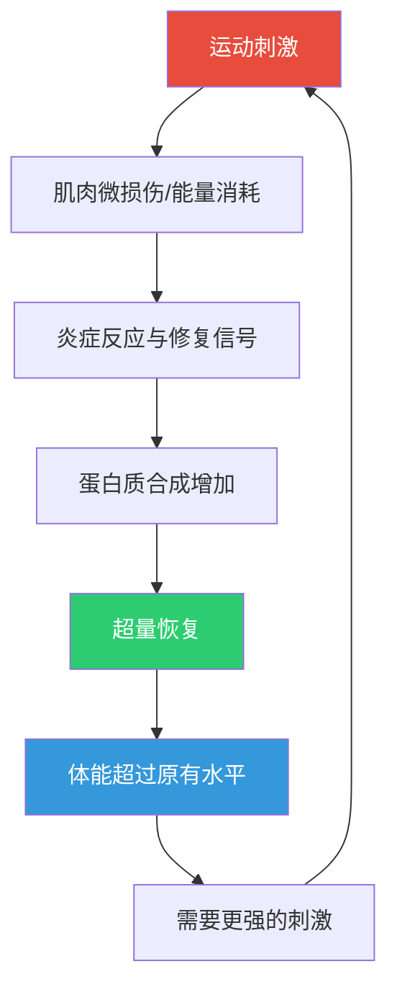
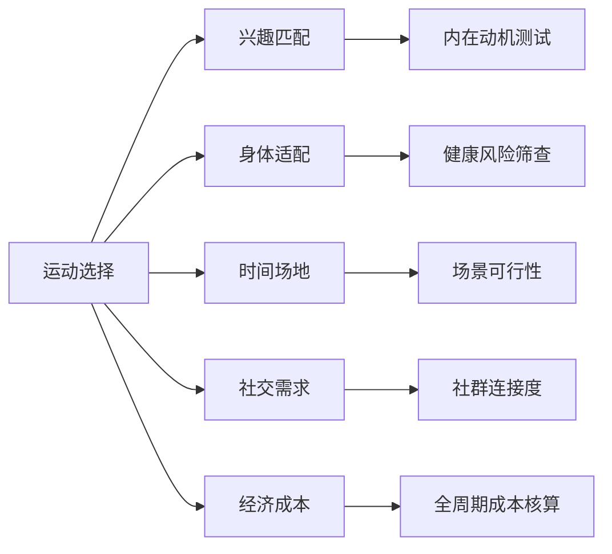
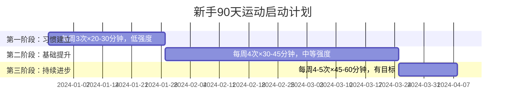

## 三、运动选择方案

运动是所有兴趣爱好中投入产出比最高的项目之一——它同时改善体能、情绪、认知和社交，是个人提升体系中不可替代的基石。本章从运动科学原理出发，提供一套完整的运动选择与执行框架，帮助你找到最适合自己的运动方式，并将其真正融入生活。

### 3.1 运动的底层逻辑：为什么运动能改变一切

#### 3.1.1 运动对大脑的改造

运动不只是"锻炼身体"。神经科学研究表明，有氧运动能促进脑源性神经营养因子（BDNF）的分泌，这种蛋白质直接促进海马体中新神经元的生成。海马体是大脑中负责记忆和学习的关键区域。

具体数据：
- 2011年匹兹堡大学的研究显示，每周3次、每次40分钟的快走，12个月后受试者的海马体体积增加了约2%，相当于逆转了1-2年的年龄相关萎缩
- 哈佛大学2019年的综述指出，规律运动使抑郁症风险降低约26%，焦虑症风险降低约48%
- 运动后2小时内，前额叶皮层的执行功能（决策、专注、自控）显著提升

这意味着：运动不是从你的日程中"偷走"1小时，而是让剩余15小时的效率大幅提升。

#### 3.1.2 运动的生理适应机制

理解身体如何适应运动，才能科学地制定计划：

这个"刺激→恢复→适应"的循环叫作**一般适应综合征（GAS）**，由内分泌学家Hans Selye提出。关键要点：
- **刺激不足**：身体没有改变的理由，体能停滞
- **刺激适中**：身体在恢复期变得更强，持续进步
- **刺激过大且恢复不足**：过度训练综合征，体能反而下降，免疫力降低

#### 3.1.3 三大供能系统

不同运动主要调用不同的能量系统，这决定了运动的体验和效果：

| 供能系统 | 主导时间 | 典型运动 | 训练效果 |
|---------|---------|---------|---------|
| 磷酸原系统（ATP-CP） | 0-10秒 | 短跑冲刺、举重极限 | 爆发力、力量 |
| 糖酵解系统 | 10秒-2分钟 | 400米跑、高强度间歇 | 乳酸耐受、速度耐力 |
| 有氧系统 | 2分钟以上 | 长跑、游泳、骑行 | 心肺耐力、脂肪代谢 |

大多数人日常运动以有氧系统为主，但加入无氧训练能显著提升整体体能水平。

### 3.2 运动选择五维评估模型

选择运动项目不能凭感觉，需要系统评估。以下五个维度覆盖了影响运动坚持和效果的核心因素：

#### 3.2.1 兴趣匹配度评估

**核心原则**：选择你真正享受的运动，而不是"应该"做的运动。意志力是有限资源，只有内在兴趣才能支撑长期坚持。

自我探索方法：

**回忆法**：回忆童年和学生时代，你最喜欢的体育课内容是什么？你曾经主动花时间做的身体活动是什么？这些往往指向你的天然兴趣倾向。

**体验法**：用一个月时间，每周尝试一种不同的运动。记录每次运动前的期待值（1-10分）和运动后的愉悦度（1-10分）。两个分数都高于7的运动，值得长期投入。

**人格匹配参考**：

| 人格特征 | 适合运动类型 | 代表运动 |
|---------|------------|---------|
| 外向、喜欢社交 | 团体运动、对抗性运动 | 篮球、足球、羽毛球 |
| 内向、享受独处 | 个人运动、户外探索 | 跑步、游泳、骑行 |
| 追求刺激、高敏感 | 极限运动、高难度挑战 | 攀岩、冲浪、跑酷 |
| 偏好安静、注重内心 | 身心运动、低强度 | 瑜伽、太极、普拉提 |
| 竞争性强、目标驱动 | 有明确指标的运动 | 举重、铁三、马拉松 |
| 审美导向 | 表现型运动 | 舞蹈、花样滑冰、体操 |

#### 3.2.2 身体条件适配

不同身体状况需要不同的运动选择策略：

**体重较大者（BMI>28）**：
- 优先选择：游泳、水中行走、椭圆机、骑行（坐姿）
- 避免初期直接跑步——关节承受的冲击力是体重的3-5倍，过重会显著增加膝踝损伤风险
- 当体脂降至合理范围后，可以逐步引入慢跑

**膝关节问题者**：
- 优先选择：游泳、骑行、椭圆机、坐姿力量训练
- 避免：深蹲（大重量）、登山下坡跑、跳跃类运动
- 可以做的：靠墙静蹲（强化股四头肌）、直腿抬高

**腰椎问题者**：
- 优先选择：游泳（仰泳最佳）、步行、核心稳定性训练
- 避免：大重量硬拉、仰卧起坐（改为卷腹或平板支撑）、触趾体前屈
- 核心强化是根本——腹横肌和多裂肌的稳定性训练远比活动度训练重要

**中老年（50岁以上）**：
- 优先选择：太极拳、八段锦、快走、游泳、弹力带力量训练
- 重点加入：平衡训练（单脚站立、闭眼站立）、柔韧性维持
- 骨质疏松者需要适度负重刺激（如快走、轻量力量训练），纯静坐运动反而不利于骨密度维持

**孕期与产后**：
- 孕期安全运动：散步、孕妇瑜伽、游泳、固定自行车
- 心率建议不超过140次/分钟（ACOG指南已放宽，但保守策略仍适用）
- 产后恢复：盆底肌训练（凯格尔运动）→ 核心恢复 → 逐步恢复常规运动

#### 3.2.3 时间与场地评估

| 可用时间 | 推荐运动方案 |
|---------|------------|
| 每次15-20分钟 | HIIT、跳绳、Tabata训练、瑜伽短序列 |
| 每次30-45分钟 | 慢跑、游泳、力量训练、羽毛球 |
| 每次60分钟以上 | 骑行、登山、足球/篮球、长距离跑 |
| 仅周末有空 | 周末远足/骑行，工作日每天15分钟徒手训练维持 |

| 场地条件 | 推荐运动 |
|---------|---------|
| 完全室内、空间小 | 瑜伽、徒手训练、弹力带、跳绳 |
| 小区有空地 | 跑步、快走、跳绳、飞盘 |
| 有健身房 | 力量训练、跑步机、游泳 |
| 附近有山/公园 | 登山、越野跑、骑行 |
| 有水域条件 | 游泳、皮划艇、桨板 |

#### 3.2.4 社交需求评估

运动的社交属性是一个被严重低估的因素。研究表明，有社交约束的运动（如约了球伴、团课）的长期坚持率比独自运动高出约40%。

**强社交运动**：篮球、足球、排球、羽毛球（双打）、飞盘、跑团、CrossFit团课
**弱社交运动**：瑜伽课、健身房（可以认识人但互动有限）、骑行队
**独处型运动**：跑步、游泳、力量训练、太极

如果你是社交型人格，选择强社交运动能显著提升坚持率。如果你需要独处时间来"充电"，选择独处型运动，把它当作移动冥想。

#### 3.2.5 经济成本全周期核算

很多运动"看起来免费"但隐性成本不低，或者"看起来贵"但分摊到每次后很低。以下按全周期成本（第一年）估算：

| 运动 | 装备成本 | 月度持续成本 | 第一年总计 | 每次成本 |
|-----|---------|------------|----------|---------|
| 跑步 | ¥500-1000（跑鞋） | ¥50-100（鞋折旧） | ¥1,100-2,200 | ¥4-8 |
| 游泳 | ¥200-400（泳具） | ¥200-500（泳池卡） | ¥2,600-6,400 | ¥20-50 |
| 瑜伽 | ¥100-300（垫子） | ¥0-500（线上/线下） | ¥100-6,300 | ¥1-50 |
| 骑行 | ¥1,500-5,000（车+装备） | ¥50-200（维护） | ¥2,100-7,400 | ¥8-30 |
| 羽毛球 | ¥200-500（拍+鞋） | ¥100-300（场地+球） | ¥1,400-4,100 | ¥10-30 |
| 登山 | ¥500-3,000（装备） | ¥100-300（交通+门票） | ¥1,700-6,600 | ¥15-50 |
| 健身房 | ¥0（多数免费试用） | ¥200-800（会员费） | ¥2,400-9,600 | ¥15-60 |
| 攀岩 | ¥300-800（鞋+粉袋） | ¥200-500（岩馆费） | ¥2,700-6,800 | ¥20-50 |

### 3.3 运动项目深度指南

#### 3.3.1 跑步：最低门槛的终身运动

**为什么推荐跑步作为入门运动**

跑步的准入门槛几乎为零：不需要特殊场地（路面即可）、不需要器械、不需要同伴、不需要技术基础。它是唯一一个你可以今天就出门开始的运动。

**科学跑步的入门路径**

阶段一：走跑交替（第1-3周）
- 热身：快走5分钟
- 训练：跑1分钟 + 走2分钟，重复8-10组
- 整理：慢走5分钟
- 频率：每周3次，隔天进行
- 心率目标：最大心率的50-60%（最大心率估算公式：220-年龄）

阶段二：连续慢跑（第4-8周）
- 逐步将跑走比提高到3:1，然后完全跑起来
- 速度控制：能够边跑边正常说话的配速（称为"谈话测试"）
- 每周总跑量增加不超过上周的10%
- 目标：连续跑30分钟不停

阶段三：建立耐力（第9-16周）
- 每周3-4次，单次30-45分钟
- 引入一次长距离慢跑（LSD），逐渐增加到60分钟
- 开始关注配速和心率数据
- 考虑购买GPS运动手表辅助训练

阶段四：进阶提升（16周以后）
- 引入间歇训练（如400米×8，配速比5K比赛略快）
- 引入节奏跑（tempo run，以略低于乳酸阈值的强度持续跑20-40分钟）
- 参加5K、10K比赛检验水平
- 可选择备赛半程或全程马拉松

**跑步装备选择**

跑鞋是唯一必须投入的装备。不同足型需要不同类型的跑鞋：

| 足型 | 特征 | 推荐鞋型 | 典型款 |
|-----|------|---------|-------|
| 正常足 | 足弓中等，着地稳定 | 缓冲型/中性型 | Nike Pegasus、Asics Gel-Nimbus |
| 扁平足（低足弓） | 足弓偏低，容易过度内旋 | 支撑型/稳定型 | Brooks Adrenaline、Asics Gel-Kayano |
| 高足弓 | 足弓偏高，着地偏外 | 缓冲型（厚底） | Hoka Clifton、New Balance 1080 |

建议去专业跑步门店做足型测试和步态分析（多数门店免费提供），然后在网上比价购买。

**跑步常见错误与纠正**

| 常见错误 | 后果 | 纠正方法 |
|---------|------|---------|
| 步幅过大、脚跟着地冲击 | 膝盖、胫骨应力性损伤 | 缩短步幅，提高步频至170-180步/分钟，中前掌着地 |
| 每天跑步不休息 | 疲劳累积、过度训练 | 每周至少1-2天完全休息或交叉训练 |
| 一开始就追求速度 | 岔气、心肺过载、心理挫败 | 前8周完全忽略配速，只关注时间和心率 |
| 不做力量训练 | 跑步经济性低、容易伤 | 每周2次下肢和核心力量训练（深蹲、弓步、平板支撑） |
| 跑后不拉伸 | 肌肉僵硬、柔韧性下降 | 跑后静态拉伸10分钟，重点关注髂胫束、股四头肌、小腿 |

#### 3.3.2 游泳：全身运动之王

**为什么游泳是最佳全身运动**

游泳调动全身70%以上的肌肉群，同时因为水的浮力消除了重力对关节的冲击，是关节最友好的有氧运动。水的阻力是空气的12倍，意味着每个动作都在进行抗阻训练。

**四种泳姿学习路径**

| 泳姿 | 难度 | 主要锻炼部位 | 每100米消耗（约） |
|-----|------|------------|----------------|
| 蛙泳 | ★★☆☆☆ | 腿部、胸肌、核心 | 80-100千卡 |
| 自由泳 | ★★★☆☆ | 背部、肩部、核心 | 100-120千卡 |
| 仰泳 | ★★★☆☆ | 背部、肩部、核心 | 80-100千卡 |
| 蝶泳 | ★★★★★ | 兌身肌群、核心 | 120-150千卡 |

**推荐学习顺序**：蛙泳 → 自由泳 → 仰泳 → 蝶泳

蛙泳作为入门泳姿的原因：抬头换气动作最自然，节奏较慢容易掌握，学成后能立即用于实用游泳。

**入门建议**：
1. 报一个8-12节的短期培训班（¥1,500-3,000），有教练指导比自学快3-5倍
2. 每周游泳2-3次，每次45-60分钟（含休息和热身）
3. 前2-4周专注呼吸和漂浮，不要急于游距
4. 学会后用"间歇法"提升：游50米休息30秒，逐渐增加连续距离

**游泳进阶路径**：
- 1-3个月：掌握1-2种泳姿，能连续游200-400米
- 3-6个月：学习翻滚转身、跳发，连续游1000米
- 6-12个月：学习全部四种泳姿，掌握混合泳
- 1年以上：尝试开放水域游泳（湖泊、海域），参加铁三等赛事

#### 3.3.3 瑜伽：身心整合运动

**瑜伽流派选择指南**

不同瑜伽流派的差异极大，选错流派会导致体验很差：

| 流派 | 节奏 | 强度 | 适合人群 |
|-----|------|------|---------|
| 哈他瑜伽 | 慢 | 低-中 | 完全初学者、需要放松的人 |
| 流瑜伽（Vinyasa） | 中-快 | 中-高 | 喜欢流畅感、有一定基础的人 |
| 阿斯汤加 | 快、固定序列 | 高 | 喜欢挑战、想要身体改造的人 |
| 阴瑜伽 | 极慢 | 极低 | 僵硬人群、需要深层拉伸的人 |
| 热瑜伽（Bikram） | 中 | 中-高 | 喜欢出汗、想提升柔韧性的人 |
| 修复瑜伽 | 极慢 | 极低 | 高压力人群、伤后恢复 |

**瑜伽入门实操方案**

第一个月（建立基础）：
- 工具：一张6-8mm厚度的瑜伽垫（推荐Lululemon、Manduka或迪卡侬中端款）
- 跟随资源：YouTube的"Yoga with Adriene"系列（免费，英文但示范清晰）、B站搜索"瑜伽入门"
- 每次练习：15-30分钟
- 频率：每周3-4次
- 核心动作：山式、下犬式、战士一式/二式、婴儿式、婴儿式、猫牛式

第二个月（增加强度）：
- 引入拜日式（Surya Namaskar A和B）
- 尝试平衡体式：树式、战士三式
- 开始加入核心体式：船式、平板支撑

第三个月及以后：
- 尝试不同流派，找到最契合自己需求的
- 考虑参加线下课程或工作坊，接受体式矫正
- 引入呼吸法（Pranayama）和冥想练习

**瑜伽常见误区**：
- "瑜伽是女生运动"：瑜伽最初由男性发展，阿斯汤加和力量瑜伽对体能要求极高
- "要够柔软才能练瑜伽"：恰恰相反，僵硬的人更需要瑜伽，而且进步空间更大
- "拉伸越痛越有效"：应该是"舒适的拉伸感"，锐痛意味着即将受伤

#### 3.3.4 骑行：可通勤的运动

**骑行入门方案**

第一步：选择车型
| 车型 | 用途 | 价格区间 | 推荐入门款 |
|-----|------|---------|----------|
| 城市通勤车 | 上班代步、休闲骑 | ¥800-2,000 | 捷安特Escape 3、美利达探索者 |
| 公路车 | 速度、长距离铺装路面 | ¥2,000-5,000 | 捷安特SCR、美利达斯特拉92 |
| 山地车 | 非铺装路面、越野 | ¥1,500-4,000 | 捷安特ATX、美利达勇士500D |
| 折叠车 | 通勤+地铁、收纳方便 | ¥1,500-4,000 | 大行K3 Plus、风行412 |

第二步：必装备件
- 头盔（法律要求，也是生命保障）：¥150-300
- 前后车灯：¥50-150
- 锁：¥50-100
- 打气筒+补胎工具：¥50-100
- 骑行手套（减震、防滑）：¥50-100

第三步：从通勤开始
- 用骑行替代部分通勤，自然融入日常
- 周末增加长距离骑行，逐渐从20km到50km到100km
- 使用Strava或行者APP记录骑行数据

**骑行社群价值**：
骑行是社交属性最强的运动之一。加入本地骑行俱乐部或微信群，可以获得路线推荐、组队骑行、技术指导。骑友们还经常组织"骑行+咖啡""骑行+露营"等活动，社交质量很高。

#### 3.3.5 力量训练：被忽视的基础运动

力量训练不只是"练肌肉"。对于普通人来说，它是性价比最高的运动形式之一：

- **提升基础代谢**：每增加1公斤肌肉，每天多消耗约50-70千卡热量
- **保护关节**：肌肉是关节的天然"减震器"，力量不足是关节损伤的主因
- **改善体态**：解决圆肩驼背、骨盆前倾等现代人常见问题
- **延缓衰老**：30岁后每年流失约1%的肌肉量，力量训练是唯一能逆转这个过程的方法
- **骨骼健康**：负重刺激促进骨密度维持，预防骨质疏松

**力量训练入门方案**

第一个月（适应期）：每周2-3次，每次30-40分钟

全身训练模板（每次训练覆盖全身）：

| 动作 | 目标肌群 | 组数×次数 | 替代方案 |
|-----|---------|----------|---------|
| 深蹲 | 腿部、臀部、核心 | 3×10-12 | 哈克深蹲机、徒手深蹲 |
| 卧推或俯卧撑 | 胸部、肩部、三头 | 3×8-12 | 跪姿俯卧撑、哑铃卧推 |
| 划船（坐姿或哑铃） | 背部、二头 | 3×10-12 | 弹力带划船、引体向上（辅助） |
| 肩推 | 肩部、三头 | 3×10-12 | 哑铃肩推、弹力带肩推 |
| 硬拉（轻重量起步） | 后链全身 | 3×8-10 | 罗马尼亚硬拉、壶铃硬拉 |
| 平板支撑 | 核心 | 3×30-60秒 | 死虫、鸟狗式 |

**力量训练关键原则**：
- **渐进超负荷**：每周尝试增加一点重量或多做一次，这是力量增长的根本驱动力
- **动作质量优先**：一个深蹲做对的价值远大于三个错误的深蹲。初期建议请教练或看教学视频（推荐"Jeff Nippard"的YouTube频道，技术讲解非常专业）
- **离心阶段控制**：下放重量时用2-3秒慢速控制，不要让重力替你做功
- **呼吸**：发力时呼气，下放时吸气。大重量时使用Valsalva呼吸法（深吸气→屏住→发力→呼气）

#### 3.3.6 球拍类运动：趣味与社交的最佳结合

**羽毛球**是中国人参与度最高的球拍运动。它的优势在于：
- 上手快：基本的发球和回球1-2小时就能学会
- 强度可控：休闲打和竞技打的强度差异巨大
- 社交属性强：双打是主流玩法，天然需要4人
- 燃脂效率高：1小时羽毛球消耗约300-500千卡

**羽毛球入门路径**：
1. 第1-2周：握拍、正手发球、正手高远球（后场最基本的技术）
2. 第3-4周：反手高远球、正手挑球（网前）
3. 第5-8周：吊球、杀球基础、步法训练
4. 第9周以后：对打练习、参加业余俱乐部

**装备选择**：
- 入门拍：Victor挑战者9500或李宁Windstorm 72（¥100-200）
- 进阶拍：根据打法选择（进攻型偏头重、防守型偏头轻、平衡型居中）
- 球鞋：必须选择专业羽毛球鞋（防滑侧向支撑），¥200-400的入门款足够

**乒乓球**同样适合入门，场地要求更低（一张桌子即可），但室内乒乓球馆在城市中越来越稀缺。如果公司或社区有乒乓球台，是非常好的午休运动选择。

#### 3.3.7 登山徒步：与自然连接

**登山徒步的层次**

| 层次 | 定义 | 装备需求 | 体能要求 |
|-----|------|---------|---------|
| 城市徒步 | 城市公园、步行道 | 普通运动鞋 | 极低 |
| 近郊徒步 | 城市周边山地、景区 | 徒步鞋、背包 | 低-中 |
| 山地登山 | 非景区山峰、技术性低山路 | 登山鞋、登山杖、头灯 | 中 |
| 高海拔登山 | 3500米以上 | 全套登山装备 | 高 |
| 技术攀登 | 需要绳索、冰爪等技术装备 | 专业装备+技术训练 | 极高 |

大多数人停留在近郊徒步和山地登山层次，这已经能满足绝大部分需求。

**登山徒步入门方案**：

第一个月：每周一次城市公园或近郊步道，距离5-10km，海拔升降200m以内
第二个月：尝试城郊低难度山峰，距离10-15km，海拔升降500m以内
第三个月及以后：逐步挑战中等难度山峰，距离15-20km，海拔升降1000m以内

**基础装备清单**：

| 装备 | 重要性 | 价格区间 | 说明 |
|-----|-------|---------|------|
| 登山鞋 | ★★★★★ | ¥300-800 | 防滑、护踝，最重要的一件装备 |
| 登山杖 | ★★★★☆ | ¥100-300 | 减轻膝盖负担30-40%，强烈推荐 |
| 背包（20-30L） | ★★★★☆ | ¥150-400 | 日归徒步够用 |
| 雨衣/冲锋衣 | ★★★★☆ | ¥200-600 | 山区天气多变，必须携带 |
| 头灯 | ★★★☆☆ | ¥50-150 | 以防天黑还在山上 |
| 急救包 | ★★★☆☆ | ¥30-80 | 创可贴、纱布、碘伏、止痛药 |

**安全原则**：
- 永远告知他人你的路线和预计返回时间
- 不要单独行动，至少2人同行
- 查看天气预报，恶劣天气不出发
- 携带比预计多50%的水和食物
- 天黑前2小时开始下撤

### 3.4 运动计划制定框架

#### 3.4.1 新手90天启动计划

**第一阶段（第1-4周）：习惯建立**

目标：让身体和日程适应运动的存在，不追求效果。

- 频率：每周3次，隔天进行
- 时长：每次20-30分钟（含热身和拉伸）
- 强度：能正常说话，心率在最大心率的50-65%
- 记录：每次运动后在日历上打✓，目标是连续4周不中断

关键策略：
- **固定时间**：把运动绑定到固定的时间点（如每天早上7点或晚上8点），时间锚定是习惯养成的核心
- **降低启动阻力**：前一天晚上把运动衣物放在床边，醒来就能看到
- **允许"最低版本"**：状态不好时，哪怕只运动10分钟也算完成——关键是保持"每天运动"的身份认同

**第二阶段（第5-12周）：基础提升**

- 频率：每周4次
- 时长：每次30-45分钟
- 强度：引入中等强度区间，最大心率的65-75%
- 内容：开始尝试不同运动，找到最适合自己长期坚持的1-2种
- 工具：开始使用运动APP记录数据（如Keep、悦跑圈、Strava）

**第三阶段（第13周以后）：持续进步**

- 频率：每周4-5次
- 时长：每次45-60分钟
- 设定具体目标：
  - 跑步：5公里跑进30分钟 → 10公里 → 半马
  - 游泳：连续游1000米 → 学会全部四种泳姿
  - 力量：深蹲达到体重×1.2倍 → 卧推体重×0.8倍
  - 骑行：单日完成100km骑行
- 参加社群或比赛：外部目标提供动力

#### 3.4.2 周训练安排模板

**通用模板（每周运动4次）**：

| 星期 | 运动内容 | 时长 | 强度 |
|-----|---------|------|------|
| 周一 | 力量训练（上肢+核心） | 45-60分钟 | 中-高 |
| 周二 | 有氧运动（跑步/游泳/骑行选一） | 30-45分钟 | 中 |
| 周三 | 休息或轻度活动（散步、瑜伽） | - | 低 |
| 周四 | 力量训练（下肢+核心） | 45-60分钟 | 中-高 |
| 周五 | 有氧运动（与周二不同的项目） | 30-45分钟 | 中 |
| 周六 | 户外活动/球类运动/长距离有氧 | 60-120分钟 | 中 |
| 周日 | 完全休息 | - | - |

这个模板的核心逻辑：
- **有氧+力量并行**：只做有氧会流失肌肉，只练力量心肺不足
- **大肌群训练后安排有氧日**：让目标肌群有48小时恢复时间
- **周日完全休息**：身体需要整段恢复时间
- **周六自由选择**：保持灵活性，根据心情和天气选择

#### 3.4.3 周期化训练基础

当你进入中高级阶段，需要理解**周期化训练**的概念——不是每次训练都全力以赴，而是有规划地安排负荷：

| 周期 | 时长 | 特征 | 举例 |
|-----|------|------|------|
| 积累期 | 3-4周 | 高训练量、中等强度 | 每周跑步量从30km增加到40km |
| 转化期 | 2-3周 | 中训练量、较高强度 | 保持35km跑量，加入间歇训练 |
| 实现期 | 1-2周 | 低训练量、高强度 | 减量到20km，参加比赛 |
| 恢复期 | 1周 | 极低训练量 | 完全休息或轻度活动 |

每4-8周完成一个大周期，然后从积累期重新开始，每个周期的起点比上一个周期高。这就是"螺旋上升"的训练原理。

### 3.5 运动安全与损伤预防

#### 3.5.1 热身科学

热身不是"浪费时间"。充分的热身可以：
- 提升肌肉温度（每升高1°C，肌肉收缩速度提升约2-5%）
- 增加关节滑液分泌，减少关节磨损
- 激活神经系统，提升运动表现
- 降低肌肉和韧带损伤风险约50%

**标准热身流程（10分钟）**：

1. **全身激活（3分钟）**：原地踏步或慢跑，让心率缓慢升高
2. **动态拉伸（4分钟）**：
   - 腿摆动（前后、左右各15次）
   - 髋环绕（10次/方向）
   - 肩环绕（10次/方向）
   - 弓步转体（每侧8次）
   - 臀桥（15次）
3. **专项激活（3分钟）**：针对即将训练的部位做轻负荷动作。如即将跑步则做小步跑和高抬腿；即将卧推则做弹力带胸部激活

**不要在运动前做静态拉伸**——研究表明，运动前的静态拉伸会暂时降低肌肉力量和爆发力输出（约5-7%）。静态拉伸放在运动后做。

#### 3.5.2 常见运动损伤及应对

| 损伤类型 | 常见于 | 症状 | 急性处理 | 预防方法 |
|---------|-------|------|---------|---------|
| 膝盖疼痛（髌骨股骨综合征） | 跑步、深蹲 | 膝盖前方钝痛，上下楼加重 | RICE处理，暂停相关运动 | 加强股四头肌和臀中肌力量 |
| 足底筋膜炎 | 跑步、久站 | 早晨下床第一步脚跟剧痛 | 休息、冰敷、足底按摩 | 穿有足弓支撑的鞋，足底拉伸 |
| 肩袖损伤 | 游泳、举重 | 抬臂时肩部疼痛 | 休息、冰敷、避免过头动作 | 加强肩外旋训练，控制训练量 |
| 腰椎间盘突出 | 举重、久坐 | 腰痛伴腿部放射痛 | 立即就医，不要自行处理 | 核心力量训练，正确的硬拉/深蹲姿势 |
| 踝关节扭伤 | 球类、登山 | 踝部肿胀、疼痛 | RICE处理，48小时后热敷 | 穿合适的鞋，加强踝关节稳定性训练 |
| 胫骨应力综合征（胫前痛） | 跑步新手 | 小腿前内侧疼痛 | 减少跑量，冰敷 | 渐进增量，避免硬地面跑步 |

**RICE处理原则**：
- **R**est（休息）：停止引起疼痛的活动
- **I**ce（冰敷）：每次15-20分钟，每天3-4次
- **C**ompression（加压）：弹性绷带适度包扎
- **E**levation（抬高）：将受伤部位抬高到心脏水平以上

**重要提醒**：RICE用于急性损伤的前48小时。如果疼痛持续超过一周、肿胀不消退、活动严重受限，必须就医。"忍痛训练"不是坚韧，是愚蠢。

#### 3.5.3 过度训练的识别与恢复

过度训练综合征（OTS）是运动量超出身体恢复能力的结果，症状包括：

- 持续疲劳，休息后不缓解
- 运动表现下降（跑同样的配速更累、举不起以前的重量）
- 静息心率升高5-10次/分钟
- 睡眠质量下降、失眠
- 情绪异常：烦躁、焦虑、对运动失去兴趣
- 频繁感冒或感染
- 女性月经不规律或停经

**恢复策略**：
1. 立即减量50-70%，持续1-2周
2. 保证每晚7-9小时睡眠（生长激素在深度睡眠中分泌最旺盛）
3. 营养补充：增加蛋白质摄入（每公斤体重1.6-2.0克）、充足碳水
4. 轻度活动替代训练：散步、瑜伽、泡沫轴放松
5. 如症状持续超过2周，就医检查

### 3.6 运动营养基础

"三分练七分吃"不完全是玩笑。营养直接决定训练效果和恢复速度。

#### 3.6.1 宏量营养素需求

| 营养素 | 久坐人群 | 规律运动人群 | 高强度训练人群 |
|-------|---------|------------|-------------|
| 蛋白质 | 0.8g/kg体重 | 1.2-1.6g/kg体重 | 1.6-2.2g/kg体重 |
| 碳水化合物 | 3-5g/kg体重 | 5-7g/kg体重 | 7-10g/kg体重 |
| 脂肪 | 总热量的20-35% | 总热量的20-35% | 总热量的20-30% |

举例：一个70公斤的规律运动者，每天需要蛋白质约84-112克（相当于300-400克鸡胸肉或4-5个鸡蛋+200克牛肉+1勺蛋白粉），碳水约350-490克。

#### 3.6.2 运动前后的饮食策略

**运动前（1-2小时）**：
- 吃容易消化的碳水为主的食物
- 示例：香蕉+少量坚果、全麦面包+花生米、燕麦粥
- 避免：高脂肪食物（消化慢）、高纤维食物（可能导致胀气）、大量蛋白质

**运动中（超过60分钟）**：
- 补充水分：每15-20分钟喝150-250ml水
- 如大量出汗，补充含电解质的运动饮料（不要只喝纯水）
- 超过90分钟的运动，每小时补充30-60克碳水（能量胶、香蕉）

**运动后（30-60分钟内）**：
- 黄金恢复窗口期：碳水+蛋白质组合，比例约3:1或4:1
- 示例：巧克力牛奶（碳水蛋白质比例天然接近理想比例）、蛋白粉+香蕉奶昔、鸡肉饭
- 充足水分补充

#### 3.6.3 补剂的理性认知

大部分补剂对普通运动者是不必要的，以下是按证据等级分类：

| 证据等级 | 补剂 | 适用场景 | 注意事项 |
|---------|------|---------|---------|
| A级（强证据） | 肌酸（Creatine） | 力量训练、高强度运动 | 每天3-5克，无需冲击期，安全性极高 |
| A级 | 咖啡因 | 有氧耐力、高强度训练 | 运动前30-60分钟，3-6mg/kg体重 |
| B级（中等证据） | 蛋白粉 | 蛋白质摄入不足时的补充 | 是食品不是药物，安全 |
| B级 | β-丙氨酸 | 高强度间歇运动 | 可能导致皮肤刺痛感（正常） |
| C级（弱证据） | BCAA | 争议较大 | 如蛋白质摄入足够，BCAA无额外益处 |
| 不推荐 | 减脂补剂 | - | 大多无科学依据，部分有安全风险 |

### 3.7 运动的心理维度

#### 3.7.1 运动动机的持续维护

初始热情消退后（通常在第2-6周），运动坚持的最大敌人不是身体，而是心理。以下是经过验证的策略：

**身份认同转换**：不要说"我在尝试跑步"，而是说"我是一个跑步的人"。James Clear在《Atomic Habits》中指出，身份认同是习惯坚持的最深层驱动力。每次穿上跑鞋出门，你都在为"我是一个运动的人"这个身份投票。

**最小可执行版本**：状态不好的日子，执行最低版本——换上运动服出门走10分钟。通常走出去之后，你会继续运动下去。即使只做了10分钟，你维护了"每天运动"的连续性，这比一次高强度训练更有长期价值。

**记录与可视化**：使用运动日历（实体或APP），每次完成就打✓。看着连续的✓被打破比任何动力来源都有效——这是"不要打破链条"（Don't Break the Chain）策略。

**社交承诺**：告诉朋友你的运动计划，或者找一个运动搭档。社交承诺让人不想违约的心理远强于自我承诺。

#### 3.7.2 运动中的心流体验

当你找到适合自己的运动强度和技术水平，运动会产生**心流体验**——一种完全沉浸、忘记时间、高度愉悦的状态。心流通常出现在：
- 任务难度略高于当前能力（太简单无聊，太难焦虑）
- 有清晰的目标和即时反馈
- 注意力完全集中在当下

跑步中的心流常常出现在配速稳定、呼吸均匀、思绪放空的"自动驾驶"状态。游泳的心流来自呼吸节奏和划水的协调。登山的心流来自每一步的专注和逐渐展开的景色。

心流不是每天都会出现，但当你在运动中多次体验到心流，它会成为你继续运动的最强大内在动力。

### 3.8 不同人生阶段的运动策略

#### 3.8.1 学生阶段

- 优势：时间相对充裕，恢复能力强，学校有运动场地
- 策略：充分利用学校体育设施，加入校运动队或社团，尝试多种运动
- 推荐：篮球、足球、羽毛球、跑步、游泳

#### 3.8.2 职场新人（22-30岁）

- 挑战：工作忙、加班多、通勤消耗大
- 策略：选择高效运动（HIIT、力量训练）、利用午休时间、通勤骑行/步行
- 推荐：力量训练+跑步/骑行，每周3-4次

#### 3.8.3 家庭阶段（30-45岁）

- 挑战：育儿压力、家务分担、可支配时间急剧减少
- 策略：家庭运动（带孩子骑车、一起游泳）、清晨或孩子睡后的运动时间、碎片化训练
- 推荐：瑜伽（减压）、跑步（高效）、力量训练（健康维护）

#### 3.8.4 中年及以后（45岁以上）

- 挑战：恢复速度下降、关节退化、代谢降低
- 策略：增加热身和拉伸时间、降低冲击力、重视力量训练对抗肌少症
- 推荐：太极/八段锦、游泳、快走、弹力带力量训练、平衡训练

### 3.9 运动追踪工具

#### 3.9.1 硬件设备

| 设备类型 | 价格区间 | 功能 | 推荐 |
|---------|---------|------|------|
| 运动手环 | ¥100-300 | 心率、步数、睡眠、消息 | 小米手环8/9 |
| GPS运动手表 | ¥500-2,000 | GPS轨迹、心率、训练计划 | 华为GT系列、Garmin 255 |
| 专业跑表 | ¥2,000-5,000 | 高级跑步指标、训练负荷、HRV | Garmin 265、COROS PACE 3 |
| 心率带 | ¥200-500 | 胸式心率（比光电更准确） | Garmin HRM-Pro、Polar H10 |

#### 3.9.2 软件与APP

| APP | 适用运动 | 免费功能 | 社交功能 |
|-----|---------|---------|---------|
| Keep | 综合（课程+记录） | 训练课程、基础记录 | 训练打卡、社区 |
| 悦跑圈 | 跑步 | GPS记录、训练计划 | 线上跑团、线上马拉松 |
| Strava | 跑步、骑行 | GPS记录、数据分析 | 全球运动社交、排行榜 |
| Nike Run Club | 跑步 | GPS记录、教练语音 | 跑步社区 |
| 咕咚 | 综合 | GPS记录、赛事 | 运动圈 |

### 3.10 常见问题解答

**Q：每天运动好还是隔天运动好？**
A：对于初学者，隔天运动更好。肌肉和关节需要48小时恢复。进阶者可以每天运动但需要安排高低强度交替——例如周一力量、周二轻松跑步、周三力量、周四游泳、周五休息。

**Q：运动多久才能看到效果？**
A：心理效果（心情改善、精力提升）：第1-2周就能感受到。体能提升：2-4周。体型变化：4-8周（需配合饮食）。显著的肌肉或减脂效果：8-12周。别人注意到你的变化：12周以上。耐心是关键。

**Q：体重没有变化是不是白练了？**
A：不是。运动初期肌肉量增加可能抵消脂肪减少，体重不变但体型在改善。关注体脂率、腰围、镜子里的变化，而不是体重秤上的数字。

**Q：下雨天/出差怎么维持运动？**
A：保持灵活性。室内可做：徒手训练（俯卧撑、深蹲、平板支撑、波比跳）、瑜伽、跳绳。出差时：酒店健身房、房间内徒手训练、当地跑步探索。不要让环境成为借口。

**Q：膝盖不好还能运动吗？**
A：可以，但需要选择正确的运动。游泳和骑行是膝关节最友好的有氧运动。力量训练中的靠墙静蹲、直腿抬高反而能增强膝关节稳定性。避免跑步、跳跃和深蹲（大重量）。具体建议咨询运动医学医生。

**Q：运动后肌肉酸痛怎么办？**
A：延迟性肌肉酸痛（DOMS）是正常现象，通常在运动后24-72小时达到峰值。应对方法：轻度活动（散步、轻度拉伸）促进血液循环、热水浴、充足睡眠和蛋白质摄入。不要因为酸痛就停止运动——低强度活动比完全静止恢复更快。但如果疼痛尖锐、集中在关节或肌腱位置，则可能是损伤，需要休息和就医。
