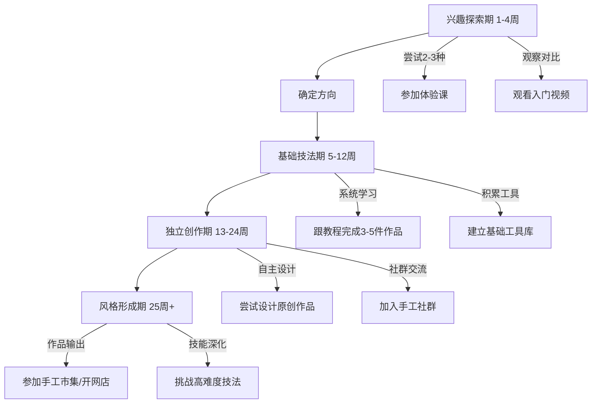

## 四、手工创作方案

### 4.1 手工创作的本质与价值

手工创作是人类最古老的表达方式之一。从石器时代的打制石器到今天的3D打印辅助木工，双手创造实物的行为贯穿了整个人类文明史。在数字化时代，手工创作的价值不仅没有减弱，反而因为"稀缺性"而变得更加珍贵。

**神经科学视角：为什么动手让人快乐**

哈佛大学医学院的研究表明，手工创作能够激活大脑的"默认模式网络"（Default Mode Network, DMN），这个网络与创造力、自我反思和心理修复密切相关。具体机制如下：

- **前额叶皮层激活**：精细手工操作需要高度专注，激活前额叶的执行控制区域，抑制杏仁核的焦虑反应
- **多巴胺奖赏回路**：每完成一个小步骤（如一针缝线、一次打磨），大脑释放微量多巴胺，形成持续的正向反馈
- **皮质醇水平下降**：英国《健康心理学期刊》2016年的研究发现，持续30分钟的手工活动可使皮质醇水平降低约75%
- **心流状态触发**：手工创作天然具备"挑战-技能平衡"特征，极易引发心流体验

**心理治疗应用**

手工创作已被纳入多种心理治疗方案：

| 治疗方式 | 应用手工 | 适用症状 | 临床证据 |
|---------|---------|---------|---------|
| 表达性艺术治疗 | 陶艺、绘画 | 创伤后应激、抑郁症 | APA一级推荐 |
| 职业治疗 | 编织、木工 | 焦虑症、注意力缺陷 | WHO康复指南收录 |
| 正念手工 | 编织、刺绣 | 广泛性焦虑、失眠 | 牛津正念中心验证 |
| 园艺治疗 | 植物手作 | 老年认知退化 | 日本厚生劳动省认可 |

### 4.2 六大手工项目深度指南

#### 4.2.1 木工：从一块木头开始

**核心吸引力**

木工是所有手工项目中"输入-输出反差"最大的——一块粗糙的木料，经过切割、刨削、打磨，变成光滑精致的成品，这种转化过程带来的成就感是其他手工难以比拟的。

**木材基础知识**

入门必须了解的木材分类：

| 类型 | 代表树种 | 特点 | 价格区间 | 适用场景 |
|------|---------|------|---------|---------|
| 软木 | 松木、杉木、樟子松 | 质软易加工，纹理直 | ￥5-15/块 | 入门练习、大型结构件 |
| 硬木 | 橡木、胡桃木、樱桃木 | 质硬耐磨，纹理美观 | ￥30-100/块 | 家具、工艺品 |
| 特殊木 | 竹材、椰壳、树瘤 | 纹理独特，适合装饰 | ￥20-80/块 | 创意作品、装饰品 |

**入门项目详解：切菜板**

切菜板是木工入门的最佳项目，因为它容错率高、实用性强、所需工具少：

1. **选材**：选择纹理紧密的硬木（橡木或胡桃木），尺寸约30×20×3cm，表面无裂纹
2. **划线**：用铅笔和直尺标出切割线，留出2mm余量
3. **切割**：使用手锯沿标记线切割，保持锯条与木面垂直，推拉节奏稳定
4. **刨削**：用刨子将表面刨平，注意刨削方向与木纹一致（顺纹刨削），避免逆纹撕裂
5. **打磨**：依次使用80目→150目→320目→600目砂纸，每换一次砂纸前擦净木屑
6. **上油**：涂抹食品级矿物油或亚麻籽油，每面涂2-3遍，间隔6小时

**安全要点**

木工是所有手工项目中受伤风险最高的，必须遵守以下规则：

- 手指永远远离锯片/凿子切割方向至少10cm
- 使用夹具固定工件，禁止用手握持工件进行切割
- 佩戴护目镜和防尘口罩（木尘是致癌物，国际癌症研究机构IARC列为1类致癌物）
- 工作区域保持通风，使用集尘设备

**工具选购指南**

入门套装不必追求品牌，但以下工具不能省：

- **手锯**：日式双面锯（横切+纵切），约￥50-80
- **刨子**：小手刨（4号），约￥80-150
- **凿子**：6mm、12mm、25mm各一把，约￥30-50/把
- **砂纸**：混合目数套装，约￥20
- **夹具**：快速夹钳2-4个，约￥15-25/个
- **卷尺+直角尺**：约￥30

总预算：￥300-600即可开始。不建议一开始就买电动工具，手工操作能建立对材料的直觉理解。

#### 4.2.2 编织：随身携带的冥想

**钩针与棒针的区别**

| 维度 | 钩针编织 | 棒针编织 |
|------|---------|---------|
| 工具 | 单根钩针 | 两根或多根棒针 |
| 特点 | 花样灵活，立体感强 | 平整均匀，弹性好 |
| 速度 | 中等 | 较慢（平针较快） |
| 拆改 | 容易拆解重来 | 拆解较麻烦 |
| 适合作品 | 玩偶、帽子、包包 | 围巾、毛衣、袜子 |
| 入门难度 | ★★☆ | ★★★ |
| 推荐入门 | 杯垫、小方巾 | 围巾、方块 |

**毛线材质指南**

- ** acrylic腈纶**：便宜耐磨，颜色丰富，适合入门练习（￥5-15/团）
- **羊毛**：保暖弹性好，有轻微扎感，适合冬季衣物（￥20-60/团）
- **棉线**：透气吸汗，适合夏季和婴儿用品（￥10-30/团）
- **混纺线**：综合优点，性价比高（￥15-40/团）

入门建议从腈纶线开始，粗线（5mm以上）比细线更容易出效果。

**钩针入门：杯垫制作流程**

起针→锁针起链→短针环形编织→每圈加针→收针断线。具体操作：

1. **起针**：钩针绕线，钩出一个活结
2. **起链**：钩4个锁针，用引拔针连接成环
3. **第一圈**：环内钩8个短针，引拔针连接
4. **第二圈**：每个短针上钩2个短针（加针），共16针
5. **第三圈**：隔一针加一针，共24针
6. **收尾**：剪线留10cm线尾，穿过最后一个针目拉紧

一个杯垫约需30-60分钟，用线量约15g。

#### 4.2.3 陶艺：与泥土的对话

**陶艺的核心体验**

陶艺的独特之处在于它涉及"不可逆的转化"——泥坯经过800-1300°C的烧制，变成坚硬的陶瓷，这个过程无法撤回。这种不可逆性赋予了每一次创作独特的仪式感。

**三种成型方式**

| 方式 | 难度 | 设备需求 | 特点 | 适合 |
|------|------|---------|------|------|
| 手捏成型 | ★☆☆ | 无（双手即可） | 最原始，自由度最高 | 入门体验、小型器皿 |
| 泥条盘筑 | ★★☆ | 基础工具 | 适合大型器皿 | 花瓶、碗 |
| 拉坯成型 | ★★★ | 电动拉坯机 | 效率高，对称性好 | 批量制作、茶具 |

**手捏成型详细步骤**

1. **揉泥**：将陶土反复揉压排出气泡（至少100次），气泡会导致烧制时炸裂
2. **塑形**：取拳头大小陶土，用拇指从中心按入，逐渐扩大成碗状
3. **修整**：用刮刀修整壁厚（保持均匀3-5mm），太薄会塌，太厚会裂
4. **干燥**：室温阴干3-7天，避免阳光直射和风吹（会导致不均匀收缩开裂）
5. **素烧**：送窑800°C烧制（大部分陶艺工作室提供代烧服务）
6. **上釉**：用釉料涂刷或浸釉，注意底部留出3mm不上釉（防止粘连窑板）
7. **釉烧**：1200-1300°C烧制，釉面熔化形成光滑表面

**费用与时间**

单次体验课：￥100-300（含材料和烧制），时长约2-3小时。如果想持续练习，建议购买工作室的月卡（￥500-1500/月，含不限时使用设备和材料）。

#### 4.2.4 皮具制作：质感与耐用的结合

**皮革基础知识**

入门必须了解的皮革类型：

| 类型 | 特点 | 价格 | 适用 |
|------|------|------|------|
| 植鞣革 | 可塑性强，会随使用产生包浆 | ￥30-80/平方英尺 | 入门首选，长期使用 |
| 铬鞣革 | 柔软，颜色丰富 | ￥20-50/平方英尺 | 服装、软包 |
| 再生革 | 便宜，质感一般 | ￥5-15/平方英尺 | 练习用 |

**入门项目：卡包制作**

卡包只有两片皮+一条缝线，是最适合入门的皮具项目：

1. **裁切**：用裁皮刀沿钢尺裁切两片皮（8×11cm），边缘保持平直
2. **打孔**：用菱斩和木槌在缝线位置打孔，间距3-4mm
3. **缝线**：使用双针缝法（saddle stitch），两根针从同一孔位交替穿过
4. **封边**：用砂纸打磨边缘（400目→800目），涂边油，干燥后再次打磨
5. **上油**：涂抹皮革保养油，用软布抛光

**皮具工具清单**

必备：裁皮刀（￥30-50）、钢尺（￥20）、菱斩套装（￥40-80）、木槌（￥20）、手缝针2根（￥10）、麻线（￥15）、边油（￥15）、砂纸（￥10）。

总预算：￥200-300即可入门。

#### 4.2.5 手账/拼贴：纸上的创意花园

**手账流派**

- **日系手账**：Hobonichi风格，注重排版和胶带装饰，追求精致美观
- **子弹笔记（Bullet Journal）**：Ryder Carroll创立，用符号系统管理任务和笔记，强调效率
- **艺术手账**：自由拼贴、水彩插画、混合媒介，注重个人表达
- **旅行手账**：结合票据、地图、照片，记录旅行记忆

**入门工具清单**

- 手账本：A5活页本（￥30-60），方便增删页面
- 书写工具：黑色中性笔0.5mm + 彩色马克笔套装（￥30-50）
- 装饰工具：基础和纸胶带5-10卷（￥20-40）、贴纸若干（￥15-30）
- 辅助工具：直尺、剪刀、固体胶（￥15）

总预算：￥100-200。

**排版基础原则**

新手最容易犯的错误是"堆砌式排版"——把所有素材都贴上去。正确的做法：

- **留白原则**：页面至少30%留白，给视觉呼吸空间
- **色彩限制**：每页主色不超过3种，避免花哨
- **层次分明**：标题→正文→装饰，主次清晰
- **对齐意识**：文字和素材沿隐形网格排列

#### 4.2.6 模型制作：微观世界的创造者

**模型类型**

| 类型 | 代表品牌 | 入门价格 | 特点 |
|------|---------|---------|------|
| 塑料拼装模型 | 田宫(Tamiya)、长谷川 | ￥50-200 | 品类最全，从军武到高达 |
| 纸模型(Papercraft) | 免费下载图纸 | ￥0-30 | 成本低，精度要求高 |
| 木质拼装 | 若态、乐高 | ￥50-300 | 无需胶水，机械结构 |
| 3D打印模型 | FDM/SLA打印机 | ￥200起 | 数字化设计，个性化强 |

**入门流程（以塑料模型为例）**

1. **选套件**：选择标注"初学者推荐"的套件，零件数50-100个为宜
2. **开盒检查**：对照说明书检查零件是否齐全，用剪钳剪下零件（留1mm水口）
3. **打磨**：用400目砂纸打磨水口和分模线
4. **试组装**：不上胶水先试装，确认所有零件配合良好
5. **上色**：使用喷涂或笔涂（入门推荐笔涂），先涂浅色再涂深色
6. **组装**：使用模型胶水（流缝胶），让胶水沿缝隙渗透粘合
7. **旧化**：进阶步骤，用渍洗液和干扫技法增加岁月感

### 4.3 手工创作通用方法论

#### 4.3.1 学习路径规划

#### 4.3.2 工具投资策略

新手最常见的错误是"先买齐再开始"。正确的做法是**渐进式投资**：

**第一阶段（确认兴趣前）**：只买最低配置，能完成入门项目即可。预算控制在￥200以内。

**第二阶段（坚持3个月后）**：升级核心工具，购买质量更好的主力工具。预算追加￥300-500。

**第三阶段（确定长期坚持）**：添置辅助设备和高端工具。此时你已经知道自己真正需要什么。

**工具品牌推荐原则**

- 木工工具：日系（中西、SHARPAL）性价比高于德系
- 编织工具：可乐(Clover)钩针手感最佳，国产替代品差距不大
- 皮具工具：日本Craft社基础工具质量稳定
- 模型工具：田宫(Tamiya)工具线虽贵但值得，剪钳和流缝胶别省

#### 4.3.3 材料管理与采购

**采购渠道对比**

| 渠道 | 优势 | 劣势 | 适合 |
|------|------|------|------|
| 淘宝/1688 | 价格最低，品类齐全 | 质量参差不齐 | 基础耗材、练习用料 |
| 线下手工店 | 可以触摸材质，现场指导 | 价格偏高 | 初次采购、需要咨询 |
| 品牌官方店 | 质量保证，售后完善 | 价格最高 | 核心工具、贵重材料 |
| 闲鱼/二手 | 价格极低 | 需要辨别 | 入门试水、淘好货 |

**材料存储要点**

- 木材：竖立存放，避免平放变形，远离暖气和阳光
- 毛线：密封袋防虫防潮，放樟脑丸
- 陶土：密封保存，干了可以加水回炼
- 皮革：避光避潮，平放或卷放
- 纸材：竖立存放，避免折痕

### 4.4 手工创作进阶：从爱好到事业

#### 4.4.1 变现路径

手工创作的变现方式已非常成熟：

- **手工市集**：各大城市定期举办，摊位费￥100-500/天，适合测试市场反应
- **电商平台**：淘宝、拼多多、抖音小店，需要投入运营精力
- **定制接单**：通过小红书、朋友圈获客，客单价高但量少
- **教程变现**：在B站、抖音发布制作教程，通过广告和带货变现
- **工作坊授课**：开设线下体验课，单次收费￥100-300/人

**定价公式**

手工制品合理售价 = 材料成本 × 3 + 工时 × 时薪 + 平台费用

时薪建议不低于￥50（手工创作的劳动价值不应被低估）。一个材料成本￥30、耗时2小时的作品，合理售价在￥190-250之间。

#### 4.4.2 社群与资源

**线上社群**

- 小红书：搜索对应手工关键词，关注头部创作者
- B站：大量免费教程，搜索"XX入门教程"
- 豆瓣小组：手工类小组活跃度高，适合交流
- 微信公众号：关注专业手工媒体

**线下资源**

- 木工坊：多数城市有共享木工工作室，按时租用设备（￥50-100/小时）
- 陶艺工作室：提供体验课和长期会员
- 手工市集：既是销售渠道也是社交场所
- 社区大学：部分社区开设免费或低价手工课程

### 4.5 常见误区与解决方案

**误区一：完美主义瘫痪**

表现：迟迟不敢开始，因为"怕做不好"。

解决：接受"第一个作品一定是丑的"。所有手工大师的第一个作品都不堪入目，这是必经之路。给自己设定"丑陋作品目标"——先完成10个丑作品，再谈好不好看。

**误区二：器材发烧**

表现：不断购买新工具和材料，却很少动手。

解决：设定"不动手不买"规则。只有在使用现有工具完成作品后，才能购买新工具。工具是用来用的，不是用来收藏的。

**误区三：只学不做**

表现：看了大量教程视频，却从不动手。

解决：每看完一个教程，必须在24小时内动手尝试。看10个教程不如做1个作品。"看会了"和"做会了"之间有巨大的鸿沟。

**误区四：盲目比较**

表现：看到别人的作品就觉得自己很差，失去动力。

解决：只和过去的自己比较。建立"作品档案"，每月回顾一次，你会发现进步惊人。社交媒体上的作品往往是作者最好的一面，不要拿别人的高光时刻和自己的起步阶段比较。

**误区五：忽视安全**

表现：为了赶进度省略安全措施。

解决：安全永远是第一位的。护目镜、口罩、手套不是可选项。一次受伤可能终结你的手工生涯。建立"开工前安全检查"习惯：检查工具状态→佩戴防护装备→确认工作环境。

### 4.6 手工创作的心理调适

**如何度过瓶颈期**

每个手工爱好者都会遇到瓶颈期——感觉自己没有进步，作品水平停滞不前。这是正常的学习曲线现象，称为"高原期"。

突破方法：

1. **换一种技法**：在同一项目内尝试不同的技法，打破思维定式
2. **临摹大师作品**：通过临摹理解高手的思路和技巧
3. **降低期望值**：给自己放假，做些简单的、纯粹享受过程的小作品
4. **找一个导师**：加入社群，请教有经验的手工爱好者，他们的一句点拨可能胜过自己摸索一个月

**手工创作与时间管理**

"没时间"是最常见的放弃理由。解决方案：

- **碎片化创作**：编织和手账可以在通勤、午休、等车时进行
- **固定创作时段**：每周固定2-3个晚上，每次1-2小时
- **5分钟原则**：告诉自己"只做5分钟"，通常开始后就会继续下去
- **替代屏幕时间**：用手工替代刷手机的时间，既创作又护眼

手工创作的终极目标不是做出完美作品，而是在创造的过程中找到内心的平静与满足。选择一种你感兴趣的手工，从最简单的项目开始，享受双手创造实物的快乐。
