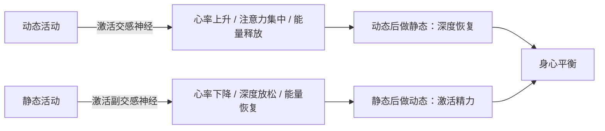
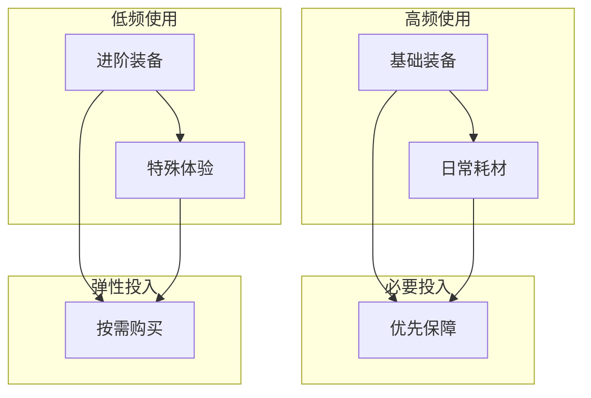

## 五、兴趣组合策略

单一兴趣爱好难以支撑一个人完整的生活需求——身体需要运动，心智需要刺激，情感需要出口，社交需要场景。兴趣组合策略的核心思想是：**将多个兴趣爱好按照科学的维度进行搭配，形成一个互相支撑、协同增效的系统**，而不是随机堆砌一堆互不相关的活动。

一个好的兴趣组合，应该像一支交响乐团——每件乐器各司其职，合在一起比任何单件乐器都更有表现力。

### 5.1 为什么需要组合策略

#### 5.1.1 单一兴趣的局限性

只依赖一种兴趣爱好会面临以下风险：

| 风险类型 | 具体表现 | 示例 |
|---------|---------|------|
| 倦怠风险 | 长期做同一件事导致热情下降 | 连续跑步三年后失去动力 |
| 场景受限 | 受天气、场地、时间限制时无替代 | 下雨天无法户外骑行 |
| 能力单一 | 只发展一种能力维度 | 只做力量训练，柔韧性极差 |
| 社交固化 | 只接触同一类人群 | 只在程序员圈子里活动 |
| 受伤/中断 | 意外中断后生活失去重心 | 脚踝扭伤期间无所事事 |

#### 5.1.2 组合带来的系统效应

心理学家米哈里·契克森米哈赖（Mihaly Csikszentmihalyi）在《心流》一书中指出：人需要多样化的挑战来维持心流状态。单一活动的难度曲线会逐渐变得"无聊"或"焦虑"，而多个活动的难度曲线交错排列，能持续提供最优挑战水平。

兴趣组合的系统效应体现在三个层面：

1. **恢复效应**：一个爱好中的疲劳可以通过另一个爱好中的投入来恢复。跑步后肌肉酸痛时做手工，手部精细操作不需要用到腿部肌群，相当于"换一种方式休息"。
2. **迁移效应**：在一个爱好中习得的技能可以迁移到另一个爱好中。练习瑜伽培养的专注力能提升射击运动的成绩；学习摄影训练的构图感能提升绘画水平。
3. **缓冲效应**：当某个爱好因故中断时（受伤、场地关闭、季节变化），其他爱好可以填补空白，维持生活的充实感和心理韧性。

### 5.2 四大组合维度

选择兴趣组合时，应从以下四个维度进行考量。每个维度代表一种互补关系，合理搭配能覆盖更广泛的生活需求。

#### 5.2.1 互补型组合：室内 × 室外

核心逻辑：**根据场景条件灵活切换，确保任何情况下都有事可做。**

| 分类 | 室内爱好 | 室外爱好 | 组合优势 |
|------|---------|---------|---------|
| 创作类 | 绘画、书法、模型制作 | 摄影、写生、街头速写 | 晴天出门找灵感，雨天在家精修技术 |
| 运动类 | 健身房训练、跳绳、瑜伽 | 跑步、骑行、登山 | 极端天气不中断训练节奏 |
| 认知类 | 阅读、编程、乐器练习 | 观鸟、植物辨识、天文观测 | 理论与实践相互印证 |
| 社交类 | 桌游、烹饪聚会 | 飞盘、野餐、露营 | 全年社交场景不断档 |

**实操建议**：选择一对室内/室外爱好时，确保它们共享某种底层能力。例如"绘画（室内）+ 摄影（室外）"共享视觉审美能力；"健身房力量训练（室内）+ 攀岩（室外）"共享上肢力量。底层能力共享意味着你在任何一个爱好上的进步都能部分迁移到另一个。

#### 5.2.2 动静型组合：动态 × 静态

核心逻辑：**平衡交感神经与副交感神经的激活状态，维持自主神经系统的健康。**



推荐的动静搭配组合：

- **跑步 + 冥想**：跑步释放压力荷尔蒙（皮质醇），冥想降低基础焦虑水平。哈佛医学院研究显示，有氧运动+冥想的组合对焦虑症的改善效果优于单独进行任何一项。
- **HIIT训练 + 瑜伽**：高强度间歇后用瑜伽拉伸放松，同时发展爆发力和柔韧性。这是很多职业运动员的标准恢复方案。
- **篮球 + 围棋**：篮球训练反应速度和团队配合，围棋训练深度计算和全局规划。一动一静，分别锻炼快思考和慢思考系统。
- **游泳 + 阅读**：游泳调动全身大肌群，结束后神经系统处于兴奋状态，此时进行30分钟阅读，专注力会显著提升。

#### 5.2.3 社交型组合：社交 × 独处

核心逻辑：**满足外向与内向两种心理需求，避免社交过载或社交匮乏。**

根据人格心理学家艾森克的理论，每个人的最优唤醒水平不同——外向者需要更多外部刺激来达到最佳状态，内向者则在低刺激环境中表现更好。但即便是高度内向的人也需要一定程度的社交连接，而高度外向的人也需要独处来整合经验。

**组合模板**：

- **社交型爱好**（每周1-2次）：羽毛球、足球、合唱团、烹饪班、志愿者活动
- **独处型爱好**（每周2-3次）：写作、绘画、乐器独练、冥想、园艺
- **弹性型爱好**（可独可群）：摄影、骑行、徒步、阅读（可参加读书会也可以自己读）

实操中的平衡技巧：

1. 在日历上用不同颜色标记社交型和独处型爱好，一目了然地看到比例是否失衡
2. 如果连续两周没有独处型活动，主动安排一次；反之亦然
3. 社交型爱好优先选择有固定时间的（如每周三晚羽毛球），独处型爱好保持灵活性
4. 旅行出差时携带一个独处型爱好（如素描本、Kindle），确保即使脱离日常社交圈也不空虚

#### 5.2.4 节奏型组合：快节奏 × 慢节奏

核心逻辑：**不同节奏的活动交替进行，避免神经系统的单调适应。**

| 节奏类型 | 活动示例 | 激活特点 | 适合时间段 |
|---------|---------|---------|-----------|
| 快节奏 | 拳击、街舞、竞速骑行、FPS游戏 | 短时间高能量爆发，肾上腺素升高 | 精力充沛时、需要释放压力时 |
| 中节奏 | 网球、徒步、摄影扫街、烹饪新菜 | 持续但不过度的能量输出 | 日常晚间、周末上午 |
| 慢节奏 | 书法、钓鱼、园艺、编织、冥想 | 低能量消耗，深度专注 | 睡前、午休后、疲惫时 |

**节奏切换的心理机制**：神经科学家发现，大脑的蓝斑核（locus coeruleus）负责调节觉醒水平。快节奏活动会让蓝斑核高度激活，产生紧张和警觉；慢节奏活动则让蓝斑核回落到基线。两者交替就像给大脑做"有氧+拉伸"，避免长期处于任何一种极端状态。

### 5.3 经典组合方案推荐

以下方案经过实践验证，覆盖不同生活场景。每个方案包含3-5个兴趣爱好，标注了互补关系和时间分配。

#### 方案一：创造力工坊型

适合人群：创意行业从业者、自由职业者、内容创作者

| 爱好 | 定位 | 时间投入 | 互补维度 |
|------|------|---------|---------|
| 摄影 | 视觉表达 + 户外探索 | 周末半天 | 室外 + 社交 |
| 绘画/插画 | 视觉表达 + 精细创作 | 工作日晚1小时 | 室内 + 独处 |
| 旅行采风 | 灵感获取 + 体验积累 | 月度/季度 | 快节奏 |
| 手账/日志 | 记录整理 + 反思复盘 | 每天15分钟 | 慢节奏 + 独处 |

**协同效应**：摄影捕捉的画面成为绘画的参考素材；旅行采风提供摄影和绘画的双重素材；手账记录整个创作链路的灵感和心得。四个爱好形成一个完整的"输入→加工→输出→复盘"循环。

#### 方案二：身心平衡型

适合人群：久坐办公族、高压工作者、追求健康管理的人

| 爱好 | 定位 | 时间投入 | 互补维度 |
|------|------|---------|---------|
| 力量训练 | 体能基础 + 身体成分改善 | 周3次，每次45分钟 | 室内 + 动态 + 快节奏 |
| 跑步/骑行 | 有氧基础 + 户外放松 | 周2次，每次30-60分钟 | 室外 + 动态 + 中节奏 |
| 瑜伽 | 柔韧性 + 正念练习 | 周2次，每次30分钟 | 室内 + 静态 + 慢节奏 |
| 阅读 | 知识获取 + 精神滋养 | 每天30分钟 | 室内 + 静态 + 独处 |

**协同效应**：力量训练和跑步提供体能基础；瑜伽平衡高强度训练带来的肌肉紧张；阅读在身体恢复期填充精神需求。这个组合覆盖了体能、柔韧性、心肺功能和认知发展四个维度。

#### 方案三：社交探索型

适合人群：刚到新城市、社交圈较窄、性格偏内向想拓展社交的人

| 爱好 | 定位 | 时间投入 | 互补维度 |
|------|------|---------|---------|
| 羽毛球/飞盘 | 团队运动 + 社交破冰 | 周1次，1.5小时 | 室外 + 动态 + 社交 |
| 桌游/剧本杀 | 趣味社交 + 深度交流 | 双周1次，2-3小时 | 室内 + 静态 + 社交 |
| 烹饪 | 技能提升 + 聚会载体 | 周末2小时 | 室内 + 中节奏 |
| 吉他/尤克里里 | 才艺展示 + 小型表演 | 周3次，30分钟 | 室内 + 独处/社交弹性 |

**协同效应**：运动类爱好提供高频低深度的社交（认识大量人）；桌游类爱好提供低频高深度的社交（筛选出真朋友）；烹饪提供邀请朋友来家做客的理由；才艺类爱好增加社交场合中的个人魅力。从"认识人"到"成为朋友"到"维持友谊"，形成完整的社交链路。

#### 方案四：终身学习型

适合人群：知识工作者、终身学习者、有学术兴趣的人

| 爱好 | 定位 | 时间投入 | 互补维度 |
|------|------|---------|---------|
| 深度阅读 | 系统性知识输入 | 每天45分钟 | 室内 + 独处 |
| 写作/博客 | 知识输出 + 整理 | 周2次，每次1小时 | 室内 + 独处 + 社交弹性 |
| 编程/数据分析 | 技能实践 + 问题解决 | 周3次，每次1小时 | 室内 + 快节奏 |
| 徒步/散步 | 沉思时间 + 灵感触发 | 周末2小时 | 室外 + 慢节奏 |

**协同效应**：阅读提供写作素材；写作深化阅读理解（费曼学习法的核心）；编程将抽象知识转化为具体项目；徒步散步提供不被打扰的深度思考时间。爱因斯坦、达尔文、尼采等思想家都有长途散步中获得关键灵感的经历。

### 5.4 时间分配的科学方法

#### 5.4.1 基于精力管理的时间分配

时间管理的本质是精力管理。根据精力管理专家吉姆·洛尔（Jim Loehr）的研究，人的精力有四个维度：体能、情绪、注意力、意义感。理想的兴趣时间分配应该平衡这四个维度。

**工作日模板**（可用自由时间约2-3小时）：

```text
06:30-07:00  晨间活动：冥想/拉伸/瑜伽（恢复精力，设定状态）
12:30-13:00  午间活动：散步/听播客（轻度切换，恢复注意力）
18:30-19:15  晚间活动A：运动类（释放一天的压力）
21:30-22:15  晚间活动B：阅读/写作/手工（深度放松，准备睡眠）
```

**周末模板**（可用自由时间约6-10小时）：

```text
周六上午    主力爱好（2-3小时）：需要大块时间的活动，如摄影外出、登山
周六下午    辅助爱好（1-2小时）：配合性活动，如整理照片、修图
周六晚上    社交爱好（2-3小时）：聚餐、桌游、运动比赛
周日上午    休息 + 轻度活动（阅读、园艺）
周日下午    学习型爱好（2小时）：课程、工作坊、新技能练习
周日晚上    复盘 + 计划（30分钟）：记录本周爱好收获，规划下周
```

#### 5.4.2 季节性调整

兴趣组合不是固定不变的，应该随季节、生活阶段和身体状态动态调整：

| 季节 | 调整方向 | 推荐重点 | 原因 |
|------|---------|---------|------|
| 春季 | 逐步增加户外活动 | 徒步、摄影、骑行 | 气温回升，日照增长 |
| 夏季 | 增加水上/傍晚活动 | 游泳、夜跑、露营 | 避免高温时段户外运动 |
| 秋季 | 户外活动的黄金期 | 登山、越野跑、写生 | 温度适宜，景色优美 |
| 冬季 | 偏重室内活动 | 健身房、阅读、手工艺 | 寒冷天气限制户外活动 |

#### 5.4.3 避免过度安排的信号

当出现以下信号时，说明你的兴趣组合需要精简或调整：

- 每周为了完成所有爱好的"计划"而感到焦虑
- 一个爱好已经连续三周没有碰过
- 花在爱好上的时间挤占了必要的休息和社交
- 对所有爱好都感到"还不错"但没有一个让你真正兴奋
- 为爱好购买的装备大量闲置

解决方法：每季度进行一次"兴趣审计"——列出所有爱好，标注过去三个月实际投入的时间和获得的满足感。砍掉满足感最低的1-2项，把时间集中到核心爱好上。

### 5.5 预算管理与装备策略

#### 5.5.1 预算分配原则

建议将月可支配收入的5-10%用于兴趣爱好。这个比例既能保证足够的投入，又不会影响基本生活和储蓄目标。

**预算分配四象限**：



具体分配建议：

| 类别 | 占比 | 包含内容 | 示例 |
|------|------|---------|------|
| 基础装备 | 30% | 核心工具和装备 | 跑鞋、画笔、相机镜头 |
| 学习投入 | 30% | 课程、书籍、工作坊 | 线上课程、专业书籍、大师班 |
| 体验投入 | 20% | 参加活动、比赛、展览 | 马拉松报名费、展览门票、工作坊 |
| 社交投入 | 20% | 社群会费、聚餐、出行 | 俱乐部会费、团建活动、交通费 |

#### 5.5.2 装备采购的"三阶法则"

避免"装备先行"的消费陷阱——还没开始学就买最贵的装备，结果三天后放弃。

**第一阶段：入门期（0-3个月）**
- 选择最基础、最便宜的装备，甚至可以借用或租用
- 跑步：普通运动鞋 + 手机计步
- 绘画：铅笔 + 素描本
- 摄影：手机摄影
- 吉他：二手入门琴（200-500元）
- 目的：验证兴趣的持久性，避免沉没成本

**第二阶段：确认期（3-12个月）**
- 兴趣确认持久后，购买中档装备
- 选择性价比最高的区间，而非最贵的
- 跑步：专业跑鞋（300-600元）
- 绘画：马克笔/水彩套装 + 专业素描纸
- 摄影：入门微单相机
- 吉他：中档面单琴（1000-2000元）
- 目的：提升体验质量，但不追求极致

**第三阶段：深耕期（1年以上）**
- 根据实际需求有针对性地升级装备
- 精准购买真正能提升水平的装备，而非"全套升级"
- 跑步：根据跑姿分析选择针对性跑鞋
- 绘画：购入特定画种的专业材料
- 摄影：根据拍摄题材选择特定焦段镜头
- 目的：用装备匹配技术进步，而非用装备弥补技术不足

### 5.6 兴趣组合的动态演化

#### 5.6.1 生命周期视角

兴趣组合不是一次选定终身不变的。随着年龄、生活阶段、身体状态的变化，组合应该有机演化。

| 生活阶段 | 典型特征 | 组合建议 |
|---------|---------|---------|
| 大学/刚工作（20-25岁） | 时间充裕、体力充沛、预算有限 | 偏重探索型：尝试多种爱好，找到真正热爱的 |
| 职业上升期（25-35岁） | 时间紧张、收入增长、压力大 | 偏重效率型：2-3个核心爱好，强调减压和社交 |
| 稳定期（35-45岁） | 时间相对可控、预算充足 | 偏重深耕型：精简数量，提升质量和深度 |
| 转型期（45岁以上） | 可能有更多自由时间 | 偏重享受型：回归兴趣本身，减少功利目标 |

#### 5.6.2 兴趣的引入与退出机制

**引入新爱好的三步验证法**：

1. **试用期（2-4周）**：用最低成本尝试，租借装备、旁观体验、看入门视频
2. **评估期**：问自己三个问题——做的时候是否感到时间飞逝？不做的时候是否会想去做？遇到困难时是否愿意继续？
3. **正式期**：通过评估后，正式加入兴趣组合，分配固定时间和预算

**退出旧爱好的信号**：

- 连续两个月在日程中被跳过
- 想到要做时的第一反应是"又得去了"而非期待
- 已经达到当初设定的目标，没有新的目标驱动
- 身体条件不再允许（如膝关节问题导致无法长跑）

退出不是失败，是资源的合理重新分配。把退出省下的时间和预算投入到更让你心流充沛的活动中。

### 5.7 常见误区与纠正

#### 误区一："爱好越多越好"

**问题**：同时维持7-8个爱好，每个都是浅尝辄止，没有一个能带来真正的成就感。

**纠正**：根据"10000小时法则"的精神（虽非精确数字，但原理成立），深度来自持续投入。建议核心爱好2-3个，辅助爱好1-2个，总数不超过4-5个。

#### 误区二："必须每天坚持所有爱好"

**问题**：把爱好变成另一套KPI，每天打卡所有项目，稍有遗漏就焦虑。

**纠正**：爱好是给自己充电的，不是消耗意志力的。如果某个爱好在一周中没有被安排到，那可能只是因为这一周有更需要做的事情。灵活调整远比死板坚持更重要。

#### 误区三："别人推荐的组合一定适合我"

**问题**：照搬别人的兴趣组合方案，忽略了个体差异。

**纠正**：性格类型、身体条件、经济状况、生活环境都不同。内向者可能不需要那么多社交型爱好，膝盖不好的人可能需要减少跑步类活动。组合方案是参考，不是教条。

#### 误区四："装备越贵，爱好体验越好"

**问题**：花大量预算购买顶级装备，却没有在技能提升上投入足够时间。

**纠正**：专业选手和业余爱好者之间的差距在技术，不在装备。职业摄影师用手机也能拍出震撼作品，而业余爱好者拿着顶级相机也未必能拍出好照片。先提升技术，再升级装备。

#### 误区五："爱好就是浪费时间，应该全部用来学习和工作"

**问题**：把所有时间都投入工作和"有用"的学习，忽略兴趣爱好。

**纠正**：Google著名的"20%时间"政策允许员工用20%工作时间做自己感兴趣的项目，结果产生了Gmail、Google News等划时代产品。研究表明，适度的非功利性活动能提升工作中的创造力和问题解决能力。爱好不是浪费时间，是对认知资源的投资。

### 5.8 兴趣组合自检清单

定期（每季度）用以下清单评估你的兴趣组合健康度：

```text
□ 我的兴趣组合覆盖了室内和室外两种场景
□ 我的兴趣组合包含了动态和静态两种活动
□ 我的兴趣组合兼顾了社交和独处两种需求
□ 我的兴趣组合有快节奏和慢节奏的交替
□ 每个兴趣都有明确的定位和作用
□ 兴趣总数在3-5个之间，没有过度分散
□ 过去一个月，每个兴趣至少被安排了2次
□ 兴趣支出在预算范围内，没有过度消费
□ 我对至少一个兴趣有明确的进阶目标
□ 当某个兴趣无法进行时，有替代活动可以切换
```

如果8项以上为"是"——你的兴趣组合非常健康。

如果5-7项为"是"——基本健康，针对未达标项做微调即可。

如果5项以下为"是"——需要重新审视兴趣组合，参考本章方案进行重构。

***

