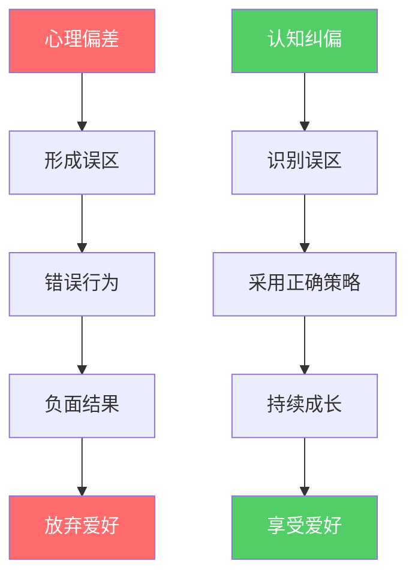
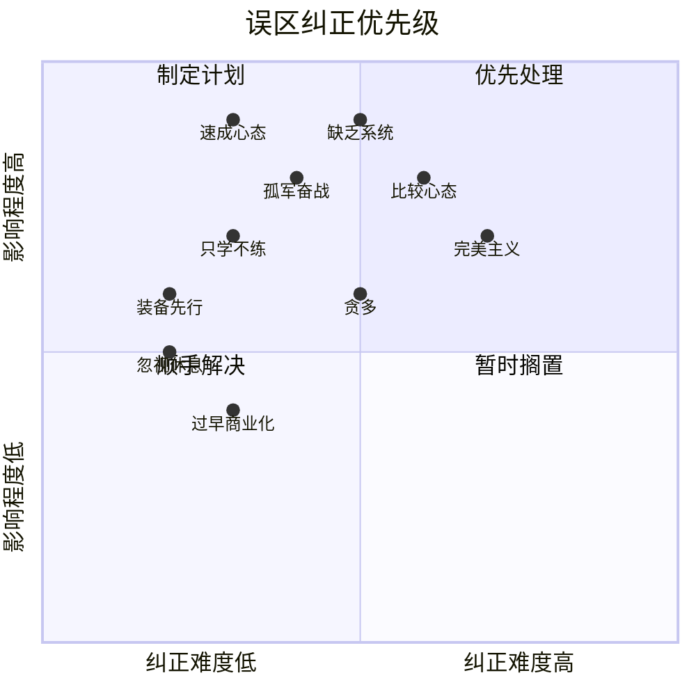

## 六、常见误区与解决方案

培养兴趣爱好的路上，有一些思维陷阱几乎人人都会踩。它们看似合理，甚至被当作"常识"广泛传播，却在不知不觉中消磨热情、浪费资源、阻碍成长。本节系统梳理兴趣培养中最常见的十大误区，逐一拆解其背后的心理机制，并给出可执行的纠正方案。

### 6.1 误区诊断：为什么我们会掉进陷阱

在逐一分析误区之前，先理解一个底层规律——大部分兴趣培养的误区都源自同几种心理偏差：

| 心理偏差 | 典型表现 | 在兴趣培养中的危害 |
|----------|----------|-------------------|
| 即时满足偏差 | 期望快速见效，缺乏耐心 | 速成心态、过早放弃 |
| 沉没成本谬误 | 已经投入了就硬撑下去 | 在错误爱好上浪费时间 |
| 光环效应 | 装备好=水平高 | 装备先行、忽视基本功 |
| 社会比较偏差 | 总和高手比 | 比较心态、自我否定 |
| 全有或全无思维 | 不完美就是失败 | 完美主义、不敢动手 |
| 确认偏差 | 只看到支持自己判断的信息 | 固守错误方法不愿调整 |
| 从众效应 | 别人都在做所以我也做 | 选择不适合自己的爱好 |

识别这些偏差的存在，是纠正误区的第一步。下面逐一展开。

### 6.2 误区一：追求"速成"

**典型想法**："一个月学会吉他""21天成为摄影大师""速成书法班"

**现实情况**：这是兴趣培养中最普遍也最致命的误区。市面上大量"速成班""速成课"迎合了人们的即时满足心理，但任何需要肌肉记忆、审美积累或深度认知的技能，都不可能在短期内速成。

心理学家安德斯·埃里克森在《刻意练习》中提出了著名的"一万小时法则"——虽然具体时长因人而异、因领域而异，但核心结论是确定的：高水平技能需要长时间的高质量练习。即使是所谓的"天才"，背后也有大量不为人知的持续投入。

**速成心态的具体危害**：

1. **期望落差导致挫败**：当一个月后发现自己远未达到预期水平时，挫败感会迅速击溃热情。心理学中的"期望-现实差距理论"表明，期望越高，未达成时的负面情绪越强烈。
2. **忽视基础打牢**：急于求成会让人跳过基础阶段，直接挑战高难度内容。就像盖楼不打地基，越往上越容易坍塌。许多吉他学习者跳过基本指法练习直接学弹唱，结果弹什么都走调。
3. **形成浅尝辄止的习惯**：如果每个爱好都追求速成，最终会变成"什么都会一点，什么都不精通"的状态，无法从任何爱好中获得深层满足感。
4. **被"速成课程"收割**：大量商业课程打着"速成"旗号收取高额费用，实际提供的只是入门级内容，真正的精进仍需要漫长的自学过程。

**纠正方案**：

- **重新定义成功标准**：不以"达到某个水平"为目标，而以"每次练习比上次好一点"为目标。用过程导向替代结果导向。
- **设置合理的时间预期**：一个业余爱好从入门到能够自得其乐，通常需要3-6个月；从入门到小有水平，通常需要1-2年。提前了解这个规律，就不会在第三周产生挫败感。
- **享受过程中的"小确幸"**：学会一首简单曲子、拍出一张满意的照片、完成一个手工作品——这些阶段性成果本身就是快乐的来源，不必等到"成为大师"才允许自己享受。
- **记录成长轨迹**：每月录一段弹琴视频、拍一组对比照片、保存手工作品。当你觉得"没有进步"时，翻出三个月前的记录对比，进步往往比你感觉的要明显得多。

### 6.3 误区二：装备先行

**典型想法**："工欲善其事必先利其器""好装备才能出好作品"

**现实情况**：这是商家最乐于推广的误区，也是新手最容易踩的坑。人们在开始一个爱好之前，先花大量金钱购买高端装备——入门摄影就买全画幅相机，学吉他就买上万元的琴，玩烘焙就买全套进口设备——结果发现并不喜欢这个爱好，或者用不上这些设备的高端功能，造成严重浪费。

**装备先行的心理根源**：

1. **用消费替代行动**：购买装备能带来即时的满足感和"已经开始"的错觉，但实际上你只是在做准备工作，真正的学习还没有开始。心理学家称之为"准备谬误"（Preparation Fallacy）——过度准备是拖延症的一种伪装形式。
2. **对"专业感"的渴望**：高端装备能给人一种"我很认真""我很专业"的心理暗示，但真正的专业性体现在技能上，而不是装备上。
3. **信息不对称**：新手缺乏判断装备实际需求的能力，容易被营销话术和"专业人士推荐"误导。

**装备选择的正确策略**：

**阶段化升级法**：

| 阶段 | 投入原则 | 摄影示例 | 音乐示例 |
|------|----------|----------|----------|
| 体验期（1-2周） | 零成本或极低成本 | 手机拍摄 | 用APP学乐理 |
| 入门期（1-3月） | 最低可用装备 | 入门微单/二手单反 | 入门练习琴 |
| 确定期（3-6月） | 中端装备 | 中端镜头1-2支 | 中档乐器 |
| 精进期（6月+） | 按需逐步升级 | 根据拍摄方向选配 | 根据演奏风格升级 |

**具体原则**：

- **入门装备够用就好**：入门阶段的瓶颈是技能，不是装备。一个用手机拍出好照片的人，比一个拿着顶级相机只会按快门的人更值得敬佩。
- **先借后买**：很多爱好都有装备租借渠道。相机可以租、乐器可以借、运动装备可以试用。先用租赁装备体验，确定喜欢后再购买。
- **买二手入门**：二手市场的入门装备性价比极高，用完不喜欢转手卖掉损失很小。闲鱼、转转等平台有大量准新装备。
- **警惕"装备升级焦虑"**：当你觉得"如果我有XX设备就能拍得更好"时，大概率是技能不够而不是装备不行。用当前装备把技能推到极限，你自然会知道真正需要升级什么。

### 6.4 误区三：比较心态

**典型想法**："别人学了三个月就能弹这么好，我是不是没天赋""看看人家的作品，我的简直不能看"

**现实情况**：社会比较是人类的基本心理倾向，但在兴趣培养中，不恰当的比较是热情的头号杀手。人们倾向于用自己的"幕后花絮"和别人的"精彩集锦"做对比——你看到的是别人精心挑选发布的作品，看不到的是他们背后数十次的失败尝试。

**比较心态的深层危害**：

1. **选择性比较**：人们总是不自觉地和比自己强的人比较，而不是和平均水平比较。当你觉得自己"很差"时，很可能只是在和领域内的顶尖高手做对比。
2. **忽视起点差异**：每个人的学习起点不同。一个从小学过钢琴的人转学吉他，上手速度自然比从零开始的音乐小白快。用别人的速度衡量自己是不公平的。
3. **将比较转化为自我否定**："他比我好"逐渐滑坡成"我不行""我没有天赋""我不适合做这个"。这种归因方式是固定型思维的典型表现（参考卡罗尔·德韦克《终身成长》）。
4. **比较导致动作变形**：为了"追上别人"而急躁冒进，跳过基础、忽略节奏，最终反而学得更慢、更不扎实。

**纠正方案**：

- **只和过去的自己比较**：建立个人成长档案。每月记录自己的水平——录一段弹琴视频、写一篇作品评价、保存运动数据。当你觉得"没有进步"时，翻出半年前的记录对比。
- **理解"幸存者偏差"**：你在社交媒体上看到的优秀作品，是经过算法筛选的"最优秀"样本。那些和你水平相当甚至不如你的人，不会被推送到你面前。你以为"别人都很厉害"，其实只是"厉害的人更容易被你看到"。
- **将比较转化为学习素材**：与其说"他比我好"，不如分析"他好在哪里""我怎么才能做到那样"。把比较对象从"竞争对手"转化为"免费教练"。
- **限制社交媒体暴露时间**：如果浏览社群和作品展示让你焦虑而不是激励，适当减少暴露时间。每周集中浏览一次比每天刷更有益。

### 6.5 误区四：完美主义

**典型想法**："这首曲子没练到完美就不表演""这张照片不够好不能发""做不好不如不做"

**现实情况**：完美主义看似是高标准，实际上是恐惧的伪装。心理学研究将完美主义分为两种：**适应性完美主义**（追求卓越但能接受不完美）和**不适应性完美主义**（无法容忍任何瑕疵）。后者是兴趣培养的隐形杀手。

**完美主义的具体表现和危害**：

- **拖延启动**："等我准备好了再开始"——但"准备好"的那一天永远不会来。写歌的人永远觉得灵感不够，画画的人永远觉得技法不行。
- **反复修改无法完成**：一首曲子练了三个月还在抠细节，一张照片修了二十遍还是不满意。最终不是作品被完善，而是热情被耗尽。
- **害怕展示和分享**：觉得自己的作品"还不够好"不敢发给别人看，因此失去反馈和社交支持。
- **选择高难度以逃避评价**：故意选择超出能力范围的挑战，失败后可以归咎于"题目太难"而不是"我能力不行"——这是一种自我保护机制，但阻碍了真正的成长。

**纠正方案**：

- **接受"完成比完美更重要"的理念**：一个完成了的80分作品，比一个永远停在95分半成品有价值得多。完成本身就是一种能力。
- **设定"足够好"的标准**：在开始练习前明确"今天的目标是什么"，达到目标就停下来，而不是无休止地追求更好。比如"这首曲子流畅弹完就算完成"，而不是"每个音符都完美"。
- **采用"最小可展示作品"策略**：每次创作/练习产出一个可以分享的最小版本。先发出去获得反馈，再根据反馈迭代改进。这就是软件开发中"敏捷迭代"的思想在兴趣培养中的应用。
- **刻意练习"不完美"**：给自己安排一些"允许做得不好"的练习。比如用左手画一幅画（大多数人左手画画都很差），接受结果的粗糙，感受"做得不好但做完了"的体验。

### 6.6 误区五：孤军奋战

**典型想法**："我自己练就行了""加群太浪费时间""不好意思展示自己的作品"

**现实情况**：独自学习在初期或许可行，但缺乏外部反馈和支持系统，学习效率会急剧下降。社会心理学研究反复证明：有学习社群支持的人，坚持学习的可能性比独自学习的人高出65%，学习效率高出40%以上。

**孤军奋战的具体问题**：

1. **错误动作无人纠正**：弹琴的手型错误、运动的姿势不标准、绘画的透视有问题——这些在独自练习中很难自我发现，一旦形成习惯就极难纠正。所谓"练得越久错得越深"。
2. **缺乏即时反馈**：不知道自己做得对不对、好不好，练习变成盲人摸象。反馈是学习的导航系统——没有反馈的练习如同没有GPS的夜航。
3. **动力来源单一**：完全靠自律维持练习，一旦遇到低谷期或外部压力，很容易中断。社群提供的社交支持、同伴激励、适度的"社交压力"都是重要的动力补充。
4. **视野局限**：只看自己的作品容易陷入信息茧房，不知道这个领域还有哪些可能性、其他人在做什么、有哪些新的方法和工具。
5. **错过合作机会**：很多爱好在合作中才能体验到真正的乐趣——乐队合奏、摄影约拍、运动对抗、手工协作。

**纠正方案**：

- **找到合适的社群**：线下社群（兴趣班、俱乐部、工作室）优于线上社群，因为有面对面的互动和更强的社交连接。线上社群（豆瓣小组、微信群、Reddit社区）作为补充。选择社群的标准：活跃度高、氛围友善、有定期活动。
- **找一个学习伙伴**：一个水平相近、进度相似的学习伙伴，可以互相督促、互相反馈、互相激励。比加入一个大社群更有效。
- **定期展示作品**：哪怕是小范围的——在社群发一张照片、在朋友面前弹一段曲子、把手工成品送给家人。展示本身就是一种激励，他人的正面反馈会强化你的学习动机。
- **接受反馈的心态**：把负面反馈视为"免费的教练建议"而不是"人身攻击"。学会区分"对作品的评价"和"对人的评价"——前者是有价值的信息，后者可以忽略。

### 6.7 误区六：贪多嚼不烂

**典型想法**："我想学吉他、摄影、烘焙、攀岩、书法……""这么多爱好都好有趣"

**现实情况**：兴趣广泛本身是好事，但如果同时开始太多爱好，时间和精力会被严重分散，导致每个爱好都停留在浅层，无法获得深层的满足感和成就感。认知心理学中的"注意力资源有限理论"指出，人的注意力和意志力是有限资源，同时分配给过多任务会导致每个任务的质量下降。

**同时进行多个爱好的问题**：

1. **练习时间碎片化**：如果每周有10小时用于爱好，同时进行5个爱好，每个只有2小时。但如果集中在2个爱好上，每个有5小时。后者的进步速度远非"2.5倍"那么简单——因为深度学习需要连续的大块时间，碎片化的练习效果会大打折扣。
2. **无法进入"心流"状态**：心理学家米哈里·契克森米哈赖提出的"心流"状态——完全沉浸于活动中、忘记时间流逝的最佳体验——通常需要至少20-30分钟的连续专注才能进入。频繁切换爱好会阻碍心流的产生。
3. **每个爱好都无法突破瓶颈期**：突破高原期需要持续、集中的投入。同时进行多个爱好，精力被分散，每个爱好都可能卡在瓶颈期无法突破，产生"什么都做不好"的挫败感。

**纠正方案**：

- **采用"2+1"策略**：主力爱好不超过2个，每周投入时间各占总时间的40%以上；辅助爱好1个，作为调剂和休息。这个结构既保证深度又避免单调。
- **兴趣组合的科学配对**：选择互补的爱好组合。比如需要高度专注的（编程、书法）搭配需要身体活动的（跑步、攀岩）；室内的搭配户外的；个人的搭配社交的。这能保证身心的全面调节。
- **设定爱好"试用期"**：对新兴趣保持开放，但给自己设定一个"试用期"——比如2周。2周内集中体验，之后决定是纳入长期计划还是暂时搁置。避免冲动式地开始新爱好。
- **允许爱好轮换**：不是所有爱好都需要持续进行。有些爱好可以季节性安排——夏天游泳冬天滑雪，雨天室内画画晴天户外摄影。合理的轮换既避免单调又保证每个爱好都有足够的投入。

### 6.8 误区七：只学不练

**典型想法**："我先把教程看完再动手""先学好理论再实践""看会了就是会了"

**现实情况**：这是"准备谬误"的另一个变体。大量时间花在看教程、读攻略、收藏资料上，真正动手的时间却很少。学习理论中有一个经典的"学习金字塔"模型：听讲只能记住5%的内容，阅读记住10%，而实践练习能记住75%，教授他人能记住90%。

**"只学不练"的典型表现**：

- **教程收藏家**：收藏了200个摄影教程但从未完整练习过一个
- **设备研究专家**：能说出每款相机的参数对比但没拍过一组满意的照片
- **理论大师**：能讨论音乐理论头头是道但弹不出一首完整的曲子
- **资料囤积者**：下载了无数学习资料但打开过的不到十分之一

**纠正方案**：

- **70/30法则**：70%的时间用于实际练习和创作，30%用于理论学习和观摩。对于实操性强的爱好（运动、手工），比例应该更高到80/20。
- **"学一点练一点"原则**：每看完一个教程或章节，立刻动手练习。不要"先看完再练"——学到的理论在24小时内不用就会遗忘大半（艾宾浩斯遗忘曲线）。
- **限制资料收集**：给自己设定"资料上限"——同时在学习的教程不超过3个，收藏夹定期清理。与其收集100个教程不如把1个教程反复练透。
- **以产出为驱动**：给自己设定"必须产出"的任务——每周拍一组照片、每月弹一首新曲子、每季度完成一个手工项目。有产出目标在，自然会驱动你去学需要的理论。

### 6.9 误区八：忽视休息和恢复

**典型想法**："每天都要练""休息就是偷懒""我不能断"

**现实情况**：持续高强度练习不仅不高效，还可能导致身心疲劳甚至伤病。神经科学研究表明，技能的巩固主要发生在休息期间——特别是在睡眠中，大脑会将白天学到的技能进行"离线处理"，强化神经连接，淘汰无关信息。这就是为什么"睡一觉起来突然就会了"是真实存在的现象。

**忽视休息的代价**：

1. **过度训练综合征**：运动类爱好中最常见。表现为持续疲劳、成绩下降、情绪低落、免疫力下降。严重的会导致肌腱炎、应力性骨折等伤病。
2. **心理倦怠**：对原本热爱的活动失去兴趣，甚至产生厌恶感。心理学中称为"职业倦怠"（Burnout），在爱好中同样会发生。
3. **技能退化**：听起来矛盾，但过度练习确实可能导致技能退化。当大脑和身体处于疲劳状态时，练习质量下降，错误动作被强化，形成"越练越差"的恶性循环。

**纠正方案**：

- **遵循"练二休一"节奏**：连续高强度练习两天后安排一天轻量或休息。这不是偷懒，而是科学的训练周期化。
- **区分"主动休息"和"被动休息"**：主动休息是用低强度活动替代高强度练习——比如用慢练替代快练、用临摹替代创作、用欣赏作品替代动手实践。主动休息比完全不练更能维持手感和兴趣。
- **重视睡眠**：保证7-8小时充足睡眠。学习新技能后的睡眠质量直接影响技能巩固效果。如果你在学新东西，宁可少练半小时也要多睡半小时。
- **定期"完全脱离"**：每隔1-2个月安排一个"兴趣假期"——一周完全不做这个爱好。回来后往往会发现精力充沛、视野开阔、甚至有新的灵感。

### 6.10 误区九：忽视系统性

**典型想法**："想学什么就学什么""跟着感觉走""随机练习"

**现实情况**：没有系统规划的练习，进步会非常缓慢甚至停滞。刻意练习理论的核心观点之一就是：高质量的练习必须是有结构、有计划、有目标的。"随心所欲"的练习虽然舒适，但往往是在舒适区里重复已会的内容，很少触及薄弱环节。

**缺乏系统性的表现**：

- 每次练习不知道练什么，随机弹几首曲子就算完成
- 从不回顾上次练了什么、下次该重点练什么
- 遇到困难的部分就跳过，只练自己已经会的
- 没有阶段性目标，不知道自己处于什么水平

**纠正方案**：

- **制定学习路线图**：参考本章前面各小节提供的各领域学习方案，制定从入门到进阶的系统路线。不需要一步到位，但需要一个大致方向。
- **每次练习前花5分钟规划**：今天重点练什么？上次遗留了什么问题？这次练习的"成功标准"是什么？
- **练习日志**：用手机备忘录或专门的APP记录每次练习的内容、时长、感受和发现。每周回顾一次，识别薄弱环节并安排专项训练。
- **阶段性评估**：每个月给自己做一次"水平评估"——录音/录像/作品对比，明确进步了什么、还缺什么，据此调整下月计划。

### 6.11 误区十：过早商业化

**典型想法**："学会了就能变现""副业赚钱""先学技能再开工作室"

**现实情况**：把爱好和赚钱挂钩，可能从根本上改变你对这个爱好的心理体验。心理学中的"过度理由效应"（Overjustification Effect）表明：当外部奖励（金钱）被引入一个原本由内在动机驱动的活动时，内在动机会被削弱。简单说就是——一旦开始为钱做这件事，你可能就不那么喜欢做这件事了。

**过早商业化的危害**：

1. **兴趣变压力**：当爱好变成"必须完成的工作"，愉悦感会迅速消退。很多把爱好做成副业的人反馈"现在反而不想做了"。
2. **市场导向扭曲创作**：为了迎合市场和客户，偏离自己真正想做的方向。最终发现做的不是自己喜欢的事，而是市场需要的事。
3. **评价体系改变**：从"我做得开心吗"变成"客户满意吗""卖得出去吗"。当金钱成为衡量标准，创作的自由和乐趣就会被压缩。
4. **过早的商业化焦虑**：技能还不成熟就开始担心"怎么变现""怎么涨粉"，本该用来提升技能的精力被分散到营销和运营上。

**纠正方案**：

- **先纯粹后商业化**：至少在爱好上投入500小时以上（大约1-2年的业余时间），达到中等以上水平后，再考虑是否商业化。这时候你对这个领域的理解已经足够深，能做出理性的判断。
- **保留"纯玩"时间**：即使开始商业化，也要保留一部分时间"纯粹为了快乐"而做。比如摄影师每周留一天只拍自己想拍的，不接商业单。
- **区分"分享"和"变现"**：在社群里分享作品、在社交媒体上发布是好的——这能获得反馈和成就感。但不要把分享变成"涨粉""引流"的工具，那样分享本身就失去了乐趣。

### 6.12 误区自检清单

以下清单帮助你快速识别自己正在犯哪些误区。诚实地对照每一项，如果符合就打勾：

| 序号 | 误区 | 自检问题 | 是否中招 |
|------|------|----------|----------|
| 1 | 速成心态 | 是否期望1-3个月内达到较高水平？ | □ |
| 2 | 装备先行 | 在爱好的装备上花费是否超过了学习时间的价值？ | □ |
| 3 | 比较心态 | 浏览别人作品后是否经常感到沮丧？ | □ |
| 4 | 完美主义 | 是否有作品因为"不够完美"而从未完成或展示？ | □ |
| 5 | 孤军奋战 | 是否没有任何学习社群或练习伙伴？ | □ |
| 6 | 贪多嚼不烂 | 是否同时在进行3个以上的爱好？ | □ |
| 7 | 只学不练 | 看教程的时间是否超过动手练习的时间？ | □ |
| 8 | 忽视休息 | 是否连续一周以上没有休息日？ | □ |
| 9 | 缺乏系统 | 是否没有练习计划或学习路线？ | □ |
| 10 | 过早商业化 | 是否在技能尚浅时就开始焦虑变现问题？ | □ |

如果中招3项以上，说明你的爱好培养方式存在系统性问题，需要根据上述方案进行调整。不需要一次性全部纠正——选择影响最大的1-2项优先改进，稳定后再处理其他。

### 6.13 误区纠正的优先级矩阵

不同的误区影响程度不同，纠正难度也不同。以下矩阵帮你决定从哪里开始：

**优先级建议**：

1. **第一优先级**（高影响 + 易纠正）：速成心态、装备先行——改变认知即可立即生效
2. **第二优先级**（高影响 + 需持续努力）：比较心态、缺乏系统性、孤军奋战——需要建立新习惯
3. **第三优先级**（中等影响）：完美主义、只学不练、贪多——需要行为调整
4. **第四优先级**（低影响或需等待时机）：忽视休息、过早商业化——前者容易纠正，后者在技能不成熟时暂时不需要担心

### 6.14 从误区到正轨：一个完整的纠偏流程

如果你发现自己深陷多个误区，以下是一个系统化的纠偏流程：

**第一步：暂停与反思（1天）**
暂停当前的练习节奏，花一天时间诚实评估：我在犯哪些误区？它们对我的影响有多大？我最想改变什么？

**第二步：制定微调计划（1天）**
针对最重要的1-2个误区，制定具体、可执行的微调计划。不要试图一次性改变所有——"小步迭代"比"大刀阔斧"更容易坚持。

**第三步：执行21天（3周）**
心理学研究表明，形成一个新习惯平均需要21天（虽然这个数字因人而异，但3周是一个合理的起步目标）。在这3周内，专注于纠正选定的误区，其他暂时放一放。

**第四步：评估与调整（1天）**
3周后回顾：误区是否得到改善？遇到了什么新问题？需要进一步调整什么？然后开始下一轮纠偏。

**第五步：长期维持**
误区纠正不是一次性的，而是需要长期维护。定期（每月一次）对照误区清单自查，确保不走回头路。

> 兴趣爱好的路上没有"完美路径"，每个人都会犯错。关键不是从不犯错，而是能够识别错误、及时纠正、持续调整。正如管理学大师彼得·德鲁克所说："效率是把事情做对，效能是做对的事情。"在兴趣培养中，避免误区就是"做对的事情"，而具体的练习方法是"把事情做对"——前者是后者的前提。
