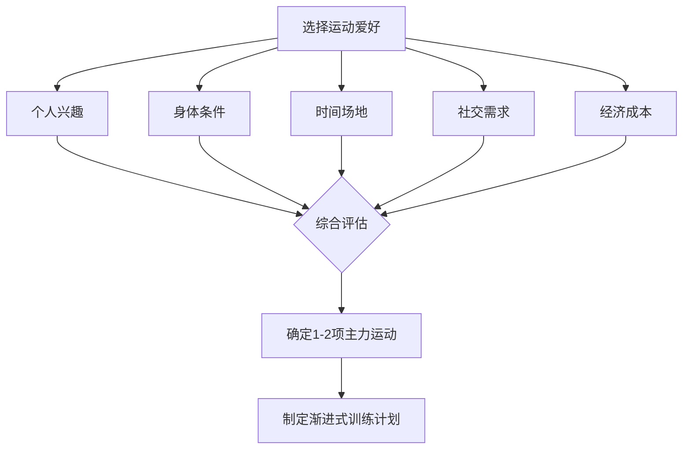

## 本节小结

本节围绕"具体方案"这一核心命题，系统展开了四大兴趣领域的完整入门路径——摄影、音乐、运动、手工创作，辅以科学的兴趣组合策略和常见误区分析。在进入下一节的装备推荐之前，有必要对本节的知识体系做一次全面的回顾与提炼，帮助你将零散的知识点串联成一个可执行的行动框架。

### 回顾：四大兴趣领域的核心要点

#### 摄影：从"看见"到"表达"

摄影是本节介绍的第一个兴趣领域，也是门槛最低、回报最快的入门选择。它的核心价值不仅在于"拍出好看的照片"，更在于训练一种**主动观察**的能力——你开始注意光线穿过树叶的形状，雨水在玻璃上留下的纹理，城市天际线在黄昏时分的色彩渐变。

**入门路径的关键节点**：

| 阶段 | 时间 | 核心目标 | 关键练习 |
|------|------|---------|---------|
| 手机摄影入门 | 第1-4周 | 掌握构图法则和光线运用 | 每日一拍，九宫格构图练习 |
| 相机基础操作 | 第5-12周 | 理解曝光三角，掌握手动模式 | M档练习，同一场景不同参数对比 |
| 主题拍摄实践 | 第13-20周 | 针对特定题材建立拍摄方法论 | 选定一个题材深耕（人像/街拍/风光） |
| 风格探索与后期 | 第21-26周 | 建立个人视觉语言 | 学习Lightroom/Snapseed，形成调色风格 |

**最容易被忽视的三个要点**：

1. **构图比器材重要一万倍**。一张用手机拍摄、构图精妙的照片，远胜于用顶级相机随手拍的"到此一游"。三分法、引导线、框架构图、留白——这六种核心构图法则是每个摄影师的底层能力。
2. **光线是摄影的灵魂**。同一场景在不同光线条件下可以呈现完全不同的面貌。清晨和黄昏的"黄金时刻"提供了最优质的自然光，而阴天的柔光则适合人像拍摄。
3. **减法思维是构图的最高原则**。画面中每一个不为主题服务的元素都应该被排除。初学者最常犯的错误就是把画面塞得太满。

#### 音乐：用声音连接内心

音乐学习的价值超越了"会演奏一种乐器"本身。神经科学研究证实，音乐训练能够增加大脑灰质体积，同时提升记忆力、注意力、协调能力和语言能力。它是一种**全方位的认知训练**。

**乐器选择的核心逻辑**：不存在"最好的乐器"，只有"最适合你的乐器"。选择时应综合考量三个因素——你喜欢听什么音乐（兴趣驱动）、你能投入多少时间练习（现实约束）、你的预算范围（经济约束）。

| 乐器 | 入门难度 | 便携性 | 预算区间 | 最适合 |
|------|---------|--------|---------|--------|
| 尤克里里 | ★☆☆ | 极佳 | ￥200-500 | 零基础、想要快速上手 |
| 吉他 | ★★☆ | 良好 | ￥500-1500 | 喜欢流行/民谣/摇滚 |
| 口琴 | ★☆☆ | 极佳 | ￥100-300 | 喜欢蓝调/民谣 |
| 钢琴/电子琴 | ★★☆ | 较差 | ￥1500-3000 | 对古典/流行音乐感兴趣 |
| 架子鼓 | ★★★ | 差 | ￥2000-5000 | 需要释放压力 |

**练习方法的四个核心原则**：

- **慢练优先**：初学任何曲目，以极慢的速度确保每个音符正确，速度可以逐渐加快，但准确性永远排第一位
- **分段攻克**：将曲目拆分为小段，逐段熟练后再串联，重点突破难点段落
- **节拍器为伴**：从慢速开始，用节拍器培养稳定的内在节奏感
- **录音回听**：定期录下自己的演奏，回听时能发现练习中注意不到的问题

#### 运动：身体是一切的根基

运动类爱好的独特价值在于它**同时作用于身体和心理**。《柳叶刀·精神病学》的大规模研究证实，运动型爱好者心理健康问题发生率比不运动者低22.3%。更重要的是，运动带来的内啡肽释放、心肺功能提升、睡眠质量改善是其他任何爱好都无法替代的。

**运动选择的五维评估模型**：



**六种推荐运动的快速对比**：

| 运动 | 入门门槛 | 社交属性 | 关节友好度 | 月均预算 |
|------|---------|---------|-----------|---------|
| 跑步 | 极低 | 中 | 中 | ￥100-300 |
| 游泳 | 中 | 低 | 极高 | ￥200-500 |
| 瑜伽 | 低 | 中 | 高 | ￥0-500 |
| 骑行 | 中 | 高 | 高 | ￥100-300 |
| 羽毛球/乒乓球 | 低 | 高 | 中 | ￥100-300 |
| 登山徒步 | 中 | 中 | 中 | ￥500-2000（初始） |

**训练计划制定的黄金法则**：每周运动量增加不超过10%，给身体足够的适应时间。前四周的目标不是提升体能，而是**建立运动习惯**——固定时间段、低强度、重在坚持。

#### 手工创作：数字化时代的"反叛"

手工创作是本节中最具"反数字化"色彩的兴趣领域。它的核心价值在于三点：**触觉反馈**（数字化世界无法提供的物理体验）、**不可逆的专注**（手工操作中的每一步都有后果，迫使你全神贯注）、**具象的成就感**（完成一件实物作品的满足感远超虚拟世界的成就）。

**四大手工项目的定位差异**：

| 项目 | 核心体验 | 入门预算 | 学习曲线 | 危险性 |
|------|---------|---------|---------|--------|
| 木工 | 输入-输出反差最大 | ￥300-600 | 中等 | 较高（刀具/锯具） |
| 编织 | 随身携带的冥想 | ￥50-150 | 平缓 | 极低 |
| 陶艺 | 与泥土的对话 | ￥200-500（体验课） | 陡峭（拉坯） | 低 |
| 手账/拼贴 | 视觉叙事 | ￥100-300 | 平缓 | 极低 |

**神经科学背书**：哈佛大学医学院研究表明，手工创作能激活大脑的"默认模式网络"（DMN），与创造力和心理修复密切相关。持续30分钟的手工活动可使皮质醇水平降低约75%——这个效果堪比中等强度的冥想。

### 提炼：兴趣组合的系统思维

本节第五部分介绍的兴趣组合策略是很多兴趣培养指南中缺失的关键一环。大多数人培养爱好时采取的是"随机堆砌"模式——今天想学吉他，明天想跑步，后天又想画画——这些活动之间没有结构关系，最终往往因为精力分散而全部放弃。

**四维组合框架**：

| 组合维度 | 核心逻辑 | 组合示例 |
|---------|---------|---------|
| 室内×室外 | 场景互补，确保任何天气都有事可做 | 绘画+摄影、健身房+骑行 |
| 动态×静态 | 平衡交感/副交感神经系统 | 跑步+冥想、HIIT+瑜伽 |
| 社交×独处 | 满足外向/内向双重心理需求 | 羽毛球+写作、合唱团+绘画 |
| 快节奏×慢节奏 | 避免神经系统单调适应 | 拳击+书法、街舞+钓鱼 |

**关键原则**：好的兴趣组合不是随机选择3-5个互不相关的活动，而是选择一组**共享底层能力**、**覆盖不同场景**、**平衡身心需求**的活动系统。例如"摄影（室内后期+室外拍摄）+ 瑜伽（动态+静态）+ 读书会（社交+认知）"就是一个经典的三维度平衡组合。

### 警示：五个必须避开的陷阱

本节第六部分梳理的五个常见误区值得反复提醒。它们不是抽象的建议，而是**82.1%的尝试者最终放弃的真实原因**：

| 误区 | 本质问题 | 纠正方案 |
|------|---------|---------|
| 追求速成 | 对学习曲线缺乏正确认知 | 享受过程，设定以"月"为单位的合理预期 |
| 装备先行 | 用消费行为代替真正的投入 | 最低成本入门，确认热爱后再升级 |
| 比较心态 | 将参照系设为他人而非自己 | 只和过去的自己比，记录进步轨迹 |
| 完美主义 | 对"不完美"的恐惧阻碍行动 | "完成比完美更重要"，先做完再迭代 |
| 孤军奋战 | 缺乏外部反馈和社交动力 | 加入社群，找到学习伙伴，定期分享 |

这五个误区中，**"比较心态"和"完美主义"的组合杀伤力最大**——你看到别人做得很好（比较），觉得自己做不好（完美主义），于是干脆不做。打破这个恶性循环的唯一方法是：**降低起步标准，先做出来再说**。你拍的第一张照片一定很烂，你弹的第一首曲子一定很难听，你做的第一个木工作品一定很粗糙——这完全正常。每一个高手都是从"烂作品"开始的。

### 行动框架：从阅读到实践的三步转化

读完本节内容后，你需要一个清晰的行动框架将知识转化为实践。以下是一个经过验证的三步转化流程：

**第一步：自我评估（15分钟）**

回答以下五个问题，每个问题用1-10分打分：

1. **兴趣热度**：这四个领域（摄影/音乐/运动/手工）中，哪个让你最兴奋？
2. **时间预算**：你每天能稳定投入多少时间？（15分钟/30分钟/60分钟/90分钟+）
3. **场地条件**：你的主要活动场景是什么？（居家为主/户外为主/均可）
4. **社交偏好**：你更喜欢独自练习还是和他人一起？
5. **经济预算**：你愿意为入门装备投入多少？（200以内/200-500/500-1000/1000+）

**第二步：选择一个"主打"+ 一个"辅助"（5分钟）**

根据自我评估的结果，选择一个主打爱好和一个辅助爱好。主打爱好是你投入最多时间和精力的，辅助爱好用于场景互补和节奏调节。例如：

- 主打摄影（户外创作） + 辅助编织（居家放松）——动静互补
- 主打跑步（释放压力） + 辅助吉他（情感表达）——身心互补
- 主打木工（专注创作） + 辅助羽毛球（社交运动）——独处/社交互补

**第三步：制定第一个月的"最小可行计划"（10分钟）**

不要制定宏大的年度计划，只规划第一个月的具体行动。计划的核心不是"达到什么水平"，而是"建立练习习惯"：

```text
第一周：每天投入15分钟，只做最基础的练习
第二周：每天投入20分钟，增加一个新知识点
第三周：每天投入25分钟，完成一个小型作品/练习
第四周：每天投入30分钟，回顾前三周的进步，调整下月计划
```

关键指标不是技能水平，而是**坚持率**——如果第一个月你能完成25天以上的练习，恭喜你，你已经打败了82.1%的尝试者。

### 本节知识全景图

```mermaid
graph TD
    A[具体方案] --> B[摄影入门方案]
    A --> C[音乐学习方案]
    A --> D[运动选择方案]
    A --> E[手工创作方案]
    A --> F[兴趣组合策略]
    A --> G[常见误区与解决方案]

    B --> B1[构图六法则]
    B --> B2[光线运用]
    B --> B3[曝光三角]
    B --> B4[主题拍摄]

    C --> C1[乐器选择]
    C --> C2[学习路径]
    C --> C3[练习方法]

    D --> D1[五维评估模型]
    D --> D2[六种推荐运动]
    D --> D3[渐进式训练计划]
    D --> D4[安全与恢复]

    E --> E1[木工]
    E --> E2[编织]
    E --> E3[陶艺]
    E --> E4[手账拼贴]

    F --> F1[室内×室外]
    F --> F2[动态×静态]
    F --> F3[社交×独处]
    F --> F4[快节奏×慢节奏]

    G --> G1[追求速成]
    G --> G2[装备先行]
    G --> G3[比较心态]
    G --> G4[完美主义]
    G --> G5[孤军奋战]

    style A fill:#2d3748,stroke:#4fd1c5,color:#fff
    style F fill:#1a365d,stroke:#63b3ed,color:#fff
    style G fill:#742a2a,stroke:#fc8181,color:#fff
```



### 写在最后：选择的勇气

本节介绍了四个领域的具体方案，但真正的难点从来不是"怎么学"，而是"选哪个"。很多人在信息的海洋中犹豫不决——既想学摄影又想学吉他，既想跑步又想练瑜伽——结果在反复权衡中消耗了所有热情，最终什么都没开始。

**选择的本质是放弃**。你选择摄影，就意味着暂时放弃音乐；你选择跑步，就意味着暂时放弃游泳。这听起来很残酷，但正是这种"聚焦"让你能够在一件事情上获得足够的深度和满足感。

记住以下三个原则：

1. **先选一个，做满三个月**。三个月是判断你是否真正喜欢一个爱好的最低时限。前两周的新鲜感不算数，第四周开始的倦怠期才是真正的考验。
2. **允许自己更换**。如果三个月后你发现自己真的不喜欢，换一个完全没问题。这不是失败，而是排除了一个不适合的选项。
3. **不要等到"准备好了"再开始**。你永远不会"准备好"。最好的开始时间是今天，最好的入门装备是你手边已有的东西。

在下一节中，我们将为你推荐具体的入门装备和学习资源，帮助你少走弯路，快速上手。但在那之前，请先完成上面的"三步转化框架"——确定你的主打爱好和辅助爱好，制定好第一个月的最小可行计划。装备可以等，行动不能等。

***
