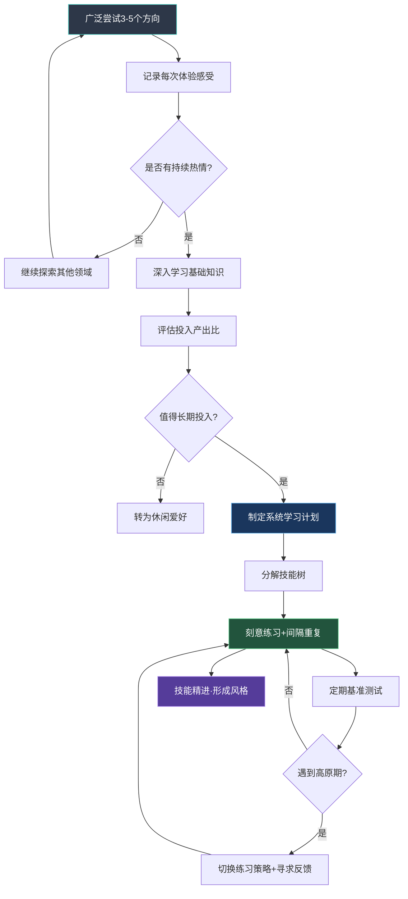

## 三、技能培养的科学方法

掌握一门新技能，靠的不是天赋或运气，而是遵循大脑学习规律的科学方法。认知心理学和神经科学在过去半个世纪的研究，已经为我们绘制了一张清晰的"技能习得路线图"——从刻意练习到记忆巩固，从元认知调控到心理模拟，每一个环节都有对应的科学原理和可操作的策略。

本节将从六个维度系统展开：技能习得的底层理论、学习曲线与高原期突破、认知层面的学习策略、技能分解与进度追踪、动机与习惯维持、以及常见误区与纠偏。掌握这些方法，你就能将任何兴趣爱好从"玩玩而已"提升到"真正精通"。

### 3.1 刻意练习：技能提升的核心引擎

心理学家安德斯·埃里克森（Anders Ericsson）在长达30年的研究中，对小提琴手、国际象棋大师、外科医生、运动员等领域的顶尖从业者进行了系统考察，提出了"刻意练习"（Deliberate Practice）理论。这项研究的核心结论是：**卓越不是天赋的产物，而是正确练习的累积结果。**

与简单重复不同，刻意练习具有五个不可分割的特征：

#### 3.1.1 明确而具体的目标

每次练习都必须有清晰、可衡量的目标。"练习弹琴"是模糊的，"用正确的指法在80BPM速度下流畅弹奏这8小节的和弦进行"才是有效的。明确的目标将练习从"消耗时间"转变为"投资时间"。

**实操方法**：练习前用一句话写下今天的具体目标，练习结束后对照检查是否达成。这个微小的动作能将练习效率提升30%以上——因为它迫使你在开始前就思考"我需要改进什么"，而不是漫无目的地重复。

#### 3.1.2 高度专注的投入

埃里克森发现，即使是柏林音乐学院最优秀的小提琴学生，每天真正高质量的刻意练习时间也不超过4-5小时，且通常分成2-3个时段。更关键的是，那些被认为"有天赋"但实际上成就平平的学生，往往练习时间更长，但质量更低——他们在"舒适区"里用低专注度重复已经会的东西。

神经科学解释了这一点：专注状态下，大脑前额叶皮层高度激活，突触可塑性增强，新的神经连接更容易形成。而分心状态下，大脑在"自动模式"运行，学习效率断崖式下降。

**实操方法**：

- 采用"番茄工作法"变体：25分钟全神贯注练习 + 5分钟完全休息
- 练习前清除所有干扰源（手机静音、关闭通知、告知家人）
- 如果发现自己走神，立刻停下来休息5分钟，而不是在半专注状态下继续

#### 3.1.3 即时且具体的反馈

反馈是学习的"导航系统"。没有反馈的练习，就像闭着眼睛开车——你可能在错误的方向上走得很远，却浑然不觉。

反馈的来源可以分三个层级：

| 反馈层级 | 来源 | 延迟时间 | 适合阶段 |
|---------|------|---------|---------|
| 自我反馈 | 录音录像回看、自检清单 | 即时-几分钟 | 所有阶段 |
| 同伴反馈 | 学习伙伴、社群互评 | 几小时-1天 | 入门-进阶 |
| 专家反馈 | 教练、导师、专业评审 | 数天-1周 | 进阶-精通 |

**关键原则**：反馈必须"具体"。"弹得不好"是无效反馈；"第15-16小节的跨指过渡有卡顿，建议放慢速度单独练习这个动作20次"才是有效反馈。

#### 3.1.4 持续走出舒适区

练习内容必须略高于当前能力水平。心理学家列夫·维果茨基将这个区域称为"最近发展区"（Zone of Proximal Development）——你目前不会、但通过努力可以学会的区域。

**判断标准**：如果你练习时感到轻松自如、不需要思考，说明你在舒适区；如果你感到有一定难度但能通过集中注意力完成，说明你在学习区；如果你完全无法理解或执行，说明你在恐慌区。

#### 3.1.5 针对薄弱环节的系统训练

刻意练习不是"从头到尾完整弹一遍"，而是把整首曲子拆成小段，找到最薄弱的环节，针对性地反复练习。埃里克森研究发现，顶尖表演者的练习方式与普通人有根本区别——他们花70%以上的时间在"做不好的部分"，而普通人花70%的时间在"已经会的部分"。

**实操方法**：

1. 完整演奏/执行一遍，用红笔标记所有出错或不满意的地方
2. 将问题段落单独拿出来，放慢50%的速度反复练习
3. 逐渐加速到目标速度
4. 将修复后的段落重新放回整体中检验

### 3.2 学习曲线与高原期突破

任何技能的学习都不是线性上升的，而是呈现出"快速进步→高原期→突破→再进步"的波浪形曲线。理解这条曲线，是避免在最该坚持的时候放弃的关键。

#### 3.2.1 学习曲线的四个阶段

| 阶段 | 特征 | 持续时间 | 心理状态 | 关键策略 |
|------|------|---------|---------|---------|
| 新手红利期 | 进步极快，每次练习都有明显提升 | 1-4周 | 兴奋、成就感强 | 趁热打铁，建立习惯 |
| 第一高原期 | 进步放缓，开始感到枯燥 | 2-8周 | 焦虑、自我怀疑 | 切换练习方式，寻找新挑战 |
| 突破期 | "突然开窍"，能力跃升 | 数天-数周 | 欣喜、信心增长 | 巩固新能力，提高标准 |
| 后续高原期 | 再次放缓，需更高层次突破 | 数周-数月 | 成熟、理性 | 精细化训练，寻求专家指导 |

#### 3.2.2 高原期的神经科学本质

很多人在高原期放弃，认为自己"没有天赋"。实际上，高原期是大脑在进行关键的内部重组：

**突触修剪**（Synaptic Pruning）：大脑在淘汰不重要的神经连接，强化重要的神经连接。这就像修剪果树——剪掉多余的枝条，才能让养分集中到主干，结出更好的果实。

**髓鞘质化**（Myelination）：频繁使用的神经通路会被一层叫做"髓鞘质"的脂肪物质包裹，信号传导速度提升100倍。这个过程需要时间，但一旦完成，技能将变得自动化和流畅。

**模式识别升级**：大脑在底层悄悄建立更高级的模式识别能力。你可能感觉不到明显进步，但大脑正在为下一次跃升积累"临界质量"。

#### 3.2.3 突破高原期的六种方法

1. **改变练习模式**：如果你一直在慢练，尝试快速挑战；如果你一直在完整练习，尝试分段精练；如果你一直在单独练习，尝试与人合练。

2. **降低速度，回归基础**：高原期往往是因为基础功不够扎实。回到最基础的练习，放慢速度，关注每一个细节。

3. **录制对比**：录制当前水平的视频/音频，与一个月前的进行对比。很多时候进步在发生，只是你感受不到。

4. **引入新刺激**：学习一个相关但不同的子技能。例如吉他手在和弦转换遇到瓶颈时，可以先学习一段指弹旋律，换一种方式锻炼手指灵活性。

5. **寻求外部反馈**：找一位水平更高的老师或同伴进行"诊断式"练习，他们往往能一眼看出你卡在哪里。

6. **战略性休息**：有时候"不做"比"做"更有效。休息2-3天后回来，大脑完成了后台整合，你可能会发现自己"突然进步了"。

### 3.3 高效学习的认知策略

刻意练习解决了"怎么练"的问题，而认知策略解决"怎么学"的问题——如何让知识和技能更牢固地存储在大脑中。

#### 3.3.1 间隔重复（Spaced Repetition）

德国心理学家赫尔曼·艾宾浩斯在1885年发现了遗忘曲线：新学的知识在20分钟后遗忘42%，1小时后遗忘56%，1天后遗忘74%。但如果你在即将遗忘的"临界点"进行复习，记忆就会被强化，下次遗忘的速度会更慢。

这就是间隔重复的核心原理：**在最佳时间点复习，用最少的复习次数获得最长的记忆保持。**

| 复习轮次 | 最佳间隔 | 记忆保持效果 |
|---------|---------|------------|
| 第1次学习后 | 1天 | 保持率从26%提升至80%+ |
| 第2次复习后 | 3天 | 保持率稳定在85%+ |
| 第3次复习后 | 7天 | 保持率稳定在90%+ |
| 第4次复习后 | 14天 | 保持率趋近长期记忆 |
| 第5次复习后 | 30天 | 几乎永久记忆 |

**在技能培养中的应用**：不只是知识需要间隔重复，动作技能同样需要。今天学了新的和弦指法，明天必须复习，三天后再复习，一周后再巩固。很多初学者的问题不是"学得太少"，而是"复习不够"——学了新的忘了旧的，永远在原地踏步。

**工具推荐**：Anki（免费开源的记忆卡片软件）内置了科学的间隔重复算法，适用于乐理知识、外语词汇、摄影参数等需要记忆的内容。

#### 3.3.2 交错练习（Interleaving）

直觉告诉我们，练习应该"一次专注一件事"——先练好和弦A，再练和弦B，最后练和弦C。但认知科学的研究结论恰恰相反：**将不同类型的内容混合练习（交错练习），长期效果显著优于集中练习。**

加州大学洛杉矶分校的一项研究让两组学生学习不同画家的风格：A组一次只学一位画家（集中练习），B组混合学习多位画家（交错练习）。短期测试中A组表现更好，但一周后的测试中，B组的成绩比A组高出40%以上。

**原理**：交错练习迫使大脑在不同模式之间切换，加强了"辨别"和"分类"能力——这恰恰是真正掌握一门技能的核心能力。

**在技能培养中的应用**：

- 学吉他：不要连续一个月只练和弦，而是在一次练习中混合和弦转换、节奏型、指弹旋律
- 学摄影：不要连续拍100张人像，而是在一次外出中交替拍人像、风景、静物
- 学画画：不要连续画10个苹果，而是交替画苹果、杯子、书本（不同形状和质感）

#### 3.3.3 记忆巩固与睡眠

学习发生在练习时，但技能的"固化"发生在睡眠中。神经科学的突破性研究表明，睡眠不是大脑的"关机"状态，而是一个高度活跃的"后台整理"过程。

**睡眠中的大脑在做什么**：

1. **海马体→皮层转移**：白天学到的新技能暂时存储在海马体中，睡眠时会被转移到大脑皮层进行长期存储。这就像把临时文件从U盘拷贝到硬盘。

2. **突触巩固**：睡眠中的慢波睡眠（深度睡眠）阶段，大脑会"重放"白天的练习——神经元以相同的顺序、更快的速度重新激活，强化相关的神经通路。

3. **选择性遗忘**：睡眠还会帮助大脑"清理"不重要的信息，让真正重要的技能信号更加突出。

**实操建议**：

- **练习后保证7-8小时睡眠**，尤其是练习了高难度新技能的当天
- **睡前30分钟做轻度复习**效果极佳——大脑会在睡眠中优先巩固睡前接触的信息（称为"睡前效应"）
- **午睡20-30分钟**也能起到部分巩固作用，适合中午练习后的恢复
- **避免熬夜练习**——凌晨2点练习2小时，效果不如早睡早起后练1小时

#### 3.3.4 类比与心智模型

单纯记忆孤立的知识点效率很低，而将新知识与已有知识建立"类比"和"连接"，能大幅提升理解和记忆深度。

**心智模型**（Mental Model）是你对某个领域运作方式的内在理解框架。高手和新手的根本区别不在于"知道多少"，而在于"心智模型的质量"——高手能快速识别模式、做出判断，新手只能看到零散的信息。

**构建心智模型的方法**：

- **类比法**：学习摄影曝光时，将光圈比作水龙头开口大小，快门速度比作开水时间，ISO比作水管粗细——三个参数共同决定"水量"（曝光量）
- **对比法**：同时学习两个相似但不同的概念，通过对比加深理解——比如"大调和小调的区别"、"光圈优先和快门优先的适用场景"
- **教给别人**：费曼学习法的核心——如果你不能用简单的话向一个外行解释清楚，说明你自己还没有真正理解

#### 3.3.5 认知负荷管理

认知心理学家约翰·斯威勒（John Sweller）提出的认知负荷理论指出，人的工作记忆容量极为有限——同一时间只能处理4±1个"信息块"。超过这个容量，学习效率就会急剧下降。

**三类认知负荷**：

| 类型 | 来源 | 举例 | 管理策略 |
|------|------|------|---------|
| 内在负荷 | 学习材料本身的复杂度 | 一首高难度的曲子 | 分解为小段，逐段攻克 |
| 外在负荷 | 不良的教学/练习设计 | 一次学习太多新概念 | 简化信息，去除干扰 |
| 相关负荷 | 有效学习所需的心智努力 | 主动回忆、对比分析 | 保留并优化这类负荷 |

**实操策略**：

- **分块学习**（Chunking）：将复杂的技能分解为3-5个"块"，每次只专注一个块。例如学做菜，先只练刀工，再只练火候，最后才综合。
- **脚手架策略**：初期使用辅助工具降低认知负荷（如吉他初学者使用变调夹、钢琴初学者贴指法标签），待基本能力形成后逐步移除。
- **避免多任务**：练习时不要同时"学新的+复习旧的"——先完成一种，再切换到另一种。

#### 3.3.6 心理模拟与可视化

心理模拟（Mental Rehearsal）是指在脑海中生动地"演练"某个动作或场景。这听起来像玄学，但有坚实的神经科学支撑：**大脑在想象一个动作时，激活的神经回路与实际执行该动作时高度重叠。**

哈佛医学院的一项经典实验让两组人练习钢琴曲：A组实际弹奏，B组只在脑海中想象弹奏（手指不动）。一周后测试，B组虽然没有实际碰过琴键，但他们的大脑运动皮层已经发生了可观测的变化，弹奏准确度也显著高于零基础对照组。

**心理模拟的最佳实践**：

1. **闭眼，想象自己正在执行目标技能**——尽可能调动视觉、听觉、触觉、甚至嗅觉
2. **慢动作播放**——在脑海中以正常速度的50%演练每个细节
3. **感受肌肉运动**——虽然手指没有实际动弹，但想象手指按下的感觉
4. **每天5-10分钟**——在通勤、睡前、等待时都可以进行

**适用场景**：运动类技能（挥拍、投篮、游泳动作）、表演类技能（演讲、演奏）、甚至烹饪流程（在脑海中"走"一遍整个操作流程）。心理模拟不能替代实际练习，但可以作为有效补充——尤其是在无法实际练习的场合（出差、伤病、天气不好）。

### 3.4 元认知与自我调节学习

元认知是"关于认知的认知"——对自己学习过程的觉察和调控能力。研究表明，元认知能力的差异是区分"高效学习者"和"低效学习者"的最强预测因素，其影响力甚至超过智商。

元认知能力分为三个阶段，形成一个完整的自我调节循环：

#### 3.4.1 计划阶段（学习前）

在开始练习之前，花3-5分钟回答以下问题：

- **目标**：今天具体要提升什么？（越具体越好）
- **策略**：我打算用什么方法？（分段练习？慢练？对比练习？）
- **预估**：这个练习可能遇到什么困难？我如何应对？
- **时间**：我打算练多久？什么时候休息？

这个"元认知启动"步骤看似浪费时间，但普林斯顿大学的研究表明，它能将后续练习的效率提升20-30%。

#### 3.4.2 监控阶段（学习中）

在练习过程中，持续进行自我检查：

- 我现在投入程度如何？（1-10分自评）
- 我正在做的事情是否与计划目标一致？
- 我是否进入了舒适区？（如果是，需要提高难度）
- 我是否进入了恐慌区？（如果是，需要降低难度或分解任务）

**实操技巧**：设定手机闹钟，每15-20分钟响一次。铃声响起时暂停，花30秒做上述自评。这个"元认知检查点"能有效防止练习变成"无意识的机械重复"。

#### 3.4.3 评估阶段（学习后）

每次练习结束后，花5分钟做总结：

- 今天的目标达成了吗？达成/未达成的原因是什么？
- 哪个部分进步最大？哪个部分仍有问题？
- 下次练习需要调整什么？
- 我的情绪和状态如何？疲劳/焦虑是否影响了表现？

**工具推荐**：准备一本"练习日志"，每天用3-5行记录以上内容。坚持一个月后回看，你会对自己的学习模式有惊人的洞察——哪些时间段效率最高、哪些类型的练习最有效、哪些因素会干扰你的表现。

### 3.5 社会学习与外部资源

阿尔伯特·班杜拉（Albert Bandura）的社会学习理论指出，人类70%以上的学习是通过"观察他人"完成的，而非亲身试错。在兴趣爱好培养中，善用社会学习能大幅缩短学习曲线。

#### 3.5.1 寻找合适的榜样

| 榜样层级 | 特征 | 适合阶段 | 寻找方式 |
|---------|------|---------|---------|
| 同级伙伴 | 水平相近，可以互相激励 | 所有阶段 | 社群、线下活动 |
| 进阶前辈 | 比你高1-2个层次，经验可参考 | 入门-进阶 | 社群、课程助教 |
| 专业导师 | 系统化的知识和个性化指导 | 进阶-精通 | 付费课程、一对一 |
| 顶尖大师 | 激发灵感和长期愿景 | 所有阶段 | 作品观摩、纪录片 |

**关键原则**：初学者最容易犯的错误是只关注"顶尖大师"。大师的作品虽然震撼，但他们的方法论对初学者而言往往"太远"——你无法从一个钢琴大师的演奏中学习基础指法。最高效的榜样是"比你高一两步"的人，他们的经验和教训对你最有参考价值。

#### 3.5.2 构建学习社群

研究表明，有学习伙伴的人坚持学习的可能性比独自学习的人高出65%。社群提供的不仅是资源，更是"社会承诺"和"归属感"——当你知道每周六有一群人在等你一起练习时，你缺席的心理成本会大幅增加。

**高效参与社群的方式**：

- **先贡献，后索取**：分享你的心得、整理有用的资源、帮助比你更新的新手
- **找到"问责伙伴"**：与1-2个人建立互相监督的关系，每周互相汇报进度
- **参加线下活动**：线上社群容易"潜水"，线下面对面的互动产生的承诺感更强
- **定期公开展示**：在社群中分享你的作品/进步记录，公众承诺是最好的动力

#### 3.5.3 教学相长

当你学到一定程度（通常入门3-6个月后），尝试向他人传授你的知识和技能。认知心理学中的"生成效应"（Generation Effect）表明，**主动输出知识比被动输入知识更能促进深度学习和长期记忆**——差距高达40-50%。

具体方式包括：在社群中回答新手问题、写学习笔记发布到博客、录制短视频分享技巧、甚至只是向朋友"炫耀"你新学的技能。教学过程中你会发现自己的"知识盲点"——那些你以为自己懂了、但其实解释不清楚的部分。

### 3.6 技能分解与进度追踪

"技能"是一个宏观概念，落地到日常练习中，需要被拆解为可执行的微观动作。

#### 3.6.1 技能树分解法

将任何技能想象成一棵"技能树"：主干是核心能力，分支是子技能，叶子是具体动作。分解的粒度应该细到"单次练习可以完成"的程度。

以吉他为例：

| 层级 | 内容 | 练习单位 |
|------|------|---------|
| 主干 | 吉他演奏 | — |
| 分支1 | 和弦 | — |
| 子分支 | C和弦 | 15分钟 |
| 叶子 | 手指按弦力度 | 5分钟 |
| 叶子 | 和弦转换速度 | 10分钟 |
| 分支2 | 节奏 | — |
| 子分支 | 4/4拍基本节奏型 | 15分钟 |
| 叶子 | 右手扫弦力度控制 | 5分钟 |
| 叶子 | 节拍器跟练 | 10分钟 |

**实操步骤**：

1. 列出目标技能的3-7个主要分支（参考教程或请教老师）
2. 每个分支再拆分为3-5个子技能
3. 将每个子技能分解为可在一个练习时段（15-30分钟）内完成的具体任务
4. 标记每个任务的优先级（当前瓶颈优先）
5. 每周根据进度更新技能树

#### 3.6.2 量化进度追踪

"感觉进步了"不可靠，"数据证明进步了"才有说服力。为你的技能培养建立可量化的指标体系：

| 爱好类型 | 可量化指标 | 测量方式 |
|---------|-----------|---------|
| 乐器 | BPM（速度）、准确率、曲目数量 | 节拍器+录音 |
| 摄影 | 每月出片率、后期时间、他人评分 | 作品集+社群反馈 |
| 跑步 | 配速、距离、心率 | 运动手表/App |
| 绘画 | 完成时间、细节精度、作品数量 | 对比不同时期作品 |
| 语言 | 词汇量、对话时长、阅读速度 | 测试App+自测 |

**每两周做一次"基准测试"**：选择一个固定的测试任务（如一首特定的曲子、一张特定主题的照片），用相同条件执行并记录数据。两周后重复，对比变化。这种方法能让你在高原期也清楚地看到微小的进步。

#### 3.6.3 兴趣探索与技能培养的整合流程

从"广泛探索"到"深度精通"的完整路径如下：

### 3.7 动机维持与习惯系统

"知道怎么做"和"持续做到"之间，隔着一个巨大的鸿沟——动机管理。82%放弃兴趣爱好的人，不是因为方法不对，而是因为动机消退。

#### 3.7.1 理解动机的底层机制

自我决定理论（Self-Determination Theory）是目前动机心理学中最具影响力的理论框架，由爱德华·德西和理查德·瑞安提出。该理论指出，持久的内在动机来源于三种基本心理需求的满足：

| 心理需求 | 含义 | 在爱好培养中的体现 |
|---------|------|------------------|
| 自主感 | 感到自己在做选择，而非被迫 | 自己选择爱好方向和练习方式 |
| 胜任感 | 感到自己在进步、在变强 | 定期看到可量化的进步数据 |
| 归属感 | 感到与他人有连接和认同 | 加入社群，找到志同道合的伙伴 |

**三种需求缺一不可**：如果你被迫练习某种乐器（缺乏自主感），即使进步很快也难以持久；如果你自由选择但看不到进步（缺乏胜任感），很快就会失去兴趣；如果你独自练习无人分享（缺乏归属感），动力会逐渐枯竭。

#### 3.7.2 六种经验证的动机维持策略

**策略一：里程碑与奖励系统**

将长期目标分解为6-8个短期里程碑（每个2-4周可达），每达成一个给予自己一个小奖励。奖励不需要昂贵，但必须是"你真正想要的东西"——一顿好吃的、一场电影、一件新装备。

**策略二：成长档案**

建立一个"成长档案"，定期记录你的水平。方式可以是：每周录一段练习视频、每月拍一组对比照片、每季度做一个能力测试。当你想放弃时，翻看3个月前的记录——客观的进步证据是最强的动机恢复剂。

**策略三：社交承诺**

在社群中公开宣布你的目标和计划。心理学研究证实，公开承诺能将目标完成率从35%提升至65%以上。找一个"问责伙伴"，每周互相汇报进度。

**策略四：环境设计**

将爱好的"启动成本"降到最低。吉他放在沙发旁而不是收在柜子里，画具摊在桌上而不是锁在抽屉里，跑鞋放在门口而不是塞在鞋柜深处。行为心理学家BJ·福格的研究表明，**降低行为的启动难度比增强动机更有效**。

**策略五：变化与新鲜感**

在同一个爱好的框架内，周期性地切换"子方向"。摄影爱好者可以按月轮换主题（这个月专攻人像，下个月尝试街拍，第三个月挑战微距）。音乐爱好者可以按周切换风格。新鲜感的注入能有效对抗"边际效用递减"带来的倦怠。

**策略六：允许弹性**

不要追求"100%的纪律性"。设定"最低可接受标准"——即使状态最差的日子，也做最小程度的练习（弹10分钟琴、拍3张照片、跑1公里）。"两分钟法则"（告诉自己"只做两分钟"）利用了蔡格尼克效应——人们对于未完成的任务有天然的完成冲动，一旦开始就很难停下来。

#### 3.7.3 习惯回路设计

将兴趣爱好固化为习惯，需要精心设计"习惯回路"：

**触发信号的设计原则**：

- **时间触发**：每天晚上8:30是"吉他时间"，闹钟响起就开始
- **地点触发**：坐在书房那把特定的椅子上，就是"绘画时间"
- **行为触发**（习惯叠加）：吃完晚饭洗完碗后→立刻开始练习。将新习惯"挂载"在已有的稳定习惯后面，是最有效的习惯养成策略

**关键数据**：伦敦大学学院的研究表明，一个新习惯平均需要66天才能自动化（而非流行的"21天"说法），范围在18天到254天之间。不要因为"坚持了30天还没形成习惯"就气馁——这完全正常。

### 3.8 常见误区与科学纠偏

在技能培养过程中，一些看似合理的做法实际上违背了学习科学。以下是最高频的误区：

#### 误区一：追求"量"而忽视"质"

**表现**：每天练3小时但心不在焉，或者"从头到尾弹一遍"就算完成练习。

**纠偏**：30分钟的高质量刻意练习 > 3小时的无意识重复。练习时长不是目标，有效练习量才是。用"有效练习时长"（全神贯注的时间）而非"总时长"来衡量。

#### 误区二：只练"会的"不练"不会的"

**表现**：反复弹奏已经熟练的曲目，回避困难的新曲目。

**纠偏**：舒适区练习只能维持水平，不能提升水平。将70%的练习时间分配给薄弱环节，30%用于保持已掌握的内容。

#### 误区三：忽视反馈

**表现**：从不录音、从不录像、从不请教他人，"凭感觉"练习。

**纠偏**：没有反馈的练习就像在黑暗中射箭——你不知道偏了多远。至少每周录一次音/像，客观审视自己的表现。

#### 误区四：急于求成，跳过基础

**表现**：刚学两周吉他就要弹复杂的指弹曲，刚学摄影就要拍星空。

**纠偏**：基础不牢，地动山摇。在基础阶段多花30%的时间，后续进阶速度会快3倍以上。就像盖房子——地基花的时间看似"浪费"，但它决定了你能盖多高。

#### 误区五：一次性学太多

**表现**：同时开始学吉他、钢琴、架子鼓，或者同时学摄影、绘画、书法。

**纠偏**：认知资源是有限的。建议同一时期只深度投入1-2个爱好。等其中一个形成稳定习惯（至少3个月）后，再考虑增加新的。

#### 误区六：忽视休息和恢复

**表现**：每天高强度练习，不给自己休息日。

**纠偏**：肌肉和神经系统的修复发生在休息时，不是练习时。建议每周至少安排1-2天完全休息日。过度练习不仅会导致伤病，还会产生心理倦怠，让原本热爱的事情变得令人厌恶。

### 3.9 小结：科学方法的整合框架

将本节介绍的所有方法整合为一个可操作的日常练习框架：

| 时间 | 活动 | 对应方法 |
|------|------|---------|
| 练习前5分钟 | 写下今日目标，预估困难 | 元认知计划 |
| 练习中 | 聚焦薄弱环节，交替练习不同类型 | 刻意练习+交错练习 |
| 每15分钟 | 暂停自评专注度和进度 | 元认知监控 |
| 练习后5分钟 | 记录练习日志，评估目标达成 | 元认知评估 |
| 睡前10分钟 | 轻度回顾今日所学 | 记忆巩固 |
| 每两周 | 做一次基准测试 | 进度追踪 |
| 每月 | 翻看成长档案，调整计划 | 动机维持 |
| 每周1-2天 | 完全休息 | 恢复与巩固 |

掌握这些科学方法，你就拥有了将任何兴趣爱好从"入门"推向"精通"的完整工具箱。方法已经给出，剩下的就是——开始行动。
